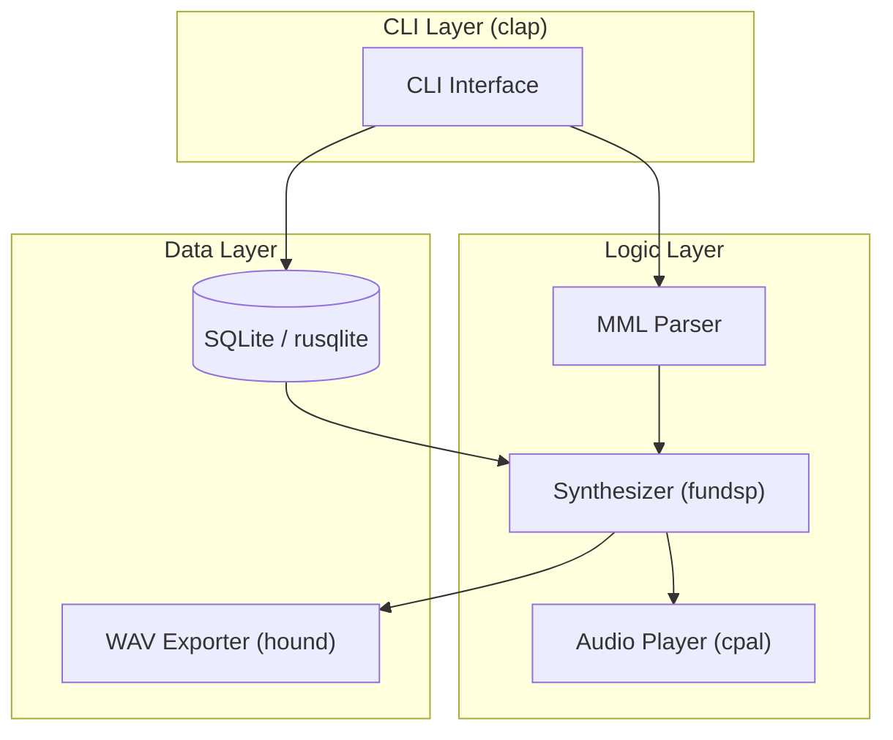

# BASIC-CLI-001 MML Synthesizer CLI 基本設計書

## 0. ドキュメント情報

| 項目 | 内容 |
|------|------|
| ドキュメントID | BASIC-CLI-001 |
| バージョン | 1.1.0 |
| ステータス | 承認待ち |
| 作成日 | 2026-01-10 |
| 最終更新日 | 2026-01-10 |
| 作成者 | Antigravity |

## 1. システム概要
本システムは、Music Macro Language (MML) 文字列を解析し、リアルタイムで音声合成・再生を行うCLIアプリケーションである。過去の演奏履歴を保存し、再演奏やWAVファイルへのエクスポートを可能にする。

## 2. システムアーキテクチャ

### 2.1 構成図


### 2.2 コンポーネント役割
| コンポーネント | 役割 |
|----------------|------|
| CLI Interface | ユーザー入力（引数・オプション）のパース、結果表示、プログレス表示 |
| MML Parser | MML文字列を解析し、音符データの内部表現（AST）に変換 |
| Synthesizer | 音符データを元にPCMサンプルを生成（サイン波・ノコギリ波・矩形波） |
| Audio Player | 生成されたPCMデータをオーディオデバイスに出力 |
| DB | 演奏履歴（MML, オプション, タイムスタンプ）の保存・管理 |
| WAV Exporter | 内部PCMデータをWAVフォーマットでファイル出力 |

## 3. 技術スタック

| レイヤー | 技術 | バージョン | 役割 |
|----------|------|------------|------|
| 言語 | Rust | 1.70+ | アプリケーション全体 |
| CLI Framework | clap | 4.5 | コマンドライン引数解析 |
| UI Library | indicatif | 0.18 | プログレスバー・スピナー表示 |
| Audio Synthesis | fundsp | 0.23 | 音声合成（DSPグラフ） |
| Audio I/O | cpal | 0.17 | オーディオストリーム制御 |
| Database | rusqlite | 0.38 | SQLite操作（bundled） |
| WAV I/O | hound | 3.5 | WAVファイル出力 |
| CI/CD | GitHub Actions | - | ビルド・テスト自動化 |

## 4. モジュール設計

```
src/
├── main.rs              # エントリポイント。CLIの起動とエラーハンドリング
├── cli/                 # CLI関連
│   ├── mod.rs           # CLIモジュールの定義
│   └── args.rs          # clapによる引数・サブコマンド定義
├── mml/                 # MML解析関連
│   ├── mod.rs           # MMLモジュールの定義
│   ├── ast.rs           # 音符・休符等のデータ構造（抽象構文木）
│   ├── parser.rs        # 再帰下降パーサーの実装
│   └── error.rs         # パースエラーの定義
├── audio/               # 音声合成・再生関連
│   ├── mod.rs           # オーディオモジュールの定義
│   ├── synthesizer.rs   # fundspによる波形生成ロジック
│   ├── player.rs        # cpalによる再生制御（ストリーム管理）
│   └── waveform.rs      # 波形タイプ（Sine, Sawtooth, Square）の定義
├── db/                  # 永続化関連
│   ├── mod.rs           # DBモジュールの定義
│   ├── schema.rs        # テーブル定義と初期化
│   └── history.rs       # 履歴データのCRUD操作
└── utils/               # 共通ユーティリティ
    └── mod.rs
```

## 5. 機能一覧

| 機能ID | 機能名 | 概要 | 優先度 |
|--------|--------|------|--------|
| F-001 | MMLパース | MML文字列を解析し音符データ配列に変換 | 必須 |
| F-002 | リアルタイム再生 | 音符データを逐次音声出力 | 必須 |
| F-003 | 波形選択 | サイン波、ノコギリ波、矩形波の切り替え | 必須 |
| F-004 | 音量調節 | 出力音量の0.0〜1.0範囲での調整 | 必須 |
| F-005 | BPM調節 | 演奏速度の調整（30〜300） | 必須 |
| F-006 | ループ再生 | 演奏終了後の自動リピート | 必須 |
| F-007 | 履歴自動保存 | 演奏成功時にMMLと設定をDBに保存 | 必須 |
| F-008 | 履歴一覧表示 | DBから過去の履歴を取得しリスト表示 | 必須 |
| F-009 | 履歴再生 | 保存済みIDを指定して演奏 | 必須 |
| F-010 | WAVエクスポート | 履歴データをWAVファイルとして保存 | 必須 |
| F-011 | エラー通知 | パースエラー等の内容と箇所をCLIに表示 | 必須 |
| F-012 | クリック音 | 各拍の先頭でのメトロノーム音再生 | 重要 |
| F-013 | 再生アニメーション | 再生中のプログレスバー表示 | 低 |

## 6. 画面（サブコマンド）一覧

CLIアプリケーションのため、サブコマンドを画面と定義する。

| 画面ID | サブコマンド | 名称 | 概要 |
|--------|--------------|------|------|
| S-001 | `play` | 演奏画面 | MMLを直接入力または履歴から指定して演奏。再生中はプログレスバーを表示。 |
| S-002 | `history` | 履歴一覧画面 | 保存された履歴をテーブル形式で表示。 |
| S-003 | `export` | 出力画面 | 指定した履歴をWAVファイルとして出力。完了メッセージを表示。 |

## 7. データモデル

### 7.1 データベースファイル保存場所
SQLiteデータベースファイルは、XDG Base Directory Specification に準拠し、以下の優先順位で保存場所を決定する。

| 優先順位 | パス | 条件 |
|----------|------|------|
| 1 | `$XDG_DATA_HOME/sine-mml/history.db` | `XDG_DATA_HOME` 環境変数が設定されている場合 |
| 2 | `~/.local/share/sine-mml/history.db` | Linux/macOS（デフォルト） |
| 3 | `%APPDATA%\sine-mml\history.db` | Windows |

- ディレクトリが存在しない場合は自動作成する
- Rustでは `dirs` クレートを使用して各OSに適したパスを取得する

### 7.2 履歴テーブル (history)
| カラム名 | 型 | 制約 | 説明 |
|----------|-----|------|------|
| id | INTEGER | PRIMARY KEY, AUTOINCREMENT | 履歴ID |
| mml | TEXT | NOT NULL | 入力されたMML文字列 |
| waveform | TEXT | NOT NULL | 波形タイプ (sine, sawtooth, square) |
| volume | REAL | NOT NULL | 音量 (0.0 - 1.0) |
| bpm | INTEGER | NOT NULL | テンポ (30 - 300) |
| created_at | TEXT | NOT NULL | 作成日時 (ISO 8601 形式: YYYY-MM-DD HH:MM:SS, UTC) |

## 8. インターフェース設計

### 8.1 CLI引数仕様

#### `play` サブコマンド
- `mml`: 位置引数 (String, Optional)
- `--history-id`: 履歴から再生 (i64, Optional)
- `--waveform`, `-w`: 波形 (Enum: sine, sawtooth, square, Default: sine)
- `--volume`, `-v`: 音量 (f32, Default: 0.5)
- `--bpm`, `-b`: テンポ (u16, Default: 120)
- `--loop`: ループ再生フラグ
- `--metronome`: メトロノームフラグ

#### `history` サブコマンド
- 引数なし

#### `export` サブコマンド
- `--history-id`: 出力対象ID (i64, Required)
- `--output`, `-o`: 出力先パス (String, Required)

## 9. 未解決課題

| ID | 課題内容 | 対応方針 |
|----|----------|----------|
| I-005 | 同時発音（和音）の将来的な拡張性 | ASTおよびSynthesizerのインターフェースを複数チャンネル対応可能な設計にする。 |
| I-006 | 演奏中の動的なBPM変更 | MML内の `T` コマンドによるノート間でのBPM変更はサポートする。ただし、ノート発音中の連続的なBPM変更（アッチェレランド等）はPhase 1では非対応とし、将来的にfundspの `var` を用いた制御を検討する。 |

## 10. 仮定事項
- 【仮定】ユーザーは標準的なPCM出力が可能なOS環境（macOS, Windows, Linux）を使用している。
- 【仮定】MMLの文法はNuttX MML仕様に準拠するが、一部の高度なコマンド（和音等）はPhase 1では無視またはエラーとする。

## 11. 詳細設計書一覧
本基本設計書に基づき、以下の詳細設計書を作成する。

| ドキュメントID | 名称 | 概要 | パス |
|----------------|------|------|------|
| DET-MML-001 | MMLパーサー詳細設計 | 再帰下降パーサーのトークナイズ、パースロジック、エラーハンドリングの詳細 | [詳細設計](../detailed/mml-parser/) |
| DET-AUD-001 | オーディオエンジン詳細設計 | fundspグラフ構築、cpalストリーム管理、波形生成の詳細 | [詳細設計](../detailed/audio-engine/) |
| DET-DB-001 | データベース詳細設計 | SQLiteテーブル詳細、CRUD操作、マイグレーション手順の詳細 | [詳細設計](../detailed/database/) |
| DET-CLI-001 | CLIインターフェース詳細設計 | clap引数パース、indicatifによる表示制御の詳細 | [詳細設計](../detailed/cli-interface/) |

## 12. テスト戦略
| テスト種別 | 対象 | 内容 |
|------------|------|------|
| ユニットテスト | MMLパーサー | 多様なMML文字列入力に対するAST出力の正確性検証。境界値、エラーケースの網羅。 |
| ユニットテスト | オーディオエンジン | サンプルレート、音量係数、波形生成の数値的検証（ヘッドレス）。 |
| 統合テスト | 全体 | CLIサブコマンド（play, history, export）の正常系・異常系フローの検証。 |
| E2Eテスト | ユーザーフロー | 実際の演奏から履歴保存、WAV出力までの一連の操作。 |
