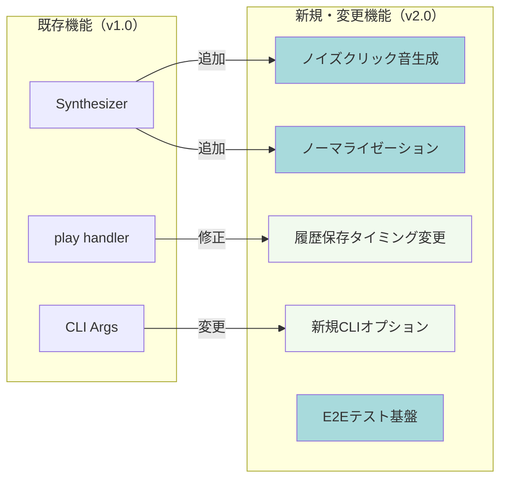
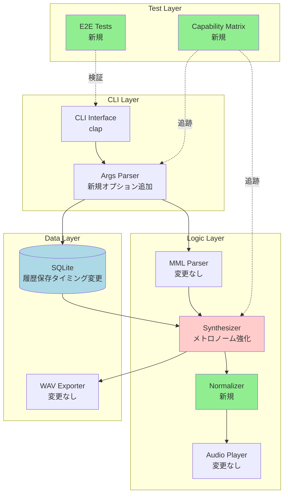
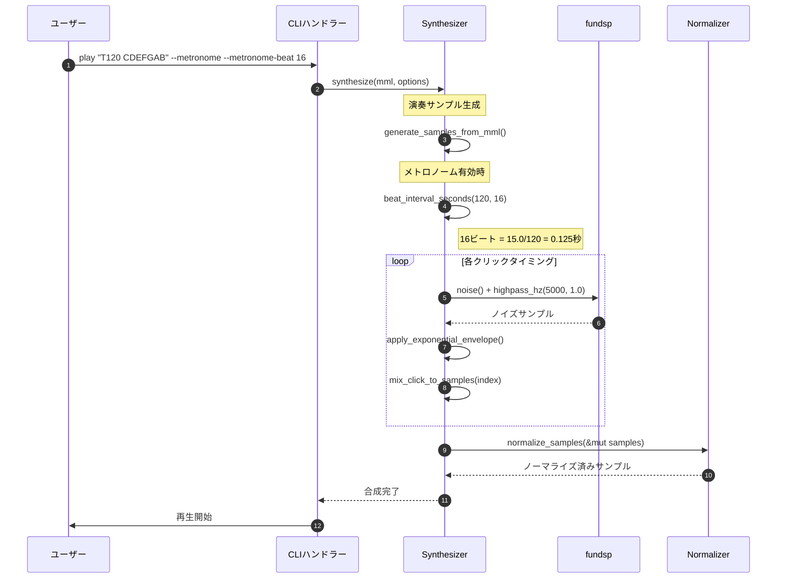
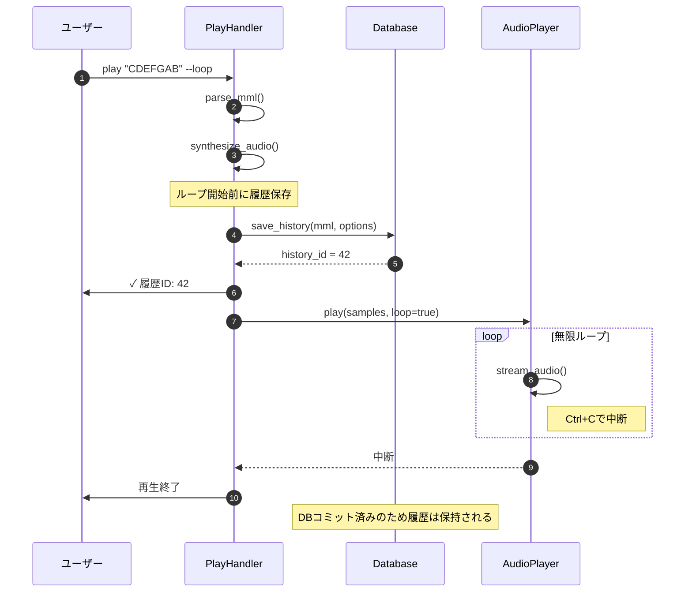
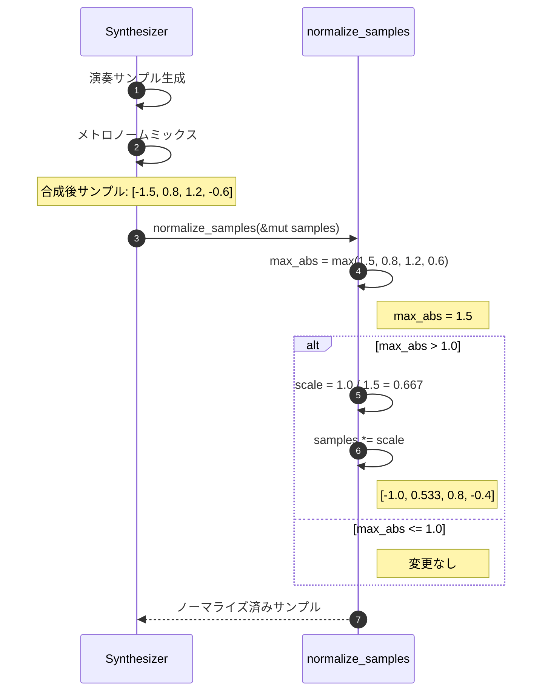

# BASIC-CLI-002 MML Synthesizer CLI 機能改善 基本設計書

## 0. ドキュメント情報

| 項目 | 内容 |
|------|------|
| ドキュメントID | BASIC-CLI-002 |
| バージョン | 1.0.0 |
| ステータス | ドラフト |
| 作成日 | 2026-01-11 |
| 最終更新日 | 2026-01-11 |
| 作成者 | basic-design-writer |
| 関連文書 | REQ-CLI-002_MML-Synthesizer-Enhancement.md (v1.0.0)<br>BASIC-CLI-001_MML-Synthesizer.md (v1.1.0) |

---

## 1. システム概要

### 1.1 目的

sine-mml v1.0の実装完了後、以下の課題を解決するための機能改善を行う：

1. **メトロノーム機能の完全実装**: スタブ状態のメトロノームを実用レベルに強化
2. **ループ再生時の履歴保存**: ループ再生時も確実に履歴DBへ保存
3. **インターフェース簡潔化**: BPMオプション削除によりMML内Tコマンドに一本化
4. **音質の安定化**: 音声クリッピング防止（ノーマライゼーション）
5. **開発品質の向上**: E2E統合テストとCLI-Backend対応マトリクスの導入

### 1.2 背景

REQ-CLI-002に記載された以下の課題に対応：

- メトロノーム機能が音を鳴らさない（スタブ実装）
- ループ再生時に履歴が保存されない
- `--bpm`オプションがMML内Tコマンドと重複
- メトロノームと演奏の合成時に音声クリッピングのリスク
- CLI-Backend間の統合漏れを検知する仕組みがない

### 1.3 スコープ

#### 対象範囲
- ノイズベースのクリック音生成（F-015）
- ビート選択機能（4/8/16ビート）（F-016）
- メトロノーム音量調節（F-017）
- ループ履歴登録（F-018）
- 音声クリッピング防止（F-019）
- `--bpm`オプション削除（F-005）
- CLI-Backend対応マトリクス作成（F-020）
- E2E統合テスト基盤構築（F-021）
- PRテンプレート更新（F-022）

#### 対象外
- MMLパーサーの拡張（新規コマンド追加等）
- ポリフォニック（和音）対応
- GUI版の開発

---

## 2. 既存システムとの関係

### 2.1 影響を受けるコンポーネント

| コンポーネント | 影響内容 | 変更レベル |
|---------------|----------|-----------|
| `src/cli/args.rs` | `--bpm`削除、`--metronome-beat`, `--metronome-volume`追加 | 中 |
| `src/audio/synthesizer.rs` | メトロノーム音生成、ノーマライゼーション処理追加 | 高 |
| `src/cli/handlers/play.rs` | 履歴保存タイミングの変更（ループ前に実行） | 中 |
| `tests/` | E2Eテストファイル追加 | 新規 |
| `docs/capabilities.md` | 対応マトリクス作成 | 新規 |

### 2.2 変更概要



---

## 3. システムアーキテクチャ

### 3.1 変更後の全体構成図



### 3.2 新規・変更コンポーネント一覧

| コンポーネント | 種別 | 役割 |
|---------------|------|------|
| `Synthesizer::generate_noise_click` | 新規関数 | ノイズベースのクリック音サンプル生成 |
| `Synthesizer::mix_metronome` | 新規関数 | メトロノームサンプルを演奏サンプルにミックス |
| `normalize_samples` | 新規関数 | PCMサンプルの最大値を1.0以下に制限 |
| `beat_interval_seconds` | 新規関数 | ビート値からクリック間隔を計算 |
| `play_handler` | 修正 | 履歴保存を無限ループ前に実行 |
| `PlayArgs` | 修正 | 新規フィールド追加（`metronome_beat`, `metronome_volume`） |
| `tests/cli_integration.rs` | 新規ファイル | E2E統合テスト |
| `docs/capabilities.md` | 新規ファイル | CLI-Backend対応マトリクス |

---

## 4. 技術スタック

### 4.1 既存技術（維持）

| レイヤー | 技術 | バージョン | 役割 |
|----------|------|------------|------|
| 言語 | Rust | 1.70+ | アプリケーション全体 |
| CLI Framework | clap | 4.5 | コマンドライン引数解析 |
| Audio Synthesis | fundsp | 0.23 | 音声合成（DSPグラフ） |
| Audio I/O | cpal | 0.17 | オーディオストリーム制御 |
| Database | rusqlite | 0.38 | SQLite操作 |
| WAV I/O | hound | 3.5 | WAVファイル出力 |
| UI Library | indicatif | 0.18 | プログレスバー |

### 4.2 新規追加（開発依存）

| レイヤー | 技術 | バージョン | 役割 |
|----------|------|------------|------|
| テストフレームワーク | assert_cmd | 2.0 | CLIバイナリテスト実行 |
| テストアサーション | predicates | 3.0 | 出力検証 |

### 4.3 技術選定理由

#### assert_cmd / predicates
- **選定理由**: Rust CLI標準テストツール、豊富なアサーション機能
- **代替案**: 手動スクリプトテスト → メンテナンス性低い
- **参考**: [assert_cmd公式ドキュメント](https://docs.rs/assert_cmd/)

#### fundsp::noise()
- **選定理由**: 既存ライブラリに含まれ、追加依存なし
- **代替案**: 手動ノイズ生成（XorShift等） → 実装コスト高
- **参考**: [fundsp::prelude::noise](https://docs.rs/fundsp/latest/fundsp/prelude/fn.noise.html)

---

## 5. モジュール設計

### 5.1 変更対象モジュール

#### `src/cli/args.rs`
**変更内容**:
- `PlayArgs`構造体に以下フィールド追加：
  - `metronome_beat: Option<u8>` (デフォルト: 4)
  - `metronome_volume: Option<f32>` (デフォルト: 0.3)
- `bpm: Option<u16>`フィールド削除
- clap属性でバリデーション追加：
  ```rust
  #[arg(long, value_parser = clap::value_parser!(u8).range(4..=16))]
  metronome_beat: Option<u8>,
  
  #[arg(long, value_parser = clap::value_parser!(f32).range(0.0..=1.0))]
  metronome_volume: Option<f32>,
  ```

#### `src/audio/synthesizer.rs`
**変更内容**:
1. **新規関数**: `generate_noise_click`
   ```rust
   fn generate_noise_click(
       sample_rate: f64,
       volume: f32,
   ) -> Vec<f32>
   ```

2. **新規関数**: `mix_metronome`
   ```rust
   fn mix_metronome(
       &self,
       samples: &mut Vec<f32>,
       bpm: u16,
       beat: u8,
       volume: f32,
   )
   ```

3. **新規関数**: `normalize_samples`
   ```rust
   pub fn normalize_samples(samples: &mut [f32])
   ```

#### `src/cli/handlers/play.rs`
**変更内容**:
- 履歴保存処理を`player.play()`呼び出し前に移動
- ループ再生時も履歴保存を確実に実行

### 5.2 新規モジュール

#### `tests/cli_integration.rs`
- CLIバイナリレベルのE2Eテスト
- 主要シナリオ: play, history, export
- テストケース例:
  - `test_play_with_metronome_16beat`
  - `test_loop_saves_history`
  - `test_normalization_prevents_clipping`

#### `docs/capabilities.md`
- CLI-Backend対応マトリクス
- 全CLIオプションの実装状態を可視化

### 5.3 ファイル構成（差分）

```diff
src/
├── audio/
│   └── synthesizer.rs          # 修正: メトロノーム生成、ノーマライゼーション追加
├── cli/
│   ├── args.rs                 # 修正: BPM削除、メトロノームオプション追加
│   └── handlers/
│       └── play.rs             # 修正: 履歴保存タイミング変更
+ tests/
+   └── cli_integration.rs      # 新規: E2Eテスト
+ docs/
+   └── capabilities.md         # 新規: 対応マトリクス
Cargo.toml                      # 修正: dev-dependencies追加
+ .github/
+   └── pull_request_template.md # 修正: 統合テスト項目追加
```

---

## 6. 機能一覧

### 6.1 新規機能

| ID | 機能名 | 概要 | 優先度 |
|----|--------|------|--------|
| F-015 | ノイズベースクリック音 | ノイズを使ったハイハット風クリック音 | 必須 |
| F-016 | ビート選択 | 16ビート、8ビート、4ビートの選択 | 必須 |
| F-017 | メトロノーム音量調節 | メトロノームの音量を個別に調節 | 必須 |
| F-018 | ループ履歴登録 | ループ再生時も履歴DBに保存 | 必須 |
| F-019 | 音声クリッピング防止 | 合成音の音量制限（ノーマライゼーション） | 必須 |
| F-020 | CLI-Backend対応マトリクス | 機能実装状況の可視化ドキュメント | 重要 |
| F-021 | E2E統合テスト | CLIレベルの自動テスト基盤 | 重要 |
| F-022 | PRテンプレート更新 | 統合テスト項目の追加 | 重要 |

### 6.2 既存機能の変更

| ID | 機能名 | 変更内容 |
|----|--------|----------|
| F-005 | BPM調節 | **削除** - MML内Tコマンドに統合 |
| F-006 | ループ再生 | **修正** - 履歴登録を追加 |
| F-012 | クリック音制御 | **大幅変更** - ノイズ音源、ビート選択、音量調節を実装 |

### 6.3 機能詳細

#### F-015: ノイズベースクリック音
- **入力**: BPM（MML内Tコマンドまたはデフォルト120）、メトロノーム音量
- **出力**: ノイズベースのクリック音サンプル（20-30ms、鋭い減衰）
- **処理**: fundsp `noise()` + 指数減衰エンベロープ + ハイパスフィルター（5kHz）
- **ビジネスルール**:
  - BR-030: クリック音の長さは25ms固定
  - BR-031: ノイズは毎回異なる（シード固定しない）
  - BR-032: ハイパスフィルターでローエンドカット

#### F-016: ビート選択
- **入力**: `--metronome-beat 4|8|16` オプション（デフォルト: 4）
- **出力**: 選択されたビートに応じたクリックタイミング
- **処理**: ビート値から音符長を計算し、クリック挿入位置を判定
- **ビジネスルール**:
  - BR-033: 4ビート = 4分音符ごと
  - BR-034: 8ビート = 8分音符ごと
  - BR-035: 16ビート = 16分音符ごと
  - BR-036: 無効な値はエラー

#### F-017: メトロノーム音量調節
- **入力**: `--metronome-volume 0.0-1.0` オプション（デフォルト: 0.3）
- **出力**: 調整されたメトロノーム音量
- **処理**: クリック音生成時に音量係数を適用
- **ビジネスルール**:
  - BR-037: 音量範囲は 0.0 - 1.0
  - BR-038: デフォルトは 0.3（控えめ）
  - BR-039: 範囲外の値は最も近い有効値にクランプ

#### F-018: ループ履歴登録
- **入力**: `--loop`フラグ + MML文字列
- **出力**: 履歴DBへの保存
- **処理**: ループ開始前（無限ループ突入前）に履歴保存を実行
- **ビジネスルール**:
  - BR-040: ループ再生でも新規MML入力時は履歴保存
  - BR-041: 履歴IDからの再生時は保存しない

#### F-019: 音声クリッピング防止
- **入力**: 合成後のPCMサンプルバッファ
- **出力**: ノーマライズされたサンプルバッファ（最大絶対値 ≤ 1.0）
- **処理**: 最大絶対値が1.0を超える場合のみ全サンプルを比例縮小
- **ビジネスルール**:
  - BR-042: 最大絶対値が1.0を超える場合のみノーマライズ
  - BR-043: 全サンプルに均等に適用（歪み防止）
  - BR-044: デジタルクリッピング（±1.0超過）を完全に防止

---

## 7. 画面（サブコマンド）一覧

### 7.1 `play` サブコマンド（変更）

**変更前（v1.0）**:
```bash
sine-mml play "CDEFGAB" --bpm 140 --metronome
```

**変更後（v2.0）**:
```bash
sine-mml play "T140 CDEFGAB" --metronome --metronome-beat 16 --metronome-volume 0.5
```

#### CLIオプション仕様（変更点のみ）

| オプション | 型 | デフォルト | 説明 | 変更種別 |
|-----------|-----|----------|------|----------|
| ~~`--bpm`~~ | ~~u16~~ | ~~120~~ | ~~テンポ指定~~ | **削除** |
| `--metronome-beat` | u8 | 4 | ビート選択（4, 8, 16） | **新規** |
| `--metronome-volume` | f32 | 0.3 | メトロノーム音量（0.0-1.0） | **新規** |
| `--metronome` | flag | false | メトロノーム有効化（機能強化） | **変更なし** |
| `--loop` | flag | false | ループ再生（履歴保存追加） | **変更なし** |

### 7.2 `history`, `export` サブコマンド（変更なし）

---

## 8. データモデル

### 8.1 データベーススキーマ（変更なし）

既存の `history` テーブルをそのまま使用。スキーマ変更なし。

| カラム名 | 型 | 制約 | 説明 |
|----------|-----|------|------|
| id | INTEGER | PRIMARY KEY, AUTOINCREMENT | 履歴ID |
| mml | TEXT | NOT NULL | MML文字列 |
| waveform | TEXT | NOT NULL | 波形タイプ |
| volume | REAL | NOT NULL | 音量 |
| bpm | INTEGER | NOT NULL | テンポ（MML内Tコマンドまたはデフォルト120） |
| created_at | TEXT | NOT NULL | 作成日時（ISO 8601） |

### 8.2 履歴保存タイミングの変更

**変更前（v1.0）**:
```
1. MML解析
2. 音声合成
3. 再生（ループ時は無限ループ）
4. 履歴保存 ← ループ時は到達しない
```

**変更後（v2.0）**:
```
1. MML解析
2. 音声合成
3. 履歴保存 ← ループ前に実行
4. 再生（ループ時は無限ループ）
```

---

## 9. インターフェース設計

### 9.1 CLI引数仕様（変更箇所）

#### `play` サブコマンド - 新規オプション

```rust
// src/cli/args.rs

#[derive(Parser, Debug)]
pub struct PlayArgs {
    // ... 既存フィールド ...
    
    /// ビート選択（4, 8, 16）
    #[arg(
        long,
        value_parser = clap::value_parser!(u8).range(4..=16),
        default_value = "4",
        help = "メトロノームのビート（4, 8, 16のみ有効）"
    )]
    pub metronome_beat: u8,
    
    /// メトロノーム音量
    #[arg(
        long,
        value_parser = clap::value_parser!(f32).range(0.0..=1.0),
        default_value = "0.3",
        help = "メトロノームの音量（0.0-1.0）"
    )]
    pub metronome_volume: f32,
    
    // 削除: pub bpm: Option<u16>,
}
```

### 9.2 内部API（新規関数シグネチャ）

#### ノイズクリック音生成

```rust
// src/audio/synthesizer.rs

/// ノイズベースのクリック音サンプルを生成
///
/// # Arguments
/// * `sample_rate` - サンプリングレート（Hz）
/// * `volume` - 音量係数（0.0-1.0）
///
/// # Returns
/// 25msのノイズクリック音サンプル配列
fn generate_noise_click(sample_rate: f64, volume: f32) -> Vec<f32> {
    // ノイズ生成 + 指数減衰エンベロープ + ハイパスフィルター
}
```

#### ビート間隔計算

```rust
/// ビート値から1クリックあたりの秒数を計算
///
/// # Arguments
/// * `bpm` - テンポ（BPM）
/// * `beat` - ビート値（4, 8, 16）
///
/// # Returns
/// クリック間隔（秒）
fn beat_interval_seconds(bpm: u16, beat: u8) -> f32 {
    match beat {
        4 => 60.0 / bpm as f32,      // 4分音符
        8 => 30.0 / bpm as f32,      // 8分音符
        16 => 15.0 / bpm as f32,     // 16分音符
        _ => unreachable!("validated by clap"),
    }
}
```

#### ノーマライゼーション

```rust
/// PCMサンプルをノーマライズ（最大絶対値を1.0以下に制限）
///
/// 最大絶対値が1.0を超える場合のみ、全サンプルを比例縮小する。
/// 1.0以下の場合は何もしない（音量を上げない）。
///
/// # Arguments
/// * `samples` - PCMサンプル配列（可変参照）
pub fn normalize_samples(samples: &mut [f32]) {
    let max_abs = samples.iter()
        .map(|s| s.abs())
        .fold(0.0_f32, f32::max);
    
    if max_abs > 1.0 {
        let scale = 1.0 / max_abs;
        samples.iter_mut().for_each(|s| *s *= scale);
    }
}
```

#### メトロノームミックス

```rust
/// メトロノームサンプルを演奏サンプルにミックス
///
/// # Arguments
/// * `samples` - 演奏サンプル（可変参照）
/// * `bpm` - テンポ
/// * `beat` - ビート値（4, 8, 16）
/// * `volume` - メトロノーム音量
fn mix_metronome(
    &self,
    samples: &mut Vec<f32>,
    bpm: u16,
    beat: u8,
    volume: f32,
) {
    let interval = beat_interval_seconds(bpm, beat);
    let click = self.generate_noise_click(self.sample_rate, volume);
    
    // クリックタイミングごとにサンプルをミックス
    // ...
}
```

---

## 10. 処理フロー

### 10.1 メトロノーム音生成フロー



### 10.2 ループ履歴保存フロー



### 10.3 ノーマライゼーションフロー



---

## 11. 非機能設計

### 11.1 性能設計

| ID | 要件 | 目標値 | 測定方法 |
|----|------|--------|----------|
| NFR-P-005 | ノーマライゼーションのオーバーヘッド | 5%以内（合成時間の） | ベンチマーク |
| NFR-P-006 | メトロノームミックスのレイテンシ | 増加なし（既存と同等） | オーディオバッファ測定 |
| NFR-P-007 | ループ履歴保存の追加レイテンシ | 50ms以内 | DB保存時間測定 |

### 11.2 エラーハンドリング

| エラーケース | 対応 | メッセージ例 |
|-------------|------|-------------|
| 無効なビート値（5等） | clapで検証拒否 | `error: invalid value '5' for '--metronome-beat <BEAT>': 4, 8, 16のいずれかを指定してください` |
| 音量範囲外（1.5等） | clapでクランプ | `warning: --metronome-volume clamped to 1.0` |
| ノーマライゼーション失敗 | 警告表示 + 元の音量で再生 | `warning: normalization failed, playing at original volume` |
| fundspノイズ生成失敗 | フォールバック（サイン波クリック） | `warning: using fallback sine click sound` |

### 11.3 ユーザビリティ設計

- **デフォルト値**: メトロノーム音量0.3、4ビート（控えめで邪魔にならない）
- **ヘルプテキスト**: `--help`で全メトロノームオプションを明確に説明
- **マイグレーションガイド**: `--bpm`削除時の代替方法（MML内Tコマンド）をドキュメント化

---

## 12. テスト戦略

### 12.1 E2Eテスト基盤設計

#### テストファイル構成

```
tests/
└── cli_integration.rs          # E2E統合テスト
    ├── test_play_with_metronome_4beat
    ├── test_play_with_metronome_8beat
    ├── test_play_with_metronome_16beat
    ├── test_metronome_volume_adjustment
    ├── test_loop_saves_history
    ├── test_normalization_prevents_clipping
    ├── test_bpm_option_removed
    └── test_invalid_beat_value_error
```

#### テストケース例

```rust
// tests/cli_integration.rs

#[test]
fn test_play_with_metronome_16beat() {
    let mut cmd = Command::cargo_bin("sine-mml").unwrap();
    cmd.arg("play")
       .arg("T120 C4 D4 E4")
       .arg("--metronome")
       .arg("--metronome-beat").arg("16")
       .arg("--metronome-volume").arg("0.5");
    
    cmd.assert()
       .success()
       .stdout(predicates::str::contains("✓ 再生完了"));
}

#[test]
fn test_loop_saves_history() {
    // テスト用DBパス設定
    std::env::set_var("SINE_MML_DB_PATH", "./test_history.db");
    
    let mut cmd = Command::cargo_bin("sine-mml").unwrap();
    cmd.arg("play")
       .arg("CDEFGAB")
       .arg("--loop")
       .timeout(Duration::from_secs(2)); // 2秒後に中断
    
    cmd.assert().success();
    
    // 履歴DB確認
    let db = Database::init().unwrap();
    let history = db.get_all().unwrap();
    assert!(history.iter().any(|e| e.mml == "CDEFGAB"));
    
    // クリーンアップ
    std::fs::remove_file("./test_history.db").ok();
}

#[test]
fn test_bpm_option_removed() {
    let mut cmd = Command::cargo_bin("sine-mml").unwrap();
    cmd.arg("play")
       .arg("CDEFGAB")
       .arg("--bpm").arg("140");
    
    cmd.assert()
       .failure()
       .stderr(predicates::str::contains("unexpected argument '--bpm'"));
}
```

### 12.2 テストカバレッジ

| テストレベル | 対象 | カバレッジ目標 |
|-------------|------|---------------|
| ユニットテスト | `generate_noise_click`, `normalize_samples`, `beat_interval_seconds` | 100% |
| 統合テスト | メトロノームミックス、履歴保存タイミング | 100% |
| E2Eテスト | 主要シナリオ（play, history, export） | 100% |

---

## 13. 詳細設計書一覧

本基本設計書に基づき、以下の詳細設計書を作成予定：

| # | 機能名 | 詳細設計書パス | ステータス |
|---|--------|---------------|-----------|
| 1 | ノイズベースクリック音生成 | `docs/designs/detailed/metronome/noise-click-generation.md` | 未着手 |
| 2 | ビート選択とタイミング計算 | `docs/designs/detailed/metronome/beat-selection.md` | 未着手 |
| 3 | メトロノーム音量調節 | `docs/designs/detailed/metronome/volume-control.md` | 未着手 |
| 4 | ループ履歴登録 | `docs/designs/detailed/history/loop-save-timing.md` | 未着手 |
| 5 | 音声クリッピング防止（ノーマライゼーション） | `docs/designs/detailed/audio/normalization.md` | 未着手 |
| 6 | CLIオプション変更（BPM削除） | `docs/designs/detailed/cli/bpm-removal.md` | 未着手 |
| 7 | E2E統合テスト基盤 | `docs/designs/detailed/testing/e2e-integration.md` | 未着手 |
| 8 | CLI-Backend対応マトリクス | `docs/designs/detailed/documentation/capability-matrix.md` | 未着手 |

---

## 14. 未解決課題・仮定事項

### 14.1 未解決課題

| ID | 課題 | 担当 | 期限 | 優先度 |
|----|------|------|------|--------|
| I-005 | fundspのノイズ+フィルター動作確認 | 開発チーム | 2026-01-14 | 高 |
| I-006 | ノーマライゼーションの音質評価 | 開発チーム | 2026-01-17 | 高 |
| I-007 | `--bpm`削除のマイグレーションガイド作成 | 開発チーム | 2026-01-20 | 中 |
| I-008 | E2Eテストの並列実行設定 | 開発チーム | 2026-01-24 | 低 |

### 14.2 仮定事項

- 【仮定】fundsp 0.23の`noise()`関数と`highpass_hz()`フィルターが期待通り動作する
- 【仮定】ノーマライゼーションによる音質劣化は許容範囲内（リスニングテストで検証）
- 【仮定】`--bpm`削除は破壊的変更のためメジャーバージョンアップ（v2.0.0）で実施
- 【仮定】E2Eテストの実行時間増加はCI最適化で対応可能

### 14.3 制約事項

| 制約 | 詳細 | 理由 |
|------|------|------|
| ノイズ生成 | fundspの`noise()`関数を使用 | 既存ライブラリとの一貫性 |
| ビート値制限 | 4, 8, 16のみ許可 | 一般的な音楽理論に準拠 |
| 後方互換性 | `--bpm`削除は破壊的変更 | メジャーバージョンアップで実施 |
| DB互換性 | 既存履歴テーブルスキーマ維持 | マイグレーション不要 |

---

## 15. 変更履歴

| バージョン | 日付 | 変更内容 | 担当者 |
|-----------|------|----------|--------|
| 1.0.0 | 2026-01-11 | 初版作成 | basic-design-writer |
