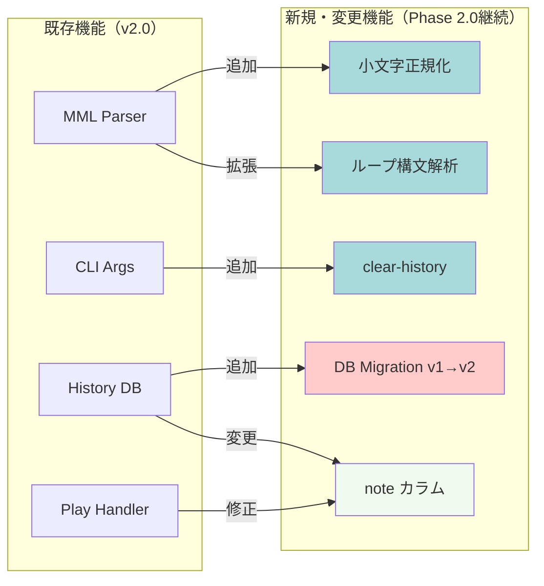
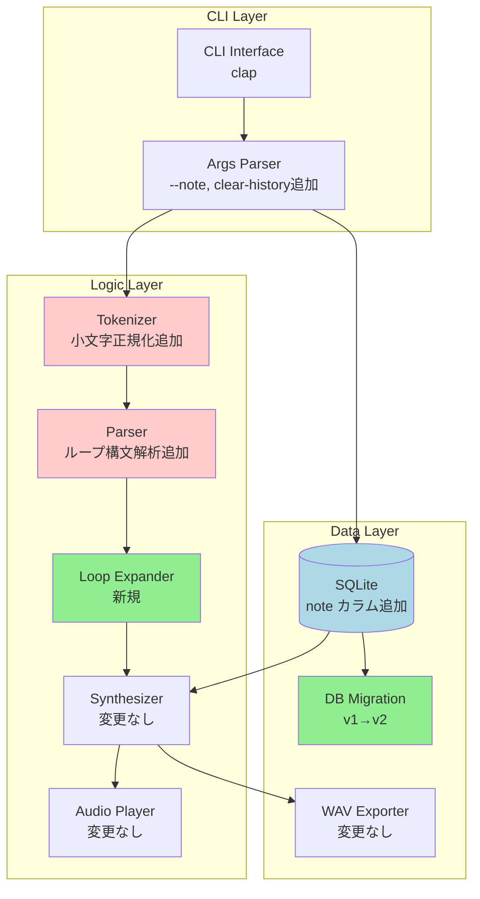
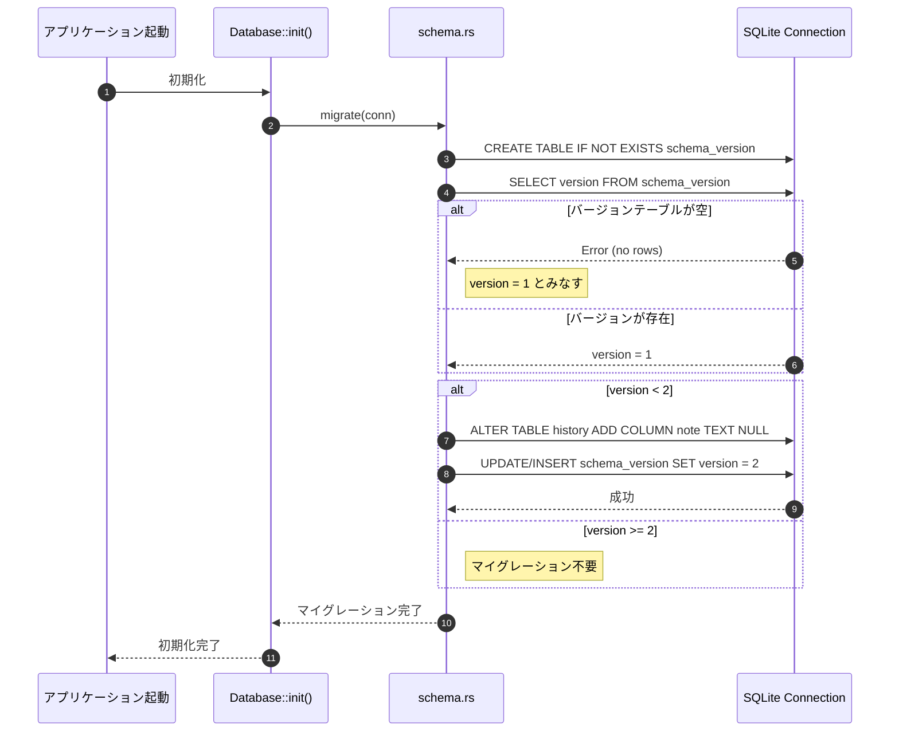
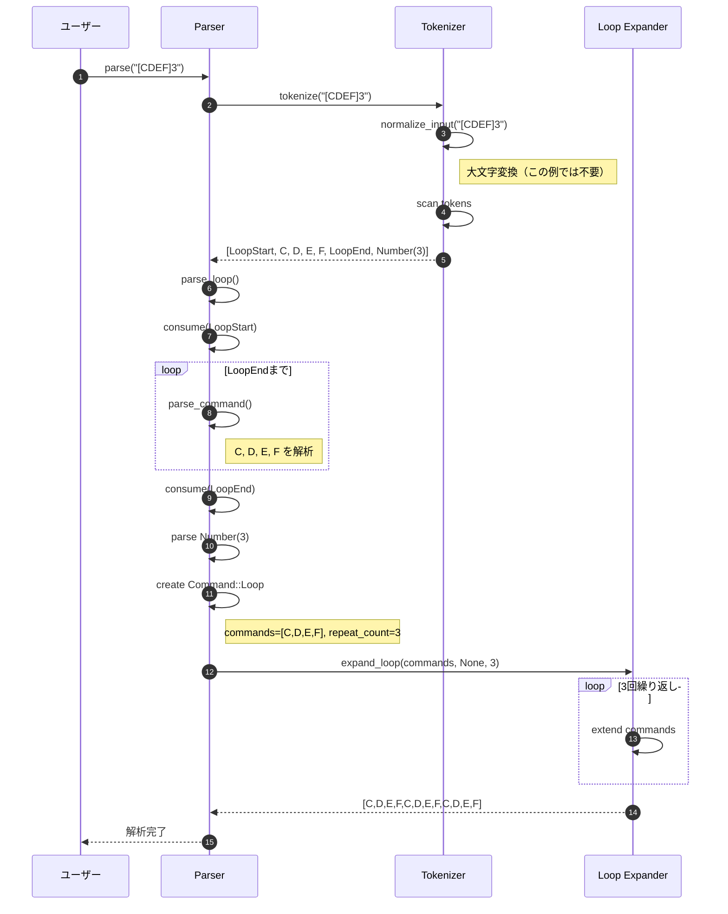
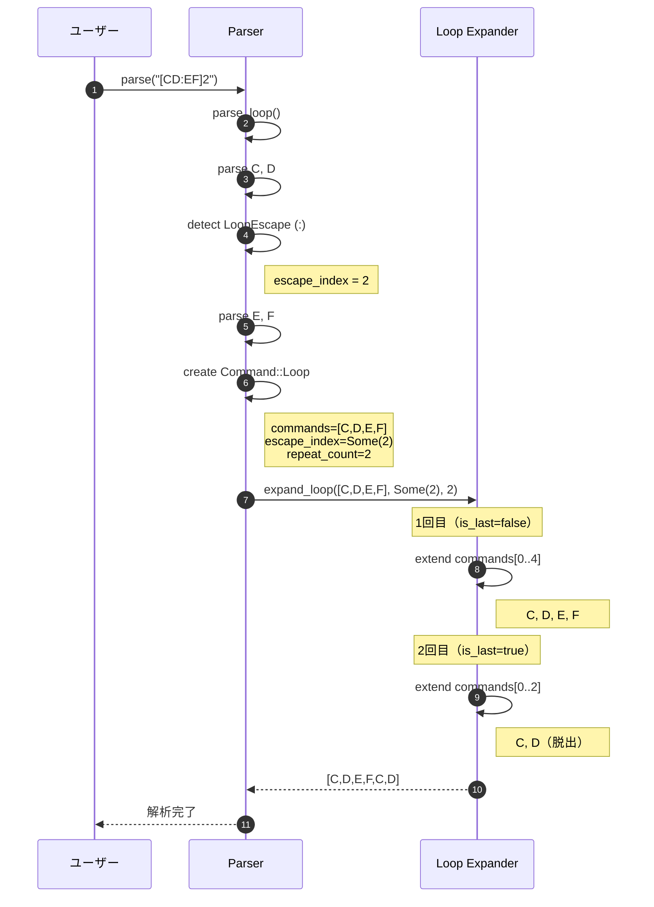
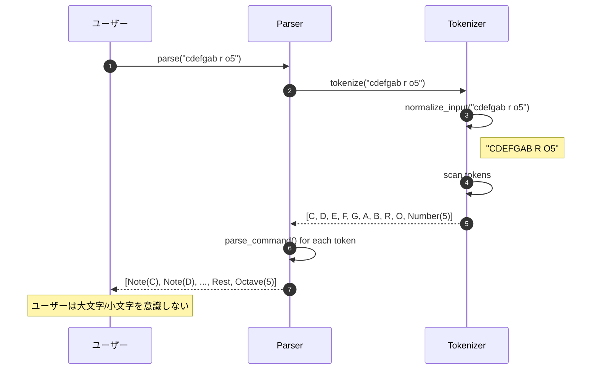
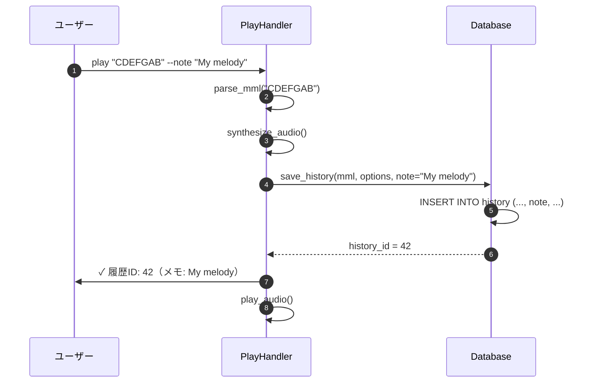
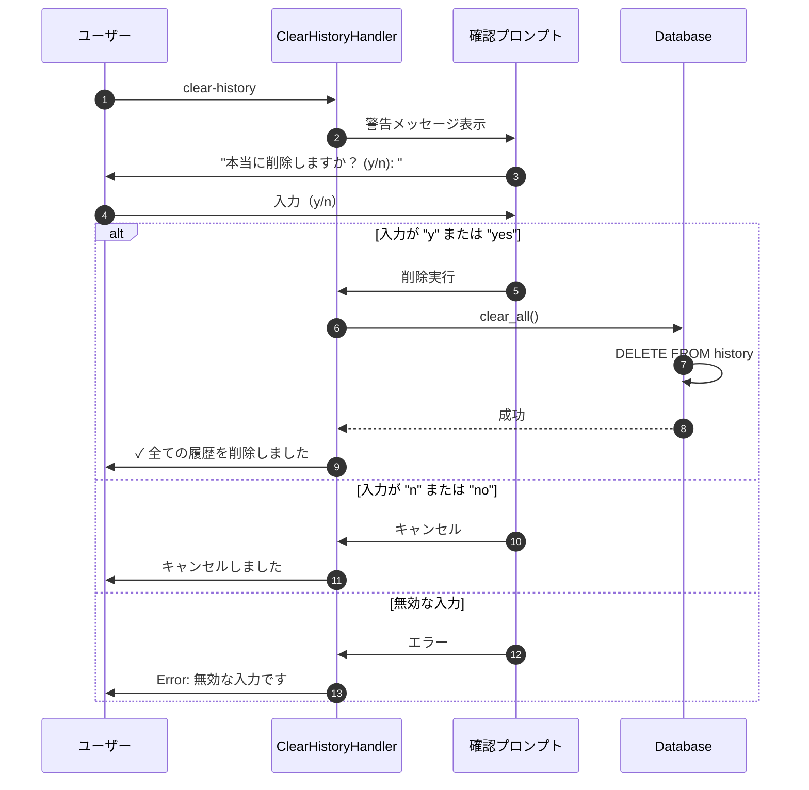
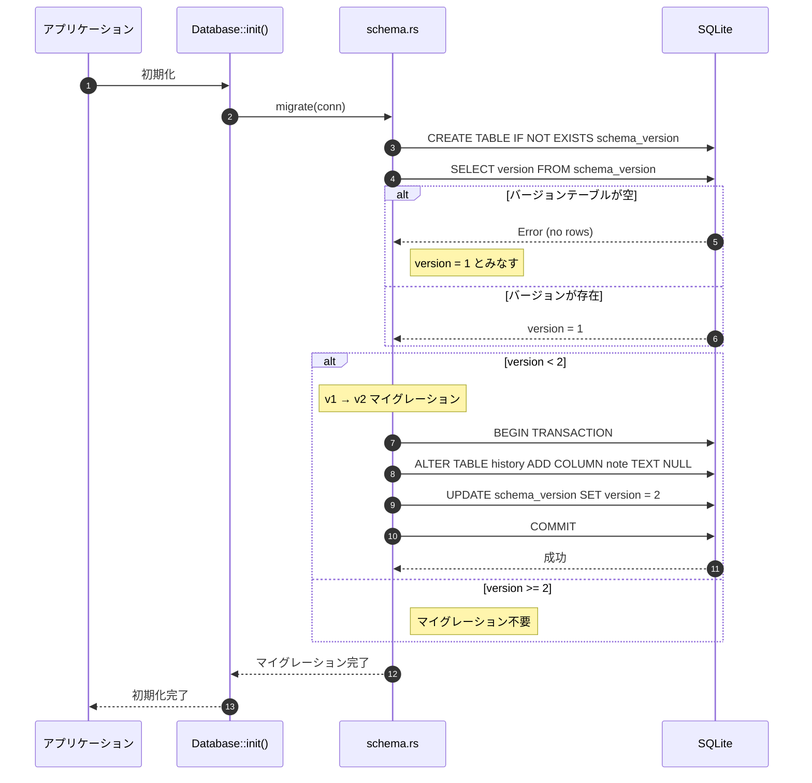

# BASIC-CLI-003 MML Synthesizer CLI MML構文拡張 基本設計書

## 0. ドキュメント情報

| 項目 | 内容 |
|------|------|
| ドキュメントID | BASIC-CLI-003 |
| バージョン | 1.0.0 |
| ステータス | ドラフト |
| 作成日 | 2026-01-11 |
| 最終更新日 | 2026-01-11 |
| 作成者 | basic-design-writer |
| 関連文書 | REQ-CLI-003_MML-Syntax-Extension.md (v1.0.0)<br>BASIC-CLI-001_MML-Synthesizer.md (v1.1.0)<br>BASIC-CLI-002_MML-Synthesizer-Enhancement.md (v1.0.0) |

---

## 1. システム概要

### 1.1 目的

sine-mml v2.0の実装完了後、ユーザビリティ向上とMML記述効率化のため、以下の機能拡張を行う：

1. **MMLループ構文の実装**: 繰り返しパターンを`[]`で簡潔に記述可能にする
2. **小文字MML記述の対応**: タイピング効率向上のため小文字での記述を許可
3. **履歴メモ機能の追加**: 履歴にメモを付与し、後で見返しやすくする
4. **履歴削除機能の追加**: 不要な履歴を一括削除可能にする

### 1.2 背景

REQ-CLI-003に記載された以下のユーザー要望に対応：

- **MMLループ構文の欠如**: 繰り返しパターンを毎回書く必要があり、MML文字列が冗長になる
- **大文字のみの記述制約**: MMLコマンドが大文字のみで、小文字での記述ができない（タイピング効率の低下）
- **履歴メモ機能の不在**: 履歴にメモを付けられず、後で見返したときに何の曲か分からない
- **履歴削除機能の不在**: 不要な履歴を削除する手段がなく、履歴が肥大化する

### 1.3 スコープ

#### 対象範囲
- MMLパーサーへのループ構文 `[]` の追加
- MMLパーサーへの小文字記述対応（正規化処理）
- CLIへの `--note` オプション追加
- DBスキーマへの `note` カラム追加（v1→v2マイグレーション）
- `clear-history` サブコマンドの追加
- 確認プロンプトの実装

#### 対象外
- ネストしたループ構文（`[[CDEF]2 GAB]3` 等）
- ループ回数の動的変更（MML内での変数指定等）
- 履歴の選択的削除（個別削除、条件付き削除等）
- 履歴のエクスポート/インポート機能

### 1.4 Phase 2.0との関係

本機能拡張はsine-mml v2.0の**継続開発**として位置づけられる：

- **Phase 1.0**: 基本機能実装（BASIC-CLI-001）
- **Phase 2.0**: 機能改善（BASIC-CLI-002） - メトロノーム強化、ノーマライゼーション、E2Eテスト
- **Phase 2.0（継続）**: MML構文拡張（本設計書） - ループ構文、小文字対応、履歴管理強化

---

## 2. 既存システムとの関係

### 2.1 影響を受けるコンポーネント

| コンポーネント | 影響内容 | 変更レベル |
|---------------|----------|-----------|
| `src/mml/parser.rs` | ループ構文解析、小文字正規化追加 | 高 |
| `src/mml/ast.rs` | `Command::Loop`バリアント追加 | 中 |
| `src/cli/args.rs` | `--note`オプション、`ClearHistory`サブコマンド追加 | 中 |
| `src/db/schema.rs` | `note`カラム追加、マイグレーション処理 | 高 |
| `src/db/history.rs` | `note`フィールド対応 | 中 |
| `src/cli/handlers.rs` | `clear_history_handler`追加、履歴表示にメモ列追加 | 中 |

### 2.2 変更概要図



---

## 3. システムアーキテクチャ

### 3.1 変更後の全体構成図



### 3.2 新規・変更コンポーネント一覧

| コンポーネント | 種別 | 役割 |
|---------------|------|------|
| `Tokenizer::normalize_input` | 新規関数 | 小文字を大文字に正規化 |
| `Parser::parse_loop` | 新規関数 | ループ構文`[]`の解析 |
| `Command::Loop` | 新規バリアント | ループコマンドのAST表現 |
| `expand_loop` | 新規関数 | ループを展開してコマンド列に変換 |
| `PlayArgs::note` | 新規フィールド | 履歴メモ（`Option<String>`） |
| `Command::ClearHistory` | 新規バリアント | 履歴削除サブコマンド |
| `clear_history_handler` | 新規関数 | 確認プロンプト付き履歴削除 |
| `migrate_v1_to_v2` | 新規関数 | DBスキーママイグレーション |

---

## 4. 技術スタック

### 4.1 既存技術（維持）

| レイヤー | 技術 | バージョン | 役割 |
|----------|------|------------|------|
| 言語 | Rust | 1.70+ | アプリケーション全体 |
| CLI Framework | clap | 4.5 | コマンドライン引数解析 |
| Audio Synthesis | fundsp | 0.23 | 音声合成（DSPグラフ） |
| Audio I/O | cpal | 0.17 | オーディオストリーム制御 |
| Database | rusqlite | 0.38 | SQLite操作 |
| WAV I/O | hound | 3.5 | WAVファイル出力 |
| UI Library | indicatif | 0.18 | プログレスバー |
| UI Library | comfy-table | 7.0 | テーブル表示 |

### 4.2 新規追加（なし）

本機能拡張では新規クレートの追加は不要。既存の技術スタックで実装可能。

### 4.3 技術選定理由

#### 小文字正規化: `str::to_uppercase()`
- **選定理由**: Rust標準ライブラリ、追加依存なし、Unicode対応
- **代替案**: 手動ASCII変換 → Unicode非対応
- **参考**: [Rust std::primitive::str](https://doc.rust-lang.org/std/primitive.str.html#method.to_uppercase)

#### ループ展開: 手動実装
- **選定理由**: 単純なロジック、外部ライブラリ不要
- **代替案**: マクロ展開ライブラリ → オーバースペック
- **実装方針**: ループ回数分コマンド列を複製、脱出ポイント処理

#### DB マイグレーション: `ALTER TABLE`
- **選定理由**: SQLite標準機能、既存データ保持
- **代替案**: テーブル再作成 → データ移行コスト高
- **参考**: [SQLite ALTER TABLE](https://www.sqlite.org/lang_altertable.html)

---

## 5. モジュール設計

### 5.1 変更対象モジュール

#### `src/mml/ast.rs`
**変更内容**:
- `Command` enumに`Loop`バリアント追加：
  ```rust
  pub enum Command {
      // 既存のバリアント...
      Note { pitch: Pitch, duration: Duration },
      Rest { duration: Duration },
      // ... 他のコマンド ...
      
      /// ループコマンド
      Loop {
          commands: Vec<Command>,
          escape_index: Option<usize>,
          repeat_count: usize,
      },
  }
  ```

#### `src/mml/parser.rs`
**変更内容**:
1. **トークナイザー前処理**: 入力文字列を大文字に正規化
   ```rust
   pub fn tokenize(input: &str) -> Result<Vec<TokenWithPos>, ParseError> {
       let normalized = input.to_uppercase();
       tokenize_impl(&normalized)
   }
   ```

2. **トークン定義追加**:
   ```rust
   pub enum Token {
       // 既存のトークン...
       LoopStart,      // [
       LoopEnd,        // ]
       LoopEscape,     // :
       Number(u32),    // 既存（ループ回数にも使用）
   }
   ```

3. **ループ解析関数追加**:
   ```rust
   fn parse_loop(&mut self) -> Result<Command, ParseError> {
       self.consume(Token::LoopStart)?;
       
       let mut commands = Vec::new();
       let mut escape_index = None;
       
       while !self.check(Token::LoopEnd) {
           if self.check(Token::LoopEscape) {
               self.advance();
               escape_index = Some(commands.len());
           } else {
               commands.push(self.parse_command()?);
           }
       }
       
       self.consume(Token::LoopEnd)?;
       
       let repeat_count = if self.check(Token::Number(_)) {
           let Token::Number(n) = self.advance().token else { unreachable!() };
           if n > 99 {
               return Err(ParseError::InvalidLoopCount(n));
           }
           n as usize
       } else {
           1  // デフォルトは1回（無限ループ防止）
       };
       
       Ok(Command::Loop {
           commands,
           escape_index,
           repeat_count,
       })
   }
   ```

4. **ループ展開関数追加**:
   ```rust
   /// ループコマンドを展開してフラットなコマンド列に変換
   pub fn expand_loop(
       commands: &[Command],
       escape_index: Option<usize>,
       repeat_count: usize,
   ) -> Vec<Command> {
       let mut expanded = Vec::new();
       for i in 0..repeat_count {
           let is_last = i == repeat_count - 1;
           let end_index = if is_last && escape_index.is_some() {
               escape_index.unwrap()
           } else {
               commands.len()
           };
           expanded.extend_from_slice(&commands[..end_index]);
       }
       expanded
   }
   ```

#### `src/cli/args.rs`
**変更内容**:
1. **`PlayArgs`構造体にフィールド追加**:
   ```rust
   #[derive(Args, Debug)]
   pub struct PlayArgs {
       // 既存のフィールド...
       
       /// 履歴にメモを付与
       #[arg(long, help = "履歴にメモを付与（最大500文字）")]
       pub note: Option<String>,
   }
   ```

2. **`Command` enumにサブコマンド追加**:
   ```rust
   #[derive(Subcommand, Debug)]
   pub enum Command {
       Play(PlayArgs),
       History,
       Export(ExportArgs),
       
       /// 全履歴を削除
       #[command(about = "全ての履歴を削除（確認プロンプト付き）")]
       ClearHistory,
   }
   ```

#### `src/db/schema.rs`
**変更内容**:
1. **スキーマバージョン定義**:
   ```rust
   pub const CURRENT_VERSION: i64 = 2;  // v1 → v2
   ```

2. **テーブル定義更新**:
   ```sql
   CREATE TABLE IF NOT EXISTS history (
       id INTEGER PRIMARY KEY AUTOINCREMENT,
       mml TEXT NOT NULL,
       waveform TEXT NOT NULL CHECK(waveform IN ('sine', 'sawtooth', 'square')),
       volume REAL NOT NULL CHECK(volume >= 0.0 AND volume <= 1.0),
       bpm INTEGER NOT NULL CHECK(bpm >= 30 AND bpm <= 300),
       note TEXT NULL CHECK(length(note) <= 500),  -- 追加
       created_at TEXT NOT NULL
   );
   ```

3. **マイグレーション関数追加**:
   ```rust
   pub fn migrate(conn: &Connection) -> Result<(), DbError> {
       // スキーマバージョンテーブルの作成（初回のみ）
       conn.execute(
           "CREATE TABLE IF NOT EXISTS schema_version (version INTEGER NOT NULL)",
           [],
       )?;
       
       // 現在のバージョン取得（存在しない場合は1とみなす）
       let version: i64 = conn.query_row(
           "SELECT version FROM schema_version",
           [],
           |row| row.get(0),
       ).unwrap_or(1);
       
       if version < 2 {
           // v1 → v2: note カラム追加
           conn.execute("ALTER TABLE history ADD COLUMN note TEXT NULL", [])?;
           
           // バージョン更新
           if version == 1 {
               conn.execute("UPDATE schema_version SET version = 2", [])?;
           } else {
               conn.execute("INSERT INTO schema_version (version) VALUES (2)", [])?;
           }
       }
       
       Ok(())
   }
   ```

#### `src/db/history.rs`
**変更内容**:
1. **`HistoryEntry`構造体にフィールド追加**:
   ```rust
   pub struct HistoryEntry {
       pub id: i64,
       pub mml: String,
       pub waveform: String,
       pub volume: f32,
       pub bpm: u16,
       pub note: Option<String>,  // 追加
       pub created_at: String,
   }
   ```

2. **保存処理の更新**:
   ```rust
   pub fn save(
       &self,
       mml: &str,
       waveform: &str,
       volume: f32,
       bpm: u16,
       note: Option<&str>,  // 追加
   ) -> Result<i64, DbError> {
       let conn = self.conn.lock().unwrap();
       conn.execute(
           "INSERT INTO history (mml, waveform, volume, bpm, note, created_at)
            VALUES (?1, ?2, ?3, ?4, ?5, datetime('now'))",
           (mml, waveform, volume, bpm, note),
       )?;
       Ok(conn.last_insert_rowid())
   }
   ```

3. **削除処理の追加**:
   ```rust
   pub fn clear_all(&self) -> Result<(), DbError> {
       let conn = self.conn.lock().unwrap();
       conn.execute("DELETE FROM history", [])?;
       Ok(())
   }
   ```

#### `src/cli/handlers.rs`
**変更内容**:
1. **`history_handler`の更新**:
   ```rust
   pub fn history_handler() -> Result<()> {
       let db = Database::init()?;
       let entries = db.get_all()?;
       
       if entries.is_empty() {
           println!("履歴がありません。");
           return Ok(());
       }
       
       let mut table = Table::new();
       table.set_header(vec![
           "ID", "Created At", "MML", "Waveform", "BPM", "Volume", "Note"
       ]);
       
       for entry in entries {
           table.add_row(vec![
               entry.id.to_string(),
               entry.created_at,
               entry.mml,
               entry.waveform,
               entry.bpm.to_string(),
               entry.volume.to_string(),
               entry.note.unwrap_or_else(|| "-".to_string()),  // メモなしは "-"
           ]);
       }
       
       println!("{table}");
       Ok(())
   }
   ```

2. **`clear_history_handler`の追加**:
   ```rust
   use std::io::{self, Write};
   
   pub fn clear_history_handler() -> Result<()> {
       println!("⚠️  警告: 全ての履歴を削除します。この操作は取り消せません。");
       print!("本当に削除しますか？ (y/n): ");
       io::stdout().flush()?;
       
       let mut input = String::new();
       io::stdin().read_line(&mut input)?;
       
       match input.trim().to_lowercase().as_str() {
           "y" | "yes" => {
               let db = Database::init()?;
               db.clear_all()?;
               println!("✓ 全ての履歴を削除しました。");
               Ok(())
           }
           "n" | "no" => {
               println!("キャンセルしました。");
               Ok(())
           }
           _ => {
               Err(anyhow::anyhow!("無効な入力です。'y' または 'n' を入力してください。"))
           }
       }
   }
   ```

### 5.2 ファイル構成（差分）

```diff
src/
├── mml/
│   ├── ast.rs                     # 修正: Command::Loop追加
│   └── parser.rs                  # 修正: ループ解析、小文字正規化追加
├── cli/
│   ├── args.rs                    # 修正: --note, ClearHistory追加
│   └── handlers.rs                # 修正: clear_history_handler追加、履歴表示更新
├── db/
│   ├── schema.rs                  # 修正: マイグレーション処理追加
│   └── history.rs                 # 修正: note対応、clear_all追加
```

---

## 6. 機能一覧

### 6.1 新規機能

| ID | 機能名 | 概要 | 優先度 |
|----|--------|------|--------|
| F-023 | MMLループ構文 | `[]` で囲んだ範囲をループ | 必須 |
| F-024 | 小文字MML記述 | 小文字でMMLコマンドを記述可能 | 必須 |
| F-025 | 履歴メモ機能 | `--note` オプションで履歴にメモを付与 | 重要 |
| F-026 | 履歴削除機能 | `clear-history` コマンドで全履歴削除 | 重要 |

### 6.2 機能詳細

#### F-023: MMLループ構文

**概要**: `[]` で囲んだ範囲を指定回数ループ、`:` で脱出ポイントを設定

**入力**:
- MML文字列（ループ構文を含む）
  - 例: `[CDEF]3`, `[CD:EF]2`, `[CDEFGAB]`

**出力**:
- ループ展開されたMMLコマンド列

**ビジネスルール**:
- BR-050: `[]` の後に数値がない場合は1回のみ実行（無限ループ防止）
- BR-051: ループ回数は 1-99 の範囲内（100回以上はエラー）
- BR-052: `:` はループ内でのみ有効（ループ外では無視またはエラー）
- BR-053: ネストしたループ（`[[CDEF]2]3` 等）は非対応（エラー）
- BR-054: `[` と `]` の対応が取れない場合はエラー

**エラーメッセージ例**:
```
Error: Unmatched '[' at position 12
  O4 L4 [CDEFGAB
            ^
Expected: ']' to close loop

Error: Loop count must be 1-99 (found: 150)
  [CDEF]150
        ^^^
```

#### F-024: 小文字MML記述

**概要**: MMLコマンドを小文字で記述可能にする（正規化処理）

**入力**:
- MML文字列（小文字を含む）
  - 例: `cdefgab`, `r`, `o5`, `l8`, `t140`, `v10`

**出力**:
- 大文字に正規化されたMMLコマンド列

**ビジネスルール**:
- BR-055: 小文字のMMLコマンドは大文字に正規化される
- BR-056: 大文字と小文字の混在も許可される（例: `CdEfGaB`）
- BR-057: 正規化は `A-Z`, `a-z` のみ対象（記号、数値は変換しない）

#### F-025: 履歴メモ機能

**概要**: `--note` オプションで履歴にメモを付与

**入力**:
- `--note "メモ内容"` オプション（任意）

**出力**:
- 履歴DBへのメモ保存

**ビジネスルール**:
- BR-058: メモは任意（指定しなくても動作する）
- BR-059: メモの最大長は 500 文字
- BR-060: メモは UTF-8 文字列（絵文字も可）
- BR-061: `--loop-play` と併用可能

**出力形式例**:
```
ID | Created At          | MML          | Waveform | BPM | Volume | Note
---|---------------------|--------------|----------|-----|--------|------------------
5  | 2026-01-11 10:30:00 | CDEFGAB      | sine     | 120 | 0.5    | My first melody
4  | 2026-01-09 14:20:00 | [CDEF]4      | square   | 140 | 0.7    | Loop test
3  | 2026-01-08 09:15:00 | O5 T180 CRCR | sawtooth | 180 | 0.8    | -
```

#### F-026: 履歴削除機能

**概要**: `clear-history` コマンドで全履歴を削除

**入力**:
- `clear-history` サブコマンド

**出力**:
- 全履歴の削除（確認プロンプト付き）

**ビジネスルール**:
- BR-062: 確認プロンプトは必須（誤操作防止）
- BR-063: 「y」「Y」「yes」「Yes」で削除実行
- BR-064: 「n」「N」「no」「No」でキャンセル
- BR-065: それ以外の入力はエラー（再入力を促す）
- BR-066: 削除は取り消し不可（警告メッセージを表示）

**実行例**:
```bash
$ sine-mml clear-history
⚠️  警告: 全ての履歴を削除します。この操作は取り消せません。
本当に削除しますか？ (y/n): y
✓ 全ての履歴を削除しました。

$ sine-mml history
履歴がありません。
```

---

## 7. 画面（サブコマンド）一覧

### 7.1 `play` サブコマンド（変更）

**変更前（v2.0）**:
```bash
sine-mml play "CDEFGAB" --metronome
```

**変更後（Phase 2.0継続）**:
```bash
sine-mml play "CDEFGAB" --note "My first melody"
sine-mml play "[CDEF]3" --note "Loop test"
sine-mml play "cdefgab" --note "Lowercase test"
```

#### CLIオプション仕様（変更点のみ）

| オプション | 型 | デフォルト | 説明 | 変更種別 |
|-----------|-----|----------|------|----------|
| `--note` | String | None | 履歴にメモを付与（最大500文字） | **新規** |

### 7.2 新規サブコマンド

| 画面ID | サブコマンド | 名称 | 概要 |
|--------|--------------|------|------|
| S-004 | `clear-history` | 履歴削除画面 | 全履歴を削除（確認プロンプト付き） |

### 7.3 `history`, `export` サブコマンド（変更）

- `history`: メモ列が追加される（メモなしは "-" と表示）
- `export`: 変更なし

---

## 8. データモデル

### 8.1 データベーススキーマ変更

#### 変更前（v1）:
```sql
CREATE TABLE IF NOT EXISTS history (
    id INTEGER PRIMARY KEY AUTOINCREMENT,
    mml TEXT NOT NULL,
    waveform TEXT NOT NULL CHECK(waveform IN ('sine', 'sawtooth', 'square')),
    volume REAL NOT NULL CHECK(volume >= 0.0 AND volume <= 1.0),
    bpm INTEGER NOT NULL CHECK(bpm >= 30 AND bpm <= 300),
    created_at TEXT NOT NULL
);
```

#### 変更後（v2）:
```sql
CREATE TABLE IF NOT EXISTS history (
    id INTEGER PRIMARY KEY AUTOINCREMENT,
    mml TEXT NOT NULL,
    waveform TEXT NOT NULL CHECK(waveform IN ('sine', 'sawtooth', 'square')),
    volume REAL NOT NULL CHECK(volume >= 0.0 AND volume <= 1.0),
    bpm INTEGER NOT NULL CHECK(bpm >= 30 AND bpm <= 300),
    note TEXT NULL CHECK(length(note) <= 500),  -- 追加
    created_at TEXT NOT NULL
);
```

### 8.2 マイグレーション仕様

#### マイグレーションフロー



#### マイグレーション処理の詳細

1. **スキーマバージョンテーブルの作成**（初回のみ）
   ```sql
   CREATE TABLE IF NOT EXISTS schema_version (version INTEGER NOT NULL);
   ```

2. **現在のバージョン取得**
   - テーブルが空の場合: v1とみなす
   - レコードが存在する場合: バージョン番号を取得

3. **v1→v2マイグレーション**
   ```sql
   ALTER TABLE history ADD COLUMN note TEXT NULL;
   ```

4. **バージョン更新**
   - v1の場合: `UPDATE schema_version SET version = 2`
   - 初回の場合: `INSERT INTO schema_version (version) VALUES (2)`

#### マイグレーションの安全性

- **既存データ保持**: `ALTER TABLE ADD COLUMN`により既存レコードは保持される
- **NULL許可**: `note`カラムは`NULL`許可のため、既存レコードは`NULL`となる
- **ロールバック**: マイグレーション失敗時はトランザクションロールバック
- **冪等性**: 複数回実行しても安全（`version`チェックにより）

---

## 9. インターフェース設計

### 9.1 MML構文の拡張

#### 追加される構文

```
[<commands>]<count>                  # ループ構文
[<commands>:<commands>]<count>       # 脱出ポイント付きループ
```

#### 構文例

| MML | 展開後 | 説明 |
|-----|--------|------|
| `[CDEF]3` | `CDEFCDEFCDEF` | CDEFを3回繰り返し |
| `[CDEF]` | `CDEF` | 1回のみ（無限ループ防止） |
| `[CD:EF]2` | `CDEFCD` | 1回目: CDEF、2回目: CD |
| `[CDEFGAB]1` | `CDEFGAB` | 明示的に1回 |

#### 小文字記述の対応

| 入力 | 正規化後 | 説明 |
|------|---------|------|
| `cdefgab` | `CDEFGAB` | 全て小文字 |
| `CdEfGaB` | `CDEFGAB` | 大文字と小文字の混在 |
| `o5 l8 t140` | `O5 L8 T140` | コマンドも小文字対応 |
| `r4 c8 d8` | `R4 C8 D8` | 休符と音符の混在 |

### 9.2 CLI引数仕様（新規・変更）

#### `play` サブコマンド - 新規オプション

```rust
// src/cli/args.rs

#[derive(Parser, Debug)]
pub struct PlayArgs {
    // ... 既存フィールド ...
    
    /// 履歴にメモを付与（最大500文字）
    #[arg(
        long,
        help = "履歴にメモを付与（最大500文字）"
    )]
    pub note: Option<String>,
}
```

#### `clear-history` サブコマンド

```rust
#[derive(Subcommand, Debug)]
pub enum Command {
    Play(PlayArgs),
    History,
    Export(ExportArgs),
    
    /// 全履歴を削除
    #[command(about = "全ての履歴を削除（確認プロンプト付き）")]
    ClearHistory,
}
```

### 9.3 内部API（新規関数シグネチャ）

#### ループ解析

```rust
// src/mml/parser.rs

/// ループ構文を解析
///
/// # Arguments
/// * `self` - パーサーの可変参照
///
/// # Returns
/// * `Ok(Command::Loop)` - 解析成功
/// * `Err(ParseError)` - 構文エラー
fn parse_loop(&mut self) -> Result<Command, ParseError>
```

#### ループ展開

```rust
/// ループコマンドを展開してフラットなコマンド列に変換
///
/// # Arguments
/// * `commands` - ループ内のコマンド列
/// * `escape_index` - 脱出ポイントのインデックス（Noneの場合は脱出なし）
/// * `repeat_count` - 繰り返し回数
///
/// # Returns
/// 展開されたコマンド列
pub fn expand_loop(
    commands: &[Command],
    escape_index: Option<usize>,
    repeat_count: usize,
) -> Vec<Command>
```

#### 小文字正規化

```rust
/// MML文字列を大文字に正規化
///
/// # Arguments
/// * `input` - 入力MML文字列
///
/// # Returns
/// 大文字に正規化されたMML文字列
pub fn normalize_input(input: &str) -> String {
    input.to_uppercase()
}
```

#### 履歴削除

```rust
// src/db/history.rs

/// 全履歴を削除
///
/// # Returns
/// * `Ok(())` - 削除成功
/// * `Err(DbError)` - DB操作エラー
pub fn clear_all(&self) -> Result<(), DbError>
```

---

## 10. 処理フロー

### 10.1 ループ構文解析フロー



### 10.2 脱出ポイント付きループフロー



### 10.3 小文字正規化フロー



### 10.4 履歴メモ保存フロー



### 10.5 履歴削除フロー



### 10.6 DBマイグレーションフロー



---

## 11. 非機能設計

### 11.1 性能設計

| ID | 要件 | 目標値 | 測定方法 |
|----|------|--------|----------|
| NFR-P-008 | ループ展開のオーバーヘッド | 10ms以内（ループ回数99回） | ベンチマーク |
| NFR-P-009 | 小文字正規化のオーバーヘッド | 1ms以内（1000文字のMML） | ベンチマーク |
| NFR-P-010 | 履歴削除速度 | 100ms以内（1000件） | SQLite DELETE測定 |
| NFR-P-011 | DBマイグレーション時間 | 500ms以内（10000件の履歴） | ALTER TABLE測定 |

### 11.2 可用性設計

| ID | 要件 | 目標値 |
|----|------|--------|
| NFR-A-005 | ループ構文のエラーハンドリング | 不正なループ構文でクラッシュしない |
| NFR-A-006 | DB互換性 | 既存の履歴データを保持（マイグレーション） |
| NFR-A-007 | マイグレーション失敗時の復旧 | トランザクションロールバックで元の状態に戻る |

### 11.3 セキュリティ設計

| ID | 要件 | 詳細 |
|----|------|------|
| NFR-S-006 | ループ回数の制限 | 1-99回に制限（DoS攻撃防止） |
| NFR-S-007 | メモの長さ制限 | 500文字に制限（DB肥大化防止） |
| NFR-S-008 | 履歴削除の確認 | 確認プロンプト必須（誤操作防止） |
| NFR-S-009 | SQLインジェクション対策 | プリペアドステートメント使用 |

### 11.4 ユーザビリティ設計

| ID | 要件 | 詳細 |
|----|------|------|
| NFR-U-008 | ループ構文のエラーメッセージ | 位置情報と修正ヒントを表示 |
| NFR-U-009 | 小文字記述の透過性 | ユーザーは大文字/小文字を意識しない |
| NFR-U-010 | 履歴メモの表示 | メモなしは "-" と表示（空欄にしない） |
| NFR-U-011 | 削除確認の明確性 | 警告メッセージと取り消し不可の明示 |

### 11.5 保守性設計

| ID | 要件 | 詳細 |
|----|------|------|
| NFR-M-008 | DBマイグレーション | スキーマバージョン管理（v1→v2） |
| NFR-M-009 | ループ展開のテスト | エッジケース（ネスト、不正な構文等）を網羅 |
| NFR-M-010 | 後方互換性 | 既存のMML文字列が正常に動作 |
| NFR-M-011 | マイグレーションの冪等性 | 複数回実行しても安全 |

### 11.6 エラーハンドリング

| エラーケース | 対応 | メッセージ例 |
|-------------|------|-------------|
| ループ回数が100以上 | ParseError | `Error: Loop count must be 1-99 (found: 150)` |
| `[` と `]` の不一致 | ParseError | `Error: Unmatched '[' at position 12` |
| ネストしたループ | ParseError | `Error: Nested loops are not supported` |
| メモが500文字超過 | ValidationError | `Error: Note must be 500 characters or less` |
| 履歴削除の無効な入力 | InputError | `Error: 無効な入力です。'y' または 'n' を入力してください。` |
| DBマイグレーション失敗 | DbError | `Error: Failed to migrate database: {reason}` |

---

## 12. テスト戦略

### 12.1 テストファイル構成

```
tests/
├── cli_integration.rs              # E2E統合テスト（既存）
│   ├── test_play_with_loop_syntax
│   ├── test_play_with_lowercase_mml
│   ├── test_play_with_note_option
│   ├── test_clear_history_with_confirmation
│   └── test_loop_escape_point
└── unit/
    ├── mml_parser_loop_test.rs     # ループ構文のユニットテスト
    ├── mml_parser_lowercase_test.rs # 小文字正規化のユニットテスト
    └── db_migration_test.rs        # DBマイグレーションのユニットテスト
```

### 12.2 テストケース一覧

#### ループ構文のテストケース

| テストID | テストケース | 期待結果 |
|---------|-------------|---------|
| TC-023-001 | `[CDEF]3` | CDEFを3回繰り返し |
| TC-023-002 | `[CDEF]` | CDEFを1回のみ |
| TC-023-003 | `[CD:EF]2` | 1回目: CDEF、2回目: CD |
| TC-023-004 | `[CDEF]0` | エラー（ループ回数は1以上） |
| TC-023-005 | `[CDEF]100` | エラー（ループ回数は99以下） |
| TC-023-006 | `[[CDEF]2]3` | エラー（ネストは非対応） |
| TC-023-007 | `[CDEF` | エラー（`]` がない） |
| TC-023-008 | `CDEF]` | エラー（`[` がない） |
| TC-023-009 | `[C:D:E]2` | エラー（脱出ポイントは1つのみ） |
| TC-023-010 | `[CDEFGAB]99` | 99回繰り返し（上限値） |

#### 小文字MML記述のテストケース

| テストID | テストケース | 期待結果 |
|---------|-------------|---------|
| TC-024-001 | `cdefgab` | `CDEFGAB` と同じ |
| TC-024-002 | `r` | `R` と同じ |
| TC-024-003 | `o5 l8 t140 v10` | `O5 L8 T140 V10` と同じ |
| TC-024-004 | `CdEfGaB` | `CDEFGAB` と同じ |
| TC-024-005 | `[cdef]3` | `[CDEF]3` と同じ |
| TC-024-006 | `c# d- e+` | `C# D- E+` と同じ |

#### 履歴メモ機能のテストケース

| テストID | テストケース | 期待結果 |
|---------|-------------|---------|
| TC-025-001 | `--note "My melody"` | メモが保存される |
| TC-025-002 | メモなし | メモは NULL |
| TC-025-003 | `--note "あいうえお🎵"` | UTF-8文字列が保存される |
| TC-025-004 | `--note "500文字以上"` | エラー（長さ制限） |
| TC-025-005 | `--note "" ` | 空文字列が保存される |
| TC-025-006 | `--loop --note "Loop test"` | ループ再生でもメモが保存される |

#### 履歴削除機能のテストケース

| テストID | テストケース | 期待結果 |
|---------|-------------|---------|
| TC-026-001 | `clear-history` → `y` | 全履歴削除 |
| TC-026-002 | `clear-history` → `n` | キャンセル |
| TC-026-003 | `clear-history` → `invalid` | エラー（再入力を促す） |
| TC-026-004 | `clear-history` → `Y` | 全履歴削除（大文字も許可） |
| TC-026-005 | `clear-history` → `yes` | 全履歴削除 |
| TC-026-006 | `clear-history` → `No` | キャンセル |

#### DBマイグレーションのテストケース

| テストID | テストケース | 期待結果 |
|---------|-------------|---------|
| TC-027-001 | v1 DB → v2 マイグレーション | `note`カラムが追加される |
| TC-027-002 | 既存データの保持 | 既存レコードは`note=NULL`で保持 |
| TC-027-003 | v2 DB → v2（再実行） | 変更なし（冪等性） |
| TC-027-004 | マイグレーション失敗 | ロールバックで元の状態に戻る |
| TC-027-005 | 新規DB作成 | v2スキーマで作成される |

### 12.3 テストカバレッジ

| テストレベル | 対象 | カバレッジ目標 |
|-------------|------|---------------|
| ユニットテスト | `parse_loop`, `expand_loop`, `normalize_input` | 100% |
| ユニットテスト | `migrate`, `clear_all` | 100% |
| 統合テスト | ループ構文解析、小文字正規化 | 100% |
| E2Eテスト | 主要シナリオ（play, history, clear-history） | 100% |

---

## 13. 詳細設計書一覧

本基本設計書に基づき、以下の詳細設計書を作成予定：

| # | 機能名 | 詳細設計書パス | ステータス |
|---|--------|---------------|-----------|
| 1 | MMLループ構文解析 | `docs/designs/detailed/mml-loop/parser.md` | 未着手 |
| 2 | ループ展開処理 | `docs/designs/detailed/mml-loop/expander.md` | 未着手 |
| 3 | 小文字MML正規化 | `docs/designs/detailed/mml-lowercase/normalizer.md` | 未着手 |
| 4 | 履歴メモ機能 | `docs/designs/detailed/history-note/implementation.md` | 未着手 |
| 5 | 履歴削除機能 | `docs/designs/detailed/clear-history/handler.md` | 未着手 |
| 6 | DBマイグレーション（v1→v2） | `docs/designs/detailed/db-migration/v1-to-v2.md` | 未着手 |

---

## 14. 未解決課題・仮定事項

### 14.1 未解決課題

| ID | 課題 | 担当 | 期限 | 優先度 |
|----|------|------|------|--------|
| I-009 | ループのネスト対応の検討 | 開発チーム | Phase 3.0で検討 | 低 |
| I-010 | 履歴の選択的削除機能 | 開発チーム | Phase 3.0で検討 | 低 |
| I-011 | メモの検索機能 | 開発チーム | Phase 3.0で検討 | 低 |
| I-012 | ループ回数の上限値の妥当性検証 | 開発チーム | 2026-01-25 | 中 |
| I-013 | 脱出ポイント複数対応の検討 | 開発チーム | Phase 3.0で検討 | 低 |

### 14.2 仮定事項

- 【仮定】ループ回数の上限99回は実用上十分（ユーザーフィードバックで調整）
- 【仮定】ネストしたループは Phase 2.0 では需要が少ない
- 【仮定】メモの最大長500文字は実用上十分
- 【仮定】履歴の選択的削除は Phase 2.0 では需要が少ない
- 【仮定】DBマイグレーションは起動時に自動実行で問題ない

### 14.3 制約事項

| 制約 | 詳細 | 理由 |
|------|------|------|
| ループのネスト | 非対応 | パーサーの複雑性を抑える |
| ループ回数の上限 | 99回 | DoS攻撃防止、パフォーマンス維持 |
| メモの最大長 | 500文字 | DB肥大化防止 |
| DBスキーマバージョン | v2に更新 | `note` カラム追加のため |
| 履歴削除 | 全削除のみ | 個別削除は Phase 3.0 で検討 |
| 脱出ポイント | 1つのみ | 複数対応は Phase 3.0 で検討 |

---

## 15. 実装優先順位と段階的ロールアウト

### Phase 2.0.1（Week 1: 2026-01-11〜01-18）

1. **F-024（小文字MML記述）** - 最も簡単、影響範囲が小さい
   - トークナイザーに正規化処理を追加
   - 既存のテストが通ることを確認
   - 所要時間: 1-2日

2. **F-025（履歴メモ機能）** - DBマイグレーションが必要
   - DBスキーマに `note` カラム追加
   - マイグレーション処理実装
   - CLIオプション追加
   - 所要時間: 2-3日

### Phase 2.0.2（Week 2: 2026-01-19〜01-25）

3. **F-023（MMLループ構文）** - 最も複雑、パーサー拡張が必要
   - トークナイザーに `[`, `]`, `:` を追加
   - パーサーにループ解析ロジックを追加
   - ループ展開処理実装
   - 豊富なテストケース作成
   - 所要時間: 4-5日

4. **F-026（履歴削除機能）** - 簡単、独立した機能
   - `clear-history` サブコマンド追加
   - 確認プロンプト実装
   - 所要時間: 1日

---

## 16. リスクと対策

### 16.1 リスク一覧

| ID | リスク | 影響度 | 発生確率 | 対策 |
|----|--------|--------|---------|------|
| R-010 | ループ構文のパーサーバグ | 高 | 中 | 豊富なテストケース、エッジケース対応 |
| R-011 | DBマイグレーション失敗 | 高 | 低 | バックアップ推奨、ロールバック手順準備 |
| R-012 | 既存MMLとの互換性問題 | 中 | 低 | 既存のMMLが正常に動作することを確認 |
| R-013 | ループ回数の上限不足 | 低 | 低 | ユーザーフィードバックで調整 |
| R-014 | 小文字正規化のパフォーマンス影響 | 低 | 低 | ベンチマークで検証 |

### 16.2 対策詳細

#### R-010: ループ構文のパーサーバグ
- **対策1**: 豊富なテストケース作成（正常系、異常系、エッジケース）
- **対策2**: ファズテストの導入検討
- **対策3**: 既存のMMLパーサーテストが全て通ることを確認

#### R-011: DBマイグレーション失敗
- **対策1**: トランザクションによるロールバック
- **対策2**: マイグレーション前のバックアップ推奨メッセージ
- **対策3**: マイグレーションの冪等性確保

#### R-012: 既存MMLとの互換性問題
- **対策1**: 既存のE2Eテストが全て通ることを確認
- **対策2**: 小文字正規化が既存の大文字MMLに影響しないことを確認
- **対策3**: ループ構文が既存のMMLに影響しないことを確認

---

## 17. 詳細設計へのリンク

### 17.1 詳細設計書一覧

| ディレクトリ | 関連機能 | 概要 |
|------------|---------|------|
| [mml-syntax-extension/](../detailed/mml-syntax-extension/) | F-023, F-024 | MMLループ構文、小文字対応 |
| [history-management/](../detailed/history-management/) | F-025, F-026 | 履歴メモ機能、履歴削除機能 |
| [db-migration-v2/](../detailed/db-migration-v2/) | F-025 | DBスキーママイグレーション v1→v2 |

### 17.2 詳細設計書インデックス

詳細設計書の全体構成は以下を参照：
- [詳細設計書インデックス](../detailed/README.md)

---

## 18. 変更履歴

| バージョン | 日付 | 変更内容 | 担当者 |
|-----------|------|----------|--------|
| 1.0.0 | 2026-01-11 | 初版作成 | basic-design-writer |
| 1.0.1 | 2026-01-11 | 詳細設計リンク追加、レビュー合格 | Sisyphus |
