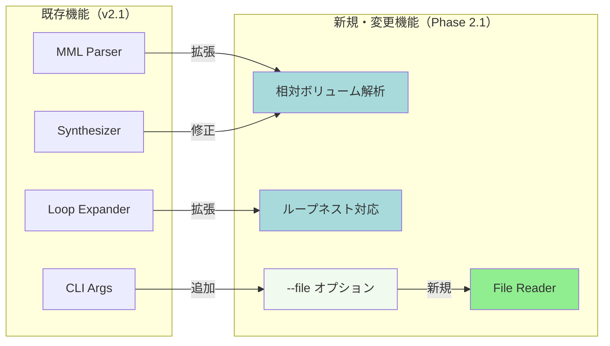
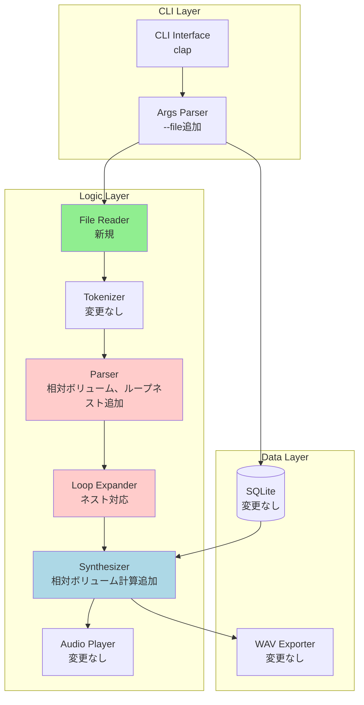
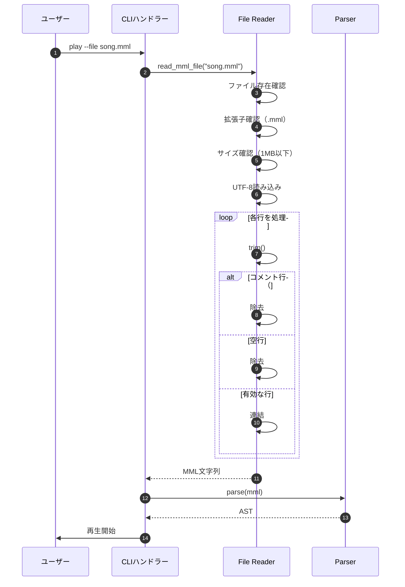
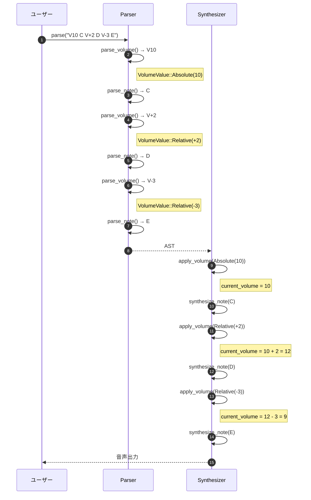
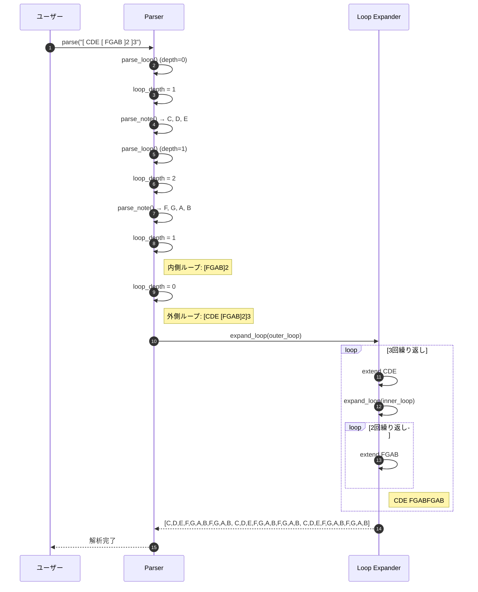
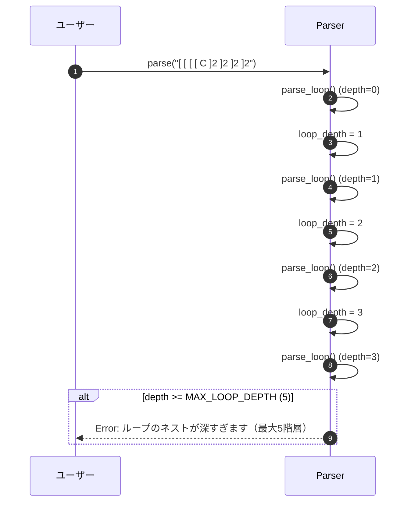

# BASIC-CLI-004 MML Synthesizer CLI MML高度な機能拡張 基本設計書

## 0. ドキュメント情報

| 項目 | 内容 |
|------|------|
| ドキュメントID | BASIC-CLI-004 |
| バージョン | 1.0.0 |
| ステータス | ドラフト |
| 作成日 | 2026-01-12 |
| 最終更新日 | 2026-01-12 |
| 作成者 | basic-design-writer |
| 関連文書 | REQ-CLI-004_MML-Advanced-Features.md (v1.0.1)<br>BASIC-CLI-003_MML-Syntax-Extension.md (v1.0.0)<br>BASIC-CLI-001_MML-Synthesizer.md (v1.1.0)<br>BASIC-CLI-002_MML-Synthesizer-Enhancement.md (v1.0.0) |

---

## 1. システム概要

### 1.1 目的

sine-mml v2.1の実装完了後、実用性と表現力を大幅に向上させるため、以下の機能拡張を行う：

1. **MMLファイル読み取り機能の実装**: 長いMMLを`.mml`ファイルで管理可能にする
2. **相対ボリューム指定の追加**: 現在のボリュームから相対的な増減（V+n, V-n）を可能にする
3. **ループネスト対応**: ループ構文のネスト（最大5階層）により複雑なパターンを簡潔に記述可能にする

### 1.2 背景

REQ-CLI-004に記載された以下のユーザー要望に対応：

- **MMLファイル読み取りの欠如**: 長いMMLを直接コマンドライン引数で指定する必要があり、複雑な楽曲の管理が困難
- **相対的な音量調整の不在**: 音量（V0-V15）の絶対値指定のみで、相対的な増減（V+n, V-n）ができない
- **ループのネスト制限**: REQ-CLI-003でループ構文が追加されたが、ネスト（入れ子）は非対応のため、複雑なパターンを表現できない

### 1.3 スコープ

#### 対象範囲
- CLIへの `--file` オプション追加
- `.mml`ファイルのパース（コメント、空行の除去）
- MMLパーサーへのボリュームコマンド拡張（`V0-V15`維持、相対指定 `V+n`, `V-n`追加）
- ループ構文のネスト対応（最大5階層）
- エラーメッセージの改善（ファイル読み取りエラー、ネスト深度超過等）

#### 対象外
- ファイル形式の拡張（`.mml`以外のフォーマット）
- ファイル内のセクション指定（特定のセクションのみ再生等）
- ボリュームのエンベロープ制御（ADSR等）
- ループネストの無制限対応（6階層以上）

### 1.4 Phase 2.1との関係

本機能拡張はsine-mml v2.1の**新規開発**として位置づけられる：

- **Phase 1.0**: 基本機能実装（BASIC-CLI-001）
- **Phase 2.0**: 機能改善（BASIC-CLI-002） - メトロノーム強化、ノーマライゼーション、E2Eテスト
- **Phase 2.0（継続）**: MML構文拡張（BASIC-CLI-003） - ループ構文、小文字対応、履歴管理強化
- **Phase 2.1**: MML高度な機能拡張（本設計書） - ファイル読み取り、相対ボリューム、ループネスト

---

## 2. 既存システムとの関係

### 2.1 影響を受けるコンポーネント

| コンポーネント | 影響内容 | 変更レベル |
|---------------|----------|-----------|
| `src/cli/args.rs` | `--file`オプション追加 | 中 |
| `src/mml/file.rs` | ファイル読み取りモジュール新規作成 | 新規 |
| `src/mml/parser.rs` | 相対ボリューム解析、ループネスト対応 | 高 |
| `src/mml/ast.rs` | `VolumeValue`列挙型追加、ループネスト深度追加 | 中 |
| `src/mml/error.rs` | ファイル読み取りエラー、ネスト深度エラー追加 | 中 |
| `src/audio/synthesizer.rs` | 相対ボリューム計算処理追加 | 中 |
| `src/cli/handlers.rs` | ファイル読み取り統合 | 中 |

### 2.2 変更概要図



---

## 3. システムアーキテクチャ

### 3.1 変更後の全体構成図



### 3.2 新規・変更コンポーネント一覧

| コンポーネント | 種別 | 役割 |
|---------------|------|------|
| `mml::file::read_mml_file` | 新規関数 | MMLファイル読み込み、コメント・空行除去 |
| `PlayArgs::file` | 新規フィールド | ファイルパス（`Option<String>`） |
| `VolumeValue` | 新規列挙型 | 絶対値/相対値の区別 |
| `Parser::parse_volume` | 修正関数 | 相対ボリューム解析対応 |
| `Parser::loop_depth` | 新規フィールド | 現在のループネスト深度 |
| `Parser::parse_loop` | 修正関数 | ネスト深度チェック、再帰的解析 |
| `expand_loop` | 修正関数 | 再帰的ループ展開 |
| `SynthesizerState::apply_volume` | 修正関数 | 相対ボリューム計算、クランプ処理 |
| `ParseError::LoopNestTooDeep` | 新規エラー | ループネスト深度超過 |
| `ParseError::LoopExpandedTooLarge` | 新規エラー | ループ展開数超過 |

---

## 4. 技術スタック

### 4.1 既存技術（維持）

| レイヤー | 技術 | バージョン | 役割 |
|----------|------|------------|------|
| 言語 | Rust | 1.70+ | アプリケーション全体 |
| CLI Framework | clap | 4.5 | コマンドライン引数解析 |
| Audio Synthesis | fundsp | 0.18 | 音声合成（DSPグラフ） |
| Audio I/O | cpal | 0.15 | オーディオストリーム制御 |
| Database | rusqlite | 0.38 | SQLite操作 |
| WAV I/O | hound | 3.5 | WAVファイル出力 |
| UI Library | indicatif | 0.18 | プログレスバー |
| UI Library | comfy-table | 7.0 | テーブル表示 |
| Error Handling | anyhow | 1.0 | エラーハンドリング |
| Error Handling | thiserror | 1.0 | カスタムエラー型 |

### 4.2 新規追加（なし）

本機能拡張では新規クレートの追加は不要。既存の技術スタックで実装可能。

### 4.3 技術選定理由

#### ファイル読み取り: `std::fs::read_to_string`
- **選定理由**: Rust標準ライブラリ、追加依存なし、UTF-8対応
- **代替案**: 手動バイト読み取り → 複雑性増加
- **参考**: [Rust std::fs](https://doc.rust-lang.org/std/fs/fn.read_to_string.html)

#### 相対ボリューム計算: `i8::clamp`
- **選定理由**: Rust標準ライブラリ、簡潔な範囲制限
- **代替案**: 手動if文 → 可読性低下
- **参考**: [Rust i8::clamp](https://doc.rust-lang.org/std/primitive.i8.html#method.clamp)

#### ループネスト展開: 再帰的実装
- **選定理由**: 自然な実装、既存のexpand_loop関数を再利用
- **代替案**: スタックベース展開 → 複雑性増加
- **実装方針**: ネスト深度カウント、再帰的展開、総展開数チェック

---

## 5. モジュール設計

### 5.1 変更対象モジュール

#### `src/cli/args.rs`
**変更内容**:
- `PlayArgs`構造体に`file`フィールド追加：
  ```rust
  #[derive(Args, Debug)]
  #[command(group(
      clap::ArgGroup::new("input")
          .required(true)
          .args(["mml", "history_id", "file"]),  // file を追加
  ))]
  pub struct PlayArgs {
      pub mml: Option<String>,
      
      #[arg(long)]
      pub history_id: Option<i64>,
      
      /// MMLファイルのパス（.mml拡張子）
      #[arg(long)]
      pub file: Option<String>,
      
      // 既存のフィールド...
  }
  ```

#### `src/mml/file.rs`（新規モジュール）
**変更内容**:
```rust
use std::fs;
use std::path::Path;
use anyhow::{Context, Result};

/// MMLファイルを読み込み、コメントと空行を除去してMML文字列を返す
pub fn read_mml_file(path: &str) -> Result<String> {
    // ファイル存在確認
    let path = Path::new(path);
    if !path.exists() {
        anyhow::bail!("ファイルが見つかりません: {}", path.display());
    }
    
    // 拡張子確認
    if path.extension().and_then(|s| s.to_str()) != Some("mml") {
        anyhow::bail!("ファイル拡張子は .mml である必要があります: {}", path.display());
    }
    
    // ファイルサイズ確認（1MB上限）
    let metadata = fs::metadata(path)?;
    if metadata.len() > 1_000_000 {
        anyhow::bail!("ファイルサイズが大きすぎます（上限: 1MB）: {}", path.display());
    }
    
    // ファイル読み込み
    let content = fs::read_to_string(path)
        .with_context(|| format!("ファイルの読み込みに失敗しました: {}", path.display()))?;
    
    // コメントと空行を除去
    let mml = content
        .lines()
        .map(str::trim)
        .filter(|line| !line.is_empty() && !line.starts_with('#'))
        .collect::<Vec<_>>()
        .join(" ");
    
    if mml.is_empty() {
        anyhow::bail!("ファイルにMMLが含まれていません: {}", path.display());
    }
    
    Ok(mml)
}
```

#### `src/mml/ast.rs`
**変更内容**:
- `Volume`構造体と`VolumeValue`列挙型追加：
  ```rust
  #[derive(Debug, Clone, PartialEq, Eq)]
  pub struct Volume {
      /// 絶対値（0-15）または相対値（-15〜+15）
      pub value: VolumeValue,
  }
  
  #[derive(Debug, Clone, PartialEq, Eq)]
  pub enum VolumeValue {
      /// 絶対値（0-15）
      Absolute(u8),
      /// 相対値（-15〜+15）
      Relative(i8),
  }
  ```

- `Command::Loop`バリアントは既存のまま維持（BASIC-CLI-003で定義済み）

#### `src/mml/parser.rs`
**変更内容**:
1. **パーサー構造体にフィールド追加**:
   ```rust
   pub struct Parser {
       // 既存のフィールド...
       loop_depth: usize,  // 現在のループネスト深度
   }
   
   const MAX_LOOP_DEPTH: usize = 5;
   const MAX_EXPANDED_COMMANDS: usize = 10_000;
   ```

2. **相対ボリューム解析関数**:
   ```rust
   fn parse_volume(&mut self) -> Result<Command, ParseError> {
       self.consume('V')?;
       
       // 相対指定のチェック
       let value = if self.check('+') {
           self.advance();
           let delta = if self.current_char().is_ascii_digit() {
               self.parse_number()? as i8
           } else {
               1  // デフォルト増減値
           };
           VolumeValue::Relative(delta)
       } else if self.check('-') {
           self.advance();
           let delta = if self.current_char().is_ascii_digit() {
               -(self.parse_number()? as i8)
           } else {
               -1  // デフォルト増減値
           };
           VolumeValue::Relative(delta)
       } else {
           // 絶対値
           let val = self.parse_number()?;
           if val > 15 {
               return Err(ParseError::InvalidVolume(val));
           }
           VolumeValue::Absolute(val as u8)
       };
       
       Ok(Command::Volume(Volume { value }))
   }
   ```

3. **ループネスト対応**:
   ```rust
   fn parse_loop(&mut self) -> Result<Command, ParseError> {
       // ネスト深度チェック
       if self.loop_depth >= MAX_LOOP_DEPTH {
           return Err(ParseError::LoopNestTooDeep {
               max_depth: MAX_LOOP_DEPTH,
               position: self.pos,
           });
       }
       
       self.consume(Token::LoopStart)?;
       self.loop_depth += 1;
       
       let mut commands = Vec::new();
       let mut escape_index = None;
       
       while !self.check(Token::LoopEnd) {
           if self.check(Token::LoopEscape) {
               self.advance();
               escape_index = Some(commands.len());
           } else {
               // 再帰的にコマンドを解析（ネストしたループも含む）
               commands.push(self.parse_command()?);
           }
       }
       
       self.consume(Token::LoopEnd)?;
       self.loop_depth -= 1;
       
       let repeat_count = if self.check(Token::Number(_)) {
           let Token::Number(n) = self.advance().token else { unreachable!() };
           if n > 99 {
               return Err(ParseError::InvalidLoopCount(n));
           }
           n as usize
       } else {
           1
       };
       
       Ok(Command::Loop {
           commands,
           escape_index,
           repeat_count,
       })
   }
   ```

4. **ループ展開関数（再帰対応）**:
   ```rust
   /// ループコマンドを展開してフラットなコマンド列に変換（再帰対応）
   pub fn expand_loop(
       commands: &[Command],
       escape_index: Option<usize>,
       repeat_count: usize,
   ) -> Result<Vec<Command>, ParseError> {
       let mut expanded = Vec::new();
       
       for i in 0..repeat_count {
           let is_last = i == repeat_count - 1;
           let end_index = if is_last && escape_index.is_some() {
               escape_index.unwrap()
           } else {
               commands.len()
           };
           
           for cmd in &commands[..end_index] {
               // ネストしたループも再帰的に展開
               if let Command::Loop { commands: inner_cmds, escape_index: inner_escape, repeat_count: inner_count } = cmd {
                   let inner_expanded = expand_loop(inner_cmds, *inner_escape, *inner_count)?;
                   expanded.extend(inner_expanded);
               } else {
                   expanded.push(cmd.clone());
               }
           }
       }
       
       // 総展開数チェック
       if expanded.len() > MAX_EXPANDED_COMMANDS {
           return Err(ParseError::LoopExpandedTooLarge {
               max_commands: MAX_EXPANDED_COMMANDS,
               actual: expanded.len(),
           });
       }
       
       Ok(expanded)
   }
   ```

#### `src/mml/error.rs`
**変更内容**:
- エラー型追加：
  ```rust
  #[derive(Debug, thiserror::Error)]
  pub enum ParseError {
      // 既存のエラー...
      
      #[error("ループのネストが深すぎます（最大{max_depth}階層）: 位置 {position}")]
      LoopNestTooDeep {
          max_depth: usize,
          position: usize,
      },
      
      #[error("ループ展開後のコマンド数が多すぎます（最大{max_commands}、実際: {actual}）")]
      LoopExpandedTooLarge {
          max_commands: usize,
          actual: usize,
      },
  }
  ```

#### `src/audio/synthesizer.rs`
**変更内容**:
- 相対ボリューム計算処理追加：
  ```rust
  pub struct SynthesizerState {
      current_volume: u8,  // 0-15
      // 既存のフィールド...
  }
  
  impl SynthesizerState {
      pub fn apply_volume(&mut self, volume: &Volume) {
          self.current_volume = match volume.value {
              VolumeValue::Absolute(v) => v,
              VolumeValue::Relative(delta) => {
                  let new_val = (self.current_volume as i8 + delta).clamp(0, 15);
                  new_val as u8
              }
          };
      }
      
      /// ボリュームを音量係数に変換（0.0-1.0）
      pub fn volume_to_amplitude(&self) -> f32 {
          self.current_volume as f32 / 15.0
      }
  }
  ```

#### `src/cli/handlers.rs`
**変更内容**:
- ファイル読み取り統合：
  ```rust
  pub fn play_handler(args: PlayArgs) -> Result<()> {
      // MML文字列を取得
      let mml_string = if let Some(file_path) = args.file {
          // ファイルから読み込み
          mml::file::read_mml_file(&file_path)?
      } else if let Some(mml) = args.mml {
          // コマンドライン引数から取得
          mml
      } else if let Some(history_id) = args.history_id {
          // 履歴から取得
          let db = Database::init()?;
          let entry = db.get_by_id(history_id)?;
          entry.mml
      } else {
          unreachable!("clap ArgGroup ensures one of mml, history_id, or file is provided");
      };
      
      // 既存の処理...
  }
  ```

### 5.2 ファイル構成（差分）

```diff
src/
├── mml/
│   ├── ast.rs                     # 修正: VolumeValue追加
│   ├── parser.rs                  # 修正: 相対ボリューム、ループネスト対応
│   ├── error.rs                   # 修正: 新規エラー型追加
+   └── file.rs                    # 新規: ファイル読み取りモジュール
├── cli/
│   ├── args.rs                    # 修正: --file追加
│   └── handlers.rs                # 修正: ファイル読み取り統合
├── audio/
│   └── synthesizer.rs             # 修正: 相対ボリューム計算追加
```

---

## 6. 機能一覧

### 6.1 新規機能

| ID | 機能名 | 概要 | 優先度 |
|----|--------|------|--------|
| F-027 | MMLファイル読み取り | `.mml`ファイルからMMLを読み込み | 必須 |
| F-028 | 相対ボリューム指定 | 既存V0-V15に相対指定（V+n, V-n）を追加 | 必須 |
| F-029 | ループネスト対応 | ループ構文のネスト（最大5階層） | 必須 |

### 6.2 機能詳細

#### F-027: MMLファイル読み取り

**概要**: `.mml`ファイルからMMLを読み込み、コメントや空行を除去して解析

**入力**:
- `--file <path>` オプション（ファイルパス）

**出力**:
- MML文字列（コメント、空行除去済み）

**処理概要**:
1. CLIに `--file` オプションを追加（`PlayArgs` に `file: Option<String>` を追加）
2. ファイルが存在するか確認
3. ファイルを読み込み、UTF-8でデコード
4. 各行を処理:
   - `#`で始まる行はコメントとして除去
   - 空行（空白文字のみの行）は除去
   - それ以外の行は連結
5. 連結したMML文字列を既存のパーサーに渡す

**ビジネスルール**:
- BR-067: `--file` と `mml` 引数は排他的（両方指定はエラー）
- BR-068: コメント行は `#` で始まる（行頭の空白は許可）
- BR-069: 空行は無視される
- BR-070: ファイルはUTF-8エンコーディング
- BR-071: ファイルサイズ上限は 1MB（DoS攻撃防止）

**MMLファイル例**:
```mml
# イントロ
T120 L8 O5
[CDEF]2 GAB >C

# Aメロ
O4 L4
CDEFGAB >C

# Bメロ
O5 L8
[CD:EF]2 GAB

# アウトロ
O4 L2
C R
```

#### F-028: 相対ボリューム指定

**概要**: 既存のボリューム（V0-V15）に相対指定機能を追加し、音量の動的な増減を可能にする

**入力**:
- MML文字列（ボリュームコマンドを含む）
  - 例: `V10`, `V+2`, `V-3`, `V+`, `V-`

**出力**:
- ボリューム値（0-15）

**処理概要**:
1. トークナイザーで `V` コマンドを認識
2. 数値を取得（絶対値または相対値）
3. 相対値の場合は現在のボリュームに加算/減算
4. 0-15の範囲にクランプ
5. デフォルトはV10（既存仕様を維持）

**ビジネスルール**:
- BR-072: ボリューム範囲は 0-15（既存仕様を維持）
- BR-073: デフォルトはV10（既存仕様を維持）
- BR-074: 相対指定 `V+n` は現在値に+n
- BR-075: 相対指定 `V-n` は現在値に-n
- BR-076: `V+` または `V-` のみの場合はデフォルト増減値1を使用
- BR-077: 範囲外の値は0-15にクランプ（エラーにしない）

**受け入れテスト例**:
```rust
#[test]
fn test_volume_absolute() {
    let mml = parse("V10 C V5 D V15 E").unwrap();
    // V10, V5, V15 が正常に解析される
}

#[test]
fn test_volume_relative() {
    let mml = parse("V10 C V+2 D V-3 E").unwrap();
    // V10 → V12 → V9 と変化
}

#[test]
fn test_volume_clamp() {
    let mml = parse("V15 V+2 C").unwrap();
    // V15 + 2 = 17 → 15 にクランプ
}
```

#### F-029: ループネスト対応

**概要**: ループ構文のネスト（最大5階層）に対応

**入力**:
- MML文字列（ネストしたループ構文を含む）
  - 例: `[ CDE [ FGAB ]2 ]3`

**出力**:
- ループ展開されたMMLコマンド列

**処理概要**:
1. パーサーでループ開始 `[` を検出
2. ネスト深度をカウント（最大5階層）
3. ループ内のコマンドを再帰的に解析
4. ループ終了 `]` を検出し、繰り返し回数を取得
5. ループを展開（内側から順に展開）

**ビジネスルール**:
- BR-079: ループのネストは最大5階層まで
- BR-080: 6階層以上のネストはエラー
- BR-081: ネストしたループ内でも脱出ポイント（`:`）が使用可能
- BR-082: ループ回数は各階層で1-99の範囲内
- BR-083: ネストしたループの総展開数は10,000コマンド以下（DoS攻撃防止）

**受け入れテスト例**:
```rust
#[test]
fn test_loop_nest_2_levels() {
    let mml = parse("[ CDE [ FGAB ]2 ]3").unwrap();
    // 内側のループ: FGAB を2回 → FGABFGAB
    // 外側のループ: CDE FGABFGAB を3回
}

#[test]
fn test_loop_nest_too_deep() {
    let result = parse("[ [ [ [ [ [ C ]2 ]2 ]2 ]2 ]2 ]2");
    assert!(result.is_err());
    // Error: ループのネストが深すぎます（最大5階層）
}
```

---

## 7. 画面（サブコマンド）一覧

### 7.1 `play` サブコマンド（変更）

**変更前（v2.1）**:
```bash
sine-mml play "CDEFGAB" --note "My melody"
```

**変更後（Phase 2.1）**:
```bash
sine-mml play --file song.mml
sine-mml play "V10 C V+2 D V-3 E"
sine-mml play "[ CDE [ FGAB ]2 ]3"
```

#### CLIオプション仕様（変更点のみ）

| オプション | 型 | デフォルト | 説明 | 変更種別 |
|-----------|-----|----------|------|----------|
| `--file` | String | None | MMLファイルのパス（.mml拡張子） | **新規** |

### 7.2 `history`, `export`, `clear-history` サブコマンド（変更なし）

---

## 8. データモデル

### 8.1 データベーススキーマ（変更なし）

既存の `history` テーブルをそのまま使用。スキーマ変更なし。

| カラム名 | 型 | 制約 | 説明 |
|----------|-----|------|------|
| id | INTEGER | PRIMARY KEY, AUTOINCREMENT | 履歴ID |
| mml | TEXT | NOT NULL | MML文字列 |
| waveform | TEXT | NOT NULL | 波形タイプ |
| volume | REAL | NOT NULL | 音量 |
| bpm | INTEGER | NOT NULL | テンポ |
| note | TEXT | NULL | メモ（v2.1で追加） |
| created_at | TEXT | NOT NULL | 作成日時（ISO 8601） |

---

## 9. インターフェース設計

### 9.1 MML構文の拡張

#### 追加される構文

```
V<0-15>         # ボリューム絶対値指定（既存仕様維持）
V+<n>           # ボリューム相対値指定（増加）
V-<n>           # ボリューム相対値指定（減少）
V+              # デフォルト増加（+1）
V-              # デフォルト減少（-1）
[ [ ... ]n ]m   # ループネスト（最大5階層）
```

#### 構文例

| MML | 展開後 | 説明 |
|-----|--------|------|
| `V10 C V+2 D V-3 E` | V10 → V12 → V9 | 相対ボリューム指定 |
| `[ CDE [ FGAB ]2 ]3` | CDE FGABFGAB CDE FGABFGAB CDE FGABFGAB | 2階層ネスト |
| `[ [ [ C ]2 D ]2 E ]2` | CC D CC D E CC D CC D E | 3階層ネスト（最大5階層まで可） |

### 9.2 CLI引数仕様（新規・変更）

#### `play` サブコマンド - 新規オプション

```rust
// src/cli/args.rs

#[derive(Args, Debug)]
#[command(group(
    clap::ArgGroup::new("input")
        .required(true)
        .args(["mml", "history_id", "file"]),
))]
pub struct PlayArgs {
    pub mml: Option<String>,
    
    #[arg(long)]
    pub history_id: Option<i64>,
    
    /// MMLファイルのパス（.mml拡張子）
    #[arg(long)]
    pub file: Option<String>,
    
    // 既存のフィールド...
}
```

### 9.3 内部API（新規関数シグネチャ）

#### ファイル読み取り

```rust
// src/mml/file.rs

/// MMLファイルを読み込み、コメントと空行を除去してMML文字列を返す
///
/// # Arguments
/// * `path` - ファイルパス
///
/// # Returns
/// * `Ok(String)` - MML文字列
/// * `Err(anyhow::Error)` - ファイル読み取りエラー
pub fn read_mml_file(path: &str) -> Result<String>
```

#### 相対ボリューム解析

```rust
// src/mml/parser.rs

/// ボリュームコマンドを解析（絶対値/相対値対応）
///
/// # Returns
/// * `Ok(Command::Volume)` - 解析成功
/// * `Err(ParseError)` - 構文エラー
fn parse_volume(&mut self) -> Result<Command, ParseError>
```

#### ループネスト解析

```rust
/// ループ構文を解析（ネスト対応）
///
/// # Returns
/// * `Ok(Command::Loop)` - 解析成功
/// * `Err(ParseError)` - 構文エラー、ネスト深度超過
fn parse_loop(&mut self) -> Result<Command, ParseError>
```

#### ループ展開（再帰対応）

```rust
/// ループコマンドを展開してフラットなコマンド列に変換（再帰対応）
///
/// # Arguments
/// * `commands` - ループ内のコマンド列
/// * `escape_index` - 脱出ポイントのインデックス
/// * `repeat_count` - 繰り返し回数
///
/// # Returns
/// * `Ok(Vec<Command>)` - 展開されたコマンド列
/// * `Err(ParseError)` - 展開数超過
pub fn expand_loop(
    commands: &[Command],
    escape_index: Option<usize>,
    repeat_count: usize,
) -> Result<Vec<Command>, ParseError>
```

---

## 10. 処理フロー

### 10.1 ファイル読み取りフロー



### 10.2 相対ボリューム解析フロー



### 10.3 ループネスト解析フロー



### 10.4 ループネスト深度チェックフロー



---

## 11. 非機能設計

### 11.1 性能設計

| ID | 要件 | 目標値 | 測定方法 |
|----|------|--------|----------|
| NFR-P-011 | ファイル読み取り速度 | 100ms以内（1MB） | ファイルI/O測定 |
| NFR-P-012 | ループネスト展開速度 | 50ms以内（5階層、1000コマンド） | ベンチマーク |
| NFR-P-013 | ボリューム計算のオーバーヘッド | 1%以内（合成時間の） | ベンチマーク |

### 11.2 可用性設計

| ID | 要件 | 目標値 |
|----|------|--------|
| NFR-A-007 | ファイル読み取りエラーのハンドリング | 詳細なエラーメッセージを表示 |
| NFR-A-008 | ループネスト深度超過時のエラー | クラッシュせず、エラーメッセージを表示 |

### 11.3 セキュリティ設計

| ID | 要件 | 詳細 |
|----|------|------|
| NFR-S-009 | ファイルサイズ制限 | 1MB以下（DoS攻撃防止） |
| NFR-S-010 | ループ展開数制限 | 10,000コマンド以下（DoS攻撃防止） |
| NFR-S-011 | ファイルパストラバーサル対策 | 絶対パスまたは相対パスのみ許可 |

### 11.4 ユーザビリティ設計

| ID | 要件 | 詳細 |
|----|------|------|
| NFR-U-011 | ファイル読み取りエラーメッセージ | ファイルパス、エラー原因を明示 |
| NFR-U-012 | ループネストのエラーメッセージ | ネスト深度、位置情報を明示 |
| NFR-U-013 | ボリュームのデフォルト値 | V10（中程度の強さ） |

### 11.5 保守性設計

| ID | 要件 | 詳細 |
|----|------|------|
| NFR-M-011 | ファイル読み取りのテスト | 正常系、異常系を網羅 |
| NFR-M-012 | ループネストのテスト | 1-5階層、エッジケースを網羅 |
| NFR-M-013 | ボリュームのテスト | 絶対値、相対値、クランプを網羅 |

### 11.6 エラーハンドリング

| エラーケース | 対応 | メッセージ例 |
|-------------|------|-------------|
| ファイルが存在しない | anyhow::Error | `Error: ファイルが見つかりません: song.mml` |
| 拡張子が`.mml`以外 | anyhow::Error | `Error: ファイル拡張子は .mml である必要があります: song.txt` |
| ファイルサイズが1MB超 | anyhow::Error | `Error: ファイルサイズが大きすぎます（上限: 1MB）: huge_song.mml` |
| ボリュームが15超 | ParseError | `Error: Invalid volume value: 20 (must be 0-15)` |
| ループネストが6階層以上 | ParseError | `Error: ループのネストが深すぎます（最大5階層）: 位置 12` |
| ループ展開数が10,000超 | ParseError | `Error: ループ展開後のコマンド数が多すぎます（最大10000、実際: 970299）` |

---

## 12. テスト戦略

### 12.1 テストファイル構成

```
tests/
├── cli_integration.rs              # E2E統合テスト（既存）
│   ├── test_play_with_file
│   ├── test_file_not_found
│   ├── test_file_invalid_extension
│   ├── test_relative_volume
│   ├── test_volume_clamp
│   ├── test_loop_nest_2_levels
│   ├── test_loop_nest_3_levels
│   ├── test_loop_nest_too_deep
│   └── test_loop_expanded_too_large
└── unit/
    ├── mml_file_test.rs            # ファイル読み取りのユニットテスト
    ├── mml_parser_volume_test.rs   # 相対ボリュームのユニットテスト
    └── mml_parser_loop_nest_test.rs # ループネストのユニットテスト
```

### 12.2 テストケース一覧

#### ファイル読み取りのテストケース

| テストID | テストケース | 期待結果 |
|---------|-------------|---------|
| TC-027-001 | `--file song.mml` | ファイルから読み込み成功 |
| TC-027-002 | コメント行（`#`始まり） | コメント行が除去される |
| TC-027-003 | 空行 | 空行が除去される |
| TC-027-004 | ファイルが存在しない | エラーメッセージを表示 |
| TC-027-005 | 拡張子が`.mml`以外 | エラーメッセージを表示 |
| TC-027-006 | ファイルサイズが1MB超 | エラーメッセージを表示 |
| TC-027-007 | UTF-8以外のエンコーディング | エラーメッセージを表示 |
| TC-027-008 | `--file` と `mml` 引数の両方指定 | エラー（排他的） |

#### 相対ボリューム指定のテストケース

| テストID | テストケース | 期待結果 |
|---------|-------------|---------|
| TC-028-001 | `V10` | 絶対値指定が成功（既存仕様維持） |
| TC-028-002 | `V+2` | 相対値指定（増加）が成功 |
| TC-028-003 | `V-3` | 相対値指定（減少）が成功 |
| TC-028-004 | `V+` | デフォルト増加（+1）が適用 |
| TC-028-005 | `V-` | デフォルト減少（-1）が適用 |
| TC-028-006 | `V15 V+2` | 15にクランプ |
| TC-028-007 | `V0 V-2` | 0にクランプ |
| TC-028-008 | `V20` | エラー（範囲外: 0-15） |

#### ループネストのテストケース

| テストID | テストケース | 期待結果 |
|---------|-------------|---------|
| TC-029-001 | `[ CDE [ FGAB ]2 ]3` | 2階層ネストが正常に展開 |
| TC-029-002 | `[ [ [ C ]2 D ]2 E ]2` | 3階層ネストが正常に展開 |
| TC-029-003 | `[ [ [ [ C ]2 D ]2 E ]2 F ]2` | 4階層ネストが正常に展開 |
| TC-029-004 | `[ [ [ [ [ C ]2 D ]2 E ]2 F ]2 G ]2` | 5階層ネストが正常に展開 |
| TC-029-005 | `[ [ [ [ [ [ C ]2 ]2 ]2 ]2 ]2 ]2` | エラー（6階層） |
| TC-029-004 | `[ [ CD:EF ]2 GAB ]2` | ネスト内の脱出ポイントが動作 |
| TC-029-005 | `[ [ [ C ]99 ]99 ]99` | エラー（展開数超過） |

### 12.3 テストカバレッジ

| テストレベル | 対象 | カバレッジ目標 |
|-------------|------|---------------|
| ユニットテスト | `read_mml_file`, `parse_volume`, `parse_loop`, `expand_loop` | 100% |
| 統合テスト | ファイル読み取り、相対ボリューム、ループネスト | 100% |
| E2Eテスト | 主要シナリオ（play --file, 相対ボリューム、ループネスト） | 100% |

---

## 13. 詳細設計書一覧

本基本設計書に基づき、以下の詳細設計書を作成予定：

| # | 機能名 | 詳細設計書パス | ステータス |
|---|--------|---------------|-----------|
| 1 | MMLファイル読み取り | `docs/designs/detailed/mml-file/file-reader.md` | 未着手 |
| 2 | 相対ボリューム指定 | `docs/designs/detailed/mml-volume/relative-volume.md` | 未着手 |
| 3 | ループネスト対応 | `docs/designs/detailed/mml-loop/loop-nesting.md` | 未着手 |
| 4 | CLIオプション変更（--file） | `docs/designs/detailed/cli/file-option.md` | 未着手 |
| 5 | エラーハンドリング拡張 | `docs/designs/detailed/error/file-and-loop-errors.md` | 未着手 |

---

## 14. 未解決課題・仮定事項

### 14.1 未解決課題

| ID | 課題 | 担当 | 期限 | 優先度 |
|----|------|------|------|--------|
| I-013 | ループネスト深度の妥当性検証 | 開発チーム | 2026-01-20 | 中 |
| I-014 | ファイル読み取りのセクション指定機能 | 開発チーム | Phase 3.0で検討 | 低 |
| I-015 | ボリュームのエンベロープ制御 | 開発チーム | Phase 3.0で検討 | 低 |

### 14.2 仮定事項

- 【仮定】ループネスト深度5階層は実用上十分（ユーザーフィードバックで調整）
- 【仮定】ファイルサイズ上限1MBは実用上十分
- 【仮定】相対ボリューム指定はクレッシェンド/デクレッシェンドで十分（エンベロープは不要）
- 【仮定】ファイル読み取りはUTF-8のみ対応で問題ない

### 14.3 制約事項

| 制約 | 詳細 | 理由 |
|------|------|------|
| ファイル形式 | `.mml` のみ対応 | シンプルさを保つ |
| ループネスト深度 | 最大5階層 | パーサーの複雑性を抑えつつ表現力を確保 |
| ボリューム範囲 | 0-15（既存仕様維持） | 後方互換性を維持 |
| ファイルサイズ上限 | 1MB | DoS攻撃防止 |
| ループ展開数上限 | 10,000コマンド | DoS攻撃防止、パフォーマンス維持 |

---

## 15. 実装優先順位と段階的ロールアウト

### Phase 2.1.1（Week 1: 2026-01-12〜01-19）

1. **F-027（MMLファイル読み取り）** - 最も簡単、独立した機能
   - `--file` オプション追加
   - ファイル読み取り処理実装
   - コメント、空行除去処理実装
   - エラーハンドリング実装
   - 所要時間: 2-3日

### Phase 2.1.2（Week 2: 2026-01-20〜01-26）

2. **F-028（相対ボリューム指定）** - 既存仕様を維持しつつ相対指定を追加
   - AST拡張（VolumeValue列挙型）
   - パーサー拡張（V+n, V-n対応）
   - 合成処理実装（相対値計算、クランプ処理）
   - 豊富なテストケース作成
   - 所要時間: 2-3日

3. **F-029（ループネスト対応）** - 最も複雑、パーサー拡張が必要
   - パーサーにネスト深度カウント追加
   - ループ展開処理の再帰対応
   - 総展開数チェック実装
   - 豊富なテストケース作成
   - 所要時間: 3-4日

---

## 16. リスクと対策

### 16.1 リスク一覧

| ID | リスク | 影響度 | 発生確率 | 対策 |
|----|--------|--------|---------|------|
| R-014 | ループネストのパーサーバグ | 高 | 中 | 豊富なテストケース、エッジケース対応 |
| R-015 | ファイル読み取りのエンコーディング問題 | 中 | 中 | UTF-8強制、エラーメッセージ改善 |
| R-016 | ループ展開数の上限不足 | 低 | 低 | ユーザーフィードバックで調整 |

### 16.2 対策詳細

#### R-014: ループネストのパーサーバグ
- **対策1**: 豊富なテストケース作成（正常系、異常系、エッジケース）
- **対策2**: ネスト深度カウントの厳密な管理
- **対策3**: 既存のループパーサーテストが全て通ることを確認

#### R-015: ファイル読み取りのエンコーディング問題
- **対策1**: UTF-8強制、エラーメッセージ改善
- **対策2**: ファイル読み取りエラーの詳細なログ出力
- **対策3**: ユーザーガイドにUTF-8推奨を明記

#### R-016: ループ展開数の上限不足
- **対策1**: ユーザーフィードバックで調整
- **対策2**: エラーメッセージに推奨値を表示
- **対策3**: 将来的に設定可能にする検討

---

## 17. 詳細設計へのリンク

### 17.1 詳細設計書一覧

| ディレクトリ | 関連機能 | 概要 |
|------------|---------|------|
| [mml-file/](../detailed/mml-file/) | F-027 | MMLファイル読み取り |
| [mml-volume/](../detailed/mml-volume/) | F-028 | 相対ボリューム指定 |
| [mml-loop/](../detailed/mml-loop/) | F-029 | ループネスト対応 |

### 17.2 詳細設計書インデックス

詳細設計書の全体構成は以下を参照：
- [詳細設計書インデックス](../detailed/README.md)

---

## 18. 変更履歴

| バージョン | 日付 | 変更内容 | 担当者 |
|-----------|------|----------|--------|
| 1.0.0 | 2026-01-12 | 初版作成 | basic-design-writer |
