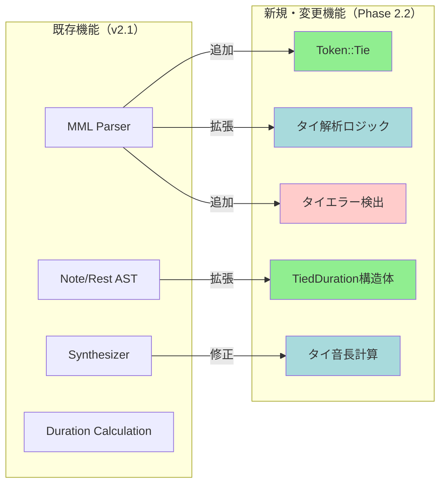
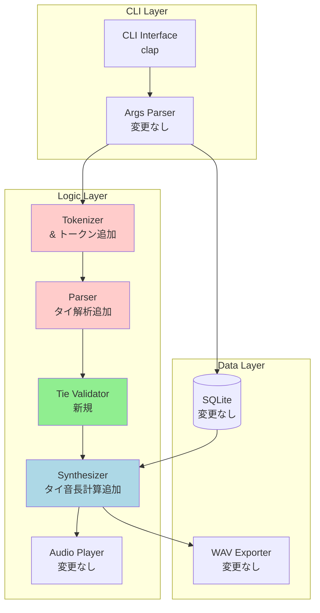
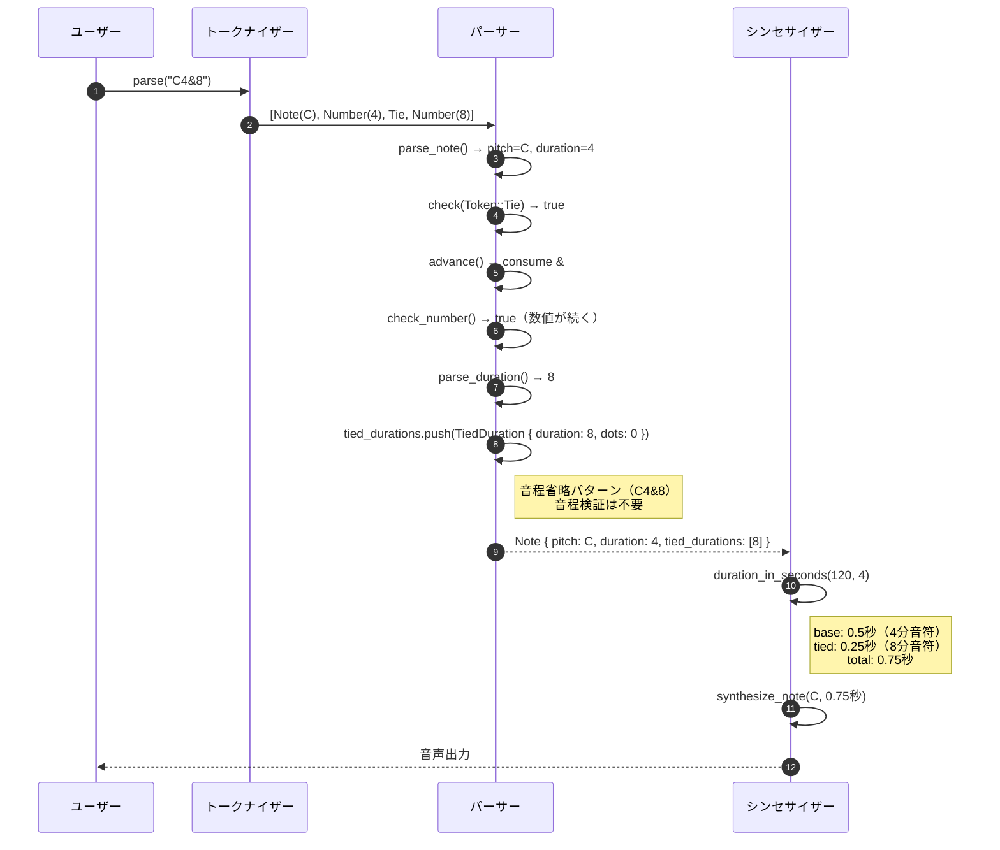
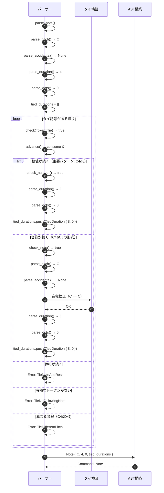
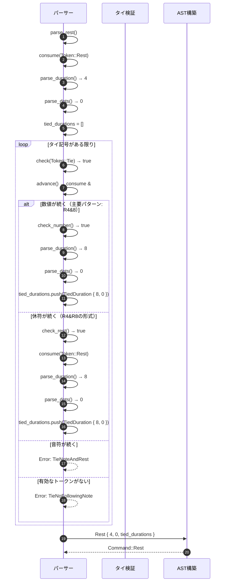
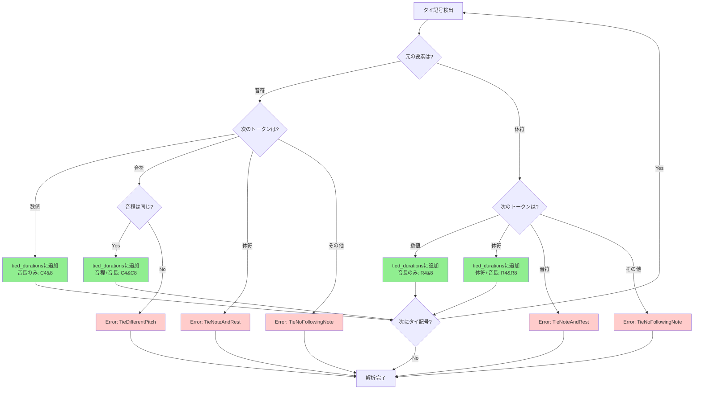

# BASIC-CLI-005 MML Synthesizer CLI タイ記号機能 基本設計書

## 0. ドキュメント情報

| 項目 | 内容 |
|------|------|
| ドキュメントID | BASIC-CLI-005 |
| バージョン | 1.1.0 |
| ステータス | レビュー中 |
| 作成日 | 2026-01-12 |
| 最終更新日 | 2026-01-12 |
| 作成者 | basic-design-writer |
| 関連文書 | REQ-CLI-005_Tie-Notation.md (v1.0.1)<br>BASIC-CLI-004_MML-Advanced-Features.md (v1.0.0)<br>BASIC-CLI-001_MML-Synthesizer.md (v1.1.0)<br>BASIC-CLI-002_MML-Synthesizer-Enhancement.md (v1.0.0)<br>BASIC-CLI-003_MML-Syntax-Extension.md (v1.0.0) |

---

## 1. システム概要

### 1.1 目的

sine-mml v2.1の実装完了後、音楽表現力のさらなる向上のため、タイ記号（`&`）機能を追加する：

1. **付点では表現できない音長の実現**: `C4&16`（4分音符 + 16分音符 = 5/16拍）のような複雑な音長を記述可能にする
2. **小節をまたぐ長い音の表現**: `C1&1`（全音符2つ分 = 2小節分）のような長い音を簡潔に記述可能にする
3. **音楽記譜法との整合性**: 一般的な楽譜のタイ記号と同等の機能をMMLで実現する
4. **休符のタイ対応**: `R4&8`（付点4分休符相当）のような長い休符を柔軟に表現可能にする

### 1.2 背景

REQ-CLI-005に記載された以下のユーザー要望に対応：

- **付点では表現できない音長の欠如**: 現状、`C4.`（付点4分音符）は表現できるが、`4分 + 16分 = 5/16拍`のような付点では表現できない音長を記述する手段がない
- **小節をまたぐ長い音の表現困難**: 全音符（`C1`）より長い音や、小節をまたぐ音を表現する手段がない
- **音楽記譜法との乖離**: 一般的な楽譜ではタイ記号で音符を連結するが、MMLでは同等の機能がない

### 1.3 スコープ

#### 対象範囲
- MMLパーサーへのタイ記号 `&` の追加
- 同一音程の音符連結機能
- 休符のタイ対応
- タイ後の音符に付点指定可能
- タイの連鎖（無制限）
- 異なる音程のタイのエラー検出
- 音符と休符のタイのエラー検出
- タイ記号の前後に空白があっても動作

#### 対象外
- スラー記号（異なる音程を滑らかに繋ぐ）
- タイ記号の視覚的な表示（CLI出力）
- タイ記号のエクスポート（WAVファイルには影響しない）
- ネストしたタイ（タイの中にタイ）

### 1.4 Phase 2.2との関係

本機能拡張はsine-mml v2.2の**新規開発**として位置づけられる：

- **Phase 1.0**: 基本機能実装（BASIC-CLI-001）
- **Phase 2.0**: 機能改善（BASIC-CLI-002） - メトロノーム強化、ノーマライゼーション、E2Eテスト
- **Phase 2.0（継続）**: MML構文拡張（BASIC-CLI-003） - ループ構文、小文字対応、履歴管理強化
- **Phase 2.1**: MML高度な機能拡張（BASIC-CLI-004） - ファイル読み取り、相対ボリューム、ループネスト
- **Phase 2.2**: タイ記号機能（本設計書） - タイ記号による音符連結

---

## 2. 既存システムとの関係

### 2.1 影響を受けるコンポーネント

| コンポーネント | 影響内容 | 変更レベル |
|---------------|----------|-----------|
| `src/mml/mod.rs` | `Token::Tie`追加 | 低 |
| `src/mml/ast.rs` | `Note`/`Rest`構造体に`tied_durations`フィールド追加、`TiedDuration`構造体新規作成 | 中 |
| `src/mml/parser.rs` | タイ解析ロジック追加（`parse_note`/`parse_rest`拡張） | 高 |
| `src/mml/error.rs` | タイ関連エラー3種追加（MML-E012〜E014） | 中 |
| `src/audio/synthesizer.rs` | タイ音長計算処理追加 | 中 |

### 2.2 変更概要図



---

## 3. システムアーキテクチャ

### 3.1 変更後の全体構成図



### 3.2 新規・変更コンポーネント一覧

| コンポーネント | 種別 | 役割 |
|---------------|------|------|
| `Token::Tie` | 新規バリアント | タイ記号`&`のトークン表現 |
| `TiedDuration` | 新規構造体 | タイで連結された音符の音長情報 |
| `Note::tied_durations` | 新規フィールド | タイで連結された音符の音長リスト |
| `Rest::tied_durations` | 新規フィールド | タイで連結された休符の音長リスト |
| `Parser::parse_note` | 修正関数 | タイ記号の検出と音程検証 |
| `Parser::parse_rest` | 修正関数 | タイ記号の検出と休符検証 |
| `Note::duration_in_seconds` | 修正関数 | タイ音長を含めた総音長計算 |
| `Rest::duration_in_seconds` | 修正関数 | タイ音長を含めた総休符長計算 |
| `ParseError::TieDifferentPitch` | 新規エラー | 異なる音程のタイエラー |
| `ParseError::TieNoFollowingNote` | 新規エラー | タイ後に音符がないエラー |
| `ParseError::TieNoteAndRest` | 新規エラー | 音符と休符のタイエラー |

---

## 4. 技術スタック

### 4.1 既存技術（維持）

| レイヤー | 技術 | バージョン | 役割 |
|----------|------|------------|------|
| 言語 | Rust | 1.70+ | アプリケーション全体 |
| CLI Framework | clap | 4.5 | コマンドライン引数解析 |
| Audio Synthesis | fundsp | 0.18 | 音声合成（DSPグラフ） |
| Audio I/O | cpal | 0.15 | オーディオストリーム制御 |
| Database | rusqlite | 0.38 | SQLite操作 |
| WAV I/O | hound | 3.5 | WAVファイル出力 |
| UI Library | indicatif | 0.18 | プログレスバー |
| UI Library | comfy-table | 7.0 | テーブル表示 |
| Error Handling | anyhow | 1.0 | エラーハンドリング |
| Error Handling | thiserror | 1.0 | カスタムエラー型 |

### 4.2 新規追加（なし）

本機能拡張では新規クレートの追加は不要。既存の技術スタックで実装可能。

### 4.3 技術選定理由

#### タイ音長計算: `Iterator::sum()`
- **選定理由**: Rust標準ライブラリ、簡潔な合算処理
- **代替案**: 手動ループ → 可読性低下
- **参考**: [Rust Iterator::sum](https://doc.rust-lang.org/std/iter/trait.Iterator.html#method.sum)

#### 音程検証: `PartialEq` トレイト
- **選定理由**: Rust標準の等価性比較、既存のAST構造体で実装済み
- **代替案**: 手動比較関数 → 冗長
- **実装方針**: `Pitch`と`Accidental`の両方を比較

#### タイ連鎖: `Vec<TiedDuration>`
- **選定理由**: 動的サイズ、無制限の連鎖に対応
- **代替案**: 固定サイズ配列 → 柔軟性低下
- **実装方針**: `while`ループでタイ記号を検出し続ける

---

## 5. モジュール設計

### 5.1 変更対象モジュール

#### `src/mml/mod.rs`
**変更内容**:
- `Token` enumに`Tie`バリアント追加：
  ```rust
  #[derive(Debug, Clone, PartialEq, Eq)]
  pub enum Token {
      // 既存のトークン...
      Note(char),
      Rest,
      Sharp,
      Flat,
      Dot,
      Number(u32),
      // ... 他のトークン ...
      
      /// タイ記号 &
      Tie,
  }
  ```

#### `src/mml/ast.rs`
**変更内容**:
1. **`TiedDuration`構造体追加**:
   ```rust
   /// タイで連結された音符の音長情報
   #[derive(Debug, Clone, PartialEq, Eq)]
   pub struct TiedDuration {
       /// 音長（1-64）、Noneの場合はデフォルト音長を使用
       pub duration: Option<u8>,
       /// 付点の数（0-3）
       pub dots: u8,
   }
   
   impl TiedDuration {
       /// タイ音長を秒数に変換
       pub fn calculate_duration(&self, bpm: u16, default_length: u8) -> f32 {
           let length = self.duration.unwrap_or(default_length);
           let base = 60.0 / bpm as f32 * 4.0 / length as f32;
           
           // 付点の処理
           let mut duration = base;
           let mut dot_value = base / 2.0;
           for _ in 0..self.dots {
               duration += dot_value;
               dot_value /= 2.0;
           }
           
           duration
       }
   }
   ```

2. **`Note`構造体拡張**:
   ```rust
   #[derive(Debug, Clone, PartialEq, Eq)]
   pub struct Note {
       pub pitch: Pitch,
       pub accidental: Option<Accidental>,
       pub duration: Option<u8>,
       pub dots: u8,
       
       /// タイで連結された音符の音長リスト
       pub tied_durations: Vec<TiedDuration>,
   }
   ```

3. **`Rest`構造体拡張**:
   ```rust
   #[derive(Debug, Clone, PartialEq, Eq)]
   pub struct Rest {
       pub duration: Option<u8>,
       pub dots: u8,
       
       /// タイで連結された休符の音長リスト
       pub tied_durations: Vec<TiedDuration>,
   }
   ```

#### `src/mml/parser.rs`
**変更内容**:
1. **トークナイザーにタイ記号追加**:
   ```rust
   fn tokenize_char(c: char) -> Option<Token> {
       match c {
           'C' | 'D' | 'E' | 'F' | 'G' | 'A' | 'B' => Some(Token::Note(c)),
           'R' => Some(Token::Rest),
           '#' | '+' => Some(Token::Sharp),
           '-' | 'B' => Some(Token::Flat),
           '.' => Some(Token::Dot),
           '&' => Some(Token::Tie),  // 追加
           // ... 他のトークン ...
           _ => None,
       }
   }
   ```

2. **`parse_note`関数拡張**:
   ```rust
   fn parse_note(&mut self) -> Result<Command, ParseError> {
       let pitch = self.parse_pitch()?;
       let accidental = self.parse_accidental()?;
       let duration = self.parse_duration()?;
       let dots = self.parse_dots()?;
       
       let mut tied_durations = Vec::new();
       
       // タイ記号のチェック
       while self.check(Token::Tie) {
           self.advance(); // & を消費
           
           // タイ後のパターンを判定:
           // 1. Token::Number → 音長のみ（音程省略）: C4&8
           // 2. Token::Note → 音程+音長（音程検証必要）: C4&C8
           // 3. Token::Rest → エラー（音符と休符のタイ）
           // 4. それ以外 → エラー（タイ後に音符がない）
           
           if self.check_rest() {
               // 音符と休符のタイはエラー
               return Err(ParseError::TieNoteAndRest {
                   position: self.pos,
               });
           }
           
           if self.check_note() {
               // パターン2: 音程+音長（例: C4&C8, C4&D4）
               let tied_pitch = self.parse_pitch()?;
               let tied_accidental = self.parse_accidental()?;
               
               // 音程の検証（同一音程のみ許可）
               if tied_pitch != pitch || tied_accidental != accidental {
                   return Err(ParseError::TieDifferentPitch {
                       position: self.pos,
                   });
               }
               
               let tied_duration = self.parse_duration()?;
               let tied_dots = self.parse_dots()?;
               
               tied_durations.push(TiedDuration {
                   duration: tied_duration,
                   dots: tied_dots,
               });
           } else if self.check_number() {
               // パターン1: 音長のみ（例: C4&8）- 主要ユースケース
               // 音程は省略され、同一音程として扱う
               let tied_duration = self.parse_duration()?;
               let tied_dots = self.parse_dots()?;
               
               tied_durations.push(TiedDuration {
                   duration: tied_duration,
                   dots: tied_dots,
               });
           } else {
               // パターン4: タイ後に有効なトークンがない
               return Err(ParseError::TieNoFollowingNote {
                   position: self.pos,
               });
           }
       }
       
       Ok(Command::Note(Note {
           pitch,
           accidental,
           duration,
           dots,
           tied_durations,
       }))
   }
   ```

3. **`parse_rest`関数拡張**:
   ```rust
   fn parse_rest(&mut self) -> Result<Command, ParseError> {
       self.consume(Token::Rest)?;
       let duration = self.parse_duration()?;
       let dots = self.parse_dots()?;
       
       let mut tied_durations = Vec::new();
       
       // タイ記号のチェック
       while self.check(Token::Tie) {
           self.advance(); // & を消費
           
           // タイ後のパターンを判定:
           // 1. Token::Number → 音長のみ（R省略）: R4&8
           // 2. Token::Rest → 休符+音長: R4&R8
           // 3. Token::Note → エラー（休符と音符のタイ）
           // 4. それ以外 → エラー（タイ後に休符がない）
           
           if self.check_note() {
               // 休符と音符のタイはエラー
               return Err(ParseError::TieNoteAndRest {
                   position: self.pos,
               });
           }
           
           if self.check_rest() {
               // パターン2: 明示的な休符（例: R4&R8）
               self.consume(Token::Rest)?;
               let tied_duration = self.parse_duration()?;
               let tied_dots = self.parse_dots()?;
               
               tied_durations.push(TiedDuration {
                   duration: tied_duration,
                   dots: tied_dots,
               });
           } else if self.check_number() {
               // パターン1: 音長のみ（例: R4&8）- 主要ユースケース
               // 休符は省略され、同じ休符として扱う
               let tied_duration = self.parse_duration()?;
               let tied_dots = self.parse_dots()?;
               
               tied_durations.push(TiedDuration {
                   duration: tied_duration,
                   dots: tied_dots,
               });
           } else {
               // パターン4: タイ後に有効なトークンがない
               return Err(ParseError::TieNoFollowingNote {
                   position: self.pos,
               });
           }
       }
       
       Ok(Command::Rest(Rest {
           duration,
           dots,
           tied_durations,
       }))
   }
   ```

4. **ヘルパー関数追加**:
   ```rust
   /// 現在のトークンが音符かチェック
   fn check_note(&self) -> bool {
       matches!(self.current_token(), Some(Token::Note(_)))
   }
   
   /// 現在のトークンが休符かチェック
   fn check_rest(&self) -> bool {
       matches!(self.current_token(), Some(Token::Rest))
   }
   
   /// 現在のトークンが数値かチェック
   fn check_number(&self) -> bool {
       matches!(self.current_token(), Some(Token::Number(_)))
   }
   ```

#### `src/mml/error.rs`
**変更内容**:
- エラー型追加：
  ```rust
  #[derive(Debug, thiserror::Error)]
  pub enum ParseError {
      // 既存のエラー...
      
      /// MML-E012: 異なる音程のタイ
      #[error("[MML-E012] タイは同一音程の音符のみ連結できます: 位置 {position}")]
      TieDifferentPitch {
          position: usize,
      },
      
      /// MML-E013: タイの後に音符がない
      #[error("[MML-E013] タイの後に音符がありません: 位置 {position}")]
      TieNoFollowingNote {
          position: usize,
      },
      
      /// MML-E014: 音符と休符のタイ
      #[error("[MML-E014] 音符と休符をタイで連結できません: 位置 {position}")]
      TieNoteAndRest {
          position: usize,
      },
  }
  ```

#### `src/audio/synthesizer.rs`
**変更内容**:
1. **`Note`の音長計算拡張**:
   ```rust
   impl Note {
       /// 音符の音長を秒数に変換（タイを含む）
       pub fn duration_in_seconds(&self, bpm: u16, default_length: u8) -> f32 {
           // 基本音長の計算
           let base_duration = self.calculate_base_duration(bpm, default_length);
           
           // タイで連結された音符の音長を合算
           let tied_duration: f32 = self.tied_durations
               .iter()
               .map(|td| td.calculate_duration(bpm, default_length))
               .sum();
           
           base_duration + tied_duration
       }
       
       /// 基本音長を計算（付点を含む）
       fn calculate_base_duration(&self, bpm: u16, default_length: u8) -> f32 {
           let length = self.duration.unwrap_or(default_length);
           let base = 60.0 / bpm as f32 * 4.0 / length as f32;
           
           // 付点の処理
           let mut duration = base;
           let mut dot_value = base / 2.0;
           for _ in 0..self.dots {
               duration += dot_value;
               dot_value /= 2.0;
           }
           
           duration
       }
   }
   ```

2. **`Rest`の音長計算拡張**:
   ```rust
   impl Rest {
       /// 休符の音長を秒数に変換（タイを含む）
       pub fn duration_in_seconds(&self, bpm: u16, default_length: u8) -> f32 {
           // 基本音長の計算
           let base_duration = self.calculate_base_duration(bpm, default_length);
           
           // タイで連結された休符の音長を合算
           let tied_duration: f32 = self.tied_durations
               .iter()
               .map(|td| td.calculate_duration(bpm, default_length))
               .sum();
           
           base_duration + tied_duration
       }
       
       /// 基本音長を計算（付点を含む）
       fn calculate_base_duration(&self, bpm: u16, default_length: u8) -> f32 {
           let length = self.duration.unwrap_or(default_length);
           let base = 60.0 / bpm as f32 * 4.0 / length as f32;
           
           // 付点の処理
           let mut duration = base;
           let mut dot_value = base / 2.0;
           for _ in 0..self.dots {
               duration += dot_value;
               dot_value /= 2.0;
           }
           
           duration
       }
   }
   ```

### 5.2 ファイル構成（差分）

```diff
src/
├── mml/
│   ├── mod.rs                      # 修正: Token::Tie追加
│   ├── ast.rs                      # 修正: TiedDuration追加、Note/Rest拡張
│   ├── parser.rs                   # 修正: タイ解析ロジック追加
│   └── error.rs                    # 修正: タイエラー3種追加
├── audio/
│   └── synthesizer.rs              # 修正: タイ音長計算追加
```

---

## 6. 機能一覧

### 6.1 新規機能

| ID | 機能名 | 概要 | 優先度 |
|----|--------|------|--------|
| F-030 | MMLタイ記号 | `&` で同一音程の音符を連結 | 必須 |

### 6.2 機能詳細

#### F-030: MMLタイ記号

**概要**: `&` で同一音程の音符を連結し、音長を合算して長い音を表現

**入力**:
- MML文字列（タイ記号を含む）
  - 例: `C4&8`, `C4&8&16`, `R4&8`, `C1&1`

**出力**:
- タイで連結された音符の音長を合算した音

**処理フロー**:


**ビジネスルール**:
- BR-084: タイで連結できるのは同一音程の音符のみ
- BR-085: 異なる音程のタイはエラー（例: `C4&D4` は不可）
- BR-086: 休符のタイは許可（`R4&8` = 付点4分休符相当）
- BR-087: タイ後の音符に付点も指定可能（`C4&8.`）
- BR-088: タイの連鎖は無制限（`C4&8&16&32` など）
- BR-089: タイ記号の前後に空白があっても許可（`C4 & 8`）

**制約事項**:
- 音符と休符のタイは不可（`C4&R4` はエラー）
- タイの前後に音符がない場合はエラー（`&C4`, `C4&` はエラー）

**エラーメッセージ例**:
```
Error: タイは同一音程の音符のみ連結できます: 位置 3
  C4&D4
     ^
Expected: 同一音程の音符（C）

Error: タイの後に音符がありません: 位置 5
  C4&
     ^
Expected: 音符または休符

Error: 音符と休符をタイで連結できません: 位置 3
  C4&R4
     ^
Expected: 音符のみ
```

---

## 7. 画面（サブコマンド）一覧

### 7.1 既存サブコマンド（変更なし）

タイ記号機能は既存の`play`サブコマンドで使用可能。新規サブコマンドの追加はなし。

#### 使用例
```bash
# 基本的なタイ
sine-mml play "C4&8"

# 複数連結
sine-mml play "C4&8&16"

# 小節をまたぐ長い音
sine-mml play "C1&1"

# 休符のタイ
sine-mml play "R4&8"

# タイ後の付点
sine-mml play "C4&8."

# 空白を含む
sine-mml play "C4 & 8"

# ファイルから読み込み（v2.1機能と組み合わせ）
sine-mml play --file song_with_ties.mml
```

---

## 8. データモデル

### 8.1 データベーススキーマ（変更なし）

既存の `history` テーブルをそのまま使用。スキーマ変更なし。

| カラム名 | 型 | 制約 | 説明 |
|----------|-----|------|------|
| id | INTEGER | PRIMARY KEY, AUTOINCREMENT | 履歴ID |
| mml | TEXT | NOT NULL | MML文字列（タイ記号を含む） |
| waveform | TEXT | NOT NULL | 波形タイプ |
| volume | REAL | NOT NULL | 音量 |
| bpm | INTEGER | NOT NULL | テンポ |
| note | TEXT | NULL | メモ（v2.1で追加） |
| created_at | TEXT | NOT NULL | 作成日時（ISO 8601） |

---

## 9. インターフェース設計

### 9.1 MML構文の拡張

#### 追加される構文

```
<音符>&<音符>         # タイ記号
<音符>&<音符>&<音符>  # 複数連結
R<音長>&<音長>        # 休符のタイ
```

#### 構文例

| MML | 展開後 | 説明 |
|-----|--------|------|
| `C4&8` | 4分音符 + 8分音符 = 3/8拍 | 基本的なタイ |
| `C4&8&16` | 4分音符 + 8分音符 + 16分音符 = 7/16拍 | 複数連結 |
| `C1&1` | 全音符2つ分 = 2小節分 | 小節をまたぐ長い音 |
| `R4&8` | 4分休符 + 8分休符 = 3/8拍 | 休符のタイ |
| `C4&8.` | 4分音符 + 付点8分音符 = 7/16拍 | タイ後の付点 |
| `C4 & 8` | 4分音符 + 8分音符 = 3/8拍 | 空白を含む |

### 9.2 内部API（新規関数シグネチャ）

#### タイ音長計算

```rust
// src/mml/ast.rs

impl TiedDuration {
    /// タイ音長を秒数に変換
    ///
    /// # Arguments
    /// * `bpm` - テンポ（30-300）
    /// * `default_length` - デフォルト音長（1-64）
    ///
    /// # Returns
    /// * `f32` - 音長（秒）
    pub fn calculate_duration(&self, bpm: u16, default_length: u8) -> f32;
}
```

#### 音符の音長計算（タイ対応）

```rust
// src/audio/synthesizer.rs

impl Note {
    /// 音符の音長を秒数に変換（タイを含む）
    ///
    /// # Arguments
    /// * `bpm` - テンポ（30-300）
    /// * `default_length` - デフォルト音長（1-64）
    ///
    /// # Returns
    /// * `f32` - 総音長（秒）
    pub fn duration_in_seconds(&self, bpm: u16, default_length: u8) -> f32;
}
```

#### 休符の音長計算（タイ対応）

```rust
// src/audio/synthesizer.rs

impl Rest {
    /// 休符の音長を秒数に変換（タイを含む）
    ///
    /// # Arguments
    /// * `bpm` - テンポ（30-300）
    /// * `default_length` - デフォルト音長（1-64）
    ///
    /// # Returns
    /// * `f32` - 総休符長（秒）
    pub fn duration_in_seconds(&self, bpm: u16, default_length: u8) -> f32;
}
```

---

## 10. 処理フロー

### 10.1 タイ解析フロー（音符）



### 10.2 タイ解析フロー（休符）



### 10.3 タイ音長計算フロー

```mermaid
sequenceDiagram
    autonumber
    participant Syn as シンセサイザー
    participant Note as Note構造体
    participant Tied as TiedDuration

    Syn->>Note: duration_in_seconds(120, 4)
    
    Note->>Note: calculate_base_duration(120, 4)
    Note->>Note: base = 60.0 / 120 * 4 / 4 = 0.5秒
    
    loop tied_durations
        Note->>Tied: calculate_duration(120, 4)
        Tied->>Tied: length = 8
        Tied->>Tied: base = 60.0 / 120 * 4 / 8 = 0.25秒
        Tied-->>Note: 0.25秒
    end
    
    Note->>Note: total = 0.5 + 0.25 = 0.75秒
    Note-->>Syn: 0.75秒
```

### 10.4 タイエラー検出フロー



---

## 11. 非機能設計

### 11.1 性能設計

| ID | 要件 | 目標値 | 測定方法 |
|----|------|--------|----------|
| NFR-P-014 | タイ解析のオーバーヘッド | 5ms以内（100個のタイ） | ベンチマーク |
| NFR-P-015 | タイ音長計算のオーバーヘッド | 1%以内（合成時間の） | ベンチマーク |

### 11.2 可用性設計

| ID | 要件 | 目標値 |
|----|------|--------|
| NFR-A-009 | タイ解析エラーのハンドリング | 詳細なエラーメッセージを表示 |

### 11.3 セキュリティ設計

| ID | 要件 | 詳細 |
|----|------|------|
| NFR-S-012 | タイの連鎖数制限 | 実質的な制限なし（メモリ制約のみ） |

### 11.4 ユーザビリティ設計

| ID | 要件 | 詳細 |
|----|------|------|
| NFR-U-014 | タイのエラーメッセージ | 位置情報と修正ヒントを明示 |
| NFR-U-015 | タイ記号の空白許容 | `C4 & 8` のように空白があっても動作 |

### 11.5 保守性設計

| ID | 要件 | 詳細 |
|----|------|------|
| NFR-M-014 | タイのテスト | 正常系、異常系を網羅 |
| NFR-M-015 | 後方互換性 | 既存のMMLが正常に動作 |

### 11.6 エラーハンドリング

| エラーケース | 対応 | メッセージ例 |
|-------------|------|-------------|
| 異なる音程のタイ | ParseError::TieDifferentPitch | `Error: タイは同一音程の音符のみ連結できます: 位置 3` |
| タイ後に音符がない | ParseError::TieNoFollowingNote | `Error: タイの後に音符がありません: 位置 5` |
| 音符と休符のタイ | ParseError::TieNoteAndRest | `Error: 音符と休符をタイで連結できません: 位置 3` |

---

## 12. テスト戦略

### 12.1 テストファイル構成

```
tests/
├── cli_integration.rs              # E2E統合テスト（既存）
│   ├── test_tie_basic
│   ├── test_tie_multiple
│   ├── test_tie_rest
│   ├── test_tie_with_dot
│   ├── test_tie_different_pitch
│   ├── test_tie_note_and_rest
│   └── test_tie_no_following_note
└── unit/
    ├── mml_parser_tie_test.rs      # タイ解析のユニットテスト
    └── audio_synthesizer_tie_test.rs # タイ音長計算のユニットテスト
```

### 12.2 テストケース一覧

#### タイ記号のテストケース

| テストID | テストケース | 期待結果 |
|---------|-------------|---------|
| TC-030-001 | `C4&8` | 3/8拍の音が発音される |
| TC-030-002 | `C8&8` | 1/4拍の音が発音される（C4相当） |
| TC-030-003 | `C4&4` | 1/2拍の音が発音される（C2相当） |
| TC-030-004 | `C4.&8` | 7/16拍の音が発音される |
| TC-030-005 | `C4&8.` | 7/16拍の音が発音される |
| TC-030-006 | `C4&8&16` | 7/16拍の音が発音される |
| TC-030-007 | `R4&8` | 3/8拍の休符が生成される |
| TC-030-008 | `C1&1` | 2拍の音が発音される（2小節分） |
| TC-030-009 | `C4 & 8` | 3/8拍の音が発音される（空白許容） |
| TC-030-010 | `C4&D4` | エラー（異なる音程） |
| TC-030-011 | `C4&` | エラー（タイ後に音符がない） |
| TC-030-012 | `C4&R4` | エラー（音符と休符のタイ） |
| TC-030-013 | `&C4` | エラー（タイの前に音符がない） |

### 12.3 テストカバレッジ

| テストレベル | 対象 | カバレッジ目標 |
|-------------|------|---------------|
| ユニットテスト | `parse_note`, `parse_rest`, `duration_in_seconds` | 100% |
| 統合テスト | タイ解析、音長計算 | 100% |
| E2Eテスト | 主要シナリオ（play with tie） | 100% |

---

## 13. 詳細設計書一覧

本基本設計書に基づき、以下の詳細設計書を作成予定：

| # | 機能名 | 詳細設計書パス | ステータス |
|---|--------|---------------|-----------|
| 1 | タイ記号トークン定義 | `docs/designs/detailed/mml-tie/token-definition.md` | 未着手 |
| 2 | タイ記号AST拡張 | `docs/designs/detailed/mml-tie/ast-extension.md` | 未着手 |
| 3 | タイ記号パーサー実装 | `docs/designs/detailed/mml-tie/parser-implementation.md` | 未着手 |
| 4 | タイ音長計算実装 | `docs/designs/detailed/mml-tie/duration-calculation.md` | 未着手 |
| 5 | タイエラーハンドリング | `docs/designs/detailed/mml-tie/error-handling.md` | 未着手 |

---

## 14. 未解決課題・仮定事項

### 14.1 未解決課題

| ID | 課題 | 担当 | 期限 | 優先度 |
|----|------|------|------|--------|
| I-016 | タイの連鎖数の妥当性検証 | 開発チーム | 2026-01-26 | 中 |
| I-017 | スラー記号の実装検討 | 開発チーム | Phase 3.0で検討 | 低 |

### 14.2 仮定事項

- 【仮定】タイの連鎖数は実質無制限で問題ない（メモリ制約のみ）
- 【仮定】タイ記号の前後に空白があっても動作する（トークナイザーで空白を除去）
- 【仮定】スラー記号（異なる音程を滑らかに繋ぐ）は将来的に実装検討
- 【仮定】タイ記号の視覚的な表示（CLI出力）は不要

### 14.3 制約事項

| 制約 | 詳細 | 理由 |
|------|------|------|
| タイの対象 | 同一音程の音符のみ | 音楽理論上の制約 |
| 音符と休符のタイ | 不可 | 音楽理論上の制約 |
| タイの連鎖数 | 実質無制限（メモリ制約のみ） | ユーザビリティ向上 |

---

## 15. 実装優先順位と段階的ロールアウト

### Phase 2.2.1（Week 1: 2026-01-12〜01-19）

1. **トークナイザー拡張** - `&` トークンの追加
   - `Token::Tie` の定義
   - トークナイザーでの `&` 認識
   - 所要時間: 1日

2. **AST拡張** - `Note`/`Rest` 構造体の拡張
   - `tied_durations: Vec<TiedDuration>` の追加
   - `TiedDuration` 構造体の定義
   - 所要時間: 1日

3. **エラー型追加** - タイ関連エラーの定義
   - `ParseError::TieDifferentPitch`
   - `ParseError::TieNoFollowingNote`
   - `ParseError::TieNoteAndRest`
   - 所要時間: 0.5日

### Phase 2.2.2（Week 2: 2026-01-20〜01-26）

4. **パーサー実装** - タイ解析ロジックの追加
   - `parse_note()` でのタイ検出
   - `parse_rest()` でのタイ検出
   - 音程の検証
   - エラーハンドリング
   - 所要時間: 2-3日

5. **シンセサイザー実装** - タイ音長計算
   - `Note::duration_in_seconds()` の拡張
   - `Rest::duration_in_seconds()` の拡張
   - `TiedDuration::calculate_duration()` の実装
   - タイ音長の合算
   - 所要時間: 1-2日

6. **テストケース作成** - 豊富なテストケース
   - 正常系テスト（13ケース）
   - 異常系テスト（3ケース）
   - エッジケーステスト
   - 所要時間: 1-2日

---

## 16. リスクと対策

### 16.1 リスク一覧

| ID | リスク | 影響度 | 発生確率 | 対策 |
|----|--------|--------|---------|------|
| R-017 | タイ解析のパーサーバグ | 高 | 中 | 豊富なテストケース、エッジケース対応 |
| R-018 | 音長計算の精度問題 | 中 | 低 | 浮動小数点演算の精度検証 |
| R-019 | 既存MMLとの互換性問題 | 低 | 低 | 既存のMMLが正常に動作することを確認 |

### 16.2 対策詳細

#### R-017: タイ解析のパーサーバグ
- **対策1**: 豊富なテストケース作成（正常系、異常系、エッジケース）
- **対策2**: 音程検証の厳密な実装
- **対策3**: 既存のパーサーテストが全て通ることを確認

#### R-018: 音長計算の精度問題
- **対策1**: 浮動小数点演算の精度検証
- **対策2**: 音長計算のユニットテスト作成
- **対策3**: 既存の音長計算ロジックとの整合性確認

#### R-019: 既存MMLとの互換性問題
- **対策1**: 既存のMMLが正常に動作することを確認
- **対策2**: 後方互換性テストの実施
- **対策3**: タイ記号を含まないMMLの動作確認

---

## 17. 詳細設計へのリンク

### 17.1 詳細設計書一覧

| ディレクトリ | 関連機能 | 概要 |
|------------|---------|------|
| [mml-tie/](../detailed/mml-tie/) | F-030 | タイ記号機能 |

### 17.2 詳細設計書インデックス

詳細設計書の全体構成は以下を参照：
- [詳細設計書インデックス](../detailed/README.md)

---

## 18. 変更履歴

| バージョン | 日付 | 変更内容 | 担当者 |
|-----------|------|----------|--------|
| 1.0.0 | 2026-01-12 | 初版作成 | basic-design-writer |
| 1.1.0 | 2026-01-12 | パーサーロジック修正: タイ後の音程省略パターン（C4&8, R4&8）をサポート。レビュー指摘対応（整合性問題の解消） | basic-design-writer |
