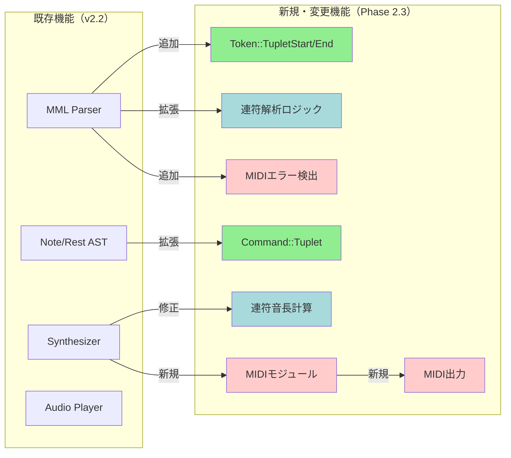
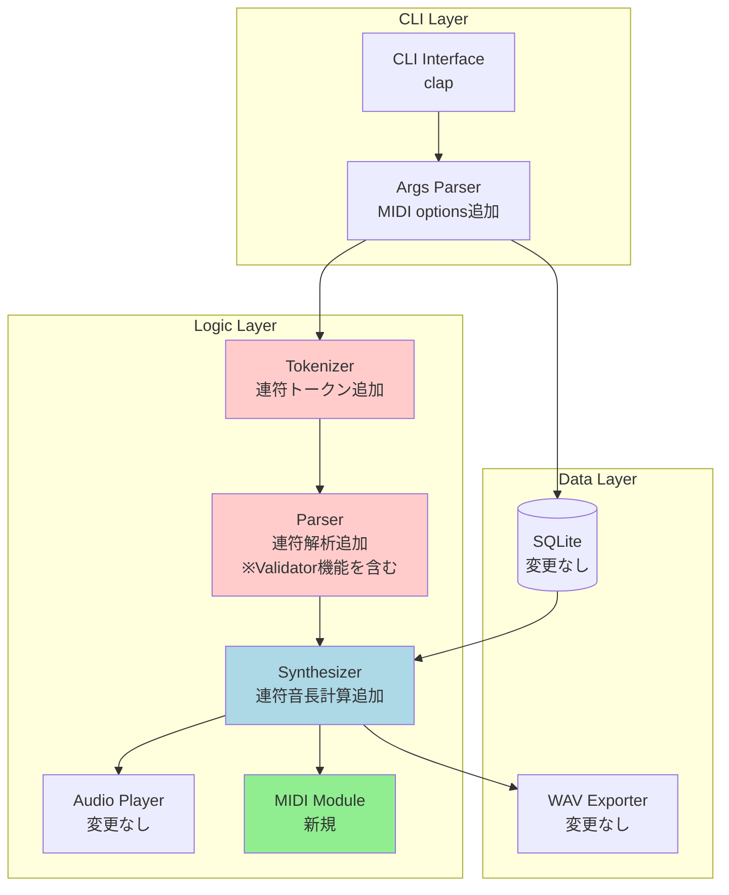
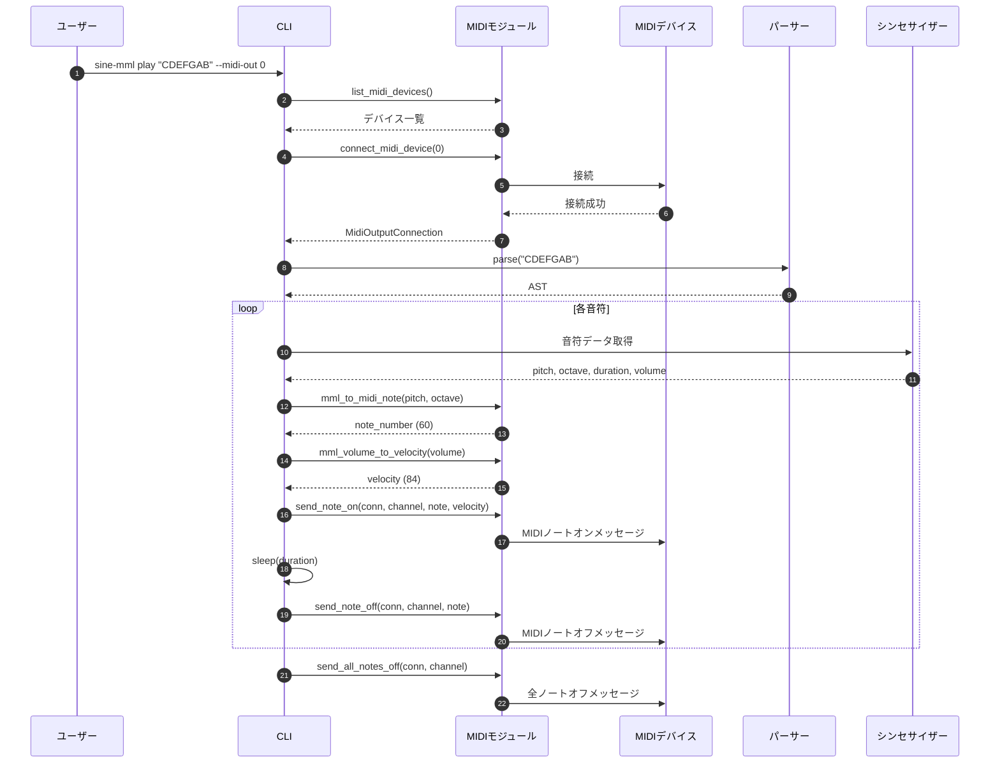
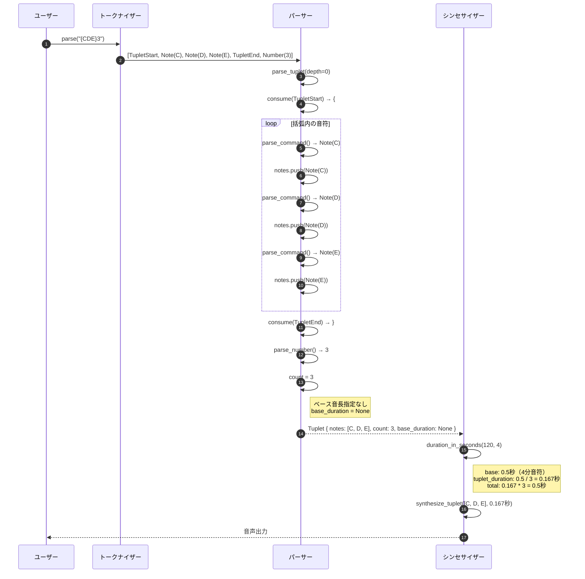

# BASIC-CLI-006 MML Synthesizer CLI MIDIストリーミング・連符機能 基本設計書

## 0. ドキュメント情報

| 項目 | 内容 |
|------|------|
| ドキュメントID | BASIC-CLI-006 |
| バージョン | 1.1.0 |
| ステータス | 承認済み |
| 作成日 | 2026-01-14 |
| 最終更新日 | 2026-01-14 |
| 作成者 | basic-design-writer |
| 関連文書 | REQ-CLI-006_MIDI-Streaming-Tuplet.md (v1.0.1)<br>BASIC-CLI-001_MML-Synthesizer.md (v1.1.0)<br>BASIC-CLI-005_Tie-Notation.md (v1.1.0) |

---

## 1. システム概要

### 1.1 目的

sine-mml v2.2のタイ記号機能実装完了後、音楽表現力のさらなる向上と外部機器連携のため、以下の機能を追加する：

1. **MIDIストリーミング機能**: 外部MIDI機器やソフトウェアシンセサイザーとの連携により、内蔵シンセサイザーでは実現できない高品質な音色での演奏を可能にする
2. **連符（n連符）機能**: 3連符、5連符などの連符構文により、ジャズやクラシック音楽で頻繁に使用される複雑なリズムパターンを表現可能にする
3. **楽譜との互換性向上**: 一般的な楽譜で使用される連符記法をMMLで実現し、楽譜からの入力を容易にする

### 1.2 背景

REQ-CLI-006に記載された以下のユーザー要望に対応：

- **MIDIストリーミング機能の欠如**: 現状、sine-mmlは内蔵シンセサイザーでのみ再生可能で、外部MIDI機器やソフトウェアシンセサイザーとの連携ができない。REQ-CLI-001では「MIDI入出力: 対象外」としていたが、ユーザーからの要望により対象範囲に変更
- **連符（n連符）表現の欠如**: 3連符、5連符などの連符を表現する手段がなく、複雑なリズムパターンを記述できない
- **楽譜との互換性**: 一般的な楽譜では連符が頻繁に使用されるが、MMLでは同等の機能がない

### 1.3 スコープ

#### 対象範囲
- MIDIストリーミング機能（MIDI出力のみ）
  - `--midi-out` オプションの追加
  - MIDIデバイス選択機能（`--midi-list`）
  - MIDIチャンネル指定（`--midi-channel`）
  - リアルタイムMIDIメッセージ送信
  - MIDIエラーハンドリング
- 連符（n連符）機能
  - `{...}n` ブラケット構文の追加
  - 3連符、4連符、5連符などの任意のn連符対応
  - 休符を含む連符
  - タイ記号との組み合わせ
  - ネスト対応（最大5階層）

#### 対象外
- MIDI入力（MIDIキーボードからの入力）
- MIDIファイル（.mid）の入出力
- MIDI CC（コントロールチェンジ）メッセージ
- MIDIクロック同期
- 連符のネスト深度6階層以上

### 1.4 Phase 2.3との関係

本機能拡張はsine-mml v2.3の**新規開発**として位置づけられる：

- **Phase 1.0**: 基本機能実装（BASIC-CLI-001）
- **Phase 2.0**: 機能改善（BASIC-CLI-002） - メトロノーム強化、ノーマライゼーション、E2Eテスト
- **Phase 2.0（継続）**: MML構文拡張（BASIC-CLI-003） - ループ構文、小文字対応、履歴管理強化
- **Phase 2.1**: MML高度な機能拡張（BASIC-CLI-004） - ファイル読み取り、相対ボリューム、ループネスト
- **Phase 2.2**: タイ記号機能（BASIC-CLI-005） - タイ記号による音符連結
- **Phase 2.3**: MIDIストリーミング・連符機能（本設計書） - MIDI出力、連符構文

---

## 2. 既存システムとの関係

### 2.1 影響を受けるコンポーネント

| コンポーネント | 影響内容 | 変更レベル |
|---------------|----------|-----------|
| `src/mml/mod.rs` | `Token::TupletStart`, `Token::TupletEnd`, `Token::Colon`追加 | 低 |
| `src/mml/ast.rs` | `Command::Tuplet`バリアント追加 | 中 |
| `src/mml/parser.rs` | 連符解析ロジック追加（`parse_tuplet`新規作成） | 高 |
| `src/mml/error.rs` | 連符関連エラー4種追加（MML-E020〜E023） | 中 |
| `src/audio/synthesizer.rs` | 連符音長計算処理追加 | 中 |
| `src/cli/args.rs` | `--midi-out`, `--midi-channel`, `--midi-list`オプション追加 | 中 |
| `src/midi/` | **新規モジュール**: MIDIデバイス管理、メッセージ送信 | 高 |

### 2.2 変更概要図



---

## 3. システムアーキテクチャ

### 3.1 変更後の全体構成図



### 3.2 MIDI出力とオーディオ再生の同期戦略

**制約事項**: `--midi-out` と `--waveform` の同時指定は**非推奨**です。

**理由**:
- 内蔵シンセサイザー（cpal）とMIDI出力（midir）は独立したオーディオストリームを使用
- 完全な同期を保証するには、両者を同一のオーディオクロックで管理する必要があるが、Phase 2.3では対応しない
- 音ズレ（レイテンシの差）が発生する可能性がある

**推奨される使用方法**:
1. **排他利用（推奨）**: 内蔵シンセサイザーとMIDI出力のどちらか一方のみを使用
   - `sine-mml play "CDEFGAB" --waveform sine` （内蔵シンセのみ）
   - `sine-mml play "CDEFGAB" --midi-out 0` （MIDI出力のみ）

2. **ベストエフォート同期（非推奨）**: 同時使用する場合は、音ズレが発生する可能性を了承の上で使用
   - `sine-mml play "CDEFGAB" --waveform sine --midi-out 0`
   - 両者は同時に開始されるが、完全同期は保証されない

### 3.3 新規・変更コンポーネント一覧

| コンポーネント | 種別 | 役割 |
|---------------|------|------|
| `Token::TupletStart` | 新規バリアント | 連符開始`{`のトークン表現 |
| `Token::TupletEnd` | 新規バリアント | 連符終了`}`のトークン表現 |
| `Token::Colon` | 新規バリアント | ベース音長指定`:`のトークン表現 |
| `Command::Tuplet` | 新規バリアント | 連符のAST表現 |
| `Parser::parse_tuplet` | 新規関数 | 連符構文の解析 |
| `Command::duration_in_seconds` | 修正関数 | 連符音長計算を追加 |
| `Parser::validate_tuplet` | 新規関数 | 連符のバリデーション（Parser内で実行） |
| `ParseError::UnclosedTuplet` | 新規エラー | 連符の閉じ括弧がないエラー |
| `ParseError::TupletCountMissing` | 新規エラー | 連符数が指定されていないエラー |
| `ParseError::InvalidTupletCount` | 新規エラー | 無効な連符数エラー |
| `ParseError::TupletNestTooDeep` | 新規エラー | 連符のネスト深度超過エラー |
| `src/midi/mod.rs` | 新規モジュール | MIDIモジュールの定義 |
| `src/midi/device.rs` | 新規ファイル | MIDIデバイス列挙・接続 |
| `src/midi/message.rs` | 新規ファイル | MIDIメッセージ送信 |
| `src/midi/error.rs` | 新規ファイル | MIDIエラー定義（MML-E015〜E019, E024） |

---

## 4. 技術スタック

### 4.1 既存技術（維持）

| レイヤー | 技術 | バージョン | 役割 |
|----------|------|------------|------|
| 言語 | Rust | 1.70+ | アプリケーション全体 |
| CLI Framework | clap | 4.5 | コマンドライン引数解析 |
| Audio Synthesis | fundsp | 0.18 | 音声合成（DSPグラフ） |
| Audio I/O | cpal | 0.15 | オーディオストリーム制御 |
| Database | rusqlite | 0.38 | SQLite操作 |
| WAV I/O | hound | 3.5 | WAVファイル出力 |
| UI Library | indicatif | 0.18 | プログレスバー |
| UI Library | comfy-table | 7.0 | テーブル表示 |
| Error Handling | anyhow | 1.0 | エラーハンドリング |
| Error Handling | thiserror | 1.0 | カスタムエラー型 |

### 4.2 新規追加

| レイヤー | 技術 | バージョン | 役割 |
|----------|------|------------|------|
| MIDI I/O | midir | 0.9+ | クロスプラットフォームMIDI I/O |

### 4.3 技術選定理由

#### MIDI I/O: midir
- **選定理由**: クロスプラットフォーム対応（Windows, macOS, Linux）、活発なメンテナンス、シンプルなAPI
- **代替案**: 
  - `portmidi-rs` → メンテナンス停止
  - `wmidi` → MIDI I/Oなし（メッセージパースのみ）
- **参考**: [midir GitHub](https://github.com/Boddlnagg/midir)

#### 連符音長計算: `Iterator::sum()`
- **選定理由**: Rust標準ライブラリ、簡潔な合算処理
- **代替案**: 手動ループ → 可読性低下
- **実装方針**: 連符内の各音符の音長を`count`で除算し、合算

#### 連符ネスト検出: 再帰カウンター
- **選定理由**: パーサーの再帰呼び出し深度を追跡
- **代替案**: スタック管理 → 複雑性増加
- **実装方針**: `parse_tuplet`呼び出し時にカウンターをインクリメント、最大5階層で制限

---

## 5. モジュール設計

### 5.1 新規モジュール: `src/midi/`

#### `src/midi/mod.rs`
```rust
pub mod device;
pub mod message;
pub mod error;

pub use device::{list_midi_devices, resolve_device_id, connect_midi_device};
pub use message::{send_note_on, send_note_off, send_all_notes_off};
pub use error::MidiError;
```

#### `src/midi/device.rs`
**役割**: MIDIデバイスの列挙と接続

**主要関数**:
```rust
/// 利用可能なMIDIデバイス一覧を取得
pub fn list_midi_devices() -> Result<Vec<String>, MidiError>;

/// デバイス名またはIDからデバイスIDを解決
/// 
/// # Arguments
/// * `name_or_id` - デバイス名（文字列）またはデバイスID（数値文字列）
/// 
/// # Returns
/// * `Ok(usize)` - 解決されたデバイスID
/// * `Err(MidiError)` - エラー
/// 
/// # 実装ロジック
/// 1. 入力文字列が数値として解析可能か確認
/// 2. 数値の場合: デバイスIDとして扱い、範囲チェック
/// 3. 数値でない場合: デバイス名として扱い、部分一致検索
/// 4. 該当するデバイスが見つからない場合はエラー
pub fn resolve_device_id(name_or_id: &str) -> Result<usize, MidiError>;

/// MIDIデバイスに接続
/// 
/// # Arguments
/// * `device_id_or_name` - デバイスIDまたはデバイス名
/// 
/// # Returns
/// * `Ok(MidiOutputConnection)` - MIDI出力接続
/// * `Err(MidiError)` - エラー
/// 
/// # 実装ロジック
/// 1. `resolve_device_id` でデバイスIDを解決
/// 2. 解決されたIDでMIDIデバイスに接続
pub fn connect_midi_device(device_id_or_name: &str) -> Result<MidiOutputConnection, MidiError>;
```

**デバイス名解決の実装例**:
```rust
pub fn resolve_device_id(name_or_id: &str) -> Result<usize, MidiError> {
    // 数値として解析を試みる
    if let Ok(id) = name_or_id.parse::<usize>() {
        // デバイスIDとして扱う
        let devices = list_midi_devices()?;
        if id >= devices.len() {
            return Err(MidiError::InvalidDeviceId(id));
        }
        return Ok(id);
    }
    
    // デバイス名として扱う
    let devices = list_midi_devices()?;
    for (i, device_name) in devices.iter().enumerate() {
        if device_name.contains(name_or_id) {
            return Ok(i);
        }
    }
    
    Err(MidiError::NoDeviceFound)
}
```

#### `src/midi/message.rs`
**役割**: MIDIメッセージの送信

**主要関数**:
```rust
/// MIDIノートオンメッセージを送信
pub fn send_note_on(
    conn: &mut MidiOutputConnection,
    channel: u8,
    note: u8,
    velocity: u8,
) -> Result<(), MidiError>;

/// MIDIノートオフメッセージを送信
pub fn send_note_off(
    conn: &mut MidiOutputConnection,
    channel: u8,
    note: u8,
) -> Result<(), MidiError>;

/// 全ノートオフメッセージを送信（演奏中断時）
pub fn send_all_notes_off(
    conn: &mut MidiOutputConnection,
    channel: u8,
) -> Result<(), MidiError>;

/// MML音程からMIDIノートナンバーに変換
pub fn mml_to_midi_note(pitch: Pitch, accidental: Option<Accidental>, octave: u8) -> u8;

/// MML音量からMIDIベロシティに変換
pub fn mml_volume_to_velocity(volume: u8) -> u8;
```

#### `src/midi/error.rs`
**役割**: MIDIエラーの定義

```rust
#[derive(Debug, thiserror::Error)]
pub enum MidiError {
    /// MML-E015: MIDIデバイスが見つからない
    #[error("[MML-E015] MIDIデバイスが見つかりません")]
    NoDeviceFound,
    
    /// MML-E016: MIDIデバイス接続エラー
    #[error("[MML-E016] MIDIデバイスへの接続に失敗しました: {0}")]
    ConnectionFailed(String),
    
    /// MML-E017: MIDIメッセージ送信エラー
    #[error("[MML-E017] MIDIメッセージの送信に失敗しました: {0}")]
    SendFailed(String),
    
    /// MML-E018: 無効なMIDIデバイスID
    #[error("[MML-E018] 無効なMIDIデバイスIDです: {0}")]
    InvalidDeviceId(usize),
    
    /// MML-E019: MIDIデバイス切断
    #[error("[MML-E019] MIDIデバイスが切断されました")]
    DeviceDisconnected,
    
    /// MML-E024: 無効なMIDIチャンネル
    #[error("[MML-E024] 無効なMIDIチャンネルです（1-16を指定してください）: {0}")]
    InvalidChannel(u8),
}
```

### 5.2 変更対象モジュール

#### `src/mml/mod.rs`
**変更内容**:
- `Token` enumに連符関連トークン追加：
  ```rust
  #[derive(Debug, Clone, PartialEq, Eq)]
  pub enum Token {
      // 既存のトークン...
      Note(char),
      Rest,
      Sharp,
      Flat,
      Dot,
      Number(u32),
      // ... 他のトークン ...
      
      /// 連符開始 {
      TupletStart,
      /// 連符終了 }
      TupletEnd,
      /// ベース音長指定 :
      Colon,
  }
  ```

#### `src/mml/ast.rs`
**変更内容**:
- `Command` enumに`Tuplet`バリアント追加：
  ```rust
  #[derive(Debug, Clone, PartialEq, Eq)]
  pub enum Command {
      // 既存のコマンド...
      Note(Note),
      Rest(Rest),
      SetOctave(u8),
      // ... 他のコマンド ...
      
      /// 連符
      Tuplet {
          /// 連符内の音符リスト
          notes: Vec<Command>,
          /// 連符数（2-99）
          count: u8,
          /// ベース音長（: 後の指定、Noneの場合はデフォルト音長を使用）
          base_duration: Option<u8>,
      },
  }
  ```

#### `src/mml/parser.rs`
**変更内容**:
1. **トークナイザーに連符トークン追加**:
   ```rust
   fn tokenize_char(c: char) -> Option<Token> {
       match c {
           'C' | 'D' | 'E' | 'F' | 'G' | 'A' | 'B' => Some(Token::Note(c)),
           'R' => Some(Token::Rest),
           '#' | '+' => Some(Token::Sharp),
           '-' | 'B' => Some(Token::Flat),
           '.' => Some(Token::Dot),
           '{' => Some(Token::TupletStart),  // 追加
           '}' => Some(Token::TupletEnd),    // 追加
           ':' => Some(Token::Colon),        // 追加
           // ... 他のトークン ...
           _ => None,
       }
   }
   ```

2. **`parse_tuplet`関数追加**:
   ```rust
   fn parse_tuplet(&mut self, depth: usize) -> Result<Command, ParseError> {
       // ネスト深度チェック
       if depth >= 5 {
           return Err(ParseError::TupletNestTooDeep {
               position: self.pos,
           });
       }
       
       self.consume(Token::TupletStart)?;  // { を消費
       
       let mut notes = Vec::new();
       
       // 括弧内の音符を解析
       while !self.check(Token::TupletEnd) {
           if self.is_eof() {
               return Err(ParseError::UnclosedTuplet {
                   position: self.pos,
               });
           }
           
           // 再帰的に連符をパース（ネスト対応）
           let cmd = if self.check(Token::TupletStart) {
               self.parse_tuplet(depth + 1)?
           } else {
               self.parse_command()?
           };
           notes.push(cmd);
       }
       
       self.consume(Token::TupletEnd)?;  // } を消費
       
       // 連符数を取得
       if !self.current_char().is_ascii_digit() {
           return Err(ParseError::TupletCountMissing {
               position: self.pos,
           });
       }
       
       let count = self.parse_number()?;
       
       if count < 2 {
           return Err(ParseError::InvalidTupletCount {
               count,
               position: self.pos,
           });
       }
       
       // ベース音長の指定（オプション）
       let base_duration = if self.check(Token::Colon) {
           self.advance();  // : を消費
           Some(self.parse_number()?)
       } else {
           None
       };
       
       Ok(Command::Tuplet {
           notes,
           count,
           base_duration,
       })
   }
   ```

#### `src/mml/error.rs`
**変更内容**:
- エラー型追加：
  ```rust
  #[derive(Debug, thiserror::Error)]
  pub enum ParseError {
      // 既存のエラー...
      
      /// MML-E020: 連符の閉じ括弧がない
      #[error("[MML-E020] 連符の閉じ括弧 '}}' がありません: 位置 {position}")]
      UnclosedTuplet {
          position: usize,
      },
      
      /// MML-E021: 連符数が指定されていない
      #[error("[MML-E021] 連符数が指定されていません: 位置 {position}")]
      TupletCountMissing {
          position: usize,
      },
      
      /// MML-E022: 無効な連符数
      #[error("[MML-E022] 無効な連符数です（2以上を指定してください）: {count}, 位置 {position}")]
      InvalidTupletCount {
          count: u8,
          position: usize,
      },
      
      /// MML-E023: 連符のネスト深度超過
      #[error("[MML-E023] 連符のネスト深度が最大値（5階層）を超えています: 位置 {position}")]
      TupletNestTooDeep {
          position: usize,
      },
  }
  ```

#### `src/audio/synthesizer.rs`
**変更内容**:
- `Command::duration_in_seconds`に連符処理追加：
  ```rust
  impl Command {
      pub fn duration_in_seconds(&self, bpm: u16, default_length: u8) -> f32 {
          match self {
              Command::Tuplet { notes, count, base_duration } => {
                  // ベース音長を取得
                  let base = base_duration.unwrap_or(default_length);
                  let base_seconds = 60.0 / bpm as f32 * 4.0 / base as f32;
                  
                  // 各音符の音長を調整
                  let tuplet_duration = base_seconds / *count as f32;
                  
                  // 全音符の合計時間
                  notes.iter()
                      .map(|note| {
                          // 音符が個別に音長を指定している場合は考慮
                          match note {
                              Command::Note(n) => {
                                  if n.duration.is_some() {
                                      n.duration_in_seconds(bpm, default_length) / *count as f32
                                  } else {
                                      tuplet_duration
                                  }
                              },
                              Command::Rest(r) => {
                                  if r.duration.is_some() {
                                      r.duration_in_seconds(bpm, default_length) / *count as f32
                                  } else {
                                      tuplet_duration
                                  }
                              },
                              Command::Tuplet { .. } => {
                                  // ネストした連符の処理
                                  note.duration_in_seconds(bpm, default_length)
                              },
                              _ => 0.0,
                          }
                      })
                      .sum()
              },
              // 既存の処理...
          }
      }
  }
  ```

#### `src/cli/args.rs`
**変更内容**:
- `PlayArgs`に以下のフィールド追加：
  ```rust
  #[derive(Debug, Parser)]
  pub struct PlayArgs {
      // 既存のフィールド...
      
      /// MIDIデバイスに出力（デバイスIDまたはデバイス名）
      #[arg(long, value_name = "DEVICE")]
      pub midi_out: Option<String>,
      
      /// MIDIチャンネル（1-16、デフォルト: 1）
      #[arg(long, value_name = "CHANNEL", default_value = "1")]
      pub midi_channel: u8,
  }
  
  /// MIDIデバイス一覧表示
  #[derive(Debug, Parser)]
  pub struct MidiListArgs {}
  ```

### 5.3 ファイル構成（差分）

```diff
src/
├── mml/
│   ├── mod.rs                      # 修正: Token::TupletStart/End/Colon追加
│   ├── ast.rs                      # 修正: Command::Tuplet追加
│   ├── parser.rs                   # 修正: parse_tuplet追加
│   └── error.rs                    # 修正: 連符エラー4種追加
├── audio/
│   └── synthesizer.rs              # 修正: 連符音長計算追加
├── cli/
│   └── args.rs                     # 修正: MIDI options追加
+├── midi/                           # 新規: MIDIモジュール
+│   ├── mod.rs                      # 新規: MIDIモジュールの定義
+│   ├── device.rs                   # 新規: MIDIデバイス列挙・接続
+│   ├── message.rs                  # 新規: MIDIメッセージ送信
+│   └── error.rs                    # 新規: MIDIエラー定義
```

---

## 6. 機能一覧

### 6.1 新規機能

| ID | 機能名 | 概要 | 優先度 |
|----|--------|------|--------|
| F-031 | MIDIストリーミング | `--midi-out` でMIDIデバイスにリアルタイム送信 | 必須 |
| F-032 | 連符（n連符） | `{...}n` で連符を表現 | 必須 |

### 6.2 機能詳細

#### F-031: MIDIストリーミング

**概要**: `--midi-out` オプションでMIDIデバイスにリアルタイムでMIDIメッセージを送信

**入力**:
- MML文字列
- `--midi-out` オプション（デバイス名またはデバイスID）
- `--midi-channel` オプション（MIDIチャンネル: 1-16、デフォルト: 1）
- `--midi-list` オプション（利用可能なMIDIデバイス一覧を表示）

**出力**:
- MIDIノートオン/オフメッセージ
- MIDIベロシティ（音量）
- MIDIチャンネル（指定されたチャンネル、デフォルト: 1）

**処理フロー**:


**ビジネスルール**:
- BR-090: MIDIチャンネルは `--midi-channel` オプションで指定可能（1-16、デフォルト: 1）
- BR-091: MML音量（V0-V15）をMIDIベロシティ（0-127）に変換（V0=0, V15=127, 線形補間）
- BR-092: MIDIノートナンバーはMMLオクターブと音程から計算（C4=60）
- BR-093: MIDIデバイスが接続されていない場合はエラー
- BR-094: 演奏中断時は全ノートオフメッセージを送信してクリーンアップ
- BR-104: 無効なMIDIチャンネル（0以下または17以上）はエラー

**制約事項**:
- MIDI入力は非対応
- MIDIファイル（.mid）の入出力は非対応
- MIDI CC（コントロールチェンジ）メッセージは非対応
- MIDIクロック同期は非対応

#### F-032: 連符（n連符）

**概要**: `{...}n` ブラケット構文で連符を表現

**入力**:
- MML文字列（連符を含む）
  - 例: `{CDE}3`, `{CDEF}4`, `L8 {CDE}3`, `{CDE}3:2`

**出力**:
- 連符で指定された音符の音長を調整した音

**処理フロー**:


**ビジネスルール**:
- BR-095: 連符数（n）は2以上の整数
- BR-096: 連符のベース音長はデフォルト音長（`L4` など）または `:` 後の指定
- BR-097: 連符内の音符は個別に音長を指定可能（`{C4 D8 E}3` など）
- BR-098: 連符内に休符を含めることが可能（`{CDR}3`）
- BR-099: 連符内にタイ記号を含めることが可能（`{C4&8 D E}3`）
- BR-100: 連符のネスト深度は最大5階層（ループと同様）
- BR-101: 連符とループの組み合わせが可能（`[{CDE}3]2`）
- BR-102: 連符数が指定されていない場合はエラー（`{CDE}` は不可）
- BR-103: 連符数が0または1の場合はエラー

**制約事項**:
- 連符のネスト深度6階層以上は不可
- 連符数は99まで（実用上の制限）

---

## 7. 画面（サブコマンド）一覧

### 7.1 既存サブコマンド（変更あり）

| 画面ID | サブコマンド | 名称 | 変更内容 |
|--------|--------------|------|----------|
| S-001 | `play` | 演奏画面 | `--midi-out`, `--midi-channel`オプション追加。連符構文対応。 |
| S-002 | `history` | 履歴一覧画面 | 変更なし |
| S-003 | `export` | 出力画面 | 変更なし |

### 7.2 新規サブコマンド

| 画面ID | サブコマンド | 名称 | 概要 |
|--------|--------------|------|------|
| S-004 | `--midi-list` | MIDIデバイス一覧画面 | 利用可能なMIDIデバイス一覧を表示 |

#### 使用例
```bash
# MIDIデバイス一覧表示
sine-mml --midi-list

# MIDIストリーミング（デバイスID指定）
sine-mml play "CDEFGAB" --midi-out 0

# MIDIストリーミング（デバイス名指定）
sine-mml play "CDEFGAB" --midi-out "IAC Driver Bus 1"

# MIDIチャンネル指定（1-16、デフォルト: 1）
sine-mml play "CDEFGAB" --midi-out 0 --midi-channel 2

# ドラムチャンネル（ch10）を指定
sine-mml play "C4 D4 E4 F4" --midi-out 0 --midi-channel 10

# 内蔵シンセサイザーとMIDI出力の両方（非推奨: 音ズレの可能性あり）
# 完全同期が必要な場合は、どちらか一方のみを使用してください
sine-mml play "CDEFGAB" --waveform sine --midi-out 0

# 基本的な連符
sine-mml play "{CDE}3"           # 3連符: 3音を1拍に収める

# デフォルト音長との連動
sine-mml play "L8 {CDE}3"        # 8分音符ベースの3連符

# ベース音長指定
sine-mml play "{CDE}3:2"         # 2分音符に3音を収める

# 休符を含む連符
sine-mml play "{CDR}3"           # 3連符の3音目が休符

# タイとの組み合わせ
sine-mml play "{C4&8 D E}3"      # 連符内でタイ記号を使用

# ループとの組み合わせ
sine-mml play "[{CDE}3]2"        # 3連符を2回繰り返し

# ネスト
sine-mml play "{{CDE}3 FG}5"     # ネストした連符
```

---

## 8. データモデル

### 8.1 データベーススキーマ（変更なし）

既存の `history` テーブルをそのまま使用。スキーマ変更なし。

| カラム名 | 型 | 制約 | 説明 |
|----------|-----|------|------|
| id | INTEGER | PRIMARY KEY, AUTOINCREMENT | 履歴ID |
| mml | TEXT | NOT NULL | MML文字列（連符を含む） |
| waveform | TEXT | NOT NULL | 波形タイプ |
| volume | REAL | NOT NULL | 音量 |
| bpm | INTEGER | NOT NULL | テンポ |
| note | TEXT | NULL | メモ（v2.1で追加） |
| created_at | TEXT | NOT NULL | 作成日時（ISO 8601） |

**注**: MIDIストリーミングの設定（`--midi-out`, `--midi-channel`）は履歴に保存されない。これは、MIDIデバイスの接続状態が環境依存であり、履歴再生時に同じデバイスが利用可能とは限らないため。

---

## 9. インターフェース設計

### 9.1 MML構文の拡張

#### 追加される構文

```
{<音符>...}n         # 連符
{<音符>...}n:m       # ベース音長指定の連符
```

#### 例

| MML | 展開後 | 説明 |
|-----|--------|------|
| `{CDE}3` | 3音を1拍（4分音符）に収める | 基本的な3連符 |
| `{CDEF}4` | 4音を1拍に収める | 4連符 |
| `L8 {CDE}3` | 3音を8分音符に収める | 8分音符ベースの3連符 |
| `{CDE}3:2` | 3音を2分音符に収める | ベース音長指定の3連符 |
| `{CDR}3` | 3連符の3音目が休符 | 休符を含む連符 |
| `{C4&8 D E}3` | タイ記号を含む3連符 | タイとの組み合わせ |
| `[{CDE}3]2` | 3連符を2回繰り返し | ループとの組み合わせ |
| `{{CDE}3 FG}5` | ネストした連符 | 最大5階層 |

### 9.2 CLIオプションの追加

#### 新規オプション

```bash
# MIDIデバイス一覧表示
sine-mml --midi-list

# MIDIストリーミング（デバイスID指定）
sine-mml play "CDEFGAB" --midi-out 0

# MIDIストリーミング（デバイス名指定）
sine-mml play "CDEFGAB" --midi-out "IAC Driver Bus 1"

# MIDIチャンネル指定（1-16、デフォルト: 1）
sine-mml play "CDEFGAB" --midi-out 0 --midi-channel 2

# ドラムチャンネル（ch10）を指定
sine-mml play "C4 D4 E4 F4" --midi-out 0 --midi-channel 10

# 内蔵シンセサイザーとMIDI出力の両方（非推奨: 音ズレの可能性あり）
# 完全同期が必要な場合は、どちらか一方のみを使用してください
sine-mml play "CDEFGAB" --waveform sine --midi-out 0
```

### 9.3 内部API（新規関数シグネチャ）

#### MIDIデバイス列挙

```rust
// src/midi/device.rs

/// 利用可能なMIDIデバイス一覧を取得
///
/// # Returns
/// * `Ok(Vec<String>)` - デバイス名のリスト
/// * `Err(MidiError)` - エラー
pub fn list_midi_devices() -> Result<Vec<String>, MidiError>;
```

#### MIDIデバイス名解決

```rust
// src/midi/device.rs

/// デバイス名またはIDからデバイスIDを解決
///
/// # Arguments
/// * `name_or_id` - デバイス名（文字列）またはデバイスID（数値文字列）
///
/// # Returns
/// * `Ok(usize)` - 解決されたデバイスID
/// * `Err(MidiError)` - エラー
///
/// # Examples
/// ```
/// // デバイスID指定
/// let id = resolve_device_id("0")?; // -> 0
/// 
/// // デバイス名指定
/// let id = resolve_device_id("IAC Driver Bus 1")?; // -> 該当するデバイスのID
/// ```
pub fn resolve_device_id(name_or_id: &str) -> Result<usize, MidiError>;
```

#### MIDIデバイス接続

```rust
// src/midi/device.rs

/// MIDIデバイスに接続
///
/// # Arguments
/// * `device_id_or_name` - デバイスIDまたはデバイス名
///
/// # Returns
/// * `Ok(MidiOutputConnection)` - MIDI出力接続
/// * `Err(MidiError)` - エラー
///
/// # Examples
/// ```
/// // デバイスID指定
/// let conn = connect_midi_device("0")?;
/// 
/// // デバイス名指定
/// let conn = connect_midi_device("IAC Driver Bus 1")?;
/// ```
pub fn connect_midi_device(device_id_or_name: &str) -> Result<MidiOutputConnection, MidiError>;
```

#### MIDIメッセージ送信

```rust
// src/midi/message.rs

/// MIDIノートオンメッセージを送信
///
/// # Arguments
/// * `conn` - MIDI出力接続
/// * `channel` - MIDIチャンネル（1-16）
/// * `note` - MIDIノートナンバー（0-127）
/// * `velocity` - ベロシティ（0-127）
///
/// # Returns
/// * `Ok(())` - 成功
/// * `Err(MidiError)` - エラー
pub fn send_note_on(
    conn: &mut MidiOutputConnection,
    channel: u8,
    note: u8,
    velocity: u8,
) -> Result<(), MidiError>;

/// MIDIノートオフメッセージを送信
///
/// # Arguments
/// * `conn` - MIDI出力接続
/// * `channel` - MIDIチャンネル（1-16）
/// * `note` - MIDIノートナンバー（0-127）
///
/// # Returns
/// * `Ok(())` - 成功
/// * `Err(MidiError)` - エラー
pub fn send_note_off(
    conn: &mut MidiOutputConnection,
    channel: u8,
    note: u8,
) -> Result<(), MidiError>;
```

#### 連符解析

```rust
// src/mml/parser.rs

/// 連符構文を解析
///
/// # Arguments
/// * `depth` - 現在のネスト深度（0から始まる）
///
/// # Returns
/// * `Ok(Command::Tuplet)` - 連符コマンド
/// * `Err(ParseError)` - エラー
fn parse_tuplet(&mut self, depth: usize) -> Result<Command, ParseError>;
```

---

## 10. 処理フロー

### 10.1 連符解析フロー

```mermaid
flowchart TD
    Start[連符開始 '{' 検出] --> CheckDepth{ネスト深度<br>< 5?}
    
    CheckDepth -->|Yes| ConsumeStart['{' を消費]
    CheckDepth -->|No| ErrorDepth[Error: TupletNestTooDeep]
    
    ConsumeStart --> ParseNotes[notes = []]
    
    ParseNotes --> CheckEnd{'}' か?}
    
    CheckEnd -->|No| CheckNested{'{' か?}
    CheckEnd -->|Yes| ConsumeEnd['}' を消費]
    
    CheckNested -->|Yes| ParseNestedTuplet[parse_tuplet(depth+1)]
    CheckNested -->|No| ParseCommand[parse_command()]
    
    ParseNestedTuplet --> AddNote[notes.push(cmd)]
    ParseCommand --> AddNote
    
    AddNote --> CheckEnd
    
    ConsumeEnd --> CheckCount{数値が続く?}
    
    CheckCount -->|Yes| ParseCount[count = parse_number()]
    CheckCount -->|No| ErrorCount[Error: TupletCountMissing]
    
    ParseCount --> ValidateCount{count >= 2?}
    
    ValidateCount -->|Yes| CheckColon{':' が続く?}
    ValidateCount -->|No| ErrorInvalid[Error: InvalidTupletCount]
    
    CheckColon -->|Yes| ParseBase[base_duration = parse_number()]
    CheckColon -->|No| NoBase[base_duration = None]
    
    ParseBase --> CreateTuplet[Tuplet { notes, count, base_duration }]
    NoBase --> CreateTuplet
    
    CreateTuplet --> End[解析完了]
    
    ErrorDepth --> End
    ErrorCount --> End
    ErrorInvalid --> End
    
    style ErrorDepth fill:#ffcccb
    style ErrorCount fill:#ffcccb
    style ErrorInvalid fill:#ffcccb
    style CreateTuplet fill:#90ee90
```

### 10.2 MIDI送信フロー

```mermaid
flowchart TD
    Start[MML解析完了] --> CheckMidi{--midi-out<br>指定あり?}
    
    CheckMidi -->|No| AudioOnly[内蔵シンセサイザーのみ]
    CheckMidi -->|Yes| ListDevices[MIDIデバイス列挙]
    
    ListDevices --> ConnectDevice[MIDIデバイス接続]
    
    ConnectDevice --> CheckError{接続成功?}
    
    CheckError -->|No| ErrorConnect[Error: ConnectionFailed]
    CheckError -->|Yes| InitTime[開始時刻を記録<br>start_time = Instant::now]
    
    InitTime --> InitDuration[累積音長を初期化<br>elapsed = Duration::ZERO]
    InitDuration --> LoopNotes[各音符をループ]
    
    LoopNotes --> ConvertNote[MML → MIDIノート変換]
    ConvertNote --> ConvertVelocity[MML音量 → ベロシティ変換]
    ConvertVelocity --> SendNoteOn[MIDIノートオン送信]
    SendNoteOn --> UpdateElapsed[累積音長を更新<br>elapsed += note_duration]
    UpdateElapsed --> CalcTarget[目標時刻を計算<br>target = start_time + elapsed]
    CalcTarget --> CheckWait{target > now?}
    
    CheckWait -->|Yes| WaitUntil[target時刻まで待機<br>sleep(target - now)]
    CheckWait -->|No| NoWait[待機なし]
    
    WaitUntil --> SendNoteOff[MIDIノートオフ送信]
    NoWait --> SendNoteOff
    SendNoteOff --> CheckNext{次の音符あり?}
    
    CheckNext -->|Yes| LoopNotes
    CheckNext -->|No| AllNotesOff[全ノートオフ送信]
    
    AllNotesOff --> End[演奏完了]
    AudioOnly --> End
    ErrorConnect --> End
    
    style ErrorConnect fill:#ffcccb
    style SendNoteOn fill:#90ee90
    style SendNoteOff fill:#90ee90
    style AllNotesOff fill:#90ee90
    style InitTime fill:#add8e6
    style UpdateElapsed fill:#add8e6
    style CalcTarget fill:#add8e6
```

**タイミング制御の実装例**:

```rust
use std::time::{Duration, Instant};

pub fn play_midi_stream(
    conn: &mut MidiOutputConnection,
    notes: &[Note],
    channel: u8,
    bpm: u16,
) -> Result<(), MidiError> {
    let start_time = Instant::now();
    let mut elapsed_notes_duration = Duration::ZERO;
    
    for note in notes {
        // MIDIノートオン送信
        let midi_note = mml_to_midi_note(note.pitch, note.accidental, note.octave);
        let velocity = mml_volume_to_velocity(note.volume);
        send_note_on(conn, channel, midi_note, velocity)?;
        
        // 音長を計算
        let note_duration = note.duration_in_seconds(bpm);
        elapsed_notes_duration += Duration::from_secs_f32(note_duration);
        
        // 目標時刻を計算（絶対時刻管理）
        let target_time = start_time + elapsed_notes_duration;
        
        // 目標時刻まで待機
        let now = Instant::now();
        if target_time > now {
            std::thread::sleep(target_time - now);
        }
        
        // MIDIノートオフ送信
        send_note_off(conn, channel, midi_note)?;
    }
    
    // 全ノートオフ
    send_all_notes_off(conn, channel)?;
    
    Ok(())
}
```

**ドリフト問題の解決**:
- **問題**: 相対時間待機（`sleep(duration)`）では、処理時間の累積により音ズレ（ドリフト）が発生
- **解決**: 絶対時刻管理（Next Event Time方式）により、各音符の発音タイミングを開始時刻からの経過時間で管理
- **効果**: 長時間の演奏でも正確なタイミングを維持

---

## 11. エラーコード一覧

### 11.1 MIDIエラー（MML-E015〜E019, E024）

| エラーコード | エラー名 | メッセージ | 対応 |
|-------------|---------|-----------|------|
| MML-E015 | NoDeviceFound | MIDIデバイスが見つかりません | MIDIデバイスを接続してください |
| MML-E016 | ConnectionFailed | MIDIデバイスへの接続に失敗しました: {0} | デバイスIDを確認してください |
| MML-E017 | SendFailed | MIDIメッセージの送信に失敗しました: {0} | デバイスの接続状態を確認してください |
| MML-E018 | InvalidDeviceId | 無効なMIDIデバイスIDです: {0} | `--midi-list`でデバイスIDを確認してください |
| MML-E019 | DeviceDisconnected | MIDIデバイスが切断されました | デバイスを再接続してください |
| MML-E024 | InvalidChannel | 無効なMIDIチャンネルです（1-16を指定してください）: {0} | 1-16の範囲で指定してください |

### 11.2 連符エラー（MML-E020〜E023）

| エラーコード | エラー名 | メッセージ | 対応 |
|-------------|---------|-----------|------|
| MML-E020 | UnclosedTuplet | 連符の閉じ括弧 '}' がありません: 位置 {position} | 連符の閉じ括弧を追加してください |
| MML-E021 | TupletCountMissing | 連符数が指定されていません: 位置 {position} | 連符数（2以上）を指定してください |
| MML-E022 | InvalidTupletCount | 無効な連符数です（2以上を指定してください）: {count}, 位置 {position} | 2以上の連符数を指定してください |
| MML-E023 | TupletNestTooDeep | 連符のネスト深度が最大値（5階層）を超えています: 位置 {position} | ネスト深度を5階層以内にしてください |

---

## 12. 非機能設計

### 12.1 性能設計

| ID | 要件 | 目標値 | 測定方法 |
|----|------|--------|----------|
| NFR-P-016 | MIDIメッセージ送信レイテンシ | 5ms以内 | MIDIタイムスタンプ測定 |
| NFR-P-017 | 連符解析のオーバーヘッド | 10ms以内（100個の連符） | ベンチマーク |
| NFR-P-018 | MIDI接続確立時間 | 100ms以内 | 接続時間測定 |

### 12.2 可用性設計

| ID | 要件 | 目標値 |
|----|------|--------|
| NFR-A-010 | MIDIエラーのハンドリング | 詳細なエラーメッセージを表示 |
| NFR-A-011 | MIDI切断時の復旧 | 自動再接続（オプション） |

### 12.3 セキュリティ設計

| ID | 要件 | 詳細 |
|----|------|------|
| NFR-S-013 | 連符のネスト深度制限 | 最大5階層 |
| NFR-S-014 | 連符数の制限 | 2〜99 |

### 12.4 ユーザビリティ設計

| ID | 要件 | 詳細 |
|----|------|------|
| NFR-U-016 | MIDIデバイス一覧表示 | `--midi-list` で利用可能なデバイスを表示 |
| NFR-U-017 | 連符のエラーメッセージ | 位置情報と修正ヒントを明示 |
| NFR-U-018 | MIDI接続状態表示 | 接続成功/失敗を明確に表示 |

### 12.5 保守性設計

| ID | 要件 | 詳細 |
|----|------|------|
| NFR-M-016 | MIDIのテスト | 正常系、異常系を網羅 |
| NFR-M-017 | 連符のテスト | 正常系、異常系、ネストを網羅 |
| NFR-M-018 | 後方互換性 | 既存のMMLが正常に動作 |

---

## 13. テスト戦略

### 13.1 テストファイル構成

```
tests/
├── cli_integration.rs              # E2E統合テスト（既存）
│   ├── test_midi_streaming
│   ├── test_midi_channel
│   ├── test_midi_device_not_found
│   ├── test_tuplet_basic
│   ├── test_tuplet_nested
│   ├── test_tuplet_with_tie
│   └── test_tuplet_errors
└── unit/
    ├── mml_parser_tuplet_test.rs  # 連符解析のユニットテスト
    ├── audio_synthesizer_tuplet_test.rs # 連符音長計算のユニットテスト
    └── midi_test.rs                # MIDIモジュールのユニットテスト
```

### 13.2 テストケース一覧

#### MIDIストリーミングのテストケース

| テストID | テストケース | 期待結果 |
|---------|-------------|---------|
| TC-031-001 | `--midi-list` | 利用可能なMIDIデバイス一覧が表示される |
| TC-031-002 | `--midi-out 0` | MIDIデバイス0にメッセージが送信される |
| TC-031-003 | `C4` をMIDI出力 | MIDIノート60が送信される |
| TC-031-004 | `V10` をMIDI出力 | MIDIベロシティ84が送信される |
| TC-031-005 | MIDIデバイス未接続 | エラー（MML-E015）が表示される |
| TC-031-006 | 無効なデバイスID | エラー（MML-E018）が表示される |
| TC-031-007 | Ctrl+Cで中断 | 全ノートオフメッセージが送信される |
| TC-031-008 | `--midi-channel 2` | MIDIチャンネル2でメッセージが送信される |
| TC-031-009 | `--midi-channel 10` | MIDIチャンネル10（ドラム）でメッセージが送信される |
| TC-031-010 | `--midi-channel 0` | エラー（MML-E024）が表示される |
| TC-031-011 | `--midi-channel 17` | エラー（MML-E024）が表示される |

#### 連符のテストケース

| テストID | テストケース | 期待結果 |
|---------|-------------|---------|
| TC-032-001 | `{CDE}3` | 3連符が演奏される |
| TC-032-002 | `{CDEF}4` | 4連符が演奏される |
| TC-032-003 | `L8 {CDE}3` | 8分音符ベースの3連符が演奏される |
| TC-032-004 | `{CDE}3:2` | 2分音符に3音を収める連符が演奏される |
| TC-032-005 | `{CDR}3` | 休符を含む3連符が演奏される |
| TC-032-006 | `{C4&8 D E}3` | タイ記号を含む3連符が演奏される |
| TC-032-007 | `[{CDE}3]2` | ループと連符の組み合わせが演奏される |
| TC-032-008 | `{{CDE}3 FG}5` | ネストした連符が演奏される |
| TC-032-009 | `{CDE}` | エラー（MML-E021）が表示される |
| TC-032-010 | `{CDE}1` | エラー（MML-E022）が表示される |
| TC-032-011 | 6階層ネスト | エラー（MML-E023）が表示される |

### 13.3 テストカバレッジ

| テストレベル | 対象 | カバレッジ目標 |
|-------------|------|---------------|
| ユニットテスト | `parse_tuplet`, `duration_in_seconds`, MIDI functions | 100% |
| 統合テスト | 連符解析、音長計算、MIDI送信 | 100% |
| E2Eテスト | 主要シナリオ（play with tuplet, MIDI streaming） | 100% |

---

## 14. 詳細設計書一覧

本基本設計書に基づき、以下の詳細設計書を作成予定：

### 14.1 MIDIストリーミング関連

| # | ドキュメントID | 名称 | パス | ステータス |
|---|----------------|------|------|-----------|
| 1 | DET-MIDI-001 | MIDIデバイス管理詳細設計 | [midi-streaming/](../detailed/midi-streaming/) | 未着手 |
| 2 | DET-MIDI-002 | MIDIメッセージ送信詳細設計 | [midi-streaming/](../detailed/midi-streaming/) | 未着手 |
| 3 | DET-MIDI-003 | MIDIエラーハンドリング詳細設計 | [midi-streaming/](../detailed/midi-streaming/) | 未着手 |

### 14.2 連符関連

| # | ドキュメントID | 名称 | パス | ステータス |
|---|----------------|------|------|-----------|
| 4 | DET-TUP-001 | 連符トークン定義詳細設計 | [tuplet/](../detailed/tuplet/) | 未着手 |
| 5 | DET-TUP-002 | 連符AST拡張詳細設計 | [tuplet/](../detailed/tuplet/) | 未着手 |
| 6 | DET-TUP-003 | 連符パーサー詳細設計 | [tuplet/](../detailed/tuplet/) | 未着手 |
| 7 | DET-TUP-004 | 連符音長計算詳細設計 | [tuplet/](../detailed/tuplet/) | 未着手 |
| 8 | DET-TUP-005 | 連符エラーハンドリング詳細設計 | [tuplet/](../detailed/tuplet/) | 未着手 |

---

## 15. 未解決課題・仮定事項

### 15.1 未解決課題

| ID | 課題 | 担当 | 期限 | 優先度 |
|----|------|------|------|--------|
| I-018 | midirクレートの詳細な使用方法確認 | 開発チーム | 2026-01-21 | 高 |
| I-019 | MIDI接続エラー時の自動再接続の実装検討 | 開発チーム | 2026-01-28 | 中 |
| I-020 | 連符のネスト深度の妥当性検証 | 開発チーム | 2026-02-04 | 中 |

### 15.2 仮定事項

- 【仮定】MIDIデバイスは演奏開始前に接続されている
- 【仮定】MIDIデバイスの接続状態は演奏中に変化しない
- 【仮定】連符のネスト深度5階層で実用上十分（ループと同様）
- 【仮定】連符数99までで実用上十分
- 【仮定】MIDI出力と内蔵シンセサイザーの同時使用が可能

### 15.3 制約事項

| 制約 | 詳細 | 理由 |
|------|------|------|
| MIDI出力のみ | MIDI入力は非対応 | Phase 2.3のスコープ外 |
| 連符のネスト深度 | 最大5階層 | ループと同様の制限 |
| 連符数 | 2〜99 | 実用上の制限 |
| MIDIチャンネル | 1〜16 | MIDI規格の制限 |
| MIDI出力とオーディオ再生の同時使用 | **非推奨**: `--midi-out` と `--waveform` の同時指定は音ズレが発生する可能性がある | 内蔵シンセサイザーとMIDI出力の完全同期は保証されない。完全同期が必要な場合は、どちらか一方のみを使用すること |

---

## 16. 実装優先順位と段階的ロールアウト

### Phase 2.3.1（Week 1: 2026-01-14〜01-21）

1. **MIDIライブラリ調査** - midirクレートの使用方法確認
   - MIDIデバイス列挙
   - MIDIデバイス接続
   - MIDIメッセージ送信
   - 所要時間: 1-2日

2. **MIDIストリーミング基本実装** - `--midi-out` オプションの追加
   - CLIオプション追加
   - MIDIデバイス列挙機能
   - MIDIデバイス接続機能
   - MIDIノートオン/オフ送信
   - 所要時間: 2-3日

### Phase 2.3.2（Week 2: 2026-01-22〜01-28）

3. **連符構文実装** - トークナイザー・パーサー拡張
   - `{` `}` `:` トークンの追加
   - `Tuplet` AST ノードの追加
   - パーサーでの連符解析
   - エラーハンドリング
   - 所要時間: 2-3日

4. **連符音長計算** - シンセサイザー実装
   - 連符音長の計算ロジック
   - ベース音長の処理
   - タイ記号との組み合わせ
   - ネスト対応
   - 所要時間: 1-2日

### Phase 2.3.3（Week 3: 2026-01-29〜02-04）

5. **テストケース作成** - 豊富なテストケース
   - MIDIストリーミングのテスト（11ケース）
   - 連符のテスト（11ケース）
   - エッジケーステスト
   - 所要時間: 2-3日

6. **統合テスト** - MIDIと連符の組み合わせ
   - MIDIストリーミングで連符を演奏
   - パフォーマンステスト
   - 後方互換性テスト
   - 所要時間: 1-2日

---

## 17. リスクと対策

### 17.1 リスク一覧

| ID | リスク | 影響度 | 発生確率 | 対策 |
|----|--------|--------|---------|------|
| R-020 | MIDIデバイスの互換性問題 | 中 | 中 | 複数のMIDIデバイスでテスト |
| R-021 | MIDIレイテンシ問題 | 高 | 中 | タイミング精度の検証、バッファ調整 |
| R-022 | 連符解析のパーサーバグ | 高 | 中 | 豊富なテストケース、エッジケース対応 |
| R-023 | 連符とタイの組み合わせの複雑性 | 中 | 中 | 段階的な実装、テストケース充実 |

### 17.2 対策詳細

#### R-020: MIDIデバイスの互換性問題
- **対策1**: 複数のMIDIデバイス（ハードウェア、ソフトウェア）でテスト
- **対策2**: midirクレートのドキュメントとサンプルコードを参照
- **対策3**: エラーハンドリングを充実させ、詳細なエラーメッセージを表示

#### R-021: MIDIレイテンシ問題
- **対策1**: タイミング精度の検証（MIDIタイムスタンプ測定）
- **対策2**: バッファサイズの調整
- **対策3**: 高精度タイマーの使用

#### R-022: 連符解析のパーサーバグ
- **対策1**: 豊富なテストケース作成（正常系、異常系、エッジケース）
- **対策2**: ネスト深度の厳密な管理
- **対策3**: 既存のパーサーテストが全て通ることを確認

#### R-023: 連符とタイの組み合わせの複雑性
- **対策1**: 段階的な実装（まず基本的な連符、次にタイとの組み合わせ）
- **対策2**: テストケースの充実
- **対策3**: 既存のタイ機能との整合性確認

---

## 18. 変更履歴

| バージョン | 日付 | 変更内容 | 担当者 |
|-----------|------|----------|--------|
| 1.0.0 | 2026-01-14 | 初版作成 | basic-design-writer |
| 1.1.0 | 2026-01-14 | レビュー指摘対応: (1) MIDI送信タイミング制御を絶対時刻管理に変更（ドリフト問題解決）、(2) MIDI出力とオーディオ再生の同時使用制約を明記、(3) MIDIデバイス指定の型不整合を修正（デバイス名解決関数追加）、(4) Validatorコンポーネントを削除（Parser内機能として整理） | basic-design-writer |
