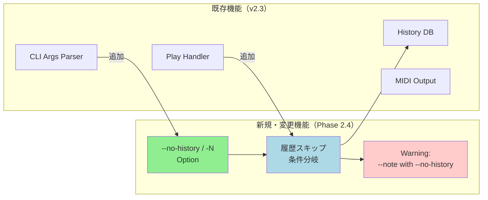
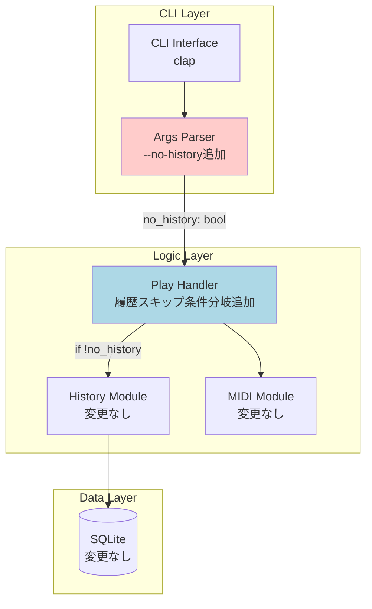
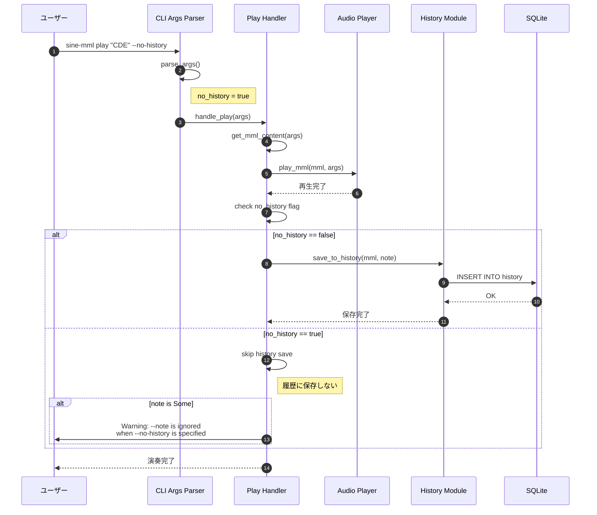
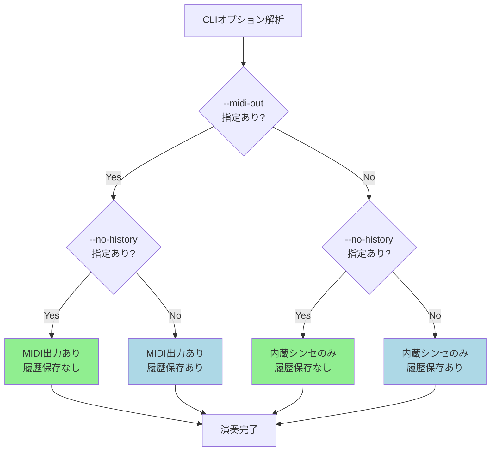
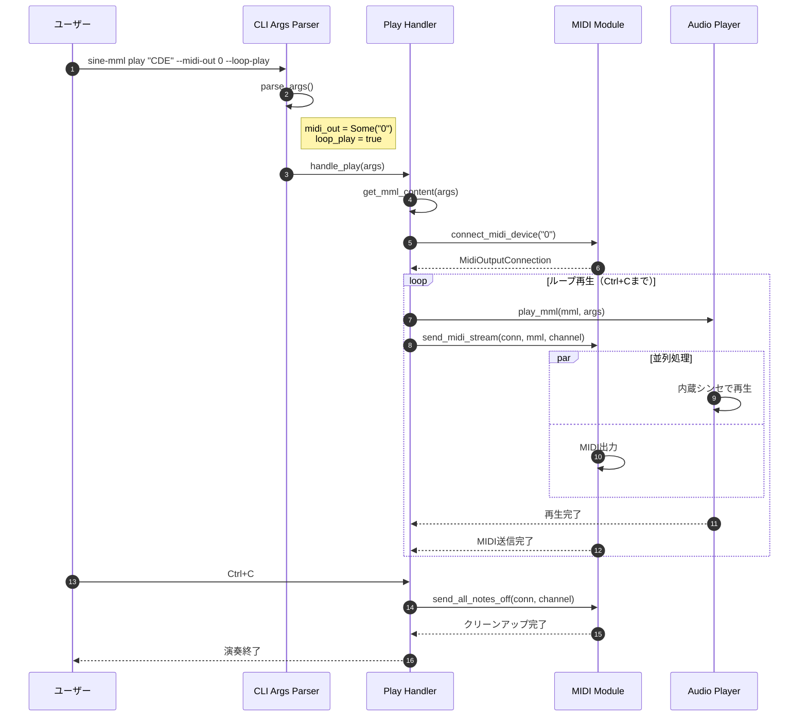
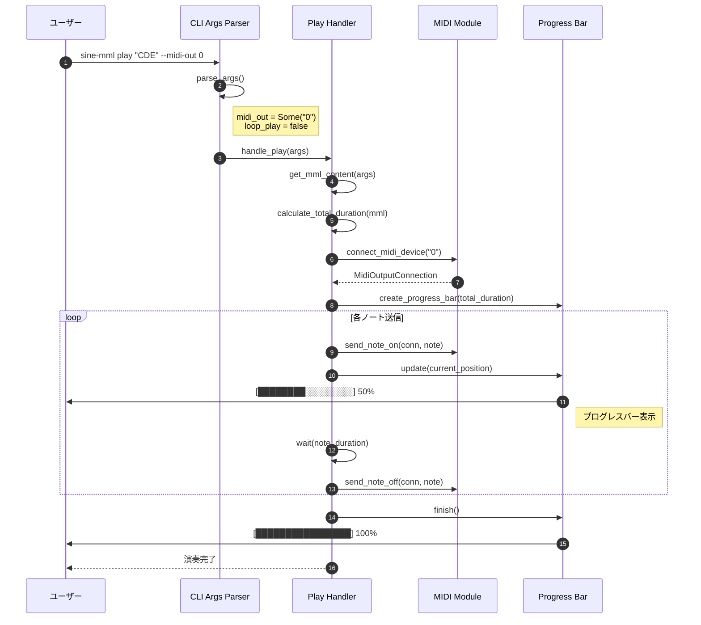
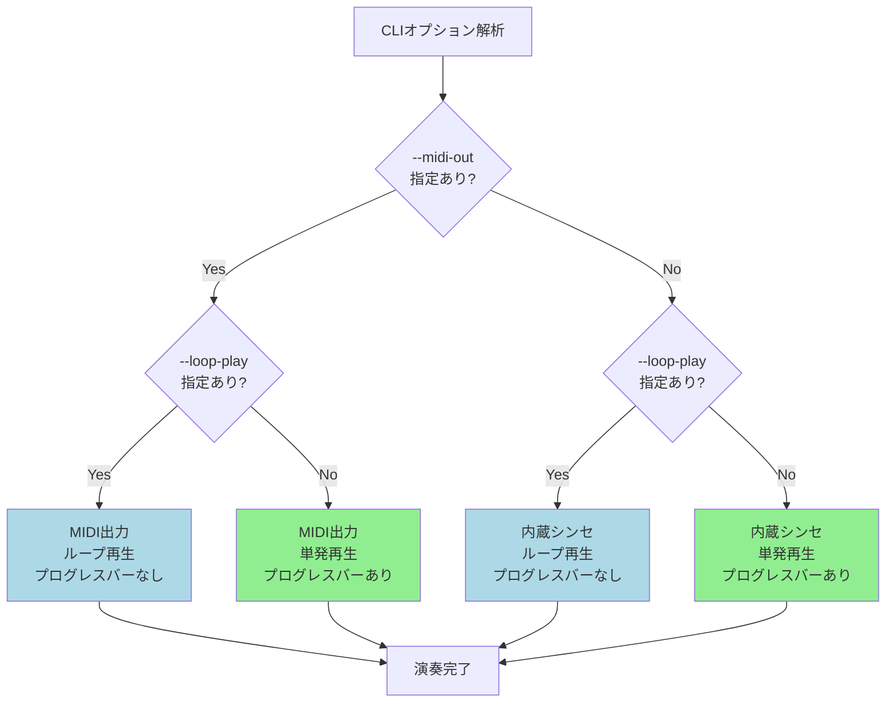

# BASIC-CLI-007 MML Synthesizer CLI オプションショートハンド拡充 基本設計書

## 0. ドキュメント情報

| 項目 | 内容 |
|------|------|
| ドキュメントID | BASIC-CLI-007 |
| バージョン | 1.2.0 |
| ステータス | ドラフト |
| 作成日 | 2026-01-15 |
| 最終更新日 | 2026-01-15 |
| 作成者 | basic-design-writer |
| 関連文書 | REQ-CLI-007_CLI-Option-Shorthand.md (v1.0.2)<br>BASIC-CLI-006_MIDI-Streaming-Tuplet.md (v1.1.0)<br>BASIC-CLI-001_MML-Synthesizer.md (v1.1.0) |

---

## 1. システム概要

### 1.1 目的

sine-mml v2.3のMIDIストリーミング・連符機能実装完了後、開発者体験（DX）向上のため、以下の機能を追加する：

1. **履歴スキップオプション**: テスト演奏時に履歴を保存しないオプション（`--no-history` / `-N`）を追加し、有用な履歴が埋もれることを防ぐ
2. **MIDI出力と履歴スキップの併用保証**: `--midi-out` と `--no-history` の同時使用を保証
3. **MIDI出力とループ再生の併用保証**: `--midi-out` と `--loop-play` の同時使用を保証
4. **MIDI出力時のプログレスバー表示**: `--midi-out` 単独使用時（`--loop-play` なし）に通常再生と同様のプログレスバーアニメーションを表示

これらの機能により、開発者の作業効率を向上させ、より快適なMML作成・テストワークフローを実現する。

### 1.2 背景

REQ-CLI-007に記載された以下のユーザー要望に対応：

- **履歴の蓄積問題**: 開発中やテスト演奏時に履歴が蓄積し、有用な履歴が埋もれてしまう
- **コマンド入力の煩雑さ**: 頻繁に使用するオプションの入力が長く、開発効率が低下
- **オプション併用の明確化**: `--midi-out` と他のオプションの併用動作を明確にする必要がある
- **MIDI出力時の視覚フィードバック不足**: `--midi-out` 単独使用時にプログレスバーが表示されず、再生進行状況が分からない

### 1.3 スコープ

#### 対象範囲
- `--no-history` オプションの追加
- `-N` ショートハンドの追加
- `--midi-out` と `--no-history` の併用対応
- `--midi-out` と `--loop-play` の併用対応
- `--midi-out` 単独使用時（`--loop-play` なし）のプログレスバー表示対応
- 既存ショートハンドとの整合性確認

#### 対象外
- 他のオプションへのショートハンド追加（将来検討）
- 履歴の選択的削除機能
- 履歴の自動クリーンアップ機能

### 1.4 Phase 2.4との関係

本機能拡張はsine-mml v2.4の**新規開発**として位置づけられる：

- **Phase 1.0**: 基本機能実装（BASIC-CLI-001）
- **Phase 2.0**: 機能改善（BASIC-CLI-002, BASIC-CLI-003）
- **Phase 2.1**: MML高度な機能拡張（BASIC-CLI-004）
- **Phase 2.2**: タイ記号機能（BASIC-CLI-005）
- **Phase 2.3**: MIDIストリーミング・連符機能（BASIC-CLI-006）
- **Phase 2.4**: CLIオプションショートハンド拡充（本設計書）

---

## 2. 既存システムとの関係

### 2.1 影響を受けるコンポーネント

| コンポーネント | 影響内容 | 変更レベル |
|---------------|----------|-----------|
| `src/cli/args.rs` | `--no-history` / `-N` オプション追加 | 低 |
| `src/cli/handlers.rs` | 履歴保存の条件分岐追加、プログレスバー表示ロジック追加 | 中 |
| `src/midi/mod.rs` | MIDI送信処理にプログレス通知コールバック追加 | 中 |
| `src/player.rs` | プログレスバー表示の共通化（MIDI出力対応） | 低 |
| `tests/cli_integration.rs` | テストケース追加 | 低 |

### 2.2 変更概要図



---

## 3. システムアーキテクチャ

### 3.1 全体構成図（変更箇所のみ）



**設計方針**: 既存のアーキテクチャに最小限の変更のみを加える。履歴保存処理の条件分岐のみを追加し、他のコンポーネントへの影響を最小化する。

---

## 4. 技術スタック

### 4.1 既存技術（維持）

| レイヤー | 技術 | バージョン | 役割 |
|----------|------|------------|------|
| 言語 | Rust | 1.70+ | アプリケーション全体 |
| CLI Framework | clap | 4.5 | コマンドライン引数解析 |
| Database | rusqlite | 0.38 | SQLite操作 |

### 4.2 新規追加

なし（既存のクレートで対応可能）

---

## 5. 機能一覧

### 5.1 新規機能

| ID | 機能名 | 概要 | 優先度 | フェーズ |
|----|--------|------|--------|---------|
| F-033 | 履歴スキップオプション | `--no-history` / `-N` で再生時に履歴をスキップ | 必須 | Phase 2.4 |
| F-034 | MIDI出力と履歴スキップの併用 | `--midi-out` と `--no-history` の同時使用を保証 | 必須 | Phase 2.4 |
| F-035 | MIDI出力とループ再生の併用 | `--midi-out` と `--loop-play` の同時使用を保証 | 必須 | Phase 2.4 |
| F-036 | MIDI出力時のプログレスバー表示 | `--midi-out` 指定時（`--loop-play`なし）で通常再生と同様のプログレスバーを表示 | 必須 | Phase 2.4 |

### 5.2 機能詳細

#### F-033: 履歴スキップオプション

**概要**: `--no-history` または `-N` オプションで再生時に履歴をスキップ

**入力**:
- MML文字列またはファイル
- `--no-history` または `-N` オプション

**出力**:
- 再生は行われるが、履歴には保存されない

**処理概要**:
1. CLIオプションを解析
2. `--no-history` フラグを確認
3. MMLを解析・再生
4. フラグが立っている場合、履歴保存処理をスキップ
5. 再生完了

**ビジネスルール**:
- BR-105: `--no-history` を指定した場合、履歴に保存しない
- BR-106: `-N` は `--no-history` と同等に動作する
- BR-107: `--no-history` を指定しない場合は従来通り履歴を保存する
- BR-108: 再生中のエラーが発生した場合、`--no-history` の指定有無に関わらず履歴には保存しない
- BR-109: `--note` オプションと `--no-history` が同時に指定された場合、`--note` の値は処理されないため、警告を表示して無視する

**制約事項**:
- 履歴IDでの再生（`--history-id`）と `--no-history` の組み合わせは許可する（単に再実行するが履歴には追加しない）

#### F-034: MIDI出力と履歴スキップの併用

**概要**: `--midi-out` と `--no-history` の同時使用を保証

**処理概要**:
- 両オプションは独立して動作
- `--midi-out` が指定された場合、MIDI出力が行われる
- `--no-history` が指定された場合、履歴保存がスキップされる
- 両方指定した場合、MIDI出力は行われるが履歴には保存されない

**ビジネスルール**:
- BR-110: `--midi-out` と `--no-history` は独立して動作する
- BR-111: 両方指定した場合、MIDI出力は行われるが履歴には保存されない
- BR-112: `--waveform` と `--midi-out` と `--no-history` の3つを同時に指定可能

#### F-035: MIDI出力とループ再生の併用

**概要**: `--midi-out` と `--loop-play` の同時使用を保証

**処理概要**:
- 両オプションは独立して動作
- `--midi-out` が指定された場合、MIDI出力が行われる
- `--loop-play` が指定された場合、ループ再生が行われる
- 両方指定した場合、MIDI出力がループ再生される

**ビジネスルール**:
- BR-113: `--midi-out` と `--loop-play` は独立して動作する
- BR-114: 両方指定した場合、MIDI出力がループ再生される
- BR-115: ループ終了時（Ctrl+C）は全MIDIノートオフメッセージを送信してクリーンアップ
- BR-116: `--waveform` と `--midi-out` と `--loop-play` の3つを同時に指定した場合、両方がループ再生される

#### F-036: MIDI出力時のプログレスバー表示

**概要**: `--midi-out` 指定時（`--loop-play` なし）で通常再生と同様のプログレスバーアニメーションを表示

**入力**:
- MML文字列またはファイル
- `--midi-out` オプション（`--loop-play` なし）

**出力**:
- MIDI出力が行われる
- 通常の内蔵シンセ再生時と同様のプログレスバーアニメーションが表示される

**処理概要**:
1. CLIオプションを解析
2. `--midi-out` が指定され、`--loop-play` が指定されていないことを確認
3. MMLを解析
4. MIDI出力を開始
5. 再生位置に合わせてプログレスバーをアニメーション表示
6. 再生完了時にプログレスバーを100%表示して終了

**ビジネスルール**:
- BR-117: `--midi-out` 指定時（`--loop-play` なし）は通常再生と同様のプログレスバーを表示する
- BR-118: プログレスバーは再生位置（経過時間/全体時間）を反映する
- BR-119: `--loop-play` が指定されている場合はプログレスバーを表示しない（ループのため終了位置がない）
- BR-120: 内蔵シンセ + MIDI出力の同時使用時も、同一のプログレスバーを共有する

**制約事項**:
- プログレスバーはターミナル出力に依存するため、リダイレクト時は表示されない可能性がある

**実装詳細**:

1. **プログレスバー更新方式**: タイマーベース（100ms間隔で更新）
   - MMLの全体再生時間を事前に計算
   - 再生開始時刻を記録し、経過時間 / 全体時間 でプログレスを計算
   - indicatif クレートを使用（既存の内蔵シンセ再生で使用中）

2. **MIDI送信との同期方法**:
   - MIDI送信はスケジューリングベースで動作
   - プログレスバーは経過時間ベースで更新（MIDI送信の完了を待たない）
   - 内蔵シンセとの同時再生時は、同一のプログレスバーインスタンスを共有

3. **実装イメージ**:
   ```rust
   // src/cli/handlers.rs
   fn show_progress_bar_for_midi(total_duration_ms: u64, loop_play: bool) {
       if loop_play {
           return; // ループ再生時はプログレスバーなし
       }

       let pb = ProgressBar::new(100);
       pb.set_style(ProgressStyle::default_bar()
           .template("{spinner:.green} [{bar:40.cyan/blue}] {percent}%")
           .progress_chars("#>-"));

       let start = Instant::now();
       while start.elapsed().as_millis() < total_duration_ms as u128 {
           let progress = (start.elapsed().as_millis() * 100 / total_duration_ms as u128) as u64;
           pb.set_position(progress.min(100));
           std::thread::sleep(Duration::from_millis(100));
       }
       pb.finish_with_message("完了");
   }
   ```

4. **パフォーマンス考慮**:
   - プログレスバー更新は専用スレッドで実行
   - CPU使用率: 5%以下を目標
   - 更新頻度: 10Hz（100ms間隔）

---

## 6. 処理フロー

### 6.1 履歴スキップ処理フロー



### 6.2 MIDI出力と履歴スキップの併用フロー



### 6.3 MIDI出力とループ再生の併用フロー



### 6.4 MIDI出力時のプログレスバー表示フロー



### 6.5 プログレスバー表示の条件分岐



---

## 7. データモデル

### 7.1 データベーススキーマ（変更なし）

既存の `history` テーブルをそのまま使用。スキーマ変更なし。

| カラム名 | 型 | 制約 | 説明 |
|----------|-----|------|------|
| id | INTEGER | PRIMARY KEY, AUTOINCREMENT | 履歴ID |
| mml | TEXT | NOT NULL | MML文字列 |
| waveform | TEXT | NOT NULL | 波形タイプ |
| volume | REAL | NOT NULL | 音量 |
| bpm | INTEGER | NOT NULL | テンポ |
| note | TEXT | NULL | メモ |
| created_at | TEXT | NOT NULL | 作成日時（ISO 8601） |

---

## 8. CLIインターフェース

### 8.1 オプション定義

#### 既存オプション（変更なし）

| オプション | ショートハンド | 型 | デフォルト | 説明 |
|-----------|--------------|------|-----------|------|
| `--file` | `-f` | String | - | ファイルからMMLを読み込む |
| `--waveform` | `-w` | String | sine | 波形選択 |
| `--volume` | `-v` | u8 | 10 | 音量設定 |
| `--output` | `-o` | String | - | WAVファイル出力先 |
| `--loop-play` | - | bool | false | ループ再生 |
| `--midi-out` | - | String | - | MIDI出力デバイス |
| `--midi-channel` | - | u8 | 1 | MIDIチャンネル |
| `--note` | - | String | - | 履歴メモ |

#### 新規オプション

| オプション | ショートハンド | 型 | デフォルト | 説明 |
|-----------|--------------|------|-----------|------|
| `--no-history` | `-N` | bool | false | 履歴に保存しない |

### 8.2 使用例

```bash
# 基本的な履歴スキップ
sine-mml play "T120 L4 O4 CDEFGAB" --no-history
sine-mml play "T120 L4 O4 CDEFGAB" -N

# ファイル読み込み + 履歴スキップ
sine-mml play -f test.mml --no-history
sine-mml play -f test.mml -N

# MIDI出力 + 履歴スキップ
sine-mml play "CDEFGAB" --midi-out 0 --no-history
sine-mml play "CDEFGAB" --midi-out 0 -N

# MIDI出力 + ループ再生
sine-mml play "CDEFGAB" --midi-out 0 --loop-play

# 全オプション併用
sine-mml play "CDEFGAB" --midi-out 0 --loop-play --no-history
sine-mml play "CDEFGAB" --midi-out 0 --loop-play -N

# 履歴IDから再生（履歴には追加しない）
sine-mml play --history-id 1 --no-history

# --note と --no-history の併用（警告が表示される）
sine-mml play "CDEFGAB" --no-history --note "Test"
# Warning: --note is ignored when --no-history is specified
```

### 8.3 既存ショートハンドとの整合性

| オプション | ショートハンド | 用途 |
|-----------|--------------|------|
| `--file` | `-f` | ファイル読み込み |
| `--waveform` | `-w` | 波形選択 |
| `--volume` | `-v` | 音量設定 |
| `--output` | `-o` | エクスポート出力先 |
| `--no-history` | `-N` | 履歴スキップ **新規** |

**注**: clap の制約により、ショートハンドは単一文字（小文字または大文字）のみ使用可能。`-N` は "No-history" を連想させる大文字を採用。

---

## 9. エラーハンドリング

### 9.1 エラーコード一覧

本機能では新規エラーコードは追加されない。既存のエラーハンドリングをそのまま使用。

### 9.2 警告メッセージ

| 警告コード | 状況 | メッセージ | 対応 |
|-----------|------|-----------|------|
| WARN-001 | `--note` と `--no-history` の併用 | "Warning: --note is ignored when --no-history is specified" | `--note` の値は無視される |

---

## 10. 非機能要件対応

### 10.1 性能要件

| ID | 要件 | 目標値 | 測定方法 |
|----|------|--------|----------|
| NFR-P-019 | オプション解析のオーバーヘッド | 1ms以内 | ベンチマーク |
| NFR-P-020 | 履歴スキップによるパフォーマンス向上 | 履歴保存時間分（約5ms）の短縮 | ベンチマーク |
| NFR-P-021 | プログレスバー表示のCPU使用率 | 5%以下 | プロファイリング |
| NFR-P-022 | プログレスバーの更新頻度 | 10Hz以上（100ms以下の間隔） | 目視確認 |

### 10.2 可用性要件

| ID | 要件 | 目標値 |
|----|------|--------|
| NFR-A-012 | オプション競合時のエラーハンドリング | 明確なエラーメッセージを表示 |
| NFR-A-013 | 警告メッセージの表示 | `--note` と `--no-history` 併用時に警告を表示 |

### 10.3 セキュリティ要件

| ID | 要件 | 詳細 |
|----|------|------|
| NFR-S-015 | 履歴スキップの信頼性 | `--no-history` 指定時は確実に履歴に保存しない |

### 10.4 ユーザビリティ要件

| ID | 要件 | 詳細 |
|----|------|------|
| NFR-U-019 | ショートハンドの直感性 | `-N` は "No-history" を連想させる |
| NFR-U-020 | ヘルプメッセージの明確性 | `--help` で `--no-history` / `-N` の説明を表示 |
| NFR-U-021 | オプション組み合わせの自由度 | 任意のオプションを自由に組み合わせ可能 |
| NFR-U-022 | MIDI出力時の視覚フィードバック | `--midi-out` 指定時（`--loop-play` なし）でプログレスバーを表示 |

### 10.5 保守性要件

| ID | 要件 | 詳細 |
|----|------|------|
| NFR-M-019 | 履歴スキップのテスト | 正常系、異常系を網羅 |
| NFR-M-020 | オプション併用のテスト | 全ての組み合わせパターンをテスト |
| NFR-M-021 | 後方互換性 | 既存のコマンドが正常に動作 |

---

## 11. テスト戦略

### 11.1 テストファイル構成

```
tests/
├── cli_integration.rs              # E2E統合テスト（既存）
│   ├── test_no_history_flag
│   ├── test_no_history_short_flag
│   ├── test_no_history_with_midi_out
│   ├── test_midi_out_with_loop_play
│   ├── test_all_options_combined
│   └── test_no_history_with_note_warning
└── unit/
    └── cli_args_test.rs            # CLIオプション解析のユニットテスト
```

### 11.2 テストケース一覧

#### 履歴スキップのテストケース

| テストID | テストケース | 期待結果 |
|---------|-------------|---------|
| TC-033-001 | `play "CDE" --no-history` | 再生され、履歴に保存されない |
| TC-033-002 | `play "CDE" -N` | 再生され、履歴に保存されない |
| TC-033-003 | `play "CDE"` | 再生され、履歴に保存される（従来通り） |
| TC-033-004 | `play -f test.mml --no-history` | ファイル読み込み、履歴に保存されない |
| TC-033-005 | `play --history-id 1 --no-history` | 履歴から再生され、新たな履歴は追加されない |
| TC-033-006 | `play "CDE" --no-history --note "Test"` | 再生され、警告が表示され、履歴に保存されない |

#### MIDI出力との併用テストケース

| テストID | テストケース | 期待結果 |
|---------|-------------|---------|
| TC-034-001 | `play "CDE" --midi-out 0 --no-history` | MIDI出力され、履歴に保存されない |
| TC-034-002 | `play "CDE" --midi-out 0 -N` | MIDI出力され、履歴に保存されない |
| TC-034-003 | `play "CDE" --midi-out 0` | MIDI出力され、履歴に保存される（従来通り） |
| TC-034-004 | `play "CDE" -w sine --midi-out 0 --no-history` | 両方で再生され、履歴に保存されない |

#### ループ再生との併用テストケース

| テストID | テストケース | 期待結果 |
|---------|-------------|---------|
| TC-035-001 | `play "CDE" --midi-out 0 --loop-play` | MIDI出力がループ再生される |
| TC-035-002 | `play "CDE" --midi-out 0 --loop-play --no-history` | MIDI出力がループ再生され、履歴に保存されない |
| TC-035-003 | `play "CDE" -w sine --midi-out 0 --loop-play` | 両方がループ再生される |

#### MIDI出力時のプログレスバー表示テストケース

| テストID | テストケース | 期待結果 |
|---------|-------------|---------|
| TC-036-001 | `play "CDE" --midi-out 0` | MIDI出力され、プログレスバーが表示される |
| TC-036-002 | `play "CDE" --midi-out 0 --loop-play` | MIDI出力がループ再生され、プログレスバーは表示されない |
| TC-036-003 | `play "CDE" -w sine --midi-out 0` | 内蔵シンセ + MIDI出力され、プログレスバーが表示される |
| TC-036-004 | `play "CDE" --midi-out 0 --no-history` | MIDI出力され、プログレスバー表示、履歴保存なし |
| TC-036-005 | プログレスバーが0%→100%に更新される | 再生進行に応じてプログレスバーが更新される |

#### CLIオプション解析のテストケース

| テストID | テストケース | 期待結果 |
|---------|-------------|---------|
| TC-033-007 | `--no-history` フラグのパース | `no_history` が `true` |
| TC-033-008 | `-N` フラグのパース | `no_history` が `true` |
| TC-033-009 | デフォルト値 | `no_history` が `false` |
| TC-033-010 | `--help` | `--no-history` / `-N` の説明が表示される |

### 11.3 テストカバレッジ

| テストレベル | 対象 | カバレッジ目標 |
|-------------|------|---------------|
| ユニットテスト | CLIオプション解析、履歴保存の条件分岐 | 100% |
| 統合テスト | 履歴スキップ、MIDI併用、ループ併用 | 100% |
| E2Eテスト | 主要シナリオ（play with --no-history） | 100% |

---

## 12. 実装優先順位

### Phase 2.4.1（Day 1-2: 2026-01-15〜01-16）
1. **CLIオプション追加** - `--no-history` / `-N` の実装
   - `PlayArgs` 構造体に `no_history` フィールド追加
   - clap のオプション定義
   - ヘルプメッセージの追加

### Phase 2.4.2（Day 3-4: 2026-01-17〜01-18）
2. **履歴スキップロジック** - ハンドラーの修正
   - `handle_play` での条件分岐追加
   - 警告メッセージの実装（`--note` との併用時）

### Phase 2.4.3（Day 5: 2026-01-19）
3. **テストケース作成** - 豊富なテストケース
   - 正常系テスト
   - 異常系テスト
   - オプション併用テスト
   - 後方互換性テスト

---

## 13. 詳細設計書一覧

本基本設計書に基づき、以下の詳細設計書を作成予定：

### 13.1 CLIオプション関連

| # | ドキュメントID | 名称 | パス | ステータス |
|---|----------------|------|------|-----------|
| 1 | DET-CLI-007-001 | CLIオプション追加詳細設計 | [cli-option-shorthand/](../detailed/cli-option-shorthand/) | 未着手 |
| 2 | DET-CLI-007-002 | 履歴スキップロジック詳細設計 | [cli-option-shorthand/](../detailed/cli-option-shorthand/) | 未着手 |
| 3 | DET-CLI-007-003 | オプション併用テスト詳細設計 | [cli-option-shorthand/](../detailed/cli-option-shorthand/) | 未着手 |

---

## 14. 未解決課題・仮定事項

### 14.1 未解決課題

| ID | 課題 | 担当 | 期限 | 優先度 |
|----|------|------|------|--------|
| I-021 | 他のオプションへのショートハンド追加の検討 | 開発チーム | Phase 3.0で検討 | 低 |
| I-022 | 履歴の自動クリーンアップ機能の検討 | 開発チーム | 将来バージョンで検討 | 低 |

### 14.2 仮定事項

- 【仮定】`--no-history` は再生時のみ有効（export時は影響しない）
- 【仮定】`--history-id` と `--no-history` の併用は許可（履歴から再生するが、新たな履歴は追加しない）
- 【仮定】`--note` と `--no-history` の併用は警告を表示するが、エラーではない

### 14.3 制約事項

| 制約 | 詳細 | 理由 |
|------|------|------|
| ショートハンドは単一文字 | clap の制約により、ショートハンドは1文字のみ | clap ライブラリの仕様 |
| `-h` は使用不可 | ヘルプ用に予約済み | clap のデフォルト動作 |
| `-N` を使用 | "No-history" の頭文字で直感的、かつ未使用 | 可読性と一貫性 |

---

## 15. リスクと対策

### 15.1 リスク一覧

| ID | リスク | 影響度 | 発生確率 | 対策 |
|----|--------|--------|---------|------|
| R-024 | ショートハンドの衝突 | 低 | 低 | 既存ショートハンドの一覧を確認済み |
| R-025 | オプション併用時の予期しない動作 | 中 | 低 | 全組み合わせパターンのテストを実施 |
| R-026 | ユーザーの混乱（`-N` の意味） | 低 | 低 | ヘルプメッセージで明確に説明 |
| R-027 | MIDI出力遅延によるプログレスバーのズレ | 低 | 中 | プログレスバーは経過時間ベースで更新し、MIDI送信完了を待たない |

### 15.2 対策詳細

#### R-024: ショートハンドの衝突
- **対策1**: 既存ショートハンド（`-f`, `-w`, `-v`, `-o`）との衝突を確認済み
- **対策2**: `-N` は未使用であることを確認済み
- **対策3**: 将来のショートハンド追加時の衝突を防ぐため、ドキュメント化

#### R-025: オプション併用時の予期しない動作
- **対策1**: 全組み合わせパターンのテストケース作成
- **対策2**: オプションの独立性を保証（相互に影響しない設計）
- **対策3**: E2Eテストで実際の動作を検証

#### R-026: ユーザーの混乱（`-N` の意味）
- **対策1**: ヘルプメッセージで明確に説明
- **対策2**: ドキュメントに使用例を豊富に記載
- **対策3**: `-N` は "No-history" を連想させる直感的な名称

#### R-027: MIDI出力遅延によるプログレスバーのズレ
- **対策1**: プログレスバーは経過時間ベースで更新し、MIDI送信完了を待たない設計
- **対策2**: MIDI出力の遅延が発生しても、プログレスバーは実時間に基づいて正確に更新される
- **対策3**: 大きな遅延が発生した場合の警告表示は将来検討（現時点ではスコープ外）

---

## 16. 変更履歴

| バージョン | 日付 | 変更内容 | 担当者 |
|-----------|------|----------|--------|
| 1.0.0 | 2026-01-15 | 初版作成 | basic-design-writer |
| 1.1.0 | 2026-01-15 | F-036（MIDI出力時のプログレスバー表示）追加、BR-117〜BR-120追加、TC-036-001〜005追加 | basic-design-writer |
| 1.2.0 | 2026-01-15 | レビュー指摘対応: 要件定義書との整合性確保（REQ v1.0.2参照）、F-036実装詳細追加、影響コンポーネント追加、非機能要件追加（NFR-P-021/022、NFR-U-022）、リスクR-027追加 | basic-design-writer |
