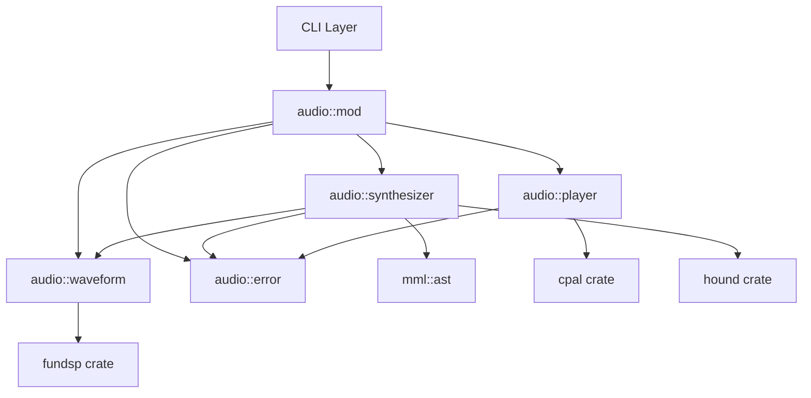
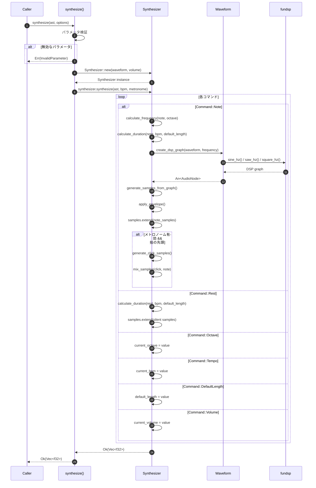
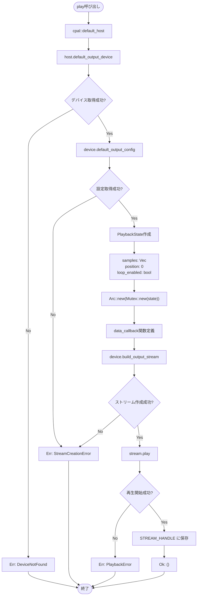
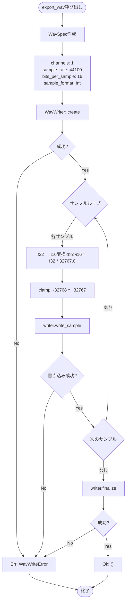
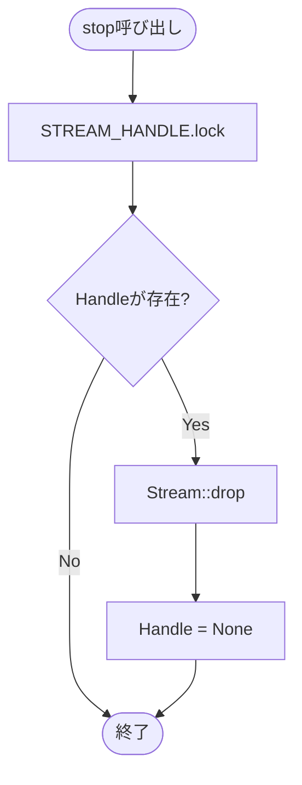

# オーディオエンジン バックエンド設計書

## ドキュメント情報

| 項目 | 内容 |
|------|------|
| ドキュメントID | DET-AUD-001-BE |
| バージョン | 1.0.0 |
| ステータス | レビュー待ち |
| 作成日 | 2026-01-10 |
| 最終更新日 | 2026-01-10 |
| 関連詳細設計書 | DET-AUD-001 |

## 1. モジュール構成

### 1.1 ファイル構成

- `src/audio/`
  - `mod.rs` - モジュール公開API定義
  - `synthesizer.rs` - 音声合成ロジック
  - `player.rs` - リアルタイム再生（cpal）
  - `waveform.rs` - 波形タイプとDSPグラフ生成
  - `error.rs` - エラー型定義

### 1.2 モジュール依存関係



## 2. 公開API仕様

### 2.1 synthesize関数

音声合成のメインエントリポイント。

```rust
/// MMLのASTからPCMサンプルを生成する
///
/// # Arguments
/// * `ast` - MMLパーサーから得られた抽象構文木
/// * `waveform` - 波形タイプ (Sine, Sawtooth, Square)
/// * `volume` - 音量 (0.0〜1.0)
/// * `bpm` - テンポ (30〜300)
/// * `metronome_enabled` - メトロノームクリックの有効化
///
/// # Returns
/// * `Ok(Vec<f32>)` - 生成されたPCMサンプル（44100Hz、モノラル）
/// * `Err(AudioError)` - 合成失敗時のエラー
///
/// # Examples
/// ```
/// use sine_mml::audio::synthesize;
/// use sine_mml::audio::WaveformType;
/// use sine_mml::mml::parse;
///
/// let ast = parse("O4 C D E F G").unwrap();
/// let samples = synthesize(&ast, WaveformType::Sine, 0.5, 120, false).unwrap();
/// println!("生成されたサンプル数: {}", samples.len());
/// ```
pub fn synthesize(
    ast: &Mml,
    waveform: WaveformType,
    volume: f32,
    bpm: u16,
    metronome_enabled: bool,
) -> Result<Vec<f32>, AudioError>
```

**処理フロー**



**パラメータ検証**

| パラメータ | 検証ルール | エラー |
|-----------|----------|--------|
| `volume` | 0.0 ≤ volume ≤ 1.0 | InvalidParameter |
| `bpm` | 30 ≤ bpm ≤ 300 | InvalidParameter |
| `ast` | commands が空でない | InvalidParameter |

### 2.2 play関数

リアルタイム音声再生のエントリポイント。

```rust
/// PCMサンプルをリアルタイムで再生する
///
/// # Arguments
/// * `samples` - 再生するPCMサンプル
/// * `loop_enabled` - ループ再生の有効化
///
/// # Returns
/// * `Ok(())` - 再生開始成功
/// * `Err(AudioError)` - 再生失敗時のエラー
///
/// # Examples
/// ```
/// use sine_mml::audio::{play, synthesize};
/// use sine_mml::audio::WaveformType;
/// use sine_mml::mml::parse;
///
/// let ast = parse("O4 C D E F G").unwrap();
/// let samples = synthesize(&ast, WaveformType::Sine, 0.5, 120, false).unwrap();
/// play(&samples, false).unwrap();
/// ```
///
/// # Notes
/// この関数は非ブロッキングです。再生が完了するまで待機する場合は、
/// 別途 `wait_for_completion()` を呼び出してください。
pub fn play(samples: &[f32], loop_enabled: bool) -> Result<(), AudioError>
```

**処理フロー**



**cpal コールバック処理**

```rust
// ストリームのdata_callback内部実装
let data_callback = move |data: &mut [f32], _: &cpal::OutputCallbackInfo| {
    let mut state = state_clone.lock().unwrap();
    
    for sample_out in data.iter_mut() {
        // バッファ終端チェック
        if state.position >= state.samples.len() {
            if state.loop_enabled {
                // ループ有効: 先頭に戻る
                state.position = 0;
            } else {
                // ループ無効: 無音を出力
                *sample_out = 0.0;
                continue;
            }
        }
        
        // サンプルをバッファにコピー
        *sample_out = state.samples[state.position];
        state.position += 1;
    }
};
```

### 2.3 export_wav関数

WAVファイルエクスポートのエントリポイント。

```rust
/// PCMサンプルをWAVファイルとして保存する
///
/// # Arguments
/// * `samples` - 保存するPCMサンプル
/// * `path` - 保存先ファイルパス
///
/// # Returns
/// * `Ok(())` - 保存成功
/// * `Err(AudioError)` - 保存失敗時のエラー
///
/// # Examples
/// ```
/// use sine_mml::audio::{synthesize, export_wav};
/// use sine_mml::audio::WaveformType;
/// use sine_mml::mml::parse;
///
/// let ast = parse("O4 C D E F G").unwrap();
/// let samples = synthesize(&ast, WaveformType::Sine, 0.5, 120, false).unwrap();
/// export_wav(&samples, "output.wav").unwrap();
/// ```
pub fn export_wav<P: AsRef<Path>>(samples: &[f32], path: P) -> Result<(), AudioError>
```

**処理フロー**



**WAV仕様詳細**

| パラメータ | 値 | 説明 |
|-----------|-----|------|
| `channels` | 1 | モノラル |
| `sample_rate` | 44100 | 44.1kHz (CD品質) |
| `bits_per_sample` | 16 | 16-bit |
| `sample_format` | Int | 整数フォーマット |

**f32からi16への変換式**

```
i16_value = clamp((f32_value * 32767.0), -32768.0, 32767.0) as i16

f32_value 範囲: -1.0 〜 1.0
i16_value 範囲: -32768 〜 32767
```

### 2.4 stop関数

再生停止のエントリポイント。

```rust
/// 現在の再生を停止する
///
/// # Examples
/// ```
/// use sine_mml::audio::{play, stop};
///
/// // 再生を開始
/// play(&samples, true).unwrap();
///
/// // 数秒後に停止
/// std::thread::sleep(std::time::Duration::from_secs(3));
/// stop();
/// ```
pub fn stop()
```

**処理フロー**



## 3. データ型定義

### 3.1 Synthesizer構造体 (synthesizer.rs)

```rust
use crate::mml::Mml;

/// オーディオ合成器
pub struct Synthesizer {
    /// サンプルレート
    sample_rate: u32,
    /// 波形タイプ
    waveform: WaveformType,
    /// 音量（0.0〜1.0）
    volume: f32,
}

impl Synthesizer {
    /// 新しいSynthesizerを作成
    ///
    /// # Arguments
    /// * `waveform` - 波形タイプ
    /// * `volume` - 音量（0.0〜1.0の範囲外は自動的にクランプ）
    pub fn new(waveform: WaveformType, volume: f32) -> Self {
        Self {
            sample_rate: 44100,
            waveform,
            volume: volume.clamp(0.0, 1.0),
        }
    }
    
    /// ASTから音声サンプルを生成
    pub fn synthesize(
        &self,
        ast: &Mml,
        bpm: u16,
        metronome_enabled: bool,
    ) -> Result<Vec<f32>, AudioError> {
        let mut samples = Vec::new();
        let mut current_octave = 4u8;
        let mut current_bpm = bpm;
        let mut default_length = 4u8;
        let mut current_volume = 8u8; // MML volume (0-15)
        let mut beat_elapsed = 0.0f32; // メトロノーム用の拍カウント
        
        for command in &ast.commands {
            match command {
                Command::Note(note) => {
                    // 周波数計算
                    let midi_note = note.to_midi_note(current_octave);
                    let frequency = Self::midi_to_frequency(midi_note);
                    
                    // 音長計算
                    let duration_sec = note.duration_in_seconds(current_bpm, default_length);
                    
                    // メトロノームチェック（サンプル数ベースで判定）
                    // 1拍のサンプル数を計算し、整数ベースで判定することで浮動小数点誤差を回避
                    let samples_per_beat = (self.sample_rate as f32 * 60.0 / current_bpm as f32) as usize;
                    let current_sample_in_beat = (beat_elapsed.fract() * samples_per_beat as f32) as usize;
                    if metronome_enabled && current_sample_in_beat < (samples_per_beat / 100).max(1) {
                        let click_samples = self.generate_click_samples();
                        samples.extend(click_samples);
                    }
                    
                    // 音符サンプル生成
                    let note_samples = self.generate_note_samples(frequency, duration_sec);
                    samples.extend(note_samples);
                    
                    // 拍カウント更新（4分音符 = 1拍）
                    let beats = duration_sec / (60.0 / current_bpm as f32);
                    beat_elapsed += beats;
                }
                Command::Rest(rest) => {
                    let duration_sec = rest.duration_in_seconds(current_bpm, default_length);
                    let num_samples = (self.sample_rate as f32 * duration_sec) as usize;
                    samples.extend(vec![0.0; num_samples]);
                    
                    let beats = duration_sec / (60.0 / current_bpm as f32);
                    beat_elapsed += beats;
                }
                Command::Octave(octave) => {
                    current_octave = octave.value;
                }
                Command::Tempo(tempo) => {
                    current_bpm = tempo.value;
                }
                Command::DefaultLength(length) => {
                    default_length = length.value;
                }
                Command::Volume(volume) => {
                    current_volume = volume.value;
                    // Note: MML音量は現在は無視（将来的に実装）
                }
            }
        }
        
        Ok(samples)
    }
    
    /// MIDIノート番号から周波数を計算
    ///
    /// # Formula
    /// f = 440 × 2^((n - 69) / 12)
    fn midi_to_frequency(midi_note: u8) -> f32 {
        440.0 * 2.0f32.powf((midi_note as f32 - 69.0) / 12.0)
    }
    
    /// 音符のサンプルを生成
    fn generate_note_samples(&self, frequency: f32, duration_sec: f32) -> Vec<f32> {
        use crate::audio::waveform::create_dsp_graph;
        use crate::audio::waveform::generate_samples_from_graph;
        
        let graph = create_dsp_graph(self.waveform, frequency);
        generate_samples_from_graph(graph, duration_sec, self.sample_rate, self.volume)
    }
    
    /// メトロノームクリックのサンプルを生成
    fn generate_click_samples(&self) -> Vec<f32> {
        use std::f32::consts::PI;
        
        const CLICK_FREQUENCY: f32 = 1000.0; // Hz
        const CLICK_DURATION: f32 = 0.05;    // 50ms
        const CLICK_VOLUME: f32 = 0.3;
        
        let num_samples = (self.sample_rate as f32 * CLICK_DURATION) as usize;
        let mut samples = Vec::with_capacity(num_samples);
        
        for i in 0..num_samples {
            let t = i as f32 / self.sample_rate as f32;
            
            // サイン波でクリック音を生成
            let mut sample = (2.0 * PI * CLICK_FREQUENCY * t).sin();
            
            // エクスポネンシャル減衰
            let decay = (-10.0 * t / CLICK_DURATION).exp();
            sample *= decay * CLICK_VOLUME;
            
            samples.push(sample);
        }
        
        samples
    }
}
```

### 3.2 WaveformType列挙型 (waveform.rs)

```rust
use fundsp::hacker::*;

/// 波形タイプ
#[derive(Debug, Clone, Copy, PartialEq, Eq)]
pub enum WaveformType {
    /// サイン波
    Sine,
    /// ノコギリ波
    Sawtooth,
    /// 矩形波
    Square,
}

impl WaveformType {
    /// 文字列から変換
    pub fn from_str(s: &str) -> Option<Self> {
        match s.to_lowercase().as_str() {
            "sine" => Some(WaveformType::Sine),
            "sawtooth" => Some(WaveformType::Sawtooth),
            "square" => Some(WaveformType::Square),
            _ => None,
        }
    }
    
    /// 文字列表現を取得
    pub fn as_str(&self) -> &'static str {
        match self {
            WaveformType::Sine => "sine",
            WaveformType::Sawtooth => "sawtooth",
            WaveformType::Square => "square",
        }
    }
}

/// 波形タイプに応じたfundsp DSPグラフを作成
///
/// # Arguments
/// * `waveform` - 波形タイプ
/// * `frequency` - 周波数 (Hz)
///
/// # Returns
/// fundsp AudioNode（入力なし、出力1チャンネル）
pub fn create_dsp_graph(
    waveform: WaveformType,
    frequency: f32,
) -> An<impl AudioNode<Inputs = U0, Outputs = U1>> {
    match waveform {
        WaveformType::Sine => {
            // サイン波オシレーター
            An(sine_hz(frequency))
        }
        WaveformType::Sawtooth => {
            // ノコギリ波オシレーター
            An(saw_hz(frequency))
        }
        WaveformType::Square => {
            // 矩形波オシレーター
            An(square_hz(frequency))
        }
    }
}

/// DSPグラフからサンプルを生成
///
/// # Arguments
/// * `graph` - fundsp AudioNode
/// * `duration_sec` - 生成する音の長さ（秒）
/// * `sample_rate` - サンプルレート (Hz)
/// * `volume` - 音量 (0.0〜1.0)
///
/// # Returns
/// 生成されたPCMサンプル
pub fn generate_samples_from_graph<N>(
    mut graph: An<N>,
    duration_sec: f32,
    sample_rate: u32,
    volume: f32,
) -> Vec<f32>
where
    N: AudioNode<Inputs = U0, Outputs = U1>,
{
    let num_samples = (sample_rate as f32 * duration_sec) as usize;
    let mut samples = Vec::with_capacity(num_samples);
    
    // グラフをリセット
    graph.reset(Some(sample_rate as f64));
    
    for i in 0..num_samples {
        // 次のサンプルを取得
        let sample = graph.get_mono();
        
        // エンベロープを適用（プチノイズ防止）
        let envelope = calculate_envelope(i, num_samples);
        
        // 音量とエンベロープを適用
        let final_sample = (sample as f32) * volume * envelope;
        
        samples.push(final_sample);
    }
    
    samples
}

/// エンベロープ計算（フェードイン/アウト）
///
/// # Arguments
/// * `sample_index` - 現在のサンプルインデックス
/// * `total_samples` - 総サンプル数
///
/// # Returns
/// エンベロープ係数 (0.0〜1.0)
fn calculate_envelope(sample_index: usize, total_samples: usize) -> f32 {
    // 極短音符対応: 最小2サンプル以上を保証
    if total_samples < 2 {
        return 1.0;
    }
    
    // フェード期間（総サンプル数の10%、最大100サンプル）
    let fade_samples = (total_samples / 10).min(100).max(1);
    
    // インデックス境界チェック
    if sample_index >= total_samples {
        return 0.0;
    }
    
    if sample_index < fade_samples {
        // フェードイン（線形）
        sample_index as f32 / fade_samples as f32
    } else if sample_index >= total_samples.saturating_sub(fade_samples) {
        // フェードアウト（線形）
        let remaining = total_samples.saturating_sub(sample_index);
        remaining as f32 / fade_samples as f32
    } else {
        // 通常再生
        1.0
    }
}
```

### 3.3 AudioPlayer (player.rs)

```rust
use cpal::traits::{DeviceTrait, HostTrait, StreamTrait};
use cpal::{Device, Stream, StreamConfig};
use std::sync::{Arc, Mutex};
use lazy_static::lazy_static;

/// 再生状態
struct PlaybackState {
    samples: Vec<f32>,
    position: usize,
    loop_enabled: bool,
}

lazy_static! {
    /// グローバルストリームハンドル
    static ref STREAM_HANDLE: Arc<Mutex<Option<Stream>>> = Arc::new(Mutex::new(None));
}

/// PCMサンプルをリアルタイムで再生
pub fn play(samples: &[f32], loop_enabled: bool) -> Result<(), AudioError> {
    // 既存のストリームを停止
    stop();
    
    // デフォルトホストとデバイスを取得
    let host = cpal::default_host();
    let device = host
        .default_output_device()
        .ok_or(AudioError::DeviceNotFound)?;
    
    // デバイス設定を取得
    let config = device
        .default_output_config()
        .map_err(|e| AudioError::StreamCreationError(e.to_string()))?;
    
    // StreamConfigに変換
    let stream_config: StreamConfig = config.into();
    
    // 再生状態を作成
    let state = Arc::new(Mutex::new(PlaybackState {
        samples: samples.to_vec(),
        position: 0,
        loop_enabled,
    }));
    
    let state_clone = state.clone();
    
    // データコールバック
    let data_callback = move |data: &mut [f32], _: &cpal::OutputCallbackInfo| {
        let mut state = state_clone.lock().unwrap();
        
        for sample_out in data.iter_mut() {
            if state.position >= state.samples.len() {
                if state.loop_enabled {
                    // ループ: 先頭に戻る
                    state.position = 0;
                } else {
                    // ループなし: 無音を出力
                    *sample_out = 0.0;
                    continue;
                }
            }
            
            *sample_out = state.samples[state.position];
            state.position += 1;
        }
    };
    
    // エラーコールバック
    let err_callback = |err| {
        eprintln!("オーディオストリームエラー: {}", err);
    };
    
    // ストリームを作成
    let stream = device
        .build_output_stream(&stream_config, data_callback, err_callback, None)
        .map_err(|e| AudioError::StreamCreationError(e.to_string()))?;
    
    // 再生開始
    stream
        .play()
        .map_err(|e| AudioError::PlaybackError(e.to_string()))?;
    
    // グローバルハンドルに保存
    *STREAM_HANDLE.lock().unwrap() = Some(stream);
    
    Ok(())
}

/// 現在の再生を停止
pub fn stop() {
    let mut handle = STREAM_HANDLE.lock().unwrap();
    *handle = None; // Streamのドロップで自動的に停止
}
```

### 3.4 WavExporter (synthesizer.rs内)

```rust
use hound::{WavSpec, WavWriter};
use std::path::Path;

/// PCMサンプルをWAVファイルとして保存
pub fn export_wav<P: AsRef<Path>>(samples: &[f32], path: P) -> Result<(), AudioError> {
    let spec = WavSpec {
        channels: 1,
        sample_rate: 44100,
        bits_per_sample: 16,
        sample_format: hound::SampleFormat::Int,
    };
    
    let mut writer = WavWriter::create(path, spec)
        .map_err(|e| AudioError::WavWriteError(e.to_string()))?;
    
    for &sample in samples {
        // f32 (-1.0〜1.0) を i16 (-32768〜32767) に変換
        let sample_i16 = (sample * 32767.0).clamp(-32768.0, 32767.0) as i16;
        writer
            .write_sample(sample_i16)
            .map_err(|e| AudioError::WavWriteError(e.to_string()))?;
    }
    
    writer
        .finalize()
        .map_err(|e| AudioError::WavWriteError(e.to_string()))?;
    
    Ok(())
}
```

### 3.5 AudioError (error.rs)

```rust
use std::fmt;

/// オーディオエラー
#[derive(Debug, Clone)]
pub enum AudioError {
    /// デバイスが見つからない
    DeviceNotFound,
    /// ストリーム作成エラー
    StreamCreationError(String),
    /// 再生エラー
    PlaybackError(String),
    /// WAV書き込みエラー
    WavWriteError(String),
    /// 無効なパラメータ
    InvalidParameter { parameter: String, reason: String },
}

impl fmt::Display for AudioError {
    fn fmt(&self, f: &mut fmt::Formatter<'_>) -> fmt::Result {
        match self {
            AudioError::DeviceNotFound => {
                write!(f, "[AUD-E001] オーディオデバイスが見つかりませんでした")
            }
            AudioError::StreamCreationError(msg) => {
                write!(
                    f,
                    "[AUD-E002] オーディオストリームの作成に失敗しました: {}",
                    msg
                )
            }
            AudioError::PlaybackError(msg) => {
                write!(f, "[AUD-E003] 再生中にエラーが発生しました: {}", msg)
            }
            AudioError::WavWriteError(msg) => {
                write!(
                    f,
                    "[AUD-E004] WAVファイルの書き込みに失敗しました: {}",
                    msg
                )
            }
            AudioError::InvalidParameter { parameter, reason } => {
                write!(
                    f,
                    "[AUD-E005] 無効なパラメータ '{}': {}",
                    parameter, reason
                )
            }
        }
    }
}

impl std::error::Error for AudioError {}
```

## 4. API使用例

### 4.1 基本的な音声合成と再生

```rust
use sine_mml::mml::parse;
use sine_mml::audio::{synthesize, play, WaveformType};

fn main() -> Result<(), Box<dyn std::error::Error>> {
    // MMLをパース
    let mml = "T120 O4 L4 C D E F G A B >C";
    let ast = parse(mml)?;
    
    // 音声合成
    let samples = synthesize(
        &ast,
        WaveformType::Sine,
        0.5,   // volume
        120,   // BPM
        false, // metronome
    )?;
    
    // リアルタイム再生
    play(&samples, false)?;
    
    // 再生完了まで待機
    std::thread::sleep(std::time::Duration::from_secs(5));
    
    Ok(())
}
```

### 4.2 波形切り替え

```rust
use sine_mml::mml::parse;
use sine_mml::audio::{synthesize, play, WaveformType};

fn main() -> Result<(), Box<dyn std::error::Error>> {
    let mml = "O4 C4 D4 E4 F4";
    let ast = parse(mml)?;
    
    // サイン波で再生
    println!("サイン波で再生中...");
    let samples = synthesize(&ast, WaveformType::Sine, 0.5, 120, false)?;
    play(&samples, false)?;
    std::thread::sleep(std::time::Duration::from_secs(3));
    
    // ノコギリ波で再生
    println!("ノコギリ波で再生中...");
    let samples = synthesize(&ast, WaveformType::Sawtooth, 0.5, 120, false)?;
    play(&samples, false)?;
    std::thread::sleep(std::time::Duration::from_secs(3));
    
    // 矩形波で再生
    println!("矩形波で再生中...");
    let samples = synthesize(&ast, WaveformType::Square, 0.5, 120, false)?;
    play(&samples, false)?;
    std::thread::sleep(std::time::Duration::from_secs(3));
    
    Ok(())
}
```

### 4.3 メトロノーム付き再生

```rust
use sine_mml::mml::parse;
use sine_mml::audio::{synthesize, play, WaveformType};

fn main() -> Result<(), Box<dyn std::error::Error>> {
    let mml = "T120 O4 L4 C D E F G F E D C2";
    let ast = parse(mml)?;
    
    // メトロノーム有効で合成
    let samples = synthesize(
        &ast,
        WaveformType::Sine,
        0.5,
        120,
        true, // メトロノーム有効
    )?;
    
    play(&samples, false)?;
    std::thread::sleep(std::time::Duration::from_secs(5));
    
    Ok(())
}
```

### 4.4 ループ再生

```rust
use sine_mml::mml::parse;
use sine_mml::audio::{synthesize, play, stop, WaveformType};
use std::time::Duration;
use std::thread;

fn main() -> Result<(), Box<dyn std::error::Error>> {
    let mml = "O4 L4 C E G >C";
    let ast = parse(mml)?;
    
    let samples = synthesize(&ast, WaveformType::Sine, 0.5, 120, false)?;
    
    // ループ再生開始
    play(&samples, true)?;
    println!("ループ再生中... (10秒後に停止)");
    
    // 10秒間再生
    thread::sleep(Duration::from_secs(10));
    
    // 停止
    stop();
    println!("再生停止");
    
    Ok(())
}
```

### 4.5 WAVファイル出力

```rust
use sine_mml::mml::parse;
use sine_mml::audio::{synthesize, export_wav, WaveformType};

fn main() -> Result<(), Box<dyn std::error::Error>> {
    let mml = "T120 O4 L4 C D E F G A B >C <B A G F E D C2";
    let ast = parse(mml)?;
    
    // 音声合成
    let samples = synthesize(&ast, WaveformType::Sine, 0.7, 120, false)?;
    
    // WAVファイルとして保存
    export_wav(&samples, "output.wav")?;
    println!("WAVファイルを保存しました: output.wav");
    
    Ok(())
}
```

### 4.6 エラーハンドリング

```rust
use sine_mml::mml::parse;
use sine_mml::audio::{synthesize, play, AudioError, WaveformType};

fn main() {
    let mml = "O4 C D E F G";
    let ast = match parse(mml) {
        Ok(ast) => ast,
        Err(e) => {
            eprintln!("パースエラー: {}", e);
            return;
        }
    };
    
    // 無効な音量（範囲外）
    let samples = match synthesize(&ast, WaveformType::Sine, 2.0, 120, false) {
        Ok(samples) => samples,
        Err(AudioError::InvalidParameter { parameter, reason }) => {
            eprintln!("パラメータエラー: {} - {}", parameter, reason);
            return;
        }
        Err(e) => {
            eprintln!("合成エラー: {}", e);
            return;
        }
    };
    
    // 再生エラーハンドリング
    if let Err(e) = play(&samples, false) {
        match e {
            AudioError::DeviceNotFound => {
                eprintln!("オーディオデバイスが見つかりません");
            }
            AudioError::StreamCreationError(msg) => {
                eprintln!("ストリーム作成エラー: {}", msg);
            }
            AudioError::PlaybackError(msg) => {
                eprintln!("再生エラー: {}", msg);
            }
            _ => {
                eprintln!("不明なエラー: {}", e);
            }
        }
    }
}
```

## 5. 計算式詳細

### 5.1 周波数計算

```rust
/// MIDIノート番号から周波数を計算
///
/// # Formula
/// f = 440 × 2^((n - 69) / 12)
///
/// # Arguments
/// * `midi_note` - MIDIノート番号 (0-127)
///
/// # Returns
/// 周波数 (Hz)
fn midi_to_frequency(midi_note: u8) -> f32 {
    440.0 * 2.0f32.powf((midi_note as f32 - 69.0) / 12.0)
}

/// MML音符からMIDIノート番号を計算
///
/// # Example
/// C4 = 60
/// A4 = 69
/// C5 = 72
impl Note {
    pub fn to_midi_note(&self, octave: u8) -> u8 {
        let base_note = self.pitch as i16;
        let accidental_offset = self.accidental as i16;
        let octave_offset = (octave as i16 - 1) * 12;
        let midi_note = 12 + octave_offset + base_note + accidental_offset;
        midi_note as u8
    }
}
```

**計算例**

| 音符 | オクターブ | Pitch値 | Accidental | MIDI番号 | 周波数 (Hz) |
|------|----------|---------|-----------|---------|-----------|
| C | 4 | 0 | 0 | 60 | 261.63 |
| C# | 4 | 0 | +1 | 61 | 277.18 |
| D | 4 | 2 | 0 | 62 | 293.66 |
| E | 4 | 4 | 0 | 64 | 329.63 |
| A | 4 | 9 | 0 | 69 | 440.00 |
| C | 5 | 0 | 0 | 72 | 523.25 |

### 5.2 音長計算

```rust
impl Note {
    /// 音長を秒数に変換
    ///
    /// # Formula
    /// duration = (240 / (BPM × length)) × dot_multiplier
    ///
    /// # Arguments
    /// * `bpm` - テンポ (30-300)
    /// * `default_length` - デフォルト音長 (1-64)
    ///
    /// # Returns
    /// 音長（秒）
    pub fn duration_in_seconds(&self, bpm: u16, default_length: u8) -> f32 {
        let length = self.duration.unwrap_or(default_length) as f32;
        let base_duration = 240.0 / (bpm as f32 * length);
        
        // 付点の処理
        let dot_multiplier = match self.dots {
            0 => 1.0,
            1 => 1.5,
            2 => 1.75,
            3 => 1.875,
            n => 1.0 + (1.0 - 0.5f32.powi(n as i32)),
        };
        
        base_duration * dot_multiplier
    }
}
```

**計算例 (BPM=120)**

| 音長 | 付点 | 計算式 | 秒数 |
|------|------|--------|------|
| 1 (全音符) | 0 | 240/(120×1) × 1.0 | 2.0秒 |
| 2 (2分音符) | 0 | 240/(120×2) × 1.0 | 1.0秒 |
| 4 (4分音符) | 0 | 240/(120×4) × 1.0 | 0.5秒 |
| 4 | 1 | 240/(120×4) × 1.5 | 0.75秒 |
| 8 (8分音符) | 0 | 240/(120×8) × 1.0 | 0.25秒 |
| 16 (16分音符) | 0 | 240/(120×16) × 1.0 | 0.125秒 |

### 5.3 サンプル数計算

```rust
/// 音長からサンプル数を計算
///
/// # Formula
/// num_samples = sample_rate × duration_sec
///
/// # Example
/// sample_rate = 44100 Hz
/// duration = 0.5 sec (4分音符 @ BPM=120)
/// num_samples = 44100 × 0.5 = 22050
fn calculate_num_samples(duration_sec: f32, sample_rate: u32) -> usize {
    (sample_rate as f32 * duration_sec) as usize
}
```

## 6. パフォーマンス最適化

### 6.1 最適化戦略

| 最適化項目 | 方針 | 実装 |
|----------|------|------|
| メモリアロケーション | 事前確保 | `Vec::with_capacity()` |
| サンプル生成 | オンザフライ | fundspのストリーミング処理 |
| ループ処理 | 最小化 | イテレータ活用 |
| コピー削減 | 参照渡し | `&[f32]` の使用 |
| スレッド安全性 | 最小限のロック | `Arc<Mutex<T>>` の局所化 |

### 6.2 計算量

| 処理 | 時間計算量 | 空間計算量 | 備考 |
|------|----------|----------|------|
| synthesize | O(n × m) | O(n × m) | n: コマンド数, m: 平均サンプル数 |
| generate_samples | O(m) | O(m) | m: サンプル数 |
| play | O(1) | O(n) | n: 総サンプル数（コピー） |
| export_wav | O(n) | O(1) | n: サンプル数（ストリーミング書き込み） |

### 6.3 ベンチマーク目標

| 処理 | 目標 | 測定方法 |
|------|------|----------|
| 1分間MML合成 | < 100ms | `criterion` ベンチマーク |
| メモリ使用量 | < 10MB/分 | `heaptrack` |
| 再生レイテンシ | < 50ms | cpal報告値 |
| WAV出力 | < 500ms/分 | `std::time::Instant` |

## 7. テストケース

### 7.1 ユニットテスト

```rust
#[cfg(test)]
mod tests {
    use super::*;
    
    #[test]
    fn test_midi_to_frequency() {
        // A4 = 440Hz
        assert_eq!(Synthesizer::midi_to_frequency(69), 440.0);
        
        // C4 = 261.63Hz (許容誤差 0.01Hz)
        let c4_freq = Synthesizer::midi_to_frequency(60);
        assert!((c4_freq - 261.63).abs() < 0.01);
    }
    
    #[test]
    fn test_duration_calculation() {
        let note = Note {
            pitch: Pitch::C,
            accidental: Accidental::Natural,
            duration: Some(4),
            dots: 0,
        };
        
        // BPM=120, 4分音符 = 0.5秒
        let duration = note.duration_in_seconds(120, 4);
        assert!((duration - 0.5).abs() < 0.001);
    }
    
    #[test]
    fn test_dotted_note_duration() {
        let note = Note {
            pitch: Pitch::C,
            accidental: Accidental::Natural,
            duration: Some(4),
            dots: 1, // 付点
        };
        
        // 付点4分音符 = 0.75秒
        let duration = note.duration_in_seconds(120, 4);
        assert!((duration - 0.75).abs() < 0.001);
    }
    
    #[test]
    fn test_waveform_from_str() {
        assert_eq!(WaveformType::from_str("sine"), Some(WaveformType::Sine));
        assert_eq!(WaveformType::from_str("SAWTOOTH"), Some(WaveformType::Sawtooth));
        assert_eq!(WaveformType::from_str("square"), Some(WaveformType::Square));
        assert_eq!(WaveformType::from_str("invalid"), None);
    }
    
    #[test]
    fn test_sample_generation() {
        let synth = Synthesizer::new(WaveformType::Sine, 0.5);
        let samples = synth.generate_note_samples(440.0, 1.0);
        
        // 1秒 × 44100Hz = 44100サンプル
        assert_eq!(samples.len(), 44100);
        
        // 音量チェック（振幅が0.5以下）
        for sample in &samples {
            assert!(sample.abs() <= 0.5);
        }
    }
    
    #[test]
    fn test_click_samples() {
        let synth = Synthesizer::new(WaveformType::Sine, 0.5);
        let click = synth.generate_click_samples();
        
        // 50ms × 44100Hz = 2205サンプル
        assert_eq!(click.len(), 2205);
    }
    
    #[test]
    fn test_envelope() {
        use crate::audio::waveform::calculate_envelope;
        
        let total = 1000;
        
        // フェードイン
        assert!(calculate_envelope(0, total) < 0.1);
        assert!(calculate_envelope(50, total) > 0.4);
        
        // 通常再生
        assert_eq!(calculate_envelope(500, total), 1.0);
        
        // フェードアウト
        assert!(calculate_envelope(950, total) < 0.6);
        assert!(calculate_envelope(999, total) < 0.1);
    }
}
```

### 7.2 統合テスト

```rust
#[cfg(test)]
mod integration_tests {
    use super::*;
    use crate::mml::parse;
    
    #[test]
    fn test_synthesize_simple_mml() {
        let ast = parse("O4 C4 D4 E4").unwrap();
        let samples = synthesize(&ast, WaveformType::Sine, 0.5, 120, false).unwrap();
        
        // 3音符 × 0.5秒 × 44100Hz = 66150サンプル（およそ）
        assert!(samples.len() > 60000 && samples.len() < 70000);
    }
    
    #[test]
    fn test_synthesize_with_metronome() {
        let ast = parse("T120 O4 L4 C D E F").unwrap();
        let samples_no_metro = synthesize(&ast, WaveformType::Sine, 0.5, 120, false).unwrap();
        let samples_with_metro = synthesize(&ast, WaveformType::Sine, 0.5, 120, true).unwrap();
        
        // メトロノーム有効時はサンプル数が増える
        assert!(samples_with_metro.len() > samples_no_metro.len());
    }
    
    #[test]
    fn test_export_wav() {
        use std::fs;
        
        let ast = parse("O4 C4").unwrap();
        let samples = synthesize(&ast, WaveformType::Sine, 0.5, 120, false).unwrap();
        
        let path = "test_output.wav";
        export_wav(&samples, path).unwrap();
        
        // ファイルが作成されたことを確認
        assert!(fs::metadata(path).is_ok());
        
        // クリーンアップ
        fs::remove_file(path).ok();
    }
}
```

---

## 変更履歴

| 日付 | バージョン | 変更内容 | 担当者 |
|:---|:---|:---|:---|
| 2026-01-10 | 1.0.0 | 初版作成 | Antigravity |
