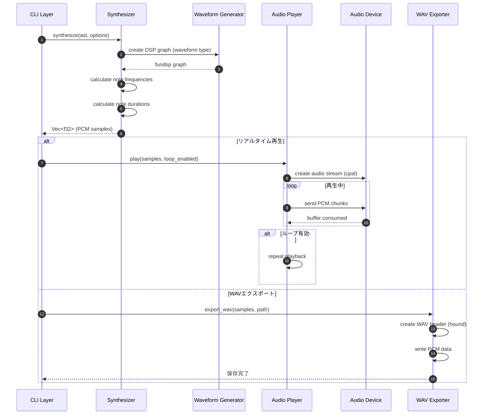
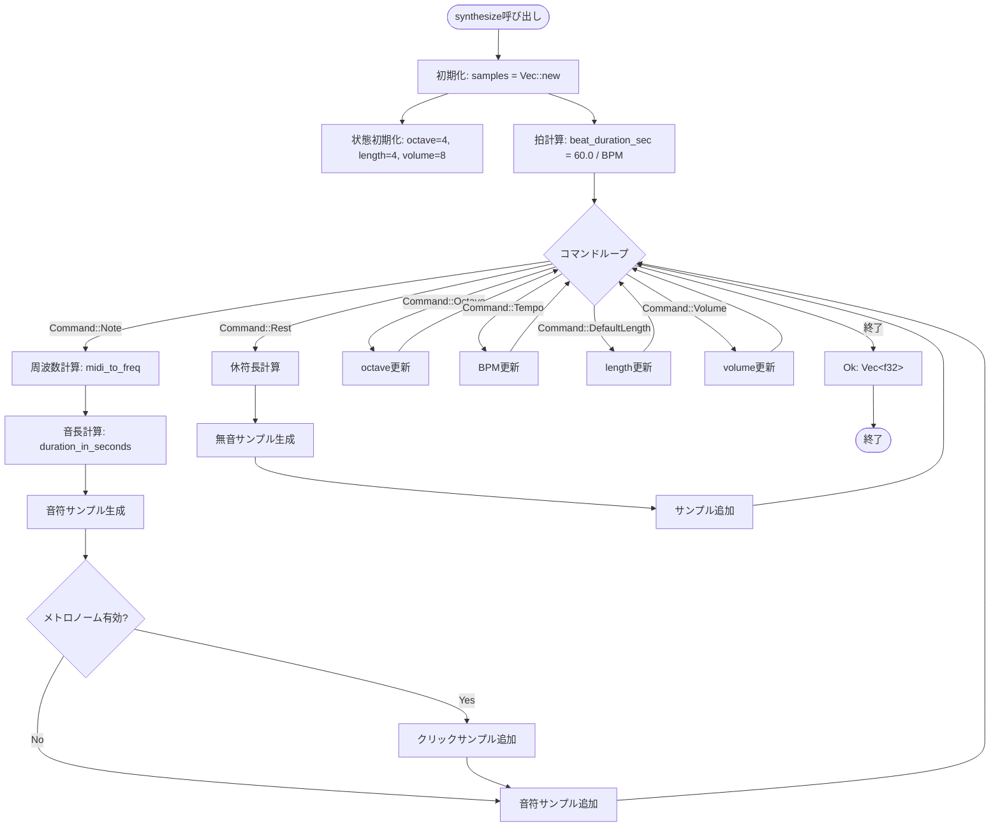
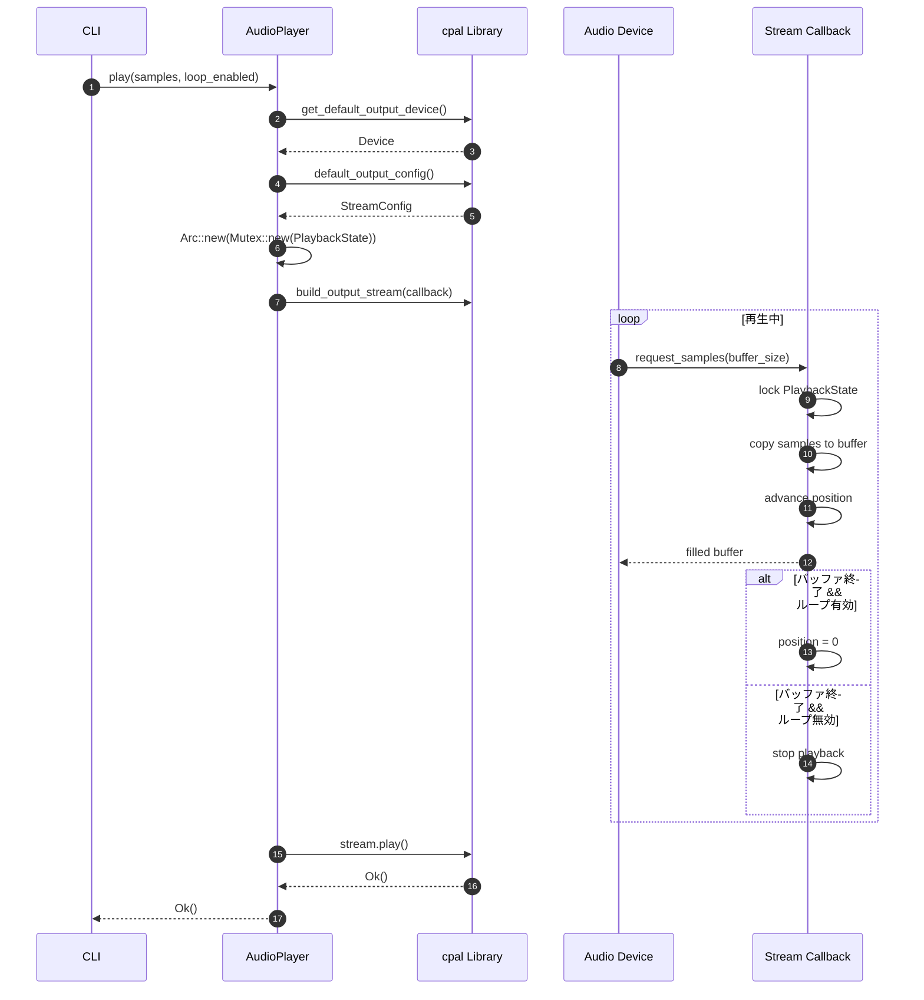
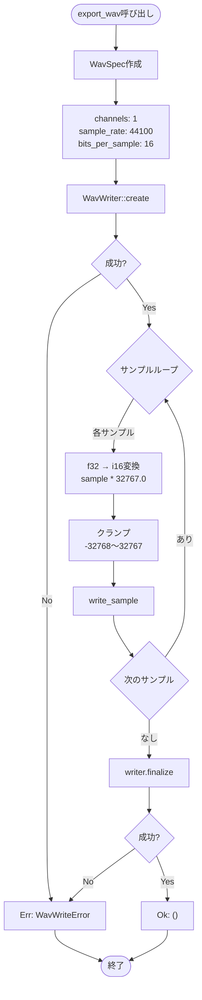
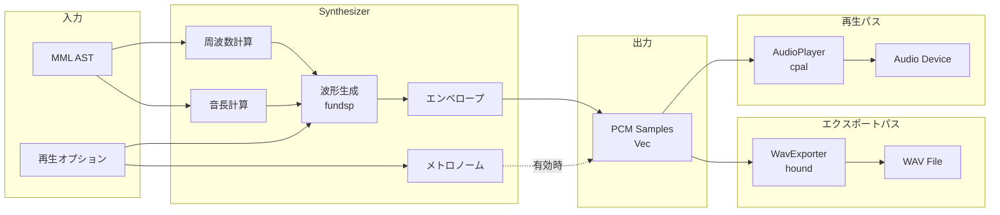

# オーディオエンジン 詳細設計書

## メタ情報

| 項目 | 内容 |
|------|------|
| ドキュメントID | DET-AUD-001 |
| バージョン | 1.0.0 |
| ステータス | レビュー待ち |
| 作成日 | 2026-01-10 |
| 最終更新日 | 2026-01-10 |
| 親機能 | オーディオエンジン |
| 含まれる機能ID | F-002, F-003, F-004, F-005, F-006, F-010, F-012 |
| 関連基本設計書 | BASIC-CLI-001 |
| 関連要件定義書 | - |

## 1. 概要

オーディオエンジンは、MMLパーサーから受け取ったAST（抽象構文木）を元に、PCMサンプルを生成しオーディオデバイスへリアルタイムで出力、またはWAVファイルとして保存するコンポーネントです。fundsp 0.23を使用した波形生成、cpal 0.17を使用したオーディオストリーム管理、hound 3.5を使用したWAVファイル出力を行います。

### 1.1 処理フロー概要



### 1.2 設計方針

| 方針 | 内容 |
|------|------|
| 音声合成方式 | fundspのDSPグラフによる周波数ベースの合成 |
| サンプルレート | 44100 Hz (CD品質) |
| ビット深度 | 16-bit (WAVエクスポート) |
| 波形生成 | サイン波、ノコギリ波、矩形波の3種類 |
| リアルタイム性 | cpalの低レイテンシストリーム |
| メモリ効率 | オンザフライでサンプル生成、大きなバッファは不要 |
| 拡張性 | 将来的な和音対応を見据えた設計 |

## 2. 機能要件

### 2.1 対象機能

| 機能ID | 機能名 | 概要 | 優先度 |
|--------|--------|------|--------|
| F-002 | リアルタイム再生 | 音符データを逐次音声出力 | 必須 |
| F-003 | 波形選択 | サイン波、ノコギリ波、矩形波の切り替え | 必須 |
| F-004 | 音量調節 | 出力音量の0.0〜1.0範囲での調整 | 必須 |
| F-005 | BPM調節 | 演奏速度の調整（30〜300） | 必須 |
| F-006 | ループ再生 | 演奏終了後の自動リピート | 必須 |
| F-010 | WAVエクスポート | 履歴データをWAVファイルとして保存 | 必須 |
| F-012 | クリック音 | 各拍の先頭でのメトロノーム音再生 | 重要 |

### 2.2 オーディオ仕様

| パラメータ | 値 | 説明 |
|-----------|-----|------|
| サンプルレート | 44100 Hz | CD品質、標準的なサンプリングレート |
| ビット深度 | 16-bit | WAVファイル出力時のビット深度 |
| チャンネル数 | 1 (モノラル) | Phase 1ではモノラルのみサポート |
| バッファサイズ | 512 samples | cpalのデフォルト設定に従う |
| 音量範囲 | 0.0〜1.0 | 振幅の倍率（1.0 = 最大音量） |

### 2.3 波形生成アルゴリズム

#### サイン波 (Sine Wave)
```
y(t) = A × sin(2π × f × t)

A: 振幅 (0.0〜1.0)
f: 周波数 (Hz)
t: 時間 (秒)
```

#### ノコギリ波 (Sawtooth Wave)
```
y(t) = A × (2 × (t × f mod 1) - 1)

A: 振幅 (0.0〜1.0)
f: 周波数 (Hz)
t: 時間 (秒)
```

#### 矩形波 (Square Wave)
```
y(t) = A × sign(sin(2π × f × t))

A: 振幅 (0.0〜1.0)
f: 周波数 (Hz)
t: 時間 (秒)
sign(x): x > 0 なら 1、x < 0 なら -1
```

### 2.4 音階計算

MIDIノート番号から周波数への変換式：

```
f = 440 × 2^((n - 69) / 12)

f: 周波数 (Hz)
n: MIDIノート番号
440: A4の周波数 (Hz)
69: A4のMIDIノート番号
```

**主要な音階周波数表**

| 音名 | オクターブ4 | MIDIノート番号 | 周波数 (Hz) |
|------|------------|---------------|------------|
| C | C4 | 60 | 261.63 |
| C# | C#4 | 61 | 277.18 |
| D | D4 | 62 | 293.66 |
| D# | D#4 | 63 | 311.13 |
| E | E4 | 64 | 329.63 |
| F | F4 | 65 | 349.23 |
| F# | F#4 | 66 | 369.99 |
| G | G4 | 67 | 392.00 |
| G# | G#4 | 68 | 415.30 |
| A | A4 | 69 | 440.00 |
| A# | A#4 | 70 | 466.16 |
| B | B4 | 71 | 493.88 |

### 2.5 音長計算

音符の長さ（秒）への変換式：

```
duration_sec = (240 / (BPM × length)) × dot_multiplier

BPM: テンポ (30〜300)
length: 音長 (1〜64)
    - 1: 全音符
    - 2: 2分音符
    - 4: 4分音符
    - 8: 8分音符
    - 16: 16分音符
    
dot_multiplier: 付点による倍率
    - 付点0個: 1.0
    - 付点1個: 1.5
    - 付点2個: 1.75
    - 付点3個: 1.875
    - 付点n個: 1.0 + (1.0 - 0.5^n)
```

**音長例 (BPM=120の場合)**

| 音長 | 付点 | 秒数 | 説明 |
|------|------|------|------|
| 1 | なし | 2.0秒 | 全音符 |
| 2 | なし | 1.0秒 | 2分音符 |
| 4 | なし | 0.5秒 | 4分音符 |
| 4 | 1個 | 0.75秒 | 付点4分音符 |
| 8 | なし | 0.25秒 | 8分音符 |
| 16 | なし | 0.125秒 | 16分音符 |

### 2.6 メトロノームクリック仕様

| パラメータ | 値 | 説明 |
|-----------|-----|------|
| クリック周波数 | 1000 Hz | 聞き取りやすい高周波数 |
| クリック長 | 50 ms | 短く鋭いクリック音 |
| クリック音量 | 0.3 | メインメロディより控えめ |
| 波形 | サイン波 | シンプルなクリック音 |
| タイミング | 各拍の先頭 | 4/4拍子では4分音符ごと |

## 3. データ構造設計

### 3.1 Synthesizer構造

```rust
/// オーディオ合成器
pub struct Synthesizer {
    /// サンプルレート
    sample_rate: u32,
    /// 波形タイプ
    waveform: WaveformType,
    /// 音量
    volume: f32,
}

impl Synthesizer {
    /// 新しいSynthesizerを作成
    pub fn new(waveform: WaveformType, volume: f32) -> Self {
        Self {
            sample_rate: 44100,
            waveform,
            volume: volume.clamp(0.0, 1.0),
        }
    }
    
    /// ASTから音声サンプルを生成
    pub fn synthesize(
        &self,
        ast: &Mml,
        bpm: u16,
        metronome_enabled: bool,
    ) -> Result<Vec<f32>, AudioError> {
        // 実装は後述
    }
    
    /// 単一音符のサンプルを生成
    fn generate_note_samples(
        &self,
        frequency: f32,
        duration_sec: f32,
    ) -> Vec<f32> {
        // 実装は後述
    }
    
    /// メトロノームクリックのサンプルを生成
    fn generate_click_samples(&self) -> Vec<f32> {
        // 実装は後述
    }
}
```

### 3.2 WaveformType列挙型

```rust
/// 波形タイプ
#[derive(Debug, Clone, Copy, PartialEq, Eq)]
pub enum WaveformType {
    /// サイン波
    Sine,
    /// ノコギリ波
    Sawtooth,
    /// 矩形波
    Square,
}

impl WaveformType {
    /// 文字列から変換
    pub fn from_str(s: &str) -> Option<Self> {
        match s.to_lowercase().as_str() {
            "sine" => Some(WaveformType::Sine),
            "sawtooth" => Some(WaveformType::Sawtooth),
            "square" => Some(WaveformType::Square),
            _ => None,
        }
    }
    
    /// 文字列表現を取得
    pub fn as_str(&self) -> &'static str {
        match self {
            WaveformType::Sine => "sine",
            WaveformType::Sawtooth => "sawtooth",
            WaveformType::Square => "square",
        }
    }
}
```

### 3.3 AudioPlayer構造

```rust
use cpal::{Device, Stream, StreamConfig};
use std::sync::{Arc, Mutex};

/// オーディオ再生器
pub struct AudioPlayer {
    /// オーディオデバイス
    device: Device,
    /// ストリーム設定
    config: StreamConfig,
    /// 現在のストリーム（再生中のみSome）
    current_stream: Option<Stream>,
}

impl AudioPlayer {
    /// 新しいAudioPlayerを作成（デフォルトデバイスを使用）
    pub fn new() -> Result<Self, AudioError> {
        // 実装は後述
    }
    
    /// PCMサンプルを再生
    pub fn play(&mut self, samples: Vec<f32>, loop_enabled: bool) -> Result<(), AudioError> {
        // 実装は後述
    }
    
    /// 再生を停止
    pub fn stop(&mut self) {
        self.current_stream = None;
    }
    
    /// 再生中かどうか
    pub fn is_playing(&self) -> bool {
        self.current_stream.is_some()
    }
}
```

### 3.4 WavExporter構造

```rust
use hound::{WavWriter, WavSpec};
use std::path::Path;

/// WAVファイルエクスポーター
pub struct WavExporter;

impl WavExporter {
    /// PCMサンプルをWAVファイルとして保存
    pub fn export<P: AsRef<Path>>(
        samples: &[f32],
        path: P,
    ) -> Result<(), AudioError> {
        let spec = WavSpec {
            channels: 1,
            sample_rate: 44100,
            bits_per_sample: 16,
            sample_format: hound::SampleFormat::Int,
        };
        
        let mut writer = WavWriter::create(path, spec)
            .map_err(|e| AudioError::WavWriteError(e.to_string()))?;
        
        for &sample in samples {
            // f32 (-1.0〜1.0) を i16 (-32768〜32767) に変換
            let sample_i16 = (sample * 32767.0).clamp(-32768.0, 32767.0) as i16;
            writer.write_sample(sample_i16)
                .map_err(|e| AudioError::WavWriteError(e.to_string()))?;
        }
        
        writer.finalize()
            .map_err(|e| AudioError::WavWriteError(e.to_string()))?;
        
        Ok(())
    }
}
```

### 3.5 AudioError列挙型

```rust
use std::fmt;

/// オーディオエラー
#[derive(Debug, Clone)]
pub enum AudioError {
    /// デバイスが見つからない
    DeviceNotFound,
    /// ストリーム作成エラー
    StreamCreationError(String),
    /// 再生エラー
    PlaybackError(String),
    /// WAV書き込みエラー
    WavWriteError(String),
    /// 無効なパラメータ
    InvalidParameter { parameter: String, reason: String },
}

impl fmt::Display for AudioError {
    fn fmt(&self, f: &mut fmt::Formatter<'_>) -> fmt::Result {
        match self {
            AudioError::DeviceNotFound => {
                write!(f, "[AUD-E001] オーディオデバイスが見つかりませんでした")
            }
            AudioError::StreamCreationError(msg) => {
                write!(f, "[AUD-E002] オーディオストリームの作成に失敗しました: {}", msg)
            }
            AudioError::PlaybackError(msg) => {
                write!(f, "[AUD-E003] 再生中にエラーが発生しました: {}", msg)
            }
            AudioError::WavWriteError(msg) => {
                write!(f, "[AUD-E004] WAVファイルの書き込みに失敗しました: {}", msg)
            }
            AudioError::InvalidParameter { parameter, reason } => {
                write!(f, "[AUD-E005] 無効なパラメータ '{}': {}", parameter, reason)
            }
        }
    }
}

impl std::error::Error for AudioError {}
```

## 4. アルゴリズム設計

### 4.1 音声合成アルゴリズム（synthesize）



### 4.2 音符サンプル生成アルゴリズム（generate_note_samples）

```
関数 generate_note_samples(frequency: f32, duration_sec: f32) -> Vec<f32>:
    num_samples = (sample_rate as f32 * duration_sec) as usize
    samples = Vec::with_capacity(num_samples)
    
    for i in 0..num_samples:
        t = i as f32 / sample_rate as f32
        
        sample = match waveform:
            Sine:
                sin(2.0 * PI * frequency * t)
            
            Sawtooth:
                2.0 * ((t * frequency) % 1.0) - 1.0
            
            Square:
                if sin(2.0 * PI * frequency * t) > 0.0:
                    1.0
                else:
                    -1.0
        
        // 音量を適用
        sample *= volume
        
        // エンベロープ適用（フェードイン/アウト）
        envelope = calculate_envelope(i, num_samples)
        sample *= envelope
        
        samples.push(sample)
    
    return samples
```

### 4.3 エンベロープ計算

プチノイズを防ぐためのフェードイン/アウト処理：

```
関数 calculate_envelope(sample_index: usize, total_samples: usize) -> f32:
    fade_samples = min(total_samples / 10, 100) // 最大100サンプル
    
    if sample_index < fade_samples:
        // フェードイン（線形）
        return sample_index as f32 / fade_samples as f32
    
    else if sample_index > total_samples - fade_samples:
        // フェードアウト（線形）
        remaining = total_samples - sample_index
        return remaining as f32 / fade_samples as f32
    
    else:
        // 通常再生
        return 1.0
```

### 4.4 fundsp DSPグラフ構築

```rust
use fundsp::hacker::*;

/// 波形タイプに応じたfundsp DSPグラフを作成
fn create_dsp_graph(waveform: WaveformType, frequency: f32) -> An<impl AudioNode<Inputs = U0, Outputs = U1>> {
    match waveform {
        WaveformType::Sine => {
            // サイン波: sine_hz(frequency)
            sine_hz(frequency)
        }
        WaveformType::Sawtooth => {
            // ノコギリ波: saw_hz(frequency)
            saw_hz(frequency)
        }
        WaveformType::Square => {
            // 矩形波: square_hz(frequency)
            square_hz(frequency)
        }
    }
}

/// DSPグラフからサンプルを生成
fn generate_samples_from_graph<N>(
    mut graph: An<N>,
    duration_sec: f32,
    sample_rate: u32,
    volume: f32,
) -> Vec<f32>
where
    N: AudioNode<Inputs = U0, Outputs = U1>,
{
    let num_samples = (sample_rate as f32 * duration_sec) as usize;
    let mut samples = Vec::with_capacity(num_samples);
    
    // グラフをリセット
    graph.reset(Some(sample_rate as f64));
    
    for i in 0..num_samples {
        // 次のサンプルを取得
        let sample = graph.get_mono();
        
        // エンベロープと音量を適用
        let envelope = calculate_envelope(i, num_samples);
        let final_sample = sample * volume * envelope;
        
        samples.push(final_sample as f32);
    }
    
    samples
}
```

### 4.5 メトロノームクリック生成

```
関数 generate_click_samples() -> Vec<f32>:
    click_frequency = 1000.0 // Hz
    click_duration = 0.05 // 50ms
    click_volume = 0.3
    
    num_samples = (sample_rate as f32 * click_duration) as usize
    samples = Vec::with_capacity(num_samples)
    
    for i in 0..num_samples:
        t = i as f32 / sample_rate as f32
        
        // サイン波でクリック音を生成
        sample = sin(2.0 * PI * click_frequency * t)
        
        // 急激なフェードアウト（エクスポネンシャル）
        decay = exp(-10.0 * t / click_duration)
        sample *= decay * click_volume
        
        samples.push(sample)
    
    return samples
```

## 5. 処理フロー詳細

### 5.1 リアルタイム再生フロー



### 5.2 cpal ストリーム管理

```rust
use cpal::traits::{DeviceTrait, HostTrait, StreamTrait};
use std::sync::{Arc, Mutex};

/// 再生状態
struct PlaybackState {
    samples: Vec<f32>,
    position: usize,
    loop_enabled: bool,
    finished: bool,
}

impl AudioPlayer {
    pub fn play(&mut self, samples: Vec<f32>, loop_enabled: bool) -> Result<(), AudioError> {
        // 既存のストリームを停止
        self.stop();
        
        // 再生状態を作成
        let state = Arc::new(Mutex::new(PlaybackState {
            samples: samples.clone(),
            position: 0,
            loop_enabled,
            finished: false,
        }));
        
        let state_clone = state.clone();
        
        // ストリームコールバック関数
        let data_callback = move |data: &mut [f32], _: &cpal::OutputCallbackInfo| {
            let mut state = state_clone.lock().unwrap();
            
            for sample_out in data.iter_mut() {
                if state.position >= state.samples.len() {
                    if state.loop_enabled {
                        // ループ: 先頭に戻る
                        state.position = 0;
                    } else {
                        // ループなし: 無音を出力して終了
                        *sample_out = 0.0;
                        state.finished = true;
                        continue;
                    }
                }
                
                *sample_out = state.samples[state.position];
                state.position += 1;
            }
        };
        
        // エラーコールバック
        let err_callback = |err| {
            eprintln!("オーディオストリームエラー: {}", err);
        };
        
        // ストリームを作成
        let stream = self.device
            .build_output_stream(&self.config, data_callback, err_callback, None)
            .map_err(|e| AudioError::StreamCreationError(e.to_string()))?;
        
        // 再生開始
        stream.play()
            .map_err(|e| AudioError::PlaybackError(e.to_string()))?;
        
        self.current_stream = Some(stream);
        
        Ok(())
    }
}
```

### 5.3 WAVエクスポートフロー



## 6. オーディオパイプライン図



## 7. 設計書一覧

| 設計書 | パス | 説明 |
|--------|------|------|
| バックエンド設計書 | [./バックエンド設計書.md](./バックエンド設計書.md) | オーディオエンジンAPI仕様 |

## 8. エラーコード一覧

| コード | 説明 | 対処方法 |
|--------|------|----------|
| AUD-E001 | オーディオデバイスが見つからない | オーディオデバイスが接続されているか確認してください |
| AUD-E002 | オーディオストリームの作成失敗 | デバイスドライバを更新するか、別のデバイスを試してください |
| AUD-E003 | 再生中のエラー | オーディオデバイスが使用中でないか確認してください |
| AUD-E004 | WAVファイル書き込み失敗 | ディスクの空き容量と書き込み権限を確認してください |
| AUD-E005 | 無効なパラメータ | パラメータの範囲を確認してください（音量: 0.0-1.0、BPM: 30-300） |

## 9. テスト戦略

### 9.1 ユニットテスト項目

| テストケース | 入力 | 期待される出力 | 検証内容 |
|-------------|------|---------------|----------|
| サイン波生成 | frequency=440Hz, duration=1s | 44100サンプル | サンプル数が正しいこと |
| 周波数精度 | C4 (261.63Hz) | 正弦波の周期が一致 | 周波数計算の精度 |
| 音量適用 | volume=0.5 | 振幅が0.5倍 | 音量係数が正しく適用されること |
| 音長計算 | BPM=120, length=4 | 0.5秒 | 4分音符が0.5秒であること |
| 付点音符 | length=4, dots=1 | 0.75秒 | 付点4分音符が0.75秒であること |
| エンベロープ | 短い音符 | フェードイン/アウトあり | プチノイズがないこと |
| WAV出力 | 44100サンプル | 正しいWAVファイル | ファイルが再生可能であること |
| メトロノーム | BPM=120 | 0.5秒ごとにクリック | クリックタイミングが正確であること |

### 9.2 統合テスト項目

| テストケース | MML入力 | 検証項目 |
|-------------|---------|----------|
| 単音再生 | "O4 C4" | 正しい周波数で再生されること |
| 音階再生 | "O4 C D E F G A B" | 各音が正しい周波数で再生されること |
| テンポ変更 | "T60 C4 T120 C4" | テンポ変更が反映されること |
| 波形切り替え | 各波形で同じMML | 異なる音色が生成されること |
| ループ再生 | "C D E F" + loop=true | 無限ループが正しく動作すること |
| WAVエクスポート | "O4 C4 D4 E4" | WAVファイルが正しく保存されること |
| メトロノーム付き | "T120 C4 D4 E4" + metronome=true | クリック音が各拍で聞こえること |

### 9.3 音質テスト項目

| テストケース | 検証内容 |
|-------------|----------|
| プチノイズ検証 | 音符の開始/終了時にプチノイズがないこと |
| 周波数精度 | スペクトル解析で正しい周波数が出力されていること |
| 音量レベル | 音量設定が正しく反映されること（クリッピングなし） |
| リアルタイム性 | 遅延が50ms以内であること |
| WAV品質 | エクスポートしたWAVファイルが44.1kHz/16bitであること |

## 10. パフォーマンス要件

| 項目 | 要件 |
|------|------|
| 合成時間 | 1分間のMMLを100ms以内で合成 |
| メモリ使用量 | 1分間の音声で約10MB（44100Hz × 60秒 × 4バイト） |
| リアルタイム再生 | レイテンシ50ms以内 |
| WAV書き込み | 1分間の音声を500ms以内で保存 |
| CPU使用率 | 再生中はシングルコアの10%以内 |

## 11. 拡張性考慮事項

| 項目 | 現在の設計 | 将来の拡張 |
|------|----------|----------|
| チャンネル数 | モノラル（1ch） | ステレオ（2ch）対応 |
| 和音 | 非対応 | 複数DSPグラフの合成 |
| エフェクト | なし | リバーブ、ディレイ等のエフェクト |
| 波形 | 3種類 | カスタム波形、ウェーブテーブル合成 |
| エンベロープ | 線形フェード | ADSR エンベロープ |
| サンプルレート | 44100Hz固定 | 可変サンプルレート対応 |

---

## 変更履歴

| 日付 | バージョン | 変更内容 | 担当者 |
|:---|:---|:---|:---|
| 2026-01-10 | 1.0.0 | 初版作成 | Antigravity |
