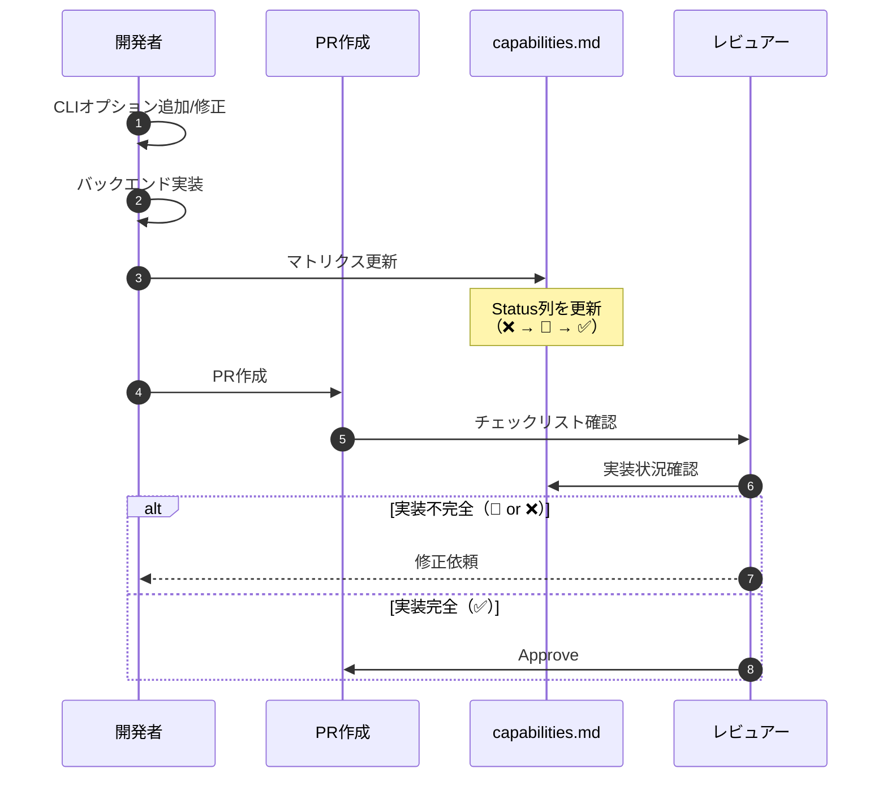

# CLI-Backend対応マトリクス 詳細設計書

## メタ情報

| 項目 | 内容 |
|------|------|
| ドキュメントID | DET-CAP-001 |
| バージョン | 1.0.0 |
| ステータス | 確定 |
| 作成日 | 2026-01-11 |
| 最終更新日 | 2026-01-11 |
| 親機能 | 機能管理・ドキュメント |
| 含まれる機能ID | F-020 |
| 関連基本設計書 | BASIC-CLI-002_MML-Synthesizer-Enhancement.md |
| 関連要件定義書 | REQ-CLI-002_MML-Synthesizer-Enhancement.md |

---

## 1. 概要

### 1.1 目的

CLI-Backend対応マトリクス（Capability Matrix）は、sine-mml CLIプロジェクトにおける**CLIオプションとバックエンド実装の対応関係を可視化**するドキュメントです。

主な目的：
1. **実装状況の追跡**: どのCLIオプションがバックエンドで完全実装されているかを明確化
2. **スタブ機能の防止**: スタブ実装のままリリースされる機能を未然に防止
3. **開発者向けガイド**: 新規メンバーや貢献者が実装状況を一目で理解できる
4. **品質保証**: PR作成前に機能の実装完全性をチェックする基準として活用

### 1.2 背景

REQ-CLI-002に記載された課題：
- メトロノーム機能がスタブ実装のままリリース（音が鳴らない）
- CLIオプション追加時にバックエンド実装が追従しないケースが発生
- 実装状況の追跡が属人化し、ドキュメント不在

### 1.3 処理フロー概要



---

## 2. 機能要件

### 2.1 対象機能

| 機能ID | 機能名 | 概要 | 優先度 |
|--------|--------|------|--------|
| F-020 | CLI-Backend対応マトリクス | CLIオプションとバックエンド実装の対応表 | 重要 |

### 2.2 ビジネスルール

| ルールID | 内容 |
|---------|------|
| BR-050 | 新規CLIオプション追加時は必ずマトリクスを更新すること |
| BR-051 | バックエンド実装が完了するまでStatus列は「❌ Not Implemented」または「🚧 In Progress」とすること |
| BR-052 | PRマージ前にマトリクス更新が含まれることをチェックリストで確認すること |
| BR-053 | ステータス記号は以下のみ許可：✅（実装済み）、🚧（進行中）、❌（未実装）、⚠️（非推奨） |
| BR-054 | 非推奨機能（Deprecated）は削除せず⚠️マークで残すこと |

---

## 3. マトリクス構造

### 3.1 テーブル定義

| 列名 | 型 | 説明 | 必須 |
|------|-----|------|------|
| CLI Option | string | CLIオプション名（例: `play <MML>`） | ✅ |
| Backend Implementation | string | 実装箇所（モジュール名、関数名） | ✅ |
| Status | emoji + string | 実装状況（✅/🚧/❌/⚠️） | ✅ |
| Notes | string | 補足情報（バージョン情報、非推奨理由等） | ✅ |

### 3.2 ステータス定義

| 記号 | 英語表記 | 日本語 | 説明 |
|------|---------|--------|------|
| ✅ | Implemented | 実装済み | CLIとバックエンドが完全連携している |
| 🚧 | In Progress | 進行中 | 部分実装（スタブ、一部機能未実装） |
| ❌ | Not Implemented | 未実装 | CLIオプションが存在するがバックエンド未実装 |
| ⚠️ | Deprecated | 非推奨 | 将来削除予定の機能 |

### 3.3 マトリクス例（現在のv1.0状態）

| CLI Option | Backend Implementation | Status | Notes |
|------------|----------------------|--------|-------|
| `play <MML>` | `mml::parse` + `Synthesizer::synthesize` | ✅ Implemented | Core functionality |
| `--waveform` | `WaveformType` enum (sine/sawtooth/square) | ✅ Implemented | 3 waveform types supported |
| `--volume` | `Synthesizer.volume` (0.0-1.0) | ✅ Implemented | Validated by clap |
| `--bpm` | `PlayArgs.bpm` → `HistoryEntry.bpm` | ⚠️ Deprecated | To be removed in v2.0 (use MML `T` command) |
| `--loop-play` | `AudioPlayer.play(loop=true)` | ✅ Implemented | Infinite loop playback |
| `--metronome` | `PlayArgs.metronome` flag | 🚧 In Progress | Flag exists, noise-based click not implemented |
| `--history-id` | `Database.get_by_id()` | ✅ Implemented | Replay from history |
| `history` | `Database.list()` + comfy-table | ✅ Implemented | List up to 20 entries |
| `export --history-id` | `exporter::export_wav()` | ✅ Implemented | WAV file output |
| `export --output` | `std::path::Path` validation | ✅ Implemented | Path traversal protection |

### 3.4 v2.0追加予定機能

| CLI Option | Backend Implementation | Status | Notes |
|------------|----------------------|--------|-------|
| `--metronome-beat` | TBD (`Synthesizer::mix_metronome`) | ❌ Not Implemented | Planned for v2.0 (4/8/16 beat) |
| `--metronome-volume` | TBD (`generate_noise_click`) | ❌ Not Implemented | Planned for v2.0 (0.0-1.0 range) |

---

## 4. 更新ルール

### 4.1 更新タイミング

| タイミング | 更新内容 | 担当者 |
|-----------|---------|--------|
| CLIオプション追加時 | 新規行を追加（Status: ❌） | 実装者 |
| バックエンド実装開始時 | Status: ❌ → 🚧 | 実装者 |
| バックエンド実装完了時 | Status: 🚧 → ✅ | 実装者 |
| 機能非推奨化決定時 | Status: ✅ → ⚠️ + Notes更新 | 実装者 |
| 機能削除時 | 行削除（ただし変更履歴に記録） | 実装者 |

### 4.2 PRチェックリスト項目

PRテンプレート（`.github/pull_request_template.md`）に以下を追加：

```markdown
## Capability Matrix Update

- [ ] `docs/capabilities.md`を更新した（CLIオプション追加/変更がある場合）
- [ ] 新規追加機能のStatusを正しく設定した（✅/🚧/❌）
- [ ] バックエンド実装箇所を明記した（モジュール名、関数名）
```

### 4.3 自動チェック（将来実装）

GitHub Actionsでの自動チェック（Phase 2、オプション）：

```yaml
# .github/workflows/capability-check.yml
name: Capability Matrix Check
on: [pull_request]
jobs:
  check:
    runs-on: ubuntu-latest
    steps:
      - uses: actions/checkout@v3
      - name: Check CLI args vs Matrix
        run: |
          # src/cli/args.rsのオプション一覧を抽出
          # docs/capabilities.mdの行数と比較
          # 不一致があれば警告
```

---

## 5. ドキュメント構成

### 5.1 ファイル配置

| ファイルパス | 説明 |
|-------------|------|
| `docs/capabilities.md` | マトリクス本体（英語） |
| `docs/designs/detailed/capabilities/詳細設計書.md` | 本書（日本語） |

### 5.2 マトリクス本体（capabilities.md）の構成

```markdown
# sine-mml CLI-Backend Capability Matrix

**Project**: sine-mml v1.0  
**Last Updated**: 2026-01-11

## Current Implementation Status

| CLI Option | Backend Implementation | Status | Notes |
|------------|----------------------|--------|-------|
| ... | ... | ... | ... |

## Legend

- ✅ **Implemented**: Fully implemented and tested
- 🚧 **In Progress**: Partially implemented (stub or incomplete)
- ❌ **Not Implemented**: Planned but not yet started
- ⚠️ **Deprecated**: Scheduled for removal in future versions

## How to Update This Document

1. Add a new row when adding a CLI option
2. Update Status column when implementation progresses
3. Include this update in your PR
4. Check PR template checklist
```

---

## 6. テスト戦略

### 6.1 手動検証

| 検証項目 | 手順 | 合格基準 |
|---------|------|---------|
| マトリクス網羅性 | `src/cli/args.rs`のすべてのオプションがマトリクスに存在するか確認 | 100%網羅 |
| ステータス正確性 | 各CLIオプションを実行し、バックエンドが正しく動作するか確認 | ✅のみ正常動作 |
| Notes情報の正確性 | 非推奨機能やバージョン情報が正しいか確認 | ドキュメント一致 |

### 6.2 自動テスト（将来実装、オプション）

```bash
# マトリクスとCLI定義の同期チェック
cargo test --test capability_matrix_sync
```

---

## 7. 非機能要件

### 7.1 保守性

| 項目 | 要件 | 理由 |
|------|------|------|
| ファイル形式 | Markdown | バージョン管理しやすく、GitHub上で表示可能 |
| 文字コード | UTF-8 | 絵文字ステータスの正確な表示 |
| 行長制限 | なし | 表形式のため制限不要 |

### 7.2 可読性

| 項目 | 要件 |
|------|------|
| 表のフォーマット | GitHub Flavored Markdown標準テーブル |
| 絵文字の使用 | ステータス列のみ（✅🚧❌⚠️） |
| アルファベット順 | CLIコマンド、オプション名でソート |

---

## 8. マイグレーション

### 8.1 初版作成手順

1. `src/cli/args.rs`から全CLIオプションを抽出
2. `src/cli/handlers.rs`からバックエンド実装箇所を特定
3. 各オプションの実装状況を確認（テスト実行）
4. マトリクステーブルを作成
5. `docs/capabilities.md`に書き込み

### 8.2 v1.0 → v2.0マイグレーション

| 変更内容 | マトリクス更新 |
|---------|---------------|
| `--bpm`削除 | Status: ⚠️ → 行削除（変更履歴に記録） |
| `--metronome-beat`追加 | 新規行追加（Status: ❌ → 🚧 → ✅） |
| `--metronome-volume`追加 | 新規行追加（Status: ❌ → 🚧 → ✅） |
| メトロノーム完全実装 | `--metronome` Status: 🚧 → ✅ |

---

## 9. 関連ドキュメント

| ドキュメント | パス | 説明 |
|-------------|------|------|
| 基本設計書 | `docs/designs/basic/BASIC-CLI-002_MML-Synthesizer-Enhancement.md` | v2.0機能拡張の基本設計 |
| 要件定義書 | `docs/requirements/REQ-CLI-002_MML-Synthesizer-Enhancement.md` | v2.0機能要件 |
| PRテンプレート | `.github/pull_request_template.md` | マトリクス更新チェックリスト |

---

## 10. 未解決課題

| ID | 課題 | 優先度 | 期限 |
|----|------|--------|------|
| I-009 | GitHub Actionsでの自動同期チェック実装 | 低 | v2.1.0 |
| I-010 | マトリクスとCLI定義の自動生成スクリプト | 低 | v2.1.0 |

---

## 変更履歴

| 日付 | バージョン | 変更内容 | 担当者 |
|:---|:---|:---|:---:|
| 2026-01-11 | 1.0.0 | 初版作成（F-020対応） | - |
