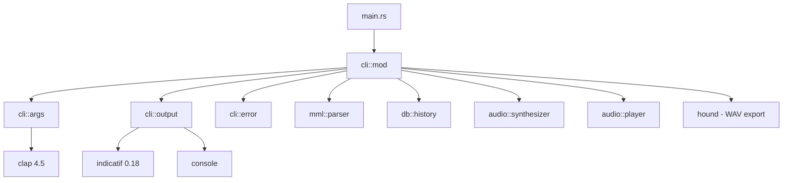
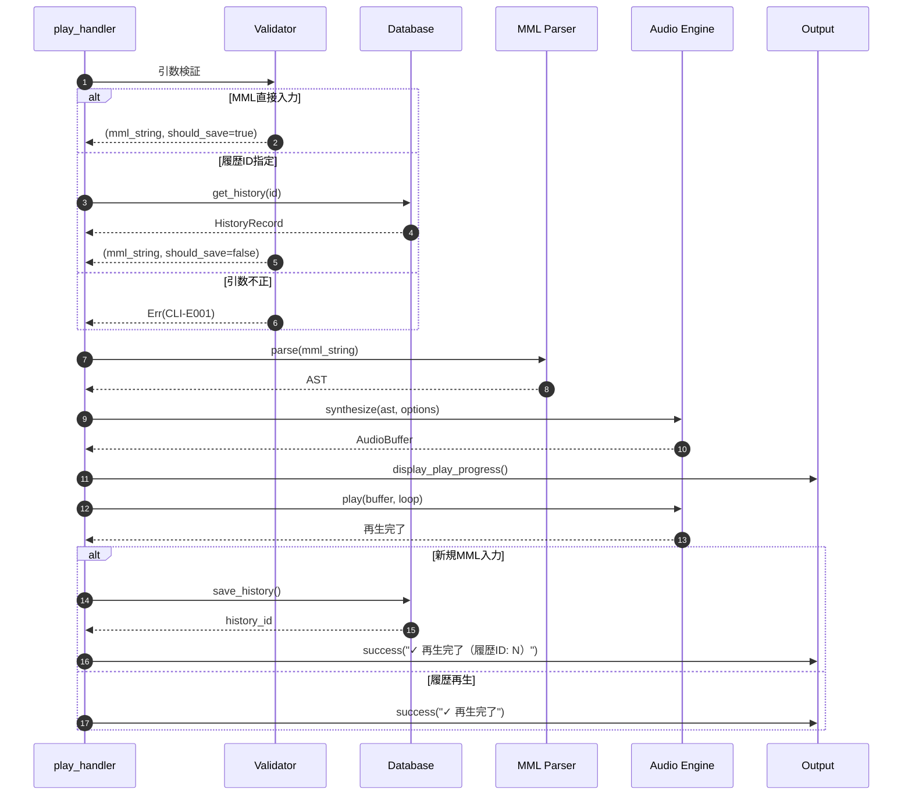
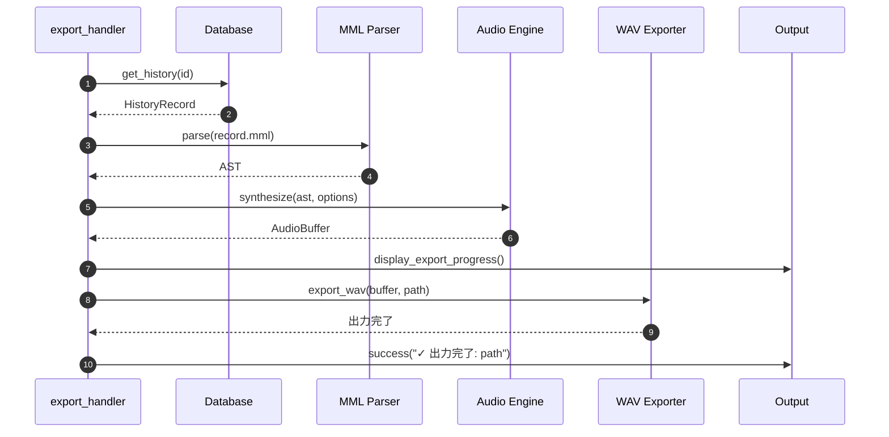

# CLIインターフェース バックエンド設計書

## ドキュメント情報

| 項目 | 内容 |
|------|------|
| ドキュメントID | DET-CLI-001-BE |
| バージョン | 1.0.0 |
| ステータス | レビュー待ち |
| 作成日 | 2026-01-10 |
| 最終更新日 | 2026-01-10 |
| 関連詳細設計書 | DET-CLI-001 |

## 1. モジュール構成

### 1.1 ファイル構成

- `src/`
  - `main.rs` - エントリポイント、エラーハンドリング
  - `cli/`
    - `mod.rs` - CLI公開APIと各ハンドラー関数
    - `args.rs` - clap引数定義
    - `output.rs` - 出力フォーマット（テーブル、プログレスバー）
    - `error.rs` - CLIエラー型定義

### 1.2 モジュール依存関係



## 2. 公開API仕様

### 2.1 main.rs - エントリポイント

```rust
use anyhow::Result;
use clap::Parser;

mod cli;
mod mml;
mod audio;
mod db;
mod utils;

fn main() {
    // エラーハンドリングとロギング
    if let Err(e) = run() {
        cli::error::display_error(&e);
        std::process::exit(1);
    }
}

/// アプリケーションのメインロジック
fn run() -> Result<()> {
    // 引数解析
    let args = cli::args::Cli::parse();
    
    // サブコマンド分岐
    match args.command {
        cli::args::Command::Play(play_args) => {
            cli::play_handler(play_args)
        }
        cli::args::Command::History => {
            cli::history_handler()
        }
        cli::args::Command::Export(export_args) => {
            cli::export_handler(export_args)
        }
    }
}
```

### 2.2 cli/args.rs - 引数定義

```rust
use clap::{Parser, Subcommand, ValueEnum};

/// MML Synthesizer CLI
#[derive(Parser, Debug)]
#[command(name = "sine-mml")]
#[command(version = "0.1.0")]
#[command(about = "MML文字列を音声合成して再生するCLIツール", long_about = None)]
pub struct Cli {
    #[command(subcommand)]
    pub command: Command,
}

/// サブコマンド定義
#[derive(Subcommand, Debug)]
pub enum Command {
    /// MMLを演奏する
    Play(PlayArgs),
    
    /// 演奏履歴を表示する
    History,
    
    /// 履歴をWAVファイルとして出力する
    Export(ExportArgs),
}

/// playサブコマンドの引数
#[derive(Parser, Debug)]
pub struct PlayArgs {
    /// MML文字列（履歴IDと排他）
    #[arg(value_name = "MML", conflicts_with = "history_id")]
    pub mml: Option<String>,
    
    /// 履歴IDから再生
    #[arg(long, value_name = "ID", conflicts_with = "mml")]
    pub history_id: Option<i64>,
    
    /// 波形タイプ
    #[arg(short = 'w', long, value_enum, default_value = "sine")]
    pub waveform: Waveform,
    
    /// 音量 (0.0 - 1.0)
    #[arg(short = 'v', long, default_value = "0.5", value_parser = validate_volume)]
    pub volume: f32,
    
    /// テンポ (BPM: 30 - 300)
    #[arg(short = 'b', long, default_value = "120", value_parser = validate_bpm)]
    pub bpm: u16,
    
    /// ループ再生
    #[arg(long)]
    pub r#loop: bool,
    
    /// メトロノーム音を追加
    #[arg(long)]
    pub metronome: bool,
}

/// exportサブコマンドの引数
#[derive(Parser, Debug)]
pub struct ExportArgs {
    /// 出力対象の履歴ID
    #[arg(long, value_name = "ID", required = true)]
    pub history_id: i64,
    
    /// 出力先ファイルパス
    #[arg(short = 'o', long, value_name = "PATH", required = true)]
    pub output: String,
}

/// 波形タイプ
#[derive(ValueEnum, Debug, Clone, Copy, PartialEq, Eq)]
pub enum Waveform {
    /// サイン波
    Sine,
    /// ノコギリ波
    Sawtooth,
    /// 矩形波
    Square,
}

// バリデーション関数

/// 音量のバリデーション (0.0 - 1.0)
fn validate_volume(s: &str) -> Result<f32, String> {
    let volume: f32 = s.parse()
        .map_err(|_| format!("数値として解析できません: {}", s))?;
    
    if volume < 0.0 || volume > 1.0 {
        Err(format!("[CLI-E005] 音量は 0.0 〜 1.0 の範囲で指定してください（指定値: {}）", volume))
    } else {
        Ok(volume)
    }
}

/// BPMのバリデーション (30 - 300)
fn validate_bpm(s: &str) -> Result<u16, String> {
    let bpm: u16 = s.parse()
        .map_err(|_| format!("数値として解析できません: {}", s))?;
    
    if bpm < 30 || bpm > 300 {
        Err(format!("[CLI-E006] BPMは 30 〜 300 の範囲で指定してください（指定値: {}）", bpm))
    } else {
        Ok(bpm)
    }
}

impl Waveform {
    /// audio::Waveform型に変換
    pub fn to_audio_waveform(self) -> crate::audio::Waveform {
        match self {
            Waveform::Sine => crate::audio::Waveform::Sine,
            Waveform::Sawtooth => crate::audio::Waveform::Sawtooth,
            Waveform::Square => crate::audio::Waveform::Square,
        }
    }
}
```

### 2.3 cli/mod.rs - ハンドラー関数

```rust
pub mod args;
pub mod output;
pub mod error;

use anyhow::{Result, Context, bail};
use args::{PlayArgs, ExportArgs};
use crate::db::HistoryRecord;
use crate::mml;
use crate::audio;
use crate::db;

/// playサブコマンドのハンドラー
pub fn play_handler(args: PlayArgs) -> Result<()> {
    // 引数の検証
    let (mml_string, should_save) = match (&args.mml, args.history_id) {
        (Some(mml), None) => {
            // 直接MML入力
            (mml.clone(), true)
        }
        (None, Some(id)) => {
            // 履歴から取得
            let record = db::get_history(id)
                .with_context(|| format!("[CLI-E002] 履歴ID {} が見つかりません", id))?;
            (record.mml, false)
        }
        (None, None) => {
            bail!("[CLI-E001] play コマンドでは、MML文字列または --history-id のいずれか一方を指定してください");
        }
        (Some(_), Some(_)) => {
            // clap の conflicts_with で防止されるため到達しない
            unreachable!()
        }
    };
    
    // MML解析
    let ast = mml::parse(&mml_string)
        .map_err(|e| {
            error::format_parse_error(&mml_string, &e)
        })?;
    
    // オーディオオプション構築
    let audio_options = audio::SynthOptions {
        waveform: args.waveform.to_audio_waveform(),
        volume: args.volume,
        bpm: args.bpm,
        enable_metronome: args.metronome,
    };
    
    // 音声合成
    let buffer = audio::synthesize(&ast, &audio_options)
        .context("音声合成に失敗しました")?;
    
    // プログレスバー表示付き再生
    output::display_play_progress(&mml_string, &buffer, args.r#loop)?;
    
    // 再生
    audio::play(&buffer, args.r#loop)
        .context("音声再生に失敗しました")?;
    
    // 履歴保存（新規MML入力の場合のみ）
    if should_save {
        let history_id = db::save_history(&HistoryRecord {
            id: 0, // 自動採番
            mml: mml_string.clone(),
            waveform: format!("{:?}", args.waveform).to_lowercase(),
            volume: args.volume,
            bpm: args.bpm,
            created_at: chrono::Utc::now().to_rfc3339(),
        })?;
        
        output::success(&format!("✓ 再生完了（履歴ID: {}）", history_id));
    } else {
        output::success("✓ 再生完了");
    }
    
    Ok(())
}

/// historyサブコマンドのハンドラー
pub fn history_handler() -> Result<()> {
    let records = db::list_history()
        .context("履歴の取得に失敗しました")?;
    
    if records.is_empty() {
        output::info("履歴はありません");
    } else {
        output::display_history_table(&records);
    }
    
    Ok(())
}

/// exportサブコマンドのハンドラー
pub fn export_handler(args: ExportArgs) -> Result<()> {
    // 履歴取得
    let record = db::get_history(args.history_id)
        .with_context(|| format!("[CLI-E002] 履歴ID {} が見つかりません", args.history_id))?;
    
    // MML解析
    let ast = mml::parse(&record.mml)
        .map_err(|e| {
            error::format_parse_error(&record.mml, &e)
        })?;
    
    // オーディオオプション構築（履歴から復元）
    let audio_options = audio::SynthOptions {
        waveform: parse_waveform(&record.waveform)?,
        volume: record.volume,
        bpm: record.bpm,
        enable_metronome: false,
    };
    
    // 音声合成
    let buffer = audio::synthesize(&ast, &audio_options)
        .context("音声合成に失敗しました")?;
    
    // プログレスバー表示付きエクスポート
    output::display_export_progress(&args.output, &buffer)?;
    
    // WAV出力
    audio::export_wav(&buffer, &args.output)
        .with_context(|| format!("[CLI-E004] ファイル {} への書き込みに失敗しました", args.output))?;
    
    output::success(&format!("✓ 出力完了: {}", args.output));
    
    Ok(())
}

/// 文字列から波形タイプを復元
fn parse_waveform(s: &str) -> Result<audio::Waveform> {
    match s {
        "sine" => Ok(audio::Waveform::Sine),
        "sawtooth" => Ok(audio::Waveform::Sawtooth),
        "square" => Ok(audio::Waveform::Square),
        _ => bail!("[CLI-E007] 不正な波形指定: {}", s),
    }
}
```

### 2.4 cli/output.rs - 出力フォーマット

```rust
use console::style;
use indicatif::{ProgressBar, ProgressStyle};
use std::time::Duration;
use crate::db::HistoryRecord;
use crate::audio::AudioBuffer;
use anyhow::Result;

/// 成功メッセージを表示
pub fn success(msg: &str) {
    println!("{}", style(msg).green().bold());
}

/// 情報メッセージを表示
pub fn info(msg: &str) {
    println!("{}", style(msg).white());
}

/// 警告メッセージを表示
pub fn warning(msg: &str) {
    eprintln!("{}", style(msg).yellow());
}

/// 履歴テーブルを表示
pub fn display_history_table(records: &[HistoryRecord]) {
    use comfy_table::{Table, Cell, Color, Attribute};
    
    let mut table = Table::new();
    table.set_header(vec![
        Cell::new("ID").fg(Color::Cyan).add_attribute(Attribute::Bold),
        Cell::new("作成日時").fg(Color::Cyan).add_attribute(Attribute::Bold),
        Cell::new("MML").fg(Color::Cyan).add_attribute(Attribute::Bold),
        Cell::new("波形").fg(Color::Cyan).add_attribute(Attribute::Bold),
        Cell::new("音量").fg(Color::Cyan).add_attribute(Attribute::Bold),
        Cell::new("BPM").fg(Color::Cyan).add_attribute(Attribute::Bold),
    ]);
    
    for record in records {
        // MMLは最大50文字で切り詰め
        let mml_preview = if record.mml.len() > 50 {
            format!("{}...", &record.mml[..47])
        } else {
            record.mml.clone()
        };
        
        table.add_row(vec![
            Cell::new(record.id),
            Cell::new(&format_datetime(&record.created_at)),
            Cell::new(mml_preview),
            Cell::new(&record.waveform),
            Cell::new(format!("{:.1}", record.volume)),
            Cell::new(record.bpm),
        ]);
    }
    
    println!("{}", table);
}

/// 再生プログレスバーを表示
pub fn display_play_progress(
    mml: &str,
    buffer: &AudioBuffer,
    is_loop: bool,
) -> Result<()> {
    let mml_preview = if mml.len() > 60 {
        format!("{}...", &mml[..57])
    } else {
        mml.to_string()
    };
    
    println!("{}", style(format!("Playing: {}", mml_preview)).cyan());
    
    if is_loop {
        println!("{}", style("ループ再生中（Ctrl+Cで停止）").yellow());
        // ループ再生の場合はプログレスバーなし
        Ok(())
    } else {
        let duration_secs = buffer.duration_seconds();
        let pb = ProgressBar::new(100);
        pb.set_style(
            ProgressStyle::default_bar()
                .template("{msg}\n[{bar:40.cyan/blue}] {percent}% ({elapsed_precise} / {duration_precise})")
                .unwrap()
                .progress_chars("█░"),
        );
        pb.set_message(format!("BPM: {}", buffer.bpm));
        
        // 再生完了まで更新（実際の実装では別スレッドで更新）
        for i in 0..=100 {
            pb.set_position(i);
            std::thread::sleep(Duration::from_millis((duration_secs * 10.0) as u64));
        }
        
        pb.finish_and_clear();
        Ok(())
    }
}

/// エクスポートプログレスバーを表示
pub fn display_export_progress(
    output_path: &str,
    buffer: &AudioBuffer,
) -> Result<()> {
    println!("{}", style(format!("Exporting to {}...", output_path)).cyan());
    
    let total_frames = buffer.total_frames();
    let pb = ProgressBar::new(total_frames as u64);
    pb.set_style(
        ProgressStyle::default_bar()
            .template("[{bar:40.cyan/blue}] {percent}% ({pos}/{len} frames)")
            .unwrap()
            .progress_chars("█░"),
    );
    
    // エクスポート処理中の進捗更新（実際の実装ではコールバックで更新）
    for i in 0..=total_frames {
        pb.set_position(i as u64);
        std::thread::sleep(Duration::from_micros(10)); // 実際の処理時間
    }
    
    pb.finish_and_clear();
    Ok(())
}

/// 日時フォーマット（ISO 8601 → 人間可読形式）
fn format_datetime(iso: &str) -> String {
    // RFC3339形式をパースして表示用にフォーマット
    chrono::DateTime::parse_from_rfc3339(iso)
        .map(|dt| dt.format("%Y-%m-%d %H:%M:%S").to_string())
        .unwrap_or_else(|_| iso.to_string())
}
```

### 2.5 cli/error.rs - エラー表示

```rust
use console::style;
use anyhow::Error;
use crate::mml::ParseError;

/// エラーを整形して表示
pub fn display_error(error: &Error) {
    eprintln!("{}", style("Error:").red().bold());
    eprintln!("{}", style(format!("{:#}", error)).red());
    
    // ヒントがあれば表示
    if let Some(hint) = extract_hint(error) {
        eprintln!();
        eprintln!("{}", style(format!("ヒント: {}", hint)).yellow());
    }
}

/// パースエラーを整形して表示（位置情報付き）
pub fn format_parse_error(mml: &str, error: &ParseError) -> Error {
    let error_msg = match error {
        ParseError::UnexpectedToken { expected, found, position } => {
            format_error_with_position(
                mml,
                *position,
                &format!("[MML-E001] 期待されたトークン '{}' ですが、'{:?}' が見つかりました", expected, found),
            )
        }
        ParseError::InvalidNumber { value, range, position } => {
            format_error_with_position(
                mml,
                *position,
                &format!("[MML-E002] 数値 {} は範囲 {}-{} を超えています", value, range.0, range.1),
            )
        }
        ParseError::UnexpectedCharacter { character, position } => {
            format_error_with_position(
                mml,
                *position,
                &format!("[MML-E003] 不明な文字 '{}' が見つかりました", character),
            )
        }
        ParseError::UnexpectedEof { expected, position } => {
            format_error_with_position(
                mml,
                *position,
                &format!("[MML-E004] '{}' が期待されましたが、入力が終了しました", expected),
            )
        }
        ParseError::EmptyInput => {
            anyhow::anyhow!("[MML-E005] 空のMML文字列が入力されました")
        }
    };
    
    error_msg
}

/// エラー位置を視覚的に表示
fn format_error_with_position(mml: &str, position: usize, message: &str) -> Error {
    let mut error_display = String::new();
    error_display.push_str("MML parse error\n\n");
    error_display.push_str(mml);
    error_display.push('\n');
    
    // ポインタ表示
    for _ in 0..position {
        error_display.push(' ');
    }
    error_display.push('^');
    error_display.push('\n');
    error_display.push_str(message);
    
    anyhow::anyhow!(error_display)
}

/// エラーからヒントを抽出
fn extract_hint(error: &Error) -> Option<String> {
    let error_string = format!("{:#}", error);
    
    if error_string.contains("CLI-E001") {
        Some("play コマンドでは、MML文字列または --history-id のいずれか一方のみを指定してください".to_string())
    } else if error_string.contains("CLI-E002") {
        Some("履歴一覧は `sine-mml history` で確認できます".to_string())
    } else if error_string.contains("MML-E003") {
        Some("MML仕様に含まれる文字のみを使用してください。有効な音符: C, D, E, F, G, A, B".to_string())
    } else if error_string.contains("CLI-E005") {
        Some("--volume は 0.0 〜 1.0 の範囲で指定してください".to_string())
    } else if error_string.contains("CLI-E006") {
        Some("--bpm は 30 〜 300 の範囲で指定してください".to_string())
    } else {
        None
    }
}
```

## 3. データ型定義

### 3.1 CLI内部型

```rust
/// 合成オプション（CLIからAudioエンジンへ渡す）
#[derive(Debug, Clone)]
pub struct SynthOptions {
    pub waveform: audio::Waveform,
    pub volume: f32,
    pub bpm: u16,
    pub enable_metronome: bool,
}

/// オーディオバッファ（Audio Engine から返される）
#[derive(Debug, Clone)]
pub struct AudioBuffer {
    pub samples: Vec<f32>,
    pub sample_rate: u32,
    pub bpm: u16,
}

impl AudioBuffer {
    /// 再生時間（秒）を計算
    pub fn duration_seconds(&self) -> f32 {
        self.samples.len() as f32 / self.sample_rate as f32
    }
    
    /// 総フレーム数を取得
    pub fn total_frames(&self) -> usize {
        self.samples.len()
    }
}
```

## 4. 処理フロー詳細

### 4.1 play_handler処理フロー



### 4.2 export_handler処理フロー



## 5. エラーハンドリング詳細

### 5.1 エラー伝播パターン

```rust
// anyhow::Result を使用した統一的なエラーハンドリング

// パターン1: コンテキスト追加
db::get_history(id)
    .with_context(|| format!("[CLI-E002] 履歴ID {} が見つかりません", id))?;

// パターン2: エラー変換
mml::parse(&mml_string)
    .map_err(|e| error::format_parse_error(&mml_string, &e))?;

// パターン3: 直接bail
if args.mml.is_none() && args.history_id.is_none() {
    bail!("[CLI-E001] play コマンドでは、MML文字列または --history-id のいずれか一方を指定してください");
}
```

### 5.2 終了コード一覧

| 状況 | 終了コード | 説明 |
|------|-----------|------|
| 正常終了 | 0 | すべての処理が成功 |
| CLIエラー | 1 | 引数エラー、履歴不存在など |
| パースエラー | 1 | MML解析失敗 |
| DBエラー | 1 | データベース操作失敗 |
| オーディオエラー | 1 | 音声合成・再生失敗 |
| ファイルIOエラー | 1 | WAV出力失敗 |

## 6. 依存クレート仕様

### 6.1 clap設定

```toml
[dependencies]
clap = { version = "4.5", features = ["derive", "cargo"] }
```

**使用機能**
- `derive`: マクロによる引数定義
- `cargo`: バージョン情報の自動取得

### 6.2 indicatif設定

```toml
[dependencies]
indicatif = { version = "0.18", features = ["rayon"] }
```

**使用機能**
- プログレスバー表示
- スピナー表示
- カスタムテンプレート

### 6.3 console設定

```toml
[dependencies]
console = "0.15"
```

**使用機能**
- カラー出力
- スタイル適用（太字、斜体）

### 6.4 comfy-table設定

```toml
[dependencies]
comfy-table = "7.1"
```

**使用機能**
- 履歴テーブル表示
- ヘッダーのカラー表示

### 6.5 anyhow設定

```toml
[dependencies]
anyhow = "1.0"
```

**使用機能**
- 統一的なエラーハンドリング
- コンテキスト追加

### 6.6 chrono設定

```toml
[dependencies]
chrono = "0.4"
```

**使用機能**
- 日時のフォーマット
- タイムスタンプ生成

## 7. パフォーマンス最適化

### 7.1 最適化戦略

| 項目 | 戦略 |
|------|------|
| 引数解析 | clap の遅延評価により高速 |
| プログレスバー更新 | 16ms間隔でリフレッシュ（60 fps） |
| テーブル描画 | comfy-table の効率的なフォーマット |
| エラー表示 | メッセージ構築を遅延評価 |

### 7.2 メモリ使用量

| 処理 | 推定メモリ |
|------|-----------|
| 引数解析 | ~1 KB |
| プログレスバー | ~10 KB |
| 履歴テーブル（100件） | ~20 KB |
| エラーメッセージ | ~1 KB |

## 8. テストケース

### 8.1 単体テスト

```rust
#[cfg(test)]
mod tests {
    use super::*;
    
    #[test]
    fn test_validate_volume_valid() {
        assert_eq!(validate_volume("0.5").unwrap(), 0.5);
        assert_eq!(validate_volume("0.0").unwrap(), 0.0);
        assert_eq!(validate_volume("1.0").unwrap(), 1.0);
    }
    
    #[test]
    fn test_validate_volume_invalid() {
        assert!(validate_volume("-0.1").is_err());
        assert!(validate_volume("1.1").is_err());
        assert!(validate_volume("abc").is_err());
    }
    
    #[test]
    fn test_validate_bpm_valid() {
        assert_eq!(validate_bpm("120").unwrap(), 120);
        assert_eq!(validate_bpm("30").unwrap(), 30);
        assert_eq!(validate_bpm("300").unwrap(), 300);
    }
    
    #[test]
    fn test_validate_bpm_invalid() {
        assert!(validate_bpm("29").is_err());
        assert!(validate_bpm("301").is_err());
        assert!(validate_bpm("abc").is_err());
    }
    
    #[test]
    fn test_waveform_conversion() {
        assert_eq!(
            Waveform::Sine.to_audio_waveform(),
            audio::Waveform::Sine
        );
    }
}
```

### 8.2 統合テスト

```rust
#[cfg(test)]
mod integration_tests {
    use super::*;
    use assert_cmd::Command;
    
    #[test]
    fn test_play_with_mml() {
        let mut cmd = Command::cargo_bin("sine-mml").unwrap();
        cmd.arg("play")
            .arg("O4 C D E F")
            .assert()
            .success();
    }
    
    #[test]
    fn test_play_without_args() {
        let mut cmd = Command::cargo_bin("sine-mml").unwrap();
        cmd.arg("play")
            .assert()
            .failure()
            .stderr(predicates::str::contains("CLI-E001"));
    }
    
    #[test]
    fn test_history_list() {
        let mut cmd = Command::cargo_bin("sine-mml").unwrap();
        cmd.arg("history")
            .assert()
            .success();
    }
}
```

---

## 変更履歴

| 日付 | バージョン | 変更内容 | 担当者 |
|:---|:---|:---|:---|
| 2026-01-10 | 1.0.0 | 初版作成 | Antigravity |
