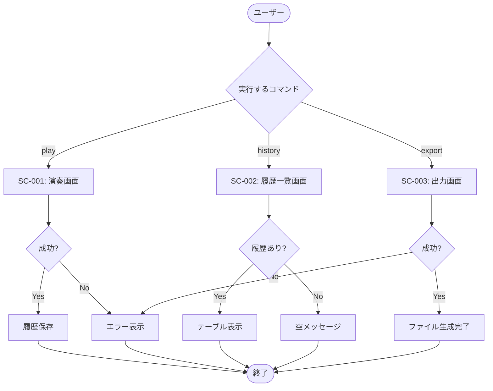

# CLIインターフェース 画面設計書

## ドキュメント情報

| 項目 | 内容 |
|------|------|
| ドキュメントID | DET-CLI-001-UI |
| バージョン | 1.0.0 |
| ステータス | レビュー待ち |
| 作成日 | 2026-01-10 |
| 最終更新日 | 2026-01-10 |
| 関連詳細設計書 | DET-CLI-001 |

## 1. 画面（サブコマンド）一覧

| 画面ID | サブコマンド | 名称 | 概要 |
|--------|-------------|------|------|
| SC-001 | `play` | 演奏画面 | MMLを直接入力または履歴から指定して演奏。再生中はプログレスバーを表示。 |
| SC-002 | `history` | 履歴一覧画面 | 保存された履歴をテーブル形式で表示。 |
| SC-003 | `export` | 出力画面 | 指定した履歴をWAVファイルとして出力。完了メッセージを表示。 |

## 2. 画面遷移図



## 3. 画面詳細

### 3.1 SC-001: 演奏画面（playサブコマンド）

#### 3.1.1 画面概要

| 項目 | 内容 |
|------|------|
| 画面ID | SC-001 |
| サブコマンド | `play` |
| 認証 | 不要 |
| 入力方式 | コマンドライン引数 |

#### 3.1.2 コマンド構文

```bash
# 構文
sine-mml play [MML] [OPTIONS]
sine-mml play --history-id <ID> [OPTIONS]

# オプション
  -w, --waveform <TYPE>     波形タイプ [default: sine] [possible values: sine, sawtooth, square]
  -v, --volume <FLOAT>      音量 (0.0 - 1.0) [default: 0.5]
  -b, --bpm <INT>           テンポ (30 - 300) [default: 120]
      --loop                ループ再生
      --metronome           メトロノーム音を追加
  -h, --help                ヘルプを表示
```

#### 3.1.3 出力形式（正常系）

**ケース1: 直接MML入力**

| フィールド | 形式 | 例 |
|-----------|------|-----|
| 演奏開始メッセージ | `Playing: <MML>` | `Playing: O4 C D E F G A B` |
| プログレスバー | `[バー] パーセント (経過時間 / 総時間) BPM: <BPM>` | `[████████████░░░░░░░░] 60% (00:03 / 00:05) BPM: 120` |
| 完了メッセージ | `✓ 再生完了（履歴ID: <ID>）` | `✓ 再生完了（履歴ID: 42）` |

**出力例**

```
Playing: O4 C D E F G A B
[████████████████████] 100% (00:05 / 00:05) BPM: 120
✓ 再生完了（履歴ID: 42）
```

**ケース2: 履歴ID指定**

```
Playing: O4 C D E F G A B
[████████████████████] 100% (00:05 / 00:05) BPM: 120
✓ 再生完了
```

**ケース3: ループ再生**

```
Playing: O4 C D E F G A B
ループ再生中（Ctrl+Cで停止）
[再生継続中...]
^C
✓ 再生を停止しました
```

#### 3.1.4 出力形式（異常系）

**ケース1: 引数不足**

```
Error: [CLI-E001] Invalid argument combination

play コマンドでは、MML文字列または --history-id のいずれか一方のみを指定してください。

使用例:
  sine-mml play "O4 C D E F"
  sine-mml play --history-id 5
```

**ケース2: パースエラー**

```
Error: MML parse error

O4 C D X F G
       ^
[MML-E003] 位置 7: 不明な文字 'X' が見つかりました

ヒント: MML仕様に含まれる文字のみを使用してください。
有効な音符: C, D, E, F, G, A, B
```

**ケース3: 履歴ID不存在**

```
Error: [CLI-E002] 履歴ID 999 が見つかりません

ヒント: 履歴一覧は `sine-mml history` で確認できます
```

**ケース4: 音量範囲外**

```
Error: [CLI-E005] 音量は 0.0 〜 1.0 の範囲で指定してください（指定値: 1.5）
```

**ケース5: BPM範囲外**

```
Error: [CLI-E006] BPMは 30 〜 300 の範囲で指定してください（指定値: 400）
```

#### 3.1.5 プログレスバー仕様

| 要素 | 説明 | 表示形式 |
|------|------|---------|
| バー | 再生進捗を視覚的に表示 | `█`（進行済み）、`░`（未進行） |
| パーセント | 進捗率 | `0%` 〜 `100%` |
| 経過時間 | 再生開始からの時間 | `MM:SS` 形式 |
| 総時間 | 総再生時間 | `MM:SS` 形式 |
| BPM表示 | 現在のテンポ | `BPM: <数値>` |
| 幅 | 40文字 | 固定幅 |
| 更新頻度 | 60 fps | 16ms間隔 |

#### 3.1.6 カラースキーム

| 要素 | 色 | 用途 |
|------|-----|------|
| "Playing:" メッセージ | Cyan | 再生開始の通知 |
| プログレスバー（進行部） | Cyan | 進捗の視覚化 |
| プログレスバー（未進行部） | Blue（暗） | 残り部分の表示 |
| 成功メッセージ（✓） | Green Bold | 処理成功 |
| ループメッセージ | Yellow | 警告・注意 |

#### 3.1.7 インタラクション

| 操作 | タイミング | 動作 |
|------|-----------|------|
| コマンド実行 | - | 引数検証 → 再生開始 |
| 再生中 | リアルタイム | プログレスバー更新 |
| Ctrl+C | ループ再生中のみ | 再生停止、正常終了 |
| 再生完了 | 自動 | 履歴保存 → 完了メッセージ |

---

### 3.2 SC-002: 履歴一覧画面（historyサブコマンド）

#### 3.2.1 画面概要

| 項目 | 内容 |
|------|------|
| 画面ID | SC-002 |
| サブコマンド | `history` |
| 認証 | 不要 |
| 入力方式 | 引数なし |

#### 3.2.2 コマンド構文

```bash
# 構文
sine-mml history

# オプション
  -h, --help    ヘルプを表示
```

#### 3.2.3 出力形式（正常系）

**テーブル構造**

| カラム名 | データ型 | 説明 | 最大幅 |
|---------|---------|------|-------|
| ID | 整数 | 履歴ID | 5文字 |
| 作成日時 | 文字列 | YYYY-MM-DD HH:MM:SS 形式 | 19文字 |
| MML | 文字列 | MML文字列（50文字で切り詰め） | 50文字 |
| 波形 | 文字列 | sine / sawtooth / square | 10文字 |
| 音量 | 小数 | 0.0 〜 1.0（小数点1桁） | 4文字 |
| BPM | 整数 | 30 〜 300 | 3文字 |

**出力例（履歴あり）**

> 以下はcomfy-tableライブラリが生成するテーブルの内容例です（実際の表示はUTF-8罫線で囲まれます）

| ID | 作成日時 | MML | 波形 | 音量 | BPM |
|:---|:---|:---|:---|:---|:---|
| 1 | 2026-01-10 10:30:15 | O4 C D E F G A B | sine | 0.5 | 120 |
| 2 | 2026-01-10 10:35:42 | T140 L4 C E G >C <G E C | sawtooth | 0.7 | 140 |
| 3 | 2026-01-10 11:20:03 | O3 L8 C C D D E E D2 C C B B A A G2 | square | 0.6 | 100 |
| 4 | 2026-01-10 14:45:30 | T180 O5 C4 D8 E8 F4 G2 A4 B8 >C8... | sine | 0.8 | 180 |

**出力例（履歴なし）**

```
履歴はありません
```

#### 3.2.4 テーブル表示仕様

| 要素 | 仕様 |
|------|------|
| 罫線 | UTF-8罫線文字（comfy-tableが自動生成） |
| ヘッダー | Cyan Bold |
| データ行 | 通常色 |
| MML切り詰め | 50文字を超える場合は末尾を `...` に置換 |
| 日時表示 | `YYYY-MM-DD HH:MM:SS` 形式（UTC → ローカルタイム変換） |
| 音量表示 | 小数点1桁（例: `0.5`） |
| ソート順 | ID降順（最新が上） |

#### 3.2.5 カラースキーム

| 要素 | 色 | 用途 |
|------|-----|------|
| テーブルヘッダー | Cyan Bold | カラム名の強調 |
| テーブル罫線 | Default | 構造の可視化 |
| データ行 | Default | 通常データ |
| 空メッセージ | White | 情報表示 |

---

### 3.3 SC-003: 出力画面（exportサブコマンド）

#### 3.3.1 画面概要

| 項目 | 内容 |
|------|------|
| 画面ID | SC-003 |
| サブコマンド | `export` |
| 認証 | 不要 |
| 入力方式 | コマンドライン引数 |

#### 3.3.2 コマンド構文

```bash
# 構文
sine-mml export --history-id <ID> --output <PATH>

# 必須オプション
      --history-id <ID>      出力対象の履歴ID
  -o, --output <PATH>        出力先ファイルパス

# その他オプション
  -h, --help                 ヘルプを表示
```

#### 3.3.3 出力形式（正常系）

| フィールド | 形式 | 例 |
|-----------|------|-----|
| 開始メッセージ | `Exporting to <PATH>...` | `Exporting to output.wav...` |
| プログレスバー | `[バー] パーセント (現在フレーム/総フレーム frames)` | `[████████████████████] 100% (44100/44100 frames)` |
| 完了メッセージ | `✓ 出力完了: <PATH>` | `✓ 出力完了: output.wav` |

**出力例**

```
Exporting to output.wav...
[████████████████████] 100% (44100/44100 frames)
✓ 出力完了: output.wav
```

#### 3.3.4 出力形式（異常系）

**ケース1: 必須引数不足**

```
Error: [CLI-E003] 必須引数が不足しています

export コマンドでは --history-id と --output の両方が必須です

使用例:
  sine-mml export --history-id 5 --output result.wav
```

**ケース2: 履歴ID不存在**

```
Error: [CLI-E002] 履歴ID 999 が見つかりません

ヒント: 履歴一覧は `sine-mml history` で確認できます
```

**ケース3: ファイル書き込みエラー**

```
Error: [CLI-E004] ファイル /invalid/path/output.wav への書き込みに失敗しました

ヒント: 出力先のパスが存在し、書き込み権限があることを確認してください
```

#### 3.3.5 プログレスバー仕様

| 要素 | 説明 | 表示形式 |
|------|------|---------|
| バー | エクスポート進捗を視覚的に表示 | `█`（完了）、`░`（未完了） |
| パーセント | 進捗率 | `0%` 〜 `100%` |
| 現在フレーム | 書き込み済みサンプル数 | 整数 |
| 総フレーム | 総サンプル数 | 整数 |
| 単位 | フレーム単位 | `frames` |
| 幅 | 40文字 | 固定幅 |
| 更新頻度 | リアルタイム | ファイル書き込みに同期 |

#### 3.3.6 カラースキーム

| 要素 | 色 | 用途 |
|------|-----|------|
| "Exporting to" メッセージ | Cyan | エクスポート開始の通知 |
| プログレスバー（完了部） | Cyan | 進捗の視覚化 |
| プログレスバー（未完了部） | Blue（暗） | 残り部分の表示 |
| 成功メッセージ（✓） | Green Bold | 処理成功 |

#### 3.3.7 インタラクション

| 操作 | タイミング | 動作 |
|------|-----------|------|
| コマンド実行 | - | 引数検証 → エクスポート開始 |
| エクスポート中 | リアルタイム | プログレスバー更新 |
| 書き込み完了 | 自動 | 完了メッセージ表示 |

---

## 4. 共通UI要素

### 4.1 ヘルプメッセージ

**メインヘルプ**

```
MML文字列を音声合成して再生するCLIツール

Usage: sine-mml <COMMAND>

Commands:
  play     MMLを演奏する
  history  演奏履歴を表示する
  export   履歴をWAVファイルとして出力する
  help     このメッセージまたは各サブコマンドのヘルプを表示

Options:
  -h, --help     ヘルプを表示
  -V, --version  バージョン情報を表示
```

**playサブコマンドヘルプ**

```
MMLを演奏する

Usage: sine-mml play [MML] [OPTIONS]
       sine-mml play --history-id <ID> [OPTIONS]

Arguments:
  [MML]  MML文字列（履歴IDと排他）

Options:
      --history-id <ID>         履歴IDから再生
  -w, --waveform <TYPE>         波形タイプ [default: sine] [possible values: sine, sawtooth, square]
  -v, --volume <FLOAT>          音量 (0.0 - 1.0) [default: 0.5]
  -b, --bpm <INT>               テンポ (30 - 300) [default: 120]
      --loop                    ループ再生
      --metronome               メトロノーム音を追加
  -h, --help                    ヘルプを表示

Examples:
  sine-mml play "O4 C D E F"
  sine-mml play --history-id 5 --loop
  sine-mml play "T120 L4 C E G" -w square -v 0.8
```

### 4.2 バージョン情報

```
sine-mml 0.1.0
```

### 4.3 エラーメッセージ共通フォーマット

```
Error: [エラーコード] エラータイトル

詳細メッセージ

ヒント: 問題解決のための助言
```

### 4.4 成功メッセージ共通フォーマット

```
✓ 処理完了メッセージ
```

---

## 5. アクセシビリティ要件

### 5.1 カラー出力制御

| 環境変数 | 値 | 動作 |
|---------|-----|------|
| `NO_COLOR` | 任意 | カラー出力を無効化 |
| `TERM` | `dumb` | カラー出力を無効化 |
| 標準出力 | リダイレクト時 | 自動的にカラー無効化 |

### 5.2 プログレスバー制御

| 環境 | 動作 |
|------|------|
| インタラクティブ端末 | プログレスバー表示 |
| パイプ・リダイレクト | プログレスバー非表示、完了メッセージのみ |
| CI/CD環境 | プログレスバー非表示 |

---

## 6. 画面遷移一覧

| 開始画面 | 操作 | 遷移先 | 条件 |
|---------|------|--------|------|
| - | `sine-mml play "MML"` | SC-001（演奏画面） | - |
| - | `sine-mml history` | SC-002（履歴一覧画面） | - |
| - | `sine-mml export ...` | SC-003（出力画面） | - |
| SC-001 | 再生完了 | 終了 | 成功時 |
| SC-001 | エラー発生 | 終了（コード1） | エラー時 |
| SC-002 | テーブル表示完了 | 終了 | - |
| SC-003 | エクスポート完了 | 終了 | 成功時 |
| SC-003 | エラー発生 | 終了（コード1） | エラー時 |

---

## 7. 出力例集

### 7.1 play - 成功例（各波形）

**サイン波**
```
$ sine-mml play "O4 C D E F" -w sine
Playing: O4 C D E F
[████████████████████] 100% (00:02 / 00:02) BPM: 120
✓ 再生完了（履歴ID: 1）
```

**ノコギリ波**
```
$ sine-mml play "O4 C D E F" -w sawtooth -v 0.7
Playing: O4 C D E F
[████████████████████] 100% (00:02 / 00:02) BPM: 120
✓ 再生完了（履歴ID: 2）
```

**矩形波**
```
$ sine-mml play "O4 C D E F" -w square -b 180
Playing: O4 C D E F
[████████████████████] 100% (00:01 / 00:01) BPM: 180
✓ 再生完了（履歴ID: 3）
```

### 7.2 play - ループ再生

```
$ sine-mml play "O4 C E G" --loop
Playing: O4 C E G
ループ再生中（Ctrl+Cで停止）
[再生継続中...]
^C
✓ 再生を停止しました
```

### 7.3 history - 複数件表示

```
$ sine-mml history
```

> 以下はcomfy-tableが生成するテーブルの内容例（実際はUTF-8罫線で囲まれる）

| ID | 作成日時 | MML | 波形 | 音量 | BPM |
|:---|:---|:---|:---|:---|:---|
| 5 | 2026-01-10 15:20:42 | O5 C D E F G A B >C | sine | 0.5 | 120 |
| 4 | 2026-01-10 14:45:30 | T180 O5 C4 D8 E8 F4 G2 A4 B8 >C8... | sine | 0.8 | 180 |
| 3 | 2026-01-10 11:20:03 | O3 L8 C C D D E E D2 C C B B A A G2 | square | 0.6 | 100 |
| 2 | 2026-01-10 10:35:42 | T140 L4 C E G >C <G E C | sawtooth | 0.7 | 140 |
| 1 | 2026-01-10 10:30:15 | O4 C D E F G A B | sine | 0.5 | 120 |

### 7.4 export - 成功例

```
$ sine-mml export --history-id 3 -o melody.wav
Exporting to melody.wav...
[████████████████████] 100% (88200/88200 frames)
✓ 出力完了: melody.wav
```

---

## 変更履歴

| 日付 | バージョン | 変更内容 | 担当者 |
|:---|:---|:---|:---|
| 2026-01-10 | 1.0.0 | 初版作成 | Antigravity |
