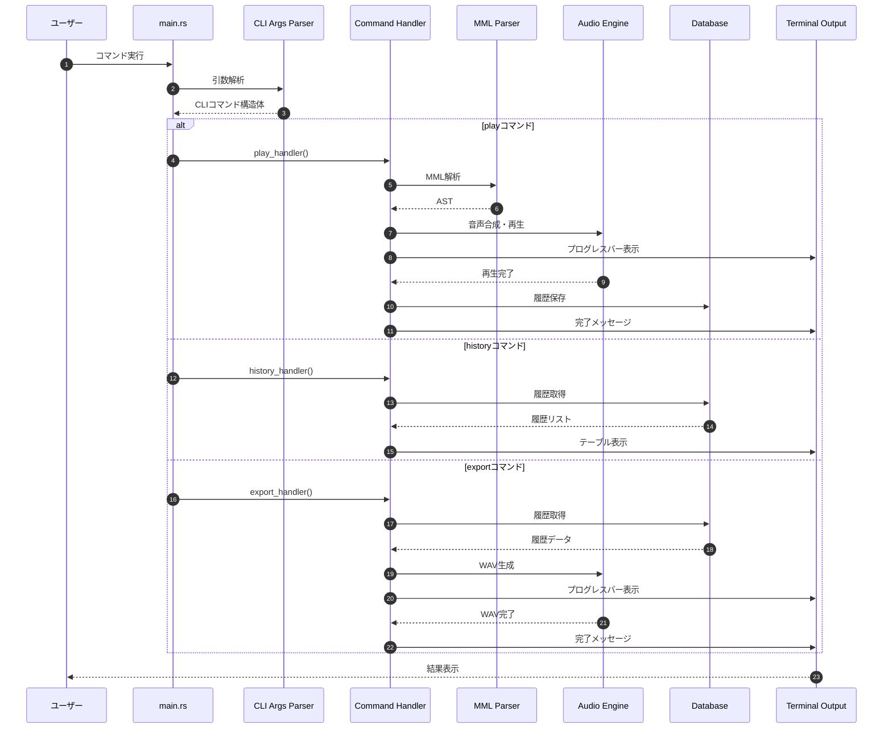
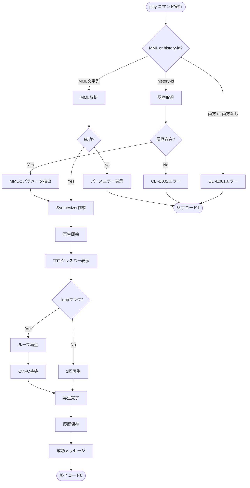
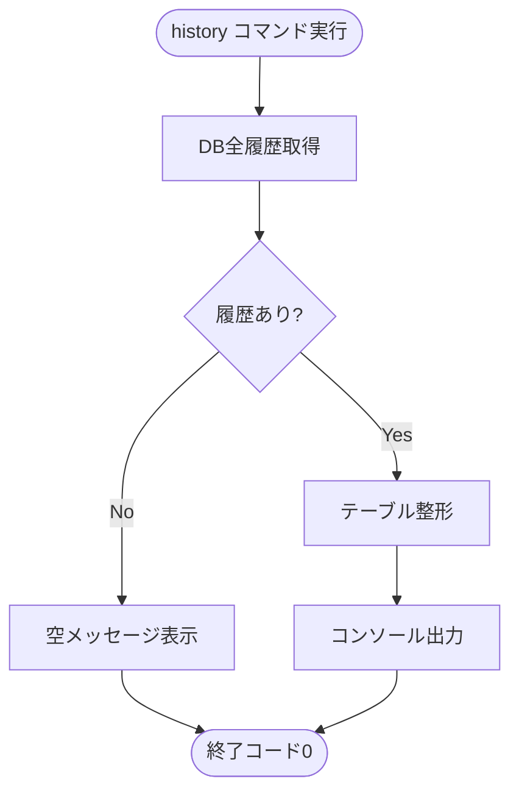
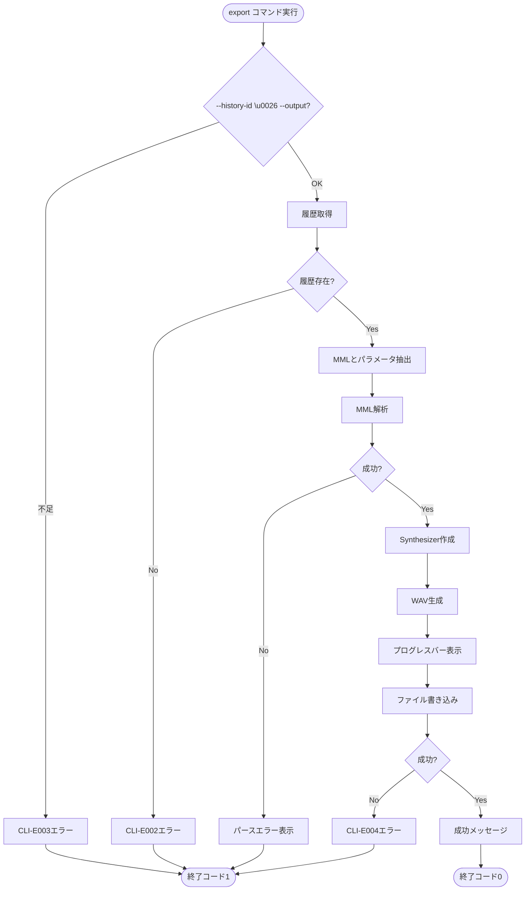

# CLIインターフェース 詳細設計書

## メタ情報

| 項目 | 内容 |
|------|------|
| ドキュメントID | DET-CLI-001 |
| バージョン | 1.0.0 |
| ステータス | レビュー待ち |
| 作成日 | 2026-01-10 |
| 最終更新日 | 2026-01-10 |
| 親機能 | CLIインターフェース |
| 含まれる機能ID | F-002, F-003, F-004, F-005, F-006, F-007, F-008, F-009, F-010, F-011, F-013 |
| 関連基本設計書 | BASIC-CLI-001 |
| 関連要件定義書 | REQ-CLI-001 |

## 1. 概要

CLIインターフェースは、sine-mmlアプリケーションのフロントエンド層として、ユーザーとの対話を担当するコンポーネントです。コマンドライン引数の解析、エラー表示、プログレスバー表示、履歴テーブル表示など、すべてのユーザー向け出力を制御します。

### 1.1 処理フロー概要



### 1.2 設計方針

| 方針 | 内容 |
|------|------|
| CLIフレームワーク | clap 4.5の派生マクロ（derive API）を使用 |
| サブコマンド構造 | play, history, exportの3つのサブコマンド |
| プログレス表示 | indicatif 0.18によるプログレスバーとスピナー |
| カラー表示 | console crateによる色付き出力（エラーは赤、成功は緑） |
| エラー表示 | 位置情報を含む詳細なエラーメッセージ |
| 終了コード | 成功時0、エラー時1 |

## 2. 機能要件

### 2.1 対象機能

| 機能ID | 機能名 | 概要 | 優先度 |
|--------|--------|------|--------|
| F-002 | リアルタイム再生 | play サブコマンドで音声を再生 | 必須 |
| F-003 | 波形選択 | --waveform オプションで波形を選択 | 必須 |
| F-004 | 音量調節 | --volume オプションで音量を調整 | 必須 |
| F-005 | BPM調節 | --bpm オプションでテンポを調整 | 必須 |
| F-006 | ループ再生 | --loop フラグでループ再生 | 必須 |
| F-007 | 履歴自動保存 | play 成功時にDBに自動保存 | 必須 |
| F-008 | 履歴一覧表示 | history サブコマンドで一覧を表示 | 必須 |
| F-009 | 履歴再生 | --history-id で過去の演奏を再生 | 必須 |
| F-010 | WAVエクスポート | export サブコマンドでWAV出力 | 必須 |
| F-011 | エラー通知 | パースエラーを位置情報付きで表示 | 必須 |
| F-013 | 再生アニメーション | 再生中のプログレスバー表示 | 低 |

### 2.2 ビジネスルール

| ルールID | 内容 |
|---------|------|
| BR-CLI-001 | play サブコマンドでは、MML文字列または --history-id のいずれか一方が必須 |
| BR-CLI-002 | --history-id と MML文字列の同時指定はエラー |
| BR-CLI-003 | export サブコマンドでは --history-id と --output の両方が必須 |
| BR-CLI-004 | 存在しない --history-id を指定した場合はエラー |
| BR-CLI-005 | --volume の範囲は 0.0〜1.0、範囲外はエラー |
| BR-CLI-006 | --bpm の範囲は 30〜300、範囲外はエラー |
| BR-CLI-007 | 出力ファイルが既に存在する場合は上書き確認なしで上書き |

## 3. 設計書一覧

| 設計書 | パス | 説明 |
|--------|------|------|
| バックエンド設計書 | [./バックエンド設計書.md](./バックエンド設計書.md) | Rust型定義とAPI仕様 |
| 画面設計書 | [./画面設計書.md](./画面設計書.md) | 各サブコマンドの出力仕様 |

## 4. 共通設計への参照

| 設計書 | パス |
|--------|------|
| MMLパーサー設計 | [../mml-parser/詳細設計書.md](../mml-parser/詳細設計書.md) |
| データベース設計 | [../database/詳細設計書.md](../database/詳細設計書.md) |
| オーディオエンジン設計 | [../audio-engine/詳細設計書.md](../audio-engine/詳細設計書.md) |

## 5. コマンドフロー設計

### 5.1 playコマンドフロー



### 5.2 historyコマンドフロー



### 5.3 exportコマンドフロー



## 6. エラーコード一覧

| コード | 説明 | 対処方法 |
|--------|------|------------|
| CLI-E001 | 引数の組み合わせが不正 | play コマンドでは MML文字列 または --history-id のいずれか一方のみを指定してください |
| CLI-E002 | 履歴IDが存在しない | 指定したIDが履歴に存在しません。`sine-mml history` で一覧を確認してください |
| CLI-E003 | 必須引数が不足 | export コマンドでは --history-id と --output の両方が必須です |
| CLI-E004 | ファイル書き込みエラー | 出力先のパスが不正、または書き込み権限がありません |
| CLI-E005 | 音量範囲外 | --volume は 0.0 〜 1.0 の範囲で指定してください |
| CLI-E006 | BPM範囲外 | --bpm は 30 〜 300 の範囲で指定してください |
| CLI-E007 | 不正な波形指定 | --waveform は sine, sawtooth, square のいずれかを指定してください |

## 7. 出力スタイル設計

### 7.1 カラー定義

| 要素 | 色 | 用途 |
|------|-----|------|
| 成功メッセージ | Green (console::style::green) | 処理成功時 |
| エラーメッセージ | Red (console::style::red) | エラー発生時 |
| 警告メッセージ | Yellow (console::style::yellow) | 警告表示時 |
| プログレスバー | Cyan (console::style::cyan) | 進捗表示 |
| ヘッダー | Bold White | テーブルヘッダー |
| 通常テキスト | Default | 通常の出力 |

### 7.2 プログレスバー設計

**再生中プログレスバー**

```
Playing: O4 C D E F G...
[████████████░░░░░░░░] 60% (00:03 / 00:05) BPM: 120
```

**エクスポート中プログレスバー**

```
Exporting to output.wav...
[████████████████████] 100% (1024/1024 frames)
✓ Successfully exported to output.wav
```

### 7.3 indicatif設定

| 設定項目 | 値 |
|---------|-----|
| プログレスバーテンプレート | `{msg}\n[{bar:40.cyan/blue}] {percent}% ({pos}/{len})` |
| スピナーテンプレート | `{spinner:.green} {msg}` |
| バー文字 | `█` (filled), `░` (empty) |
| 更新頻度 | 60 fps (16ms間隔) |

## 8. 統合フロー

### 8.1 main.rsの責務

```mermaid
flowchart TD
    Start([プログラム開始]) --> ParseArgs[clap引数解析]
    ParseArgs --> Match{サブコマンド判定}
    
    Match -->|play| PlayHandler[play_handler呼び出し]
    Match -->|history| HistoryHandler[history_handler呼び出し]
    Match -->|export| ExportHandler[export_handler呼び出し]
    
    PlayHandler --> Result{Result\u003c()\u003e?}
    HistoryHandler --> Result
    ExportHandler --> Result
    
    Result -->|Ok| Exit0([終了コード0])
    Result -->|Err| DisplayErr[エラー表示]
    DisplayErr --> Exit1([終了コード1])
```

### 8.2 モジュール連携

| 呼び出し元 | 呼び出し先 | インターフェース |
|-----------|-----------|----------------|
| CLI | MML Parser | `parse(mml: &str) -> Result<Mml, ParseError>` |
| CLI | Database | `save_history(...) -> Result<i64>` |
| CLI | Database | `get_history(id: i64) -> Result<HistoryRecord>` |
| CLI | Database | `list_history() -> Result<Vec<HistoryRecord>>` |
| CLI | Audio Engine | `synthesize(ast: &Mml, options: &SynthOptions) -> Result<AudioBuffer>` |
| CLI | Audio Engine | `play(buffer: &AudioBuffer, loop: bool) -> Result<()>` |
| CLI | WAV Exporter | `export_wav(buffer: &AudioBuffer, path: &Path) -> Result<()>` |

## 9. エラー表示仕様

### 9.1 パースエラー表示例

```
Error: MML parse error

O4 C D X F G
       ^
[MML-E003] 位置 7: 不明な文字 'X' が見つかりました

ヒント: MML仕様に含まれる文字のみを使用してください。
有効な音符: C, D, E, F, G, A, B
```

### 9.2 CLIエラー表示例

```
Error: [CLI-E001] Invalid argument combination

play コマンドでは、MML文字列または --history-id のいずれか一方のみを指定してください。

使用例:
  sine-mml play "O4 C D E F"
  sine-mml play --history-id 5
```

### 9.3 エラー表示フォーマット

| 要素 | 形式 | 説明 |
|------|------|------|
| タイトル | `Error: [エラーコード] タイトル` | 赤色太字 |
| コンテキスト | MML文字列 + ポインタ | パースエラー時のみ |
| メッセージ | エラー詳細 | 通常色 |
| ヒント | `ヒント: ...` | 黄色、問題解決のための助言 |
| 使用例 | `使用例:\n  ...` | 緑色、正しいコマンド例 |

## 10. パフォーマンス要件

| 項目 | 要件 |
|------|------|
| 起動時間 | 50ms以内（引数解析完了まで） |
| プログレスバー更新 | 60 fps (16ms間隔) |
| history コマンド | 1000件の履歴を100ms以内で表示 |
| エラー表示 | 即座に表示（遅延なし） |

## 11. テスト戦略

### 11.1 ユニットテスト項目

| テストケース | 検証内容 |
|-------------|---------|
| 引数解析（正常系） | 各サブコマンドのオプションが正しく解析される |
| 引数解析（異常系） | 不正なオプション組み合わせがエラーになる |
| 範囲検証 | --volume, --bpm の範囲外がエラーになる |
| カラー出力 | console crateによる色付けが正しく動作する |

### 11.2 統合テスト項目

| テストケース | 入力 | 期待される動作 |
|-------------|------|---------------|
| playコマンド（直接MML） | `sine-mml play "C D E"` | 音声が再生され、履歴が保存される |
| playコマンド（履歴ID） | `sine-mml play --history-id 1` | 履歴が再生される |
| historyコマンド | `sine-mml history` | 履歴一覧が表示される |
| exportコマンド | `sine-mml export --history-id 1 -o out.wav` | WAVファイルが生成される |
| エラーハンドリング | 不正なMML入力 | エラーメッセージが表示され、終了コード1 |

### 11.3 E2Eテスト項目

| シナリオ | ステップ |
|---------|---------|
| 新規MML演奏から履歴再生 | 1. play "C D E" → 2. history で確認 → 3. play --history-id N で再生 |
| 履歴からエクスポート | 1. play "C D E" → 2. export --history-id N -o out.wav → 3. ファイル存在確認 |
| エラーからの回復 | 1. 不正MML入力 → 2. エラー確認 → 3. 正しいMML入力 → 4. 成功 |

## 12. 関連サブ機能

- [MMLパーサー](../mml-parser/詳細設計書.md) - MML文字列の解析
- [データベース](../database/詳細設計書.md) - 履歴の保存・取得
- [オーディオエンジン](../audio-engine/詳細設計書.md) - 音声合成・再生

---

## 変更履歴

| 日付 | バージョン | 変更内容 | 担当者 |
|:---|:---|:---|:---|
| 2026-01-10 | 1.0.0 | 初版作成 | Antigravity |
