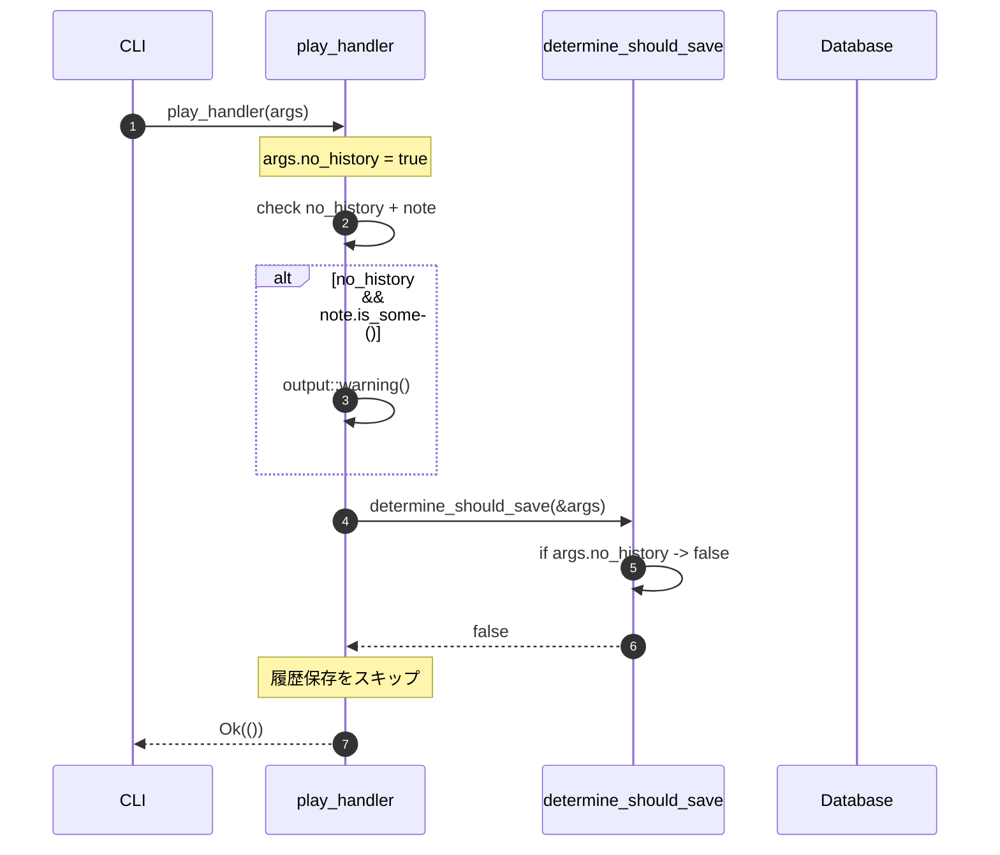
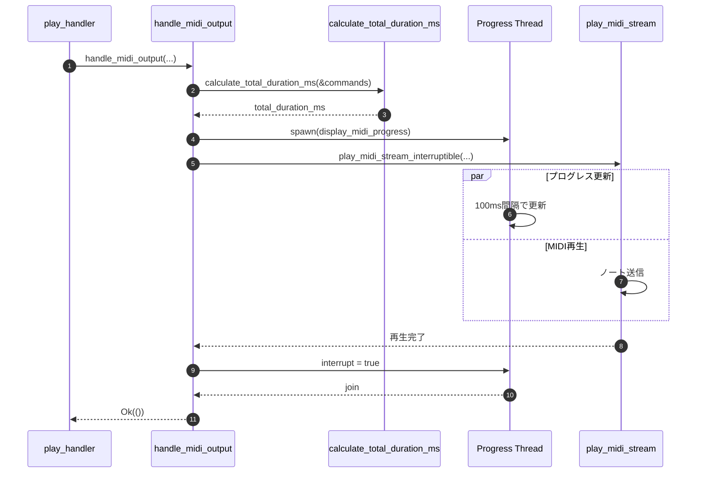

# DET-CLI-007 CLIオプションショートハンド拡充 バックエンド設計書

## 0. ドキュメント情報

| 項目 | 内容 |
|------|------|
| ドキュメントID | DET-CLI-007-002 |
| バージョン | 1.1.0 |
| ステータス | ドラフト |
| 作成日 | 2026-01-15 |
| 最終更新日 | 2026-01-15 |
| 作成者 | detailed-design-writer |
| 関連文書 | DET-CLI-007-001_詳細設計書.md<br>BASIC-CLI-007_CLI-Option-Shorthand.md (v1.2.0) |

---

## 1. 概要

本バックエンド設計書は、CLIオプションショートハンド拡充機能の実装詳細を定義する。主な変更点は以下の3つ：

1. `PlayArgs`への`no_history`フィールド追加
2. `determine_should_save()`の条件分岐修正
3. MIDI出力時のプログレスバー表示機能追加

---

## 2. モジュール詳細設計

### 2.1 src/cli/args.rs

#### 2.1.1 変更点

`PlayArgs`構造体に`no_history`フィールドを追加する。

```rust
// src/cli/args.rs

#[derive(Parser, Debug)]
pub struct PlayArgs {
    // ... 既存フィールド ...

    /// 履歴に保存しない
    #[arg(long, short = 'N', default_value_t = false)]
    pub no_history: bool,
}
```

#### 2.1.2 for_testメソッドの更新

テスト用のファクトリーメソッドを更新する。

```rust
impl PlayArgs {
    /// テスト用のファクトリーメソッド
    #[cfg(test)]
    pub fn for_test(
        mml: Option<String>,
        history_id: Option<i64>,
        file: Option<String>,
        waveform: Waveform,
        volume: f32,
        note: Option<String>,
    ) -> Self {
        Self {
            mml,
            history_id,
            file,
            waveform,
            volume,
            loop_play: false,
            metronome: false,
            metronome_beat: 4,
            metronome_volume: 0.5,
            note,
            #[cfg(feature = "midi-output")]
            midi_out: None,
            #[cfg(feature = "midi-output")]
            midi_channel: 1,
            no_history: false,  // 新規追加
        }
    }

    /// テスト用のファクトリーメソッド（no_history指定可能版）
    #[cfg(test)]
    pub fn for_test_with_no_history(
        mml: Option<String>,
        history_id: Option<i64>,
        file: Option<String>,
        waveform: Waveform,
        volume: f32,
        note: Option<String>,
        no_history: bool,
    ) -> Self {
        Self {
            mml,
            history_id,
            file,
            waveform,
            volume,
            loop_play: false,
            metronome: false,
            metronome_beat: 4,
            metronome_volume: 0.5,
            note,
            #[cfg(feature = "midi-output")]
            midi_out: None,
            #[cfg(feature = "midi-output")]
            midi_channel: 1,
            no_history,
        }
    }
}
```

#### 2.1.3 追加テストケース

```rust
#[cfg(test)]
mod tests {
    use super::*;

    #[test]
    fn test_no_history_long_flag() {
        let args = PlayArgs::try_parse_from([
            "play",
            "CDE",
            "--no-history",
        ])
        .unwrap();
        assert!(args.no_history);
    }

    #[test]
    fn test_no_history_short_flag() {
        let args = PlayArgs::try_parse_from([
            "play",
            "CDE",
            "-N",
        ])
        .unwrap();
        assert!(args.no_history);
    }

    #[test]
    fn test_no_history_default() {
        let args = PlayArgs::try_parse_from([
            "play",
            "CDE",
        ])
        .unwrap();
        assert!(!args.no_history);
    }

    #[test]
    fn test_no_history_with_midi_out() {
        let args = PlayArgs::try_parse_from([
            "play",
            "CDE",
            "--midi-out", "0",
            "--no-history",
        ])
        .unwrap();
        assert!(args.no_history);
        assert_eq!(args.midi_out, Some("0".to_string()));
    }

    #[test]
    fn test_no_history_with_loop_play() {
        let args = PlayArgs::try_parse_from([
            "play",
            "CDE",
            "--loop-play",
            "--no-history",
        ])
        .unwrap();
        assert!(args.no_history);
        assert!(args.loop_play);
    }
}
```

---

### 2.2 src/cli/handlers.rs

#### 2.2.1 determine_should_save() の変更

```rust
// 変更前
fn determine_should_save(args: &PlayArgs) -> bool {
    // Save history when MML is provided directly or from file (not from history)
    matches!(
        (&args.mml, &args.file, args.history_id),
        (Some(_), None, None) | (None, Some(_), None)
    )
}

// 変更後
fn determine_should_save(args: &PlayArgs) -> bool {
    // no_historyが指定されている場合は保存しない
    if args.no_history {
        return false;
    }

    // Save history when MML is provided directly or from file (not from history)
    matches!(
        (&args.mml, &args.file, args.history_id),
        (Some(_), None, None) | (None, Some(_), None)
    )
}
```

#### 2.2.2 警告メッセージの追加

`play_handler`関数内で、`--note`と`--no-history`の併用時に警告を表示する。

```rust
pub fn play_handler(args: PlayArgs) -> Result<()> {
    // 警告: --no-history と --note の併用
    if args.no_history && args.note.is_some() {
        output::warning("Warning: --note is ignored when --no-history is specified");
    }

    let mml_string = resolve_mml_input(&args)?;

    if let Some(ref note) = args.note {
        validate_note(note).map_err(|e| anyhow::anyhow!("[CLI-E010] {e}"))?;
    }

    let ast = mml::parse(&mml_string).map_err(|e| anyhow::anyhow!("MML parse error: {e:?}"))?;

    #[cfg(feature = "midi-output")]
    if let Some(ref device) = args.midi_out {
        return handle_midi_output(device, args.midi_channel, &mml_string, &ast, args.loop_play);
    }

    handle_audio_playback(&args, &mml_string, &ast)
}
```

#### 2.2.3 handle_midi_output() の変更

MIDI出力時のプログレスバー表示を追加する。

```rust
#[cfg(feature = "midi-output")]
fn handle_midi_output(
    device: &str,
    channel: u8,
    mml_string: &str,
    ast: &mml::Mml,
    loop_play: bool,  // 新規パラメータ
) -> Result<()> {
    use std::sync::atomic::{AtomicBool, Ordering};
    use std::sync::Arc;

    let mut conn = midi::connect_midi_device(device).map_err(|e| anyhow::anyhow!("{e}"))?;

    let interrupt = Arc::new(AtomicBool::new(false));
    let interrupt_clone = Arc::clone(&interrupt);

    ctrlc::set_handler(move || {
        interrupt_clone.store(true, Ordering::SeqCst);
    })
    .context("Ctrl+Cハンドラーの設定に失敗しました")?;

    println!("MIDI再生中... (Ctrl+Cで停止)");
    println!("  MML: {}", truncate_mml(mml_string, 50));
    println!("  デバイス: {device}");
    println!("  チャンネル: {channel}");

    if loop_play {
        // ループ再生: プログレスバーなし
        loop {
            if interrupt.load(Ordering::Relaxed) {
                break;
            }
            midi::play_midi_stream_interruptible(&mut conn, &ast.commands, channel, &interrupt)
                .map_err(|e| anyhow::anyhow!("{e}"))?;
        }
    } else {
        // 単発再生: プログレスバー付き
        let total_duration_ms = midi::calculate_total_duration_ms(&ast.commands);

        // プログレスバースレッドを起動
        let interrupt_for_progress = Arc::clone(&interrupt);
        let progress_handle = std::thread::spawn(move || {
            output::display_midi_progress(total_duration_ms, &interrupt_for_progress);
        });

        // MIDI再生実行
        midi::play_midi_stream_interruptible(&mut conn, &ast.commands, channel, &interrupt)
            .map_err(|e| anyhow::anyhow!("{e}"))?;

        // プログレスバースレッドの終了を待機
        interrupt.store(true, Ordering::SeqCst);
        let _ = progress_handle.join();
    }

    if interrupt.load(Ordering::Relaxed) && !loop_play {
        output::success("✓ MIDI再生を中断しました");
    } else if !loop_play {
        output::success("✓ MIDI再生完了");
    } else {
        output::success("✓ MIDI再生を中断しました");
    }

    Ok(())
}
```

#### 2.2.4 追加テストケース

```rust
#[cfg(test)]
mod tests {
    use super::*;

    #[test]
    fn test_determine_should_save_with_no_history() {
        let args = PlayArgs::for_test_with_no_history(
            Some("CDE".to_string()),
            None,
            None,
            Waveform::Sine,
            1.0,
            None,
            true,  // no_history = true
        );
        assert!(!determine_should_save(&args));
    }

    #[test]
    fn test_determine_should_save_without_no_history() {
        let args = PlayArgs::for_test_with_no_history(
            Some("CDE".to_string()),
            None,
            None,
            Waveform::Sine,
            1.0,
            None,
            false,  // no_history = false
        );
        assert!(determine_should_save(&args));
    }

    #[test]
    fn test_determine_should_save_history_id_with_no_history() {
        let args = PlayArgs::for_test_with_no_history(
            None,
            Some(1),
            None,
            Waveform::Sine,
            1.0,
            None,
            true,  // no_history = true
        );
        assert!(!determine_should_save(&args));
    }
}
```

---

### 2.3 src/cli/output.rs

#### 2.3.1 display_midi_progress() の追加

MIDI出力用のプログレスバー表示関数を追加する。

```rust
use std::sync::atomic::{AtomicBool, Ordering};
use std::sync::Arc;
use std::time::{Duration, Instant};

/// MIDI再生プログレスを表示し、経過時間に基づいて更新する
///
/// # Arguments
/// * `total_duration_ms` - 全体の再生時間（ミリ秒）
/// * `interrupt` - 中断フラグ
pub fn display_midi_progress(total_duration_ms: u64, interrupt: &Arc<AtomicBool>) {
    if total_duration_ms == 0 {
        return;
    }

    let pb = ProgressBar::new(100);
    if let Ok(style) = ProgressStyle::default_bar()
        .template("{spinner:.green} [{elapsed_precise}] [{bar:40.cyan/blue}] {percent}% {msg}")
    {
        pb.set_style(style.progress_chars("#>-"));
    }

    let total_duration = Duration::from_millis(total_duration_ms);
    pb.set_message(format!("{:.1}s", total_duration.as_secs_f64()));

    let start = Instant::now();
    let update_interval = Duration::from_millis(100); // 10Hz

    while !interrupt.load(Ordering::Relaxed) {
        let elapsed = start.elapsed();
        if elapsed >= total_duration {
            break;
        }

        let progress = (elapsed.as_millis() * 100 / total_duration.as_millis()) as u64;
        pb.set_position(progress.min(100));

        std::thread::sleep(update_interval);
    }

    pb.finish_with_message("Done");
}
```

---

### 2.4 src/midi/player.rs

#### 2.4.1 calculate_total_duration_ms() の追加

MMLコマンド列の全体再生時間を計算する関数を追加する。

```rust
/// MMLコマンド列の全体再生時間を計算する（ミリ秒）
///
/// # Arguments
/// * `commands` - MMLコマンドのスライス
///
/// # Returns
/// 全体の再生時間（ミリ秒）
pub fn calculate_total_duration_ms(commands: &[Command]) -> u64 {
    let mut state = PlaybackState::default();
    let total_secs = calculate_duration_recursive(commands, &mut state);

    #[allow(clippy::cast_possible_truncation, clippy::cast_sign_loss)]
    let total_ms = (total_secs * 1000.0) as u64;
    total_ms
}

fn calculate_duration_recursive(commands: &[Command], state: &mut PlaybackState) -> f32 {
    let mut total = 0.0;

    for cmd in commands {
        state.update_state(cmd);

        match cmd {
            Command::Note(note) => {
                total += note.duration_in_seconds(state.bpm, state.default_length);
            }
            Command::Rest(rest) => {
                total += rest.duration_in_seconds(state.bpm, state.default_length);
            }
            Command::Tuplet(tuplet) => {
                let base_len = tuplet.base_duration.unwrap_or(state.default_length);
                let beats_per_tuplet = 4.0 / f32::from(base_len);
                let seconds_per_tuplet = beats_per_tuplet * (60.0 / f32::from(state.bpm));
                total += seconds_per_tuplet;
            }
            Command::Chord(chord) => {
                // コード内の最長ノートの時間
                let max_duration = chord
                    .notes
                    .iter()
                    .map(|n| n.duration_in_seconds(state.bpm, state.default_length))
                    .fold(0.0_f32, f32::max);
                total += max_duration;
            }
            _ => {}
        }
    }

    total
}
```

#### 2.4.2 mod.rsへのエクスポート追加

```rust
// src/midi/mod.rs

pub use player::calculate_total_duration_ms;
```

#### 2.4.3 テストケース

```rust
#[cfg(test)]
mod tests {
    use super::*;
    use crate::mml::parse;

    #[test]
    fn test_calculate_total_duration_ms_simple() {
        // T120 (BPM=120), L4 (四分音符), 4音符 = 2秒 = 2000ms
        let ast = parse("T120 L4 CDEF").unwrap();
        let duration = calculate_total_duration_ms(&ast.commands);
        // 四分音符 * 4 = 4 beats = 2秒 (at 120BPM)
        assert!((duration as i64 - 2000).abs() < 100); // 100ms誤差許容
    }

    #[test]
    fn test_calculate_total_duration_ms_with_rest() {
        // T120, L4, C R C = 1.5秒 = 1500ms
        let ast = parse("T120 L4 CRC").unwrap();
        let duration = calculate_total_duration_ms(&ast.commands);
        assert!((duration as i64 - 1500).abs() < 100);
    }

    #[test]
    fn test_calculate_total_duration_ms_empty() {
        let duration = calculate_total_duration_ms(&[]);
        assert_eq!(duration, 0);
    }

    #[test]
    fn test_calculate_total_duration_ms_tempo_change() {
        // T60 C = 1秒, T120 C = 0.5秒 = 合計1.5秒
        let ast = parse("T60 L4 C T120 C").unwrap();
        let duration = calculate_total_duration_ms(&ast.commands);
        assert!((duration as i64 - 1500).abs() < 100);
    }

    #[test]
    fn test_calculate_total_duration_ms_with_chord() {
        // T120, L4, [CEG] = コードは最長ノート時間 = 0.5秒 = 500ms
        let ast = parse("T120 L4 [CEG]").unwrap();
        let duration = calculate_total_duration_ms(&ast.commands);
        assert!((duration as i64 - 500).abs() < 100);
    }

    #[test]
    fn test_calculate_total_duration_ms_with_tuplet() {
        // T120, 3連符{CDE}4 = 四分音符1つ分 = 0.5秒 = 500ms
        let ast = parse("T120 {CDE}4").unwrap();
        let duration = calculate_total_duration_ms(&ast.commands);
        assert!((duration as i64 - 500).abs() < 100);
    }

    #[test]
    fn test_calculate_total_duration_ms_complex() {
        // 複雑なMML: T120 C [CEG] R {DEF}4 = 0.5 + 0.5 + 0.5 + 0.5 = 2.0秒 = 2000ms
        let ast = parse("T120 L4 C [CEG] R {DEF}4").unwrap();
        let duration = calculate_total_duration_ms(&ast.commands);
        assert!((duration as i64 - 2000).abs() < 150);
    }
}
```

---

## 3. 処理シーケンス

### 3.1 履歴スキップ処理



### 3.2 MIDI出力時のプログレスバー処理



---

## 4. エラーケース

### 4.1 エラーハンドリングフロー

| ケース | 処理 | 結果 |
|--------|------|------|
| MIDI接続失敗 | エラーメッセージ表示 | Err返却 |
| Ctrl+C割り込み | プログレス停止、Notes Off送信 | Ok返却 |
| MMLパースエラー | エラーメッセージ表示 | Err返却 |

---

## 5. 依存関係

### 5.1 新規追加なし

本機能では新規クレートの追加なし。既存の`indicatif`クレートを使用する。

```toml
# Cargo.toml (変更なし)
[dependencies]
indicatif = "0.18.3"
```

---

## 6. 変更履歴

| バージョン | 日付 | 変更内容 | 担当者 |
|-----------|------|----------|--------|
| 1.0.0 | 2026-01-15 | 初版作成 | detailed-design-writer |
| 1.1.0 | 2026-01-15 | レビュー指摘対応: autonumber追加（§3.1, §3.2）、テストケース追加（Chord、Tuplet、複雑MML） | detailed-design-writer |
