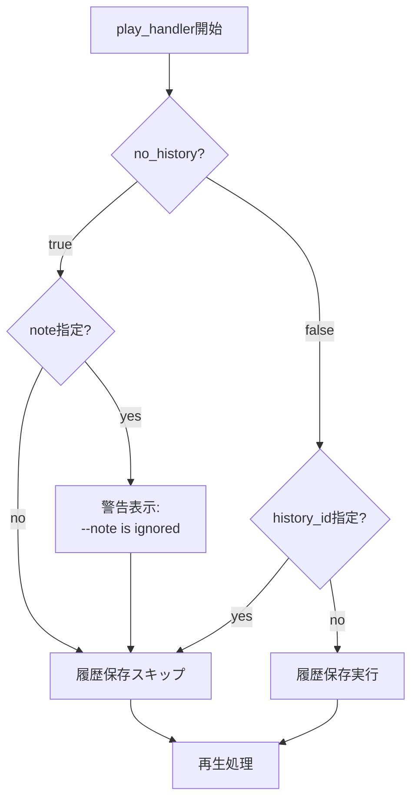
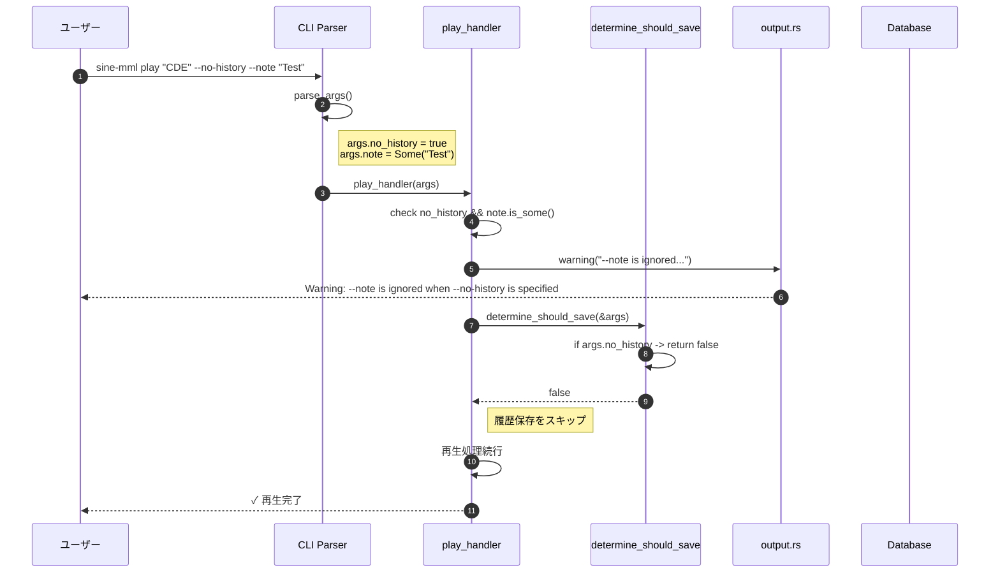
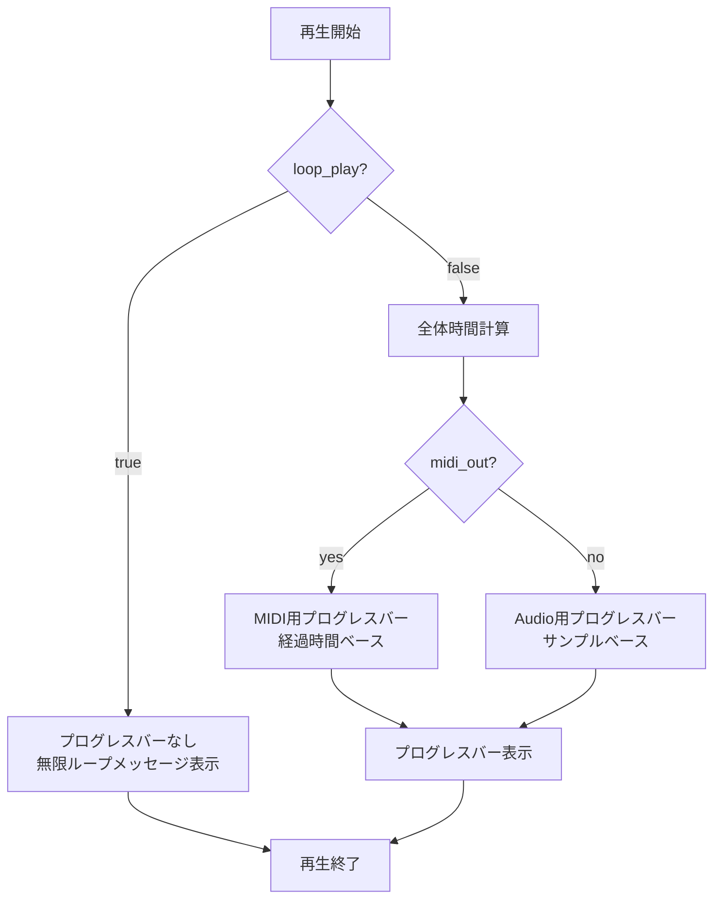
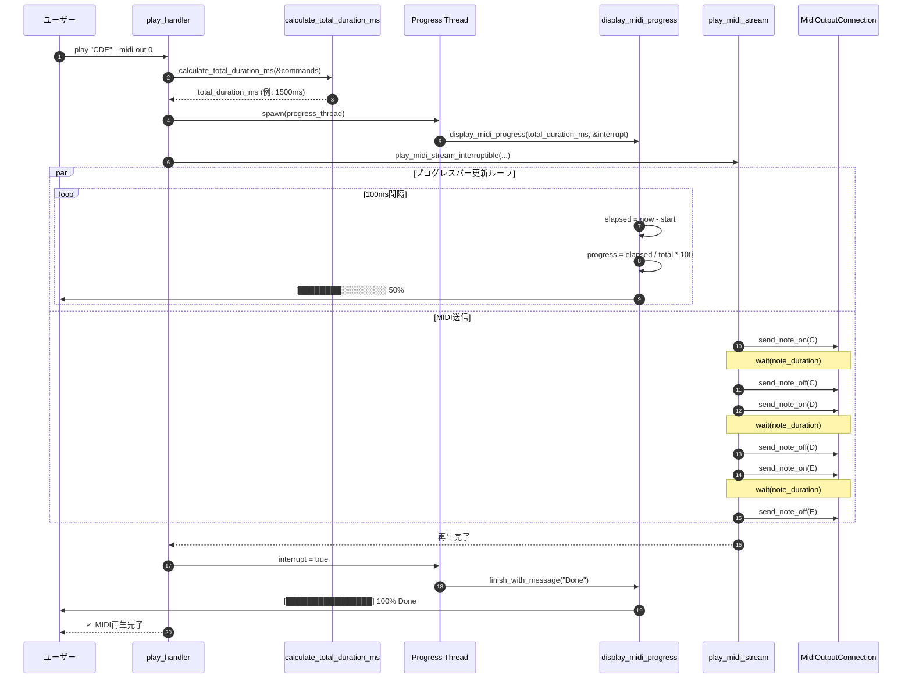

# DET-CLI-007 CLIオプションショートハンド拡充 詳細設計書

## 0. ドキュメント情報

| 項目 | 内容 |
|------|------|
| ドキュメントID | DET-CLI-007-001 |
| バージョン | 1.1.0 |
| ステータス | ドラフト |
| 作成日 | 2026-01-15 |
| 最終更新日 | 2026-01-15 |
| 作成者 | detailed-design-writer |
| 関連文書 | REQ-CLI-007_CLI-Option-Shorthand.md (v1.0.2)<br>BASIC-CLI-007_CLI-Option-Shorthand.md (v1.2.0) |

---

## 1. 概要

### 1.1 目的

本詳細設計書は、BASIC-CLI-007で定義されたCLIオプションショートハンド拡充機能（F-033〜F-036）の実装詳細を定義する。

### 1.2 対象機能

| ID | 機能名 | 概要 |
|----|--------|------|
| F-033 | 履歴スキップオプション | `--no-history` / `-N` で再生時に履歴をスキップ |
| F-034 | MIDI出力と履歴スキップの併用 | `--midi-out` と `--no-history` の同時使用保証 |
| F-035 | MIDI出力とループ再生の併用 | `--midi-out` と `--loop-play` の同時使用保証 |
| F-036 | MIDI出力時のプログレスバー表示 | `--midi-out` 指定時（`--loop-play`なし）でプログレスバー表示 |

### 1.3 関連設計書

| ドキュメント | 内容 |
|-------------|------|
| バックエンド設計書.md | CLI/ハンドラー/MIDI処理の詳細実装 |

---

## 2. 修正対象ファイル一覧

| ファイル | 変更内容 | 影響度 |
|----------|----------|--------|
| `src/cli/args.rs` | `no_history`フィールド追加、テスト追加 | 低 |
| `src/cli/handlers.rs` | 履歴保存条件分岐、プログレスバー表示追加 | 中 |
| `src/cli/output.rs` | MIDI用プログレスバー関数追加 | 低 |
| `src/midi/player.rs` | 全体時間計算関数追加 | 低 |
| `tests/cli_integration.rs` | E2Eテストケース追加 | 低 |

---

## 3. モジュール構成

### 3.1 変更後のモジュール依存関係

```mermaid
graph TD
    subgraph "CLI Layer"
        Args[args.rs<br>PlayArgs]
        Handlers[handlers.rs<br>play_handler]
        Output[output.rs<br>display_midi_progress]
    end

    subgraph "Core Layer"
        MML[mml/ast.rs<br>Command]
        Player[midi/player.rs<br>calculate_total_duration]
    end

    subgraph "Data Layer"
        DB[db/mod.rs<br>Database]
    end

    Args -->|no_history: bool| Handlers
    Handlers -->|check flag| DB
    Handlers -->|progress display| Output
    Handlers -->|duration calc| Player
    Player -->|Command[]| MML
```

---

## 4. データ構造

### 4.1 PlayArgs構造体（変更後）

```rust
/// 変更前: no_historyフィールドなし
/// 変更後: no_historyフィールド追加

#[derive(Parser, Debug)]
pub struct PlayArgs {
    /// MML文字列
    #[arg()]
    pub mml: Option<String>,

    /// 履歴IDから再生
    #[arg(long)]
    pub history_id: Option<i64>,

    /// ファイルからMMLを読み込み
    #[arg(long, short = 'f')]
    pub file: Option<String>,

    /// 波形タイプ
    #[arg(long, short = 'w', default_value = "sine")]
    pub waveform: Waveform,

    /// 音量 (0.0-1.0)
    #[arg(long, short = 'v', default_value_t = 1.0)]
    pub volume: f32,

    /// ループ再生
    #[arg(long, default_value_t = false)]
    pub loop_play: bool,

    /// メトロノーム有効化
    #[arg(long, default_value_t = false)]
    pub metronome: bool,

    /// 履歴メモ
    #[arg(long)]
    pub note: Option<String>,

    /// MIDI出力デバイス
    #[cfg(feature = "midi-output")]
    #[arg(long)]
    pub midi_out: Option<String>,

    /// MIDIチャンネル (1-16)
    #[cfg(feature = "midi-output")]
    #[arg(long, default_value_t = 1)]
    pub midi_channel: u8,

    // ===== 新規追加 =====
    /// 履歴に保存しない
    #[arg(long, short = 'N', default_value_t = false)]
    pub no_history: bool,
}
```

### 4.2 デフォルト値

| フィールド | 型 | デフォルト値 | 説明 |
|-----------|-----|-------------|------|
| `no_history` | `bool` | `false` | 履歴保存する（従来動作） |

---

## 5. インターフェース定義

### 5.1 CLIオプション仕様

#### 新規オプション: `--no-history` / `-N`

| 属性 | 値 |
|------|-----|
| 長形式 | `--no-history` |
| 短形式 | `-N` |
| 型 | `bool` |
| デフォルト | `false` |
| 競合 | なし |
| 説明 | 履歴に保存しない |

#### ヘルプメッセージ

```
OPTIONS:
    -N, --no-history    履歴に保存しない
```

### 5.2 オプション組み合わせマトリクス

| midi-out | loop-play | no-history | 履歴保存 | プログレスバー |
|----------|-----------|------------|----------|---------------|
| なし | なし | なし | ✅ | ✅ |
| なし | なし | あり | ❌ | ✅ |
| なし | あり | なし | ✅ | ❌ |
| なし | あり | あり | ❌ | ❌ |
| あり | なし | なし | ✅ | ✅ (NEW) |
| あり | なし | あり | ❌ | ✅ (NEW) |
| あり | あり | なし | ✅ | ❌ |
| あり | あり | あり | ❌ | ❌ |

---

## 6. 処理フロー詳細

### 6.1 履歴保存判定フロー（概要）



### 6.2 履歴スキップ処理シーケンス図



### 6.3 プログレスバー表示判定フロー（概要）



### 6.4 MIDI出力時のプログレスバー表示シーケンス図



---

## 7. エラーハンドリング

### 7.1 警告メッセージ

| 条件 | メッセージ | 処理 |
|------|-----------|------|
| `--no-history` + `--note` | "Warning: --note is ignored when --no-history is specified" | `--note`を無視して続行 |

### 7.2 エラーコード

本機能で新規エラーコードは追加されない。既存のエラーハンドリングを使用。

---

## 8. テスト設計

### 8.1 ユニットテスト

| テストID | テスト内容 | 期待結果 |
|---------|-----------|---------|
| UT-033-001 | `--no-history`パース | `no_history = true` |
| UT-033-002 | `-N`パース | `no_history = true` |
| UT-033-003 | デフォルト値 | `no_history = false` |
| UT-033-004 | `determine_should_save` with no_history=true | `false` |
| UT-033-005 | `determine_should_save` with no_history=false, mml=Some | `true` |

### 8.2 統合テスト

| テストID | テスト内容 | 期待結果 |
|---------|-----------|---------|
| IT-033-001 | play "CDE" --no-history | 再生成功、履歴なし |
| IT-033-002 | play "CDE" -N | 再生成功、履歴なし |
| IT-033-003 | play "CDE" --no-history --note "Test" | 警告表示、履歴なし |
| IT-034-001 | play "CDE" --midi-out 0 --no-history | MIDI出力、履歴なし |
| IT-035-001 | play "CDE" --midi-out 0 --loop-play | MIDI出力、ループ再生 |
| IT-036-001 | play "CDE" --midi-out 0 | MIDI出力、プログレスバー表示 |

---

## 9. 非機能要件

### 9.1 パフォーマンス

| 要件ID | 要件 | 目標値 | 測定方法 |
|--------|------|--------|----------|
| NFR-P-019 | オプション解析オーバーヘッド | 1ms以内 | ベンチマーク |
| NFR-P-020 | 履歴スキップによる高速化 | 約5ms短縮 | ベンチマーク |
| NFR-P-021 | プログレスバーCPU使用率 | 5%以下 | プロファイリング |
| NFR-P-022 | プログレスバー更新頻度 | 10Hz | 実測 |

### 9.2 互換性

| 要件ID | 要件 | 詳細 |
|--------|------|------|
| NFR-C-001 | 後方互換性 | 既存コマンドは従来通り動作 |
| NFR-C-002 | オプション独立性 | 各オプションは独立して動作 |

---

## 10. 変更履歴

| バージョン | 日付 | 変更内容 | 担当者 |
|-----------|------|----------|--------|
| 1.0.0 | 2026-01-15 | 初版作成 | detailed-design-writer |
| 1.1.0 | 2026-01-15 | レビュー指摘対応: autonumber付きシーケンス図追加（§6.2, §6.4）、フロー図セクション番号修正 | detailed-design-writer |
