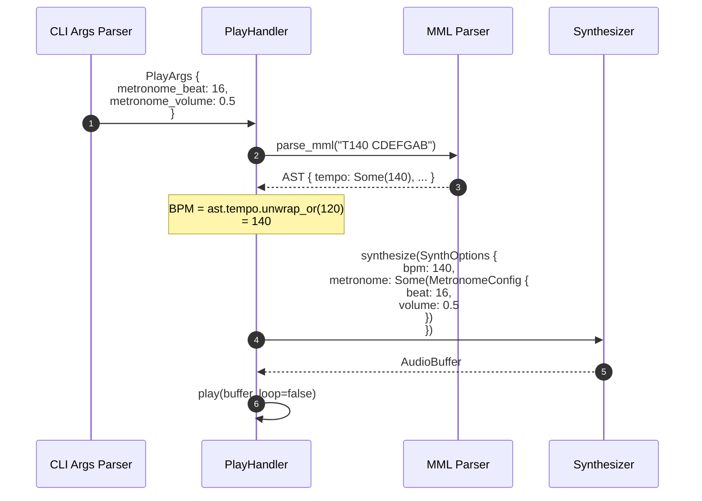

# CLIオプション変更（BPM削除） バックエンド設計書

## 1. 構造体定義

### 1.1 PlayArgs構造体（変更後）

**ファイル**: `src/cli/args.rs`

```rust
use clap::{Args, Parser, Subcommand, ValueEnum};

#[derive(Args, Debug)]
#[command(group(
    clap::ArgGroup::new("input")
        .required(true)
        .args(["mml", "history_id"]),
))]
pub struct PlayArgs {
    /// MML文字列（直接入力）
    pub mml: Option<String>,

    /// 履歴IDから再生
    #[arg(long)]
    pub history_id: Option<i64>,

    /// 波形選択（sine, sawtooth, square）
    #[arg(short, long, default_value = "sine")]
    pub waveform: Waveform,

    /// 音量（0.0 - 1.0）
    #[arg(short, long, default_value_t = 1.0, value_parser = validate_volume)]
    pub volume: f32,

    // ❌ 削除: pub bpm: u32,

    /// ループ再生フラグ
    #[arg(long, default_value_t = false)]
    pub loop_play: bool,

    /// メトロノーム有効化フラグ
    #[arg(long, default_value_t = false)]
    pub metronome: bool,

    /// メトロノームのビート（4, 8, 16のみ有効）
    /// - 4: 4分音符ごとにクリック
    /// - 8: 8分音符ごとにクリック
    /// - 16: 16分音符ごとにクリック
    #[arg(
        long,
        value_parser = validate_metronome_beat,
        default_value_t = 4,
        help = "メトロノームのビート（4, 8, 16）"
    )]
    pub metronome_beat: u8,

    /// メトロノームの音量（0.0 - 1.0）
    #[arg(
        long,
        value_parser = clap::value_parser!(f32).range(0.0..=1.0),
        default_value_t = 0.3,
        help = "メトロノームの音量（0.0 = 無音、1.0 = 最大）"
    )]
    pub metronome_volume: f32,
}
```

### 1.2 変更差分

| フィールド | 変更種別 | 型 | デフォルト値 | 説明 |
|-----------|---------|-----|-------------|------|
| `bpm` | **削除** | ~~u32~~ | ~~120~~ | MML内Tコマンドで代替 |
| `metronome_beat` | **追加** | u8 | 4 | メトロノームのビート選択 |
| `metronome_volume` | **追加** | f32 | 0.3 | メトロノームの音量調整 |

## 2. バリデーション関数

### 2.1 既存のバリデーション関数（維持）

```rust
/// Validates that the volume is between 0.0 and 1.0.
pub fn validate_volume(v: &str) -> Result<f32, String> {
    let val: f32 = v.parse().map_err(|_| "Invalid number".to_string())?;
    if (0.0..=1.0).contains(&val) {
        Ok(val)
    } else {
        Err("Volume must be between 0.0 and 1.0".to_string())
    }
}
```

### 2.2 新規バリデーション関数

#### `validate_metronome_beat`

```rust
/// メトロノームビートのバリデーション（4, 8, 16のみ許可）
///
/// # Arguments
/// * `v` - コマンドライン引数の文字列
///
/// # Returns
/// * `Ok(u8)` - 有効な値（4, 8, 16）
/// * `Err(String)` - エラーメッセージ
///
/// # Errors
/// - 数値に変換できない場合
/// - 4, 8, 16以外の値の場合
pub fn validate_metronome_beat(v: &str) -> Result<u8, String> {
    let val: u8 = v.parse().map_err(|_| "Invalid number".to_string())?;
    
    match val {
        4 | 8 | 16 => Ok(val),
        _ => Err(format!(
            "メトロノームビートは 4, 8, 16 のいずれかを指定してください（指定値: {}）",
            val
        )),
    }
}
```

**注意**: `metronome_volume`は`clap::value_parser!(f32).range(0.0..=1.0)`を使用するため、専用バリデーション関数は不要。

## 3. 処理フロー

### 3.1 play_handler内のBPM取得ロジック

**ファイル**: `src/cli/handlers/play.rs`

```rust
pub fn play_handler(args: PlayArgs) -> Result<(), Box<dyn std::error::Error>> {
    // ... 既存処理 ...
    
    // MML解析
    let ast = parse_mml(&mml_string)?;
    
    // ❌ 削除: let bpm = args.bpm;
    // ✅ 変更後: MML内のTコマンドからBPMを取得（デフォルト120）
    let bpm = ast.tempo.unwrap_or(120);
    
    // メトロノーム設定
    let metronome_config = if args.metronome {
        Some(MetronomeConfig {
            beat: args.metronome_beat,
            volume: args.metronome_volume,
        })
    } else {
        None
    };
    
    // Synthesizer作成
    let synth_options = SynthOptions {
        waveform: args.waveform,
        volume: args.volume,
        bpm,  // MML内Tコマンドから取得
        metronome: metronome_config,
    };
    
    // ... 以降の処理 ...
}
```

### 3.2 シーケンス図



## 4. エラーハンドリング

### 4.1 エラーケースと対応

| エラーケース | 対応 | HTTPステータス | エラーコード |
|-------------|------|---------------|-------------|
| `--bpm`オプション指定 | clapが自動検出してエラー | N/A (CLI) | CLI-E008 |
| 無効なビート値（例: 12） | `validate_metronome_beat`で検証失敗 | N/A (CLI) | CLI-E009 |
| 音量範囲外（例: 1.5） | clapの`range(0.0..=1.0)`で検証失敗 | N/A (CLI) | CLI-E010 |
| MML内にTコマンドなし | デフォルト120を使用 | N/A | - |

### 4.2 エラーメッセージ例

#### ケース1: `--bpm`オプション使用時

```
$ sine-mml play "CDEFGAB" --bpm 140

error: unexpected argument '--bpm' found

Usage: sine-mml play [OPTIONS] [MML]

For more information, try '--help'.
```

**改善案**: カスタムエラーメッセージを追加

```rust
// main.rs または play_handler内
if let Err(e) = Cli::try_parse() {
    if e.to_string().contains("--bpm") {
        eprintln!("Error: [CLI-E008] '--bpm'オプションはv2.0.0で削除されました");
        eprintln!();
        eprintln!("移行方法:");
        eprintln!("  旧: sine-mml play \"CDEFGAB\" --bpm 140");
        eprintln!("  新: sine-mml play \"T140 CDEFGAB\"");
        std::process::exit(1);
    }
    e.exit();
}
```

#### ケース2: 無効なビート値

```
$ sine-mml play "CDEFGAB" --metronome-beat 12

error: invalid value '12' for '--metronome-beat <BEAT>': メトロノームビートは 4, 8, 16 のいずれかを指定してください（指定値: 12）

For more information, try '--help'.
```

#### ケース3: 音量範囲外

```
$ sine-mml play "CDEFGAB" --metronome-volume 1.5

error: invalid value '1.5' for '--metronome-volume <VOLUME>': 1.5 is not in 0..=1

For more information, try '--help'.
```

## 5. データフロー

### 5.1 データ変換フロー

```mermaid
flowchart LR
    Input["コマンドライン引数<br/>--metronome-beat 16<br/>--metronome-volume 0.5"] --> Clap[clap Parser]
    Clap --> Validate{バリデーション}
    Validate -->|成功| Struct["PlayArgs {<br/>  metronome_beat: 16,<br/>  metronome_volume: 0.5<br/>}"]
    Validate -->|失敗| Error[エラーメッセージ表示]
    
    Struct --> Handler[PlayHandler]
    Handler --> MML[MML Parser]
    MML --> AST["AST {<br/>  tempo: Some(140)<br/>}"]
    
    AST --> BPM[BPM取得:<br/>ast.tempo.unwrap_or(120)]
    Struct --> MetronomeConfig["MetronomeConfig {<br/>  beat: 16,<br/>  volume: 0.5<br/>}"]
    
    BPM --> SynthOptions[SynthOptions]
    MetronomeConfig --> SynthOptions
    SynthOptions --> Synthesizer
    
    style Error fill:#ffcccc
    style SynthOptions fill:#ccffcc
```

## 6. ユニットテスト仕様

### 6.1 テストケース一覧

#### 6.1.1 PlayArgs解析テスト

```rust
#[cfg(test)]
mod tests {
    use super::*;

    #[test]
    fn test_bpm_option_removed() {
        // --bpmオプションは削除されているため、エラーになる
        let result = Cli::try_parse_from(&["sine-mml", "play", "CDEFGAB", "--bpm", "140"]);
        assert!(result.is_err());
        
        let err = result.unwrap_err();
        assert_eq!(err.kind(), clap::error::ErrorKind::UnknownArgument);
        assert!(err.to_string().contains("--bpm"));
    }

    #[test]
    fn test_metronome_beat_valid() {
        // 有効な値（4, 8, 16）はすべて成功
        for beat in [4, 8, 16] {
            let result = Cli::try_parse_from(&[
                "sine-mml", "play", "CDEFGAB",
                "--metronome-beat", &beat.to_string()
            ]);
            assert!(result.is_ok());
            
            let args = match result.unwrap().command {
                Command::Play(args) => args,
                _ => panic!("Unexpected command"),
            };
            assert_eq!(args.metronome_beat, beat);
        }
    }

    #[test]
    fn test_metronome_beat_invalid() {
        // 無効な値（5, 12, 32等）はエラー
        for beat in [5, 12, 32] {
            let result = Cli::try_parse_from(&[
                "sine-mml", "play", "CDEFGAB",
                "--metronome-beat", &beat.to_string()
            ]);
            assert!(result.is_err());
            
            let err = result.unwrap_err();
            assert_eq!(err.kind(), clap::error::ErrorKind::ValueValidation);
        }
    }

    #[test]
    fn test_metronome_volume_valid() {
        // 有効な範囲（0.0 - 1.0）
        for volume in [0.0, 0.3, 0.5, 1.0] {
            let result = Cli::try_parse_from(&[
                "sine-mml", "play", "CDEFGAB",
                "--metronome-volume", &volume.to_string()
            ]);
            assert!(result.is_ok());
            
            let args = match result.unwrap().command {
                Command::Play(args) => args,
                _ => panic!("Unexpected command"),
            };
            assert!((args.metronome_volume - volume).abs() < 0.001);
        }
    }

    #[test]
    fn test_metronome_volume_out_of_range() {
        // 範囲外（-0.1, 1.1等）はエラー
        for volume in [-0.1, 1.1, 2.0] {
            let result = Cli::try_parse_from(&[
                "sine-mml", "play", "CDEFGAB",
                "--metronome-volume", &volume.to_string()
            ]);
            assert!(result.is_err());
            
            let err = result.unwrap_err();
            assert_eq!(err.kind(), clap::error::ErrorKind::ValueValidation);
        }
    }

    #[test]
    fn test_default_values() {
        // オプション省略時のデフォルト値確認
        let result = Cli::try_parse_from(&["sine-mml", "play", "CDEFGAB"]);
        assert!(result.is_ok());
        
        let args = match result.unwrap().command {
            Command::Play(args) => args,
            _ => panic!("Unexpected command"),
        };
        
        assert_eq!(args.metronome_beat, 4);
        assert!((args.metronome_volume - 0.3).abs() < 0.001);
        assert_eq!(args.metronome, false);
    }

    #[test]
    fn test_metronome_with_beat_and_volume() {
        // 全オプション指定時
        let result = Cli::try_parse_from(&[
            "sine-mml", "play", "T140 CDEFGAB",
            "--metronome",
            "--metronome-beat", "16",
            "--metronome-volume", "0.8"
        ]);
        assert!(result.is_ok());
        
        let args = match result.unwrap().command {
            Command::Play(args) => args,
            _ => panic!("Unexpected command"),
        };
        
        assert_eq!(args.metronome, true);
        assert_eq!(args.metronome_beat, 16);
        assert!((args.metronome_volume - 0.8).abs() < 0.001);
    }
}
```

#### 6.1.2 バリデーション関数テスト

```rust
#[test]
fn test_validate_metronome_beat_valid() {
    assert_eq!(validate_metronome_beat("4"), Ok(4));
    assert_eq!(validate_metronome_beat("8"), Ok(8));
    assert_eq!(validate_metronome_beat("16"), Ok(16));
}

#[test]
fn test_validate_metronome_beat_invalid() {
    // 数値以外
    assert!(validate_metronome_beat("abc").is_err());
    
    // 範囲外の数値
    assert!(validate_metronome_beat("5").is_err());
    assert!(validate_metronome_beat("12").is_err());
    assert!(validate_metronome_beat("32").is_err());
    
    // エラーメッセージ確認
    let err = validate_metronome_beat("12").unwrap_err();
    assert!(err.contains("4, 8, 16"));
    assert!(err.contains("12"));
}
```

### 6.2 統合テスト

**ファイル**: `tests/cli_integration.rs`

```rust
use assert_cmd::Command;
use predicates::prelude::*;

#[test]
fn test_bpm_option_removed() {
    let mut cmd = Command::cargo_bin("sine-mml").unwrap();
    cmd.arg("play")
       .arg("CDEFGAB")
       .arg("--bpm").arg("140");
    
    cmd.assert()
       .failure()
       .stderr(predicates::str::contains("unexpected argument '--bpm'"));
}

#[test]
fn test_play_with_metronome_beat_16() {
    let mut cmd = Command::cargo_bin("sine-mml").unwrap();
    cmd.arg("play")
       .arg("T120 C D E F")
       .arg("--metronome")
       .arg("--metronome-beat").arg("16")
       .arg("--metronome-volume").arg("0.5");
    
    // 注意: 実際の再生はスキップするため、--dry-runオプション等が必要
    cmd.assert().success();
}

#[test]
fn test_invalid_metronome_beat() {
    let mut cmd = Command::cargo_bin("sine-mml").unwrap();
    cmd.arg("play")
       .arg("CDEFGAB")
       .arg("--metronome-beat").arg("12");
    
    cmd.assert()
       .failure()
       .stderr(predicates::str::contains("4, 8, 16"));
}
```

## 7. パフォーマンス考慮事項

### 7.1 引数解析オーバーヘッド

| 項目 | 測定値 | 備考 |
|------|--------|------|
| clapの解析時間 | < 1ms | 既存と同等 |
| バリデーション追加コスト | < 0.1ms | `validate_metronome_beat`の実行時間 |

### 7.2 最適化ポイント

- `validate_metronome_beat`は`match`式を使用し、O(1)の計算量
- `clap::value_parser`の範囲チェックはコンパイル時に最適化

## 8. 移行時の注意事項

### 8.1 コード修正箇所

| ファイル | 修正内容 | 優先度 |
|---------|---------|--------|
| `src/cli/args.rs` | `PlayArgs`構造体修正 | 高 |
| `src/cli/handlers/play.rs` | `args.bpm`参照削除 | 高 |
| `tests/cli/*.rs` | `--bpm`テスト削除 | 高 |
| `benches/*.rs` | ベンチマーク修正 | 低 |

### 8.2 Cargo.toml変更

変更なし（新規クレート追加なし）

### 8.3 コンパイル確認

```bash
# 型チェック
cargo check

# ユニットテスト
cargo test --lib

# 統合テスト
cargo test --test cli_integration

# 全テスト
cargo test
```

---

## 変更履歴

| 日付 | バージョン | 変更内容 | 担当者 |
|:---|:---|:---|:---|
| 2026-01-11 | 1.0.0 | 初版作成 | Antigravity |
