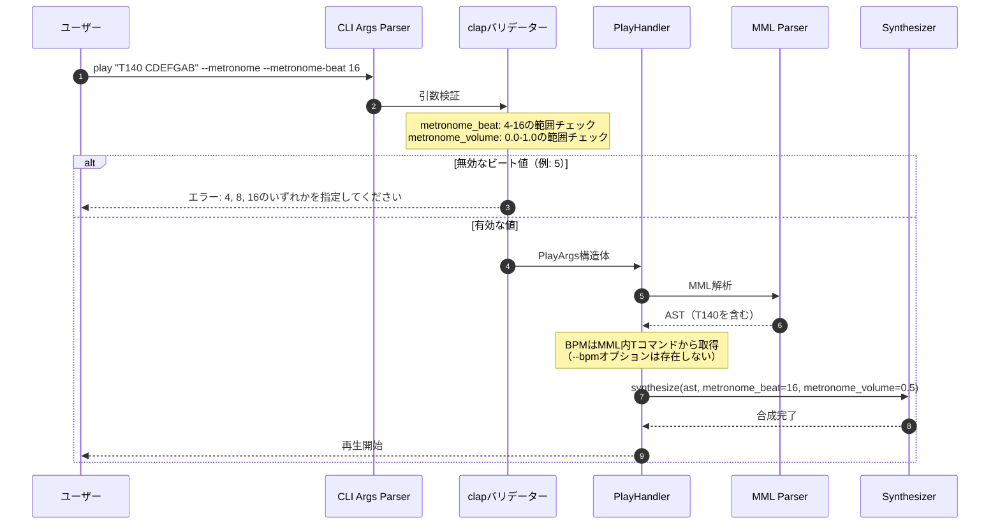
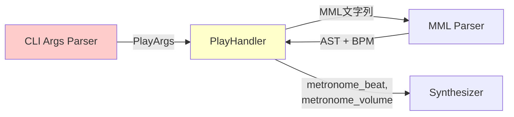

# CLIオプション変更（BPM削除） 詳細設計書

## メタ情報

| 項目 | 内容 |
|------|------|
| ドキュメントID | DET-CLI-002 |
| バージョン | 1.0.0 |
| ステータス | レビュー待ち |
| 作成日 | 2026-01-11 |
| 最終更新日 | 2026-01-11 |
| 親機能 | CLI機能改善 |
| 含まれる機能ID | F-005 |
| 関連基本設計書 | BASIC-CLI-002 |
| 関連要件定義書 | REQ-CLI-002 |

## 1. 概要

### 1.1 目的

sine-mml v2.0.0において、`--bpm`オプションを削除し、MML内のTコマンドに一本化することで、CLIインターフェースを簡潔化する。同時に、メトロノーム機能を強化するために`--metronome-beat`と`--metronome-volume`オプションを追加する。

### 1.2 背景

**問題点**:
- 現在の`--bpm`オプションは、MML内のTコマンド（例: `T120`）と機能が重複している
- 同一のパラメータ（テンポ）を2箇所で指定可能であり、混乱を招く
- メトロノーム機能がスタブ実装のため、ビート選択や音量調整ができない

**解決策**:
- `--bpm`オプションを削除し、テンポ指定をMML内のTコマンドに統一
- メトロノームの詳細制御として`--metronome-beat`と`--metronome-volume`を追加
- 破壊的変更のため、メジャーバージョンアップ（v1.x → v2.0.0）として実施

### 1.3 破壊的変更の説明

**重要**: この変更は**破壊的変更（Breaking Change）** です。

| 項目 | 詳細 |
|------|------|
| 変更種別 | 破壊的変更 |
| バージョン | v1.x → v2.0.0 |
| 影響範囲 | `--bpm`オプションを使用している全スクリプト・ユーザー |
| 移行期間 | v2.0.0リリース後、v1.xのサポートは終了 |
| 後方互換性 | なし（`--bpm`は完全削除） |

### 1.4 処理フロー概要



## 2. 機能要件

### 2.1 対象機能

| 機能ID | 機能名 | 概要 | 優先度 |
|--------|--------|------|--------|
| F-005 | BPM調節 | `--bpm`オプションを削除し、MML内Tコマンドに統一 | 必須 |

### 2.2 ビジネスルール

| ルールID | 内容 |
|---------|------|
| BR-CLI-008 | `--bpm`オプションは完全に削除され、指定時はエラーになる |
| BR-CLI-009 | `--metronome-beat`の有効値は4, 8, 16のみ（他の値はエラー） |
| BR-CLI-010 | `--metronome-volume`の範囲は0.0〜1.0（範囲外はエラー） |
| BR-CLI-011 | デフォルト値: `--metronome-beat`は4、`--metronome-volume`は0.3 |
| BR-CLI-012 | BPMはMML内のTコマンドから取得（指定なしの場合はデフォルト120） |

### 2.3 新規オプション仕様

#### `--metronome-beat`

| 項目 | 内容 |
|------|------|
| 型 | `u8` |
| 必須 | No |
| デフォルト値 | 4 |
| 有効値 | 4, 8, 16 |
| 説明 | メトロノームのビート（4分音符/8分音符/16分音符ごとにクリック） |
| バリデーション | clap `value_parser` で範囲外をエラー |

#### `--metronome-volume`

| 項目 | 内容 |
|------|------|
| 型 | `f32` |
| 必須 | No |
| デフォルト値 | 0.3 |
| 有効値 | 0.0 〜 1.0 |
| 説明 | メトロノームの音量（0.0 = 無音、1.0 = 最大） |
| バリデーション | clap `value_parser` で範囲外をエラー |

## 3. 設計書一覧

| 設計書 | パス | 説明 |
|--------|------|------|
| バックエンド設計書 | [./バックエンド設計書.md](./バックエンド設計書.md) | PlayArgs構造体とバリデーション仕様 |

## 4. 共通設計への参照

| 設計書 | パス |
|--------|------|
| MMLパーサー設計 | [../mml-parser/詳細設計書.md](../mml-parser/詳細設計書.md) |
| オーディオエンジン設計 | [../audio-engine/詳細設計書.md](../audio-engine/詳細設計書.md) |
| メトロノーム設計 | [../metronome/詳細設計書.md](../metronome/詳細設計書.md) |

## 5. マイグレーションガイド

### 5.1 変更前（v1.x）

```bash
# BPMオプション使用
sine-mml play "CDEFGAB" --bpm 140 --metronome

# 出力: 140 BPMで再生（メトロノームはスタブ）
```

### 5.2 変更後（v2.0.0）

```bash
# MML内でテンポ指定（Tコマンド）
sine-mml play "T140 CDEFGAB" --metronome --metronome-beat 16 --metronome-volume 0.5

# 出力: 140 BPMで再生、16ビートメトロノーム、音量0.5
```

### 5.3 移行手順

| ステップ | 旧コマンド | 新コマンド |
|---------|----------|----------|
| 1. `--bpm`削除 | `--bpm 120` → | MML内に `T120` を追加 |
| 2. メトロノーム強化 | `--metronome` → | `--metronome --metronome-beat 8 --metronome-volume 0.4` |

**注意事項**:
- v2.0.0以降、`--bpm`オプションは**完全に削除**されます
- `--bpm`を指定すると、`unexpected argument '--bpm'` エラーが発生します
- MML内にTコマンドを記述しない場合、デフォルトBPM（120）が使用されます

### 5.4 自動変換スクリプト例

既存スクリプトの移行を支援するための変換例:

```bash
#!/bin/bash
# v1.x → v2.0.0 自動変換スクリプト

OLD_CMD='sine-mml play "CDEFGAB" --bpm 140'
NEW_CMD='sine-mml play "T140 CDEFGAB"'

# 変換ロジック
# 1. --bpm 値を抽出
# 2. MML文字列の先頭に T値 を挿入
# 3. --bpm オプションを削除
```

## 6. 影響範囲分析

### 6.1 変更対象ファイル

| ファイル | 変更内容 | 変更レベル |
|---------|---------|-----------|
| `src/cli/args.rs` | `PlayArgs`構造体から`bpm`フィールド削除、新規フィールド追加 | 高 |
| `src/cli/handlers/play.rs` | `args.bpm`参照を削除、MML内Tコマンドから取得 | 中 |
| `src/audio/synthesizer.rs` | メトロノームミックス処理で新規パラメータ使用 | 低 |
| `tests/cli_integration.rs` | `--bpm`テストを削除、新規オプションテスト追加 | 中 |
| `README.md` | v2.0.0の破壊的変更を記載 | 低 |

### 6.2 依存関係



## 7. エラーコード一覧

| コード | 説明 | 対処方法 |
|--------|------|----------|
| CLI-E008 | `--bpm`オプションが指定された | v2.0.0では`--bpm`は削除されました。MML内にTコマンド（例: `T140`）を使用してください |
| CLI-E009 | `--metronome-beat`が無効 | 有効な値は 4, 8, 16 のいずれかです |
| CLI-E010 | `--metronome-volume`が範囲外 | 0.0 〜 1.0 の範囲で指定してください |

### 7.1 エラー表示例

#### CLI-E008: BPMオプション使用時

```
Error: [CLI-E008] Unexpected argument '--bpm'

このオプションはv2.0.0で削除されました。

移行方法:
  旧: sine-mml play "CDEFGAB" --bpm 140
  新: sine-mml play "T140 CDEFGAB"

MML内にTコマンド（例: T140）を使用してテンポを指定してください。
```

#### CLI-E009: 無効なビート値

```
Error: [CLI-E009] Invalid value '12' for '--metronome-beat <BEAT>'

有効な値: 4, 8, 16

使用例:
  sine-mml play "T120 CDEFGAB" --metronome-beat 8
```

#### CLI-E010: 音量範囲外

```
Error: [CLI-E010] Invalid value '1.5' for '--metronome-volume <VOLUME>'

範囲: 0.0 〜 1.0

使用例:
  sine-mml play "CDEFGAB" --metronome-volume 0.5
```

## 8. テスト戦略

### 8.1 ユニットテスト項目

| テストケース | 検証内容 | 期待結果 |
|-------------|---------|---------|
| `test_bpm_option_removed` | `--bpm 140` 指定時 | エラー: `unexpected argument '--bpm'` |
| `test_metronome_beat_valid` | `--metronome-beat 4` | 成功 |
| `test_metronome_beat_invalid` | `--metronome-beat 12` | エラー: CLI-E009 |
| `test_metronome_volume_valid` | `--metronome-volume 0.5` | 成功 |
| `test_metronome_volume_out_of_range` | `--metronome-volume 1.5` | エラー: CLI-E010 |
| `test_default_values` | オプション省略時 | beat=4, volume=0.3 |

### 8.2 統合テスト項目

| テストケース | 入力 | 期待される動作 |
|-------------|------|---------------|
| MML内Tコマンド使用 | `sine-mml play "T140 CDEFGAB"` | 140 BPMで再生 |
| デフォルトBPM | `sine-mml play "CDEFGAB"` | 120 BPM（デフォルト）で再生 |
| メトロノーム16ビート | `sine-mml play "T120 CDEFGAB" --metronome-beat 16` | 16分音符ごとにクリック |
| メトロノーム音量調整 | `sine-mml play "CDEFGAB" --metronome-volume 0.8` | 音量0.8でクリック |

### 8.3 E2Eテスト項目

| シナリオ | ステップ |
|---------|---------|
| 破壊的変更の検証 | 1. v1.xコマンド実行 → 2. エラー確認 → 3. v2.0.0コマンドで成功 |
| マイグレーション確認 | 1. 旧コマンド (`--bpm 140`) → 2. エラー → 3. 新コマンド (`T140`) で成功 |

## 9. 非機能要件

### 9.1 パフォーマンス

| 項目 | 要件 | 測定方法 |
|------|------|---------|
| 引数解析オーバーヘッド | 既存と同等（1ms以内） | ベンチマーク |
| clapバリデーション | 追加コストなし | プロファイリング |

### 9.2 ユーザビリティ

| 項目 | 要件 |
|------|------|
| エラーメッセージ | 移行方法を具体的に提示 |
| ヘルプテキスト | `--help`で新規オプションの説明を表示 |
| マイグレーションガイド | README.mdとリリースノートに記載 |

### 9.3 ドキュメント要件

| ドキュメント | 更新内容 |
|-------------|---------|
| README.md | v2.0.0の破壊的変更セクション追加 |
| CHANGELOG.md | `[BREAKING CHANGE]` タグ付きエントリ追加 |
| GitHub Release | マイグレーションガイド記載 |
| USAGE.md | `--bpm`削除、新規オプション追加 |

## 10. リリース計画

### 10.1 バージョニング戦略

| バージョン | 変更内容 |
|-----------|---------|
| v1.9.x | 現行安定版（`--bpm`サポート） |
| v2.0.0-rc.1 | リリース候補（破壊的変更含む） |
| v2.0.0 | 正式リリース |

### 10.2 リリースノート（v2.0.0）例

```markdown
# v2.0.0 - Breaking Changes

## 🚨 Breaking Changes

### `--bpm` Option Removed

The `--bpm` option has been removed. Use the `T` command in MML instead.

**Before (v1.x)**:
```bash
sine-mml play "CDEFGAB" --bpm 140
```

**After (v2.0.0)**:
```bash
sine-mml play "T140 CDEFGAB"
```

## ✨ New Features

### Enhanced Metronome Options

- `--metronome-beat` (4, 8, 16): Select beat interval
- `--metronome-volume` (0.0-1.0): Adjust metronome volume

**Example**:
```bash
sine-mml play "T120 CDEFGAB" --metronome --metronome-beat 16 --metronome-volume 0.5
```
```

### 10.3 移行期間

| フェーズ | 期間 | 内容 |
|---------|------|------|
| 告知 | v2.0.0リリース1ヶ月前 | 破壊的変更をアナウンス |
| RC期間 | 2週間 | v2.0.0-rc.1でユーザーフィードバック収集 |
| 正式リリース | RC期間後 | v2.0.0正式リリース |
| サポート終了 | v2.0.0リリース後 | v1.xの積極的サポート終了 |

## 11. 関連サブ機能

- [メトロノーム機能](../metronome/詳細設計書.md) - ノイズベースクリック音、ビート選択、音量調整
- [MMLパーサー](../mml-parser/詳細設計書.md) - Tコマンドの解析

---

## 変更履歴

| 日付 | バージョン | 変更内容 | 担当者 |
|:---|:---|:---|:---|
| 2026-01-11 | 1.0.0 | 初版作成 | Antigravity |
