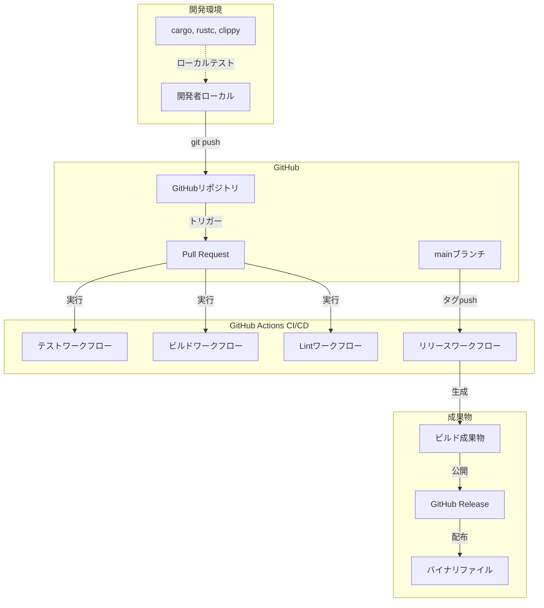
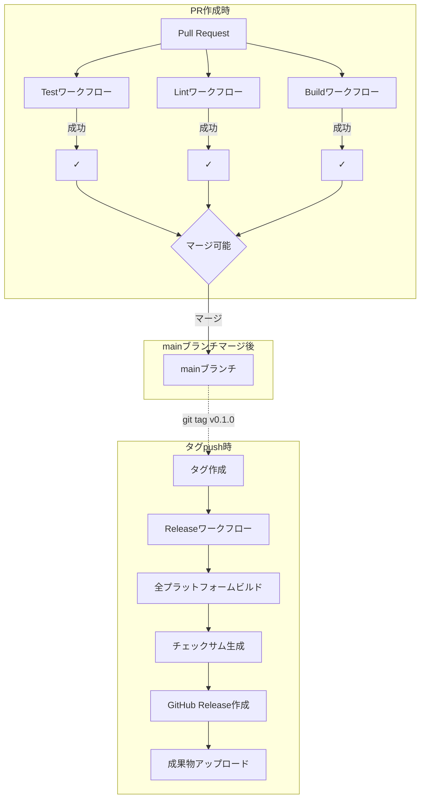

# インフラ設計書

## メタ情報

| 項目 | 内容 |
|------|------|
| ドキュメントID | DET-INFRA-001 |
| バージョン | 1.0.0 |
| ステータス | レビュー待ち |
| 作成日 | 2026-01-10 |
| 最終更新日 | 2026-01-10 |
| 対象システム | sine-mml CLI全体 |
| 関連基本設計書 | BASIC-CLI-001 |

## 1. 概要

本ドキュメントは、MML Synthesizer CLI (sine-mml) のビルド構成、CI/CD パイプライン、リリース戦略、開発環境構築を定義する。本アプリケーションはRustで実装されたクロスプラットフォームCLIツールであり、GitHub ActionsによるCI/CD自動化を採用する。

### 1.1 インフラ要件

| 項目 | 要件 |
|------|------|
| 対象プラットフォーム | Linux (x86_64, aarch64), macOS (x86_64, aarch64), Windows (x86_64) |
| ビルドツール | Cargo 1.70+, rustc 1.70+ |
| CI/CD | GitHub Actions |
| リリース方法 | GitHub Releases（バイナリ配布） |
| 最小Rustバージョン | 1.70 (MSRV: Minimum Supported Rust Version) |

### 1.2 システム構成概要



## 2. ビルド構成

### 2.1 Cargo.toml構造

```toml
[package]
name = "sine-mml"
version = "0.1.0"
edition = "2021"
rust-version = "1.70"  # MSRV
authors = ["Your Name <your.email@example.com>"]
description = "A Music Macro Language (MML) synthesizer CLI"
license = "MIT"
repository = "https://github.com/your-org/sine-mml"
keywords = ["mml", "synthesizer", "audio", "cli"]
categories = ["command-line-utilities", "multimedia::audio"]

[dependencies]
# CLI Framework
clap = { version = "4.5", features = ["derive", "cargo"] }
indicatif = "0.18"

# Audio Synthesis
fundsp = "0.23"
cpal = "0.17"
hound = "3.5"

# Database
rusqlite = { version = "0.38", features = ["bundled"] }

# Utilities
dirs = "5.0"
chrono = "0.4"
anyhow = "1.0"
thiserror = "2.0"

[dev-dependencies]
tempfile = "3.8"
assert_cmd = "2.0"
predicates = "3.0"

[profile.release]
opt-level = 3        # 最大最適化
lto = true           # Link Time Optimization
codegen-units = 1    # 単一コード生成ユニット（最適化優先）
strip = true         # シンボル削除（バイナリサイズ削減）
panic = 'abort'      # パニック時即座に中止（スタック不要）

[profile.dev]
opt-level = 0        # 最適化なし（ビルド高速化）

[[bin]]
name = "sine-mml"
path = "src/main.rs"
```

### 2.2 Cargo Features（将来拡張用）

| Feature名 | 説明 | デフォルト | 用途 |
|----------|------|-----------|------|
| `bundled-sqlite` | SQLiteをスタティックリンク | ✅ | 依存関係の簡略化 |
| `metronome` | メトロノーム機能 | ✅ | クリック音再生 |
| `waveform-all` | 全波形サポート | ✅ | Sine/Sawtooth/Square |

### 2.3 ビルドスクリプト（build.rs）

本プロジェクトはビルドスクリプトを使用しないが、将来的に以下の用途で導入を検討：

| 用途 | 説明 |
|------|------|
| バージョン埋め込み | `git describe --tags` の出力をバイナリに埋め込み |
| プラットフォーム検出 | OS別の最適化フラグ設定 |

## 3. CI/CDパイプライン

### 3.1 ワークフロー構成図



### 3.2 Testワークフロー（`.github/workflows/test.yml`）

| 項目 | 設定 |
|------|------|
| トリガー | `push`, `pull_request` (mainブランチ) |
| 実行環境 | `ubuntu-latest`, `macos-latest`, `windows-latest` |
| Rustバージョン | `stable`, `1.70` (MSRV) |
| テスト種別 | ユニットテスト、統合テスト、Docテスト |

```yaml
name: Test

on:
  push:
    branches: [main]
  pull_request:
    branches: [main]

jobs:
  test:
    strategy:
      matrix:
        os: [ubuntu-latest, macos-latest, windows-latest]
        rust: [stable, 1.70]
    runs-on: ${{ matrix.os }}
    
    steps:
      - uses: actions/checkout@v4
      
      - name: Install Rust
        uses: dtolnay/rust-toolchain@master
        with:
          toolchain: ${{ matrix.rust }}
      
      - name: Cache cargo registry
        uses: actions/cache@v4
        with:
          path: ~/.cargo/registry
          key: ${{ runner.os }}-cargo-registry-${{ hashFiles('**/Cargo.lock') }}
      
      - name: Cache cargo index
        uses: actions/cache@v4
        with:
          path: ~/.cargo/git
          key: ${{ runner.os }}-cargo-index-${{ hashFiles('**/Cargo.lock') }}
      
      - name: Cache target directory
        uses: actions/cache@v4
        with:
          path: target
          key: ${{ runner.os }}-target-${{ matrix.rust }}-${{ hashFiles('**/Cargo.lock') }}
      
      - name: Run tests
        run: cargo test --all-features --verbose
      
      - name: Run doc tests
        run: cargo test --doc --verbose
```

### 3.3 Lintワークフロー（`.github/workflows/lint.yml`）

| 項目 | 設定 |
|------|------|
| トリガー | `push`, `pull_request` (mainブランチ) |
| 実行環境 | `ubuntu-latest` |
| チェック項目 | Clippy, rustfmt, cargo audit |

```yaml
name: Lint

on:
  push:
    branches: [main]
  pull_request:
    branches: [main]

jobs:
  clippy:
    runs-on: ubuntu-latest
    steps:
      - uses: actions/checkout@v4
      - uses: dtolnay/rust-toolchain@stable
        with:
          components: clippy
      - name: Run Clippy
        run: cargo clippy --all-targets --all-features -- -D warnings
  
  rustfmt:
    runs-on: ubuntu-latest
    steps:
      - uses: actions/checkout@v4
      - uses: dtolnay/rust-toolchain@stable
        with:
          components: rustfmt
      - name: Check formatting
        run: cargo fmt --all -- --check
  
  audit:
    runs-on: ubuntu-latest
    steps:
      - uses: actions/checkout@v4
      - uses: dtolnay/rust-toolchain@stable
      - name: Install cargo-audit
        run: cargo install cargo-audit
      - name: Run security audit
        run: cargo audit
```

### 3.4 Buildワークフロー（`.github/workflows/build.yml`）

| 項目 | 設定 |
|------|------|
| トリガー | `push`, `pull_request` (mainブランチ) |
| 実行環境 | `ubuntu-latest`, `macos-latest`, `windows-latest` |
| 目的 | リリースビルドの成功確認 |

```yaml
name: Build

on:
  push:
    branches: [main]
  pull_request:
    branches: [main]

jobs:
  build:
    strategy:
      matrix:
        include:
          - os: ubuntu-latest
            target: x86_64-unknown-linux-gnu
          - os: ubuntu-latest
            target: aarch64-unknown-linux-gnu
          - os: macos-latest
            target: x86_64-apple-darwin
          - os: macos-latest
            target: aarch64-apple-darwin
          - os: windows-latest
            target: x86_64-pc-windows-msvc
    
    runs-on: ${{ matrix.os }}
    
    steps:
      - uses: actions/checkout@v4
      
      - name: Install Rust
        uses: dtolnay/rust-toolchain@stable
        with:
          targets: ${{ matrix.target }}
      
      - name: Build release
        run: cargo build --release --target ${{ matrix.target }}
      
      - name: Upload artifact
        uses: actions/upload-artifact@v4
        with:
          name: sine-mml-${{ matrix.target }}
          path: target/${{ matrix.target }}/release/sine-mml*
```

### 3.5 Releaseワークフロー（`.github/workflows/release.yml`）

| 項目 | 設定 |
|------|------|
| トリガー | `push` (tags: `v*.*.*`) |
| 実行環境 | 各プラットフォーム |
| 成果物 | バイナリ、チェックサム、リリースノート |

```yaml
name: Release

on:
  push:
    tags:
      - 'v*.*.*'

jobs:
  build:
    strategy:
      matrix:
        include:
          - os: ubuntu-latest
            target: x86_64-unknown-linux-gnu
            artifact_name: sine-mml
            asset_name: sine-mml-linux-x86_64
          - os: ubuntu-latest
            target: aarch64-unknown-linux-gnu
            artifact_name: sine-mml
            asset_name: sine-mml-linux-aarch64
          - os: macos-latest
            target: x86_64-apple-darwin
            artifact_name: sine-mml
            asset_name: sine-mml-macos-x86_64
          - os: macos-latest
            target: aarch64-apple-darwin
            artifact_name: sine-mml
            asset_name: sine-mml-macos-aarch64
          - os: windows-latest
            target: x86_64-pc-windows-msvc
            artifact_name: sine-mml.exe
            asset_name: sine-mml-windows-x86_64.exe
    
    runs-on: ${{ matrix.os }}
    
    steps:
      - uses: actions/checkout@v4
      
      - name: Install Rust
        uses: dtolnay/rust-toolchain@stable
        with:
          targets: ${{ matrix.target }}
      
      - name: Install cross-compilation tools (Linux aarch64)
        if: matrix.target == 'aarch64-unknown-linux-gnu'
        run: |
          sudo apt-get update
          sudo apt-get install -y gcc-aarch64-linux-gnu
      
      - name: Build release
        run: cargo build --release --target ${{ matrix.target }}
      
      - name: Generate checksum
        shell: bash
        run: |
          cd target/${{ matrix.target }}/release
          if [[ "${{ matrix.os }}" == "windows-latest" ]]; then
            certutil -hashfile ${{ matrix.artifact_name }} SHA256 | head -n 2 | tail -n 1 > ${{ matrix.asset_name }}.sha256
          else
            shasum -a 256 ${{ matrix.artifact_name }} > ${{ matrix.asset_name }}.sha256
          fi
      
      - name: Upload binaries to release
        uses: softprops/action-gh-release@v1
        with:
          files: |
            target/${{ matrix.target }}/release/${{ matrix.artifact_name }}
            target/${{ matrix.target }}/release/${{ matrix.asset_name }}.sha256
        env:
          GITHUB_TOKEN: ${{ secrets.GITHUB_TOKEN }}
```

## 4. バージョニング戦略

### 4.1 SemVer (Semantic Versioning)

| バージョン形式 | 説明 | 例 |
|--------------|------|-----|
| MAJOR.MINOR.PATCH | `MAJOR`: 破壊的変更<br>`MINOR`: 機能追加<br>`PATCH`: バグ修正 | `1.2.3` |
| Pre-release | `-alpha`, `-beta`, `-rc` | `1.0.0-beta.1` |

### 4.2 バージョン番号付与ルール

| 変更内容 | バージョン更新 | 例 |
|---------|--------------|-----|
| CLI引数の削除・変更 | MAJOR | `1.0.0` → `2.0.0` |
| 新機能追加 | MINOR | `1.0.0` → `1.1.0` |
| バグ修正、パフォーマンス改善 | PATCH | `1.0.0` → `1.0.1` |
| セキュリティ修正 | PATCH（緊急） | `1.0.0` → `1.0.1` |

### 4.3 タグ命名規則

| タグ形式 | 用途 | 例 |
|---------|------|-----|
| `v<MAJOR>.<MINOR>.<PATCH>` | 正式リリース | `v1.0.0` |
| `v<MAJOR>.<MINOR>.<PATCH>-beta.<N>` | ベータ版 | `v1.0.0-beta.1` |
| `v<MAJOR>.<MINOR>.<PATCH>-rc.<N>` | リリース候補 | `v1.0.0-rc.1` |

## 5. リリース成果物

### 5.1 バイナリファイル命名規則

| プラットフォーム | ファイル名 | サイズ目安 |
|---------------|-----------|----------|
| Linux x86_64 | `sine-mml-linux-x86_64` | 5-8 MB |
| Linux aarch64 | `sine-mml-linux-aarch64` | 5-8 MB |
| macOS x86_64 | `sine-mml-macos-x86_64` | 6-9 MB |
| macOS aarch64 (Apple Silicon) | `sine-mml-macos-aarch64` | 6-9 MB |
| Windows x86_64 | `sine-mml-windows-x86_64.exe` | 5-8 MB |

### 5.2 チェックサムファイル

各バイナリに対して、SHA256チェックサムファイル（`.sha256`）を生成する。

**チェックサム検証方法**:

```bash
# Linux/macOS
shasum -a 256 -c sine-mml-linux-x86_64.sha256

# Windows (PowerShell)
$hash = Get-FileHash sine-mml-windows-x86_64.exe -Algorithm SHA256
$expected = Get-Content sine-mml-windows-x86_64.exe.sha256
if ($hash.Hash -eq $expected.Split()[0]) { "OK" } else { "FAILED" }
```

### 5.3 リリースノート構成

各リリースには以下の情報を含むリリースノートを作成する。

| セクション | 内容 |
|----------|------|
| **What's Changed** | 主要な変更点（箇条書き） |
| **New Features** | 新機能の説明 |
| **Bug Fixes** | 修正されたバグ |
| **Breaking Changes** | 破壊的変更（MAJOR版上げ時） |
| **Security Fixes** | セキュリティ修正（CVE番号を記載） |
| **Installation** | インストール手順（バイナリダウンロードURL） |
| **Full Changelog** | GitHubの自動生成リンク |

## 6. 依存関係管理

### 6.1 Cargo.lock管理方針

| ファイル | Git管理 | 理由 |
|---------|--------|------|
| `Cargo.lock` | ✅ コミット必須 | バイナリクレートのため、再現性を保証 |

### 6.2 依存クレート更新方針

| 項目 | 方針 |
|------|------|
| 定期更新 | 月次で `cargo update` を実行し、テストに合格すればマージ |
| セキュリティ更新 | `cargo audit` で脆弱性検出時、即座に更新 |
| 破壊的変更 | MAJORバージョンアップは慎重に検討、移行ガイドを確認 |

### 6.3 最小バージョン検証

```bash
# 最小依存バージョンでのビルド確認
cargo +nightly update -Z minimal-versions
cargo build
cargo test
```

## 7. 開発環境構築

### 7.1 必須ツール

| ツール | バージョン | インストール方法 |
|--------|-----------|-----------------|
| Rust | 1.70+ | `curl --proto '=https' --tlsv1.2 -sSf https://sh.rustup.rs \| sh` |
| Cargo | 1.70+ | Rustと同時にインストール |
| Git | 2.30+ | OS標準パッケージマネージャー |

### 7.2 推奨ツール

| ツール | 用途 | インストール方法 |
|--------|------|-----------------|
| `cargo-watch` | ファイル変更時の自動ビルド | `cargo install cargo-watch` |
| `cargo-audit` | 脆弱性スキャン | `cargo install cargo-audit` |
| `cargo-nextest` | 高速テスト実行 | `cargo install cargo-nextest` |
| `cargo-expand` | マクロ展開表示 | `cargo install cargo-expand` |

### 7.3 開発環境セットアップ手順

```bash
# 1. リポジトリクローン
git clone https://github.com/your-org/sine-mml.git
cd sine-mml

# 2. Rust最新安定版のインストール
rustup update stable

# 3. 依存関係のビルド
cargo build

# 4. テスト実行
cargo test

# 5. Clippy実行
cargo clippy -- -D warnings

# 6. フォーマットチェック
cargo fmt --all -- --check

# 7. 実行（開発版）
cargo run -- play "O4L4CDEFGAB"
```

### 7.4 IDE設定（推奨）

| IDE | プラグイン | 設定 |
|-----|----------|------|
| VS Code | `rust-analyzer` | `settings.json` に `"rust-analyzer.check.command": "clippy"` を追加 |
| IntelliJ IDEA | `Rust` | Clippy、rustfmtを有効化 |
| Neovim | `rust-tools.nvim` | LSP設定でrust-analyzerを使用 |

## 8. パフォーマンス監視

### 8.1 ビルド時間測定

```bash
# ビルド時間の可視化
cargo build --timings
```

### 8.2 バイナリサイズ最適化

| 手法 | 効果 | 適用タイミング |
|------|------|---------------|
| `strip = true` | 30-40%削減 | リリースビルド時 |
| `lto = true` | 5-10%削減 | リリースビルド時 |
| `opt-level = "z"` | 追加10-15%削減 | サイズ重視時（パフォーマンストレードオフ） |

**サイズ確認コマンド**:

```bash
cargo build --release
ls -lh target/release/sine-mml
```

## 9. トラブルシューティング

### 9.1 よくある問題

| 問題 | 原因 | 解決方法 |
|------|------|---------|
| `linker 'cc' not found` (Linux) | C言語コンパイラ未インストール | `sudo apt install build-essential` |
| `xcrun: error` (macOS) | Xcode Command Line Tools未インストール | `xcode-select --install` |
| `error: linking with 'link.exe' failed` (Windows) | MSVC未インストール | Visual Studio Build Tools をインストール |
| `cargo audit` で脆弱性検出 | 依存クレートに既知の脆弱性 | `cargo update` で最新版に更新 |
| テスト失敗（オーディオデバイス不在） | CIサーバーに音声出力なし | モックまたはヘッドレステストを実装 |

### 9.2 ビルド失敗時のデバッグ

```bash
# 詳細ログ出力
RUST_BACKTRACE=1 cargo build --verbose

# クリーンビルド
cargo clean
cargo build
```

## 10. デプロイメント

### 10.1 インストール方法（ユーザー向け）

**方法1: バイナリダウンロード（推奨）**

```bash
# Linux/macOS
curl -LO https://github.com/your-org/sine-mml/releases/download/v0.1.0/sine-mml-linux-x86_64
chmod +x sine-mml-linux-x86_64
sudo mv sine-mml-linux-x86_64 /usr/local/bin/sine-mml

# Windows (PowerShell)
Invoke-WebRequest -Uri "https://github.com/your-org/sine-mml/releases/download/v0.1.0/sine-mml-windows-x86_64.exe" -OutFile "sine-mml.exe"
Move-Item sine-mml.exe C:\Windows\System32\
```

**方法2: ソースからビルド**

```bash
cargo install --git https://github.com/your-org/sine-mml
```

### 10.2 アンインストール方法

```bash
# バイナリインストールの場合
sudo rm /usr/local/bin/sine-mml

# cargo installの場合
cargo uninstall sine-mml
```

## 11. 監視とアラート

### 11.1 CI/CD監視指標

| 指標 | 閾値 | アラート |
|------|------|---------|
| テスト成功率 | 100% | 失敗時に即座にSlack通知 |
| ビルド時間 | 10分以内 | 超過時に調査 |
| 依存関係の脆弱性 | 0件 | 検出時に即座にIssue作成 |
| リリース頻度 | 月1回以上 | ユーザーフィードバック収集 |

### 11.2 GitHub Actions実行コスト

| 項目 | 月間使用時間 | 無料枠 | 超過時の対応 |
|------|------------|--------|-------------|
| Testワークフロー | 約5時間 | 2,000分 | 問題なし |
| Buildワークフロー | 約3時間 | 2,000分 | 問題なし |
| Releaseワークフロー | 約1時間 | 2,000分 | 問題なし |

## 12. セキュリティ

### 12.1 GitHub Secrets

| Secret名 | 用途 | 設定場所 |
|---------|------|---------|
| `GITHUB_TOKEN` | GitHub Actionsデフォルト | 自動設定 |

### 12.2 コード署名（将来対応）

| プラットフォーム | 署名方法 | 優先度 |
|---------------|---------|--------|
| macOS | Apple Developer証明書 | Phase 2 |
| Windows | コード署名証明書 | Phase 2 |

---

## 変更履歴

| 日付 | バージョン | 変更内容 | 担当者 |
|:---|:---|:---|:---|
| 2026-01-10 | 1.0.0 | 初版作成 | Antigravity |
