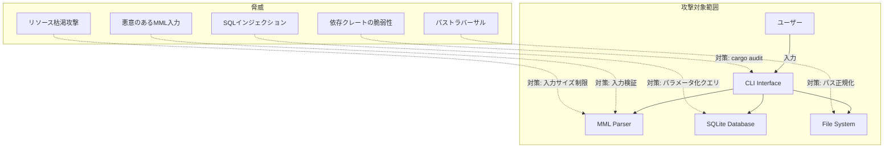

# セキュリティ設計書

## メタ情報

| 項目 | 内容 |
|------|------|
| ドキュメントID | DET-SEC-001 |
| バージョン | 1.3.0 |
| ステータス | レビュー待ち |
| 作成日 | 2026-01-10 |
| 最終更新日 | 2026-01-14 |
| 対象システム | sine-mml CLI全体 |
| 関連基本設計書 | BASIC-CLI-001, BASIC-CLI-006 |

## 1. 概要

本ドキュメントは、MML Synthesizer CLI (sine-mml) のセキュリティ設計を定義する。本アプリケーションはローカル環境で動作するCLIツールであり、ネットワーク通信機能を持たないが、ユーザー入力検証、ファイルシステムアクセス制御、SQLインジェクション対策などの基本的なセキュリティ対策を実装する。

### 1.1 セキュリティ設計方針

| 方針 | 内容 |
|------|------|
| 最小権限の原則 | 必要最小限のファイルシステムアクセス権限のみを使用 |
| 入力検証の徹底 | すべてのユーザー入力に対して厳格なバリデーションを実施 |
| セキュアデフォルト | デフォルト設定で安全な状態を保つ |
| 情報漏洩の防止 | エラーメッセージに機密情報を含めない |
| 依存関係の管理 | 定期的な依存クレートの脆弱性監査 |

### 1.2 脅威モデル概要



## 2. 脅威分析

### 2.1 STRIDE分析

| 脅威分類 | 脅威シナリオ | 影響 | リスク | 対策 |
|---------|-------------|------|--------|------|
| **S**poofing (なりすまし) | - | - | 低 | N/A（ローカルCLI、認証不要） |
| **T**ampering (改ざん) | SQLiteファイルの直接編集 | データ破損 | 低 | バリデーション、破損検知と再作成 |
| **R**epudiation (否認) | - | - | 低 | N/A（監査要件なし） |
| **I**nformation Disclosure (情報漏洩) | エラーメッセージによる内部情報露出 | 攻撃者への情報提供 | 中 | エラーメッセージの抽象化 |
| **D**enial of Service (サービス拒否) | 巨大なMML文字列による処理遅延 | アプリケーション停止 | 中 | 入力サイズ制限、タイムアウト |
| **E**levation of Privilege (権限昇格) | - | - | 低 | N/A（システム権限を要求しない） |

### 2.2 リスク評価マトリクス

| リスク | 可能性 | 影響度 | リスクレベル | 対応 |
|--------|--------|--------|-------------|------|
| 悪意のあるMML入力によるパーサークラッシュ | 中 | 低 | **中** | 入力検証、エラーハンドリング |
| SQLインジェクション | 低 | 高 | **中** | パラメータ化クエリの強制 |
| パストラバーサル（WAV出力） | 中 | 中 | **中** | パス正規化、ホワイトリスト |
| 依存クレートの脆弱性 | 中 | 中 | **中** | 定期的な`cargo audit` |
| リソース枯渇攻撃 | 低 | 低 | **低** | 入力サイズ制限 |

## 3. 入力検証設計

### 3.1 MML文字列の検証

| 検証項目 | ルール | 理由 | エラーコード |
|---------|--------|------|-------------|
| 最大文字数 | 10,000文字以内 | メモリ枯渇防止、パース時間制限 | SEC-E001 |
| 許可文字 | `C-G, A-B, R, O, T, L, V, +, #, -, ., 0-9, 空白, 改行, {, }, :` | パーサーの安全性確保 | SEC-E002 |
| 制御文字 | 禁止（`\x00-\x1F`、`\x7F` を除く `\t`, `\n`, `\r`） | 予期しない動作防止 | SEC-E003 |
| 数値範囲 | オクターブ: 1-8, テンポ: 30-300, 音長: 1-64, 音量: 0-15 | 仕様準拠、オーバーフロー防止 | MML-E002 |
| 連符数 | 2-99 | 連符機能の仕様準拠 | MML-E022 |
| 連符ネスト深度 | 最大5階層 | スタックオーバーフロー防止 | MML-E023 |

**検証ロジック実装例**:

```rust
fn validate_mml_input(mml: &str) -> Result<(), SecurityError> {
    // 最大文字数チェック
    if mml.len() > 10_000 {
        return Err(SecurityError::InputTooLarge {
            max: 10_000,
            actual: mml.len(),
        });
    }
    
    // 許可文字チェック
    for (pos, ch) in mml.chars().enumerate() {
        if !is_valid_mml_char(ch) {
            return Err(SecurityError::InvalidCharacter {
                character: ch,
                position: pos,
            });
        }
    }
    
    Ok(())
}

fn is_valid_mml_char(ch: char) -> bool {
    matches!(ch,
        'C'..='G' | 'A' | 'B' | 'R' | 'O' | 'T' | 'L' | 'V' |
        'c'..='g' | 'a' | 'b' | 'r' | 'o' | 't' | 'l' | 'v' |
        '+' | '#' | '-' | '.' | '0'..='9' |
        ' ' | '\t' | '\n' | '\r' |
        '{' | '}' | ':'  // 連符構文用
    )
}
```

### 3.2 数値パラメータの検証

| パラメータ | 型 | 範囲 | デフォルト | バリデーション方法 | エラーコード |
|-----------|-----|------|-----------|-------------------|-------------|
| `--volume` / `-v` | f32 | 0.0 - 1.0 | 0.5 | clap範囲制約 + 明示的チェック | SEC-E004 |
| `--bpm` / `-b` | u16 | 30 - 300 | 120 | clap範囲制約 + 明示的チェック | SEC-E005 |
| `--history-id` | i64 | 1 - i64::MAX | - | 正の整数チェック | SEC-E006 |
| `--midi-channel` | u8 | 1 - 16 | 1 | clap範囲制約 + 明示的チェック | MML-E024 |

**検証ロジック実装例**:

```rust
fn validate_volume(volume: f32) -> Result<f32, SecurityError> {
    if !(0.0..=1.0).contains(&volume) {
        return Err(SecurityError::InvalidVolume {
            value: volume,
            range: (0.0, 1.0),
        });
    }
    Ok(volume)
}

fn validate_bpm(bpm: u16) -> Result<u16, SecurityError> {
    if !(30..=300).contains(&bpm) {
        return Err(SecurityError::InvalidBpm {
            value: bpm,
            range: (30, 300),
        });
    }
    Ok(bpm)
}

fn validate_history_id(id: i64) -> Result<i64, SecurityError> {
    if id <= 0 {
        return Err(SecurityError::InvalidHistoryId { value: id });
    }
    Ok(id)
}

fn validate_midi_channel(channel: u8) -> Result<u8, MidiError> {
    if !(1..=16).contains(&channel) {
        return Err(MidiError::InvalidChannel { value: channel });
    }
    Ok(channel)
}
```

### 3.3 ファイルパスの検証

| 検証項目 | ルール | 理由 | エラーコード |
|---------|--------|------|-------------|
| パストラバーサル防止 | `..` を含むパスを拒否 | ディレクトリ外へのアクセス防止 | SEC-E007 |
| 絶対パス変換 | `std::fs::canonicalize` を使用 | シンボリックリンク追跡の無効化 | SEC-E008 |
| 最大パス長 | 260文字（Windows互換） | バッファオーバーフロー防止 | SEC-E009 |
| 許可拡張子 | `.wav` のみ | 意図しないファイル上書き防止 | SEC-E010 |
| 書き込み先ディレクトリ | カレントディレクトリまたはユーザー明示的指定のみ | 予期しない場所への書き込み防止 | SEC-E011 |

**検証ロジック実装例**:

```rust
use std::path::{Path, PathBuf};

fn validate_output_path(path: &str) -> Result<PathBuf, SecurityError> {
    // 最大パス長チェック
    if path.len() > 260 {
        return Err(SecurityError::PathTooLong {
            max: 260,
            actual: path.len(),
        });
    }
    
    let path_obj = Path::new(path);
    
    // 拡張子チェック
    if path_obj.extension().and_then(|s| s.to_str()) != Some("wav") {
        return Err(SecurityError::InvalidExtension {
            expected: "wav",
            found: path_obj.extension().and_then(|s| s.to_str()).unwrap_or(""),
        });
    }
    
    // パストラバーサル検出
    if path.contains("..") {
        return Err(SecurityError::PathTraversal { path: path.to_string() });
    }
    
    // 絶対パスに正規化（シンボリックリンク解決なし）
    let absolute = if path_obj.is_absolute() {
        path_obj.to_path_buf()
    } else {
        std::env::current_dir()
            .map_err(|e| SecurityError::IoError(e))?
            .join(path_obj)
    };
    
    Ok(absolute)
}
```

## 4. SQLインジェクション対策

### 4.1 パラメータ化クエリの強制

| 対策 | 実装方法 | 検証 |
|------|---------|------|
| すべてのSQLクエリでプレースホルダーを使用 | `rusqlite::params![]` マクロの使用 | コードレビューで動的SQL構築の禁止を確認 |
| 文字列連結によるクエリ構築の禁止 | Clippy lint `clippy::string_concat_in_sql` を有効化 | CI/CDで自動チェック |

**安全なクエリ実装例**:

```rust
// ✅ 安全: パラメータ化クエリ
fn get_history_by_id(conn: &Connection, id: i64) -> Result<History, DbError> {
    let mut stmt = conn.prepare(
        "SELECT id, mml, waveform, volume, bpm, created_at 
         FROM history 
         WHERE id = ?1"
    )?;
    
    let history = stmt.query_row(params![id], |row| {
        Ok(History {
            id: row.get(0)?,
            mml: row.get(1)?,
            waveform: row.get(2)?,
            volume: row.get(3)?,
            bpm: row.get(4)?,
            created_at: row.get(5)?,
        })
    })?;
    
    Ok(history)
}

// ❌ 危険: 文字列連結（絶対に使用しない）
// fn unsafe_query(conn: &Connection, id: &str) -> Result<History, DbError> {
//     let query = format!("SELECT * FROM history WHERE id = {}", id); // NG!
//     ...
// }
```

### 4.2 入力のエスケープ

| 項目 | 対策 | 理由 |
|------|------|------|
| MML文字列 | エスケープ不要（パラメータ化クエリで自動処理） | rusqliteが内部で適切にエスケープ |
| メタデータ（波形名等） | Enumで制約し、文字列として扱わない | 不正な値の混入を型レベルで防止 |

## 5. ファイルシステムセキュリティ

### 5.1 安全なパス処理

| 項目 | 実装 |
|------|------|
| データベースファイル配置 | `dirs` クレートを使用してXDG Base Directory準拠パスを取得 |
| ディレクトリ作成 | `fs::create_dir_all()` で親ディレクトリも含めて作成 |
| パーミッション | データベースファイル: `0o600` (所有者のみ読み書き可) |

**安全なファイル作成例**:

```rust
use std::fs;
use std::os::unix::fs::PermissionsExt; // Unix系のみ

fn create_db_file_securely(path: &Path) -> Result<(), SecurityError> {
    // 親ディレクトリが存在しない場合は作成
    if let Some(parent) = path.parent() {
        fs::create_dir_all(parent)
            .map_err(|e| SecurityError::IoError(e))?;
    }
    
    // ファイル作成
    let file = fs::File::create(path)
        .map_err(|e| SecurityError::IoError(e))?;
    
    // Unix系の場合、パーミッションを制限
    #[cfg(unix)]
    {
        let mut perms = file.metadata()?.permissions();
        perms.set_mode(0o600); // rw-------
        fs::set_permissions(path, perms)?;
    }
    
    Ok(())
}
```

### 5.2 シンボリックリンク対策

| 対策 | 実装 | 理由 |
|------|------|------|
| シンボリックリンクの追跡を無効化 | `Path::canonicalize()` を使用しない | TOCTOU攻撃の防止 |
| ファイル存在確認 | `Path::exists()` の直後に `fs::File::open()` を実行 | レースコンディション回避 |

## 6. エラーメッセージの安全性

### 6.1 情報漏洩の防止

| エラー種別 | 内部情報 | ユーザーメッセージ | ログ出力 |
|-----------|---------|-------------------|---------|
| パースエラー | トークン位置、期待値 | "MML解析エラー: 位置{X}で不正な文字が見つかりました" | 内部情報も含めて記録 |
| DB接続エラー | ファイルパス、詳細エラー | "データベースの初期化に失敗しました" | 内部情報も含めて記録 |
| ファイルI/Oエラー | 絶対パス、OSエラーコード | "ファイルの書き込みに失敗しました: {相対パス}" | 内部情報も含めて記録 |
| 履歴未発見 | クエリ詳細 | "ID {X} の履歴が見つかりませんでした" | クエリは記録しない |

**安全なエラーメッセージ実装例**:

```rust
#[derive(Debug)]
pub enum SecurityError {
    InputTooLarge { max: usize, actual: usize },
    InvalidCharacter { character: char, position: usize },
    PathTraversal { path: String },
    IoError(std::io::Error),
}

impl std::fmt::Display for SecurityError {
    fn fmt(&self, f: &mut std::fmt::Formatter<'_>) -> std::fmt::Result {
        match self {
            SecurityError::InputTooLarge { max, actual } => {
                write!(f, "[SEC-E001] 入力が大きすぎます (最大: {}, 実際: {})", max, actual)
            }
            SecurityError::InvalidCharacter { character, position } => {
                write!(f, "[SEC-E002] 位置 {}: 不正な文字 '{}' が含まれています", position, character)
            }
            SecurityError::PathTraversal { path: _ } => {
                // パスの詳細は表示しない（ログには記録）
                write!(f, "[SEC-E007] 不正なファイルパスが指定されました")
            }
            SecurityError::IoError(_) => {
                // OS内部エラーの詳細は表示しない
                write!(f, "[SEC-E011] ファイル操作に失敗しました")
            }
        }
    }
}
```

## 7. 依存関係のセキュリティ

### 7.1 脆弱性監査

| 項目 | 実施方法 | 頻度 |
|------|---------|------|
| 依存クレートの脆弱性スキャン | `cargo audit` の実行 | CI/CD時、週次 |
| 最新版への更新 | `cargo update` + テスト実行 | 月次 |
| SemVer範囲指定 | `Cargo.toml` でキャレット要件を使用（例: `rusqlite = "0.38"`) | 常時 |

### 7.2 信頼できるクレートの選定基準

| 基準 | 閾値 | 確認方法 |
|------|------|---------|
| ダウンロード数 | 100万回以上 | crates.io |
| メンテナンス状況 | 過去6ヶ月以内の更新 | GitHub |
| セキュリティポリシー | `SECURITY.md` の存在 | GitHubリポジトリ |
| 既知の脆弱性 | CVE報告なし | RustSec Advisory Database |

### 7.3 使用クレートのセキュリティ評価

| クレート | バージョン | 評価 | 理由 |
|---------|-----------|------|------|
| `clap` | 4.5 | ✅ 安全 | ダウンロード数多数、活発なメンテナンス |
| `rusqlite` | 0.38 | ✅ 安全 | bundled機能でSQLite同梱、パラメータ化クエリ強制 |
| `fundsp` | 0.23 | ⚠️ 注意 | 数値計算ライブラリ、オーバーフロー対策を確認 |
| `cpal` | 0.17 | ✅ 安全 | 音声I/O、特権昇格リスクなし |
| `hound` | 3.5 | ✅ 安全 | WAV形式、フォーマット検証あり |
| `indicatif` | 0.18 | ✅ 安全 | UI表示のみ、セキュリティリスク低 |

## 8. セキュリティエラーコード一覧

### 8.1 セキュリティ関連エラーコード（SEC-E0xx）

| コード | 説明 | 対処方法 |
|--------|------|---------|
| SEC-E001 | MML入力が最大文字数（10,000文字）を超過 | MML文字列を短縮してください |
| SEC-E002 | MML入力に不正な文字が含まれている | 許可されたMMLコマンドのみを使用してください |
| SEC-E003 | 制御文字が含まれている | 改行、タブ、スペース以外の制御文字を削除してください |
| SEC-E004 | 音量が範囲外（0.0-1.0以外） | 音量を0.0〜1.0の範囲で指定してください |
| SEC-E005 | BPMが範囲外（30-300以外） | BPMを30〜300の範囲で指定してください |
| SEC-E006 | 履歴IDが不正（0以下） | 正の整数の履歴IDを指定してください |
| SEC-E007 | パストラバーサル攻撃を検出 | `..` を含むパスは使用できません |
| SEC-E008 | パス正規化エラー | ファイルパスを確認してください |
| SEC-E009 | パスが最大長（260文字）を超過 | より短いパスを指定してください |
| SEC-E010 | 不正なファイル拡張子 | `.wav` 拡張子のファイルのみ指定可能です |
| SEC-E011 | ファイルI/Oエラー | ファイルの権限とディスク容量を確認してください |

### 8.2 MIDI関連エラーコード（MML-E015〜E019, E024）

| コード | 説明 | 対処方法 |
|--------|------|---------|
| MML-E015 | MIDIデバイスが見つからない | MIDIデバイスを接続し、`--midi-list` で確認してください |
| MML-E016 | MIDIデバイス接続エラー | デバイスが他のアプリで使用中でないか確認してください |
| MML-E017 | MIDIメッセージ送信エラー | デバイス接続を確認し、再試行してください |
| MML-E018 | 無効なMIDIデバイスID | `--midi-list` で有効なデバイスIDを確認してください |
| MML-E019 | MIDIデバイス切断 | デバイスを再接続してください |
| MML-E024 | 無効なMIDIチャンネル | MIDIチャンネルは1〜16の範囲で指定してください |

### 8.3 連符関連エラーコード（MML-E020〜E023）

| コード | 説明 | 対処方法 |
|--------|------|---------|
| MML-E020 | 連符の閉じ括弧がない | `{...}` の形式で閉じ括弧を追加してください |
| MML-E021 | 連符数が指定されていない | `{...}n` の形式で連符数（n）を指定してください |
| MML-E022 | 無効な連符数（2未満または100以上） | 連符数は2〜99の範囲で指定してください |
| MML-E023 | 連符のネスト深度超過 | 連符のネストは最大5階層までです |

## 9. セキュリティテスト戦略

### 9.1 セキュリティテスト項目

| テストカテゴリ | テスト項目 | 期待される動作 |
|--------------|-----------|---------------|
| 入力検証 | 10,001文字のMML | SEC-E001エラー |
| 入力検証 | 不正な文字（`%`, `@`, `$`）を含むMML | SEC-E002エラー |
| 入力検証 | 制御文字（`\x00`, `\x1F`）を含むMML | SEC-E003エラー |
| SQLインジェクション | `--history-id="1 OR 1=1"` | エラー（整数型バリデーション） |
| SQLインジェクション | `--history-id="1; DROP TABLE history;"` | エラー（整数型バリデーション） |
| パストラバーサル | `--output="../../../etc/passwd.wav"` | SEC-E007エラー |
| パストラバーサル | `--output="/etc/passwd.wav"` | ユーザー確認後、書き込み先検証 |
| シンボリックリンク | シンボリックリンク経由のDB読み込み | 通常動作（読み込みは許可） |
| リソース枯渇 | 100,000文字のMML | SEC-E001エラー |
| MIDI検証 | `--midi-channel 0` | MML-E024エラー |
| MIDI検証 | `--midi-channel 17` | MML-E024エラー |
| MIDI検証 | `--midi-out 999` | MML-E018エラー |
| 連符検証 | `{CDE}0` | MML-E022エラー |
| 連符検証 | `{CDE}1` | MML-E022エラー |
| 連符検証 | `{CDE}100` | MML-E022エラー |
| 連符検証 | 6階層以上のネスト | MML-E023エラー |

### 9.2 Fuzzing戦略

| 対象 | ツール | 目的 |
|------|--------|------|
| MMLパーサー | `cargo-fuzz` | ランダムなMML入力でのクラッシュ検出 |
| ファイルパス検証 | `cargo-fuzz` | パストラバーサル、バッファオーバーフロー検出 |

## 10. セキュリティベストプラクティス

### 10.1 開発時の推奨事項

| 項目 | 推奨事項 |
|------|---------|
| コードレビュー | すべての入力検証コードをレビュー対象とする |
| Clippy警告 | `clippy::pedantic`, `clippy::unwrap_used` を有効化 |
| パニック禁止 | `panic!`, `unwrap()`, `expect()` を本番コードで使用しない |
| ログ出力 | 機密情報（絶対パス、内部エラー詳細）をユーザーログに出力しない |

### 10.2 実行時の推奨事項

| 項目 | 推奨事項 |
|------|---------|
| ユーザー教育 | 信頼できないソースからのMMLファイルを開かないよう注意喚起 |
| バックアップ | データベースファイルの定期的なバックアップをREADMEで推奨 |
| 最新版の使用 | リリースノートでセキュリティ修正を明示的に告知 |

---

## 変更履歴

| 日付 | バージョン | 変更内容 | 担当者 |
|:---|:---|:---|:---|
| 2026-01-10 | 1.0.0 | 初版作成 | Antigravity |
| 2026-01-14 | 1.2.0 | BASIC-CLI-006対応準備（バージョン更新） | detailed-design-writer |
| 2026-01-14 | 1.3.0 | MIDI/Tuplet検証セクション追加、エラーコードMML-E015〜E024追加 | detailed-design-writer |
