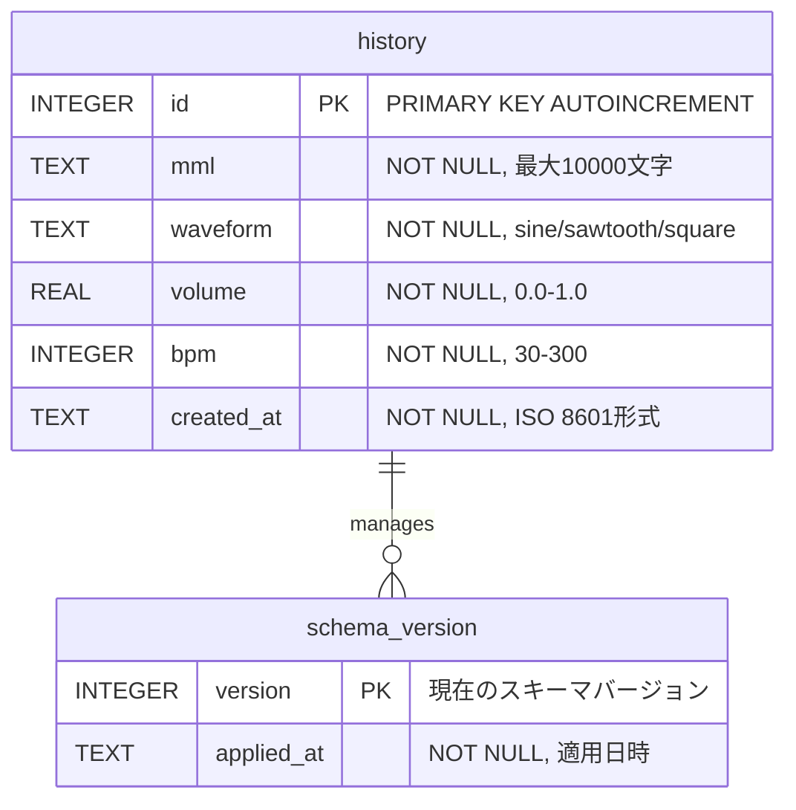
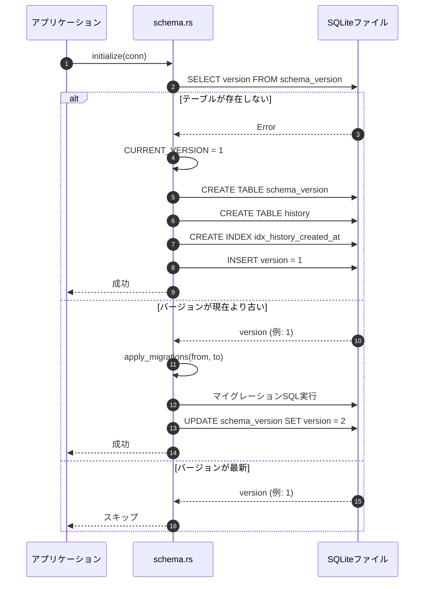

# 履歴管理 データベース設計書

## メタ情報

| 項目 | 内容 |
|------|------|
| ドキュメントID | DET-DB-001-DB |
| バージョン | 1.0.0 |
| 関連詳細設計書 | DET-DB-001 |
| データベース | SQLite 3.x |

## 1. ER図



## 2. テーブル定義

### 2.1 history テーブル

演奏履歴を保存するメインテーブル。

| カラム名 | 型 | NULL | デフォルト | 説明 |
|:---|:---|:---:|:---:|:---|
| id | INTEGER | NO | AUTOINCREMENT | 履歴ID（主キー） |
| mml | TEXT | NO | - | MML文字列（最大10,000文字） |
| waveform | TEXT | NO | - | 波形タイプ（"sine", "sawtooth", "square"のいずれか） |
| volume | REAL | NO | - | 音量（0.0 - 1.0） |
| bpm | INTEGER | NO | - | BPM（30 - 300） |
| created_at | TEXT | NO | - | 作成日時（ISO 8601形式: YYYY-MM-DD HH:MM:SS） |

**制約:**
- `id`: 主キー、自動インクリメント
- `waveform`: CHECKによる値の制限
- `volume`: CHECKによる範囲制限（0.0 <= volume <= 1.0）
- `bpm`: CHECKによる範囲制限（30 <= bpm <= 300）

**インデックス:**
| インデックス名 | カラム | 種類 | 目的 |
|---------------|--------|------|------|
| history_pkey | id | PRIMARY KEY | 一意性保証 |
| idx_history_created_at | created_at | INDEX (DESC) | 作成日時降順での高速検索 |

**DDL:**
```sql
CREATE TABLE IF NOT EXISTS history (
    id INTEGER PRIMARY KEY AUTOINCREMENT,
    mml TEXT NOT NULL,
    waveform TEXT NOT NULL CHECK(waveform IN ('sine', 'sawtooth', 'square')),
    volume REAL NOT NULL CHECK(volume >= 0.0 AND volume <= 1.0),
    bpm INTEGER NOT NULL CHECK(bpm >= 30 AND bpm <= 300),
    created_at TEXT NOT NULL
);

CREATE INDEX IF NOT EXISTS idx_history_created_at 
ON history(created_at DESC);
```

### 2.2 schema_version テーブル

データベースのスキーマバージョンを管理するテーブル。マイグレーション処理で使用。

| カラム名 | 型 | NULL | デフォルト | 説明 |
|:---|:---|:---:|:---:|:---|
| version | INTEGER | NO | - | スキーマバージョン（主キー） |
| applied_at | TEXT | NO | - | マイグレーション適用日時（ISO 8601形式） |

**制約:**
- `version`: 主キー（単一行のみ存在）

**DDL:**
```sql
CREATE TABLE IF NOT EXISTS schema_version (
    version INTEGER PRIMARY KEY,
    applied_at TEXT NOT NULL
);
```

## 3. 初期データ

### 3.1 schema_version 初期レコード

```sql
INSERT INTO schema_version (version, applied_at)
VALUES (1, datetime('now'));
```

### 3.2 サンプルデータ（開発・テスト用）

```sql
INSERT INTO history (mml, waveform, volume, bpm, created_at)
VALUES 
    ('CDEFGAB', 'sine', 0.5, 120, '2026-01-10 10:00:00'),
    ('CDE4 FGA4 B2', 'sawtooth', 0.7, 140, '2026-01-10 11:30:00'),
    ('C2D2E2F2G2A2B2', 'square', 0.3, 90, '2026-01-10 12:45:00');
```

## 4. マイグレーション戦略

### 4.1 バージョン管理フロー



### 4.2 マイグレーション定義

#### Version 1 → 2（例: 将来の拡張）

```sql
-- 例: タグ機能追加（Phase 2）
ALTER TABLE history ADD COLUMN tags TEXT;

CREATE TABLE IF NOT EXISTS history_tags (
    history_id INTEGER NOT NULL,
    tag TEXT NOT NULL,
    FOREIGN KEY (history_id) REFERENCES history(id) ON DELETE CASCADE
);

UPDATE schema_version SET version = 2, applied_at = datetime('now');
```

### 4.3 マイグレーション実装方針

- **アップグレードのみ**: ダウングレードは非対応（バックアップから復元を推奨）
- **トランザクション**: 各マイグレーションはトランザクション内で実行
- **失敗時の処理**: ロールバックし、エラーメッセージを表示
- **互換性**: 古いバージョンのDBファイルは自動的に最新バージョンにアップグレード

```rust
const CURRENT_VERSION: i64 = 1;

fn apply_migrations(conn: &Connection, from_version: i64) -> Result<(), DbError> {
    let tx = conn.transaction()?;
    
    for version in (from_version + 1)..=CURRENT_VERSION {
        match version {
            2 => {
                // Version 2へのマイグレーション
                tx.execute_batch(include_str!("migrations/002.sql"))?;
            }
            _ => unreachable!(),
        }
    }
    
    tx.commit()?;
    Ok(())
}
```

## 5. SQL操作詳細

### 5.1 CRUD操作

#### Create（履歴保存）

```sql
INSERT INTO history (mml, waveform, volume, bpm, created_at)
VALUES (?, ?, ?, ?, ?);
```

**Rustコード例:**
```rust
let created_at = Utc::now().format("%Y-%m-%d %H:%M:%S").to_string();

conn.execute(
    "INSERT INTO history (mml, waveform, volume, bpm, created_at) VALUES (?1, ?2, ?3, ?4, ?5)",
    params![entry.mml, entry.waveform.as_str(), entry.volume, entry.bpm, created_at],
)?;

let id = conn.last_insert_rowid();
```

#### Read（履歴取得 - 単一）

```sql
SELECT id, mml, waveform, volume, bpm, created_at
FROM history
WHERE id = ?;
```

**Rustコード例:**
```rust
let entry = conn.query_row(
    "SELECT id, mml, waveform, volume, bpm, created_at FROM history WHERE id = ?1",
    params![id],
    |row| {
        Ok(HistoryEntry {
            id: Some(row.get(0)?),
            mml: row.get(1)?,
            waveform: Waveform::from_str(&row.get::<_, String>(2)?)?,
            volume: row.get(3)?,
            bpm: row.get(4)?,
            created_at: DateTime::parse_from_str(&row.get::<_, String>(5)?, "%Y-%m-%d %H:%M:%S")?.with_timezone(&Utc),
        })
    },
)?;
```

#### Read（履歴一覧取得）

```sql
SELECT id, mml, waveform, volume, bpm, created_at
FROM history
ORDER BY created_at DESC
LIMIT ?;
```

**Rustコード例:**
```rust
let mut stmt = conn.prepare(
    "SELECT id, mml, waveform, volume, bpm, created_at FROM history ORDER BY created_at DESC LIMIT ?1"
)?;

let entries = stmt.query_map(params![limit.unwrap_or(i64::MAX)], |row| {
    Ok(HistoryEntry {
        id: Some(row.get(0)?),
        mml: row.get(1)?,
        waveform: Waveform::from_str(&row.get::<_, String>(2)?)?,
        volume: row.get(3)?,
        bpm: row.get(4)?,
        created_at: DateTime::parse_from_str(&row.get::<_, String>(5)?, "%Y-%m-%d %H:%M:%S")?.with_timezone(&Utc),
    })
})?;

let result: Result<Vec<_>, _> = entries.collect();
```

#### Update（Phase 2で実装予定）

```sql
UPDATE history
SET mml = ?, waveform = ?, volume = ?, bpm = ?
WHERE id = ?;
```

#### Delete（Phase 2で実装予定）

```sql
DELETE FROM history
WHERE id = ?;
```

### 5.2 検索クエリ（Phase 2で実装予定）

#### MML文字列による部分一致検索

```sql
SELECT id, mml, waveform, volume, bpm, created_at
FROM history
WHERE mml LIKE ?
ORDER BY created_at DESC;
```

**パラメータ例:**
```rust
params!["%CDEFG%"] // "CDEFG"を含むMML
```

#### 波形タイプによるフィルタ

```sql
SELECT id, mml, waveform, volume, bpm, created_at
FROM history
WHERE waveform = ?
ORDER BY created_at DESC;
```

#### 日付範囲検索

```sql
SELECT id, mml, waveform, volume, bpm, created_at
FROM history
WHERE created_at BETWEEN ? AND ?
ORDER BY created_at DESC;
```

## 6. インデックス戦略

### 6.1 現在のインデックス

| インデックス | カラム | 目的 | 効果 |
|-------------|--------|------|------|
| PRIMARY KEY | id | 一意性保証、高速検索 | O(log n) |
| idx_history_created_at | created_at DESC | 作成日時降順でのソート高速化 | ORDER BY created_at DESC が高速化 |

### 6.2 将来のインデックス（Phase 2）

| インデックス | カラム | 目的 |
|-------------|--------|------|
| idx_history_waveform | waveform | 波形タイプによるフィルタ高速化 |
| idx_history_mml_fts | mml | FTS5を使った全文検索 |

## 7. データベース設定

### 7.1 接続時の設定

```sql
-- Write-Ahead Logging (WAL) モードを有効化
PRAGMA journal_mode=WAL;

-- 外部キー制約を有効化（Phase 2で必要）
PRAGMA foreign_keys=ON;

-- キャッシュサイズ（デフォルトは2000ページ、約8MB）
PRAGMA cache_size=-8000; -- 8MB
```

### 7.2 パフォーマンスチューニング

| 項目 | 設定値 | 説明 |
|------|--------|------|
| journal_mode | WAL | 並行読み取りを可能にし、書き込み時のロックを最小化 |
| synchronous | NORMAL | 安全性とパフォーマンスのバランス（デフォルトはFULL） |
| temp_store | MEMORY | 一時テーブルをメモリに保存 |

```rust
conn.execute_batch(r#"
    PRAGMA journal_mode=WAL;
    PRAGMA synchronous=NORMAL;
    PRAGMA temp_store=MEMORY;
    PRAGMA foreign_keys=ON;
"#)?;
```

## 8. バックアップとリストア

### 8.1 バックアップ手順

#### 手動バックアップ

ユーザーはデータベースファイルを直接コピーしてバックアップを作成できる。

```bash
# Linux/macOS
cp ~/.local/share/sine-mml/history.db ~/.local/share/sine-mml/history.db.backup

# Windows
copy %APPDATA%\sine-mml\history.db %APPDATA%\sine-mml\history.db.backup
```

#### プログラムによるバックアップ（Phase 2）

```rust
use rusqlite::backup::Backup;

fn backup_database(src: &Connection, dest_path: &Path) -> Result<(), DbError> {
    let mut dest = Connection::open(dest_path)?;
    let backup = Backup::new(src, &mut dest)?;
    backup.run_to_completion(5, std::time::Duration::from_millis(250), None)?;
    Ok(())
}
```

### 8.2 リストア手順

1. アプリケーションを終了
2. バックアップファイルを元の場所にコピー
3. アプリケーションを再起動

### 8.3 データベース破損時の自動復旧

```rust
fn init() -> Result<Database, DbError> {
    let db_path = get_db_path()?;
    
    match Connection::open(&db_path) {
        Ok(conn) => {
            // 接続成功、スキーマチェック
            if let Err(e) = schema::initialize(&conn) {
                // スキーマ初期化失敗 → バックアップ作成後に再作成
                eprintln!("Schema initialization failed: {}", e);
                backup_and_recreate(&db_path)?;
                return Self::init(); // 再帰的に再試行
            }
            Ok(Database { conn })
        }
        Err(e) => {
            // 接続失敗 → DBファイルが破損している可能性
            eprintln!("Database connection failed: {}", e);
            backup_and_recreate(&db_path)?;
            Self::init() // 再帰的に再試行
        }
    }
}

fn backup_and_recreate(db_path: &Path) -> Result<(), DbError> {
    // 破損ファイルをバックアップ
    let backup_path = db_path.with_extension("db.corrupted");
    std::fs::rename(db_path, backup_path)?;
    
    // 新しいDBファイルを作成
    // （次回のinitで自動的に作成される）
    Ok(())
}
```

## 9. セキュリティ考慮事項

### 9.1 データ保護

| 項目 | 対策 |
|------|------|
| ファイルアクセス権限 | DBファイルは作成時に0600 (rw-------)に設定 |
| SQLインジェクション | プレースホルダー（?）を使用して完全に防止 |
| パスワード保存 | Phase 1では保存しない（将来的にはArgon2idでハッシュ化） |

### 9.2 SQLインジェクション対策

**悪い例（脆弱）:**
```rust
// 絶対に使用しない
let query = format!("SELECT * FROM history WHERE id = {}", user_input);
conn.execute(&query, [])?;
```

**良い例（安全）:**
```rust
// プレースホルダーを使用
conn.execute("SELECT * FROM history WHERE id = ?", params![user_input])?;
```

## 10. テストデータ

### 10.1 ユニットテスト用データ

```sql
-- 正常系データ
INSERT INTO history (mml, waveform, volume, bpm, created_at) VALUES
('CDEFGAB', 'sine', 0.5, 120, '2026-01-10 10:00:00'),
('C4D4E4', 'sawtooth', 0.8, 140, '2026-01-10 11:00:00'),
('C2D2E2', 'square', 0.3, 90, '2026-01-10 12:00:00');

-- 境界値データ
INSERT INTO history (mml, waveform, volume, bpm, created_at) VALUES
('A', 'sine', 0.0, 30, '2026-01-10 13:00:00'),  -- 最小値
('C', 'sine', 1.0, 300, '2026-01-10 14:00:00'); -- 最大値
```

### 10.2 統合テスト用データ

```sql
-- 多数の履歴データ（100件）
INSERT INTO history (mml, waveform, volume, bpm, created_at)
SELECT 
    'MML_' || seq,
    CASE (seq % 3) WHEN 0 THEN 'sine' WHEN 1 THEN 'sawtooth' ELSE 'square' END,
    0.5,
    120,
    datetime('2026-01-01', '+' || seq || ' hours')
FROM (
    WITH RECURSIVE cnt(seq) AS (
        SELECT 1
        UNION ALL
        SELECT seq + 1 FROM cnt WHERE seq < 100
    )
    SELECT seq FROM cnt
);
```

---

## 変更履歴

| 日付 | バージョン | 変更内容 | 担当者 |
|:---|:---|:---|:---|
| 2026-01-10 | 1.0.0 | 初版作成 | Antigravity |
