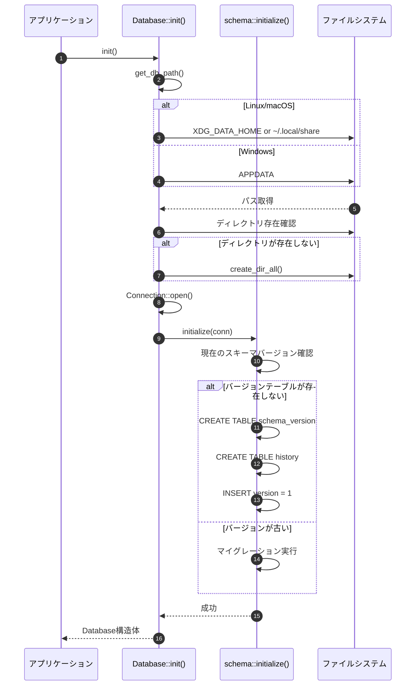
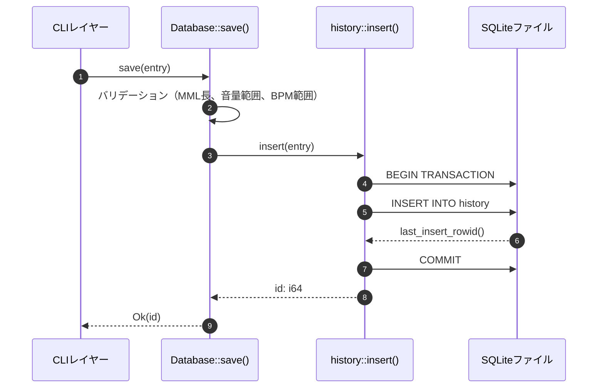
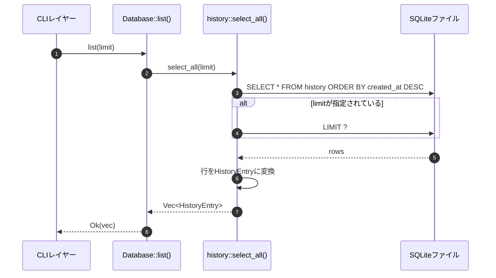
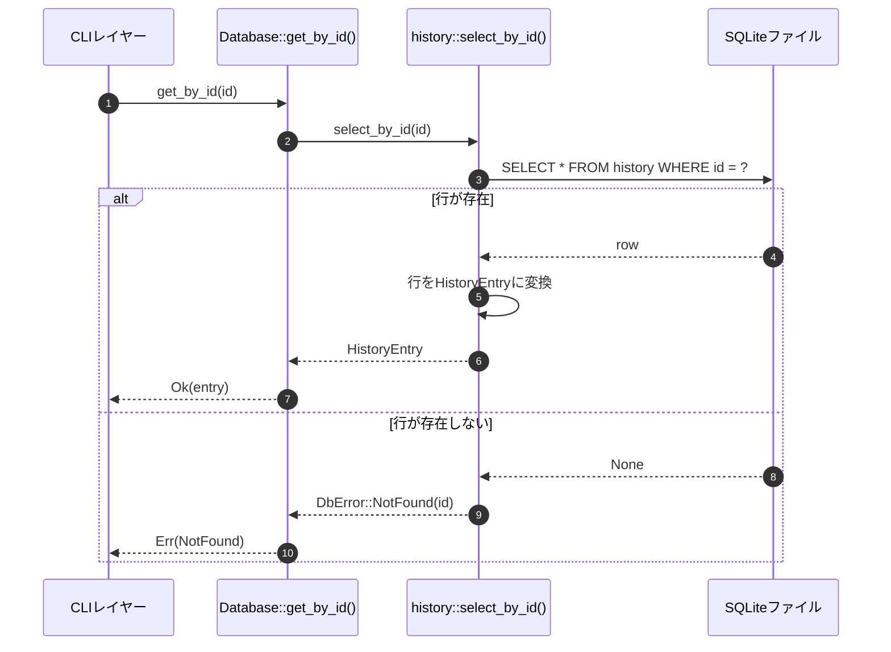
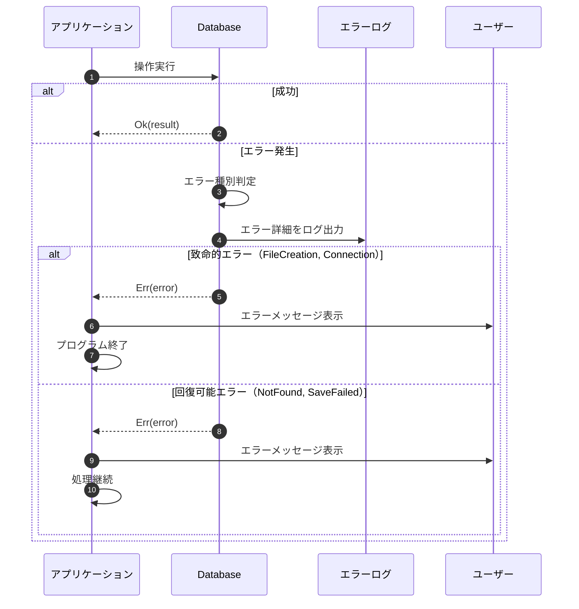

# 履歴管理 バックエンド設計書

## メタ情報

| 項目 | 内容 |
|------|------|
| ドキュメントID | DET-DB-001-BE |
| バージョン | 1.0.0 |
| 関連詳細設計書 | DET-DB-001 |

## 1. 公開API仕様

### 1.1 API一覧

| 関数名 | 引数 | 戻り値 | 説明 |
|-------|------|--------|------|
| `init()` | なし | `Result<Database, DbError>` | データベース接続を初期化 |
| `save()` | `HistoryEntry` | `Result<i64, DbError>` | 履歴を保存し、生成されたIDを返却 |
| `list()` | `limit: Option<usize>` | `Result<Vec<HistoryEntry>, DbError>` | 履歴一覧を取得（新しい順） |
| `get_by_id()` | `id: i64` | `Result<HistoryEntry, DbError>` | 指定IDの履歴を取得 |

### 1.2 型定義

#### Database 構造体

```rust
/// データベース接続を管理する構造体
pub struct Database {
    conn: rusqlite::Connection,
}

impl Database {
    /// データベースを初期化し、接続を確立する
    /// 
    /// # Errors
    /// - DBファイルの作成/接続に失敗した場合
    /// - スキーマの初期化に失敗した場合
    pub fn init() -> Result<Self, DbError> { /* ... */ }
    
    /// 履歴を保存する
    /// 
    /// # Arguments
    /// - `entry` - 保存する履歴データ
    /// 
    /// # Returns
    /// 生成された履歴ID
    /// 
    /// # Errors
    /// - INSERT操作に失敗した場合
    pub fn save(&self, entry: &HistoryEntry) -> Result<i64, DbError> { /* ... */ }
    
    /// 履歴一覧を取得する
    /// 
    /// # Arguments
    /// - `limit` - 取得件数の上限（Noneの場合は全件取得）
    /// 
    /// # Returns
    /// 作成日時降順でソートされた履歴配列
    /// 
    /// # Errors
    /// - SELECT操作に失敗した場合
    pub fn list(&self, limit: Option<usize>) -> Result<Vec<HistoryEntry>, DbError> { /* ... */ }
    
    /// 指定IDの履歴を取得する
    /// 
    /// # Arguments
    /// - `id` - 履歴ID
    /// 
    /// # Returns
    /// 履歴データ
    /// 
    /// # Errors
    /// - SELECT操作に失敗した場合
    /// - 指定IDの履歴が存在しない場合（DbError::NotFound）
    pub fn get_by_id(&self, id: i64) -> Result<HistoryEntry, DbError> { /* ... */ }
}
```

#### HistoryEntry 構造体

```rust
use chrono::{DateTime, Utc};

/// 履歴エントリを表す構造体
#[derive(Debug, Clone, PartialEq)]
pub struct HistoryEntry {
    /// 履歴ID（新規作成時はNone）
    pub id: Option<i64>,
    
    /// MML文字列（最大10,000文字）
    pub mml: String,
    
    /// 波形タイプ
    pub waveform: Waveform,
    
    /// 音量（0.0 - 1.0）
    pub volume: f32,
    
    /// BPM（30 - 300）
    pub bpm: u16,
    
    /// 作成日時（UTC）
    pub created_at: DateTime<Utc>,
}

impl HistoryEntry {
    /// 新規履歴エントリを作成する（IDとcreated_atは自動設定）
    /// 
    /// # Arguments
    /// - `mml` - MML文字列
    /// - `waveform` - 波形タイプ
    /// - `volume` - 音量（0.0 - 1.0）
    /// - `bpm` - BPM（30 - 300）
    pub fn new(mml: String, waveform: Waveform, volume: f32, bpm: u16) -> Self {
        Self {
            id: None,
            mml,
            waveform,
            volume,
            bpm,
            created_at: Utc::now(),
        }
    }
}
```

#### Waveform 列挙型

```rust
/// 波形タイプ
#[derive(Debug, Clone, Copy, PartialEq, Eq)]
pub enum Waveform {
    Sine,
    Sawtooth,
    Square,
}

impl Waveform {
    /// 文字列から波形タイプに変換
    pub fn from_str(s: &str) -> Result<Self, DbError> {
        match s {
            "sine" => Ok(Waveform::Sine),
            "sawtooth" => Ok(Waveform::Sawtooth),
            "square" => Ok(Waveform::Square),
            _ => Err(DbError::InvalidWaveform(s.to_string())),
        }
    }
    
    /// 波形タイプを文字列に変換
    pub fn as_str(&self) -> &'static str {
        match self {
            Waveform::Sine => "sine",
            Waveform::Sawtooth => "sawtooth",
            Waveform::Square => "square",
        }
    }
}
```

#### DbError 列挙型

```rust
use thiserror::Error;

/// データベース操作エラー
#[derive(Error, Debug)]
pub enum DbError {
    /// データベースファイルの作成失敗
    #[error("DB-E001: Failed to create database file: {0}")]
    FileCreation(String),
    
    /// データベース接続失敗
    #[error("DB-E002: Failed to connect to database: {0}")]
    Connection(String),
    
    /// スキーマ初期化失敗
    #[error("DB-E003: Failed to initialize schema: {0}")]
    SchemaInit(String),
    
    /// 履歴保存失敗
    #[error("DB-E004: Failed to save history: {0}")]
    SaveFailed(String),
    
    /// 履歴取得失敗
    #[error("DB-E005: Failed to fetch history: {0}")]
    FetchFailed(String),
    
    /// 履歴が存在しない
    #[error("DB-E006: History not found with id: {0}")]
    NotFound(i64),
    
    /// マイグレーション失敗
    #[error("DB-E007: Migration failed: {0}")]
    MigrationFailed(String),
    
    /// 無効な波形タイプ
    #[error("Invalid waveform type: {0}")]
    InvalidWaveform(String),
    
    /// rusqliteエラー
    #[error("Database error: {0}")]
    Rusqlite(#[from] rusqlite::Error),
    
    /// I/Oエラー
    #[error("I/O error: {0}")]
    Io(#[from] std::io::Error),
}
```

## 2. 処理フロー

### 2.1 データベース初期化フロー



### 2.2 履歴保存フロー



### 2.3 履歴一覧取得フロー



### 2.4 履歴取得フロー（ID指定）



## 3. 処理詳細

### 3.1 データベースパス解決

#### 実装方法

`dirs`クレートを使用してプラットフォーム固有のデータディレクトリを取得する。

```rust
use dirs;
use std::path::PathBuf;

fn get_db_path() -> Result<PathBuf, DbError> {
    let data_dir = if let Ok(xdg_data_home) = std::env::var("XDG_DATA_HOME") {
        PathBuf::from(xdg_data_home)
    } else {
        dirs::data_dir()
            .ok_or_else(|| DbError::FileCreation("Cannot determine data directory".to_string()))?
    };
    
    let app_dir = data_dir.join("sine-mml");
    std::fs::create_dir_all(&app_dir)?;
    
    Ok(app_dir.join("history.db"))
}
```

#### パス例

| プラットフォーム | デフォルトパス |
|-----------------|---------------|
| Linux | `~/.local/share/sine-mml/history.db` |
| macOS | `~/Library/Application Support/sine-mml/history.db` |
| Windows | `C:\Users\{username}\AppData\Roaming\sine-mml\history.db` |

### 3.2 バリデーション

| 項目 | 条件 | エラー時の処理 |
|------|------|---------------|
| MML文字列長 | 1文字以上、10,000文字以下 | `DbError::SaveFailed` を返却 |
| 音量範囲 | 0.0 <= volume <= 1.0 | `DbError::SaveFailed` を返却 |
| BPM範囲 | 30 <= bpm <= 300 | `DbError::SaveFailed` を返却 |

### 3.3 トランザクション管理

- **履歴保存**: 各INSERT操作をトランザクション内で実行（自動コミット）
- **ロールバック**: エラー発生時は自動的にロールバック
- **WALモード**: Write-Ahead Loggingを有効化してパフォーマンス向上

```rust
// 接続時にWALモードを有効化
conn.execute_batch("PRAGMA journal_mode=WAL;")?;
```

## 4. エラーハンドリング

### 4.1 エラー種別と対処

| エラー種別 | 発生条件 | ユーザーへのメッセージ | 内部処理 |
|-----------|---------|---------------------|---------|
| FileCreation | データディレクトリの作成失敗 | "データディレクトリを作成できませんでした。権限を確認してください。" | エラーログ出力、プログラム終了 |
| Connection | DBファイルへの接続失敗 | "データベースファイルが破損している可能性があります。" | バックアップ作成後、DBファイルを削除して再作成 |
| SchemaInit | テーブル作成失敗 | "データベースの初期化に失敗しました。" | SQLエラー詳細をログ出力 |
| SaveFailed | INSERT失敗 | "履歴の保存に失敗しました。" | トランザクションロールバック |
| NotFound | 存在しないID指定 | "指定されたIDの履歴が見つかりません。" | エラーを返却 |

### 4.2 エラーハンドリングフロー



## 5. SQL例

### 5.1 履歴保存

```sql
INSERT INTO history (mml, waveform, volume, bpm, created_at)
VALUES (?, ?, ?, ?, ?);
```

**パラメータ例:**
```rust
params![
    "CDEFGAB",
    "sine",
    0.5,
    120,
    "2026-01-10 12:34:56"
]
```

### 5.2 履歴一覧取得（全件）

```sql
SELECT id, mml, waveform, volume, bpm, created_at
FROM history
ORDER BY created_at DESC;
```

### 5.3 履歴一覧取得（件数制限）

```sql
SELECT id, mml, waveform, volume, bpm, created_at
FROM history
ORDER BY created_at DESC
LIMIT ?;
```

**パラメータ例:**
```rust
params![10] // 最新10件
```

### 5.4 履歴取得（ID指定）

```sql
SELECT id, mml, waveform, volume, bpm, created_at
FROM history
WHERE id = ?;
```

**パラメータ例:**
```rust
params![42] // ID = 42
```

## 6. 依存クレート

| クレート | バージョン | 用途 |
|---------|-----------|------|
| rusqlite | 0.38 | SQLite操作（bundled機能でSQLiteを静的リンク） |
| thiserror | 1.0 | エラー型の自動導出 |
| dirs | 5.0 | プラットフォーム固有のディレクトリパス取得 |
| chrono | 0.4 | 日時操作 |

## 7. 使用例

### 7.1 データベース初期化と履歴保存

```rust
use sine_mml::db::{Database, HistoryEntry, Waveform};

fn main() -> Result<(), Box<dyn std::error::Error>> {
    // データベース初期化
    let db = Database::init()?;
    
    // 履歴エントリ作成
    let entry = HistoryEntry::new(
        "CDEFGAB".to_string(),
        Waveform::Sine,
        0.5,
        120,
    );
    
    // 履歴保存
    let id = db.save(&entry)?;
    println!("Saved with ID: {}", id);
    
    Ok(())
}
```

### 7.2 履歴一覧取得と表示

```rust
use sine_mml::db::Database;

fn main() -> Result<(), Box<dyn std::error::Error>> {
    let db = Database::init()?;
    
    // 最新10件を取得
    let histories = db.list(Some(10))?;
    
    for history in histories {
        println!("ID: {}, MML: {}, BPM: {}, Created: {}",
            history.id.unwrap(),
            history.mml,
            history.bpm,
            history.created_at.format("%Y-%m-%d %H:%M:%S")
        );
    }
    
    Ok(())
}
```

### 7.3 履歴取得（ID指定）

```rust
use sine_mml::db::{Database, DbError};

fn main() -> Result<(), Box<dyn std::error::Error>> {
    let db = Database::init()?;
    
    let id = 42;
    match db.get_by_id(id) {
        Ok(entry) => {
            println!("Found: {}", entry.mml);
        }
        Err(DbError::NotFound(_)) => {
            eprintln!("History ID {} not found", id);
        }
        Err(e) => return Err(e.into()),
    }
    
    Ok(())
}
```

---

## 変更履歴

| 日付 | バージョン | 変更内容 | 担当者 |
|:---|:---|:---|:---|
| 2026-01-10 | 1.0.0 | 初版作成 | Antigravity |
