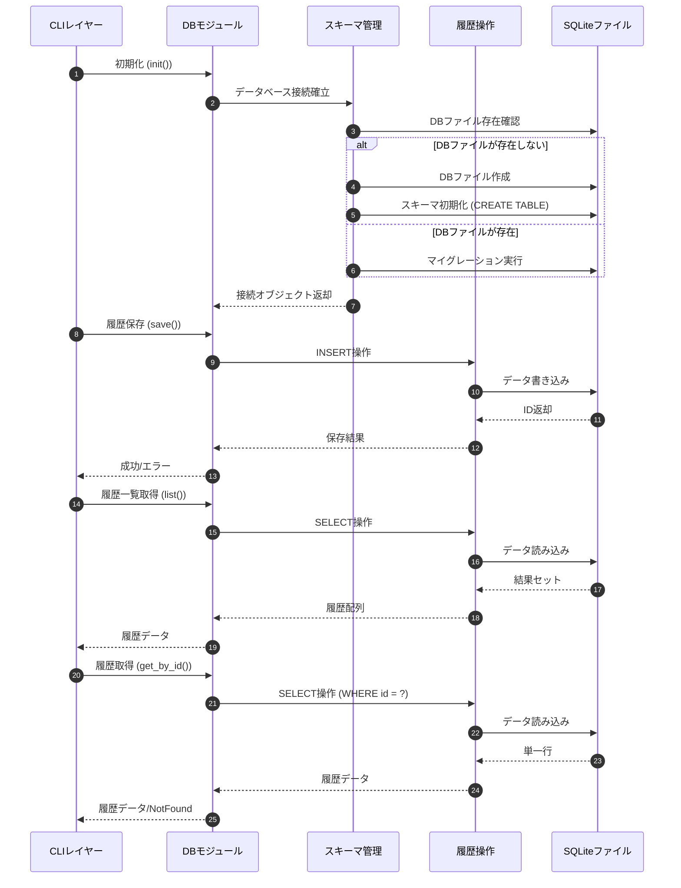

# 履歴管理 詳細設計書

## メタ情報

| 項目 | 内容 |
|------|------|
| ドキュメントID | DET-DB-001 |
| バージョン | 1.0.0 |
| 親機能 | データベース |
| 含まれる機能ID | F-007 (履歴自動保存), F-008 (履歴一覧表示), F-009 (履歴再生), F-010 (WAVエクスポート) |
| 関連基本設計書 | BASIC-CLI-001 |
| 作成日 | 2026-01-10 |

## 1. 概要

本モジュールは、MML演奏履歴の永続化とCRUD操作を提供する。SQLiteをバンドルした`rusqlite`クレートを使用し、ユーザーのローカル環境にデータベースファイルを保存する。データベースファイルの配置はXDG Base Directory Specificationに準拠し、マルチプラットフォーム対応（Linux/macOS/Windows）を実現する。

### 1.1 全体処理フロー

## 2. 機能要件

### 2.1 対象機能

| 機能ID | 機能名 | 概要 | 優先度 |
|--------|--------|------|--------|
| F-007 | 履歴自動保存 | 演奏成功時にMML、波形、音量、BPM、タイムスタンプをDBに保存 | 必須 |
| F-008 | 履歴一覧表示 | DBから過去の履歴を全件取得し、新しい順にソート | 必須 |
| F-009 | 履歴再生 | 指定したIDの履歴を取得し、再演奏 | 必須 |
| F-010 | WAVエクスポート | 指定したIDの履歴を取得し、WAVファイルとして出力 | 必須 |

### 2.2 ビジネスルール

| ルールID | 内容 |
|---------|------|
| BR-DB-001 | データベースファイルはユーザーのデータディレクトリに配置する（`$XDG_DATA_HOME/sine-mml/history.db` または `~/.local/share/sine-mml/history.db` または `%APPDATA%\sine-mml\history.db`） |
| BR-DB-002 | 履歴は作成日時の降順で取得する（最新が先頭） |
| BR-DB-003 | 履歴の削除機能はPhase 1では提供しない（将来拡張） |
| BR-DB-004 | データベースファイルが破損している場合、自動的に再作成する |
| BR-DB-005 | MML文字列は最大10,000文字まで保存可能 |

## 3. 設計書一覧

| 設計書 | パス | 説明 |
|--------|------|------|
| バックエンド設計書 | [./バックエンド設計書.md](./バックエンド設計書.md) | 公開API仕様とRust型定義 |
| データベース設計書 | [./データベース設計書.md](./データベース設計書.md) | テーブル定義とSQL詳細 |

## 4. モジュール構成

### 4.1 ファイル構造

- `src/db/`
  - `mod.rs` - 公開APIの定義、初期化処理
  - `schema.rs` - テーブル定義、マイグレーション処理
  - `history.rs` - 履歴データのCRUD操作

### 4.2 責務分離

| ファイル | 責務 |
|---------|------|
| `mod.rs` | DB接続の初期化、パス解決、エラー型定義、公開API提供 |
| `schema.rs` | テーブル作成、バージョン管理、マイグレーション実行 |
| `history.rs` | 履歴の保存・取得・一覧取得のSQL実行 |

## 5. エラーコード一覧

| コード | HTTPステータス | 説明 | 対処 |
|--------|---------------|------|------|
| DB-E001 | - | データベースファイルの作成失敗 | ディレクトリの権限を確認、存在しない場合は自動作成を試行 |
| DB-E002 | - | データベース接続失敗 | ファイルの破損を検知し、バックアップ作成後に再作成 |
| DB-E003 | - | スキーマ初期化失敗 | SQLエラーの詳細をログ出力、開発者向けエラーメッセージを表示 |
| DB-E004 | - | 履歴保存失敗 (INSERT) | トランザクションロールバック、ユーザーに再試行を促す |
| DB-E005 | - | 履歴取得失敗 (SELECT) | クエリの詳細をログ出力 |
| DB-E006 | - | 履歴が存在しない (NotFound) | ユーザーに有効なIDを入力するよう促す |
| DB-E007 | - | マイグレーション失敗 | バージョン互換性エラー、DBファイルの再作成を提案 |

## 6. テスト方針

### 6.1 ユニットテスト

| テスト項目 | 内容 |
|-----------|------|
| スキーマ初期化テスト | 空のDBに対してテーブルが正常に作成されることを確認 |
| 履歴保存テスト | INSERT操作が成功し、IDが返却されることを確認 |
| 履歴一覧取得テスト | 複数の履歴が作成日時降順で取得されることを確認 |
| 履歴取得テスト（正常系） | 存在するIDで履歴が取得できることを確認 |
| 履歴取得テスト（異常系） | 存在しないIDでNotFoundエラーが返ることを確認 |
| パス解決テスト | 各OS環境で正しいパスが生成されることを確認（モックを使用） |

### 6.2 統合テスト

| テスト項目 | 内容 |
|-----------|------|
| E2Eテスト | `play` → 履歴保存 → `history` → `export` の一連の流れを検証 |
| マイグレーションテスト | 旧バージョンのDBファイルが新バージョンで正常に開けることを確認 |

## 7. 非機能要件

### 7.1 パフォーマンス

| 項目 | 要件 |
|------|------|
| 履歴保存 | 100ms以内 |
| 履歴一覧取得 | 1000件まで500ms以内 |
| 履歴取得（ID指定） | 50ms以内 |

### 7.2 信頼性

| 項目 | 要件 |
|------|------|
| データ整合性 | WAL (Write-Ahead Logging) モードを有効化 |
| 同時書き込み | 単一プロセスからのアクセスのみを想定（ロック不要） |
| バックアップ | ユーザーが手動でDBファイルをコピー可能 |

## 8. 未解決課題

| ID | 課題内容 | 対応方針 |
|----|----------|----------|
| I-DB-001 | 履歴の削除機能 | Phase 2 で実装を検討（論理削除 vs 物理削除） |
| I-DB-002 | 履歴の検索機能（MML文字列による部分一致） | Phase 2 で実装を検討（FTSインデックスの使用） |
| I-DB-003 | 大量履歴のページネーション | Phase 2 で実装を検討（LIMIT/OFFSET） |

---

## 変更履歴

| 日付 | バージョン | 変更内容 | 担当者 |
|:---|:---|:---|:---|
| 2026-01-10 | 1.0.0 | 初版作成 | Antigravity |
