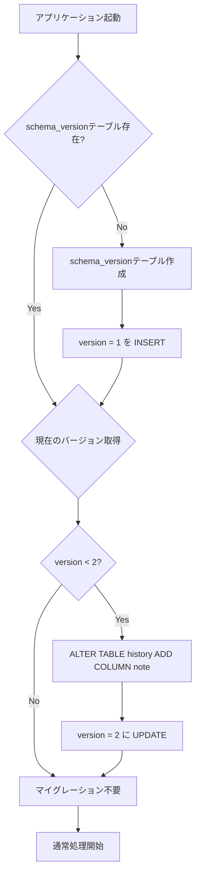

# DBマイグレーション v1→v2 詳細設計

## 概要

BASIC-CLI-003に基づくDBスキーママイグレーション（v1→v2）の詳細設計ドキュメント。

## 変更内容

| 変更種別 | テーブル | カラム | 型 | 説明 |
|---------|---------|--------|-----|------|
| ADD COLUMN | history | note | TEXT NULL | 履歴メモ（500文字以内） |

## 詳細設計書

| ドキュメント | 概要 | ステータス |
|------------|------|-----------|
| [詳細設計書.md](./詳細設計書.md) | スキーマバージョン管理、マイグレーション処理 | ✅ 作成済み |
| [データベース設計書.md](./データベース設計書.md) | テーブル定義、DDL、マイグレーションスクリプト | ✅ 作成済み |

## 関連ドキュメント

- 基本設計書: [BASIC-CLI-003_MML-Syntax-Extension.md](../../basic/BASIC-CLI-003_MML-Syntax-Extension.md)
- 要件定義書: [REQ-CLI-003_MML-Syntax-Extension.md](../../../requirements/REQ-CLI-003_MML-Syntax-Extension.md)
- 履歴管理機能: [history-management](../history-management/README.md)

## 影響を受けるモジュール

- `src/db/schema.rs` - スキーマバージョン定数、マイグレーション関数
- `src/db/history.rs` - `note`フィールド対応

## スキーマ比較

### v1（現行）
```sql
CREATE TABLE history (
    id INTEGER PRIMARY KEY AUTOINCREMENT,
    mml TEXT NOT NULL,
    waveform TEXT NOT NULL CHECK(waveform IN ('sine', 'sawtooth', 'square')),
    volume REAL NOT NULL CHECK(volume >= 0.0 AND volume <= 1.0),
    bpm INTEGER NOT NULL CHECK(bpm >= 30 AND bpm <= 300),
    created_at TEXT NOT NULL
);
```

### v2（変更後）
```sql
CREATE TABLE history (
    id INTEGER PRIMARY KEY AUTOINCREMENT,
    mml TEXT NOT NULL,
    waveform TEXT NOT NULL CHECK(waveform IN ('sine', 'sawtooth', 'square')),
    volume REAL NOT NULL CHECK(volume >= 0.0 AND volume <= 1.0),
    bpm INTEGER NOT NULL CHECK(bpm >= 30 AND bpm <= 300),
    note TEXT NULL CHECK(length(note) <= 500),  -- 追加
    created_at TEXT NOT NULL
);
```

## マイグレーションフロー



## 重要な実装ポイント

1. **トランザクション使用**: マイグレーション処理全体をトランザクションで囲む
2. **冪等性**: 何度実行しても同じ結果になる設計
3. **ロールバック**: 失敗時に元の状態に戻せる
4. **既存データ保持**: ALTER TABLE ADD COLUMN は既存レコードを保持（note=NULL）

## ステータス

| ドキュメント | ステータス |
|------------|-----------|
| 詳細設計書.md | ✅ 作成済み |
| データベース設計書.md | ✅ 作成済み |

## 変更履歴

| 日付 | バージョン | 変更内容 |
|------|------------|----------|
| 2026-01-11 | 1.0.0 | 初版作成（詳細設計書・データベース設計書） |
