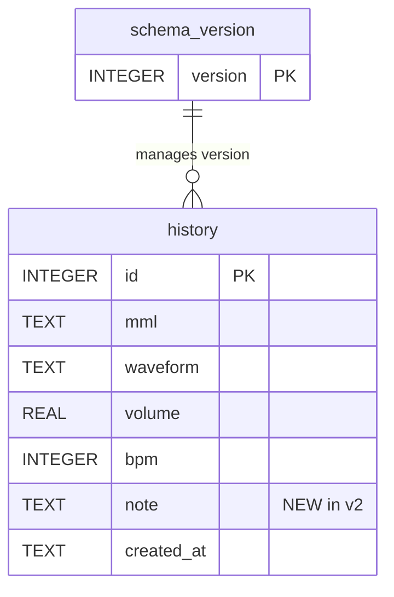
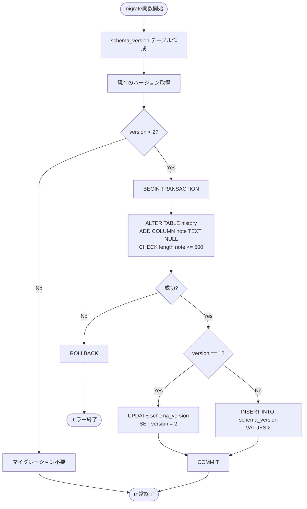

# DBマイグレーション v1→v2 データベース設計書

## 1. ドキュメント情報

| 項目 | 内容 |
|------|------|
| ドキュメントID | DET-MIG-001 |
| バージョン | 1.0.0 |
| ステータス | ドラフト |
| 作成日 | 2026-01-11 |
| 最終更新日 | 2026-01-11 |
| 作成者 | detailed-design-writer |
| 関連文書 | BASIC-CLI-003_MML-Syntax-Extension.md (v1.0.1)<br>REQ-CLI-003_MML-Syntax-Extension.md (v1.0.0)<br>詳細設計書.md (v1.0.0) |

---

## 2. ER図



---

## 3. テーブル定義

### 3.1 history テーブル（v1 vs v2 比較）

#### v1スキーマ（現行）

| カラム名 | 型 | NULL | デフォルト | 制約 | 説明 |
|:---|:---|:---:|:---:|:---|:---|
| id | INTEGER | NO | AUTOINCREMENT | PRIMARY KEY | 履歴ID |
| mml | TEXT | NO | - | - | MML文字列 |
| waveform | TEXT | NO | - | CHECK(waveform IN ('sine', 'sawtooth', 'square')) | 波形種別 |
| volume | REAL | NO | - | CHECK(volume >= 0.0 AND volume <= 1.0) | 音量（0.0-1.0） |
| bpm | INTEGER | NO | - | CHECK(bpm >= 30 AND bpm <= 300) | テンポ（30-300） |
| created_at | TEXT | NO | - | - | 作成日時（ISO 8601） |

#### v2スキーマ（変更後）

| カラム名 | 型 | NULL | デフォルト | 制約 | 説明 | 変更種別 |
|:---|:---|:---:|:---:|:---|:---|:---|
| id | INTEGER | NO | AUTOINCREMENT | PRIMARY KEY | 履歴ID | - |
| mml | TEXT | NO | - | - | MML文字列 | - |
| waveform | TEXT | NO | - | CHECK(waveform IN ('sine', 'sawtooth', 'square')) | 波形種別 | - |
| volume | REAL | NO | - | CHECK(volume >= 0.0 AND volume <= 1.0) | 音量（0.0-1.0） | - |
| bpm | INTEGER | NO | - | CHECK(bpm >= 30 AND bpm <= 300) | テンポ（30-300） | - |
| note | TEXT | **YES** | NULL | CHECK(length(note) <= 500) | 履歴メモ（最大500文字） | **追加** |
| created_at | TEXT | NO | - | - | 作成日時（ISO 8601） | - |

**インデックス**

| インデックス名 | カラム | 種類 | 説明 |
|---------------|--------|------|------|
| idx_history_created_at | created_at DESC | INDEX | 作成日時の降順検索用 |

**DDL（v2）**

```sql
CREATE TABLE IF NOT EXISTS history (
    id INTEGER PRIMARY KEY AUTOINCREMENT,
    mml TEXT NOT NULL,
    waveform TEXT NOT NULL CHECK(waveform IN ('sine', 'sawtooth', 'square')),
    volume REAL NOT NULL CHECK(volume >= 0.0 AND volume <= 1.0),
    bpm INTEGER NOT NULL CHECK(bpm >= 30 AND bpm <= 300),
    note TEXT NULL CHECK(length(note) <= 500),
    created_at TEXT NOT NULL
);

CREATE INDEX IF NOT EXISTS idx_history_created_at ON history(created_at DESC);
```

### 3.2 schema_version テーブル

| カラム名 | 型 | NULL | デフォルト | 制約 | 説明 |
|:---|:---|:---:|:---:|:---|:---|
| version | INTEGER | NO | - | PRIMARY KEY | スキーマバージョン番号 |

**DDL**

```sql
CREATE TABLE IF NOT EXISTS schema_version (
    version INTEGER PRIMARY KEY
);
```

**データ例**

| version | 説明 |
|---------|------|
| 1 | v1スキーマ（`note`カラムなし） |
| 2 | v2スキーマ（`note`カラムあり） |

---

## 4. カラム仕様

### 4.1 history.note カラム（新規）

| 項目 | 内容 |
|------|------|
| **カラム名** | note |
| **データ型** | TEXT |
| **NULL許可** | YES |
| **デフォルト値** | NULL |
| **制約** | CHECK(length(note) <= 500) |
| **説明** | 履歴に付与するメモ（任意）。UTF-8文字列（絵文字も可）。 |
| **ビジネスルール** | BR-058: メモは任意（指定しなくても動作する）<br>BR-059: メモの最大長は 500 文字<br>BR-060: メモは UTF-8 文字列（絵文字も可） |
| **用途** | ユーザーが履歴を見返したときに何の曲か分かるようにする |
| **例** | "My first melody", "Loop test", "あいうえお🎵" |

### 4.2 schema_version.version カラム

| 項目 | 内容 |
|------|------|
| **カラム名** | version |
| **データ型** | INTEGER |
| **NULL許可** | NO |
| **デフォルト値** | - |
| **制約** | PRIMARY KEY |
| **説明** | 現在のDBスキーマバージョン番号 |
| **用途** | マイグレーション処理の判定に使用 |
| **例** | 1（v1スキーマ）、2（v2スキーマ） |

---

## 5. インデックス定義

### 5.1 既存インデックス（維持）

| インデックス名 | テーブル | カラム | 種類 | 目的 |
|---------------|---------|--------|------|------|
| idx_history_created_at | history | created_at DESC | INDEX | 履歴一覧表示時の高速化（新しい順） |

### 5.2 新規インデックス

なし（`note`カラムは検索対象外のため、インデックス不要）

---

## 6. 制約定義

### 6.1 PRIMARY KEY 制約

| テーブル | カラム | 制約名 | 説明 |
|---------|--------|--------|------|
| history | id | - | 履歴の一意識別子 |
| schema_version | version | - | スキーマバージョンの一意識別子 |

### 6.2 CHECK 制約

| テーブル | カラム | 制約式 | 説明 |
|---------|--------|--------|------|
| history | waveform | `waveform IN ('sine', 'sawtooth', 'square')` | 波形種別の制限 |
| history | volume | `volume >= 0.0 AND volume <= 1.0` | 音量の範囲制限 |
| history | bpm | `bpm >= 30 AND bpm <= 300` | テンポの範囲制限 |
| history | note | `length(note) <= 500` | **メモの長さ制限（新規）** |

### 6.3 NOT NULL 制約

| テーブル | カラム | 説明 |
|---------|--------|------|
| history | id, mml, waveform, volume, bpm, created_at | 必須項目 |
| schema_version | version | 必須項目 |

**注意**: `history.note` は NULL 許可（任意項目）

---

## 7. マイグレーションスクリプト

### 7.1 v1 → v2 マイグレーション

#### マイグレーションSQL

```sql
-- スキーマバージョンテーブルの作成（初回のみ）
CREATE TABLE IF NOT EXISTS schema_version (
    version INTEGER PRIMARY KEY
);

-- 現在のバージョン取得（存在しない場合は v1 とみなす）
-- ※ アプリケーションコードで実装

-- v1 → v2 マイグレーション（version < 2 の場合のみ実行）
BEGIN TRANSACTION;

-- note カラム追加
ALTER TABLE history ADD COLUMN note TEXT NULL CHECK(length(note) <= 500);

-- バージョン更新
-- version == 1 の場合
UPDATE schema_version SET version = 2;

-- version が存在しない場合（初回）
-- INSERT INTO schema_version (version) VALUES (2);

COMMIT;
```

#### ロールバックSQL

```sql
-- SQLiteは ALTER TABLE DROP COLUMN を直接サポートしていないため、
-- ロールバックはトランザクションのROLLBACKで対応
ROLLBACK;
```

### 7.2 マイグレーション処理フロー



### 7.3 マイグレーション実装例（Rust）

```rust
// src/db/schema.rs

use crate::db::DbError;
use rusqlite::Connection;

pub const CURRENT_VERSION: i64 = 2;

/// Gets the current schema version.
///
/// # Returns
///
/// - `Ok(version)` - Current version (1 if schema_version table is empty)
/// - `Err(DbError)` - Database error
fn get_current_version(conn: &Connection) -> Result<i64, DbError> {
    let version: Result<i64, _> = conn.query_row(
        "SELECT version FROM schema_version",
        [],
        |row| row.get(0),
    );

    match version {
        Ok(v) => Ok(v),
        Err(_) => Ok(1),  // テーブルが空 = v1
    }
}

/// Migrates the database schema to the current version.
///
/// # Errors
///
/// Returns `DbError` if migration fails.
pub fn migrate(conn: &Connection) -> Result<(), DbError> {
    // schema_version テーブル作成（トランザクション外）
    conn.execute(
        "CREATE TABLE IF NOT EXISTS schema_version (version INTEGER PRIMARY KEY)",
        [],
    )?;

    let version = get_current_version(conn)?;

    if version < 2 {
        // v1 → v2 マイグレーション
        let tx = conn.transaction()?;
        
        // note カラム追加
        tx.execute(
            "ALTER TABLE history ADD COLUMN note TEXT NULL CHECK(length(note) <= 500)",
            [],
        )?;

        // バージョン更新
        if version == 1 {
            tx.execute("UPDATE schema_version SET version = ?", [CURRENT_VERSION])?;
        } else {
            tx.execute("INSERT INTO schema_version (version) VALUES (?)", [CURRENT_VERSION])?;
        }

        tx.commit()?;
    }

    Ok(())
}
```

---

## 8. データ型マッピング（Rust ↔ SQLite）

### 8.1 history テーブル

| カラム名 | SQLite型 | Rust型 | 変換方法 |
|---------|---------|--------|---------|
| id | INTEGER | `i64` | `row.get(0)` |
| mml | TEXT | `String` | `row.get(1)` |
| waveform | TEXT | `String` | `row.get(2)` |
| volume | REAL | `f32` | `row.get(3)` |
| bpm | INTEGER | `u16` | `row.get::<_, i64>(4) as u16` |
| note | TEXT | `Option<String>` | `row.get(5)` |
| created_at | TEXT | `String` | `row.get(6)` |

### 8.2 schema_version テーブル

| カラム名 | SQLite型 | Rust型 | 変換方法 |
|---------|---------|--------|---------|
| version | INTEGER | `i64` | `row.get(0)` |

### 8.3 Rust構造体定義

```rust
// src/db/history.rs

#[derive(Debug, Clone)]
pub struct HistoryEntry {
    pub id: i64,
    pub mml: String,
    pub waveform: String,
    pub volume: f32,
    pub bpm: u16,
    pub note: Option<String>,  // 新規フィールド
    pub created_at: String,
}
```

---

## 9. マイグレーション安全性

### 9.1 既存データ保持

| 項目 | 保証内容 |
|------|---------|
| **既存レコード** | `ALTER TABLE ADD COLUMN` により全て保持される |
| **既存カラム** | 変更なし（`note`カラムのみ追加） |
| **既存インデックス** | 変更なし |
| **既存制約** | 変更なし |

### 9.2 NULL許可による互換性

| 項目 | 詳細 |
|------|------|
| **既存レコードの`note`** | NULL となる（デフォルト値） |
| **新規レコードの`note`** | 任意（指定しなければ NULL） |
| **履歴表示** | NULL は "-" と表示（ユーザビリティ） |

### 9.3 トランザクション保証

| 項目 | 保証内容 |
|------|---------|
| **ACID特性** | SQLiteのトランザクションにより保証 |
| **ロールバック** | ALTER TABLE 失敗時は自動ロールバック |
| **冪等性** | 複数回実行しても安全（`version`チェックにより） |

### 9.4 マイグレーション失敗時の状態

| 項目 | 状態 |
|------|------|
| history テーブル | v1 スキーマのまま（`note` カラムなし） |
| schema_version テーブル | version = 1（または未作成） |
| 既存データ | 変更なし |
| アプリケーション | 起動失敗（エラーメッセージ表示） |

---

## 10. パフォーマンス考慮事項

### 10.1 マイグレーション時間

| データ量 | 予想時間 | 測定方法 |
|---------|---------|---------|
| 空テーブル | 10ms以内 | ALTER TABLE 実行時間 |
| 1,000件 | 100ms以内 | ベンチマーク |
| 10,000件 | 500ms以内 | ベンチマーク |

### 10.2 note カラムのストレージ影響

| 項目 | 影響 |
|------|------|
| **NULL値のストレージ** | 1バイト（SQLiteの最適化） |
| **500文字のメモ** | 約500-1500バイト（UTF-8エンコーディング） |
| **平均的なメモ（50文字）** | 約50-150バイト |

### 10.3 インデックス不要の理由

- `note`カラムは検索対象外（履歴一覧表示のみ）
- フルテキスト検索は Phase 3.0 で検討（I-011）
- インデックスなしでもパフォーマンス影響なし

---

## 11. セキュリティ考慮事項

### 11.1 SQLインジェクション対策

| 項目 | 対策 |
|------|------|
| **パラメータバインディング** | rusqliteのプリペアドステートメント使用 |
| **ユーザー入力の検証** | CHECK制約による長さ制限（500文字） |
| **エスケープ処理** | rusqliteが自動処理 |

### 11.2 データ検証

| 項目 | 検証内容 |
|------|---------|
| **note長さ** | CHECK(length(note) <= 500) |
| **NULL許可** | 任意項目のため NULL 許可 |
| **文字エンコーディング** | UTF-8（SQLiteのデフォルト） |

---

## 12. エラーハンドリング

### 12.1 マイグレーションエラー

| エラーケース | 原因 | エラーメッセージ | 対応 |
|-------------|------|----------------|------|
| ALTER TABLE 失敗 | SQLite エラー（権限不足、ディスク容量不足等） | `Failed to migrate database: {reason}` | ROLLBACK、起動失敗 |
| UPDATE/INSERT 失敗 | schema_version への書き込みエラー | `Failed to update schema version: {reason}` | ROLLBACK、起動失敗 |
| トランザクション失敗 | 予期しないエラー | `Database transaction failed: {reason}` | ROLLBACK、起動失敗 |

### 12.2 note カラムのエラー

| エラーケース | 原因 | エラーメッセージ | 対応 |
|-------------|------|----------------|------|
| note 長さ制約違反 | 500文字超過 | `CHECK constraint failed: note` | INSERT/UPDATE 失敗 |

### 12.3 エラーメッセージ例

```
Error: Failed to migrate database: disk I/O error
  Caused by: unable to open database file

Hint: Check disk space and file permissions.
```

```
Error: Failed to update schema version: constraint failed
  Caused by: UNIQUE constraint failed: schema_version.version

Hint: This is a bug. Please report to the maintainer.
```

---

## 13. テストケース

### 13.1 マイグレーションテスト

| テストID | テストケース | 期待結果 |
|---------|-------------|---------|
| TC-MIG-001 | 新規DB作成時のマイグレーション | v2スキーマで作成、`note`カラム存在、version=2 |
| TC-MIG-002 | v1 DB からのマイグレーション | `note`カラム追加、既存データ保持、version=2 |
| TC-MIG-003 | v2 DB での再実行（冪等性） | 変更なし、エラーなし |
| TC-MIG-004 | マイグレーション失敗時のロールバック | v1スキーマのまま、version=1 |
| TC-MIG-005 | note カラムの制約チェック | 500文字以下: 成功、501文字: エラー |

### 13.2 データ整合性テスト

| テストID | テストケース | 期待結果 |
|---------|-------------|---------|
| TC-DATA-001 | 既存レコードの`note`値 | NULL |
| TC-DATA-002 | 新規レコードの`note`値（指定なし） | NULL |
| TC-DATA-003 | 新規レコードの`note`値（指定あり） | 指定した値 |
| TC-DATA-004 | UTF-8文字列（絵文字含む） | 正常に保存・取得 |

---

## 14. 運用考慮事項

### 14.1 バックアップ推奨

| タイミング | 推奨事項 |
|-----------|---------|
| **マイグレーション前** | DBファイルのバックアップ推奨 |
| **定期バックアップ** | ユーザー責任（アプリケーションは提供しない） |

### 14.2 マイグレーション実行タイミング

| タイミング | 詳細 |
|-----------|------|
| **アプリケーション起動時** | `Database::init()` 内で自動実行 |
| **手動実行** | 非対応（自動実行のみ） |

### 14.3 ロールバック手順

マイグレーション失敗時は自動ロールバックされるため、手動ロールバックは不要。

ただし、以下の場合は手動復旧が必要：

1. **マイグレーション後にアプリケーションが異常終了**
   - バックアップから復元
   - または `note` カラムを手動削除（非推奨）

2. **v2スキーマをv1に戻したい場合**
   - SQLiteは `ALTER TABLE DROP COLUMN` を直接サポートしていないため、テーブル再作成が必要
   - 手順:
     ```sql
     -- 1. 一時テーブル作成
     CREATE TABLE history_backup AS 
     SELECT id, mml, waveform, volume, bpm, created_at FROM history;
     
     -- 2. 既存テーブル削除
     DROP TABLE history;
     
     -- 3. v1スキーマで再作成
     CREATE TABLE history (...);  -- v1 DDL
     
     -- 4. データ復元
     INSERT INTO history SELECT * FROM history_backup;
     
     -- 5. 一時テーブル削除
     DROP TABLE history_backup;
     
     -- 6. バージョン更新
     UPDATE schema_version SET version = 1;
     ```

---

## 15. 関連ドキュメント

| ドキュメント | パス | 説明 |
|-------------|------|------|
| 基本設計書 | [BASIC-CLI-003_MML-Syntax-Extension.md](../../basic/BASIC-CLI-003_MML-Syntax-Extension.md) | MML構文拡張の基本設計 |
| 要件定義書 | [REQ-CLI-003_MML-Syntax-Extension.md](../../../requirements/REQ-CLI-003_MML-Syntax-Extension.md) | 要件定義 |
| 詳細設計書 | [詳細設計書.md](./詳細設計書.md) | DBマイグレーション v1→v2 の詳細設計 |
| 履歴メモ機能 詳細設計書 | [history-management/履歴メモ機能/詳細設計書.md](../history-management/履歴メモ機能/詳細設計書.md) | 履歴メモ機能の詳細設計 |

---

## 16. 変更履歴

| 日付 | バージョン | 変更内容 | 担当者 |
|:---|:---|:---|:---|
| 2026-01-11 | 1.0.0 | 初版作成 | detailed-design-writer |
