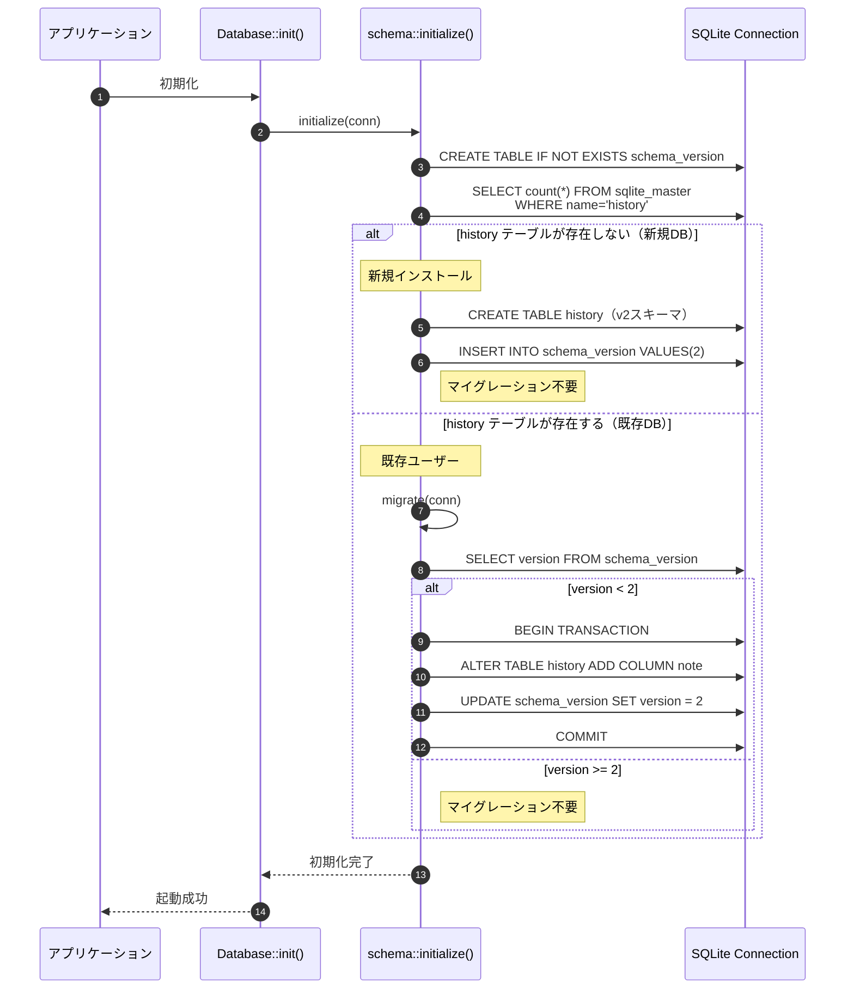
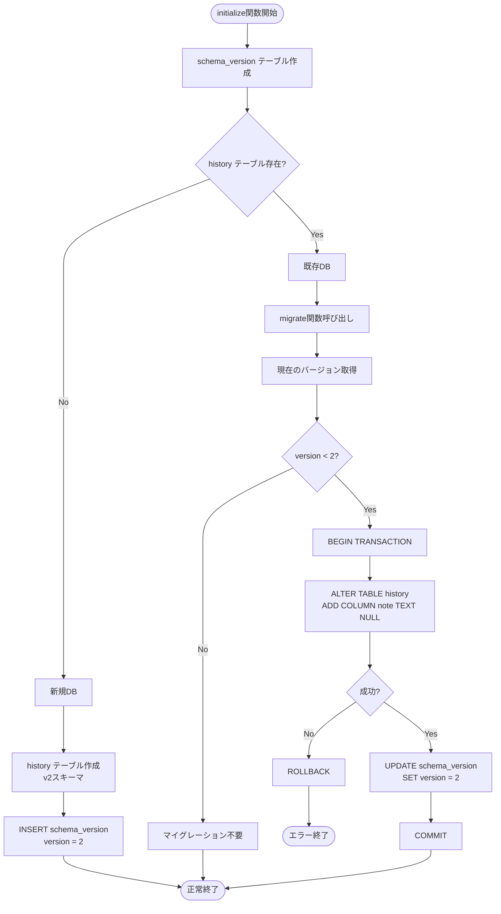
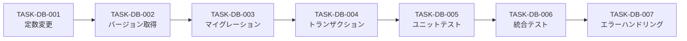

# DBマイグレーション v1→v2 詳細設計書

## 1. ドキュメント情報

| 項目 | 内容 |
|------|------|
| ドキュメントID | DETAIL-DB-001 |
| バージョン | 1.0.0 |
| ステータス | ドラフト |
| 作成日 | 2026-01-11 |
| 最終更新日 | 2026-01-11 |
| 作成者 | detailed-design-writer |
| 関連文書 | BASIC-CLI-003_MML-Syntax-Extension.md (v1.0.1)<br>REQ-CLI-003_MML-Syntax-Extension.md (v1.0.0) |

---

## 2. 機能概要

### 2.1 目的

sine-mml v2.0の履歴メモ機能（F-025）を実現するため、既存のDBスキーマ（v1）から新スキーマ（v2）へのマイグレーションを実装する。

### 2.2 背景

- **現状**: 履歴テーブルに `note` カラムが存在しない（v1スキーマ）
- **要件**: `--note` オプションで履歴にメモを付与できるようにする
- **課題**: 既存ユーザーのデータを保持しながらスキーマを変更する必要がある

### 2.3 スコープ

#### 対象範囲
- `history` テーブルへの `note` カラム追加
- `schema_version` テーブルの作成・管理
- v1→v2マイグレーション処理の実装
- マイグレーション失敗時のロールバック処理
- アプリケーション起動時の自動マイグレーション

#### 対象外
- v2以降のマイグレーション（将来のスキーマ変更）
- 手動マイグレーションコマンド（自動実行のみ）
- データのバックアップ機能（ユーザー責任）

---

## 3. 詳細仕様

### 3.1 スキーマ変更内容

#### 変更前（v1）

```sql
CREATE TABLE IF NOT EXISTS history (
    id INTEGER PRIMARY KEY AUTOINCREMENT,
    mml TEXT NOT NULL,
    waveform TEXT NOT NULL CHECK(waveform IN ('sine', 'sawtooth', 'square')),
    volume REAL NOT NULL CHECK(volume >= 0.0 AND volume <= 1.0),
    bpm INTEGER NOT NULL CHECK(bpm >= 30 AND bpm <= 300),
    created_at TEXT NOT NULL
);

CREATE INDEX IF NOT EXISTS idx_history_created_at ON history(created_at DESC);
```

#### 変更後（v2）

```sql
CREATE TABLE IF NOT EXISTS history (
    id INTEGER PRIMARY KEY AUTOINCREMENT,
    mml TEXT NOT NULL,
    waveform TEXT NOT NULL CHECK(waveform IN ('sine', 'sawtooth', 'square')),
    volume REAL NOT NULL CHECK(volume >= 0.0 AND volume <= 1.0),
    bpm INTEGER NOT NULL CHECK(bpm >= 30 AND bpm <= 300),
    note TEXT NULL CHECK(length(note) <= 500),  -- 追加
    created_at TEXT NOT NULL
);

CREATE INDEX IF NOT EXISTS idx_history_created_at ON history(created_at DESC);
```

#### スキーマバージョン管理テーブル（既存）

> **Note**: `schema_version` テーブルは現行の `src/db/schema.rs` で既に作成されています（v1 = 1）。

```sql
CREATE TABLE IF NOT EXISTS schema_version (
    version INTEGER PRIMARY KEY
);
-- 現行では version = 1 が挿入されている
```

### 3.2 マイグレーション処理

#### 処理概要

1. **スキーマバージョンテーブルの作成**（初回のみ）
2. **新規DB判定**（history テーブルが存在しない場合は新規）
3. **新規DBの場合**: v2スキーマで作成し、即座にバージョン2を設定
4. **既存DBの場合**: 現在のバージョン取得し、v1→v2マイグレーション実行

> **重要**: 新規DBの場合はマイグレーション処理をスキップし、直接v2スキーマで作成します。これにより「既にnoteカラムが存在する状態でALTER TABLE ADD COLUMN noteを実行」というエラーを防止します。

#### 実装方針

- **トランザクション**: マイグレーション全体をトランザクションで囲む
- **冪等性**: 複数回実行しても安全（version チェックにより）
- **既存データ保持**: `ALTER TABLE ADD COLUMN` により既存レコードは保持
- **NULL許可**: 既存レコードの `note` は `NULL` となる

### 3.3 バージョン管理

#### バージョン番号の定義

| バージョン | スキーマ内容 | リリース |
|-----------|-------------|---------|
| 1 | `note` カラムなし | v1.0 〜 v1.x |
| 2 | `note` カラムあり | v2.0 〜 |

#### バージョン判定ロジック

```rust
pub const CURRENT_VERSION: i64 = 2;

pub fn get_current_version(conn: &Connection) -> Result<i64, DbError> {
    // schema_version テーブルが存在しない場合は v1 とみなす
    let version: Result<i64, _> = conn.query_row(
        "SELECT version FROM schema_version",
        [],
        |row| row.get(0),
    );
    
    match version {
        Ok(v) => Ok(v),
        Err(_) => Ok(1),  // テーブルが存在しない = v1
    }
}
```

---

## 4. 処理フロー

### 4.1 アプリケーション起動時のマイグレーションフロー



### 4.2 初期化処理の詳細フロー



---

## 5. ロールバック仕様

### 5.1 ロールバックのトリガー

| トリガー | 原因 | 対応 |
|---------|------|------|
| ALTER TABLE 失敗 | SQLite エラー（権限不足、ディスク容量不足等） | ROLLBACK |
| UPDATE/INSERT 失敗 | schema_version テーブルへの書き込みエラー | ROLLBACK |
| トランザクション中の例外 | 予期しないエラー | ROLLBACK |

### 5.2 ロールバック処理

```rust
pub fn migrate(conn: &Connection) -> Result<(), DbError> {
    // schema_version テーブル作成（トランザクション外）
    conn.execute(
        "CREATE TABLE IF NOT EXISTS schema_version (version INTEGER PRIMARY KEY)",
        [],
    )?;
    
    let version = get_current_version(conn)?;
    
    if version < 2 {
        // トランザクション開始
        let tx = conn.transaction()?;
        
        // マイグレーション処理
        match tx.execute(
            "ALTER TABLE history ADD COLUMN note TEXT NULL CHECK(length(note) <= 500)",
            [],
        ) {
            Ok(_) => {
                // バージョン更新
                if version == 1 {
                    tx.execute("UPDATE schema_version SET version = 2", [])?;
                } else {
                    tx.execute("INSERT INTO schema_version (version) VALUES (2)", [])?;
                }
                
                // コミット
                tx.commit()?;
                Ok(())
            }
            Err(e) => {
                // ロールバック（自動）
                Err(DbError::from(e))
            }
        }
    } else {
        Ok(())
    }
}
```

### 5.3 ロールバック後の状態

| 項目 | 状態 |
|------|------|
| history テーブル | v1 スキーマのまま（`note` カラムなし） |
| schema_version テーブル | version = 1（または未作成） |
| 既存データ | 変更なし |
| アプリケーション | 起動失敗（エラーメッセージ表示） |

---

## 6. テストケース

### 6.1 ユニットテスト

#### TC-DB-001: 新規DB作成時（マイグレーションなし）

**前提条件**:
- DBファイルが存在しない（空のインメモリDB）

**実行**:
```rust
let conn = Connection::open_in_memory()?;
schema::initialize(&conn)?;  // migrate() は内部で条件分岐
```

**期待結果**:
- `history` テーブルが v2 スキーマで直接作成される
- `note` カラムが存在する
- `schema_version` テーブルに version = 2 が記録される
- **ALTER TABLE は実行されない**（新規DBなので不要）

#### TC-DB-002: v1 DB からのマイグレーション

**前提条件**:
- v1 スキーマの DB が存在する
- 既存データが 3 件存在する

**実行**:
```rust
// v1 スキーマで DB 作成
let conn = Connection::open_in_memory()?;
conn.execute("CREATE TABLE history (...)", [])?;  // v1 スキーマ
conn.execute("INSERT INTO history (...) VALUES (...)", [])?;  // 3件

// マイグレーション実行
schema::migrate(&conn)?;
```

**期待結果**:
- `note` カラムが追加される
- 既存 3 件のレコードは保持される（`note` は NULL）
- `schema_version` テーブルに version = 2 が記録される

#### TC-DB-003: v2 DB での再実行（冪等性）

**前提条件**:
- v2 スキーマの DB が存在する
- `schema_version` に version = 2 が記録されている

**実行**:
```rust
let conn = Connection::open_in_memory()?;
// v2 スキーマで DB 作成（initialize内で version=2 が設定される）
schema::initialize(&conn)?;

// 再度 initialize を実行
schema::initialize(&conn)?;

// 明示的に migrate を呼んでも安全
schema::migrate(&conn)?;
```

**期待結果**:
- 新規DB判定: history テーブルが存在するため「既存DB」と判定
- migrate()内で version >= 2 と判定されスキップ
- DB スキーマは変更されない
- エラーは発生しない

#### TC-DB-004: マイグレーション失敗時のロールバック

**前提条件**:
- v1 スキーマの DB が存在する
- ALTER TABLE が失敗する状況（モック）

**実行**:
```rust
// ALTER TABLE を失敗させるモック
let conn = Connection::open_in_memory()?;
// ... モック設定 ...

let result = schema::migrate(&conn);
```

**期待結果**:
- `Err(DbError)` が返される
- `history` テーブルは v1 スキーマのまま
- `schema_version` は version = 1 のまま（または未作成）

#### TC-DB-005: note カラムの制約チェック

**前提条件**:
- v2 スキーマの DB が存在する

**実行**:
```rust
let conn = Connection::open_in_memory()?;
schema::initialize(&conn)?;
schema::migrate(&conn)?;

// 500文字以下のメモ
conn.execute(
    "INSERT INTO history (..., note, ...) VALUES (..., ?, ...)",
    ["a".repeat(500)],
)?;

// 501文字のメモ（エラー）
let result = conn.execute(
    "INSERT INTO history (..., note, ...) VALUES (..., ?, ...)",
    ["a".repeat(501)],
);
```

**期待結果**:
- 500文字以下: 成功
- 501文字: `Err(DbError)` （CHECK 制約違反）

### 6.2 統合テスト

#### TC-DB-006: アプリケーション起動時の自動マイグレーション

**前提条件**:
- v1 スキーマの DB が存在する
- 既存データが 5 件存在する

**実行**:
```bash
# v1 スキーマの DB を作成
sqlite3 ~/.sine-mml/history.db < v1_schema.sql

# アプリケーション起動
sine-mml history
```

**期待結果**:
- アプリケーションが正常に起動する
- マイグレーションが自動実行される
- 既存 5 件のレコードが表示される（`note` 列は "-"）

#### TC-DB-007: マイグレーション後の新規データ保存

**前提条件**:
- v2 スキーマの DB が存在する

**実行**:
```bash
sine-mml play "CDEFGAB" --note "My first melody"
sine-mml history
```

**期待結果**:
- 履歴にメモが保存される
- `history` コマンドでメモが表示される

### 6.3 テストカバレッジ

| テストレベル | 対象 | カバレッジ目標 |
|-------------|------|---------------|
| ユニットテスト | `migrate()` 関数 | 100% |
| ユニットテスト | `get_current_version()` 関数 | 100% |
| 統合テスト | アプリケーション起動時の自動マイグレーション | 100% |

---

## 7. 実装タスク分割

### 7.1 タスク一覧

| タスクID | タスク名 | 概要 | 見積もり | 依存 |
|---------|---------|------|---------|------|
| TASK-DB-001 | スキーマバージョン定数の変更 | `CURRENT_VERSION` を 2 に変更 | 0.5h | - |
| TASK-DB-002 | `get_current_version()` 関数の実装 | バージョン取得ロジック | 1h | TASK-DB-001 |
| TASK-DB-003 | `migrate()` 関数の実装 | マイグレーション処理 | 2h | TASK-DB-002 |
| TASK-DB-004 | トランザクション処理の追加 | ロールバック対応 | 1h | TASK-DB-003 |
| TASK-DB-005 | ユニットテストの作成 | TC-DB-001 〜 TC-DB-005 | 2h | TASK-DB-004 |
| TASK-DB-006 | 統合テストの作成 | TC-DB-006 〜 TC-DB-007 | 1h | TASK-DB-005 |
| TASK-DB-007 | エラーハンドリングの追加 | エラーメッセージの改善 | 0.5h | TASK-DB-006 |

### 7.2 実装順序



### 7.3 実装ファイル

| ファイル | 変更内容 | 行数見積もり |
|---------|---------|------------|
| `src/db/schema.rs` | マイグレーション処理追加 | +50行 |
| `src/db/schema.rs` | `CURRENT_VERSION` 変更 | 1行 |
| `tests/unit/db_migration_test.rs` | ユニットテスト追加 | +100行 |
| `tests/cli_integration.rs` | 統合テスト追加 | +30行 |

**合計**: 約 180 行（200行以内）

---

## 8. 実装コード例

### 8.1 schema.rs の変更

```rust
// src/db/schema.rs

use crate::db::DbError;
use rusqlite::{Connection, Transaction};

pub const CURRENT_VERSION: i64 = 2;  // v1 → v2

/// Initializes the database schema.
///
/// # Errors
///
/// Returns `DbError` if SQL execution fails.
pub fn initialize(conn: &Connection) -> Result<(), DbError> {
    // schema_version テーブル作成（先に作成）
    conn.execute(
        "CREATE TABLE IF NOT EXISTS schema_version (
            version INTEGER PRIMARY KEY
        )",
        [],
    )?;

    // 新規DBかどうかを判定（history テーブルが存在しない）
    let is_new_db = conn.query_row(
        "SELECT count(*) FROM sqlite_master WHERE type='table' AND name='history'",
        [],
        |row| row.get::<_, i64>(0),
    ).unwrap_or(0) == 0;

    if is_new_db {
        // 新規DB: v2 スキーマで作成し、即座にバージョンを2に設定
        conn.execute(
            "CREATE TABLE IF NOT EXISTS history (
                id INTEGER PRIMARY KEY AUTOINCREMENT,
                mml TEXT NOT NULL,
                waveform TEXT NOT NULL CHECK(waveform IN ('sine', 'sawtooth', 'square')),
                volume REAL NOT NULL CHECK(volume >= 0.0 AND volume <= 1.0),
                bpm INTEGER NOT NULL CHECK(bpm >= 30 AND bpm <= 300),
                note TEXT NULL CHECK(length(note) <= 500),
                created_at TEXT NOT NULL
            )",
            [],
        )?;

        conn.execute(
            "CREATE INDEX IF NOT EXISTS idx_history_created_at ON history(created_at DESC)",
            [],
        )?;

        // 新規DBはバージョン2を強制設定（不整合状態からの復旧にも対応）
        // DELETEしてからINSERTで、古いバージョン情報が残っていても上書き
        conn.execute("DELETE FROM schema_version", [])?;
        conn.execute(
            "INSERT INTO schema_version (version) VALUES (?)",
            [CURRENT_VERSION],  // version = 2
        )?;
    } else {
        // 既存DB: マイグレーション実行
        migrate(conn)?;
    }

    Ok(())
}

/// Gets the current schema version.
///
/// # Returns
///
/// - `Ok(version)` - Current version (1 if schema_version table is empty or doesn't exist)
/// - `Err(DbError)` - Serious database error (I/O error, lock error, etc.)
fn get_current_version(conn: &Connection) -> Result<i64, DbError> {
    let version = conn.query_row(
        "SELECT version FROM schema_version",
        [],
        |row| row.get::<_, i64>(0),
    );

    match version {
        Ok(v) => Ok(v),
        Err(rusqlite::Error::QueryReturnedNoRows) => {
            // テーブルは存在するが空 = v1相当（初期化処理が不完全）
            Ok(1)
        }
        Err(rusqlite::Error::SqliteFailure(err, Some(ref msg)))
            if msg.contains("no such table") =>
        {
            // テーブルが存在しない = v1（マイグレーション前の古いDB）
            Ok(1)
        }
        Err(e) => {
            // その他のエラー（I/O、ロック等）は上位に伝播
            Err(DbError::from(e))
        }
    }
}

/// Migrates the database schema to the current version.
///
/// # Errors
///
/// Returns `DbError` if migration fails.
pub fn migrate(conn: &Connection) -> Result<(), DbError> {
    let version = get_current_version(conn)?;

    if version < 2 {
        // v1 → v2 マイグレーション
        let tx = conn.transaction()?;
        
        // note カラム追加
        tx.execute(
            "ALTER TABLE history ADD COLUMN note TEXT NULL CHECK(length(note) <= 500)",
            [],
        )?;

        // バージョン更新
        if version == 1 {
            tx.execute("UPDATE schema_version SET version = ?", [CURRENT_VERSION])?;
        } else {
            tx.execute("INSERT INTO schema_version (version) VALUES (?)", [CURRENT_VERSION])?;
        }

        tx.commit()?;
    }

    Ok(())
}

#[cfg(test)]
mod tests {
    use super::*;
    use rusqlite::Connection;

    #[test]
    fn test_migrate_v1_to_v2() {
        let conn = Connection::open_in_memory().unwrap();
        
        // v1 スキーマで DB 作成
        conn.execute(
            "CREATE TABLE history (
                id INTEGER PRIMARY KEY AUTOINCREMENT,
                mml TEXT NOT NULL,
                waveform TEXT NOT NULL,
                volume REAL NOT NULL,
                bpm INTEGER NOT NULL,
                created_at TEXT NOT NULL
            )",
            [],
        ).unwrap();
        
        // 既存データ挿入
        conn.execute(
            "INSERT INTO history (mml, waveform, volume, bpm, created_at) 
             VALUES ('CDE', 'sine', 0.5, 120, '2023-01-01')",
            [],
        ).unwrap();
        
        // マイグレーション実行
        conn.execute(
            "CREATE TABLE schema_version (version INTEGER PRIMARY KEY)",
            [],
        ).unwrap();
        migrate(&conn).unwrap();
        
        // note カラムが追加されたことを確認
        let count: i32 = conn.query_row(
            "SELECT count(*) FROM pragma_table_info('history') WHERE name='note'",
            [],
            |row| row.get(0),
        ).unwrap();
        assert_eq!(count, 1);
        
        // 既存データが保持されていることを確認
        let mml: String = conn.query_row(
            "SELECT mml FROM history WHERE id=1",
            [],
            |row| row.get(0),
        ).unwrap();
        assert_eq!(mml, "CDE");
        
        // バージョンが更新されたことを確認
        let version: i64 = conn.query_row(
            "SELECT version FROM schema_version",
            [],
            |row| row.get(0),
        ).unwrap();
        assert_eq!(version, 2);
    }

    #[test]
    fn test_new_db_no_migration() {
        let conn = Connection::open_in_memory().unwrap();
        
        // 新規DBで初期化（history テーブルがない状態）
        initialize(&conn).unwrap();
        
        // note カラムが存在することを確認（v2スキーマで作成された）
        let count: i32 = conn.query_row(
            "SELECT count(*) FROM pragma_table_info('history') WHERE name='note'",
            [],
            |row| row.get(0),
        ).unwrap();
        assert_eq!(count, 1);
        
        // バージョンが2であることを確認
        let version: i64 = conn.query_row(
            "SELECT version FROM schema_version",
            [],
            |row| row.get(0),
        ).unwrap();
        assert_eq!(version, 2);
    }

    #[test]
    fn test_migrate_idempotent() {
        let conn = Connection::open_in_memory().unwrap();
        initialize(&conn).unwrap();
        
        // 2回目の初期化（冪等性確認）
        let result = initialize(&conn);
        assert!(result.is_ok());
        
        // 3回目のマイグレーション呼び出し
        let result = migrate(&conn);
        assert!(result.is_ok());
        
        // バージョンが変わらないことを確認
        let version: i64 = conn.query_row(
            "SELECT version FROM schema_version",
            [],
            |row| row.get(0),
        ).unwrap();
        assert_eq!(version, 2);
    }

    #[test]
    fn test_note_length_constraint() {
        let conn = Connection::open_in_memory().unwrap();
        initialize(&conn).unwrap();
        
        // 500文字以下: 成功
        let result = conn.execute(
            "INSERT INTO history (mml, waveform, volume, bpm, note, created_at) 
             VALUES ('CDE', 'sine', 0.5, 120, ?, '2023-01-01')",
            [&"a".repeat(500)],
        );
        assert!(result.is_ok());
        
        // 501文字: エラー
        let result = conn.execute(
            "INSERT INTO history (mml, waveform, volume, bpm, note, created_at) 
             VALUES ('CDE', 'sine', 0.5, 120, ?, '2023-01-01')",
            [&"a".repeat(501)],
        );
        assert!(result.is_err());
    }
}
```

---

## 9. エラーハンドリング

### 9.1 エラーケース一覧

| エラーケース | 原因 | エラーメッセージ | 対応 |
|-------------|------|----------------|------|
| ALTER TABLE 失敗 | SQLite エラー（権限不足等） | `Failed to migrate database: {reason}` | ROLLBACK、起動失敗 |
| UPDATE/INSERT 失敗 | schema_version への書き込みエラー | `Failed to update schema version: {reason}` | ROLLBACK、起動失敗 |
| トランザクション失敗 | 予期しないエラー | `Database transaction failed: {reason}` | ROLLBACK、起動失敗 |
| note 長さ制約違反 | 500文字超過 | `CHECK constraint failed: note` | INSERT/UPDATE 失敗 |

### 9.2 エラーメッセージ例

```
Error: Failed to migrate database: disk I/O error
  Caused by: unable to open database file

Hint: Check disk space and file permissions.
```

```
Error: Failed to update schema version: constraint failed
  Caused by: UNIQUE constraint failed: schema_version.version

Hint: This is a bug. Please report to the maintainer.
```

---

## 10. 非機能要件

### 10.1 性能要件

| 項目 | 目標値 | 測定方法 |
|------|--------|---------|
| マイグレーション時間 | 500ms以内（10000件の履歴） | ベンチマーク |
| ALTER TABLE 実行時間 | 100ms以内（空テーブル） | SQLite 測定 |
| トランザクションオーバーヘッド | 10ms以内 | ベンチマーク |

### 10.2 可用性要件

| 項目 | 要件 |
|------|------|
| マイグレーション失敗時の復旧 | トランザクションロールバックで元の状態に戻る |
| 既存データの保持 | 100%（マイグレーション前後で変化なし） |
| 冪等性 | 複数回実行しても安全 |

### 10.3 セキュリティ要件

| 項目 | 要件 |
|------|------|
| SQLインジェクション対策 | プリペアドステートメント使用 |
| note 長さ制限 | CHECK 制約で 500 文字に制限 |

---

## 11. 関連ドキュメント

| ドキュメント | パス | 説明 |
|-------------|------|------|
| 基本設計書 | `docs/designs/basic/BASIC-CLI-003_MML-Syntax-Extension.md` | MML構文拡張の基本設計 |
| 要件定義書 | `docs/requirements/REQ-CLI-003_MML-Syntax-Extension.md` | 要件定義 |
| 履歴メモ機能 詳細設計書 | `docs/designs/detailed/history-management/履歴メモ機能/詳細設計書.md` | 履歴メモ機能の詳細設計 |

---

## 12. 変更履歴

| 日付 | バージョン | 変更内容 | 担当者 |
|:---|:---|:---|:---|
| 2026-01-11 | 1.0.0 | 初版作成 | detailed-design-writer |
| 2026-01-11 | 1.1.0 | レビュー指摘対応: 新規DB判定ロジック追加、エラーハンドリング厳密化 | Sisyphus |
| 2026-01-11 | 1.1.1 | 推奨事項対応: 新規DB時のバージョン強制上書き（不整合状態復旧対応） | Sisyphus |
