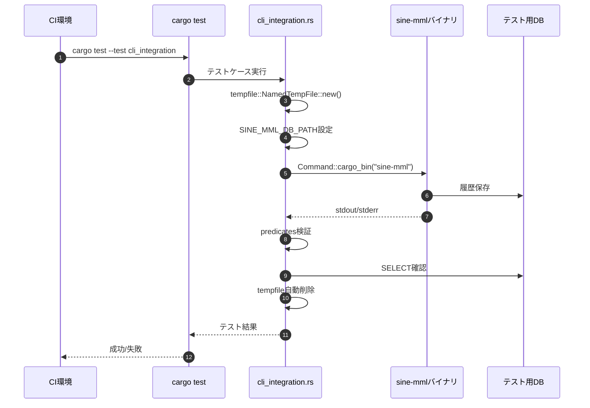
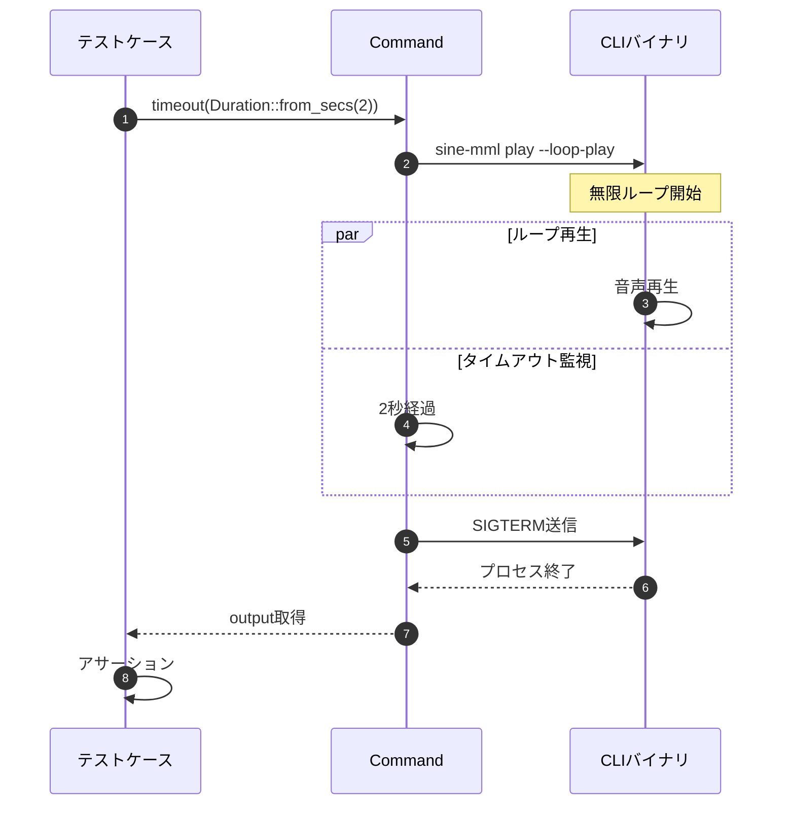

# E2Eテスト基盤 バックエンド設計書

## 1. テストファイル構成

### 1.1 ファイル配置

- `tests/cli_integration.rs` - E2E統合テスト（新規作成）

### 1.2 依存関係更新

**Cargo.toml** - `[dev-dependencies]`セクションに追加：

```toml
[dev-dependencies]
assert_cmd = "2.0"
predicates = "3.0"
tempfile = "3.8"
```

## 2. テスト実装仕様

### 2.1 テストモジュール構造

```rust
// tests/cli_integration.rs

use assert_cmd::Command;
use predicates::prelude::*;
use std::time::Duration;

/// メトロノーム機能のE2Eテスト
mod metronome_tests {
    // test_play_with_metronome_4beat
    // test_play_with_metronome_8beat
    // test_play_with_metronome_16beat
    // test_metronome_volume_adjustment
    // test_invalid_beat_value_error
}

/// 履歴保存機能のE2Eテスト
mod history_tests {
    // test_loop_saves_history
    // test_history_without_loop
}

/// 音声クリッピング防止のE2Eテスト
mod normalization_tests {
    // test_normalization_prevents_clipping
}

/// 破壊的変更のE2Eテスト
mod breaking_change_tests {
    // test_bpm_option_removed
}
```

### 2.2 テスト実装例

#### 2.2.1 メトロノーム16ビートテスト

```rust
#[test]
fn test_play_with_metronome_16beat() {
    let mut cmd = Command::cargo_bin("sine-mml").unwrap();
    
    cmd.arg("play")
       .arg("T120 C4 D4 E4")
       .arg("--metronome")
       .arg("--metronome-beat").arg("16")
       .arg("--metronome-volume").arg("0.5");
    
    // オーディオデバイスがない環境でも失敗しない
    // 成功ステータスまたはWarning出力を確認
    cmd.assert()
       .success()
       .stdout(predicate::str::contains("✓").or(
           predicate::str::contains("Warning: Audio device not found")
       ));
}
```

#### 2.2.2 ループ履歴保存テスト

```rust
use tempfile::NamedTempFile;
use std::io::Write;

#[test]
fn test_loop_saves_history() {
    // テスト用一時DBファイル作成
    let mut db_file = NamedTempFile::new().unwrap();
    let db_path = db_file.path().to_str().unwrap();
    
    // 空のDBファイル初期化
    std::env::set_var("SINE_MML_DB_PATH", db_path);
    
    let mut cmd = Command::cargo_bin("sine-mml").unwrap();
    cmd.arg("play")
       .arg("CDEFGAB")
       .arg("--loop-play")
       .timeout(Duration::from_secs(2)); // 2秒後に強制終了
    
    // タイムアウトで終了しても成功扱い（ループは無限なので）
    let output = cmd.output().unwrap();
    
    // 履歴DB確認（SQLiteを直接読む）
    let conn = rusqlite::Connection::open(db_path).unwrap();
    let mut stmt = conn.prepare("SELECT COUNT(*) FROM history WHERE mml = ?").unwrap();
    let count: i64 = stmt.query_row(["CDEFGAB"], |row| row.get(0)).unwrap();
    
    assert!(count > 0, "履歴が保存されていません");
    
    // クリーンアップ（tempfileがスコープ外で自動削除）
}
```

#### 2.2.3 無効なビート値エラーテスト

```rust
#[test]
fn test_invalid_beat_value_error() {
    let mut cmd = Command::cargo_bin("sine-mml").unwrap();
    
    cmd.arg("play")
       .arg("C4")
       .arg("--metronome")
       .arg("--metronome-beat").arg("5"); // 無効な値
    
    cmd.assert()
       .failure()
       .stderr(predicate::str::contains("error")
           .and(predicate::str::contains("metronome-beat")));
}
```

#### 2.2.4 BPMオプション削除テスト

```rust
#[test]
fn test_bpm_option_removed() {
    let mut cmd = Command::cargo_bin("sine-mml").unwrap();
    
    cmd.arg("play")
       .arg("CDEFGAB")
       .arg("--bpm").arg("140"); // 削除されたオプション
    
    cmd.assert()
       .failure()
       .stderr(predicate::str::contains("unexpected argument '--bpm'"));
}
```

#### 2.2.5 音声クリッピング防止テスト

```rust
#[test]
fn test_normalization_prevents_clipping() {
    let mut cmd = Command::cargo_bin("sine-mml").unwrap();
    
    // メトロノーム+演奏で音量が合成される
    cmd.arg("play")
       .arg("T180 V15 CDEFGAB>C") // 高速・大音量
       .arg("--metronome")
       .arg("--metronome-volume").arg("1.0"); // 最大音量
    
    // ノーマライゼーションにより、警告なく再生完了
    cmd.assert()
       .success()
       .stderr(predicate::str::contains("warning").not());
}
```

#### 2.2.6 エクスポート機能テスト

```rust
use tempfile::TempDir;

#[test]
fn test_export_with_history() {
    let temp_dir = TempDir::new().unwrap();
    let db_path = temp_dir.path().join("test_history.db");
    let wav_path = temp_dir.path().join("output.wav");
    
    std::env::set_var("SINE_MML_DB_PATH", db_path.to_str().unwrap());
    
    // 1. 履歴保存（play）
    let mut cmd = Command::cargo_bin("sine-mml").unwrap();
    cmd.arg("play").arg("C4 D4 E4");
    cmd.assert().success();
    
    // 2. 履歴ID取得（history）
    let mut cmd = Command::cargo_bin("sine-mml").unwrap();
    cmd.arg("history");
    let output = cmd.assert().success().get_output().stdout.clone();
    
    // 履歴が存在することを確認
    assert!(String::from_utf8_lossy(&output).contains("C4 D4 E4"));
    
    // 3. エクスポート（export）
    let mut cmd = Command::cargo_bin("sine-mml").unwrap();
    cmd.arg("export")
       .arg("--history-id").arg("1")
       .arg("--output").arg(wav_path.to_str().unwrap());
    
    cmd.assert()
       .success()
       .stdout(predicate::str::contains("✓ エクスポート完了"));
    
    // WAVファイル存在確認
    assert!(wav_path.exists());
    
    // クリーンアップ（TempDirがスコープ外で自動削除）
}
```

## 3. 処理フロー

### 3.1 テスト実行フロー



### 3.2 タイムアウト処理フロー



## 4. テスト分離戦略

### 4.1 データベース分離

| 戦略 | 実装方法 | メリット |
|------|---------|----------|
| 一時ファイル | `tempfile::NamedTempFile` | 自動クリーンアップ |
| 環境変数 | `SINE_MML_DB_PATH` | テストごとに独立 |
| インメモリDB | `Database::open_in_memory()` | 高速、ファイルI/O不要 |

#### 推奨パターン

```rust
// パターン1: 一時ファイル（ファイルI/O検証が必要な場合）
#[test]
fn test_with_temp_db() {
    let db_file = tempfile::NamedTempFile::new().unwrap();
    std::env::set_var("SINE_MML_DB_PATH", db_file.path());
    // テスト実行
}

// パターン2: インメモリDB（単体テスト的な検証）
#[test]
fn test_with_in_memory_db() {
    use sine_mml::db::Database;
    let db = Database::open_in_memory().unwrap();
    // DBロジックの直接テスト
}
```

### 4.2 ファイル分離

```rust
use tempfile::TempDir;

#[test]
fn test_wav_export() {
    // 一時ディレクトリ作成
    let temp_dir = TempDir::new().unwrap();
    let output_path = temp_dir.path().join("output.wav");
    
    // exportコマンド実行
    let mut cmd = Command::cargo_bin("sine-mml").unwrap();
    cmd.arg("export")
       .arg("--history-id").arg("1")
       .arg("--output").arg(output_path.to_str().unwrap());
    
    cmd.assert().success();
    
    // ファイル存在確認
    assert!(output_path.exists());
    
    // スコープ終了時にtemp_dirが自動削除
}
```

## 5. CI統合

### 5.1 GitHub Actions設定例

`.github/workflows/ci.yml`に以下を追加：

```yaml
name: CI

on: [push, pull_request]

jobs:
  test:
    runs-on: ubuntu-latest
    steps:
      - uses: actions/checkout@v4
      
      - name: Setup Rust
        uses: actions-rs/toolchain@v1
        with:
          toolchain: stable
          override: true
      
      - name: Run unit tests
        run: cargo test --lib
      
      - name: Run integration tests
        run: cargo test --test cli_integration
        env:
          RUST_BACKTRACE: 1
      
      - name: Run all tests
        run: cargo test --all
```

### 5.2 CI環境考慮事項

| 項目 | 対応 |
|------|------|
| オーディオデバイスなし | `AudioPlayer::new()`失敗を許容 |
| ファイルパーミッション | `tempfile`クレートが自動処理 |
| 並列実行 | テスト名にランダム要素追加（UUID等） |

## 6. PRテンプレート具体例

**`.github/pull_request_template.md`**:

```markdown
## 概要
<!-- 変更内容の概要 -->

## 変更内容
- [ ] 新規機能追加
- [ ] バグ修正
- [ ] リファクタリング
- [ ] ドキュメント更新

## テスト確認
- [ ] **E2Eテストが成功** (`cargo test --test cli_integration`)
- [ ] **統合テストが成功** (`cargo test --all`)
- [ ] 新規機能がある場合、対応するE2Eテストを追加
- [ ] CI/CDパイプラインが成功

## CLI変更がある場合
- [ ] `docs/USAGE.md` を更新
- [ ] 破壊的変更の場合、マイグレーションガイドを追加

## チェックリスト
- [ ] コードレビュー済み
- [ ] Clippy警告なし (`cargo clippy -- -D warnings`)
- [ ] フォーマット済み (`cargo fmt`)

## 関連Issue
Closes #XXX
```

## 7. エラーハンドリング

### 7.1 テスト実行時のエラー対応

| エラーケース | 対応 | メッセージ例 |
|-------------|------|-------------|
| CLIバイナリ未ビルド | `cargo test`前に自動ビルド | `error: no such subcommand: 'test'` |
| 一時ディレクトリ作成失敗 | テストスキップ | `SKIP: Cannot create temp directory` |
| タイムアウト超過 | 正常終了扱い（ループテストのみ） | `Timeout after 2s (expected for loop test)` |
| DB接続失敗 | テスト失敗 | `Failed to connect to test DB` |

### 7.2 デバッグ用出力

```rust
#[test]
fn test_with_debug_output() {
    let mut cmd = Command::cargo_bin("sine-mml").unwrap();
    cmd.arg("play").arg("C4");
    
    let output = cmd.output().unwrap();
    
    // デバッグ出力（失敗時のみ表示）
    if !output.status.success() {
        eprintln!("STDOUT: {}", String::from_utf8_lossy(&output.stdout));
        eprintln!("STDERR: {}", String::from_utf8_lossy(&output.stderr));
    }
    
    assert!(output.status.success());
}
```

## 8. 実装チェックリスト

### 8.1 Phase 1: 環境構築
- [ ] `Cargo.toml`に`dev-dependencies`追加（assert_cmd, predicates, tempfile）
- [ ] `tests/cli_integration.rs`ファイル作成
- [ ] ビルドエラーがないことを確認（`cargo test --no-run`）

### 8.2 Phase 2: 基本テスト実装
- [ ] `test_play_with_metronome_4beat`実装
- [ ] `test_play_with_metronome_8beat`実装
- [ ] `test_play_with_metronome_16beat`実装
- [ ] `test_metronome_volume_adjustment`実装
- [ ] `test_invalid_beat_value_error`実装

### 8.3 Phase 3: 高度なテスト実装
- [ ] `test_loop_saves_history`実装（タイムアウト付き）
- [ ] `test_normalization_prevents_clipping`実装
- [ ] `test_bpm_option_removed`実装
- [ ] `test_export_with_history`実装

### 8.4 Phase 4: CI統合
- [ ] `.github/workflows/ci.yml`更新
- [ ] `.github/pull_request_template.md`更新
- [ ] CI上でテストが成功することを確認

## 9. パフォーマンス最適化

### 9.1 テスト高速化戦略

| 戦略 | 実装 | 効果 |
|------|------|------|
| 短いMML使用 | `"C4"`など最小限 | 合成時間短縮 |
| インメモリDB | `Database::open_in_memory()` | ファイルI/O削減 |
| 並列実行 | `cargo test -- --test-threads=4` | 実行時間短縮 |

### 9.2 ベンチマーク目標

```bash
# 全テスト実行時間
$ cargo test --test cli_integration
# 目標: 30秒以内

# 単一テスト実行時間
$ cargo test test_play_with_metronome_16beat
# 目標: 2秒以内
```

---

## 変更履歴

| 日付 | バージョン | 変更内容 | 担当者 |
|:---|:---|:---|:---|
| 2026-01-11 | 1.0.0 | 初版作成 | AI |
