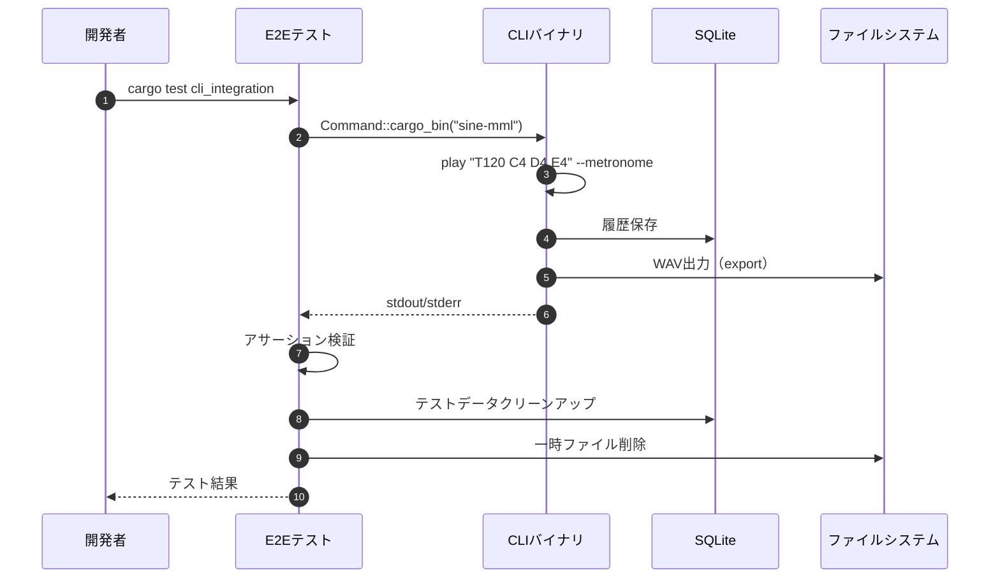
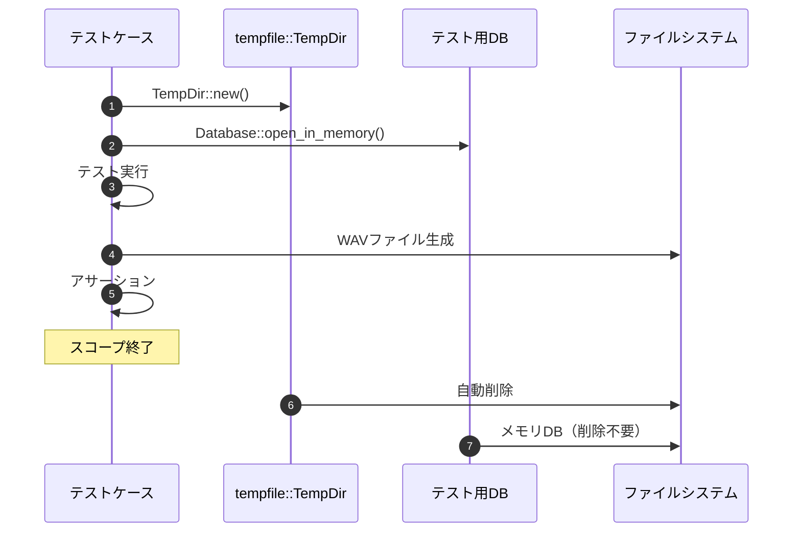

# E2Eテスト基盤 詳細設計書

## メタ情報

| 項目 | 内容 |
|------|------|
| ドキュメントID | DET-E2E-001 |
| バージョン | 1.0.0 |
| ステータス | ドラフト |
| 作成日 | 2026-01-11 |
| 最終更新日 | 2026-01-11 |
| 親機能 | E2Eテストインフラ |
| 含まれる機能ID | F-021, F-022 |
| 関連基本設計書 | BASIC-CLI-002 MML Synthesizer CLI 機能改善 |
| 関連要件定義書 | REQ-CLI-002 MML-Synthesizer-Enhancement |

## 1. 概要

### 1.1 背景と目的

sine-mml CLI v1.0実装完了後、CLI-Backend間の統合漏れを検知する仕組みが不足しており、以下の課題が存在する：

- CLI引数変更時にバックエンドロジックとの整合性が保証されない
- メトロノーム機能やループ履歴保存などの新機能の動作保証が弱い
- CI環境（音声デバイスなし）での挙動が未検証

本設計書は、**CLIバイナリレベルでの自動テスト基盤**を構築し、以下を実現する：

- **E2E統合テスト（F-021）**: assert_cmd/predicatesによる自動テスト基盤
- **PRテンプレート更新（F-022）**: 統合テスト実施を必須化

### 1.2 処理フロー概要



## 2. 機能要件

### 2.1 対象機能

| 機能ID | 機能名 | 概要 | 優先度 |
|--------|--------|------|--------|
| F-021 | E2E統合テスト基盤 | assert_cmd/predicatesによるCLIバイナリテスト | 必須 |
| F-022 | PRテンプレート更新 | 統合テスト実施チェックリスト追加 | 必須 |

### 2.2 ビジネスルール

| ルールID | 内容 |
|---------|------|
| BR-050 | すべてのE2Eテストは、オーディオデバイスがない環境でも失敗しない |
| BR-051 | ループ再生テストは2秒タイムアウトで強制終了 |
| BR-052 | 各テスト実行後、テスト用DBファイルと一時WAVファイルを削除 |
| BR-053 | `--bpm`オプションは削除され、使用時はエラーを返す |
| BR-054 | メトロノーム関連オプションはバリデーションエラーを正しく検出 |

## 3. 設計書一覧

| 設計書 | パス | 説明 |
|--------|------|------|
| バックエンド設計書 | ./バックエンド設計書.md | テスト実装仕様 |

## 4. 技術選定

### 4.1 テストフレームワーク

| レイヤー | 技術 | バージョン | 役割 |
|----------|------|------------|------|
| CLIテスト実行 | assert_cmd | 2.0 | CLIバイナリの実行と制御 |
| アサーション | predicates | 3.0 | 出力検証（stdout/stderr） |
| 一時ファイル | tempfile | 3.8 | テスト用一時ディレクトリ |

### 4.2 技術選定理由

#### assert_cmd
- **選定理由**: Rust CLI標準テストツール、`Command::cargo_bin()`で実行可能
- **代替案**: 手動スクリプトテスト → メンテナンス性低い
- **メリット**: タイムアウト制御、stdin/stdout/stderr制御、クロスプラットフォーム

#### predicates
- **選定理由**: 豊富な検証パターン（contains、regex、JSON等）
- **代替案**: 手動文字列比較 → 可読性低い
- **メリット**: エラーメッセージが詳細、組み合わせ可能

#### tempfile
- **選定理由**: 自動クリーンアップ、スコープ終了時削除
- **代替案**: 手動ディレクトリ作成 → クリーンアップ漏れリスク

## 5. テストケース一覧

### 5.1 メトロノーム機能テスト

| テストケース名 | 概要 | 期待結果 |
|---------------|------|----------|
| `test_play_with_metronome_4beat` | 4ビートメトロノーム再生 | 成功、標準出力に"✓"を含む |
| `test_play_with_metronome_8beat` | 8ビートメトロノーム再生 | 成功、標準出力に"✓"を含む |
| `test_play_with_metronome_16beat` | 16ビートメトロノーム再生 | 成功、標準出力に"✓"を含む |
| `test_metronome_volume_adjustment` | メトロノーム音量0.5で再生 | 成功、音量パラメータ反映 |
| `test_invalid_beat_value_error` | 無効なビート値（5）を指定 | 失敗、stderrにエラーメッセージ |

### 5.2 履歴保存テスト

| テストケース名 | 概要 | 期待結果 |
|---------------|------|----------|
| `test_loop_saves_history` | ループ再生でも履歴保存される | DB内に履歴レコード存在 |
| `test_history_without_loop` | 通常再生での履歴保存 | DB内に履歴レコード存在 |

### 5.3 音声クリッピング防止テスト

| テストケース名 | 概要 | 期待結果 |
|---------------|------|----------|
| `test_normalization_prevents_clipping` | メトロノーム+演奏で音量1.0以下 | 成功、警告なし |

### 5.4 破壊的変更テスト

| テストケース名 | 概要 | 期待結果 |
|---------------|------|----------|
| `test_bpm_option_removed` | `--bpm`オプション使用 | 失敗、"unexpected argument"エラー |

## 6. テスト実行環境の考慮

### 6.1 CI環境対応

| 制約 | 対応策 |
|------|--------|
| オーディオデバイスなし | `AudioPlayer::new()`失敗時はWarning表示して続行 |
| 実行時間制限 | ループテストは2秒タイムアウト設定 |
| 並列実行 | テスト用DBファイル名にUUID使用（衝突回避） |

### 6.2 クリーンアップ戦略



## 7. PRテンプレート更新内容

### 7.1 追加チェックリスト項目

`.github/pull_request_template.md`に以下を追加：

```markdown
## テスト確認

- [ ] **E2Eテストが成功** (`cargo test cli_integration`)
- [ ] **統合テストが成功** (`cargo test`)
- [ ] 新規機能がある場合、対応するE2Eテストを追加
```

### 7.2 テストカバレッジ要件

| 対象 | カバレッジ閾値 |
|------|---------------|
| 新規CLIオプション | 100% |
| 新規サブコマンド | 100% |
| エラーケース | 80%以上 |

## 8. エラーコード一覧

| コード | HTTPステータス | 説明 |
|--------|---------------|------|
| TEST-E001 | - | テスト用DBファイル作成失敗 |
| TEST-E002 | - | 一時ディレクトリ作成失敗 |
| TEST-E003 | - | CLIバイナリ実行失敗 |
| TEST-E004 | - | タイムアウト超過 |

## 9. 非機能要件

### 9.1 性能要件

| 項目 | 目標値 | 測定方法 |
|------|--------|----------|
| 全テスト実行時間 | 30秒以内 | `cargo test --timings` |
| 単一テスト実行時間 | 2秒以内 | `cargo test --test cli_integration -- --nocapture` |

### 9.2 セキュリティ要件

| 項目 | 要件 |
|------|------|
| パストラバーサル防止 | テスト用一時ファイルは`tempfile`クレート使用 |
| DBインジェクション防止 | プリペアドステートメント使用（既存実装） |

## 10. 関連サブ機能

- [バックエンド設計書](./バックエンド設計書.md) - テスト実装詳細

---

## 変更履歴

| 日付 | バージョン | 変更内容 | 担当者 |
|:---|:---|:---|:---|
| 2026-01-11 | 1.0.0 | 初版作成 | AI |
