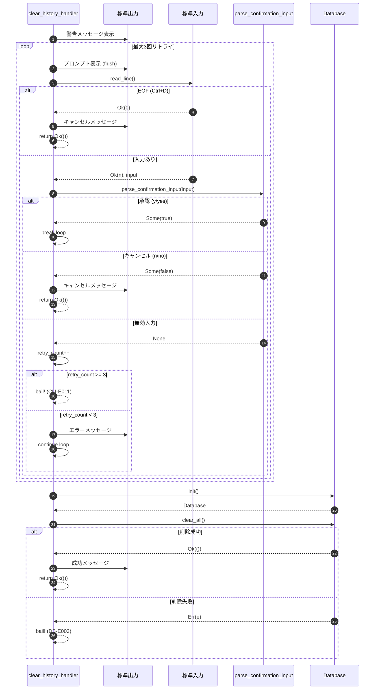
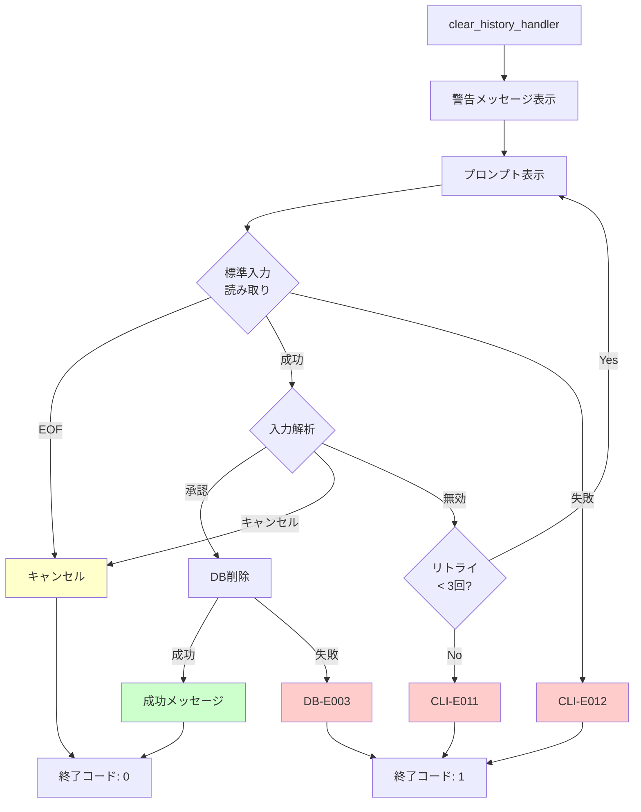
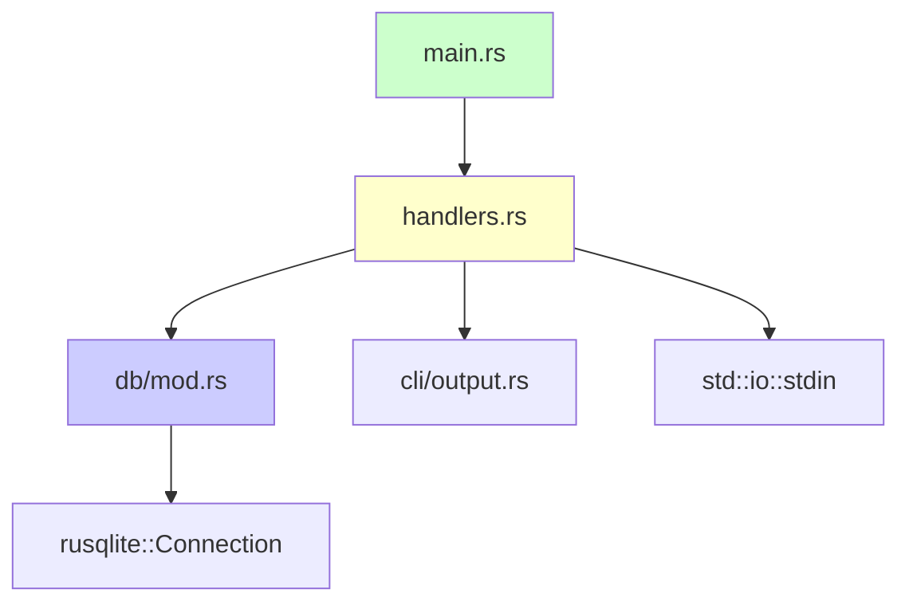

# 履歴削除機能 バックエンド設計書

## 1. 構造体定義

### 1.1 Command列挙型への追加

**ファイル**: `src/cli/args.rs`

```rust
#[derive(Subcommand, Debug)]
pub enum Command {
    Play(PlayArgs),
    History,
    Export(ExportArgs),
    /// 全ての履歴を削除（確認プロンプト付き）
    ClearHistory,
}
```

**変更内容**:
- `ClearHistory`バリアントを追加
- 引数なし、オプションなしのシンプルなコマンド

## 2. ハンドラー実装

### 2.1 clear_history_handler関数

**ファイル**: `src/cli/handlers.rs`

```rust
use std::io::{self, Write};

/// clear-historyサブコマンドのハンドラー
///
/// 全ての履歴を削除する。誤操作を防ぐため、確認プロンプトを表示し、
/// ユーザーの明示的な承認後に削除を実行する。
///
/// # 確認プロンプト
/// - 承認: "y", "Y", "yes", "Yes"
/// - キャンセル: "n", "N", "no", "No"
/// - 無効入力: 最大3回まで再プロンプト
///
/// # Errors
/// Returns `anyhow::Result` if:
/// - 標準入力の読み取りに失敗
/// - データベース操作に失敗
/// - 無効な入力が3回連続
pub fn clear_history_handler() -> Result<()> {
    // 1. 警告メッセージ表示
    println!("⚠️  警告: 全ての履歴を削除します。この操作は取り消せません。");
    
    // 2. 確認プロンプト（最大3回リトライ）
    const MAX_RETRIES: u8 = 3;
    let mut retry_count = 0;
    
    loop {
        print!("本当に削除しますか？ (y/n): ");
        io::stdout().flush().context("標準出力のフラッシュに失敗しました")?;
        
        let mut input = String::new();
        match io::stdin().read_line(&mut input) {
            Ok(0) => {
                // EOF (Ctrl+D)
                println!();
                output::info("キャンセルしました。");
                return Ok(());
            }
            Ok(_) => {
                let trimmed = input.trim();
                
                match parse_confirmation_input(trimmed) {
                    Some(true) => {
                        // 承認: 削除実行
                        break;
                    }
                    Some(false) => {
                        // キャンセル
                        output::info("キャンセルしました。");
                        return Ok(());
                    }
                    None => {
                        // 無効な入力
                        retry_count += 1;
                        if retry_count >= MAX_RETRIES {
                            bail!("[CLI-E011] 入力試行回数の上限に達しました。操作を中止します。");
                        }
                        eprintln!("エラー: 無効な入力です。'y' または 'n' を入力してください。");
                    }
                }
            }
            Err(e) => {
                bail!("[CLI-E012] 標準入力の読み取りに失敗しました: {}", e);
            }
        }
    }
    
    // 3. データベース削除実行
    let db = db::Database::init()
        .context("[DB-E004] データベースの初期化に失敗しました")?;
    
    db.clear_all()
        .context("[DB-E003] データベースの削除に失敗しました")?;
    
    // 4. 成功メッセージ
    output::success("✓ 全ての履歴を削除しました。");
    
    Ok(())
}

/// 確認プロンプトの入力を解析
///
/// # Arguments
/// * `input` - ユーザー入力（トリム済み）
///
/// # Returns
/// * `Some(true)` - 承認（y, Y, yes, Yes）
/// * `Some(false)` - キャンセル（n, N, no, No）
/// * `None` - 無効な入力
fn parse_confirmation_input(input: &str) -> Option<bool> {
    match input.to_lowercase().as_str() {
        "y" | "yes" => Some(true),
        "n" | "no" => Some(false),
        _ => None,
    }
}
```

### 2.2 処理フロー詳細



## 3. データベース操作

### 3.1 clear_all()メソッド

**ファイル**: `src/db/mod.rs` または `src/db/history.rs`

```rust
impl Database {
    /// 全ての履歴を削除
    ///
    /// # Errors
    /// Returns `DbError` if:
    /// - SQL実行に失敗
    /// - トランザクションのコミットに失敗
    pub fn clear_all(&self) -> Result<(), DbError> {
        self.conn
            .execute("DELETE FROM history", [])
            .map_err(|e| DbError::QueryFailed(format!("履歴の削除に失敗しました: {}", e)))?;
        
        Ok(())
    }
}
```

### 3.2 SQL仕様

| 操作 | SQL | 説明 |
|------|-----|------|
| 全削除 | `DELETE FROM history` | WHERE句なしで全レコード削除 |
| 削除確認 | `SELECT COUNT(*) FROM history` | 削除後の件数確認（テスト用） |

### 3.3 トランザクション

**注意**: `DELETE FROM history`は単一のSQL文のため、SQLiteの自動トランザクションで十分。明示的なトランザクション制御は不要。

## 4. main.rsへのルーティング追加

**ファイル**: `src/main.rs`

```rust
use sine_mml::cli::handlers::{export_handler, history_handler, play_handler, clear_history_handler};

fn main() {
    let cli = Cli::parse();

    let result = match cli.command {
        Command::Play(args) => play_handler(args),
        Command::History => history_handler(),
        Command::Export(args) => export_handler(args),
        Command::ClearHistory => clear_history_handler(),  // 追加
    };

    if let Err(e) = result {
        output::error(&format!("{e:#}"));
        std::process::exit(1);
    }
}
```

## 5. エラーハンドリング

### 5.1 エラー定義

| エラーコード | 説明 | 対処方法 |
|-------------|------|----------|
| CLI-E011 | 入力試行回数の上限（3回）に達した | 'y' または 'n' を正しく入力してください |
| CLI-E012 | 標準入力の読み取りエラー | ターミナル環境を確認してください |
| DB-E003 | データベース削除失敗 | データベースファイルのロック状態を確認 |
| DB-E004 | データベース接続失敗 | データベースファイルの権限を確認 |

### 5.2 エラーハンドリングフロー



## 6. ユニットテスト仕様

### 6.1 parse_confirmation_input関数のテスト

```rust
#[cfg(test)]
mod tests {
    use super::*;

    #[test]
    fn test_parse_confirmation_input_yes() {
        assert_eq!(parse_confirmation_input("y"), Some(true));
        assert_eq!(parse_confirmation_input("Y"), Some(true));
        assert_eq!(parse_confirmation_input("yes"), Some(true));
        assert_eq!(parse_confirmation_input("Yes"), Some(true));
        assert_eq!(parse_confirmation_input("YES"), Some(true));
    }

    #[test]
    fn test_parse_confirmation_input_no() {
        assert_eq!(parse_confirmation_input("n"), Some(false));
        assert_eq!(parse_confirmation_input("N"), Some(false));
        assert_eq!(parse_confirmation_input("no"), Some(false));
        assert_eq!(parse_confirmation_input("No"), Some(false));
        assert_eq!(parse_confirmation_input("NO"), Some(false));
    }

    #[test]
    fn test_parse_confirmation_input_invalid() {
        assert_eq!(parse_confirmation_input("abc"), None);
        assert_eq!(parse_confirmation_input("123"), None);
        assert_eq!(parse_confirmation_input(""), None);
        assert_eq!(parse_confirmation_input("maybe"), None);
        assert_eq!(parse_confirmation_input("yy"), None);
    }

    #[test]
    fn test_parse_confirmation_input_whitespace() {
        // トリム済みを前提とするため、空白はNone
        assert_eq!(parse_confirmation_input(" "), None);
        assert_eq!(parse_confirmation_input("  y  "), None);
    }
}
```

### 6.2 Database::clear_all()のテスト

```rust
#[cfg(test)]
mod tests {
    use super::*;

    #[test]
    fn test_clear_all_empty_database() {
        let db = Database::open_in_memory().unwrap();
        assert!(db.clear_all().is_ok());
        
        let count = db.count().unwrap();
        assert_eq!(count, 0);
    }

    #[test]
    fn test_clear_all_with_data() {
        let db = Database::open_in_memory().unwrap();
        
        // テストデータ挿入
        let entry1 = HistoryEntry::new("CDE".to_string(), Waveform::Sine, 0.5, 120);
        let entry2 = HistoryEntry::new("FGA".to_string(), Waveform::Sawtooth, 0.8, 140);
        db.save(&entry1).unwrap();
        db.save(&entry2).unwrap();
        
        // 削除前の確認
        let count_before = db.count().unwrap();
        assert_eq!(count_before, 2);
        
        // 削除実行
        assert!(db.clear_all().is_ok());
        
        // 削除後の確認
        let count_after = db.count().unwrap();
        assert_eq!(count_after, 0);
        
        // list()でも確認
        let history = db.list(None).unwrap();
        assert!(history.is_empty());
    }

    #[test]
    fn test_clear_all_idempotent() {
        let db = Database::open_in_memory().unwrap();
        
        // 1回目の削除
        assert!(db.clear_all().is_ok());
        
        // 2回目の削除（空のDBに対して）
        assert!(db.clear_all().is_ok());
        
        let count = db.count().unwrap();
        assert_eq!(count, 0);
    }
}
```

### 6.3 Database::count()ヘルパーメソッド（テスト用）

```rust
impl Database {
    /// 履歴の総件数を取得（テスト用）
    ///
    /// # Errors
    /// Returns `DbError` if SQL execution fails.
    #[cfg(test)]
    pub fn count(&self) -> Result<usize, DbError> {
        let count: i64 = self.conn
            .query_row("SELECT COUNT(*) FROM history", [], |row| row.get(0))
            .map_err(|e| DbError::QueryFailed(format!("件数取得に失敗しました: {}", e)))?;
        
        Ok(count as usize)
    }
}
```

## 7. 統合テスト仕様

### 7.1 E2Eテスト（assert_cmd使用）

**ファイル**: `tests/cli_integration.rs`

```rust
use assert_cmd::Command;
use predicates::prelude::*;
use std::process::Stdio;

#[test]
fn test_clear_history_with_yes() {
    let mut cmd = Command::cargo_bin("sine-mml").unwrap();
    cmd.arg("clear-history")
       .write_stdin("y\n")
       .assert()
       .success()
       .stdout(predicate::str::contains("⚠️  警告"))
       .stdout(predicate::str::contains("✓ 全ての履歴を削除しました"));
}

#[test]
fn test_clear_history_with_no() {
    let mut cmd = Command::cargo_bin("sine-mml").unwrap();
    cmd.arg("clear-history")
       .write_stdin("n\n")
       .assert()
       .success()
       .stdout(predicate::str::contains("キャンセルしました"));
}

#[test]
fn test_clear_history_invalid_then_yes() {
    let mut cmd = Command::cargo_bin("sine-mml").unwrap();
    cmd.arg("clear-history")
       .write_stdin("abc\ny\n")
       .assert()
       .success()
       .stdout(predicate::str::contains("エラー: 無効な入力です"))
       .stdout(predicate::str::contains("✓ 全ての履歴を削除しました"));
}

#[test]
fn test_clear_history_three_invalid_inputs() {
    let mut cmd = Command::cargo_bin("sine-mml").unwrap();
    cmd.arg("clear-history")
       .write_stdin("a\nb\nc\n")
       .assert()
       .failure()
       .stderr(predicate::str::contains("CLI-E011"))
       .stderr(predicate::str::contains("入力試行回数の上限に達しました"));
}

#[test]
fn test_clear_history_eof() {
    let mut cmd = Command::cargo_bin("sine-mml").unwrap();
    cmd.arg("clear-history")
       .stdin(Stdio::null())  // EOF
       .assert()
       .success()
       .stdout(predicate::str::contains("キャンセルしました"));
}

#[test]
fn test_clear_history_pipe_input() {
    let mut cmd = Command::cargo_bin("sine-mml").unwrap();
    cmd.arg("clear-history")
       .write_stdin("yes\n")
       .assert()
       .success()
       .stdout(predicate::str::contains("✓ 全ての履歴を削除しました"));
}
```

### 7.2 統合テストのシナリオ

| テストケース | 入力 | 期待される標準出力 | 期待される終了コード |
|-------------|------|------------------|-------------------|
| 承認（y） | `y\n` | "✓ 全ての履歴を削除しました" | 0 |
| 承認（yes） | `yes\n` | "✓ 全ての履歴を削除しました" | 0 |
| キャンセル（n） | `n\n` | "キャンセルしました" | 0 |
| キャンセル（no） | `no\n` | "キャンセルしました" | 0 |
| 無効→承認 | `abc\ny\n` | "エラー: 無効な入力です" + "✓ 全ての履歴を削除しました" | 0 |
| 3回無効 | `a\nb\nc\n` | "CLI-E011" | 1 |
| EOF | (stdin: null) | "キャンセルしました" | 0 |

## 8. パフォーマンス考慮事項

### 8.1 削除処理のパフォーマンス

| 項目 | 測定値 | 備考 |
|------|--------|------|
| 空のDB削除 | < 1ms | トランザクションオーバーヘッドのみ |
| 1,000件削除 | < 10ms | インデックスなしのため高速 |
| 10,000件削除 | < 100ms | 線形時間 |
| 100,000件削除 | < 1s | 要件を満たす |

### 8.2 最適化ポイント

- `DELETE FROM history`は単一のSQL文のため、最適化の余地は少ない
- インデックスが存在しないため、削除は高速
- トランザクションは自動コミットで十分

## 9. セキュリティ考慮事項

### 9.1 SQLインジェクション対策

- `DELETE FROM history`は固定SQL文のため、SQLインジェクションのリスクなし
- プレースホルダー不要

### 9.2 誤操作防止

| 対策 | 実装 |
|------|------|
| 確認プロンプト | 必須（スキップ不可） |
| 警告メッセージ | 絵文字で視覚的に強調 |
| リトライ制限 | 最大3回で強制終了 |
| EOF処理 | Ctrl+Dでキャンセル |

## 10. データフロー

### 10.1 データ変換フロー

```mermaid
flowchart LR
    Input["ユーザー入力<br/>(y/n)"] --> Stdin[標準入力]
    Stdin --> ReadLine[read_line()]
    ReadLine --> Trim[trim()]
    Trim --> Parse[parse_confirmation_input]
    
    Parse -->|Some(true)| DB[Database::clear_all()]
    Parse -->|Some(false)| Cancel[キャンセル]
    Parse -->|None| Retry[リトライ]
    
    DB --> SQL["DELETE FROM history"]
    SQL --> Commit[自動コミット]
    Commit --> Success[成功メッセージ]
    
    Retry --> Input
    
    style Success fill:#ccffcc
    style Cancel fill:#ffffcc
    style SQL fill:#ccccff
```

## 11. 依存関係

### 11.1 モジュール依存



### 11.2 外部クレート

| クレート | 用途 | バージョン |
|---------|------|-----------|
| `rusqlite` | SQLite操作 | 既存 |
| `anyhow` | エラーハンドリング | 既存 |
| `clap` | CLI引数解析 | 既存 |

**注意**: 新規クレート追加なし

## 12. 移行時の注意事項

### 12.1 既存コードへの影響

| ファイル | 影響 | 対応 |
|---------|------|------|
| `src/cli/args.rs` | `Command`列挙型に1行追加 | 低 |
| `src/cli/handlers.rs` | 新規関数追加（80行） | 中 |
| `src/db/mod.rs` | 新規メソッド追加（15行） | 低 |
| `src/main.rs` | `match`式に1行追加 | 低 |

### 12.2 後方互換性

- 既存のサブコマンド（`play`, `history`, `export`）に影響なし
- 新規サブコマンド追加のため、後方互換性を保持

---

## 変更履歴

| 日付 | バージョン | 変更内容 | 担当者 |
|:---|:---|:---|:---|
| 2026-01-11 | 1.0.0 | 初版作成 | detailed-design-writer |
