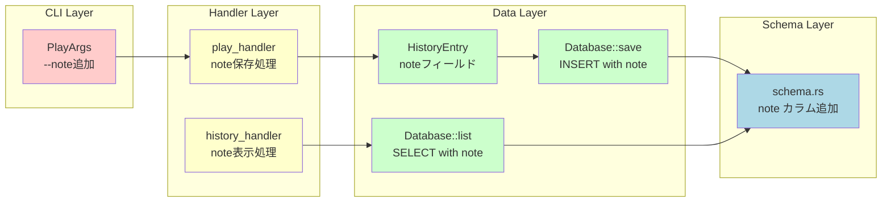
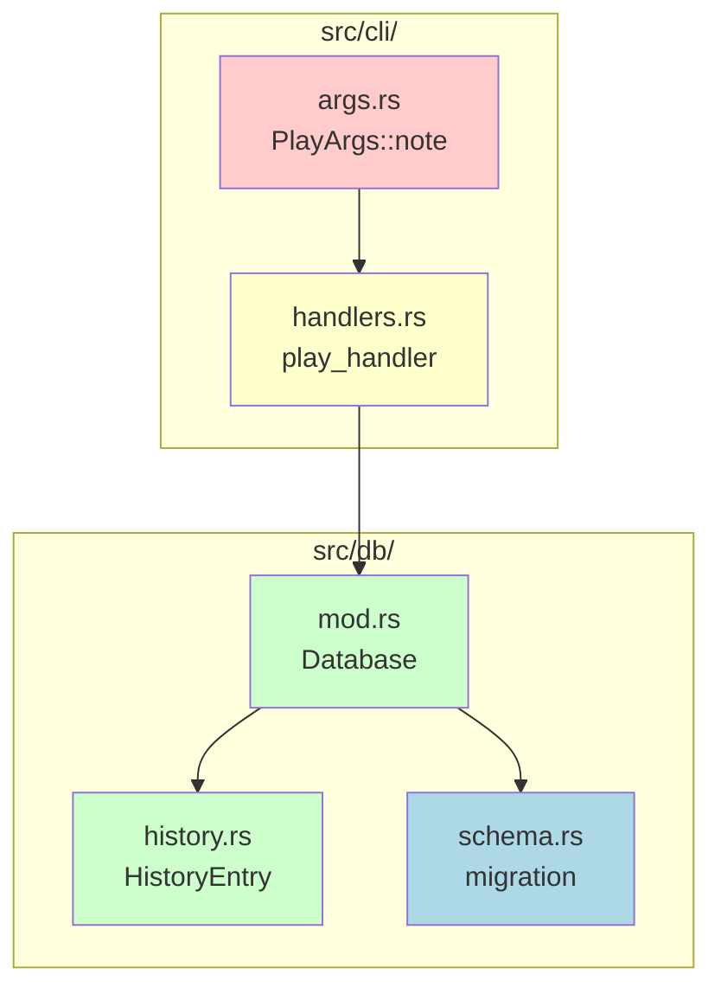
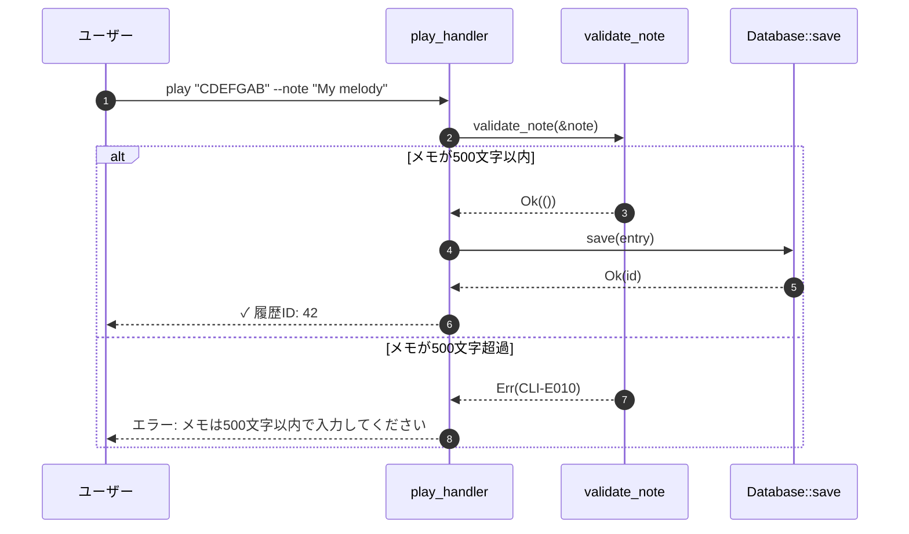
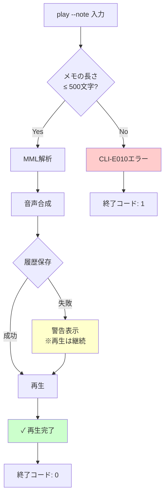

# 履歴メモ機能 バックエンド設計書

## 0. ドキュメント情報

| 項目 | 内容 |
|------|------|
| ドキュメントID | DET-NOTE-001-BE |
| バージョン | 1.0.0 |
| ステータス | レビュー待ち |
| 作成日 | 2026-01-11 |
| 最終更新日 | 2026-01-11 |
| 親機能 | 履歴管理機能拡張 |
| 含まれる機能ID | F-025 |
| 関連基本設計書 | BASIC-CLI-003_MML-Syntax-Extension.md |
| 関連要件定義書 | REQ-CLI-003_MML-Syntax-Extension.md |

---

## 1. 変更概要

### 1.1 目的

sine-mml v2.0において、演奏履歴にメモを付与できる機能を追加する。`--note`オプションで任意のメモ（最大500文字）を指定し、後で履歴を見返したときに何の曲か識別しやすくする。

### 1.2 変更対象コンポーネント

| コンポーネント | ファイルパス | 変更種別 | 変更内容 |
|---------------|-------------|---------|---------|
| CLI引数定義 | `src/cli/args.rs` | 拡張 | `PlayArgs`に`note`フィールド追加 |
| データモデル | `src/db/history.rs` | 拡張 | `HistoryEntry`に`note`フィールド追加 |
| DB操作 | `src/db/mod.rs` | 修正 | `save()`、`list()`、`get_by_id()`にnote対応 |
| ハンドラー | `src/cli/handlers.rs` | 修正 | `play_handler()`でnote保存、`history_handler()`で表示 |
| DBスキーマ | `src/db/schema.rs` | 修正 | `note`カラム追加（マイグレーション） |

### 1.3 変更影響範囲



---

## 2. モジュール設計

### 2.1 依存関係



### 2.2 インターフェース定義

#### 2.2.1 CLI引数インターフェース

```rust
// src/cli/args.rs

pub struct PlayArgs {
    // ... 既存フィールド ...
    pub mml: Option<String>,
    pub history_id: Option<i64>,
    pub waveform: Waveform,
    pub volume: f32,
    pub loop_play: bool,
    pub metronome: bool,
    pub metronome_beat: u8,
    pub metronome_volume: f32,
    
    /// 履歴にメモを付与（最大500文字）
    pub note: Option<String>,
}
```

#### 2.2.2 データモデルインターフェース

```rust
// src/db/history.rs

pub struct HistoryEntry {
    pub id: Option<i64>,
    pub mml: String,
    pub waveform: Waveform,
    pub volume: f32,
    pub bpm: u16,
    pub note: Option<String>,  // 新規追加
    pub created_at: DateTime<Utc>,
}

impl HistoryEntry {
    /// 新規エントリを作成
    pub fn new(
        mml: String,
        waveform: Waveform,
        volume: f32,
        bpm: u16,
        note: Option<String>,  // 新規追加
    ) -> Self {
        Self {
            id: None,
            mml,
            waveform,
            volume,
            bpm,
            note,
            created_at: Utc::now(),
        }
    }
}
```

#### 2.2.3 データベース操作インターフェース

```rust
// src/db/mod.rs

impl Database {
    /// 履歴エントリを保存
    ///
    /// # Arguments
    /// * `entry` - 保存する履歴エントリ（noteを含む）
    ///
    /// # Returns
    /// * `Ok(i64)` - 挿入されたレコードのID
    /// * `Err(DbError)` - バリデーションエラーまたはDB操作エラー
    pub fn save(&self, entry: &HistoryEntry) -> Result<i64, DbError>;
    
    /// 履歴一覧を取得
    ///
    /// # Arguments
    /// * `limit` - 取得件数の上限（Noneの場合は全件）
    ///
    /// # Returns
    /// * `Ok(Vec<HistoryEntry>)` - 履歴エントリのリスト（noteを含む）
    /// * `Err(DbError)` - DB操作エラー
    pub fn list(&self, limit: Option<usize>) -> Result<Vec<HistoryEntry>, DbError>;
    
    /// IDで履歴エントリを取得
    ///
    /// # Arguments
    /// * `id` - 履歴ID
    ///
    /// # Returns
    /// * `Ok(HistoryEntry)` - 履歴エントリ（noteを含む）
    /// * `Err(DbError::NotFound)` - 指定IDが存在しない
    /// * `Err(DbError)` - DB操作エラー
    pub fn get_by_id(&self, id: i64) -> Result<HistoryEntry, DbError>;
}
```

---

## 3. 実装詳細

### 3.1 CLI引数拡張

#### 3.1.1 変更内容

**ファイル**: `src/cli/args.rs`

**変更前**:
```rust
pub struct PlayArgs {
    pub mml: Option<String>,
    pub history_id: Option<i64>,
    pub waveform: Waveform,
    pub volume: f32,
    pub loop_play: bool,
    pub metronome: bool,
    pub metronome_beat: u8,
    pub metronome_volume: f32,
}
```

**変更後**:
```rust
pub struct PlayArgs {
    pub mml: Option<String>,
    pub history_id: Option<i64>,
    pub waveform: Waveform,
    pub volume: f32,
    pub loop_play: bool,
    pub metronome: bool,
    pub metronome_beat: u8,
    pub metronome_volume: f32,
    
    /// 履歴にメモを付与（最大500文字）
    #[arg(long, help = "履歴にメモを付与（最大500文字）")]
    pub note: Option<String>,
}
```

#### 3.1.2 バリデーション

メモの長さ制限（500文字）は**ハンドラー層**で実施する（CLI引数パース時ではない）。

**理由**:
- clapのバリデーターは文字列長ではなくバイト長をチェックするため、マルチバイト文字（日本語、絵文字）で誤判定が発生する
- ハンドラー層で`chars().count()`を使用することで正確な文字数をカウント可能

---

### 3.2 データモデル拡張

#### 3.2.1 変更内容

**ファイル**: `src/db/history.rs`

**変更前**:
```rust
pub struct HistoryEntry {
    pub id: Option<i64>,
    pub mml: String,
    pub waveform: Waveform,
    pub volume: f32,
    pub bpm: u16,
    pub created_at: DateTime<Utc>,
}

impl HistoryEntry {
    pub fn new(mml: String, waveform: Waveform, volume: f32, bpm: u16) -> Self {
        Self {
            id: None,
            mml,
            waveform,
            volume,
            bpm,
            created_at: Utc::now(),
        }
    }
}
```

**変更後**:
```rust
pub struct HistoryEntry {
    pub id: Option<i64>,
    pub mml: String,
    pub waveform: Waveform,
    pub volume: f32,
    pub bpm: u16,
    pub note: Option<String>,  // 新規追加
    pub created_at: DateTime<Utc>,
}

impl HistoryEntry {
    pub fn new(
        mml: String,
        waveform: Waveform,
        volume: f32,
        bpm: u16,
        note: Option<String>,  // 新規追加
    ) -> Self {
        Self {
            id: None,
            mml,
            waveform,
            volume,
            bpm,
            note,
            created_at: Utc::now(),
        }
    }
}
```

#### 3.2.2 データ型の選択理由

| フィールド | 型 | 理由 |
|-----------|-----|------|
| `note` | `Option<String>` | メモは任意項目（指定しなくても動作する） |
| `String` | UTF-8文字列 | 日本語、絵文字を含む任意のテキストを保存 |

---

### 3.3 データベース操作拡張

#### 3.3.1 `save()`メソッドの変更

**ファイル**: `src/db/mod.rs`

**変更前**:
```rust
pub fn save(&self, entry: &HistoryEntry) -> Result<i64, DbError> {
    // ... バリデーション処理 ...
    
    self.conn.execute(
        "INSERT INTO history (mml, waveform, volume, bpm, created_at) VALUES (?, ?, ?, ?, ?)",
        params![
            entry.mml,
            entry.waveform.as_str(),
            entry.volume,
            entry.bpm,
            entry.created_at.to_rfc3339()
        ],
    )?;
    
    Ok(self.conn.last_insert_rowid())
}
```

**変更後**:
```rust
pub fn save(&self, entry: &HistoryEntry) -> Result<i64, DbError> {
    // 既存のバリデーション
    if entry.mml.is_empty() {
        return Err(DbError::SaveFailed("MML cannot be empty".to_string()));
    }
    if entry.mml.len() > 10000 {
        return Err(DbError::SaveFailed("MML too long (max 10000 chars)".to_string()));
    }
    if entry.volume < 0.0 || entry.volume > 1.0 {
        return Err(DbError::SaveFailed("Volume must be between 0.0 and 1.0".to_string()));
    }
    if entry.bpm < 30 || entry.bpm > 300 {
        return Err(DbError::SaveFailed("BPM must be between 30 and 300".to_string()));
    }
    
    // 新規バリデーション: noteの長さチェック
    if let Some(ref note) = entry.note {
        if note.chars().count() > 500 {
            return Err(DbError::SaveFailed(
                "Note must be 500 characters or less".to_string()
            ));
        }
    }
    
    self.conn.execute(
        "INSERT INTO history (mml, waveform, volume, bpm, note, created_at) VALUES (?, ?, ?, ?, ?, ?)",
        params![
            entry.mml,
            entry.waveform.as_str(),
            entry.volume,
            entry.bpm,
            entry.note,  // 新規追加
            entry.created_at.to_rfc3339()
        ],
    )?;
    
    Ok(self.conn.last_insert_rowid())
}
```

#### 3.3.2 `list()`メソッドの変更

**変更前**:
```rust
pub fn list(&self, limit: Option<usize>) -> Result<Vec<HistoryEntry>, DbError> {
    let sql = if let Some(l) = limit {
        format!("SELECT id, mml, waveform, volume, bpm, created_at FROM history ORDER BY created_at DESC LIMIT {l}")
    } else {
        "SELECT id, mml, waveform, volume, bpm, created_at FROM history ORDER BY created_at DESC".to_string()
    };
    
    let mut stmt = self.conn.prepare(&sql)?;
    let rows = stmt.query_map([], |row| {
        // ... 既存のマッピング処理 ...
        Ok(HistoryEntry {
            id: Some(row.get(0)?),
            mml: row.get(1)?,
            waveform,
            volume: row.get(3)?,
            bpm: row.get(4)?,
            created_at,
        })
    })?;
    
    // ... 結果の収集 ...
}
```

**変更後**:
```rust
pub fn list(&self, limit: Option<usize>) -> Result<Vec<HistoryEntry>, DbError> {
    let sql = if let Some(l) = limit {
        format!("SELECT id, mml, waveform, volume, bpm, note, created_at FROM history ORDER BY created_at DESC LIMIT {l}")
    } else {
        "SELECT id, mml, waveform, volume, bpm, note, created_at FROM history ORDER BY created_at DESC".to_string()
    };
    
    let mut stmt = self.conn.prepare(&sql)?;
    let rows = stmt.query_map([], |row| {
        let waveform_str: String = row.get(2)?;
        let waveform = waveform_str.parse::<Waveform>().map_err(|e| {
            rusqlite::Error::FromSqlConversionFailure(
                2,
                rusqlite::types::Type::Text,
                Box::new(e),
            )
        })?;
        
        let created_at_str: String = row.get(6)?;  // インデックス変更: 5 → 6
        let created_at = DateTime::parse_from_rfc3339(&created_at_str)
            .map_err(|e| {
                rusqlite::Error::FromSqlConversionFailure(
                    6,
                    rusqlite::types::Type::Text,
                    Box::new(e),
                )
            })?
            .with_timezone(&Utc);
        
        Ok(HistoryEntry {
            id: Some(row.get(0)?),
            mml: row.get(1)?,
            waveform,
            volume: row.get(3)?,
            bpm: row.get(4)?,
            note: row.get(5)?,  // 新規追加
            created_at,
        })
    })?;
    
    let mut entries = Vec::new();
    for row in rows {
        entries.push(row?);
    }
    
    Ok(entries)
}
```

#### 3.3.3 `get_by_id()`メソッドの変更

**変更前**:
```rust
pub fn get_by_id(&self, id: i64) -> Result<HistoryEntry, DbError> {
    let mut stmt = self.conn.prepare(
        "SELECT id, mml, waveform, volume, bpm, created_at FROM history WHERE id = ?",
    )?;
    
    let result = stmt.query_row(params![id], |row| {
        // ... 既存のマッピング処理 ...
        Ok(HistoryEntry {
            id: Some(row.get(0)?),
            mml: row.get(1)?,
            waveform,
            volume: row.get(3)?,
            bpm: row.get(4)?,
            created_at,
        })
    });
    
    // ... エラーハンドリング ...
}
```

**変更後**:
```rust
pub fn get_by_id(&self, id: i64) -> Result<HistoryEntry, DbError> {
    let mut stmt = self.conn.prepare(
        "SELECT id, mml, waveform, volume, bpm, note, created_at FROM history WHERE id = ?",
    )?;
    
    let result = stmt.query_row(params![id], |row| {
        let waveform_str: String = row.get(2)?;
        let waveform = waveform_str.parse::<Waveform>().map_err(|e| {
            rusqlite::Error::FromSqlConversionFailure(
                2,
                rusqlite::types::Type::Text,
                Box::new(e),
            )
        })?;
        
        let created_at_str: String = row.get(6)?;  // インデックス変更: 5 → 6
        let created_at = DateTime::parse_from_rfc3339(&created_at_str)
            .map_err(|e| {
                rusqlite::Error::FromSqlConversionFailure(
                    6,
                    rusqlite::types::Type::Text,
                    Box::new(e),
                )
            })?
            .with_timezone(&Utc);
        
        Ok(HistoryEntry {
            id: Some(row.get(0)?),
            mml: row.get(1)?,
            waveform,
            volume: row.get(3)?,
            bpm: row.get(4)?,
            note: row.get(5)?,  // 新規追加
            created_at,
        })
    });
    
    match result {
        Ok(entry) => Ok(entry),
        Err(rusqlite::Error::QueryReturnedNoRows) => Err(DbError::NotFound(id)),
        Err(e) => Err(DbError::Rusqlite(e)),
    }
}
```

---

### 3.4 バリデーション実装

#### 3.4.1 バリデーション関数

**ファイル**: `src/cli/handlers.rs`

```rust
/// メモの長さをバリデーション
///
/// # Arguments
/// * `note` - バリデーション対象のメモ
///
/// # Returns
/// * `Ok(())` - バリデーション成功
/// * `Err(anyhow::Error)` - 500文字超過
fn validate_note(note: &Option<String>) -> Result<()> {
    if let Some(n) = note {
        if n.chars().count() > 500 {
            bail!("[CLI-E010] メモは500文字以内で入力してください（現在: {}文字）", n.chars().count());
        }
    }
    Ok(())
}
```

#### 3.4.2 バリデーションルール

| ルールID | 検証項目 | 条件 | エラーコード |
|---------|---------|------|------------|
| VAL-NOTE-001 | メモの長さ | 500文字以内 | CLI-E010 |
| VAL-NOTE-002 | メモの文字種 | UTF-8文字列（制限なし） | - |
| VAL-NOTE-003 | メモの必須性 | 任意（Noneも許可） | - |

#### 3.4.3 バリデーションタイミング



---

### 3.5 ハンドラー更新

#### 3.5.1 `play_handler()`の変更

**ファイル**: `src/cli/handlers.rs`

**変更箇所**:

```rust
pub fn play_handler(args: PlayArgs) -> Result<()> {
    // 1. メモのバリデーション（新規追加）
    validate_note(&args.note)?;
    
    // 2-4. 既存処理（MML解析、音声合成）
    // ... 省略 ...
    
    // 5. 履歴保存（変更箇所）
    let history_id_opt = if should_save {
        let db = db::Database::init()?;
        
        let db_waveform = match args.waveform {
            Waveform::Sine => db::history::Waveform::Sine,
            Waveform::Sawtooth => db::history::Waveform::Sawtooth,
            Waveform::Square => db::history::Waveform::Square,
        };
        
        let bpm_u16 = 120;
        
        // HistoryEntry::new()にnoteを渡す（変更箇所）
        let entry = db::HistoryEntry::new(
            mml_string.clone(),
            db_waveform,
            args.volume,
            bpm_u16,
            args.note.clone(),  // 新規追加
        );
        
        match db.save(&entry) {
            Ok(id) => Some(id),
            Err(e) => {
                eprintln!("Warning: 履歴の保存に失敗しました: {e}");
                None
            }
        }
    } else {
        None
    };
    
    // 6-7. 既存処理（再生、成功メッセージ）
    // ... 省略 ...
    
    Ok(())
}
```

#### 3.5.2 `history_handler()`の変更

**変更前**:
```rust
fn history_logic(db: &db::Database) -> Result<()> {
    let history = db.list(Some(20)).context("履歴の取得に失敗しました")?;
    
    if history.is_empty() {
        println!("履歴がありません");
        return Ok(());
    }
    
    let mut table = Table::new();
    table
        .load_preset(comfy_table::presets::UTF8_FULL)
        .set_header(vec!["ID", "MML", "Waveform", "Volume", "BPM", "Created At"]);
    
    for entry in history {
        table.add_row(vec![
            entry.id.map_or(String::new(), |id| id.to_string()),
            truncate_mml(&entry.mml, 50),
            format!("{:?}", entry.waveform),
            format!("{:.1}", entry.volume),
            entry.bpm.to_string(),
            entry.created_at.format("%Y-%m-%d %H:%M:%S").to_string(),
        ]);
    }
    
    println!("{table}");
    Ok(())
}
```

**変更後**:
```rust
fn history_logic(db: &db::Database) -> Result<()> {
    let history = db.list(Some(20)).context("履歴の取得に失敗しました")?;
    
    if history.is_empty() {
        println!("履歴がありません");
        return Ok(());
    }
    
    let mut table = Table::new();
    table
        .load_preset(comfy_table::presets::UTF8_FULL)
        .set_header(vec!["ID", "MML", "Waveform", "Volume", "BPM", "Created At", "Note"]);  // "Note"列追加
    
    for entry in history {
        table.add_row(vec![
            entry.id.map_or(String::new(), |id| id.to_string()),
            truncate_mml(&entry.mml, 50),
            format!("{:?}", entry.waveform),
            format!("{:.1}", entry.volume),
            entry.bpm.to_string(),
            entry.created_at.format("%Y-%m-%d %H:%M:%S").to_string(),
            entry.note.unwrap_or_else(|| "-".to_string()),  // メモなしは "-"
        ]);
    }
    
    println!("{table}");
    Ok(())
}
```

---

## 4. エラーハンドリング実装

### 4.1 エラーコード定義

| エラーコード | 説明 | 発生条件 | 対処方法 |
|------------|------|---------|---------|
| CLI-E010 | メモの長さ超過 | メモが500文字を超える | メモを500文字以内に短縮 |
| DB-E004 | 履歴保存失敗（note関連） | DBへのINSERT失敗 | データベースの状態を確認 |

### 4.2 エラーメッセージ

#### CLI-E010: メモの長さ超過

```
エラー: [CLI-E010] メモは500文字以内で入力してください（現在: 523文字）
```

#### DB-E004: 履歴保存失敗

```
エラー: [DB-E004] 履歴の保存に失敗しました: Note must be 500 characters or less
```

### 4.3 エラーハンドリングフロー



---

## 5. テスト実装

### 5.1 ユニットテスト

#### 5.1.1 `HistoryEntry::new()`のテスト

**ファイル**: `src/db/history.rs`

```rust
#[cfg(test)]
mod tests {
    use super::*;
    
    #[test]
    fn test_history_entry_new_with_note() {
        let entry = HistoryEntry::new(
            "CDEFGAB".to_string(),
            Waveform::Sine,
            0.5,
            120,
            Some("My melody".to_string()),
        );
        
        assert_eq!(entry.mml, "CDEFGAB");
        assert_eq!(entry.waveform, Waveform::Sine);
        assert_eq!(entry.volume, 0.5);
        assert_eq!(entry.bpm, 120);
        assert_eq!(entry.note, Some("My melody".to_string()));
        assert!(entry.id.is_none());
    }
    
    #[test]
    fn test_history_entry_new_without_note() {
        let entry = HistoryEntry::new(
            "CDEFGAB".to_string(),
            Waveform::Sine,
            0.5,
            120,
            None,
        );
        
        assert_eq!(entry.note, None);
    }
}
```

#### 5.1.2 `validate_note()`のテスト

**ファイル**: `src/cli/handlers.rs`

```rust
#[cfg(test)]
mod tests {
    use super::*;
    
    #[test]
    fn test_validate_note_valid() {
        let note = Some("My melody".to_string());
        assert!(validate_note(&note).is_ok());
    }
    
    #[test]
    fn test_validate_note_none() {
        let note = None;
        assert!(validate_note(&note).is_ok());
    }
    
    #[test]
    fn test_validate_note_empty() {
        let note = Some("".to_string());
        assert!(validate_note(&note).is_ok());
    }
    
    #[test]
    fn test_validate_note_exactly_500_chars() {
        let note = Some("a".repeat(500));
        assert!(validate_note(&note).is_ok());
    }
    
    #[test]
    fn test_validate_note_over_500_chars() {
        let note = Some("a".repeat(501));
        let result = validate_note(&note);
        assert!(result.is_err());
        assert!(result.unwrap_err().to_string().contains("CLI-E010"));
    }
    
    #[test]
    fn test_validate_note_multibyte_chars() {
        // 日本語250文字（500バイト超過だが文字数は500以内）
        let note = Some("あ".repeat(250));
        assert!(validate_note(&note).is_ok());
    }
    
    #[test]
    fn test_validate_note_emoji() {
        // 絵文字を含むメモ
        let note = Some("My melody 🎵🎶".to_string());
        assert!(validate_note(&note).is_ok());
    }
}
```

#### 5.1.3 `Database::save()`のテスト

**ファイル**: `src/db/mod.rs`

```rust
#[cfg(test)]
mod tests {
    use super::*;
    
    #[test]
    fn test_save_with_note() {
        let db = Database::open_in_memory().unwrap();
        let entry = HistoryEntry::new(
            "CDEFGAB".to_string(),
            Waveform::Sine,
            0.5,
            120,
            Some("My melody".to_string()),
        );
        
        let id = db.save(&entry).unwrap();
        let fetched = db.get_by_id(id).unwrap();
        
        assert_eq!(fetched.note, Some("My melody".to_string()));
    }
    
    #[test]
    fn test_save_without_note() {
        let db = Database::open_in_memory().unwrap();
        let entry = HistoryEntry::new(
            "CDEFGAB".to_string(),
            Waveform::Sine,
            0.5,
            120,
            None,
        );
        
        let id = db.save(&entry).unwrap();
        let fetched = db.get_by_id(id).unwrap();
        
        assert_eq!(fetched.note, None);
    }
    
    #[test]
    fn test_save_note_over_500_chars() {
        let db = Database::open_in_memory().unwrap();
        let entry = HistoryEntry::new(
            "CDEFGAB".to_string(),
            Waveform::Sine,
            0.5,
            120,
            Some("a".repeat(501)),
        );
        
        let result = db.save(&entry);
        assert!(result.is_err());
        match result {
            Err(DbError::SaveFailed(msg)) => {
                assert!(msg.contains("Note must be 500 characters or less"));
            }
            _ => panic!("Expected SaveFailed error"),
        }
    }
}
```

#### 5.1.4 `Database::list()`のテスト

```rust
#[test]
fn test_list_with_note() {
    let db = Database::open_in_memory().unwrap();
    
    let entry1 = HistoryEntry::new(
        "CDEFGAB".to_string(),
        Waveform::Sine,
        0.5,
        120,
        Some("First melody".to_string()),
    );
    let entry2 = HistoryEntry::new(
        "GABCDEF".to_string(),
        Waveform::Square,
        0.7,
        140,
        None,
    );
    
    db.save(&entry1).unwrap();
    db.save(&entry2).unwrap();
    
    let list = db.list(None).unwrap();
    assert_eq!(list.len(), 2);
    assert_eq!(list[0].note, None);  // 新しい順（entry2）
    assert_eq!(list[1].note, Some("First melody".to_string()));  // entry1
}
```

### 5.2 統合テスト

#### 5.2.1 E2Eテストケース

**ファイル**: `tests/cli_integration.rs`

```rust
#[test]
fn test_play_with_note_option() {
    let temp_dir = TempDir::new().unwrap();
    let db_path = temp_dir.path().join("test.db");
    
    Command::cargo_bin("sine-mml")
        .unwrap()
        .env("SINE_MML_DB_PATH", db_path.to_str().unwrap())
        .args(&["play", "CDEFGAB", "--note", "My first melody"])
        .assert()
        .success()
        .stdout(predicate::str::contains("✓ 再生完了"));
    
    // 履歴確認
    Command::cargo_bin("sine-mml")
        .unwrap()
        .env("SINE_MML_DB_PATH", db_path.to_str().unwrap())
        .args(&["history"])
        .assert()
        .success()
        .stdout(predicate::str::contains("My first melody"));
}

#[test]
fn test_play_without_note_option() {
    let temp_dir = TempDir::new().unwrap();
    let db_path = temp_dir.path().join("test.db");
    
    Command::cargo_bin("sine-mml")
        .unwrap()
        .env("SINE_MML_DB_PATH", db_path.to_str().unwrap())
        .args(&["play", "CDEFGAB"])
        .assert()
        .success();
    
    // 履歴確認（メモなしは "-" と表示）
    Command::cargo_bin("sine-mml")
        .unwrap()
        .env("SINE_MML_DB_PATH", db_path.to_str().unwrap())
        .args(&["history"])
        .assert()
        .success()
        .stdout(predicate::str::contains("-"));
}

#[test]
fn test_play_with_note_over_500_chars() {
    let temp_dir = TempDir::new().unwrap();
    let db_path = temp_dir.path().join("test.db");
    let long_note = "a".repeat(501);
    
    Command::cargo_bin("sine-mml")
        .unwrap()
        .env("SINE_MML_DB_PATH", db_path.to_str().unwrap())
        .args(&["play", "CDEFGAB", "--note", &long_note])
        .assert()
        .failure()
        .stderr(predicate::str::contains("CLI-E010"));
}

#[test]
fn test_play_with_multibyte_note() {
    let temp_dir = TempDir::new().unwrap();
    let db_path = temp_dir.path().join("test.db");
    
    Command::cargo_bin("sine-mml")
        .unwrap()
        .env("SINE_MML_DB_PATH", db_path.to_str().unwrap())
        .args(&["play", "CDEFGAB", "--note", "日本語のメモ🎵"])
        .assert()
        .success();
    
    // 履歴確認
    Command::cargo_bin("sine-mml")
        .unwrap()
        .env("SINE_MML_DB_PATH", db_path.to_str().unwrap())
        .args(&["history"])
        .assert()
        .success()
        .stdout(predicate::str::contains("日本語のメモ🎵"));
}
```

### 5.3 テストカバレッジ目標

| テストレベル | 対象 | カバレッジ目標 |
|-------------|------|---------------|
| ユニットテスト | `validate_note()` | 100% |
| ユニットテスト | `HistoryEntry::new()` | 100% |
| ユニットテスト | `Database::save()` | 100% |
| ユニットテスト | `Database::list()` | 100% |
| 統合テスト | `play_handler()` | 100% |
| E2Eテスト | 主要シナリオ | 100% |

---

## 6. 関連ドキュメント

| ドキュメント | パス | 説明 |
|------------|------|------|
| 基本設計書 | [BASIC-CLI-003](../../basic/BASIC-CLI-003_MML-Syntax-Extension.md) | MML構文拡張の基本設計 |
| 要件定義書 | [REQ-CLI-003](../../../requirements/REQ-CLI-003_MML-Syntax-Extension.md) | 要件定義 |
| 履歴削除機能 | [履歴削除機能_詳細設計書.md](./履歴削除機能_詳細設計書.md) | `clear-history`コマンド |
| DBマイグレーション | [db-migration-v2](../db-migration-v2/README.md) | スキーマ変更管理 |

---

## 変更履歴

| 日付 | バージョン | 変更内容 | 担当者 |
|:---|:---|:---|:---|
| 2026-01-11 | 1.0.0 | 初版作成 | detailed-design-writer |
