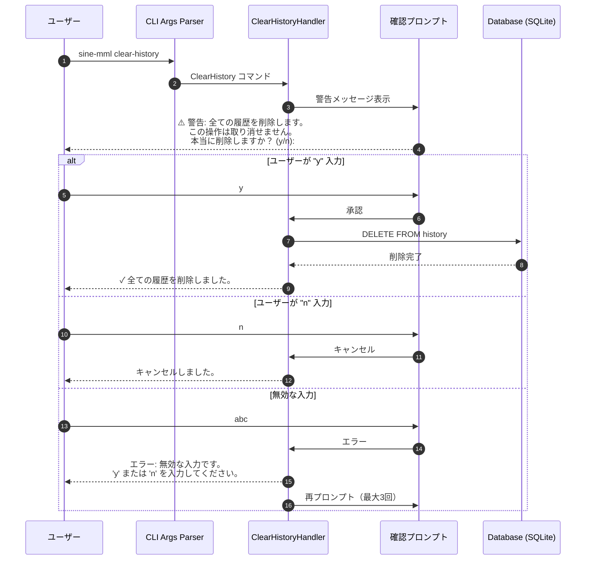
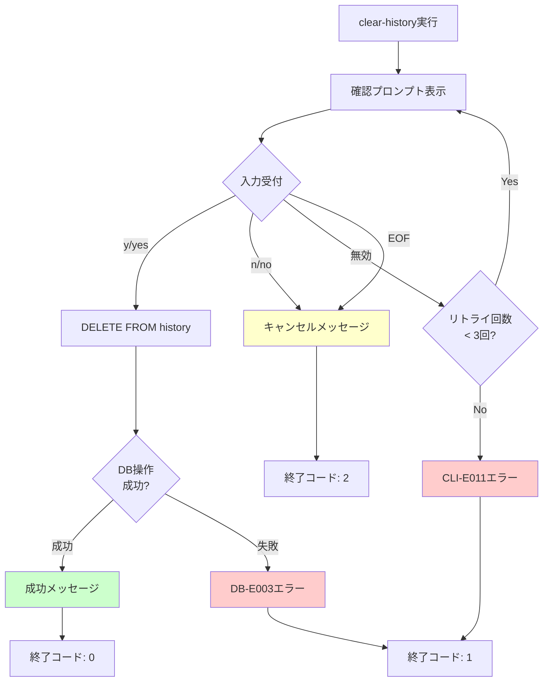
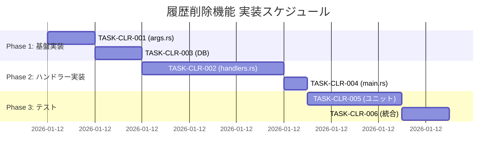
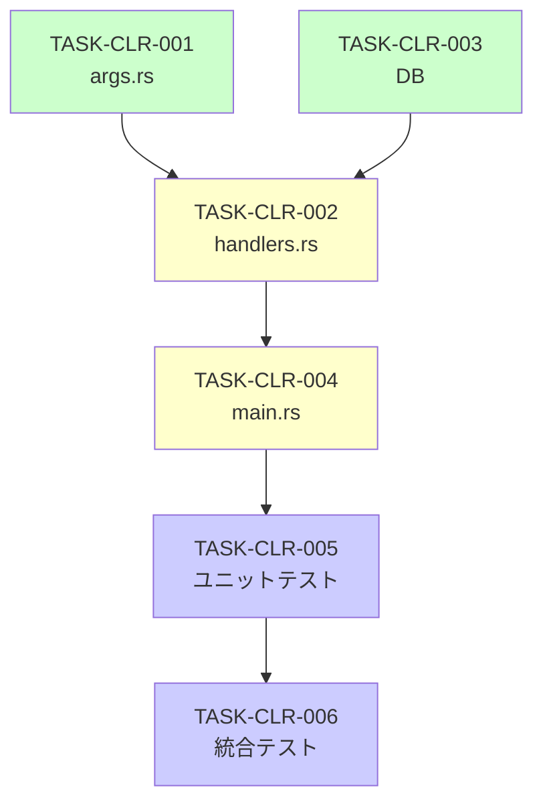

# 履歴削除機能 詳細設計書

## メタ情報

| 項目 | 内容 |
|------|------|
| ドキュメントID | DET-CLR-001 |
| バージョン | 1.0.0 |
| ステータス | レビュー待ち |
| 作成日 | 2026-01-11 |
| 最終更新日 | 2026-01-11 |
| 親機能 | 履歴管理機能拡張 |
| 含まれる機能ID | F-026 |
| 関連基本設計書 | BASIC-CLI-003 |
| 関連要件定義書 | REQ-CLI-003 |

## 1. 概要

### 1.1 目的

sine-mml v2.0において、全ての演奏履歴を削除する`clear-history`サブコマンドを追加する。誤操作を防ぐため、確認プロンプトを必須とし、ユーザーの明示的な承認後に削除を実行する。

### 1.2 背景

**問題点**:
- 現在、履歴を削除する手段がない（SQLiteファイルを手動削除するしかない）
- 履歴が蓄積すると、`history`コマンドの表示が煩雑になる
- テスト環境や開発環境で履歴をクリアしたいニーズがある

**解決策**:
- `clear-history`サブコマンドを追加し、全履歴を一括削除
- 確認プロンプトで誤操作を防止
- 削除後は元に戻せないことを明示的に警告

### 1.3 処理フロー概要



## 2. 機能要件

### 2.1 対象機能

| 機能ID | 機能名 | 概要 | 優先度 |
|--------|--------|------|--------|
| F-026 | 履歴削除機能 | `clear-history`サブコマンドで全履歴削除 | 必須 |

### 2.2 ビジネスルール

| ルールID | 内容 |
|---------|------|
| BR-HIST-001 | 削除前に必ず確認プロンプトを表示する |
| BR-HIST-002 | 承認入力は "y", "Y", "yes", "Yes" のいずれか |
| BR-HIST-003 | キャンセル入力は "n", "N", "no", "No" のいずれか |
| BR-HIST-004 | 無効な入力は最大3回まで再プロンプト、3回失敗でエラー終了 |
| BR-HIST-005 | 削除は全履歴を対象とし、部分削除は不可 |
| BR-HIST-006 | 削除後は元に戻せないことを警告メッセージで明示 |

### 2.3 サブコマンド仕様

#### `clear-history`

| 項目 | 内容 |
|------|------|
| コマンド形式 | `sine-mml clear-history` |
| 引数 | なし |
| オプション | なし |
| 説明 | 全ての演奏履歴を削除（確認プロンプト付き） |
| 終了コード | 0: 成功、1: エラー、2: キャンセル |

### 2.4 確認プロンプト仕様

#### 表示メッセージ

```
⚠️  警告: 全ての履歴を削除します。この操作は取り消せません。
本当に削除しますか？ (y/n): 
```

#### 入力バリデーション

| 入力 | 動作 | 説明 |
|------|------|------|
| `y`, `Y`, `yes`, `Yes` | 削除実行 | 承認として扱う |
| `n`, `N`, `no`, `No` | キャンセル | 削除せず終了 |
| 上記以外 | エラー再プロンプト | 最大3回まで再入力可能 |
| EOF (Ctrl+D) | キャンセル | パイプ入力時の安全装置 |

#### 成功時メッセージ

```
✓ 全ての履歴を削除しました。
```

#### キャンセル時メッセージ

```
キャンセルしました。
```

#### エラーメッセージ

```
エラー: 無効な入力です。'y' または 'n' を入力してください。
```

## 3. 設計書一覧

| 設計書 | パス | 説明 |
|--------|------|------|
| バックエンド設計書 | [./バックエンド設計書.md](./バックエンド設計書.md) | CLI引数、ハンドラー、DB操作の詳細 |

## 4. 共通設計への参照

| 設計書 | パス |
|--------|------|
| データベース設計 | [../database/データベース設計書.md](../database/データベース設計書.md) |
| CLIインターフェース設計 | [../cli-interface/詳細設計書.md](../cli-interface/詳細設計書.md) |

## 5. 画面設計（CLI出力）

### 5.1 正常系フロー

#### ケース1: 承認して削除

```
$ sine-mml clear-history
⚠️  警告: 全ての履歴を削除します。この操作は取り消せません。
本当に削除しますか？ (y/n): y
✓ 全ての履歴を削除しました。

$ sine-mml history
履歴がありません
```

#### ケース2: キャンセル

```
$ sine-mml clear-history
⚠️  警告: 全ての履歴を削除します。この操作は取り消せません。
本当に削除しますか？ (y/n): n
キャンセルしました。

$ sine-mml history
╔════╦═══════════════════════════════════════════════════╦══════════╦════════╦═════╦═════════════════════╗
║ ID ║ MML                                               ║ Waveform ║ Volume ║ BPM ║ Created At          ║
╠════╬═══════════════════════════════════════════════════╬══════════╬════════╬═════╬═════════════════════╣
║ 1  ║ T120 CDEFGAB                                      ║ Sine     ║ 1.0    ║ 120 ║ 2026-01-11 10:30:00 ║
╚════╩═══════════════════════════════════════════════════╩══════════╩════════╩═════╩═════════════════════╝
```

### 5.2 異常系フロー

#### ケース3: 無効な入力（1回目）

```
$ sine-mml clear-history
⚠️  警告: 全ての履歴を削除します。この操作は取り消せません。
本当に削除しますか？ (y/n): abc
エラー: 無効な入力です。'y' または 'n' を入力してください。
本当に削除しますか？ (y/n): y
✓ 全ての履歴を削除しました。
```

#### ケース4: 無効な入力（3回失敗）

```
$ sine-mml clear-history
⚠️  警告: 全ての履歴を削除します。この操作は取り消せません。
本当に削除しますか？ (y/n): abc
エラー: 無効な入力です。'y' または 'n' を入力してください。
本当に削除しますか？ (y/n): xyz
エラー: 無効な入力です。'y' または 'n' を入力してください。
本当に削除しますか？ (y/n): 123
エラー: 無効な入力です。'y' または 'n' を入力してください。
エラー: 入力試行回数の上限に達しました。操作を中止します。
```

#### ケース5: EOF入力（Ctrl+D）

```
$ sine-mml clear-history
⚠️  警告: 全ての履歴を削除します。この操作は取り消せません。
本当に削除しますか？ (y/n): ^D
キャンセルしました。
```

#### ケース6: パイプ入力（非対話モード）

```
$ echo "y" | sine-mml clear-history
⚠️  警告: 全ての履歴を削除します。この操作は取り消せません。
本当に削除しますか？ (y/n): ✓ 全ての履歴を削除しました。
```

### 5.3 データベースエラー

```
$ sine-mml clear-history
⚠️  警告: 全ての履歴を削除します。この操作は取り消せません。
本当に削除しますか？ (y/n): y
エラー: [DB-E003] データベースの削除に失敗しました: database is locked
```

## 6. エラーハンドリング

### 6.1 エラーコード一覧

| コード | 説明 | 対処方法 |
|--------|------|----------|
| CLI-E011 | 無効な入力（3回失敗） | 'y' または 'n' を入力してください |
| CLI-E012 | 標準入力読み取りエラー | ターミナル環境を確認してください |
| DB-E003 | データベース削除失敗 | データベースファイルのロック状態を確認 |
| DB-E004 | データベース接続失敗 | データベースファイルの権限を確認 |

### 6.2 エラー処理フロー



## 7. テスト戦略

### 7.1 ユニットテスト項目

| テストケース | 検証内容 | 期待結果 |
|-------------|---------|---------|
| `test_clear_history_command_exists` | `ClearHistory`コマンドが存在 | `Command::ClearHistory`が定義されている |
| `test_parse_input_yes` | "y", "Y", "yes", "Yes"の解析 | すべて`true`（承認）を返す |
| `test_parse_input_no` | "n", "N", "no", "No"の解析 | すべて`false`（キャンセル）を返す |
| `test_parse_input_invalid` | "abc", "123"等の無効入力 | `None`（無効）を返す |
| `test_db_clear_all` | `clear_all()`メソッド | `DELETE FROM history`が実行される |
| `test_db_clear_all_empty` | 空のDBで`clear_all()` | エラーなく完了 |

### 7.2 統合テスト項目

| テストケース | 入力 | 期待される動作 |
|-------------|------|---------------|
| 承認して削除 | `y` | 全履歴削除、成功メッセージ表示 |
| 大文字承認 | `Y` | 全履歴削除、成功メッセージ表示 |
| yes承認 | `yes` | 全履歴削除、成功メッセージ表示 |
| キャンセル | `n` | 履歴保持、キャンセルメッセージ表示 |
| 無効入力→承認 | `abc\ny` | エラー表示後、削除実行 |
| 3回無効入力 | `a\nb\nc` | エラーメッセージ、終了コード1 |
| EOF入力 | Ctrl+D | キャンセルメッセージ、終了コード2 |

### 7.3 E2Eテスト項目

| シナリオ | ステップ |
|---------|---------|
| 完全削除フロー | 1. 履歴作成 → 2. `clear-history` → 3. `y`入力 → 4. `history`で空確認 |
| キャンセルフロー | 1. 履歴作成 → 2. `clear-history` → 3. `n`入力 → 4. `history`で保持確認 |
| リトライフロー | 1. `clear-history` → 2. 無効入力2回 → 3. `y`入力 → 4. 削除成功 |
| パイプ入力 | `echo "y" \| sine-mml clear-history` → 削除成功 |

### 7.4 テストデータ

#### 事前準備データ

```sql
INSERT INTO history (mml, waveform, volume, bpm, created_at) VALUES
  ('T120 CDEFGAB', 'sine', 1.0, 120, '2026-01-11 10:00:00'),
  ('T140 GABCDEF', 'sawtooth', 0.8, 140, '2026-01-11 10:05:00'),
  ('T100 ABCDEFG', 'square', 0.5, 100, '2026-01-11 10:10:00');
```

#### 削除後の期待状態

```sql
SELECT COUNT(*) FROM history;
-- 期待値: 0
```

## 8. 非機能要件

### 8.1 パフォーマンス

| 項目 | 要件 | 測定方法 |
|------|------|---------|
| 削除処理時間 | 1秒以内（10万件の履歴） | ベンチマーク |
| プロンプト応答時間 | 即座（< 100ms） | ユーザー体感 |

### 8.2 ユーザビリティ

| 項目 | 要件 |
|------|------|
| 警告メッセージ | 絵文字（⚠️）で視覚的に強調 |
| 成功メッセージ | チェックマーク（✓）で明確化 |
| エラーメッセージ | 具体的な対処方法を提示 |
| プロンプト | 入力形式を明示（y/n） |

### 8.3 セキュリティ

| 項目 | 対策 |
|------|------|
| 誤操作防止 | 確認プロンプト必須 |
| 非対話モード | パイプ入力でも動作（自動化対応） |
| リトライ制限 | 最大3回で強制終了 |

## 9. 実装タスク分割（200行以下）

### 9.1 タスク一覧

| タスクID | タスク名 | 対象ファイル | 推定行数 | 優先度 |
|---------|---------|-------------|---------|--------|
| TASK-CLR-001 | `ClearHistory`コマンド追加 | `src/cli/args.rs` | 5行 | 高 |
| TASK-CLR-002 | 確認プロンプト実装 | `src/cli/handlers.rs` | 80行 | 高 |
| TASK-CLR-003 | `clear_all()`メソッド実装 | `src/db/history.rs` | 15行 | 高 |
| TASK-CLR-004 | ハンドラールーティング追加 | `src/main.rs` | 3行 | 高 |
| TASK-CLR-005 | ユニットテスト | `src/cli/handlers.rs` | 60行 | 中 |
| TASK-CLR-006 | 統合テスト | `tests/cli_integration.rs` | 40行 | 中 |

**合計推定行数**: 203行（テスト含む）

### 9.2 実装順序



### 9.3 依存関係



## 10. 関連サブ機能

- [履歴メモ機能](./履歴メモ機能_詳細設計書.md) - `--note`オプションで履歴にメモを付与
- [データベース設計](../database/データベース設計書.md) - `history`テーブル定義
- [DBマイグレーション v2](../db-migration-v2/README.md) - スキーマ変更管理

## 11. 参考資料

### 11.1 類似機能の実装例

| プロジェクト | コマンド | 確認プロンプト |
|------------|---------|---------------|
| Git | `git clean -fd` | `-i`オプションで対話モード |
| npm | `npm cache clean --force` | `--force`で強制実行 |
| Docker | `docker system prune` | `Are you sure? [y/N]` |

### 11.2 Rustでの標準入力処理

```rust
use std::io::{self, Write};

fn read_line() -> io::Result<String> {
    let mut input = String::new();
    io::stdin().read_line(&mut input)?;
    Ok(input.trim().to_string())
}
```

---

## 変更履歴

| 日付 | バージョン | 変更内容 | 担当者 |
|:---|:---|:---|:---|
| 2026-01-11 | 1.0.0 | 初版作成 | detailed-design-writer |
