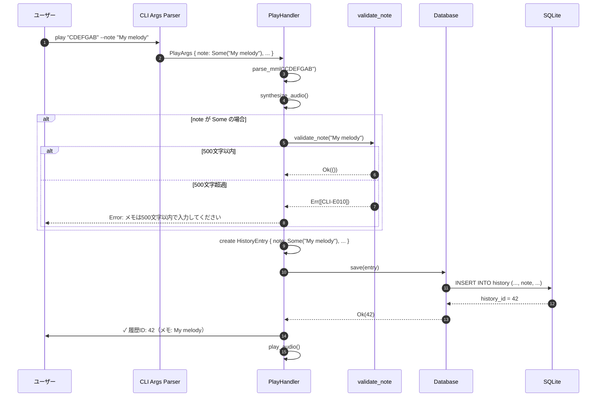
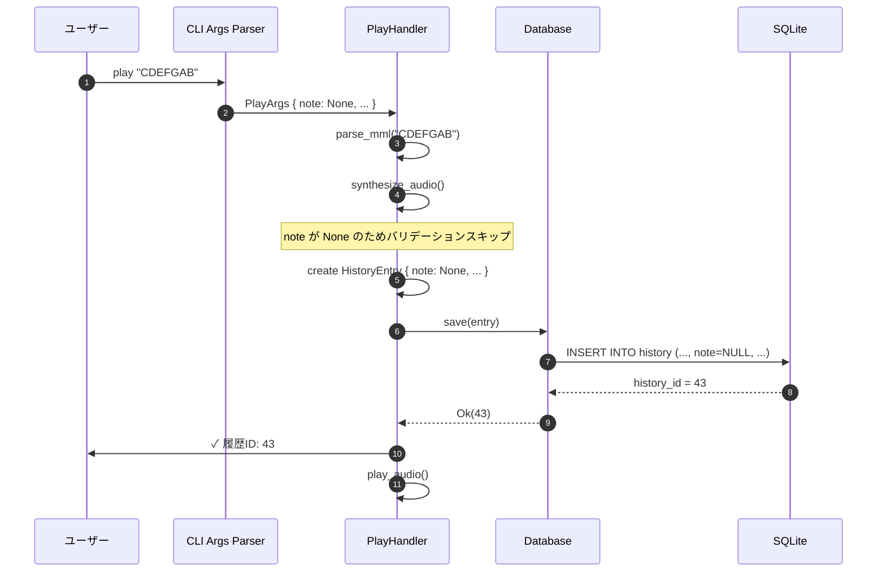
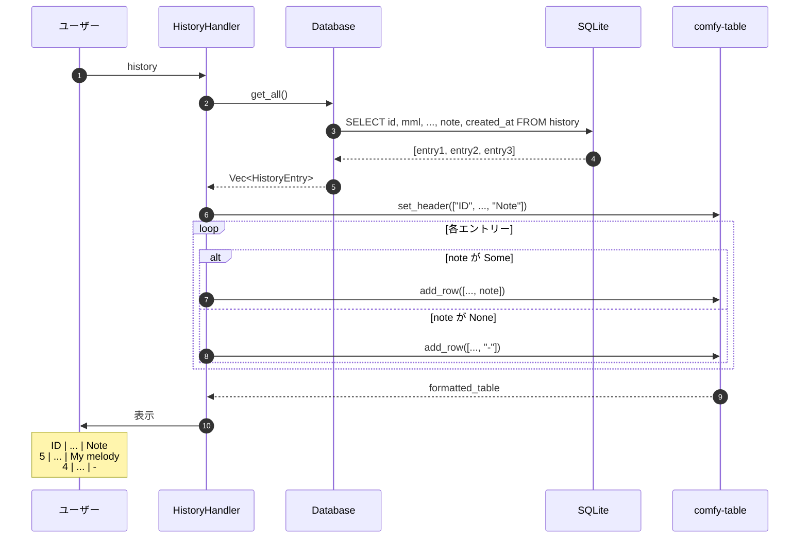
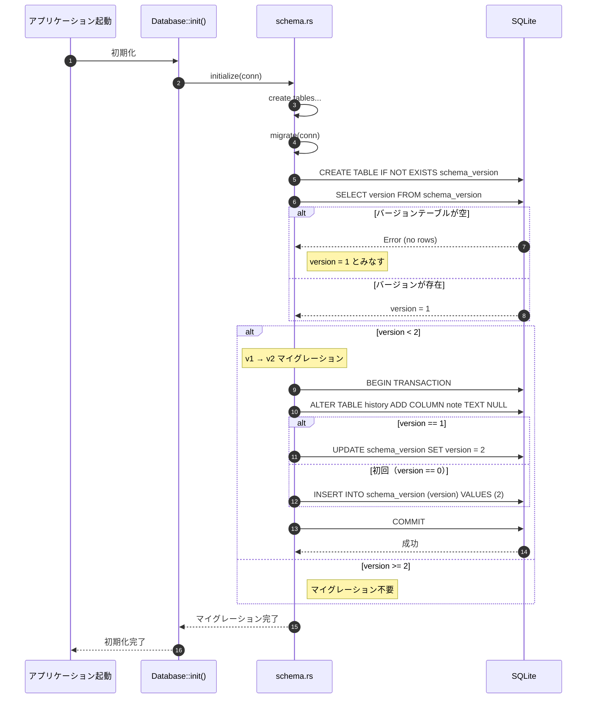
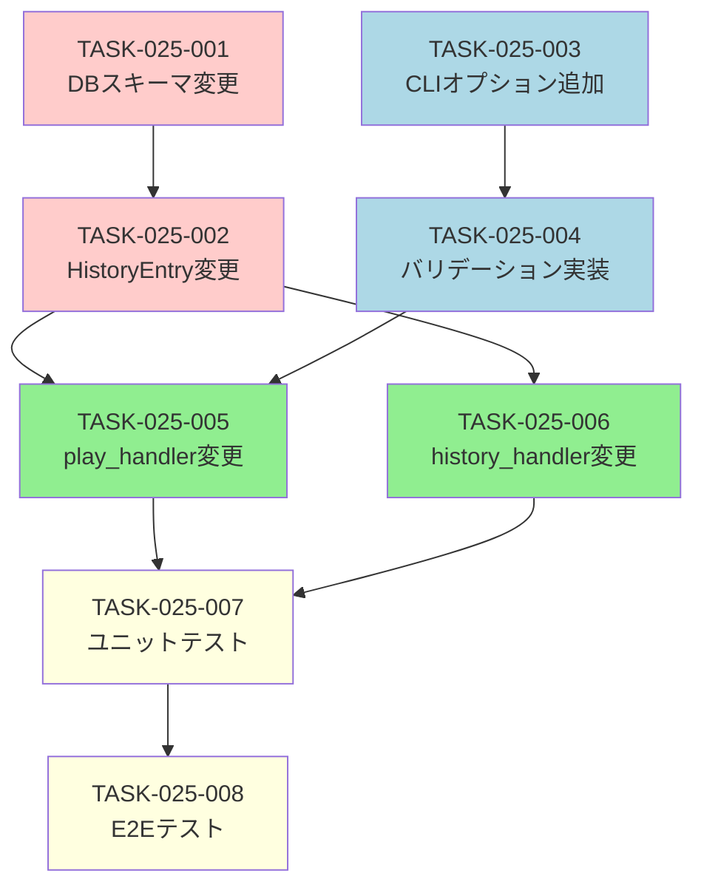

# 履歴メモ機能 詳細設計書

## 1. ドキュメント情報

| 項目 | 内容 |
|------|------|
| ドキュメントID | DET-NOTE-001 |
| 機能ID | F-025 |
| バージョン | 1.0.0 |
| ステータス | ドラフト |
| 作成日 | 2026-01-11 |
| 最終更新日 | 2026-01-11 |
| 作成者 | detailed-design-writer |
| 関連文書 | REQ-CLI-003_MML-Syntax-Extension.md (v1.0.0)<br>BASIC-CLI-003_MML-Syntax-Extension.md (v1.0.0) |

---

## 2. 機能概要

### 2.1 目的

MML演奏履歴にメモを付与できるようにし、後で履歴を見返したときに「何の曲か」「どういう意図で作ったか」を思い出しやすくする。

### 2.2 背景

現在の履歴機能では、MML文字列、波形、BPM、音量などの技術的パラメータのみが記録されるため、後で履歴を見返したときに「これは何の曲だったか」が分からない。特に以下のような課題がある：

- 短いMML文字列（例: `CDEFGAB`）では内容が推測できない
- 実験的な演奏が多数記録されると、どれが重要か分からない
- 後で再利用したい演奏を見つけにくい

### 2.3 スコープ

#### 対象範囲
- `play` コマンドに `--note` オプションを追加
- 履歴DBに `note` カラムを追加（v1→v2マイグレーション）
- `history` コマンドの表示にメモ列を追加
- メモのバリデーション（最大500文字、UTF-8対応）

#### 対象外
- メモの検索機能（Phase 3.0で検討）
- メモの編集機能（Phase 3.0で検討）
- メモのエクスポート/インポート（Phase 3.0で検討）
- 履歴IDからのメモ取得API（現時点では不要）

---

## 3. 詳細仕様

### 3.1 CLIオプション仕様

#### 3.1.1 `--note` オプション

**追加先**: `play` サブコマンド

**定義**:
```rust
// src/cli/args.rs

#[derive(Args, Debug)]
pub struct PlayArgs {
    // ... 既存フィールド ...
    
    /// 履歴にメモを付与（最大500文字）
    #[arg(
        long,
        help = "履歴にメモを付与（最大500文字、UTF-8対応）"
    )]
    pub note: Option<String>,
}
```

**仕様**:

| 項目 | 内容 |
|------|------|
| オプション名 | `--note` |
| 短縮形 | なし |
| 型 | `Option<String>` |
| デフォルト値 | `None` |
| 必須 | いいえ |
| 最大長 | 500文字 |
| 文字コード | UTF-8（絵文字対応） |
| 併用可能オプション | `--loop-play`, `--metronome`, `--waveform`, `--volume` |

**使用例**:
```bash
# 基本的な使用
sine-mml play "CDEFGAB" --note "My first melody"

# 日本語とUTF-8文字
sine-mml play "CDEFGAB" --note "最初のメロディ 🎵"

# ループ再生と併用
sine-mml play "[CDEF]4" --loop-play --note "Loop test"

# メモなし（従来通り）
sine-mml play "CDEFGAB"

# 空文字列（保存される）
sine-mml play "CDEFGAB" --note ""
```

#### 3.1.2 バリデーション仕様

**バリデーションタイミング**: CLIハンドラー内（`play_handler`）

**バリデーション関数**:
```rust
// src/cli/handlers.rs

/// メモのバリデーション
///
/// # Arguments
/// * `note` - メモ文字列
///
/// # Returns
/// * `Ok(())` - バリデーション成功
/// * `Err(anyhow::Error)` - バリデーション失敗
fn validate_note(note: &str) -> Result<()> {
    if note.chars().count() > 500 {
        bail!("[CLI-E010] メモは500文字以内で入力してください（現在: {}文字）", note.chars().count());
    }
    Ok(())
}
```

**バリデーションルール**:

| ルールID | 条件 | エラーメッセージ |
|---------|------|----------------|
| BR-058 | メモは任意（指定しなくても動作する） | - |
| BR-059 | メモの最大長は500文字 | `[CLI-E010] メモは500文字以内で入力してください（現在: XXX文字）` |
| BR-060 | UTF-8文字列（絵文字も可） | - |
| BR-061 | `--loop-play` と併用可能 | - |

**注意事項**:
- 文字数カウントは `str::chars().count()` を使用（バイト数ではなく文字数）
- 空文字列（`""`）は許可される（DBには空文字列として保存）
- `None`（オプション未指定）の場合はDBに`NULL`として保存

---

### 3.2 データモデル変更

#### 3.2.1 `HistoryEntry` 構造体

**変更前**:
```rust
// src/db/history.rs

pub struct HistoryEntry {
    pub id: Option<i64>,
    pub mml: String,
    pub waveform: Waveform,
    pub volume: f32,
    pub bpm: u16,
    pub created_at: DateTime<Utc>,
}
```

**変更後**:
```rust
// src/db/history.rs

pub struct HistoryEntry {
    pub id: Option<i64>,
    pub mml: String,
    pub waveform: Waveform,
    pub volume: f32,
    pub bpm: u16,
    pub note: Option<String>,  // 追加
    pub created_at: DateTime<Utc>,
}
```

**フィールド仕様**:

| フィールド | 型 | NULL許可 | デフォルト | 説明 |
|-----------|-----|---------|----------|------|
| `note` | `Option<String>` | ○ | `None` | 履歴メモ（最大500文字） |

#### 3.2.2 `HistoryEntry::new` メソッド

**変更前**:
```rust
impl HistoryEntry {
    pub fn new(mml: String, waveform: Waveform, volume: f32, bpm: u16) -> Self {
        Self {
            id: None,
            mml,
            waveform,
            volume,
            bpm,
            created_at: Utc::now(),
        }
    }
}
```

**変更後**:
```rust
impl HistoryEntry {
    pub fn new(mml: String, waveform: Waveform, volume: f32, bpm: u16, note: Option<String>) -> Self {
        Self {
            id: None,
            mml,
            waveform,
            volume,
            bpm,
            note,
            created_at: Utc::now(),
        }
    }
}
```

**変更点**:
- `note: Option<String>` パラメータを追加
- 構造体初期化時に `note` フィールドを設定

---

### 3.3 データベーススキーマ変更

#### 3.3.1 スキーマバージョン

**変更前**:
```rust
// src/db/schema.rs
pub const CURRENT_VERSION: i64 = 1;
```

**変更後**:
```rust
// src/db/schema.rs
pub const CURRENT_VERSION: i64 = 2;  // v1 → v2
```

#### 3.3.2 テーブル定義

**変更前（v1）**:
```sql
CREATE TABLE IF NOT EXISTS history (
    id INTEGER PRIMARY KEY AUTOINCREMENT,
    mml TEXT NOT NULL,
    waveform TEXT NOT NULL CHECK(waveform IN ('sine', 'sawtooth', 'square')),
    volume REAL NOT NULL CHECK(volume >= 0.0 AND volume <= 1.0),
    bpm INTEGER NOT NULL CHECK(bpm >= 30 AND bpm <= 300),
    created_at TEXT NOT NULL
);
```

**変更後（v2）**:
```sql
CREATE TABLE IF NOT EXISTS history (
    id INTEGER PRIMARY KEY AUTOINCREMENT,
    mml TEXT NOT NULL,
    waveform TEXT NOT NULL CHECK(waveform IN ('sine', 'sawtooth', 'square')),
    volume REAL NOT NULL CHECK(volume >= 0.0 AND volume <= 1.0),
    bpm INTEGER NOT NULL CHECK(bpm >= 30 AND bpm <= 300),
    note TEXT NULL CHECK(length(note) <= 500),  -- 追加
    created_at TEXT NOT NULL
);
```

**追加カラム仕様**:

| カラム名 | 型 | NULL | CHECK制約 | 説明 |
|---------|-----|------|----------|------|
| `note` | TEXT | ○ | `length(note) <= 500` | 履歴メモ（最大500文字） |

**注意事項**:
- `NULL` 許可により、既存レコードとの互換性を保つ
- `CHECK` 制約により、DB層でも500文字制限を強制
- `length()` 関数は文字数（バイト数ではない）をカウント

#### 3.3.3 マイグレーション処理

**マイグレーション関数**:
```rust
// src/db/schema.rs

/// データベーススキーママイグレーション
///
/// # Arguments
/// * `conn` - SQLite接続
///
/// # Returns
/// * `Ok(())` - マイグレーション成功
/// * `Err(DbError)` - マイグレーション失敗
pub fn migrate(conn: &Connection) -> Result<(), DbError> {
    // 1. スキーマバージョンテーブルの作成（初回のみ）
    conn.execute(
        "CREATE TABLE IF NOT EXISTS schema_version (
            version INTEGER PRIMARY KEY
        )",
        [],
    )?;
    
    // 2. 現在のバージョン取得（存在しない場合は1とみなす）
    let version: i64 = conn
        .query_row("SELECT version FROM schema_version", [], |row| row.get(0))
        .unwrap_or(1);
    
    // 3. v1 → v2 マイグレーション
    if version < 2 {
        conn.execute("ALTER TABLE history ADD COLUMN note TEXT NULL", [])?;
        
        // バージョン更新
        if version == 1 {
            conn.execute("UPDATE schema_version SET version = 2", [])?;
        } else {
            conn.execute("INSERT INTO schema_version (version) VALUES (2)", [])?;
        }
    }
    
    Ok(())
}
```

**マイグレーション実行タイミング**:
- アプリケーション起動時（`Database::init()` 内）
- `initialize()` 関数の後に `migrate()` を呼び出す

**変更後の `initialize()` 関数**:
```rust
// src/db/schema.rs

pub fn initialize(conn: &Connection) -> Result<(), DbError> {
    // 既存のテーブル作成処理...
    
    // マイグレーション実行
    migrate(conn)?;
    
    Ok(())
}
```

---

### 3.4 履歴保存処理の変更

#### 3.4.1 `play_handler` の変更

**変更箇所**: `src/cli/handlers.rs` の `play_handler` 関数

**変更前**:
```rust
let entry = db::HistoryEntry::new(mml_string.clone(), db_waveform, args.volume, bpm_u16);
```

**変更後**:
```rust
// メモのバリデーション
if let Some(ref note) = args.note {
    validate_note(note)?;
}

let entry = db::HistoryEntry::new(
    mml_string.clone(),
    db_waveform,
    args.volume,
    bpm_u16,
    args.note.clone(),  // 追加
);
```

**処理フロー**:
1. `args.note` が `Some` の場合、バリデーションを実行
2. バリデーション成功後、`HistoryEntry::new` に `note` を渡す
3. DB保存処理は既存のまま（`save` メソッドが `note` を処理）

#### 3.4.2 `Database::save` メソッドの変更

**変更前**:
```rust
// src/db/mod.rs (または history.rs)

pub fn save(&self, entry: &HistoryEntry) -> Result<i64, DbError> {
    let conn = self.conn.lock().unwrap();
    conn.execute(
        "INSERT INTO history (mml, waveform, volume, bpm, created_at)
         VALUES (?1, ?2, ?3, ?4, ?5)",
        (
            &entry.mml,
            entry.waveform.as_str(),
            entry.volume,
            entry.bpm,
            entry.created_at.to_rfc3339(),
        ),
    )?;
    Ok(conn.last_insert_rowid())
}
```

**変更後**:
```rust
pub fn save(&self, entry: &HistoryEntry) -> Result<i64, DbError> {
    let conn = self.conn.lock().unwrap();
    conn.execute(
        "INSERT INTO history (mml, waveform, volume, bpm, note, created_at)
         VALUES (?1, ?2, ?3, ?4, ?5, ?6)",
        (
            &entry.mml,
            entry.waveform.as_str(),
            entry.volume,
            entry.bpm,
            entry.note.as_deref(),  // Option<String> → Option<&str>
            entry.created_at.to_rfc3339(),
        ),
    )?;
    Ok(conn.last_insert_rowid())
}
```

**変更点**:
- SQL文に `note` カラムを追加
- `entry.note.as_deref()` で `Option<String>` を `Option<&str>` に変換
- `None` の場合は `NULL` として保存される

---

### 3.5 履歴表示の変更

#### 3.5.1 `history_handler` の変更

**変更前**:
```rust
// src/cli/handlers.rs

pub fn history_handler() -> Result<()> {
    let db = Database::init()?;
    let entries = db.get_all()?;
    
    if entries.is_empty() {
        println!("履歴がありません。");
        return Ok(());
    }
    
    let mut table = Table::new();
    table.set_header(vec![
        "ID", "Created At", "MML", "Waveform", "BPM", "Volume"
    ]);
    
    for entry in entries {
        table.add_row(vec![
            entry.id.unwrap().to_string(),
            entry.created_at.format("%Y-%m-%d %H:%M:%S").to_string(),
            entry.mml,
            entry.waveform.as_str().to_string(),
            entry.bpm.to_string(),
            entry.volume.to_string(),
        ]);
    }
    
    println!("{table}");
    Ok(())
}
```

**変更後**:
```rust
pub fn history_handler() -> Result<()> {
    let db = Database::init()?;
    let entries = db.get_all()?;
    
    if entries.is_empty() {
        println!("履歴がありません。");
        return Ok(());
    }
    
    let mut table = Table::new();
    table.set_header(vec![
        "ID", "Created At", "MML", "Waveform", "BPM", "Volume", "Note"  // 追加
    ]);
    
    for entry in entries {
        table.add_row(vec![
            entry.id.unwrap().to_string(),
            entry.created_at.format("%Y-%m-%d %H:%M:%S").to_string(),
            entry.mml,
            entry.waveform.as_str().to_string(),
            entry.bpm.to_string(),
            entry.volume.to_string(),
            entry.note.unwrap_or_else(|| "-".to_string()),  // 追加
        ]);
    }
    
    println!("{table}");
    Ok(())
}
```

**変更点**:
- テーブルヘッダーに `"Note"` 列を追加
- 各行に `entry.note` を追加
- `None` の場合は `"-"` と表示（空欄にしない）

**表示例**:
```
ID | Created At          | MML          | Waveform | BPM | Volume | Note
---|---------------------|--------------|----------|-----|--------|------------------
5  | 2026-01-11 10:30:00 | CDEFGAB      | sine     | 120 | 0.5    | My first melody
4  | 2026-01-09 14:20:00 | [CDEF]4      | square   | 140 | 0.7    | Loop test
3  | 2026-01-08 09:15:00 | O5 T180 CRCR | sawtooth | 180 | 0.8    | -
```

#### 3.5.2 `Database::get_all` メソッドの変更

**変更前**:
```rust
pub fn get_all(&self) -> Result<Vec<HistoryEntry>, DbError> {
    let conn = self.conn.lock().unwrap();
    let mut stmt = conn.prepare(
        "SELECT id, mml, waveform, volume, bpm, created_at
         FROM history
         ORDER BY created_at DESC"
    )?;
    
    let entries = stmt.query_map([], |row| {
        Ok(HistoryEntry {
            id: Some(row.get(0)?),
            mml: row.get(1)?,
            waveform: row.get::<_, String>(2)?.parse().unwrap(),
            volume: row.get(3)?,
            bpm: row.get(4)?,
            created_at: DateTime::parse_from_rfc3339(&row.get::<_, String>(5)?)
                .unwrap()
                .with_timezone(&Utc),
        })
    })?
    .collect::<Result<Vec<_>, _>>()?;
    
    Ok(entries)
}
```

**変更後**:
```rust
pub fn get_all(&self) -> Result<Vec<HistoryEntry>, DbError> {
    let conn = self.conn.lock().unwrap();
    let mut stmt = conn.prepare(
        "SELECT id, mml, waveform, volume, bpm, note, created_at
         FROM history
         ORDER BY created_at DESC"
    )?;
    
    let entries = stmt.query_map([], |row| {
        Ok(HistoryEntry {
            id: Some(row.get(0)?),
            mml: row.get(1)?,
            waveform: row.get::<_, String>(2)?.parse().unwrap(),
            volume: row.get(3)?,
            bpm: row.get(4)?,
            note: row.get(5)?,  // 追加
            created_at: DateTime::parse_from_rfc3339(&row.get::<_, String>(6)?)
                .unwrap()
                .with_timezone(&Utc),
        })
    })?
    .collect::<Result<Vec<_>, _>>()?;
    
    Ok(entries)
}
```

**変更点**:
- SQL文に `note` カラムを追加
- `row.get(5)?` で `note` を取得（`Option<String>` として）
- `created_at` のインデックスを 5 → 6 に変更

---

## 4. 処理フロー

### 4.1 メモ付き演奏保存フロー



### 4.2 メモなし演奏保存フロー



### 4.3 履歴表示フロー（メモ列追加）



### 4.4 DBマイグレーションフロー（v1→v2）



---

## 5. 画面変更（履歴表示）

### 5.1 変更前の履歴表示

```
ID | Created At          | MML          | Waveform | BPM | Volume
---|---------------------|--------------|----------|-----|--------
5  | 2026-01-11 10:30:00 | CDEFGAB      | sine     | 120 | 0.5
4  | 2026-01-09 14:20:00 | [CDEF]4      | square   | 140 | 0.7
3  | 2026-01-08 09:15:00 | O5 T180 CRCR | sawtooth | 180 | 0.8
```

### 5.2 変更後の履歴表示

```
ID | Created At          | MML          | Waveform | BPM | Volume | Note
---|---------------------|--------------|----------|-----|--------|------------------
5  | 2026-01-11 10:30:00 | CDEFGAB      | sine     | 120 | 0.5    | My first melody
4  | 2026-01-09 14:20:00 | [CDEF]4      | square   | 140 | 0.7    | Loop test
3  | 2026-01-08 09:15:00 | O5 T180 CRCR | sawtooth | 180 | 0.8    | -
```

### 5.3 表示仕様

| 項目 | 仕様 |
|------|------|
| 列名 | `Note` |
| 表示位置 | 最右列（`Volume` の右） |
| メモあり | メモ内容をそのまま表示 |
| メモなし（`NULL`） | `"-"` と表示 |
| 空文字列（`""`） | 空欄として表示 |
| 長いメモ | 切り詰めなし（全文表示） |

**注意事項**:
- メモが長い場合、テーブルの幅が広がる可能性がある
- `comfy-table` のデフォルト動作に従う（自動折り返し）
- ターミナル幅を超える場合は横スクロールが必要

---

## 6. エラーハンドリング

### 6.1 エラー一覧

| エラーコード | 条件 | メッセージ | HTTPステータス（該当なし） |
|------------|------|-----------|--------------------------|
| CLI-E010 | メモが500文字超過 | `メモは500文字以内で入力してください（現在: XXX文字）` | - |
| DB-E005 | DB保存失敗（note関連） | `履歴の保存に失敗しました: {reason}` | - |
| DB-E006 | マイグレーション失敗 | `データベースのマイグレーションに失敗しました: {reason}` | - |

### 6.2 エラーハンドリング方針

#### CLI-E010: メモ長超過

**発生タイミング**: `play_handler` 内のバリデーション

**処理**:
1. `validate_note()` 関数でエラーを返す
2. `play_handler` がエラーをキャッチ
3. ユーザーにエラーメッセージを表示
4. 演奏は実行されない（履歴も保存されない）

**実装例**:
```rust
if let Some(ref note) = args.note {
    validate_note(note).context("[CLI-E010] メモのバリデーションに失敗しました")?;
}
```

#### DB-E005: DB保存失敗

**発生タイミング**: `Database::save()` 内のSQL実行

**処理**:
1. SQLエラーをキャッチ
2. `DbError` に変換
3. `play_handler` が警告メッセージを表示
4. 演奏は継続（履歴保存失敗は致命的エラーではない）

**実装例**:
```rust
match db.save(&entry) {
    Ok(id) => Some(id),
    Err(e) => {
        eprintln!("Warning: 履歴の保存に失敗しました: {e}");
        None
    }
}
```

#### DB-E006: マイグレーション失敗

**発生タイミング**: `Database::init()` 内の `migrate()` 呼び出し

**処理**:
1. トランザクションロールバック
2. エラーメッセージを表示
3. アプリケーション起動を中断

**実装例**:
```rust
pub fn migrate(conn: &Connection) -> Result<(), DbError> {
    conn.execute("BEGIN TRANSACTION", [])?;
    
    match try_migrate(conn) {
        Ok(_) => {
            conn.execute("COMMIT", [])?;
            Ok(())
        }
        Err(e) => {
            conn.execute("ROLLBACK", [])?;
            Err(e)
        }
    }
}
```

### 6.3 エラーメッセージ例

```bash
# メモ長超過
$ sine-mml play "CDEFGAB" --note "$(python -c 'print("a"*501)')"
Error: [CLI-E010] メモは500文字以内で入力してください（現在: 501文字）

# DB保存失敗（警告のみ）
$ sine-mml play "CDEFGAB" --note "Test"
Warning: 履歴の保存に失敗しました: database is locked
♪ 再生中...

# マイグレーション失敗（起動中断）
$ sine-mml play "CDEFGAB"
Error: [DB-E006] データベースのマイグレーションに失敗しました: disk I/O error
```

---

## 7. テストケース

### 7.1 ユニットテスト

#### 7.1.1 `validate_note` 関数のテスト

**ファイル**: `src/cli/handlers.rs`

```rust
#[cfg(test)]
mod tests {
    use super::*;

    #[test]
    fn test_validate_note_valid() {
        // 正常系: 500文字以内
        assert!(validate_note("My melody").is_ok());
        assert!(validate_note("").is_ok());
        assert!(validate_note(&"a".repeat(500)).is_ok());
    }

    #[test]
    fn test_validate_note_too_long() {
        // 異常系: 501文字
        let result = validate_note(&"a".repeat(501));
        assert!(result.is_err());
        assert!(result.unwrap_err().to_string().contains("500文字以内"));
    }

    #[test]
    fn test_validate_note_utf8() {
        // UTF-8文字（絵文字）
        assert!(validate_note("🎵🎶🎵").is_ok());
        assert!(validate_note("あいうえお").is_ok());
    }

    #[test]
    fn test_validate_note_char_count() {
        // 文字数カウント（バイト数ではない）
        let note = "あ".repeat(500);  // 1500バイトだが500文字
        assert!(validate_note(&note).is_ok());
        
        let note = "あ".repeat(501);  // 1503バイトで501文字
        assert!(validate_note(&note).is_err());
    }
}
```

#### 7.1.2 `HistoryEntry::new` のテスト

**ファイル**: `src/db/history.rs`

```rust
#[cfg(test)]
mod tests {
    use super::*;

    #[test]
    fn test_history_entry_new_with_note() {
        let entry = HistoryEntry::new(
            "CDEFGAB".to_string(),
            Waveform::Sine,
            0.5,
            120,
            Some("My melody".to_string()),
        );
        
        assert_eq!(entry.mml, "CDEFGAB");
        assert_eq!(entry.note, Some("My melody".to_string()));
    }

    #[test]
    fn test_history_entry_new_without_note() {
        let entry = HistoryEntry::new(
            "CDEFGAB".to_string(),
            Waveform::Sine,
            0.5,
            120,
            None,
        );
        
        assert_eq!(entry.mml, "CDEFGAB");
        assert_eq!(entry.note, None);
    }
}
```

#### 7.1.3 DBマイグレーションのテスト

**ファイル**: `tests/unit/db_migration_test.rs`

```rust
use rusqlite::Connection;
use sine_mml::db::schema::{initialize, migrate, CURRENT_VERSION};

#[test]
fn test_migrate_v1_to_v2() {
    let conn = Connection::open_in_memory().unwrap();
    
    // v1スキーマを作成
    conn.execute(
        "CREATE TABLE history (
            id INTEGER PRIMARY KEY,
            mml TEXT NOT NULL,
            waveform TEXT NOT NULL,
            volume REAL NOT NULL,
            bpm INTEGER NOT NULL,
            created_at TEXT NOT NULL
        )",
        [],
    ).unwrap();
    
    conn.execute(
        "CREATE TABLE schema_version (version INTEGER PRIMARY KEY)",
        [],
    ).unwrap();
    
    conn.execute("INSERT INTO schema_version (version) VALUES (1)", []).unwrap();
    
    // テストデータ挿入
    conn.execute(
        "INSERT INTO history (mml, waveform, volume, bpm, created_at)
         VALUES ('CDEFGAB', 'sine', 0.5, 120, '2026-01-11T10:00:00Z')",
        [],
    ).unwrap();
    
    // マイグレーション実行
    migrate(&conn).unwrap();
    
    // バージョン確認
    let version: i64 = conn.query_row(
        "SELECT version FROM schema_version",
        [],
        |row| row.get(0),
    ).unwrap();
    assert_eq!(version, 2);
    
    // noteカラムの存在確認
    let result: Result<Option<String>, _> = conn.query_row(
        "SELECT note FROM history WHERE id = 1",
        [],
        |row| row.get(0),
    );
    assert!(result.is_ok());
    assert_eq!(result.unwrap(), None);  // 既存レコードはNULL
}

#[test]
fn test_migrate_idempotent() {
    let conn = Connection::open_in_memory().unwrap();
    initialize(&conn).unwrap();
    
    // 1回目のマイグレーション
    migrate(&conn).unwrap();
    let version1: i64 = conn.query_row(
        "SELECT version FROM schema_version",
        [],
        |row| row.get(0),
    ).unwrap();
    
    // 2回目のマイグレーション（冪等性確認）
    migrate(&conn).unwrap();
    let version2: i64 = conn.query_row(
        "SELECT version FROM schema_version",
        [],
        |row| row.get(0),
    ).unwrap();
    
    assert_eq!(version1, version2);
}
```

### 7.2 統合テスト（E2E）

#### 7.2.1 メモ付き演奏のテスト

**ファイル**: `tests/cli_integration.rs`

```rust
use assert_cmd::Command;
use predicates::prelude::*;
use tempfile::TempDir;

#[test]
fn test_play_with_note() {
    let temp_dir = TempDir::new().unwrap();
    let db_path = temp_dir.path().join("test.db");
    
    // メモ付き演奏
    Command::cargo_bin("sine-mml")
        .unwrap()
        .env("SINE_MML_DB_PATH", db_path.to_str().unwrap())
        .args(&["play", "CDEFGAB", "--note", "My melody"])
        .assert()
        .success();
    
    // 履歴確認
    Command::cargo_bin("sine-mml")
        .unwrap()
        .env("SINE_MML_DB_PATH", db_path.to_str().unwrap())
        .args(&["history"])
        .assert()
        .success()
        .stdout(predicate::str::contains("My melody"));
}

#[test]
fn test_play_without_note() {
    let temp_dir = TempDir::new().unwrap();
    let db_path = temp_dir.path().join("test.db");
    
    // メモなし演奏
    Command::cargo_bin("sine-mml")
        .unwrap()
        .env("SINE_MML_DB_PATH", db_path.to_str().unwrap())
        .args(&["play", "CDEFGAB"])
        .assert()
        .success();
    
    // 履歴確認（"-" が表示される）
    Command::cargo_bin("sine-mml")
        .unwrap()
        .env("SINE_MML_DB_PATH", db_path.to_str().unwrap())
        .args(&["history"])
        .assert()
        .success()
        .stdout(predicate::str::contains("-"));
}

#[test]
fn test_play_with_note_too_long() {
    let temp_dir = TempDir::new().unwrap();
    let db_path = temp_dir.path().join("test.db");
    
    let long_note = "a".repeat(501);
    
    // 501文字のメモ（エラー）
    Command::cargo_bin("sine-mml")
        .unwrap()
        .env("SINE_MML_DB_PATH", db_path.to_str().unwrap())
        .args(&["play", "CDEFGAB", "--note", &long_note])
        .assert()
        .failure()
        .stderr(predicate::str::contains("500文字以内"));
}

#[test]
fn test_play_with_note_utf8() {
    let temp_dir = TempDir::new().unwrap();
    let db_path = temp_dir.path().join("test.db");
    
    // UTF-8文字（絵文字）
    Command::cargo_bin("sine-mml")
        .unwrap()
        .env("SINE_MML_DB_PATH", db_path.to_str().unwrap())
        .args(&["play", "CDEFGAB", "--note", "🎵 My melody 🎶"])
        .assert()
        .success();
    
    // 履歴確認
    Command::cargo_bin("sine-mml")
        .unwrap()
        .env("SINE_MML_DB_PATH", db_path.to_str().unwrap())
        .args(&["history"])
        .assert()
        .success()
        .stdout(predicate::str::contains("🎵 My melody 🎶"));
}

#[test]
fn test_play_with_note_and_loop() {
    let temp_dir = TempDir::new().unwrap();
    let db_path = temp_dir.path().join("test.db");
    
    // ループ再生とメモの併用
    Command::cargo_bin("sine-mml")
        .unwrap()
        .env("SINE_MML_DB_PATH", db_path.to_str().unwrap())
        .args(&["play", "CDEFGAB", "--loop-play", "--note", "Loop test"])
        .assert()
        .success();
    
    // 履歴確認
    Command::cargo_bin("sine-mml")
        .unwrap()
        .env("SINE_MML_DB_PATH", db_path.to_str().unwrap())
        .args(&["history"])
        .assert()
        .success()
        .stdout(predicate::str::contains("Loop test"));
}
```

### 7.3 テストケース一覧

| テストID | テストケース | 期待結果 | テストレベル |
|---------|-------------|---------|-------------|
| TC-025-001 | `--note "My melody"` | メモが保存される | E2E |
| TC-025-002 | メモなし | メモは NULL、履歴表示で "-" | E2E |
| TC-025-003 | `--note "あいうえお🎵"` | UTF-8文字列が保存される | E2E |
| TC-025-004 | `--note "500文字以上"` | エラー（長さ制限） | E2E |
| TC-025-005 | `--note ""` | 空文字列が保存される | E2E |
| TC-025-006 | `--loop-play --note "Loop test"` | ループ再生でもメモが保存される | E2E |
| TC-025-007 | `validate_note("My melody")` | `Ok(())` | ユニット |
| TC-025-008 | `validate_note("a".repeat(501))` | `Err(...)` | ユニット |
| TC-025-009 | `HistoryEntry::new(..., Some("note"))` | `note` フィールドが設定される | ユニット |
| TC-025-010 | `HistoryEntry::new(..., None)` | `note` フィールドが `None` | ユニット |
| TC-025-011 | v1 DB → v2 マイグレーション | `note` カラムが追加される | ユニット |
| TC-025-012 | 既存データの保持 | 既存レコードは `note=NULL` で保持 | ユニット |
| TC-025-013 | v2 DB → v2（再実行） | 変更なし（冪等性） | ユニット |

---

## 8. 実装タスク分割（200行以下）

### 8.1 タスク一覧

| タスクID | タスク名 | 対象ファイル | 推定行数 | 優先度 | 依存関係 |
|---------|---------|-------------|---------|--------|---------|
| TASK-025-001 | DBスキーマ変更とマイグレーション | `src/db/schema.rs` | 80行 | 最高 | なし |
| TASK-025-002 | `HistoryEntry` 構造体の変更 | `src/db/history.rs` | 40行 | 高 | TASK-025-001 |
| TASK-025-003 | CLIオプション追加 | `src/cli/args.rs` | 20行 | 高 | なし |
| TASK-025-004 | バリデーション関数実装 | `src/cli/handlers.rs` | 30行 | 高 | TASK-025-003 |
| TASK-025-005 | `play_handler` の変更 | `src/cli/handlers.rs` | 50行 | 高 | TASK-025-002, TASK-025-004 |
| TASK-025-006 | `history_handler` の変更 | `src/cli/handlers.rs` | 40行 | 中 | TASK-025-002 |
| TASK-025-007 | ユニットテスト実装 | `src/db/history.rs`, `src/cli/handlers.rs` | 100行 | 中 | TASK-025-001〜006 |
| TASK-025-008 | E2Eテスト実装 | `tests/cli_integration.rs` | 150行 | 中 | TASK-025-001〜006 |

**合計推定行数**: 510行（各タスクは200行以下）

### 8.2 実装順序



**推奨実装順序**:
1. **TASK-025-001** (DBスキーマ変更) - 最優先、他のタスクの基盤
2. **TASK-025-003** (CLIオプション追加) - 並行実装可能
3. **TASK-025-002** (HistoryEntry変更) - TASK-025-001完了後
4. **TASK-025-004** (バリデーション実装) - TASK-025-003完了後
5. **TASK-025-005** (play_handler変更) - TASK-025-002, 004完了後
6. **TASK-025-006** (history_handler変更) - TASK-025-002完了後
7. **TASK-025-007** (ユニットテスト) - TASK-025-001〜006完了後
8. **TASK-025-008** (E2Eテスト) - TASK-025-007完了後

**所要時間見積もり**: 2-3日

---

## 9. 関連ドキュメント

| ドキュメント | パス | 関連性 |
|-------------|------|--------|
| 要件定義書 | `docs/requirements/REQ-CLI-003_MML-Syntax-Extension.md` | 機能要件の元 |
| 基本設計書 | `docs/designs/basic/BASIC-CLI-003_MML-Syntax-Extension.md` | 本設計書の親 |
| DBマイグレーション設計書 | `docs/designs/detailed/db-migration-v2/詳細設計書.md` | DBスキーマ変更の詳細 |
| 履歴削除機能設計書 | `docs/designs/detailed/history-management/履歴削除機能.md` | 同じ履歴管理機能 |

---

## 10. 変更履歴

| 日付 | バージョン | 変更内容 | 担当者 |
|:---|:---|:---|:---|
| 2026-01-11 | 1.0.0 | 初版作成 | detailed-design-writer |
