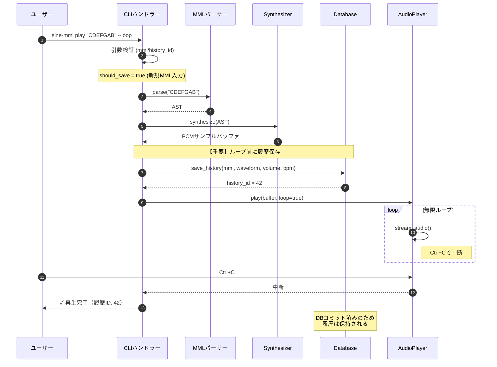
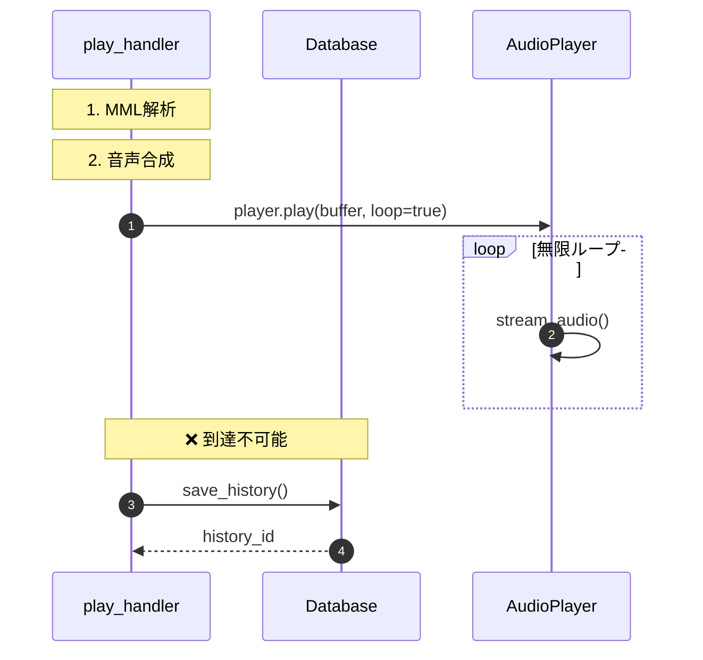
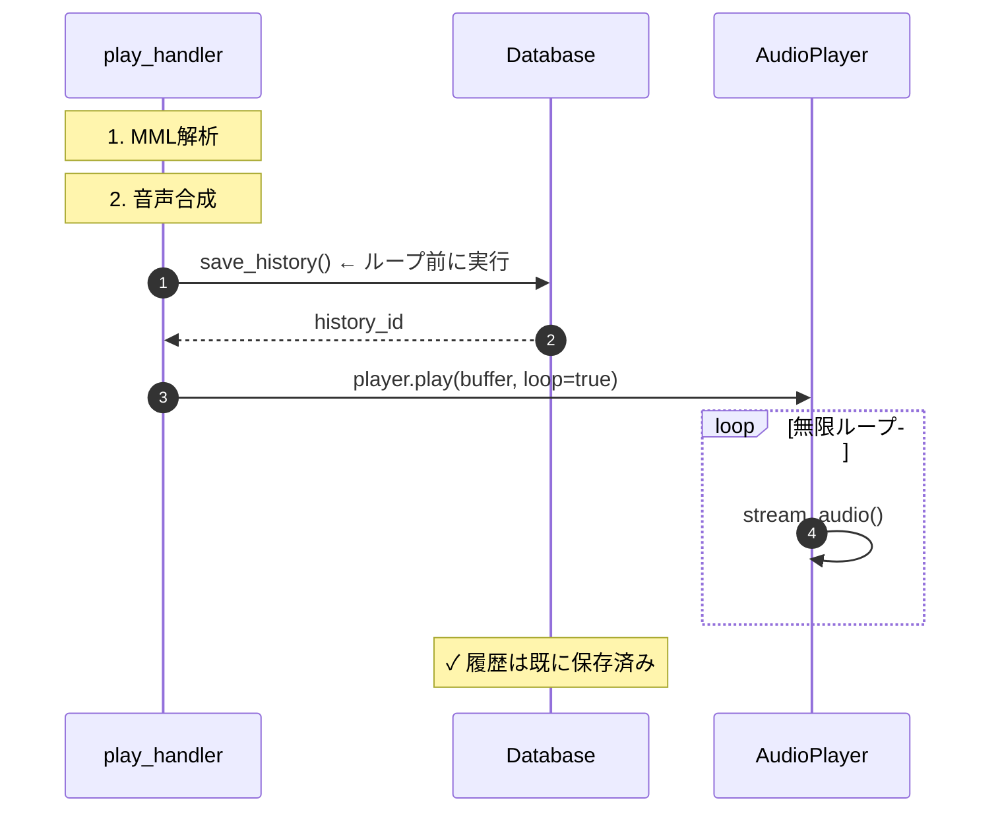

# ループ履歴保存 詳細設計書

## メタ情報

| 項目 | 内容 |
|------|------|
| ドキュメントID | DET-LOOP-001 |
| バージョン | 1.0.0 |
| ステータス | ドラフト |
| 作成日 | 2026-01-11 |
| 最終更新日 | 2026-01-11 |
| 親機能 | ループ再生機能改善 |
| 含まれる機能ID | F-018 (ループ履歴登録) |
| 関連基本設計書 | BASIC-CLI-002_MML-Synthesizer-Enhancement.md (v1.0.0) |
| 関連要件定義書 | REQ-CLI-002_MML-Synthesizer-Enhancement.md |

## 1. 概要

### 1.1 問題背景

現在のsine-mml v1.0では、ループ再生機能（`--loop`フラグ）を使用した際に演奏履歴がデータベースに保存されない不具合が存在する。

**根本原因**: 履歴保存処理が再生処理の**後**に配置されているため、ループ再生時の無限ループによって履歴保存処理に到達できない。

```rust
// 現在の処理順序（v1.0）
1. MML解析
2. 音声合成
3. 再生開始 (--loop指定時は無限ループ)
4. 履歴保存 ← ループ時は到達不可能
```

この問題により、ユーザーがループ再生で練習した演奏を後から再利用できず、再度MML文字列を入力する必要が生じている。

### 1.2 解決策

履歴保存処理を再生処理の**前**に移動することで、ループ再生時も確実に履歴を保存する。

```rust
// 修正後の処理順序（v2.0）
1. MML解析
2. 音声合成
3. 履歴保存 ← ループ前に実行
4. 再生開始 (--loop指定時は無限ループ)
```

この変更により、ユーザーはCtrl+Cでループを中断した後も、演奏履歴を`history`コマンドで確認し、`--history-id`で再生できるようになる。

### 1.3 全体処理フロー



## 2. 機能要件

### 2.1 対象機能

| 機能ID | 機能名 | 概要 | 優先度 |
|--------|--------|------|--------|
| F-018 | ループ履歴登録 | ループ再生時も履歴DBに保存 | 必須 |

### 2.2 ビジネスルール

| ルールID | 内容 |
|---------|------|
| BR-040 | ループ再生でも新規MML入力時は履歴保存を実行する |
| BR-041 | 履歴IDからの再生時（`--history-id`）は重複保存を防ぐため保存しない |
| BR-LOOP-001 | 履歴保存はループ開始前（無限ループ突入前）に完了させる |
| BR-LOOP-002 | 履歴保存失敗時もユーザーへ警告を表示し、再生は継続する |
| BR-LOOP-003 | ループ中断（Ctrl+C）後も、保存済みの履歴は削除しない |

### 2.3 機能詳細

#### F-018: ループ履歴登録

- **入力**: `--loop`フラグ + MML文字列
- **出力**: 履歴DBへの保存、履歴ID表示
- **処理**: ループ開始前（無限ループ突入前）に履歴保存を実行
- **前提条件**: 
  - 新規MML入力である（`--history-id`未指定）
  - MML解析と音声合成が成功している
- **事後条件**:
  - 履歴がDBに保存されている
  - 履歴IDがユーザーに通知されている
  - ループ再生が開始されている

## 3. 設計書一覧

| 設計書 | パス | 説明 |
|--------|------|------|
| バックエンド設計書 | [./バックエンド設計書.md](./バックエンド設計書.md) | play_handler関数の修正仕様 |

## 4. 共通設計への参照

| 設計書 | パス |
|--------|------|
| データベース設計 | [../database/データベース設計書.md](../database/データベース設計書.md) |
| データベース詳細設計 | [../database/詳細設計書.md](../database/詳細設計書.md) |

## 5. 処理フロー比較

### 5.1 変更前（v1.0）- 問題あり



**問題点**: ステップ4（履歴保存）に到達できず、履歴が保存されない。

### 5.2 変更後（v2.0）- 修正版



**改善点**: ステップ3で履歴保存を完了し、ステップ4でループ再生を開始。

## 6. 影響範囲

### 6.1 変更対象ファイル

| ファイル | 変更内容 | 変更レベル |
|---------|----------|-----------|
| `src/cli/handlers.rs` | `play_handler`関数内の履歴保存処理を移動（L76-96 → L60-75の間に移動） | 中 |

### 6.2 影響を受けるコンポーネント

| コンポーネント | 影響内容 | 影響度 |
|---------------|----------|--------|
| MMLパーサー | 影響なし | なし |
| Synthesizer | 影響なし | なし |
| AudioPlayer | 影響なし | なし |
| Database | 呼び出しタイミングのみ変更 | 低 |
| CLIインターフェース | ユーザー体験の向上（履歴が保存されるようになる） | 高 |

### 6.3 変更が不要な箇所

- データベーススキーマ（`history`テーブル）: 変更なし
- `history`コマンド: 変更なし
- `export`コマンド: 変更なし
- MML構文: 変更なし
- 音声合成ロジック: 変更なし

## 7. エラーコード一覧

| コード | HTTPステータス | 説明 | 対処 |
|--------|---------------|------|------|
| CLI-E001 | - | MML文字列と`--history-id`の両方が未指定 | エラーメッセージ表示、処理中断 |
| CLI-E002 | - | 指定された`history_id`がDB内に存在しない | エラーメッセージ表示、処理中断 |
| DB-E004 | - | 履歴保存失敗（INSERT） | 警告表示、再生は継続 |

**注**: 履歴保存失敗（DB-E004）時は、ユーザー体験を損なわないため再生を継続する。

## 8. テスト戦略

### 8.1 ユニットテスト

| テスト項目 | 内容 | 期待結果 |
|-----------|------|----------|
| 履歴保存タイミング | ループ再生時の履歴保存順序を検証 | 履歴保存が`player.play()`前に完了 |
| should_saveフラグ | 新規MML入力時は`true`、履歴ID再生時は`false` | フラグが正しく設定される |
| 履歴保存失敗時 | DB保存失敗をシミュレート | 警告表示後、再生が継続される |

### 8.2 統合テスト

| テスト項目 | 内容 | 期待結果 |
|-----------|------|----------|
| ループ再生＋履歴保存 | `--loop`フラグ付きで実行し、2秒後にCtrl+C | 履歴DBに保存されている |
| 履歴ID再生＋ループ | `--history-id 1 --loop`で実行 | 重複保存されない（既存レコードのみ） |
| 非ループ再生 | `--loop`なしで実行 | 従来通り履歴が保存される |

### 8.3 E2Eテスト（新規追加）

```rust
#[test]
fn test_loop_saves_history() {
    // テスト用DBパス設定
    std::env::set_var("SINE_MML_DB_PATH", "./test_history.db");
    
    let mut cmd = Command::cargo_bin("sine-mml").unwrap();
    cmd.arg("play")
       .arg("CDEFGAB")
       .arg("--loop")
       .timeout(Duration::from_secs(2)); // 2秒後に中断
    
    cmd.assert().success();
    
    // 履歴DB確認
    let db = Database::init().unwrap();
    let history = db.list(Some(1)).unwrap();
    assert!(history.iter().any(|e| e.mml == "CDEFGAB"));
    
    // クリーンアップ
    std::fs::remove_file("./test_history.db").ok();
}
```

### 8.4 手動テストシナリオ

| # | 操作 | 期待結果 |
|---|------|----------|
| 1 | `sine-mml play "CDEFG" --loop`実行 | 「✓ 再生完了（履歴ID: N）」表示 |
| 2 | 5秒後にCtrl+C | ループ中断、プロンプト復帰 |
| 3 | `sine-mml history`実行 | 手順1のMML「CDEFG」が一覧に表示 |
| 4 | `sine-mml play --history-id N --loop`実行 | ループ再生開始 |
| 5 | `sine-mml history`実行 | 重複レコードなし（レコード数不変） |

## 9. 非機能要件

### 9.1 パフォーマンス

| 項目 | 要件 | 測定方法 |
|------|------|----------|
| 履歴保存による追加レイテンシ | 50ms以内 | ループ開始までの時間を計測 |
| DB書き込み失敗時の影響 | 500ms以内に警告表示 | エラー検知から警告表示までの時間 |

### 9.2 信頼性

| 項目 | 要件 |
|------|------|
| データ整合性 | 履歴保存失敗時も既存履歴は破壊されない |
| トランザクション | DB保存はACID特性を保証（SQLiteのWALモード） |

### 9.3 ユーザビリティ

| 項目 | 要件 |
|------|------|
| フィードバック | 履歴保存成功時、履歴IDを即座に表示 |
| エラーメッセージ | 履歴保存失敗時、原因を明示（例: ディスク容量不足） |

## 10. セキュリティ考慮事項

- **SQLインジェクション対策**: rusqliteのプレースホルダー（`?`）を使用してクエリを構築（既存実装で対応済み）
- **ディスクI/O制限**: 履歴保存失敗時にリトライしない（DoS攻撃リスク回避）

## 11. 未解決課題

| ID | 課題 | 対応方針 | 優先度 |
|----|------|----------|--------|
| I-LOOP-001 | 履歴保存中のユーザー中断（Ctrl+C） | Phase 2で検討（保存完了まで待機） | 低 |
| I-LOOP-002 | DB保存失敗時のリトライ機能 | Phase 2で検討（最大3回リトライ） | 低 |

## 12. リリースノート（ドラフト）

### v2.0.0 - ループ履歴保存機能

**変更内容**:
- ループ再生（`--loop`）時も演奏履歴がデータベースに保存されるようになりました

**影響**:
- ループ再生で練習した演奏を後から`history`コマンドで確認できます
- 履歴IDを使ってループ再生を再現できます（`sine-mml play --history-id N --loop`）

**アップグレード手順**:
- データベースマイグレーション不要
- 既存の履歴データは互換性あり

---

## 変更履歴

| 日付 | バージョン | 変更内容 | 担当者 |
|:---|:---|:---|:---|
| 2026-01-11 | 1.0.0 | 初版作成 | Antigravity |
