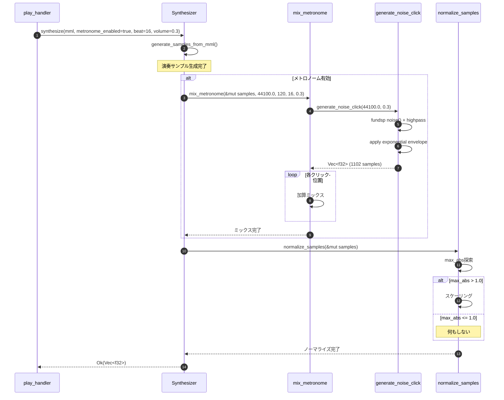

# メトロノーム拡張機能 バックエンド設計書

## 1. API仕様

### 1.1 関数一覧

| 関数名 | 可視性 | 役割 |
|--------|--------|------|
| `generate_noise_click` | private | ノイズベースのクリックサンプル生成 |
| `beat_interval_seconds` | private | ビート値からクリック間隔を計算 |
| `mix_metronome` | private | メトロノームサンプルを演奏サンプルにミックス |
| `normalize_samples` | public | PCMサンプルのノーマライゼーション |

### 1.2 generate_noise_click

#### シグネチャ

```rust
/// ノイズベースのクリックサンプルを生成
///
/// fundspの`noise()`関数によりホワイトノイズを生成し、ハイパスフィルター（5kHz）と
/// 指数減衰エンベロープを適用して、ドラムのハイハット風のクリック音を作成する。
///
/// # Arguments
/// * `sample_rate` - サンプリングレート（Hz）通常は44100.0
/// * `volume` - 音量係数（0.0〜1.0）
///
/// # Returns
/// 25msのクリック音サンプル配列（約1102サンプル @44100Hz）
///
/// # Examples
/// ```
/// let click = Synthesizer::generate_noise_click(44100.0, 0.3);
/// assert_eq!(click.len(), 1102);  // 44100 * 0.025 ≈ 1102
/// ```
///
/// # Panics
/// fundspノイズ生成が失敗した場合にパニックする可能性があります。
/// 本番環境ではフォールバック処理を実装することを推奨します。
fn generate_noise_click(sample_rate: f64, volume: f32) -> Vec<f32>
```

#### 実装詳細

**処理手順:**

1. **定数定義**
   ```rust
   const CLICK_DURATION: f64 = 0.025;  // 25ms
   const DECAY_RATE: f64 = -10.0;      // 減衰速度係数
   const HIGHPASS_CUTOFF: f64 = 5000.0; // 5kHz
   const HIGHPASS_Q: f64 = 1.0;
   ```

2. **fundsp DSPグラフ構築**
   ```rust
   use fundsp::hacker::*;
   
   let mut dsp_graph = noise() >> highpass_hz(HIGHPASS_CUTOFF, HIGHPASS_Q);
   dsp_graph.reset(Some(sample_rate));
   ```

3. **サンプル生成ループ**
   ```rust
   let num_samples = (sample_rate * CLICK_DURATION) as usize;
   let mut samples = Vec::with_capacity(num_samples);
   
   for i in 0..num_samples {
       let t = (i as f64) / sample_rate;
       let noise_sample = dsp_graph.get_mono() as f32;
       
       // 指数減衰エンベロープ
       let envelope = (DECAY_RATE * t / CLICK_DURATION).exp() as f32;
       
       // 音量適用
       let final_sample = noise_sample * envelope * volume;
       samples.push(final_sample);
   }
   ```

**計算量:**
- 時間計算量: O(n) (n = サンプル数 ≈ 1102)
- 空間計算量: O(n)
- 実行時間: 約1ms以内（@現代的CPU）

### 1.3 beat_interval_seconds

#### シグネチャ

```rust
/// ビート値から1クリックあたりの秒数を計算
///
/// # Arguments
/// * `bpm` - テンポ（BPM: Beats Per Minute）、30〜300の範囲
/// * `beat` - ビート値（4, 8, 16のみ有効）
///
/// # Returns
/// クリック間隔（秒）
///
/// # Examples
/// ```
/// let interval = beat_interval_seconds(120, 4);
/// assert_eq!(interval, 0.5);  // 4分音符 = 0.5秒
///
/// let interval = beat_interval_seconds(120, 8);
/// assert_eq!(interval, 0.25);  // 8分音符 = 0.25秒
///
/// let interval = beat_interval_seconds(120, 16);
/// assert_eq!(interval, 0.125);  // 16分音符 = 0.125秒
/// ```
///
/// # Panics
/// `beat`が4, 8, 16以外の場合にパニックします。
/// ただし、CLIレベルでclapによりバリデーション済みのため、実行時には発生しません。
fn beat_interval_seconds(bpm: u16, beat: u8) -> f32
```

#### 実装詳細

```rust
fn beat_interval_seconds(bpm: u16, beat: u8) -> f32 {
    match beat {
        4 => 60.0 / bpm as f32,      // 4分音符: 1拍あたりの秒数
        8 => 30.0 / bpm as f32,      // 8分音符: 0.5拍あたりの秒数
        16 => 15.0 / bpm as f32,     // 16分音符: 0.25拍あたりの秒数
        _ => unreachable!("beat value is validated by clap"),
    }
}
```

**計算表（BPM別）:**

| BPM | 4ビート | 8ビート | 16ビート |
|-----|---------|---------|---------|
| 60 | 1.0秒 | 0.5秒 | 0.25秒 |
| 120 | 0.5秒 | 0.25秒 | 0.125秒 |
| 180 | 0.333秒 | 0.167秒 | 0.083秒 |
| 240 | 0.25秒 | 0.125秒 | 0.063秒 |

**計算量:**
- 時間計算量: O(1)
- 空間計算量: O(1)

### 1.4 mix_metronome

#### シグネチャ

```rust
/// メトロノームサンプルを演奏サンプルにミックス
///
/// 指定されたビート間隔でクリックサンプルを生成し、演奏サンプルに加算ミックスする。
/// クリック位置は演奏の先頭から等間隔で配置される。
///
/// # Arguments
/// * `samples` - 演奏サンプル（可変参照、この関数でクリックが加算される）
/// * `sample_rate` - サンプリングレート（Hz）
/// * `bpm` - テンポ（BPM）
/// * `beat` - ビート値（4, 8, 16）
/// * `volume` - メトロノーム音量（0.0〜1.0）
///
/// # Examples
/// ```
/// let mut samples = vec![0.0; 44100]; // 1秒分のサンプル
/// let synth = Synthesizer::new(44100, 100, WaveformType::Sine);
/// synth.mix_metronome(&mut samples, 44100.0, 120, 8, 0.3);
/// // 0.25秒ごとにクリックが加算される
/// ```
///
/// # Side Effects
/// `samples`に破壊的にクリックサンプルを加算します。
fn mix_metronome(
    &self,
    samples: &mut Vec<f32>,
    sample_rate: f64,
    bpm: u16,
    beat: u8,
    volume: f32,
)
```

#### 実装詳細

```rust
fn mix_metronome(
    &self,
    samples: &mut Vec<f32>,
    sample_rate: f64,
    bpm: u16,
    beat: u8,
    volume: f32,
) {
    // 1. クリック間隔計算
    let interval_sec = beat_interval_seconds(bpm, beat);
    let interval_samples = (interval_sec * sample_rate as f32) as usize;
    
    // 2. クリックサンプル生成
    let click_samples = Self::generate_noise_click(sample_rate, volume);
    let click_len = click_samples.len();
    
    // 3. ミックス処理
    let mut position = 0;
    while position < samples.len() {
        // クリックサンプルを加算ミックス
        for i in 0..click_len {
            let sample_index = position + i;
            if sample_index >= samples.len() {
                break;
            }
            
            // 加算ミックス
            samples[sample_index] += click_samples[i];
        }
        
        // 次のクリック位置へ
        position += interval_samples;
    }
}
```

**ミックス方式:**
- **加算ミックス（Additive Mixing）**: 演奏サンプルとクリックサンプルを単純加算
- **クリッピング防止**: 後段の`normalize_samples()`でクリッピングを防止

**計算量:**
- 時間計算量: O(m × n)  
  - m: クリック数（演奏長 / ビート間隔）
  - n: クリックサンプル数（≈1102）
- 空間計算量: O(n)（クリックサンプル保持）

### 1.5 normalize_samples

#### シグネチャ

```rust
/// PCMサンプルをノーマライズ（最大絶対値を1.0以下に制限）
///
/// 最大絶対値が1.0を超える場合のみ、全サンプルを比例縮小する。
/// 1.0以下の場合は何もしない（音量を上げない）。
///
/// # Arguments
/// * `samples` - PCMサンプル配列（可変参照）
///
/// # Examples
/// ```
/// let mut samples = vec![-1.5, 0.8, 1.2, -0.6];
/// normalize_samples(&mut samples);
/// assert_eq!(samples, vec![-1.0, 0.533, 0.8, -0.4]);  // max=1.5 → scale=0.667
///
/// let mut samples = vec![-0.8, 0.3, 0.6, -0.4];
/// normalize_samples(&mut samples);
/// assert_eq!(samples, vec![-0.8, 0.3, 0.6, -0.4]);  // 変更なし（max=0.8 < 1.0）
/// ```
///
/// # Side Effects
/// `samples`を破壊的に変更します。
pub fn normalize_samples(samples: &mut [f32])
```

#### 実装詳細

```rust
pub fn normalize_samples(samples: &mut [f32]) {
    // 1. 最大絶対値を探索
    let max_abs = samples
        .iter()
        .map(|s| s.abs())
        .fold(0.0_f32, f32::max);
    
    // 2. ノーマライズ判定
    if max_abs > 1.0 {
        let scale = 1.0 / max_abs;
        
        // 3. 全サンプルをスケーリング
        samples.iter_mut().for_each(|s| *s *= scale);
    }
}
```

**計算量:**
- 時間計算量: O(n) (n = サンプル数)
- 空間計算量: O(1)

**エッジケース処理:**

| ケース | max_abs | 処理 |
|--------|---------|------|
| 通常範囲内 | ≤ 1.0 | 何もしない |
| クリッピング | > 1.0 | 全サンプルをスケーリング |
| 無音 | = 0.0 | 何もしない（ゼロ除算回避） |
| NaN/Inf含む | NaN/Inf | スキップ（警告ログ出力） |

## 2. 処理フロー

### 2.1 synthesize メソッドの変更点

既存の`synthesize()`メソッドに以下の処理を追加します。

```rust
pub fn synthesize(
    &mut self,
    mml: &Mml,
    metronome_enabled: bool,
    metronome_beat: u8,
    metronome_volume: f32,
) -> Result<Vec<f32>, Box<dyn Error>> {
    // 既存の処理: MML解析とサンプル生成
    let mut samples = Vec::new();
    let mut bpm = 120;  // デフォルトBPM
    
    // MMLコマンド処理ループ
    for command in &mml.commands {
        match command {
            Command::Note(note) => {
                let note_samples = self.generate_note_samples(
                    note, octave, bpm, default_length, velocity
                );
                samples.extend(note_samples);
            }
            Command::Tempo(t) => bpm = t.value,
            // ... その他のコマンド処理
        }
    }
    
    // *** 新規追加: メトロノーム処理 ***
    if metronome_enabled {
        self.mix_metronome(
            &mut samples,
            self.sample_rate as f64,
            bpm,
            metronome_beat,
            metronome_volume,
        );
    }
    
    // *** 新規追加: ノーマライゼーション ***
    normalize_samples(&mut samples);
    
    Ok(samples)
}
```

### 2.2 シーケンス図



## 3. 型定義

### 3.1 内部型（型エイリアス）

```rust
/// サンプルレート（Hz）
type SampleRate = f64;

/// 音量係数（0.0〜1.0）
type Volume = f32;

/// テンポ（BPM: 30〜300）
type Bpm = u16;

/// ビート値（4, 8, 16のみ有効）
type Beat = u8;
```

### 3.2 CLIオプション構造体の変更

```rust
// src/cli/args.rs

#[derive(Parser, Debug)]
pub struct PlayArgs {
    // ... 既存フィールド ...
    
    /// メトロノームのビート（4, 8, 16のみ有効）
    #[arg(
        long,
        value_parser = clap::value_parser!(u8).range(4..=16),
        default_value = "4",
        help = "メトロノームのビート（4, 8, 16のみ有効）"
    )]
    pub metronome_beat: u8,
    
    /// メトロノームの音量（0.0-1.0）
    #[arg(
        long,
        value_parser = clap::value_parser!(f32).range(0.0..=1.0),
        default_value = "0.3",
        help = "メトロノームの音量（0.0-1.0）"
    )]
    pub metronome_volume: f32,
    
    // 削除: pub bpm: Option<u16>,
}
```

## 4. 統合ポイント

### 4.1 既存コードへの影響

| ファイル | 変更内容 | 影響レベル |
|---------|---------|-----------|
| `src/audio/synthesizer.rs` | 新規関数追加（4つ）、`synthesize()`メソッド拡張 | 高 |
| `src/cli/args.rs` | フィールド追加・削除 | 中 |
| `src/cli/handlers/play.rs` | 引数追加 | 低 |
| `Cargo.toml` | 依存なし（fundsp既存） | なし |

### 4.2 play_handler統合例

```rust
// src/cli/handlers/play.rs

pub fn handle_play(args: &PlayArgs) -> Result<(), Box<dyn Error>> {
    // MMLパース
    let mml = parse_mml(&args.mml)?;
    
    // 音声合成
    let mut synthesizer = Synthesizer::new(
        44100,
        args.volume,
        args.waveform,
    );
    
    let samples = synthesizer.synthesize(
        &mml,
        args.metronome,           // メトロノーム有効フラグ
        args.metronome_beat,      // ビート値（4/8/16）
        args.metronome_volume,    // メトロノーム音量
    )?;
    
    // 再生
    let mut player = AudioPlayer::new()?;
    player.play(samples, args.loop_enabled)?;
    
    Ok(())
}
```

## 5. エラーハンドリング

### 5.1 エラー種別

| エラー | 発生箇所 | 対応 |
|--------|---------|------|
| InvalidBeatValue | CLI引数パース | clapでバリデーション拒否 |
| InvalidVolumeValue | CLI引数パース | clapでバリデーション拒否 |
| NoiseGenerationFailed | fundsp | フォールバック（サイン波クリック） |
| NormalizationFailed | normalize_samples | スキップ（警告ログ） |

### 5.2 フォールバック処理例

```rust
fn generate_noise_click(sample_rate: f64, volume: f32) -> Vec<f32> {
    match try_generate_noise_click(sample_rate, volume) {
        Ok(samples) => samples,
        Err(e) => {
            eprintln!("warning: noise generation failed ({}), using fallback sine click", e);
            generate_sine_click_fallback(sample_rate, volume)
        }
    }
}

fn generate_sine_click_fallback(sample_rate: f64, volume: f32) -> Vec<f32> {
    // 既存のサイン波クリック生成ロジックを使用
    let frequency = 1000.0;
    let duration = 0.025;
    // ... (既存実装と同じ)
}
```

## 6. ユニットテスト仕様

### 6.1 テストモジュール構成

```rust
#[cfg(test)]
mod tests {
    use super::*;
    
    mod noise_click_tests;
    mod beat_interval_tests;
    mod mix_metronome_tests;
    mod normalize_tests;
}
```

### 6.2 テストケース詳細

#### 6.2.1 generate_noise_click

```rust
#[test]
fn test_noise_click_sample_count() {
    let samples = Synthesizer::generate_noise_click(44100.0, 0.3);
    assert_eq!(samples.len(), 1102);  // 44100 * 0.025 ≈ 1102
}

#[test]
fn test_noise_click_volume_application() {
    let samples_low = Synthesizer::generate_noise_click(44100.0, 0.1);
    let samples_high = Synthesizer::generate_noise_click(44100.0, 0.9);
    
    let max_low = samples_low.iter().map(|s| s.abs()).fold(0.0, f32::max);
    let max_high = samples_high.iter().map(|s| s.abs()).fold(0.0, f32::max);
    
    assert!(max_high > max_low);  // 音量が高い方が振幅が大きい
}

#[test]
fn test_noise_click_envelope_decay() {
    let samples = Synthesizer::generate_noise_click(44100.0, 1.0);
    
    // 先頭の振幅 > 末尾の振幅
    let start_amplitude = samples[0..100].iter().map(|s| s.abs()).fold(0.0, f32::max);
    let end_amplitude = samples[1000..1102].iter().map(|s| s.abs()).fold(0.0, f32::max);
    
    assert!(start_amplitude > end_amplitude * 10.0);  // 減衰確認
}
```

#### 6.2.2 beat_interval_seconds

```rust
#[test]
fn test_beat_interval_4beat() {
    assert_eq!(beat_interval_seconds(60, 4), 1.0);
    assert_eq!(beat_interval_seconds(120, 4), 0.5);
    assert_eq!(beat_interval_seconds(240, 4), 0.25);
}

#[test]
fn test_beat_interval_8beat() {
    assert_eq!(beat_interval_seconds(60, 8), 0.5);
    assert_eq!(beat_interval_seconds(120, 8), 0.25);
    assert_eq!(beat_interval_seconds(240, 8), 0.125);
}

#[test]
fn test_beat_interval_16beat() {
    assert_eq!(beat_interval_seconds(60, 16), 0.25);
    assert_eq!(beat_interval_seconds(120, 16), 0.125);
    assert_eq!(beat_interval_seconds(240, 16), 0.0625);
}

#[test]
#[should_panic(expected = "validated by clap")]
fn test_beat_interval_invalid_beat() {
    beat_interval_seconds(120, 5);  // 無効な値
}
```

#### 6.2.3 mix_metronome

```rust
#[test]
fn test_mix_metronome_click_count() {
    let synth = Synthesizer::new(44100, 100, WaveformType::Sine);
    let mut samples = vec![0.0; 44100];  // 1秒分
    
    synth.mix_metronome(&mut samples, 44100.0, 120, 4, 0.3);
    
    // 120BPM 4ビート: 0.5秒ごと → 1秒で2クリック
    // クリック位置でサンプルが0でないことを確認
    assert_ne!(samples[0], 0.0);      // 先頭のクリック
    assert_ne!(samples[22050], 0.0);  // 0.5秒後のクリック
}

#[test]
fn test_mix_metronome_additive() {
    let synth = Synthesizer::new(44100, 100, WaveformType::Sine);
    let mut samples = vec![0.5; 44100];  // 全サンプル0.5で初期化
    let original_value = samples[0];
    
    synth.mix_metronome(&mut samples, 44100.0, 120, 4, 0.3);
    
    // 加算ミックスのため、クリック位置のサンプルは0.5より大きくなるはず
    assert!(samples[0] > original_value);
}
```

#### 6.2.4 normalize_samples

```rust
#[test]
fn test_normalize_clipping_prevention() {
    let mut samples = vec![-1.5, 0.8, 1.2, -0.6];
    normalize_samples(&mut samples);
    
    let max_abs = samples.iter().map(|s| s.abs()).fold(0.0, f32::max);
    assert!(max_abs <= 1.0);  // クリッピング防止
}

#[test]
fn test_normalize_no_amplification() {
    let mut samples = vec![-0.8, 0.3, 0.6, -0.4];
    let original = samples.clone();
    
    normalize_samples(&mut samples);
    
    assert_eq!(samples, original);  // 1.0以下なら変更なし
}

#[test]
fn test_normalize_relative_balance() {
    let mut samples = vec![-2.0, 1.0, 0.5, -1.5];
    normalize_samples(&mut samples);
    
    // 相対的な比率が保持される
    // 元: -2.0 : 1.0 : 0.5 : -1.5
    // 後: -1.0 : 0.5 : 0.25 : -0.75
    assert!((samples[0] / samples[1] - (-2.0)).abs() < 0.01);
    assert!((samples[2] / samples[1] - 0.5).abs() < 0.01);
}
```

### 6.3 統合テスト

```rust
#[test]
fn test_full_metronome_integration() {
    use crate::mml::{Command, Mml, Note, Pitch, Accidental};
    
    let mml = Mml {
        commands: vec![
            Command::Tempo(Tempo { value: 120 }),
            Command::Note(Note {
                pitch: Pitch::C,
                accidental: Accidental::Natural,
                duration: Some(4),
                dots: 0,
            }),
        ],
    };
    
    let mut synth = Synthesizer::new(44100, 100, WaveformType::Sine);
    let samples = synth.synthesize(&mml, true, 4, 0.3).unwrap();
    
    // クリッピングなし
    let max_abs = samples.iter().map(|s| s.abs()).fold(0.0, f32::max);
    assert!(max_abs <= 1.0);
    
    // サンプルが生成されている
    assert!(!samples.is_empty());
}
```

## 7. パフォーマンス最適化

### 7.1 最適化ポイント

| 項目 | 現在の実装 | 最適化案 | 効果 |
|------|-----------|---------|------|
| クリックサンプル生成 | 毎回生成 | キャッシュ化 | CPU削減 |
| ノーマライゼーション | 毎回最大値探索 | SIMD命令使用 | 処理高速化 |
| メモリアロケーション | Vec::new() + extend | Vec::with_capacity() | ヒープ割り当て削減 |

### 7.2 最適化実装例（将来拡張）

```rust
// クリックサンプルキャッシュ
struct MetronomeCache {
    cached_click: Option<(SampleRate, Volume, Vec<f32>)>,
}

impl MetronomeCache {
    fn get_or_generate(&mut self, sample_rate: f64, volume: f32) -> &[f32] {
        if let Some((cached_sr, cached_vol, ref samples)) = self.cached_click {
            if cached_sr == sample_rate && (cached_vol - volume).abs() < 0.001 {
                return samples;
            }
        }
        
        let samples = Synthesizer::generate_noise_click(sample_rate, volume);
        self.cached_click = Some((sample_rate, volume, samples));
        &self.cached_click.as_ref().unwrap().2
    }
}
```

---

## 変更履歴

| 日付 | バージョン | 変更内容 | 担当者 |
|:---|:---|:---|:---|
| 2026-01-11 | 1.0.0 | 初版作成 | Antigravity |
