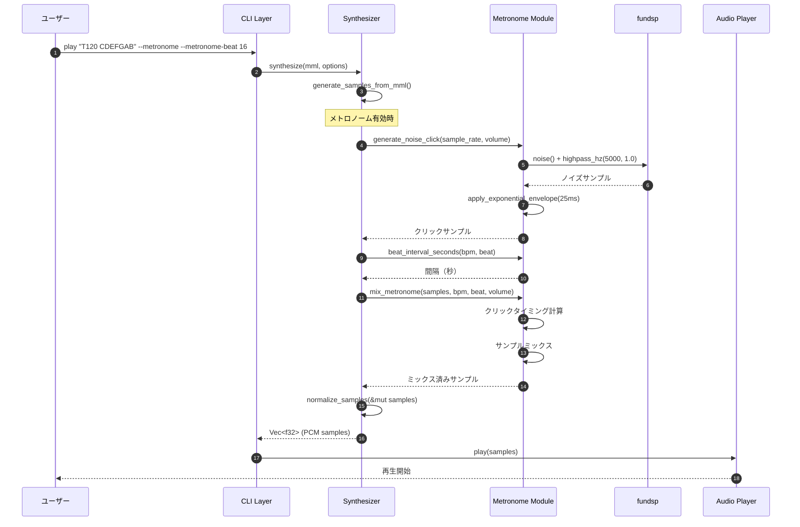
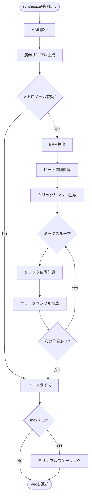
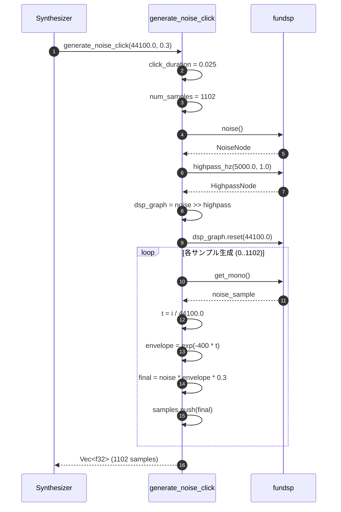

# メトロノーム拡張機能 詳細設計書

## メタ情報

| 項目 | 内容 |
|------|------|
| ドキュメントID | DET-MET-001 |
| バージョン | 1.0.0 |
| ステータス | レビュー待ち |
| 作成日 | 2026-01-11 |
| 最終更新日 | 2026-01-11 |
| 親機能 | メトロノーム拡張 |
| 含まれる機能ID | F-015, F-016, F-017 |
| 関連基本設計書 | BASIC-CLI-002 |
| 関連要件定義書 | REQ-CLI-002 |

## 1. 概要

メトロノーム拡張機能は、sine-mml v1.0のスタブ実装されたメトロノームを実用レベルに強化する機能です。ノイズベースのクリック音生成、ビート選択（4/8/16ビート）、音量調節の3つの主要機能を提供します。

### 1.1 処理フロー概要



### 1.2 設計方針

| 方針 | 内容 |
|------|------|
| 音源方式 | fundsp `noise()` によるホワイトノイズ生成 |
| フィルタリング | ハイパスフィルター（5kHz カットオフ）でローエンド除去 |
| エンベロープ | 指数減衰（25ms 固定、exp(-10.0 * t / duration)） |
| ビート方式 | 4ビート（4分音符）、8ビート（8分音符）、16ビート（16分音符） |
| 音量制御 | 0.0〜1.0 の範囲で個別調整（デフォルト: 0.3） |
| クリッピング防止 | ノーマライゼーション処理により最大振幅を 1.0 以下に制限 |
| 既存実装との互換性 | 既存のSynthesizer構造体を拡張、破壊的変更なし |

## 2. 機能要件

### 2.1 対象機能

| 機能ID | 機能名 | 概要 | 優先度 |
|--------|--------|------|--------|
| F-015 | ノイズベースクリック音 | ホワイトノイズによるハイハット風クリック音生成 | 必須 |
| F-016 | ビート選択 | 4/8/16ビートの選択機能 | 必須 |
| F-017 | メトロノーム音量調節 | メトロノーム音量の個別調整 | 必須 |

### 2.2 機能詳細

#### F-015: ノイズベースクリック音

**入力:**
- sample_rate: u32 (44100 Hz)
- volume: f32 (0.0〜1.0)

**出力:**
- クリックサンプル: Vec\<f32\> (25ms = 1102サンプル @44100Hz)

**処理アルゴリズム:**

1. **ノイズ生成**
   ```
   fundsp::prelude::noise() によるホワイトノイズ生成
   ```

2. **ハイパスフィルタリング**
   ```
   カットオフ周波数: 5000 Hz
   Q値: 1.0
   目的: ローエンドをカットして鋭いクリック音を生成
   ```

3. **指数減衰エンベロープ**
   ```
   envelope(t) = exp(-10.0 * t / 0.025)
   
   t: 経過時間（秒）
   0.025: クリック長（25ms）
   -10.0: 減衰速度係数（急激な減衰）
   ```

4. **音量適用**
   ```
   final_sample = noise_sample * envelope * volume
   ```

**ビジネスルール:**

- BR-030: クリック音の長さは25ms固定
- BR-031: ノイズは毎回異なる（シード固定しない）
- BR-032: ハイパスフィルターでローエンドカット（5kHz以下を減衰）

#### F-016: ビート選択

**入力:**
- bpm: u16 (30〜300)
- beat: u8 (4, 8, 16のみ有効)

**出力:**
- クリック間隔（秒）: f32

**処理ロジック:**

| ビート値 | 音符長 | 計算式 | 例（BPM=120） |
|---------|--------|--------|--------------|
| 4 | 4分音符 | 60.0 / bpm | 0.5秒 |
| 8 | 8分音符 | 30.0 / bpm | 0.25秒 |
| 16 | 16分音符 | 15.0 / bpm | 0.125秒 |

**ビジネスルール:**

- BR-033: 4ビート = 4分音符ごとにクリック
- BR-034: 8ビート = 8分音符ごとにクリック
- BR-035: 16ビート = 16分音符ごとにクリック
- BR-036: 無効な値（4, 8, 16以外）はclapでバリデーション拒否

#### F-017: メトロノーム音量調節

**入力:**
- metronome_volume: f32 (0.0〜1.0)

**出力:**
- 調整されたクリックサンプル

**処理:**
- クリック音生成時に音量係数を乗算
- 演奏音とは独立して調整可能

**ビジネスルール:**

- BR-037: 音量範囲は 0.0〜1.0
- BR-038: デフォルト値は 0.3（控えめな音量）
- BR-039: 範囲外の値は clapでバリデーション拒否（0.0〜1.0にクランプ）

## 3. データ構造設計

### 3.1 Synthesizer構造体の拡張

既存のSynthesizer構造体は変更せず、新規メソッドを追加する形で実装します。

```rust
/// オーディオ合成器
pub struct Synthesizer {
    /// サンプルレート
    pub sample_rate: u32,
    /// 音量
    pub volume: u8,
    /// 波形タイプ
    pub waveform_type: WaveformType,
}
```

### 3.2 メトロノーム設定（内部利用）

関数パラメータとして渡すため、専用の構造体は不要です。

**パラメータ:**
- `bpm: u16` - MML内Tコマンドまたはデフォルト120
- `beat: u8` - CLI引数 `--metronome-beat` (4/8/16)
- `volume: f32` - CLI引数 `--metronome-volume` (0.0〜1.0)

### 3.3 エラー型

既存のAudioError列挙型を使用し、新規エラーケースは追加しません。

## 4. アルゴリズム設計

### 4.1 ノイズクリック音生成アルゴリズム

```
関数 generate_noise_click(sample_rate: f64, volume: f32) -> Vec<f32>:
    // 1. 定数定義
    click_duration = 0.025  // 25ms
    num_samples = (sample_rate * click_duration) as usize
    
    // 2. fundsp DSPグラフ構築
    noise_gen = noise()
    highpass_filter = highpass_hz(5000.0, 1.0)
    dsp_graph = noise_gen >> highpass_filter
    
    // 3. グラフ初期化
    dsp_graph.reset(Some(sample_rate))
    
    // 4. サンプル生成
    samples = Vec::with_capacity(num_samples)
    for i in 0..num_samples:
        t = i as f64 / sample_rate
        
        // ノイズサンプル取得
        noise_sample = dsp_graph.get_mono()
        
        // 指数減衰エンベロープ
        envelope = exp(-10.0 * t / click_duration)
        
        // 音量適用
        final_sample = (noise_sample as f32) * envelope * volume
        
        samples.push(final_sample)
    
    return samples
```

**数式:**

エンベロープ関数:
```
E(t) = e^(-10t / 0.025) = e^(-400t)

t=0ms:    E(0) = 1.0      (最大音量)
t=5ms:    E(0.005) ≈ 0.135
t=10ms:   E(0.010) ≈ 0.018
t=25ms:   E(0.025) ≈ 0.000045 (ほぼゼロ)
```

### 4.2 ビート間隔計算アルゴリズム

```
関数 beat_interval_seconds(bpm: u16, beat: u8) -> f32:
    match beat:
        4 =>  60.0 / (bpm as f32)       // 4分音符: 1拍あたりの秒数
        8 =>  30.0 / (bpm as f32)       // 8分音符: 0.5拍あたりの秒数
        16 => 15.0 / (bpm as f32)       // 16分音符: 0.25拍あたりの秒数
        _ =>  unreachable!("validated by clap")
```

**計算例（BPM=120）:**

| ビート | 計算 | 結果（秒） | サンプル数 @44100Hz |
|--------|------|-----------|---------------------|
| 4ビート | 60/120 | 0.5 | 22050 |
| 8ビート | 30/120 | 0.25 | 11025 |
| 16ビート | 15/120 | 0.125 | 5512 |

### 4.3 メトロノームミックスアルゴリズム

```
関数 mix_metronome(
    samples: &mut Vec<f32>,
    sample_rate: f64,
    bpm: u16,
    beat: u8,
    volume: f32
):
    // 1. クリック間隔計算
    interval_sec = beat_interval_seconds(bpm, beat)
    interval_samples = (interval_sec * (sample_rate as f32)) as usize
    
    // 2. クリックサンプル生成
    click_samples = generate_noise_click(sample_rate, volume)
    click_len = click_samples.len()
    
    // 3. ミックス処理
    position = 0
    while position < samples.len():
        // クリックサンプルをミックス
        for i in 0..click_len:
            if position + i >= samples.len():
                break
            
            // 加算ミックス
            samples[position + i] += click_samples[i]
        
        // 次のクリック位置へ
        position += interval_samples
```

**ミックス方式:**
- 加算ミックス（Additive Mix）を採用
- 演奏サンプルとクリックサンプルを単純加算
- クリッピング防止のため、後段でノーマライゼーション処理を実行

### 4.4 ノーマライゼーションアルゴリズム

```
関数 normalize_samples(samples: &mut [f32]):
    // 1. 最大絶対値を探索
    max_abs = 0.0_f32
    for sample in samples:
        max_abs = max(max_abs, abs(sample))
    
    // 2. ノーマライズ判定
    if max_abs > 1.0:
        scale = 1.0 / max_abs
        
        // 3. 全サンプルをスケーリング
        for sample in samples:
            *sample *= scale
```

**数値例:**

| 処理前 | max_abs | scale | 処理後 |
|--------|---------|-------|--------|
| [-1.5, 0.8, 1.2, -0.6] | 1.5 | 0.667 | [-1.0, 0.533, 0.8, -0.4] |
| [-0.8, 0.3, 0.6, -0.4] | 0.8 | - | [-0.8, 0.3, 0.6, -0.4] (変更なし) |

**ビジネスルール:**

- BR-042: 最大絶対値が1.0を超える場合のみノーマライズ
- BR-043: 全サンプルに均等に適用（相対的な音量バランスを保持）
- BR-044: デジタルクリッピング（±1.0超過）を完全に防止

## 5. 処理フロー詳細

### 5.1 メトロノーム付き音声合成フロー



### 5.2 ノイズクリック音生成詳細フロー



### 5.3 メトロノームミックスタイミング図

```mermaid
gantt
    title 16ビート メトロノームミックス（BPM=120、2拍分）
    dateFormat X
    axisFormat %L
    
    section 演奏サンプル
    音符1（C4）: 0, 220
    音符2（D4）: 220, 440
    
    section クリック
    クリック1: 0, 11
    クリック2: 55, 66
    クリック3: 110, 121
    クリック4: 165, 176
    クリック5: 220, 231
    クリック6: 275, 286
    クリック7: 330, 341
    クリック8: 385, 396
```



**説明:**
- 16ビート: 16分音符ごとにクリック（0.125秒 = 5512サンプル間隔）
- 各クリック: 25ms = 1102サンプル
- 演奏サンプルとクリックサンプルを加算ミックス

## 6. エラーハンドリング

### 6.1 エラー一覧

| エラーケース | 対応 | HTTPステータス | エラーメッセージ |
|-------------|------|---------------|-----------------|
| 無効なビート値（5等） | clapで検証拒否 | N/A (CLI起動失敗) | `error: invalid value '5' for '--metronome-beat <BEAT>': 4, 8, 16のいずれかを指定してください` |
| 音量範囲外（1.5等） | clapで検証拒否 | N/A (CLI起動失敗) | `error: invalid value '1.5' for '--metronome-volume <VOLUME>': 0.0〜1.0の範囲で指定してください` |
| fundspノイズ生成失敗 | フォールバック | N/A | `warning: noise generation failed, using fallback sine click` |
| ノーマライゼーション失敗（NaN/Inf） | スキップ | N/A | `warning: normalization skipped due to invalid samples` |

### 6.2 エラー処理方針

| 方針 | 内容 |
|------|------|
| 入力検証 | clapのvalue_parserで範囲チェック（実行時エラーを防止） |
| フォールバック | fundsp失敗時は既存のサイン波クリックに切り替え |
| グレースフルデグラデーション | ノーマライゼーション失敗時は元の音量で再生 |
| ログ出力 | 警告レベルでフォールバック情報を出力 |

## 7. 性能設計

### 7.1 性能要件

| ID | 要件 | 目標値 | 測定方法 |
|----|------|--------|----------|
| NFR-P-005 | ノーマライゼーションのオーバーヘッド | 5%以内（合成時間の） | ベンチマーク |
| NFR-P-006 | メトロノームミックスのレイテンシ | 増加なし（既存と同等） | オーディオバッファ測定 |
| NFR-P-007 | クリック音生成時間 | 1ms以内（25msサンプル生成） | ベンチマーク |

### 7.2 メモリ使用量見積もり

| 項目 | サイズ | 計算根拠 |
|------|--------|----------|
| クリックサンプル | 4.4 KB | 1102サンプル × 4バイト |
| 1分間の演奏サンプル | 10.5 MB | 44100Hz × 60秒 × 4バイト |
| 1分間のメトロノーム（16ビート） | 2.1 MB | 480クリック × 1102サンプル × 4バイト |

## 8. テスト戦略

### 8.1 ユニットテスト項目

| テストケース | 入力 | 期待される出力 | 検証内容 |
|-------------|------|---------------|----------|
| ノイズクリック生成 | sample_rate=44100, volume=0.5 | 1102サンプル | サンプル数が正確 |
| エンベロープ適用 | クリックサンプル | 減衰カーブ | 指数減衰が正しく適用 |
| ビート間隔計算（4ビート） | bpm=120, beat=4 | 0.5秒 | 4分音符間隔 |
| ビート間隔計算（8ビート） | bpm=120, beat=8 | 0.25秒 | 8分音符間隔 |
| ビート間隔計算（16ビート） | bpm=120, beat=16 | 0.125秒 | 16分音符間隔 |
| ノーマライゼーション | max=1.5のサンプル | max=1.0に縮小 | クリッピング防止 |
| ノーマライゼーション（不要） | max=0.8のサンプル | 変更なし | 音量が上がらない |
| メトロノームミックス | 演奏サンプル + クリック | 加算ミックス | 正しいタイミングでミックス |

### 8.2 統合テスト項目

| テストケース | MML入力 | CLIオプション | 検証項目 |
|-------------|---------|--------------|----------|
| 4ビート再生 | "T120 C4 D4 E4 F4" | --metronome --metronome-beat 4 | 1秒ごとにクリック |
| 8ビート再生 | "T120 C4 D4 E4 F4" | --metronome --metronome-beat 8 | 0.5秒ごとにクリック |
| 16ビート再生 | "T120 C4 D4 E4 F4" | --metronome --metronome-beat 16 | 0.25秒ごとにクリック |
| 音量調整 | "T120 C4 D4 E4 F4" | --metronome --metronome-volume 0.8 | クリック音量が大きい |
| ノーマライゼーション | "T120 V15 C1" | --metronome --metronome-volume 1.0 | クリッピングなし |
| WAVエクスポート | "T120 C4 D4 E4 F4" | --metronome --metronome-beat 8 --output test.wav | WAVファイルに含まれる |

### 8.3 音質テスト項目

| テストケース | 検証内容 | 検証方法 |
|-------------|----------|----------|
| ノイズ品質 | ホワイトノイズが生成されている | スペクトル解析 |
| ハイパスフィルター | 5kHz以下が減衰している | 周波数解析 |
| 指数減衰 | 25ms以内に減衰している | エンベロープ波形確認 |
| クリッピング防止 | ±1.0を超えない | 全サンプル検査 |
| タイミング精度 | クリック位置が正確 | サンプル位置検証 |

### 8.4 テストカバレッジ目標

| テストレベル | 対象 | カバレッジ目標 |
|-------------|------|---------------|
| ユニットテスト | generate_noise_click, beat_interval_seconds, normalize_samples | 100% |
| 統合テスト | mix_metronome, synthesize with metronome | 100% |
| E2Eテスト | CLI play with metronome options | 100% |

## 9. セキュリティ考慮事項

| 項目 | 考慮内容 |
|------|----------|
| 入力検証 | CLI引数はclapで厳格にバリデーション |
| リソース消費 | クリックサンプル生成は固定長（25ms）のため、DoS攻撃のリスクなし |
| メモリ安全性 | Rustの所有権システムにより、バッファオーバーフローは発生しない |

## 10. 拡張性考慮事項

| 項目 | 現在の設計 | 将来の拡張 |
|------|----------|-----------|
| クリック音種類 | ノイズのみ | カスタム音源（サンプリング、合成音等） |
| ビート種類 | 4/8/16のみ | 任意のビート値（3ビート、6ビート等） |
| アクセント | なし | 小節頭のアクセント強調 |
| 拍子対応 | 4/4拍子のみ想定 | 3/4拍子、6/8拍子等の対応 |
| エンベロープ | 指数減衰固定 | カスタムエンベロープ（ADSR等） |

## 11. 設計書一覧

| 設計書 | パス | 説明 |
|--------|------|------|
| バックエンド設計書 | [./バックエンド設計書.md](./バックエンド設計書.md) | Rust API仕様とユニットテスト |

---

## 変更履歴

| 日付 | バージョン | 変更内容 | 担当者 |
|:---|:---|:---|:---|
| 2026-01-11 | 1.0.0 | 初版作成 | Antigravity |
