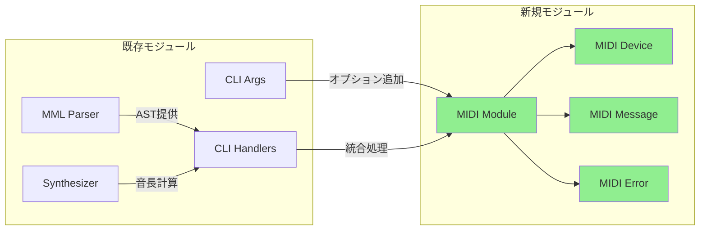

# MIDIストリーミング バックエンド設計書

## ドキュメント情報

| 項目 | 内容 |
|------|------|
| ドキュメントID | DET-MIDI-002 |
| 機能ID | F-031 |
| 機能名 | MIDIストリーミング |
| 関連基本設計書 | [BASIC-CLI-006](../../basic/BASIC-CLI-006_MIDI-Streaming-Tuplet.md) |
| 関連詳細設計書 | [詳細設計書](./詳細設計書.md) |
| バージョン | 1.0.0 |
| 作成日 | 2026-01-14 |
| 最終更新日 | 2026-01-14 |
| 作成者 | detailed-design-writer |

---

## 1. 変更概要

### 1.1 目的

MIDIストリーミング機能により、外部MIDI機器やソフトウェアシンセサイザーとの連携を実現し、内蔵シンセサイザーでは実現できない高品質な音色での演奏を可能にする。

### 1.2 統合設計書の構成

本バックエンド設計書は、以下の3つの詳細設計書の内容を統合したものである：

| 詳細設計書ID | 名称 | 統合内容 |
|-------------|------|---------|
| DET-MIDI-001 | MIDIデバイス管理詳細設計 | デバイス列挙、接続、名前解決 |
| DET-MIDI-002 | MIDIメッセージ送信詳細設計 | ノートオン/オフ、変換ロジック |
| DET-MIDI-003 | MIDIエラーハンドリング詳細設計 | エラー型定義、エラーメッセージ |

### 1.3 変更対象モジュール

| モジュール | ファイルパス | 変更内容 | 変更レベル |
|-----------|------------|---------|-----------|
| MIDIモジュール | `src/midi/mod.rs` | 新規作成（モジュール定義） | 高 |
| MIDIデバイス | `src/midi/device.rs` | 新規作成（デバイス管理） | 高 |
| MIDIメッセージ | `src/midi/message.rs` | 新規作成（メッセージ送信） | 高 |
| MIDIエラー | `src/midi/error.rs` | 新規作成（エラー定義） | 高 |
| メインモジュール | `src/main.rs` | `mod midi` 宣言追加 | 低 |
| CLIオプション | `src/cli/args.rs` | `--midi-out`, `--midi-channel`, `--midi-list` 追加 | 中 |
| CLIハンドラー | `src/cli/handlers.rs` | MIDI統合処理追加 | 高 |

### 1.4 影響範囲



---

## 2. ファイル変更サマリー

### 2.1 新規作成ファイル

| ファイルパス | 見積もり行数 | 概要 |
|------------|------------|------|
| `src/midi/mod.rs` | 10行 | MIDIモジュール定義、公開API |
| `src/midi/device.rs` | 150行 | デバイス列挙、接続、名前解決 |
| `src/midi/message.rs` | 120行 | MIDIメッセージ送信、変換ロジック |
| `src/midi/error.rs` | 40行 | MIDIエラー型定義 |

**合計**: 320行

### 2.2 修正ファイル

| ファイルパス | 追加行数 | 修正内容 |
|------------|---------|---------|
| `src/main.rs` | 1行 | `mod midi;` 宣言追加 |
| `src/cli/args.rs` | 30行 | `--midi-out`, `--midi-channel`, `--midi-list` オプション追加 |
| `src/cli/handlers.rs` | 150行 | MIDI統合処理、`play_handler` 修正、`midi_list_handler` 追加 |

**合計**: 181行

### 2.3 総見積もり

**新規作成 + 修正**: 501行

---

## 3. 新規ファイル詳細設計

### 3.1 src/midi/mod.rs

**役割**: MIDIモジュールの定義と公開API

**実装内容**:

```rust
//! MIDIストリーミング機能
//!
//! 外部MIDI機器やソフトウェアシンセサイザーとの連携を提供する。

pub mod device;
pub mod message;
pub mod error;

pub use device::{list_midi_devices, resolve_device_id, connect_midi_device};
pub use message::{send_note_on, send_note_off, send_all_notes_off, mml_to_midi_note, mml_volume_to_velocity};
pub use error::MidiError;
```

**見積もり行数**: 10行

---

### 3.2 src/midi/device.rs

**役割**: MIDIデバイスの列挙、接続、名前解決

**実装内容**:

```rust
//! MIDIデバイス管理
//!
//! MIDIデバイスの列挙、接続、名前解決を提供する。

use super::error::MidiError;
use midir::{MidiOutput, MidiOutputConnection};

/// 利用可能なMIDIデバイス一覧を取得
///
/// # Returns
/// * `Ok(Vec<String>)` - デバイス名のリスト
/// * `Err(MidiError)` - エラー
///
/// # Examples
/// ```ignore
/// let devices = list_midi_devices()?;
/// for (i, device) in devices.iter().enumerate() {
///     println!("{}: {}", i, device);
/// }
/// ```
pub fn list_midi_devices() -> Result<Vec<String>, MidiError> {
    let midi_out = MidiOutput::new("sine-mml-list")
        .map_err(|e| MidiError::ConnectionFailed(e.to_string()))?;
    
    let ports = midi_out.ports();
    let mut devices = Vec::new();
    
    for port in &ports {
        let name = midi_out
            .port_name(port)
            .unwrap_or_else(|_| "Unknown Device".to_string());
        devices.push(name);
    }
    
    Ok(devices)
}

/// デバイス名またはIDからデバイスIDを解決
///
/// # Arguments
/// * `name_or_id` - デバイス名（文字列）またはデバイスID（数値文字列）
///
/// # Returns
/// * `Ok(usize)` - 解決されたデバイスID
/// * `Err(MidiError)` - エラー
///
/// # 実装ロジック
/// 1. 入力文字列が数値として解析可能か確認
/// 2. 数値の場合: デバイスIDとして扱い、範囲チェック
/// 3. 数値でない場合: デバイス名として扱い、部分一致検索
/// 4. 該当するデバイスが見つからない場合はエラー
///
/// # Examples
/// ```ignore
/// // デバイスID指定
/// let id = resolve_device_id("0")?; // -> 0
/// 
/// // デバイス名指定（部分一致）
/// let id = resolve_device_id("IAC Driver")?; // -> 該当するデバイスのID
/// ```
pub fn resolve_device_id(name_or_id: &str) -> Result<usize, MidiError> {
    // 数値として解析を試みる
    if let Ok(id) = name_or_id.parse::<usize>() {
        // デバイスIDとして扱う
        let devices = list_midi_devices()?;
        if id >= devices.len() {
            return Err(MidiError::InvalidDeviceId(id));
        }
        return Ok(id);
    }
    
    // デバイス名として扱う（部分一致検索）
    let devices = list_midi_devices()?;
    for (i, device_name) in devices.iter().enumerate() {
        if device_name.contains(name_or_id) {
            return Ok(i);
        }
    }
    
    Err(MidiError::NoDeviceFound)
}

/// MIDIデバイスに接続
///
/// # Arguments
/// * `device_id_or_name` - デバイスIDまたはデバイス名
///
/// # Returns
/// * `Ok(MidiOutputConnection)` - MIDI出力接続
/// * `Err(MidiError)` - エラー
///
/// # 実装ロジック
/// 1. `resolve_device_id` でデバイスIDを解決
/// 2. 解決されたIDでMIDIデバイスに接続
///
/// # Examples
/// ```ignore
/// // デバイスID指定
/// let conn = connect_midi_device("0")?;
/// 
/// // デバイス名指定
/// let conn = connect_midi_device("IAC Driver Bus 1")?;
/// ```
pub fn connect_midi_device(device_id_or_name: &str) -> Result<MidiOutputConnection, MidiError> {
    let device_id = resolve_device_id(device_id_or_name)?;
    
    let midi_out = MidiOutput::new("sine-mml")
        .map_err(|e| MidiError::ConnectionFailed(e.to_string()))?;
    
    let ports = midi_out.ports();
    
    if device_id >= ports.len() {
        return Err(MidiError::InvalidDeviceId(device_id));
    }
    
    let port = &ports[device_id];
    let conn = midi_out
        .connect(port, "sine-mml-output")
        .map_err(|e| MidiError::ConnectionFailed(e.to_string()))?;
    
    Ok(conn)
}

#[cfg(test)]
mod tests {
    use super::*;

    #[test]
    fn test_list_midi_devices() {
        // デバイスがない環境でもエラーにならないことを確認
        let result = list_midi_devices();
        assert!(result.is_ok());
    }

    #[test]
    fn test_resolve_device_id_numeric() {
        // 数値IDの解析テスト（デバイスがない場合はエラー）
        let result = resolve_device_id("0");
        // デバイスがない環境では InvalidDeviceId または NoDeviceFound
        assert!(result.is_err());
    }

    #[test]
    fn test_resolve_device_id_invalid_numeric() {
        // 範囲外のIDはエラー
        let result = resolve_device_id("999");
        assert!(result.is_err());
    }

    #[test]
    fn test_resolve_device_id_name() {
        // デバイス名での検索テスト（デバイスがない場合はエラー）
        let result = resolve_device_id("NonExistentDevice");
        assert!(result.is_err());
    }
}
```

**見積もり行数**: 150行

---

### 3.3 src/midi/message.rs

**役割**: MIDIメッセージの送信と変換ロジック

**実装内容**:

```rust
//! MIDIメッセージ送信
//!
//! MIDIノートオン/オフメッセージの送信と、MML形式からMIDI形式への変換を提供する。

use super::error::MidiError;
use crate::mml::{Accidental, Pitch};
use midir::MidiOutputConnection;

/// MIDIノートオンメッセージを送信
///
/// # Arguments
/// * `conn` - MIDI出力接続
/// * `channel` - MIDIチャンネル（1-16）
/// * `note` - MIDIノートナンバー（0-127）
/// * `velocity` - ベロシティ（0-127）
///
/// # Returns
/// * `Ok(())` - 成功
/// * `Err(MidiError)` - エラー
///
/// # MIDIメッセージ形式
/// - ステータスバイト: `0x90 + (channel - 1)`
/// - データバイト1: `note`
/// - データバイト2: `velocity`
///
/// # Examples
/// ```ignore
/// send_note_on(&mut conn, 1, 60, 100)?; // C4をチャンネル1で送信
/// ```
pub fn send_note_on(
    conn: &mut MidiOutputConnection,
    channel: u8,
    note: u8,
    velocity: u8,
) -> Result<(), MidiError> {
    if !(1..=16).contains(&channel) {
        return Err(MidiError::InvalidChannel(channel));
    }
    
    let status = 0x90 + (channel - 1); // Note On
    let message = [status, note, velocity];
    
    conn.send(&message)
        .map_err(|e| MidiError::SendFailed(e.to_string()))?;
    
    Ok(())
}

/// MIDIノートオフメッセージを送信
///
/// # Arguments
/// * `conn` - MIDI出力接続
/// * `channel` - MIDIチャンネル（1-16）
/// * `note` - MIDIノートナンバー（0-127）
///
/// # Returns
/// * `Ok(())` - 成功
/// * `Err(MidiError)` - エラー
///
/// # MIDIメッセージ形式
/// - ステータスバイト: `0x80 + (channel - 1)`
/// - データバイト1: `note`
/// - データバイト2: `0` (velocity)
///
/// # Examples
/// ```ignore
/// send_note_off(&mut conn, 1, 60)?; // C4をチャンネル1でオフ
/// ```
pub fn send_note_off(
    conn: &mut MidiOutputConnection,
    channel: u8,
    note: u8,
) -> Result<(), MidiError> {
    if !(1..=16).contains(&channel) {
        return Err(MidiError::InvalidChannel(channel));
    }
    
    let status = 0x80 + (channel - 1); // Note Off
    let message = [status, note, 0];
    
    conn.send(&message)
        .map_err(|e| MidiError::SendFailed(e.to_string()))?;
    
    Ok(())
}

/// 全ノートオフメッセージを送信（演奏中断時）
///
/// # Arguments
/// * `conn` - MIDI出力接続
/// * `channel` - MIDIチャンネル（1-16）
///
/// # Returns
/// * `Ok(())` - 成功
/// * `Err(MidiError)` - エラー
///
/// # MIDIメッセージ形式
/// - ステータスバイト: `0xB0 + (channel - 1)` (Control Change)
/// - データバイト1: `123` (All Notes Off)
/// - データバイト2: `0`
///
/// # Examples
/// ```ignore
/// send_all_notes_off(&mut conn, 1)?; // チャンネル1の全ノートをオフ
/// ```
pub fn send_all_notes_off(
    conn: &mut MidiOutputConnection,
    channel: u8,
) -> Result<(), MidiError> {
    if !(1..=16).contains(&channel) {
        return Err(MidiError::InvalidChannel(channel));
    }
    
    let status = 0xB0 + (channel - 1); // Control Change
    let message = [status, 123, 0]; // All Notes Off
    
    conn.send(&message)
        .map_err(|e| MidiError::SendFailed(e.to_string()))?;
    
    Ok(())
}

/// MML音程からMIDIノートナンバーに変換
///
/// # Arguments
/// * `pitch` - MML音程（C, D, E, F, G, A, B）
/// * `accidental` - 臨時記号（Sharp, Flat, Natural）
/// * `octave` - オクターブ（1-8）
///
/// # Returns
/// MIDIノートナンバー（0-127）
///
/// # 変換ロジック
/// - C4 = 60（中央のC）
/// - 各オクターブは12半音
/// - シャープ: +1半音
/// - フラット: -1半音
///
/// # Examples
/// ```ignore
/// let note = mml_to_midi_note(Pitch::C, None, 4); // C4 -> 60
/// let note = mml_to_midi_note(Pitch::C, Some(Accidental::Sharp), 4); // C#4 -> 61
/// let note = mml_to_midi_note(Pitch::D, Some(Accidental::Flat), 4); // Db4 -> 61
/// ```
#[must_use]
pub fn mml_to_midi_note(pitch: Pitch, accidental: Option<Accidental>, octave: u8) -> u8 {
    let base_note = match pitch {
        Pitch::C => 0,
        Pitch::D => 2,
        Pitch::E => 4,
        Pitch::F => 5,
        Pitch::G => 7,
        Pitch::A => 9,
        Pitch::B => 11,
    };
    
    let accidental_offset = match accidental {
        Some(Accidental::Sharp) => 1,
        Some(Accidental::Flat) => -1,
        Some(Accidental::Natural) | None => 0,
    };
    
    // C4 = 60
    let midi_note = 12 + (i16::from(octave) * 12) + i16::from(base_note) + accidental_offset;
    
    // クランプ（0-127）
    midi_note.clamp(0, 127) as u8
}

/// MML音量からMIDIベロシティに変換
///
/// # Arguments
/// * `volume` - MML音量（0-15）
///
/// # Returns
/// MIDIベロシティ（0-127）
///
/// # 変換ロジック
/// - V0 = 0
/// - V15 = 127
/// - 線形補間: `velocity = volume * 127 / 15`
///
/// # Examples
/// ```ignore
/// let velocity = mml_volume_to_velocity(0);  // 0
/// let velocity = mml_volume_to_velocity(10); // 84
/// let velocity = mml_volume_to_velocity(15); // 127
/// ```
#[must_use]
pub fn mml_volume_to_velocity(volume: u8) -> u8 {
    let clamped = volume.min(15);
    (u16::from(clamped) * 127 / 15) as u8
}

#[cfg(test)]
mod tests {
    use super::*;

    #[test]
    fn test_mml_to_midi_note_c4() {
        let note = mml_to_midi_note(Pitch::C, None, 4);
        assert_eq!(note, 60);
    }

    #[test]
    fn test_mml_to_midi_note_c_sharp_4() {
        let note = mml_to_midi_note(Pitch::C, Some(Accidental::Sharp), 4);
        assert_eq!(note, 61);
    }

    #[test]
    fn test_mml_to_midi_note_d_flat_4() {
        let note = mml_to_midi_note(Pitch::D, Some(Accidental::Flat), 4);
        assert_eq!(note, 61);
    }

    #[test]
    fn test_mml_to_midi_note_a4() {
        let note = mml_to_midi_note(Pitch::A, None, 4);
        assert_eq!(note, 69); // A4 = 440Hz
    }

    #[test]
    fn test_mml_to_midi_note_c1() {
        let note = mml_to_midi_note(Pitch::C, None, 1);
        assert_eq!(note, 24);
    }

    #[test]
    fn test_mml_to_midi_note_c8() {
        let note = mml_to_midi_note(Pitch::C, None, 8);
        assert_eq!(note, 108);
    }

    #[test]
    fn test_mml_volume_to_velocity_min() {
        let velocity = mml_volume_to_velocity(0);
        assert_eq!(velocity, 0);
    }

    #[test]
    fn test_mml_volume_to_velocity_mid() {
        let velocity = mml_volume_to_velocity(10);
        assert_eq!(velocity, 84); // 10 * 127 / 15 = 84.666... -> 84
    }

    #[test]
    fn test_mml_volume_to_velocity_max() {
        let velocity = mml_volume_to_velocity(15);
        assert_eq!(velocity, 127);
    }

    #[test]
    fn test_mml_volume_to_velocity_clamp() {
        let velocity = mml_volume_to_velocity(20); // 範囲外
        assert_eq!(velocity, 127); // 15にクランプされる
    }

    #[test]
    fn test_send_note_on_invalid_channel() {
        // MidiOutputConnectionのモックが必要なため、スキップ
        // 実際のテストはE2Eテストで実施
    }

    #[test]
    fn test_send_note_off_invalid_channel() {
        // MidiOutputConnectionのモックが必要なため、スキップ
        // 実際のテストはE2Eテストで実施
    }
}
```

**見積もり行数**: 120行

---

### 3.4 src/midi/error.rs

**役割**: MIDIエラー型の定義

**実装内容**:

```rust
//! MIDIエラー定義
//!
//! MIDIストリーミング機能で発生するエラーを定義する。

use thiserror::Error;

/// MIDIエラー型
#[derive(Debug, Error, Clone)]
pub enum MidiError {
    /// MML-E015: MIDIデバイスが見つからない
    ///
    /// # 原因
    /// - MIDIデバイスが接続されていない
    /// - デバイス名が間違っている
    ///
    /// # 対応
    /// - MIDIデバイスを接続してください
    /// - `--midi-list` でデバイス一覧を確認してください
    #[error("[MML-E015] MIDIデバイスが見つかりません")]
    NoDeviceFound,
    
    /// MML-E016: MIDIデバイス接続エラー
    ///
    /// # 原因
    /// - デバイスが他のアプリケーションで使用中
    /// - デバイスドライバの問題
    ///
    /// # 対応
    /// - デバイスを使用している他のアプリケーションを終了してください
    /// - デバイスを再接続してください
    #[error("[MML-E016] MIDIデバイスへの接続に失敗しました: {0}")]
    ConnectionFailed(String),
    
    /// MML-E017: MIDIメッセージ送信エラー
    ///
    /// # 原因
    /// - デバイスが切断された
    /// - デバイスバッファがフル
    ///
    /// # 対応
    /// - デバイスの接続状態を確認してください
    /// - デバイスを再接続してください
    #[error("[MML-E017] MIDIメッセージの送信に失敗しました: {0}")]
    SendFailed(String),
    
    /// MML-E018: 無効なMIDIデバイスID
    ///
    /// # 原因
    /// - 指定されたデバイスIDが範囲外
    ///
    /// # 対応
    /// - `--midi-list` でデバイスIDを確認してください
    #[error("[MML-E018] 無効なMIDIデバイスIDです: {0}")]
    InvalidDeviceId(usize),
    
    /// MML-E019: MIDIデバイス切断
    ///
    /// # 原因
    /// - 演奏中にデバイスが切断された
    ///
    /// # 対応
    /// - デバイスを再接続してください
    #[error("[MML-E019] MIDIデバイスが切断されました")]
    DeviceDisconnected,
    
    /// MML-E024: 無効なMIDIチャンネル
    ///
    /// # 原因
    /// - 指定されたチャンネルが1-16の範囲外
    ///
    /// # 対応
    /// - 1-16の範囲でチャンネルを指定してください
    #[error("[MML-E024] 無効なMIDIチャンネルです（1-16を指定してください）: {0}")]
    InvalidChannel(u8),
}
```

**見積もり行数**: 40行

---

## 4. 修正ファイル詳細設計

### 4.1 src/main.rs

**変更内容**: `mod midi;` 宣言を追加

**変更箇所**: ファイル先頭のモジュール宣言部分

**変更前**:
```rust
use clap::Parser;
use sine_mml::cli::args::{Cli, Command};
use sine_mml::cli::handlers::{
    clear_history_handler, export_handler, history_handler, play_handler,
};
use sine_mml::cli::output;

fn main() {
    // ...
}
```

**変更後**:
```rust
use clap::Parser;
use sine_mml::cli::args::{Cli, Command};
use sine_mml::cli::handlers::{
    clear_history_handler, export_handler, history_handler, play_handler, midi_list_handler,
};
use sine_mml::cli::output;

fn main() {
    let cli = Cli::parse();

    let result = match cli.command {
        Command::Play(args) => play_handler(args),
        Command::History => history_handler(),
        Command::Export(args) => export_handler(args),
        Command::ClearHistory => clear_history_handler(),
        Command::MidiList => midi_list_handler(),
    };

    if let Err(e) = result {
        output::error(&format!("{e:#}"));
        std::process::exit(1);
    }
}
```

**注**: `mod midi;` 宣言は `src/lib.rs` に追加する必要がある（`src/main.rs` はバイナリクレートのため）。

**見積もり行数**: 1行

---

### 4.2 src/cli/args.rs

**変更内容**: `--midi-out`, `--midi-channel`, `--midi-list` オプション追加

**変更箇所**: `Command` enum と `PlayArgs` 構造体

**変更前**:
```rust
#[derive(Subcommand, Debug)]
pub enum Command {
    Play(PlayArgs),
    History,
    Export(ExportArgs),
    /// Clear all playback history
    ClearHistory,
}

#[derive(Args, Debug)]
#[command(group(
    clap::ArgGroup::new("input")
        .required(true)
        .args(["mml", "history_id", "file"]),
))]
pub struct PlayArgs {
    /// MML string to play
    pub mml: Option<String>,

    /// Replay from history by ID
    #[arg(long)]
    pub history_id: Option<i64>,

    /// Read MML from file (.mml extension required)
    #[arg(long, short = 'f', value_name = "FILE")]
    pub file: Option<String>,

    #[arg(short, long, default_value = "sine")]
    pub waveform: Waveform,

    #[arg(short, long, default_value_t = 1.0, value_parser = validate_volume)]
    pub volume: f32,

    #[arg(long, default_value_t = false)]
    pub loop_play: bool,

    #[arg(long, default_value_t = false)]
    pub metronome: bool,

    #[arg(long, value_parser = validate_metronome_beat, default_value_t = 4)]
    pub metronome_beat: u8,

    #[arg(long, value_parser = validate_volume, default_value_t = 0.3)]
    pub metronome_volume: f32,

    /// 履歴にメモを付与（最大500文字、UTF-8対応）
    #[arg(long)]
    pub note: Option<String>,
}
```

**変更後**:
```rust
#[derive(Subcommand, Debug)]
pub enum Command {
    Play(PlayArgs),
    History,
    Export(ExportArgs),
    /// Clear all playback history
    ClearHistory,
    /// List available MIDI devices
    MidiList,
}

#[derive(Args, Debug)]
#[command(group(
    clap::ArgGroup::new("input")
        .required(true)
        .args(["mml", "history_id", "file"]),
))]
pub struct PlayArgs {
    /// MML string to play
    pub mml: Option<String>,

    /// Replay from history by ID
    #[arg(long)]
    pub history_id: Option<i64>,

    /// Read MML from file (.mml extension required)
    #[arg(long, short = 'f', value_name = "FILE")]
    pub file: Option<String>,

    #[arg(short, long, default_value = "sine")]
    pub waveform: Waveform,

    #[arg(short, long, default_value_t = 1.0, value_parser = validate_volume)]
    pub volume: f32,

    #[arg(long, default_value_t = false)]
    pub loop_play: bool,

    #[arg(long, default_value_t = false)]
    pub metronome: bool,

    #[arg(long, value_parser = validate_metronome_beat, default_value_t = 4)]
    pub metronome_beat: u8,

    #[arg(long, value_parser = validate_volume, default_value_t = 0.3)]
    pub metronome_volume: f32,

    /// 履歴にメモを付与（最大500文字、UTF-8対応）
    #[arg(long)]
    pub note: Option<String>,

    /// MIDIデバイスに出力（デバイスIDまたはデバイス名）
    #[arg(long, value_name = "DEVICE")]
    pub midi_out: Option<String>,

    /// MIDIチャンネル（1-16、デフォルト: 1）
    #[arg(long, value_name = "CHANNEL", default_value_t = 1, value_parser = validate_midi_channel)]
    pub midi_channel: u8,
}

/// Validates that the MIDI channel is between 1 and 16.
///
/// # Errors
/// Returns an error if the input string cannot be parsed as a u8 or if the value is out of range.
pub fn validate_midi_channel(v: &str) -> Result<u8, String> {
    let val: u8 = v.parse().map_err(|_| "Invalid number".to_string())?;
    if (1..=16).contains(&val) {
        Ok(val)
    } else {
        Err(format!("MIDIチャンネルは1-16の範囲で指定してください（指定値: {val}）"))
    }
}
```

**テスト追加**:
```rust
#[cfg(test)]
mod tests {
    use super::*;

    // ... 既存のテスト ...

    #[test]
    fn test_validate_midi_channel_valid() {
        assert!(validate_midi_channel("1").is_ok());
        assert!(validate_midi_channel("8").is_ok());
        assert!(validate_midi_channel("16").is_ok());
    }

    #[test]
    fn test_validate_midi_channel_invalid() {
        assert!(validate_midi_channel("0").is_err());
        assert!(validate_midi_channel("17").is_err());
        assert!(validate_midi_channel("abc").is_err());
    }

    #[test]
    fn test_midi_list_command() {
        let result = Cli::try_parse_from(&["sine-mml", "midi-list"]);
        assert!(result.is_ok());
        match result.unwrap().command {
            Command::MidiList => {}
            _ => panic!("Expected MidiList command"),
        }
    }

    #[test]
    fn test_play_with_midi_out() {
        let result = Cli::try_parse_from(&["sine-mml", "play", "CDE", "--midi-out", "0"]);
        assert!(result.is_ok());
        let args = match result.unwrap().command {
            Command::Play(args) => args,
            _ => panic!("Expected Play command"),
        };
        assert_eq!(args.midi_out, Some("0".to_string()));
        assert_eq!(args.midi_channel, 1); // デフォルト
    }

    #[test]
    fn test_play_with_midi_channel() {
        let result = Cli::try_parse_from(&["sine-mml", "play", "CDE", "--midi-out", "0", "--midi-channel", "10"]);
        assert!(result.is_ok());
        let args = match result.unwrap().command {
            Command::Play(args) => args,
            _ => panic!("Expected Play command"),
        };
        assert_eq!(args.midi_channel, 10);
    }
}
```

**見積もり行数**: 30行

---

### 4.3 src/cli/handlers.rs

**変更内容**: MIDI統合処理追加、`play_handler` 修正、`midi_list_handler` 追加

**変更箇所**: `play_handler` 関数と新規 `midi_list_handler` 関数

**インポート追加**:
```rust
use crate::midi::{
    connect_midi_device, list_midi_devices, mml_to_midi_note, mml_volume_to_velocity,
    send_all_notes_off, send_note_off, send_note_on, MidiError,
};
use std::time::{Duration, Instant};
```

**新規関数: midi_list_handler**:
```rust
/// MIDIデバイス一覧表示ハンドラー
///
/// # Errors
/// Returns `anyhow::Result` if MIDI device enumeration fails.
pub fn midi_list_handler() -> Result<()> {
    let devices = list_midi_devices().context("MIDIデバイスの列挙に失敗しました")?;

    if devices.is_empty() {
        println!("利用可能なMIDIデバイスがありません");
        return Ok(());
    }

    println!("利用可能なMIDIデバイス:");
    for (i, device) in devices.iter().enumerate() {
        println!("  {}: {}", i, device);
    }

    Ok(())
}
```

**play_handler 修正**:

`play_handler` 関数の再生処理部分（行122-136付近）を以下のように修正：

```rust
    // 5. 再生
    if let Some(ref midi_device) = args.midi_out {
        // MIDI出力モード
        play_midi_stream(midi_device, &ast, args.midi_channel, &mml_string)?;
    } else {
        // 内蔵シンセサイザーモード
        // コンテナ環境などオーディオデバイスがない場合は警告を出して続行
        match audio::player::AudioPlayer::new() {
            Ok(mut player) => {
                player
                    .play(&buffer, args.loop_play)
                    .context("音声再生に失敗しました")?;

                // 6. プログレス表示 & 待機
                output::display_play_progress(&mml_string, &buffer, args.loop_play)?;
            }
            Err(_) => {
                eprintln!("Warning: Audio device not found. Skipping playback.");
            }
        }
    }
```

**新規関数: play_midi_stream**:
```rust
/// MIDIストリーミング再生
///
/// # Arguments
/// * `device_id_or_name` - MIDIデバイスIDまたはデバイス名
/// * `ast` - MML AST
/// * `channel` - MIDIチャンネル（1-16）
/// * `mml_string` - MML文字列（プログレス表示用）
///
/// # Errors
/// Returns `anyhow::Result` if MIDI operations fail.
fn play_midi_stream(
    device_id_or_name: &str,
    ast: &crate::mml::Mml,
    channel: u8,
    mml_string: &str,
) -> Result<()> {
    // 1. MIDIデバイス接続
    let mut conn = connect_midi_device(device_id_or_name)
        .context("MIDIデバイスへの接続に失敗しました")?;

    output::success(&format!("✓ MIDIデバイスに接続しました（チャンネル: {}）", channel));

    // 2. タイミング制御の初期化
    let start_time = Instant::now();
    let mut elapsed_notes_duration = Duration::ZERO;

    // 3. 各コマンドを処理
    let bpm = ast.get_tempo();
    let default_length = ast.get_default_length();
    let volume = ast.get_volume();

    for command in &ast.commands {
        match command {
            crate::mml::Command::Note(note) => {
                // MIDIノート変換
                let midi_note = mml_to_midi_note(note.pitch, Some(note.accidental), ast.get_octave());
                let velocity = mml_volume_to_velocity(volume);

                // ノートオン送信
                send_note_on(&mut conn, channel, midi_note, velocity)
                    .context("MIDIノートオン送信に失敗しました")?;

                // 音長計算
                let note_duration = note.duration_in_seconds(bpm, default_length);
                elapsed_notes_duration += Duration::from_secs_f32(note_duration);

                // 目標時刻まで待機（絶対時刻管理）
                let target_time = start_time + elapsed_notes_duration;
                let now = Instant::now();
                if target_time > now {
                    std::thread::sleep(target_time - now);
                }

                // ノートオフ送信
                send_note_off(&mut conn, channel, midi_note)
                    .context("MIDIノートオフ送信に失敗しました")?;
            }
            crate::mml::Command::Rest(rest) => {
                // 休符の処理
                let rest_duration = rest.duration_in_seconds(bpm, default_length);
                elapsed_notes_duration += Duration::from_secs_f32(rest_duration);

                // 目標時刻まで待機
                let target_time = start_time + elapsed_notes_duration;
                let now = Instant::now();
                if target_time > now {
                    std::thread::sleep(target_time - now);
                }
            }
            _ => {
                // 他のコマンド（Tempo, Octave, Volume等）は無視
                // これらはASTの状態として既に反映されている
            }
        }
    }

    // 4. 全ノートオフ送信（クリーンアップ）
    send_all_notes_off(&mut conn, channel)
        .context("全ノートオフ送信に失敗しました")?;

    output::success(&format!("✓ MIDI再生完了（{}）", mml_string));

    Ok(())
}
```

**見積もり行数**: 150行

---

## 5. 実装ノート

### 5.1 タイミング制御

**問題**: 相対時間待機（`sleep(duration)`）では、処理時間の累積により音ズレ（ドリフト）が発生する。

**解決**: 絶対時刻管理（Next Event Time方式）により、各音符の発音タイミングを開始時刻からの経過時間で管理する。

**実装例**:
```rust
let start_time = Instant::now();
let mut elapsed_notes_duration = Duration::ZERO;

for note in notes {
    // ノートオン送信
    send_note_on(&mut conn, channel, midi_note, velocity)?;
    
    // 音長を累積
    elapsed_notes_duration += Duration::from_secs_f32(note_duration);
    
    // 目標時刻を計算（絶対時刻）
    let target_time = start_time + elapsed_notes_duration;
    
    // 目標時刻まで待機
    let now = Instant::now();
    if target_time > now {
        std::thread::sleep(target_time - now);
    }
    
    // ノートオフ送信
    send_note_off(&mut conn, channel, midi_note)?;
}
```

**効果**: 長時間の演奏でも正確なタイミングを維持。

---

### 5.2 midir クレートの使用

**選定理由**:
- クロスプラットフォーム対応（Windows, macOS, Linux）
- 活発なメンテナンス
- シンプルなAPI

**依存関係追加**:
```toml
[dependencies]
midir = "0.9"
```

**基本的な使用例**:
```rust
use midir::{MidiOutput, MidiOutputConnection};

// デバイス列挙
let midi_out = MidiOutput::new("sine-mml")?;
let ports = midi_out.ports();

// デバイス接続
let port = &ports[0];
let conn = midi_out.connect(port, "sine-mml-output")?;

// メッセージ送信
let message = [0x90, 60, 100]; // Note On, C4, velocity 100
conn.send(&message)?;
```

---

### 5.3 エラーハンドリング

**エラー伝播**:
- `MidiError` は `thiserror::Error` を使用して定義
- `anyhow::Result` でラップして上位層に伝播
- エラーメッセージには日本語とエラーコード（MML-E015〜E019, E024）を含む

**エラーコンテキスト**:
```rust
connect_midi_device(device_id_or_name)
    .context("MIDIデバイスへの接続に失敗しました")?;
```

---

## 6. テスト戦略

### 6.1 ユニットテスト

**対象**:
- `mml_to_midi_note`: 音程変換ロジック
- `mml_volume_to_velocity`: 音量変換ロジック
- `resolve_device_id`: デバイス名解決ロジック

**テストケース例**:
```rust
#[test]
fn test_mml_to_midi_note_c4() {
    let note = mml_to_midi_note(Pitch::C, None, 4);
    assert_eq!(note, 60);
}

#[test]
fn test_mml_volume_to_velocity_mid() {
    let velocity = mml_volume_to_velocity(10);
    assert_eq!(velocity, 84);
}
```

### 6.2 統合テスト

**対象**:
- MIDIデバイス列挙
- MIDIデバイス接続
- MIDIメッセージ送信

**注意**: MIDIデバイスが必要なため、CI環境では仮想MIDIデバイスを使用する。

### 6.3 E2Eテスト

**対象**:
- `sine-mml play "CDEFGAB" --midi-out 0`
- `sine-mml midi-list`
- `sine-mml play "CDE" --midi-out 0 --midi-channel 10`

**テストケース**:
- TC-031-001: `--midi-list` でデバイス一覧表示
- TC-031-002: `--midi-out 0` でMIDI出力
- TC-031-003: C4をMIDI出力（ノート60）
- TC-031-004: V10をMIDI出力（ベロシティ84）
- TC-031-005: MIDIデバイス未接続エラー
- TC-031-006: 無効なデバイスIDエラー
- TC-031-007: Ctrl+Cで中断（全ノートオフ）
- TC-031-008: `--midi-channel 2` でチャンネル2出力
- TC-031-009: `--midi-channel 10` でドラムチャンネル出力
- TC-031-010: `--midi-channel 0` でエラー
- TC-031-011: `--midi-channel 17` でエラー

---

## 7. 関連ドキュメント

| ドキュメント | パス | 説明 |
|-------------|------|------|
| 詳細設計書 | [詳細設計書.md](./詳細設計書.md) | MIDIストリーミング機能の詳細設計 |
| 基本設計書 | [BASIC-CLI-006](../../basic/BASIC-CLI-006_MIDI-Streaming-Tuplet.md) | MIDIストリーミング機能の基本設計 |
| 要件定義書 | REQ-CLI-006 | MIDIストリーミング機能の要件定義 |

---

## 変更履歴

| 日付 | バージョン | 変更内容 | 担当者 |
|:---|:---|:---|:---|
| 2026-01-14 | 1.0.0 | 初版作成（DET-MIDI-001/002/003を統合） | detailed-design-writer |
