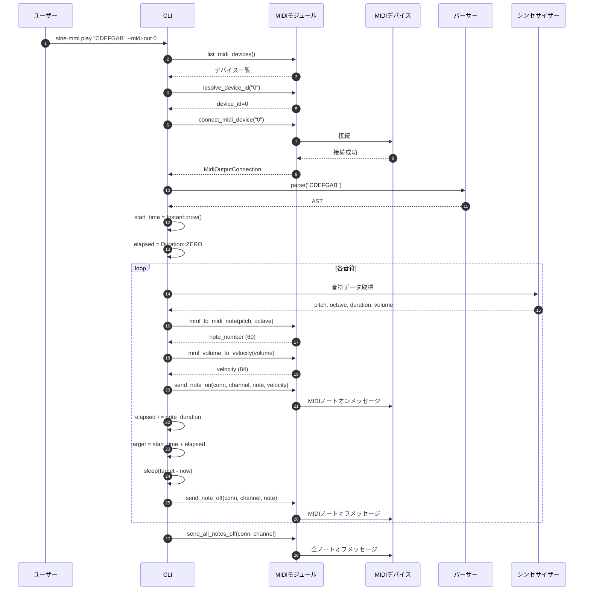
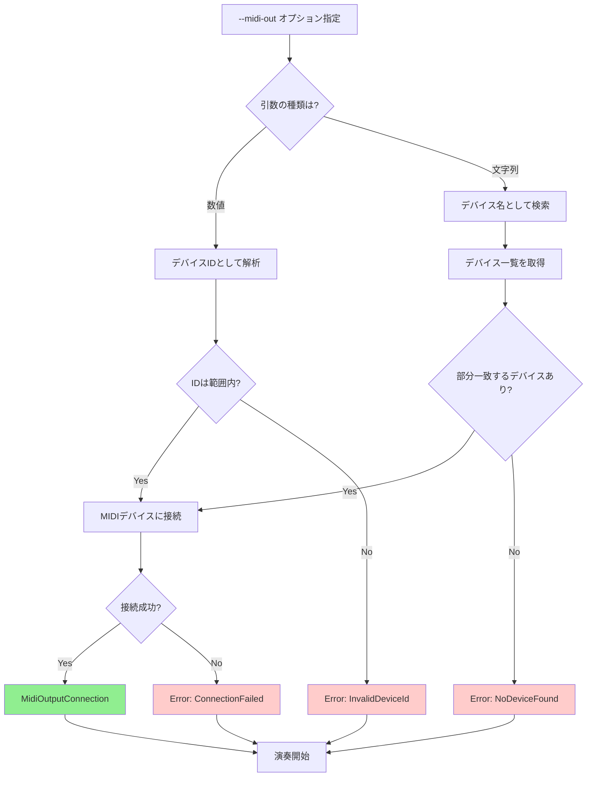
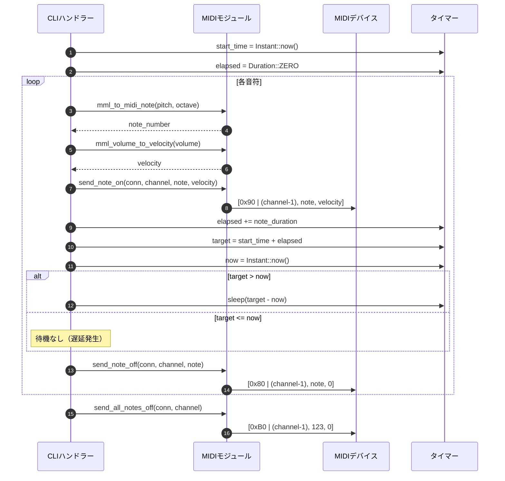

# MIDIストリーミング 詳細設計書

## メタ情報

| 項目 | 内容 |
|------|------|
| ドキュメントID | DET-MIDI-001 |
| 機能ID | F-031 |
| 機能名 | MIDIストリーミング |
| 関連基本設計書 | [BASIC-CLI-006](../../basic/BASIC-CLI-006_MIDI-Streaming-Tuplet.md) |
| 関連要件定義書 | REQ-CLI-006 |
| バージョン | 1.0.0 |
| 作成日 | 2026-01-14 |
| 最終更新日 | 2026-01-14 |
| 作成者 | detailed-design-writer |

---

## 1. 概要

### 1.1 機能概要

MIDIストリーミング機能は、sine-mmlで解析したMML文字列を外部MIDIデバイスやソフトウェアシンセサイザーにリアルタイムで送信する機能です。

**主な機能**:
- MIDIデバイス列挙・接続
- リアルタイムMIDIメッセージ送信（Note On/Off）
- MIDIチャンネル指定（1-16）
- ドリフトフリーなタイミング制御（Next Event Time方式）
- 演奏中断時の全ノートオフ送信

**技術スタック**:
- **MIDIライブラリ**: midir 0.9+（クロスプラットフォーム対応）
- **タイミング制御**: std::time::Instant（絶対時刻管理）

### 1.2 処理フロー概要



---

## 2. 機能要件

### 2.1 対象機能

| 機能ID | 機能名 | 概要 | 優先度 |
|--------|--------|------|--------|
| F-031 | MIDIストリーミング | `--midi-out` でMIDIデバイスにリアルタイム送信 | 必須 |

### 2.2 ビジネスルール

| ルールID | 内容 | 検証方法 |
|---------|------|---------|
| BR-090 | MIDIチャンネルは `--midi-channel` オプションで指定可能（1-16、デフォルト: 1） | CLIオプション検証 |
| BR-091 | MML音量（V0-V15）をMIDIベロシティ（0-127）に変換（V0=0, V15=127, 線形補間） | 変換関数テスト |
| BR-092 | MIDIノートナンバーはMMLオクターブと音程から計算（C4=60） | 変換関数テスト |
| BR-093 | MIDIデバイスが接続されていない場合はエラー | エラーハンドリングテスト |
| BR-094 | 演奏中断時は全ノートオフメッセージを送信してクリーンアップ | 中断処理テスト |
| BR-104 | 無効なMIDIチャンネル（0以下または17以上）はエラー | バリデーションテスト |

---

## 3. 詳細仕様

### 3.1 MIDIデバイス管理

#### 3.1.1 デバイス列挙

**関数**: `list_midi_devices() -> Result<Vec<String>, MidiError>`

**処理内容**:
1. `midir::MidiOutput::new()` でMIDI出力インスタンスを作成
2. `ports()` で利用可能なMIDIポート一覧を取得
3. 各ポートの名前を `port_name()` で取得
4. デバイス名のリストを返却

**エラー処理**:
- MIDI出力の初期化に失敗した場合: `MidiError::NoDeviceFound`

#### 3.1.2 デバイスID解決

**関数**: `resolve_device_id(name_or_id: &str) -> Result<usize, MidiError>`

**処理内容**:
1. 入力文字列が数値として解析可能か確認
2. **数値の場合**: デバイスIDとして扱い、範囲チェック
   - デバイス一覧を取得
   - IDが範囲内（0 ≤ id < デバイス数）か確認
   - 範囲外の場合: `MidiError::InvalidDeviceId`
3. **数値でない場合**: デバイス名として扱い、部分一致検索
   - デバイス一覧を取得
   - 各デバイス名に対して `contains()` で部分一致検索
   - 最初にマッチしたデバイスのIDを返却
   - マッチしない場合: `MidiError::NoDeviceFound`

**実装例**:
```rust
pub fn resolve_device_id(name_or_id: &str) -> Result<usize, MidiError> {
    // 数値として解析を試みる
    if let Ok(id) = name_or_id.parse::<usize>() {
        // デバイスIDとして扱う
        let devices = list_midi_devices()?;
        if id >= devices.len() {
            return Err(MidiError::InvalidDeviceId(id));
        }
        return Ok(id);
    }
    
    // デバイス名として扱う
    let devices = list_midi_devices()?;
    for (i, device_name) in devices.iter().enumerate() {
        if device_name.contains(name_or_id) {
            return Ok(i);
        }
    }
    
    Err(MidiError::NoDeviceFound)
}
```

#### 3.1.3 デバイス接続

**関数**: `connect_midi_device(device_id_or_name: &str) -> Result<MidiOutputConnection, MidiError>`

**処理内容**:
1. `resolve_device_id()` でデバイスIDを解決
2. `midir::MidiOutput::new()` でMIDI出力インスタンスを作成
3. `ports()` で利用可能なポート一覧を取得
4. 解決されたIDでポートを取得
5. `connect()` でMIDIデバイスに接続
6. 接続成功時: `MidiOutputConnection` を返却

**エラー処理**:
- デバイスID解決失敗: `MidiError::NoDeviceFound` または `MidiError::InvalidDeviceId`
- 接続失敗: `MidiError::ConnectionFailed`

### 3.2 MIDIメッセージ送信

#### 3.2.1 ノートオンメッセージ

**関数**: `send_note_on(conn: &mut MidiOutputConnection, channel: u8, note: u8, velocity: u8) -> Result<(), MidiError>`

**MIDIメッセージ形式**:
```
[0x90 | (channel - 1), note, velocity]
```

**処理内容**:
1. チャンネル検証（1-16の範囲内か確認）
2. ノートナンバー検証（0-127の範囲内か確認）
3. ベロシティ検証（0-127の範囲内か確認）
4. MIDIメッセージを構築
5. `conn.send()` でメッセージを送信

**エラー処理**:
- 無効なチャンネル: `MidiError::InvalidChannel`
- 送信失敗: `MidiError::SendFailed`

#### 3.2.2 ノートオフメッセージ

**関数**: `send_note_off(conn: &mut MidiOutputConnection, channel: u8, note: u8) -> Result<(), MidiError>`

**MIDIメッセージ形式**:
```
[0x80 | (channel - 1), note, 0]
```

**処理内容**:
1. チャンネル検証（1-16の範囲内か確認）
2. ノートナンバー検証（0-127の範囲内か確認）
3. MIDIメッセージを構築
4. `conn.send()` でメッセージを送信

**エラー処理**:
- 無効なチャンネル: `MidiError::InvalidChannel`
- 送信失敗: `MidiError::SendFailed`

#### 3.2.3 全ノートオフメッセージ

**関数**: `send_all_notes_off(conn: &mut MidiOutputConnection, channel: u8) -> Result<(), MidiError>`

**MIDIメッセージ形式**:
```
[0xB0 | (channel - 1), 123, 0]
```

**処理内容**:
1. チャンネル検証（1-16の範囲内か確認）
2. MIDIコントロールチェンジメッセージ（CC 123: All Notes Off）を構築
3. `conn.send()` でメッセージを送信

**使用タイミング**:
- 演奏完了時
- Ctrl+Cによる中断時
- エラー発生時

**エラー処理**:
- 無効なチャンネル: `MidiError::InvalidChannel`
- 送信失敗: `MidiError::SendFailed`

### 3.3 MML→MIDI変換

#### 3.3.1 音程→MIDIノートナンバー変換

**関数**: `mml_to_midi_note(pitch: Pitch, accidental: Option<Accidental>, octave: u8) -> u8`

**変換式**:
```
midi_note = (octave + 1) * 12 + pitch_offset + accidental_offset
```

**音程オフセット**:
| 音程 | オフセット |
|------|-----------|
| C | 0 |
| D | 2 |
| E | 4 |
| F | 5 |
| G | 7 |
| A | 9 |
| B | 11 |

**臨時記号オフセット**:
| 臨時記号 | オフセット |
|---------|-----------|
| なし | 0 |
| シャープ (#) | +1 |
| フラット (b) | -1 |

**例**:
- `C4` → (4 + 1) * 12 + 0 + 0 = 60
- `C#4` → (4 + 1) * 12 + 0 + 1 = 61
- `Db4` → (4 + 1) * 12 + 2 - 1 = 61
- `A4` → (4 + 1) * 12 + 9 + 0 = 69

#### 3.3.2 音量→ベロシティ変換

**関数**: `mml_volume_to_velocity(volume: u8) -> u8`

**変換式**:
```
velocity = (volume * 127) / 15
```

**変換テーブル**:
| MML音量 | MIDIベロシティ |
|---------|---------------|
| V0 | 0 |
| V1 | 8 |
| V2 | 17 |
| V3 | 25 |
| V4 | 34 |
| V5 | 42 |
| V6 | 51 |
| V7 | 59 |
| V8 | 68 |
| V9 | 76 |
| V10 | 84 |
| V11 | 93 |
| V12 | 101 |
| V13 | 110 |
| V14 | 118 |
| V15 | 127 |

### 3.4 タイミング制御（Next Event Time方式）

#### 3.4.1 ドリフト問題

**問題**: 相対時間待機（`sleep(duration)`）では、処理時間の累積により音ズレ（ドリフト）が発生

**例**:
```rust
// 悪い例: 相対時間待機
for note in notes {
    send_note_on(note);
    std::thread::sleep(note.duration); // 処理時間が累積
    send_note_off(note);
}
```

#### 3.4.2 解決策: Next Event Time方式

**原理**: 開始時刻からの絶対時刻で各音符の発音タイミングを管理

**実装**:
```rust
use std::time::{Duration, Instant};

pub fn play_midi_stream(
    conn: &mut MidiOutputConnection,
    notes: &[Note],
    channel: u8,
    bpm: u16,
) -> Result<(), MidiError> {
    let start_time = Instant::now();
    let mut elapsed_notes_duration = Duration::ZERO;
    
    for note in notes {
        // MIDIノートオン送信
        let midi_note = mml_to_midi_note(note.pitch, note.accidental, note.octave);
        let velocity = mml_volume_to_velocity(note.volume);
        send_note_on(conn, channel, midi_note, velocity)?;
        
        // 音長を計算
        let note_duration = note.duration_in_seconds(bpm);
        elapsed_notes_duration += Duration::from_secs_f32(note_duration);
        
        // 目標時刻を計算（絶対時刻管理）
        let target_time = start_time + elapsed_notes_duration;
        
        // 目標時刻まで待機
        let now = Instant::now();
        if target_time > now {
            std::thread::sleep(target_time - now);
        }
        
        // MIDIノートオフ送信
        send_note_off(conn, channel, midi_note)?;
    }
    
    // 全ノートオフ
    send_all_notes_off(conn, channel)?;
    
    Ok(())
}
```

**効果**:
- 長時間の演奏でも正確なタイミングを維持
- 処理時間の累積による音ズレを防止

#### 3.4.3 タイミング制御フロー

```mermaid
flowchart TD
    Start[演奏開始] --> InitTime[start_time = Instant::now<br>elapsed = Duration::ZERO]
    InitTime --> LoopStart{次の音符あり?}
    
    LoopStart -->|Yes| SendOn[MIDIノートオン送信]
    SendOn --> UpdateElapsed[elapsed += note_duration]
    UpdateElapsed --> CalcTarget[target = start_time + elapsed]
    CalcTarget --> CheckWait{target > now?}
    
    CheckWait -->|Yes| Wait[sleep(target - now)]
    CheckWait -->|No| NoWait[待機なし]
    
    Wait --> SendOff[MIDIノートオフ送信]
    NoWait --> SendOff
    SendOff --> LoopStart
    
    LoopStart -->|No| AllOff[全ノートオフ送信]
    AllOff --> End[演奏完了]
    
    style InitTime fill:#add8e6
    style UpdateElapsed fill:#add8e6
    style CalcTarget fill:#add8e6
    style SendOn fill:#90ee90
    style SendOff fill:#90ee90
    style AllOff fill:#90ee90
```

---

## 4. 処理フロー

### 4.1 MIDIデバイス接続フロー



### 4.2 MIDIメッセージ送信フロー



---

## 5. エラーハンドリング

### 5.1 エラーケース一覧

| エラーコード | エラー型 | 説明 | 発生条件 | メッセージ例 |
|-------------|---------|------|---------|-------------|
| MML-E015 | `NoDeviceFound` | MIDIデバイスが見つからない | デバイス名が存在しない | `[MML-E015] MIDIデバイスが見つかりません` |
| MML-E016 | `ConnectionFailed` | MIDIデバイス接続エラー | デバイスへの接続失敗 | `[MML-E016] MIDIデバイスへの接続に失敗しました: {理由}` |
| MML-E017 | `SendFailed` | MIDIメッセージ送信エラー | メッセージ送信失敗 | `[MML-E017] MIDIメッセージの送信に失敗しました: {理由}` |
| MML-E018 | `InvalidDeviceId` | 無効なMIDIデバイスID | デバイスIDが範囲外 | `[MML-E018] 無効なMIDIデバイスIDです: {id}` |
| MML-E019 | `DeviceDisconnected` | MIDIデバイス切断 | 演奏中にデバイスが切断 | `[MML-E019] MIDIデバイスが切断されました` |
| MML-E024 | `InvalidChannel` | 無効なMIDIチャンネル | チャンネルが1-16の範囲外 | `[MML-E024] 無効なMIDIチャンネルです（1-16を指定してください）: {channel}` |

### 5.2 エラー発生箇所のまとめ

| エラー | 発生箇所 | 発生条件 |
|--------|---------|---------|
| `NoDeviceFound` | `list_midi_devices`, `resolve_device_id` | デバイスが接続されていない、または名前が一致しない |
| `ConnectionFailed` | `connect_midi_device` | デバイスへの接続失敗 |
| `SendFailed` | `send_note_on`, `send_note_off`, `send_all_notes_off` | MIDIメッセージの送信失敗 |
| `InvalidDeviceId` | `resolve_device_id` | デバイスIDが範囲外 |
| `DeviceDisconnected` | `send_note_on`, `send_note_off` | 演奏中にデバイスが切断 |
| `InvalidChannel` | `send_note_on`, `send_note_off`, `send_all_notes_off` | チャンネルが1-16の範囲外 |

---

## 6. テストケース

### 6.1 正常系テストケース

| テストID | 入力 | 期待される動作 | 説明 |
|---------|------|--------------|------|
| TC-031-001 | `--midi-list` | 利用可能なMIDIデバイス一覧が表示される | デバイス列挙 |
| TC-031-002 | `--midi-out 0` | MIDIデバイス0にメッセージが送信される | デバイスID指定 |
| TC-031-003 | `C4` をMIDI出力 | MIDIノート60が送信される | 音程変換 |
| TC-031-004 | `V10` をMIDI出力 | MIDIベロシティ84が送信される | 音量変換 |
| TC-031-008 | `--midi-channel 2` | MIDIチャンネル2でメッセージが送信される | チャンネル指定 |
| TC-031-009 | `--midi-channel 10` | MIDIチャンネル10（ドラム）でメッセージが送信される | ドラムチャンネル |

### 6.2 異常系テストケース

| テストID | 入力 | 期待されるエラー | エラーメッセージ |
|---------|------|----------------|----------------|
| TC-031-005 | MIDIデバイス未接続 | `NoDeviceFound` | `[MML-E015] MIDIデバイスが見つかりません` |
| TC-031-006 | 無効なデバイスID（99） | `InvalidDeviceId` | `[MML-E018] 無効なMIDIデバイスIDです: 99` |
| TC-031-007 | Ctrl+Cで中断 | 全ノートオフメッセージが送信される | クリーンアップ |
| TC-031-010 | `--midi-channel 0` | `InvalidChannel` | `[MML-E024] 無効なMIDIチャンネルです（1-16を指定してください）: 0` |
| TC-031-011 | `--midi-channel 17` | `InvalidChannel` | `[MML-E024] 無効なMIDIチャンネルです（1-16を指定してください）: 17` |

### 6.3 エッジケーステストケース

| テストID | 入力 | 期待される動作 | 説明 |
|---------|------|--------------|------|
| TC-031-201 | 1000音符の長時間演奏 | ドリフトなく正確なタイミングで演奏される | Next Event Time方式の検証 |
| TC-031-202 | `V0` をMIDI出力 | MIDIベロシティ0が送信される | 最小音量 |
| TC-031-203 | `V15` をMIDI出力 | MIDIベロシティ127が送信される | 最大音量 |
| TC-031-204 | `C1` をMIDI出力 | MIDIノート24が送信される | 最低音 |
| TC-031-205 | `B8` をMIDI出力 | MIDIノート107が送信される | 最高音 |

---

## 7. 設計書一覧

| 設計書 | パス | 説明 |
|--------|------|------|
| バックエンド設計書 | [./バックエンド設計書.md](./バックエンド設計書.md) | 実装詳細、コード差分、モジュール設計 |

---

## 8. 関連ドキュメント

| ドキュメント | パス | 説明 |
|-------------|------|------|
| 基本設計書 | [BASIC-CLI-006](../../basic/BASIC-CLI-006_MIDI-Streaming-Tuplet.md) | MIDIストリーミング機能の基本設計 |
| 要件定義書 | REQ-CLI-006 | MIDIストリーミング機能の要件定義 |

---

## 変更履歴

| 日付 | バージョン | 変更内容 | 担当者 |
|:---|:---|:---|:---|
| 2026-01-14 | 1.0.0 | 初版作成 | detailed-design-writer |
