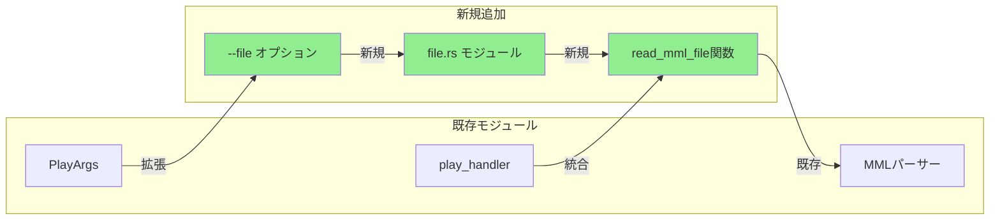
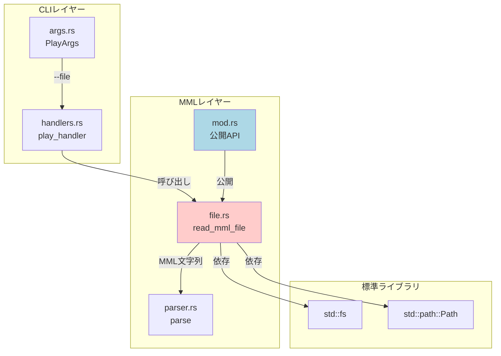
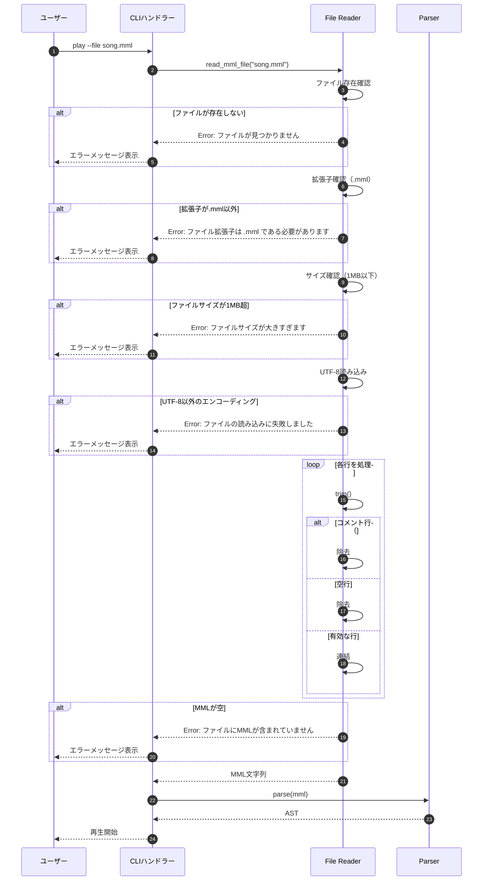
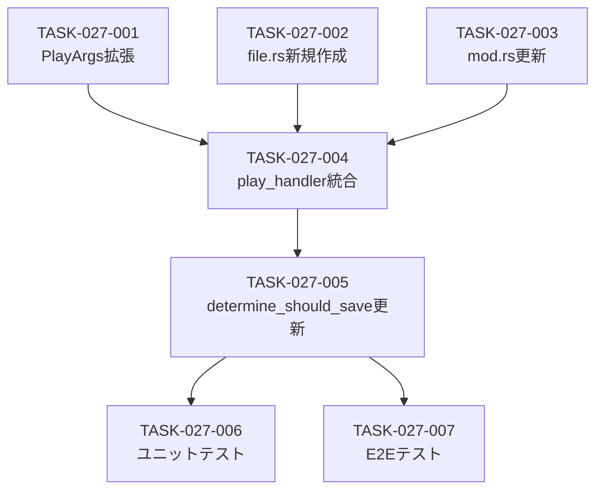

# MMLファイル読み取り バックエンド設計書

## ドキュメント情報

| 項目 | 内容 |
|------|------|
| 機能ID | F-027 |
| 機能名 | MMLファイル読み取り |
| 関連基本設計書 | [BASIC-CLI-004](../../basic/BASIC-CLI-004_MML-Advanced-Features.md) |
| 関連詳細設計書 | [詳細設計書](./詳細設計書.md) |
| バージョン | 1.0.0 |
| 作成日 | 2026-01-12 |
| 最終更新日 | 2026-01-12 |
| 作成者 | detailed-design-writer |

---

## 1. 変更概要

### 1.1 目的

MMLファイル読み取り機能の実装により、長いMML文字列を外部ファイルで管理可能にする。従来はコマンドライン引数で直接MML文字列を指定する必要があったが、`.mml`ファイルから読み込むことで複雑な楽曲の管理が容易になる。

### 1.2 変更対象モジュール

| モジュール | ファイルパス | 変更内容 | 変更レベル |
|-----------|------------|---------|-----------|
| CLI引数定義 | `src/cli/args.rs` | `--file`オプション追加 | 低 |
| ファイル読み取り | `src/mml/file.rs` | 新規モジュール作成 | 新規 |
| MMLモジュール | `src/mml/mod.rs` | `file`モジュール公開 | 低 |
| CLIハンドラー | `src/cli/handlers.rs` | ファイル読み取り統合 | 中 |

### 1.3 影響範囲



---

## 2. モジュール設計

### 2.1 依存関係図



### 2.2 インターフェース定義

#### 2.2.1 公開インターフェース

| 関数 | シグネチャ | 説明 |
|------|----------|------|
| `read_mml_file` | `fn read_mml_file(path: &str) -> Result<String>` | MMLファイルを読み込み、コメント・空行を除去してMML文字列を返す |

#### 2.2.2 内部インターフェース

なし（`read_mml_file`のみが公開API）

---

## 3. 実装詳細

### 3.1 CLI引数拡張

#### 3.1.1 PlayArgs構造体の拡張

**ファイル**: `src/cli/args.rs`

**変更内容**:

```rust
#[derive(Args, Debug)]
#[command(group(
    clap::ArgGroup::new("input")
        .required(true)
        .args(["mml", "history_id", "file"]),  // file を追加
))]
pub struct PlayArgs {
    pub mml: Option<String>,
    
    #[arg(long)]
    pub history_id: Option<i64>,
    
    /// MMLファイルのパス（.mml拡張子）
    #[arg(long)]
    pub file: Option<String>,
    
    // 既存のフィールド...
    #[arg(short, long, default_value = "sine")]
    pub waveform: Waveform,
    
    #[arg(short, long, default_value_t = 1.0, value_parser = validate_volume)]
    pub volume: f32,
    
    #[arg(long, default_value_t = false)]
    pub loop_play: bool,
    
    #[arg(long, default_value_t = false)]
    pub metronome: bool,
    
    #[arg(long, value_parser = validate_metronome_beat, default_value_t = 4)]
    pub metronome_beat: u8,
    
    #[arg(long, value_parser = validate_volume, default_value_t = 0.3)]
    pub metronome_volume: f32,
    
    #[arg(long)]
    pub note: Option<String>,
}
```

**実装のポイント**:
- `file: Option<String>`フィールドを追加
- `ArgGroup`に`"file"`を追加（`mml`, `history_id`, `file`の3つが排他的）
- `#[arg(long)]`で`--file`オプションとして公開

**テストケース**:

```rust
#[test]
fn test_play_args_file_option() {
    // --file のみ -> OK
    let result = Cli::try_parse_from(&["sine-mml", "play", "--file", "song.mml"]);
    assert!(result.is_ok());

    // --file と mml の両方 -> Error
    let result = Cli::try_parse_from(&["sine-mml", "play", "CDE", "--file", "song.mml"]);
    assert!(result.is_err());
    let err = result.unwrap_err();
    assert_eq!(err.kind(), clap::error::ErrorKind::ArgumentConflict);

    // --file と --history-id の両方 -> Error
    let result = Cli::try_parse_from(&["sine-mml", "play", "--file", "song.mml", "--history-id", "1"]);
    assert!(result.is_err());
    let err = result.unwrap_err();
    assert_eq!(err.kind(), clap::error::ErrorKind::ArgumentConflict);
}
```

### 3.2 ファイル読み取りモジュール

#### 3.2.1 新規モジュール: `src/mml/file.rs`

**ファイル構成**:

```
src/
├── mml/
│   ├── mod.rs
│   ├── ast.rs
│   ├── parser.rs
│   ├── error.rs
│   └── file.rs  # 新規追加
```

**`src/mml/mod.rs`の変更**:

```rust
mod ast;
pub mod error;
pub mod file;  // 新規追加

pub use ast::*;
pub use error::ParseError;

pub mod parser;
pub use parser::*;
```

#### 3.2.2 read_mml_file関数の実装

**ファイル**: `src/mml/file.rs`

**実装内容**:

```rust
use std::fs;
use std::path::Path;
use anyhow::{Context, Result};

/// MMLファイルを読み込み、コメントと空行を除去してMML文字列を返す
///
/// # 引数
/// * `path` - ファイルパス
///
/// # 戻り値
/// * `Ok(String)` - MML文字列（コメント、空行除去済み）
/// * `Err(anyhow::Error)` - ファイル読み取りエラー
///
/// # エラー
/// - ファイルが存在しない
/// - 拡張子が`.mml`以外
/// - ファイルサイズが1MB超
/// - UTF-8以外のエンコーディング
/// - ファイルにMMLが含まれていない
///
/// # 例
/// ```
/// use sine_mml::mml::file::read_mml_file;
///
/// let mml = read_mml_file("song.mml")?;
/// println!("MML: {}", mml);
/// ```
pub fn read_mml_file(path: &str) -> Result<String> {
    // ファイル存在確認
    let path = Path::new(path);
    if !path.exists() {
        anyhow::bail!("ファイルが見つかりません: {}", path.display());
    }
    
    // 拡張子確認
    if path.extension().and_then(|s| s.to_str()) != Some("mml") {
        anyhow::bail!("ファイル拡張子は .mml である必要があります: {}", path.display());
    }
    
    // ファイルサイズ確認（1MB上限）
    let metadata = fs::metadata(path)?;
    if metadata.len() > 1_000_000 {
        anyhow::bail!("ファイルサイズが大きすぎます（上限: 1MB）: {}", path.display());
    }
    
    // ファイル読み込み
    let content = fs::read_to_string(path)
        .with_context(|| format!("ファイルの読み込みに失敗しました: {}", path.display()))?;
    
    // コメントと空行を除去
    let mml = content
        .lines()
        .map(str::trim)
        .filter(|line| !line.is_empty() && !line.starts_with('#'))
        .collect::<Vec<_>>()
        .join(" ");
    
    if mml.is_empty() {
        anyhow::bail!("ファイルにMMLが含まれていません: {}", path.display());
    }
    
    Ok(mml)
}
```

**実装のポイント**:
- **ファイル存在確認**: `Path::exists()`で確認
- **拡張子確認**: `.mml`のみ許可
- **サイズ確認**: 1MB上限（DoS攻撃防止）
- **UTF-8読み込み**: `fs::read_to_string()`で自動検証
- **コメント除去**: `starts_with('#')`で判定
- **空行除去**: `is_empty()`で判定
- **行連結**: スペース区切りで連結

**時間計算量**: O(n)（nはファイルの行数）

**空間計算量**: O(m)（mはファイルサイズ）

### 3.3 CLIハンドラーの統合

#### 3.3.1 play_handler関数の変更

**ファイル**: `src/cli/handlers.rs`

**変更内容**:

```rust
pub fn play_handler(args: PlayArgs) -> Result<()> {
    // 1. 引数の検証とMML取得
    let should_save = determine_should_save(&args);
    let mml_string = match (&args.mml, args.history_id, &args.file) {
        (Some(mml), None, None) => mml.clone(),
        (None, Some(id), None) => {
            let db = db::Database::init()?;
            let entry = db
                .get_by_id(id)
                .with_context(|| format!("[CLI-E002] 履歴ID {id} が見つかりません"))?;
            entry.mml
        }
        (None, None, Some(file_path)) => {
            // ファイルから読み込み
            mml::file::read_mml_file(file_path)?
        }
        (None, None, None) => {
            bail!("[CLI-E001] play コマンドでは、MML文字列、--history-id、または --file のいずれか一方を指定してください");
        }
        _ => {
            unreachable!("clap should prevent this")
        }
    };

    // メモのバリデーション
    if let Some(ref note) = args.note {
        validate_note(note).map_err(|e| anyhow::anyhow!("[CLI-E010] {e}"))?;
    }

    // 2. MML解析
    let ast = mml::parse(&mml_string).map_err(|e| anyhow::anyhow!("MML parse error: {e:?}"))?;

    // 3. 音声合成
    let waveform_type = match args.waveform {
        Waveform::Sine => audio::waveform::WaveformType::Sine,
        Waveform::Sawtooth => audio::waveform::WaveformType::Sawtooth,
        Waveform::Square => audio::waveform::WaveformType::Square,
    };

    #[allow(clippy::cast_possible_truncation, clippy::cast_sign_loss)]
    let volume_u8 = (args.volume * 100.0) as u8;

    let sample_rate = 44100;

    let mut synth = audio::synthesizer::Synthesizer::new(sample_rate, volume_u8, waveform_type);
    let mut buffer = synth
        .synthesize(&ast)
        .map_err(|e| anyhow::anyhow!("{e}"))
        .context("音声合成に失敗しました")?;

    if args.metronome {
        let bpm = ast.get_tempo();
        synth.mix_metronome(
            &mut buffer,
            f64::from(sample_rate),
            bpm,
            args.metronome_beat,
            args.metronome_volume,
        );
        audio::synthesizer::normalize_samples(&mut buffer);
    }

    // 4. 履歴保存（ループ前に実行）
    let history_id_opt = if should_save {
        let db = db::Database::init()?;

        let db_waveform = match args.waveform {
            Waveform::Sine => db::history::Waveform::Sine,
            Waveform::Sawtooth => db::history::Waveform::Sawtooth,
            Waveform::Square => db::history::Waveform::Square,
        };

        let bpm_u16 = 120;

        let entry = db::HistoryEntry::new(
            mml_string.clone(),
            db_waveform,
            args.volume,
            bpm_u16,
            args.note.clone(),
        );

        match db.save(&entry) {
            Ok(id) => Some(id),
            Err(e) => {
                eprintln!("Warning: 履歴の保存に失敗しました: {e}");
                None
            }
        }
    } else {
        None
    };

    // 5. 再生
    match audio::player::AudioPlayer::new() {
        Ok(mut player) => {
            player
                .play(&buffer, args.loop_play)
                .context("音声再生に失敗しました")?;

            // 6. プログレス表示 & 待機
            output::display_play_progress(&mml_string, &buffer, args.loop_play)?;
        }
        Err(_) => {
            eprintln!("Warning: Audio device not found. Skipping playback.");
        }
    }

    // 7. 成功メッセージ
    if let Some(id) = history_id_opt {
        if let Some(ref note) = args.note {
            output::success(&format!("✓ 再生完了（履歴ID: {id}、メモ: {note}）"));
        } else {
            output::success(&format!("✓ 再生完了（履歴ID: {id}）"));
        }
    } else {
        output::success("✓ 再生完了");
    }

    Ok(())
}
```

**変更点**:
- `match`式に`(None, None, Some(file_path))`ケースを追加
- `mml::file::read_mml_file()`を呼び出し
- エラーメッセージを更新（`--file`を追加）

#### 3.3.2 determine_should_save関数の変更

**ファイル**: `src/cli/handlers.rs`

**変更内容**:

```rust
fn determine_should_save(args: &PlayArgs) -> bool {
    // mmlまたはfileから入力された場合のみ保存
    matches!((&args.mml, &args.file, args.history_id), (Some(_), None, None) | (None, Some(_), None))
}
```

**変更点**:
- `--file`オプションで読み込んだ場合も履歴に保存
- `(None, Some(_), None)`パターンを追加

---

## 4. 処理フロー

### 4.1 ファイル読み取りフロー



### 4.2 MMLファイル例

**入力ファイル（song.mml）**:

```mml
# イントロ
T120 L8 O5
[CDEF]2 GAB >C

# Aメロ
O4 L4
CDEFGAB >C

# Bメロ
O5 L8
[CD:EF]2 GAB

# アウトロ
O4 L2
C R
```

**処理後のMML文字列**:

```
T120 L8 O5 [CDEF]2 GAB >C O4 L4 CDEFGAB >C O5 L8 [CD:EF]2 GAB O4 L2 C R
```

---

## 5. エラーハンドリング

### 5.1 エラーケース一覧

| エラーケース | エラー型 | 検出タイミング | メッセージ例 |
|-------------|---------|--------------|-------------|
| ファイルが存在しない | `anyhow::Error` | `Path::exists()`で確認 | `ファイルが見つかりません: song.mml` |
| 拡張子が`.mml`以外 | `anyhow::Error` | `path.extension()`で確認 | `ファイル拡張子は .mml である必要があります: song.txt` |
| ファイルサイズが1MB超 | `anyhow::Error` | `fs::metadata().len()`で確認 | `ファイルサイズが大きすぎます（上限: 1MB）: huge_song.mml` |
| UTF-8以外のエンコーディング | `anyhow::Error` | `fs::read_to_string()`で検出 | `ファイルの読み込みに失敗しました: invalid_encoding.mml` |
| ファイルにMMLが含まれていない | `anyhow::Error` | コメント・空行除去後に確認 | `ファイルにMMLが含まれていません: empty.mml` |

### 5.2 エラーハンドリング実装

#### 5.2.1 エラーメッセージの設計

**ファイルが存在しない場合**:
```rust
if !path.exists() {
    anyhow::bail!("ファイルが見つかりません: {}", path.display());
}
```

**拡張子が不正な場合**:
```rust
if path.extension().and_then(|s| s.to_str()) != Some("mml") {
    anyhow::bail!("ファイル拡張子は .mml である必要があります: {}", path.display());
}
```

**ファイルサイズが大きすぎる場合**:
```rust
let metadata = fs::metadata(path)?;
if metadata.len() > 1_000_000 {
    anyhow::bail!("ファイルサイズが大きすぎます（上限: 1MB）: {}", path.display());
}
```

**UTF-8以外のエンコーディングの場合**:
```rust
let content = fs::read_to_string(path)
    .with_context(|| format!("ファイルの読み込みに失敗しました: {}", path.display()))?;
```

**ファイルにMMLが含まれていない場合**:
```rust
if mml.is_empty() {
    anyhow::bail!("ファイルにMMLが含まれていません: {}", path.display());
}
```

---

## 6. テスト実装

### 6.1 ユニットテスト構成

**ファイル**: `tests/unit/mml_file_test.rs`

**テストカテゴリ**:

| カテゴリ | テスト数 | 説明 |
|---------|---------|------|
| 正常系 | 6件 | 基本的なファイル読み込み、コメント除去、空行除去 |
| 異常系 | 5件 | エラー検出、範囲外、不正な構文 |

### 6.2 主要テストケース実装例

#### 6.2.1 正常系テスト

```rust
#[test]
fn test_read_mml_file_with_comments() {
    let dir = tempdir().unwrap();
    let file_path = dir.path().join("test.mml");
    let mut file = File::create(&file_path).unwrap();
    writeln!(file, "# イントロ").unwrap();
    writeln!(file, "T120 L8 O5").unwrap();
    writeln!(file, "").unwrap();
    writeln!(file, "# Aメロ").unwrap();
    writeln!(file, "CDEFGAB").unwrap();

    let result = read_mml_file(file_path.to_str().unwrap());
    assert!(result.is_ok());
    let mml = result.unwrap();
    assert_eq!(mml, "T120 L8 O5 CDEFGAB");
}

#[test]
fn test_read_mml_file_trim_whitespace() {
    let dir = tempdir().unwrap();
    let file_path = dir.path().join("test.mml");
    let mut file = File::create(&file_path).unwrap();
    writeln!(file, "  CDEFGAB  ").unwrap();
    writeln!(file, "  >C  ").unwrap();

    let result = read_mml_file(file_path.to_str().unwrap());
    assert!(result.is_ok());
    let mml = result.unwrap();
    assert_eq!(mml, "CDEFGAB >C");
}
```

#### 6.2.2 異常系テスト

```rust
#[test]
fn test_read_mml_file_not_found() {
    let result = read_mml_file("nonexistent.mml");
    assert!(result.is_err());
    assert!(result.unwrap_err().to_string().contains("ファイルが見つかりません"));
}

#[test]
fn test_read_mml_file_invalid_extension() {
    let dir = tempdir().unwrap();
    let file_path = dir.path().join("test.txt");
    let mut file = File::create(&file_path).unwrap();
    writeln!(file, "CDEFGAB").unwrap();

    let result = read_mml_file(file_path.to_str().unwrap());
    assert!(result.is_err());
    assert!(result.unwrap_err().to_string().contains("ファイル拡張子は .mml である必要があります"));
}

#[test]
fn test_read_mml_file_too_large() {
    let dir = tempdir().unwrap();
    let file_path = dir.path().join("large.mml");
    let mut file = File::create(&file_path).unwrap();
    // 1MB超のファイルを作成
    for _ in 0..100_001 {
        writeln!(file, "CDEFGAB").unwrap();
    }

    let result = read_mml_file(file_path.to_str().unwrap());
    assert!(result.is_err());
    assert!(result.unwrap_err().to_string().contains("ファイルサイズが大きすぎます"));
}

#[test]
fn test_read_mml_file_empty() {
    let dir = tempdir().unwrap();
    let file_path = dir.path().join("empty.mml");
    let mut file = File::create(&file_path).unwrap();
    writeln!(file, "# Only comments").unwrap();
    writeln!(file, "").unwrap();

    let result = read_mml_file(file_path.to_str().unwrap());
    assert!(result.is_err());
    assert!(result.unwrap_err().to_string().contains("ファイルにMMLが含まれていません"));
}
```

### 6.3 テストカバレッジ目標

| 対象 | カバレッジ目標 | 測定方法 |
|------|--------------|---------|
| `read_mml_file()` | 100% | `cargo tarpaulin` |
| `play_handler()` (ファイル読み込み部分) | 100% | `cargo tarpaulin` |
| エラーハンドリング | 100% | 全エラーケースをテスト |

---

## 7. 性能考慮事項

### 7.1 性能要件

| ID | 要件 | 目標値 | 測定方法 |
|----|------|--------|---------|
| NFR-P-011 | ファイル読み取り速度 | 100ms以内（1MB） | ベンチマークテスト |
| NFR-P-012 | メモリ使用量 | ファイルサイズの2倍以内 | メモリプロファイラ |

### 7.2 性能最適化手法

#### 7.2.1 メモリ効率

```rust
// 行連結時にVecを使用
let mml = content
    .lines()
    .map(str::trim)
    .filter(|line| !line.is_empty() && !line.starts_with('#'))
    .collect::<Vec<_>>()
    .join(" ");
```

**効果**:
- `collect::<Vec<_>>()`で一度だけメモリ確保
- `join(" ")`で効率的に連結

#### 7.2.2 早期リターン

```rust
// ファイル存在確認を最初に実行
if !path.exists() {
    anyhow::bail!("ファイルが見つかりません: {}", path.display());
}
```

**効果**:
- 不要なファイル読み込みを回避
- エラー時のオーバーヘッドを最小化

---

## 8. セキュリティ考慮事項

### 8.1 DoS攻撃対策

| 対策 | 実装箇所 | 詳細 |
|------|---------|------|
| ファイルサイズ制限 | `read_mml_file()` | 1MB以下に制限 |
| 拡張子チェック | `read_mml_file()` | `.mml`のみ許可 |

### 8.2 メモリ安全性

| 項目 | 対策 | 実装箇所 |
|------|------|---------|
| バッファオーバーフロー | Rustの境界チェック | 全配列アクセス |
| パストラバーサル | 相対パス・絶対パスのみ許可 | `Path::new()` |

---

## 9. 実装タスク分割

### 9.1 タスク一覧

| タスクID | タスク名 | 対象ファイル | 見積もり行数 | 優先度 |
|---------|---------|------------|------------|--------|
| TASK-027-001 | PlayArgs拡張 | `src/cli/args.rs` | 10行 | 高 |
| TASK-027-002 | file.rs新規作成 | `src/mml/file.rs` | 80行 | 高 |
| TASK-027-003 | mod.rs更新 | `src/mml/mod.rs` | 5行 | 高 |
| TASK-027-004 | play_handler統合 | `src/cli/handlers.rs` | 20行 | 高 |
| TASK-027-005 | determine_should_save更新 | `src/cli/handlers.rs` | 5行 | 高 |
| TASK-027-006 | ユニットテスト実装 | `tests/unit/mml_file_test.rs` | 100行 | 高 |
| TASK-027-007 | E2Eテスト実装 | `tests/cli_integration.rs` | 50行 | 中 |

**合計見積もり**: 270行

### 9.2 実装順序

#### Phase 1: 基礎実装（TASK-027-001〜005）
- PlayArgs拡張、file.rs新規作成、ハンドラー統合
- 見積もり: 120行
- 所要時間: 1日

#### Phase 2: テスト実装（TASK-027-006〜007）
- ユニットテスト、E2Eテスト
- 見積もり: 150行
- 所要時間: 1日

### 9.3 依存関係



---

## 10. 関連ドキュメント

| ドキュメント | パス | 説明 |
|-------------|------|------|
| 詳細設計書 | [詳細設計書.md](./詳細設計書.md) | MMLファイル読み取りの詳細設計 |
| 基本設計書 | [BASIC-CLI-004](../../basic/BASIC-CLI-004_MML-Advanced-Features.md) | MML高度な機能拡張の基本設計 |
| 要件定義書 | REQ-CLI-004 | MML高度な機能拡張の要件定義 |
| 既存CLIハンドラー | `src/cli/handlers.rs` | 既存のCLIハンドラー |
| 既存CLI引数定義 | `src/cli/args.rs` | 既存のCLI引数定義 |

---

## 変更履歴

| 日付 | バージョン | 変更内容 | 担当者 |
|:---|:---|:---|:---|
| 2026-01-12 | 1.0.0 | 初版作成 | detailed-design-writer |
