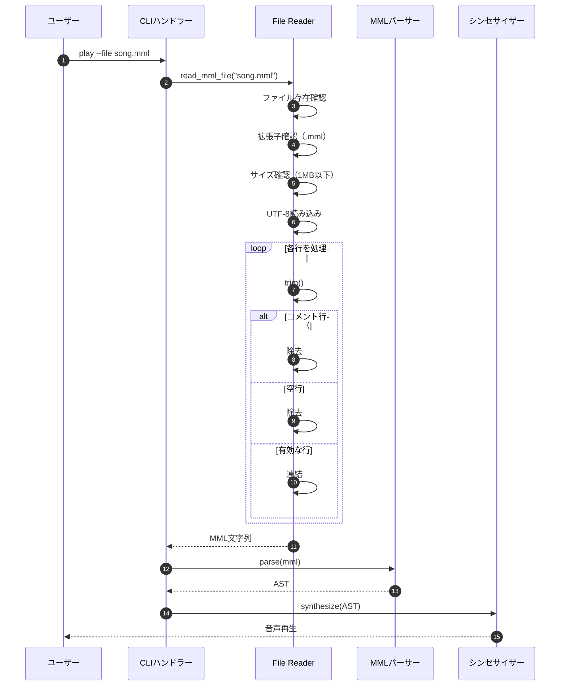
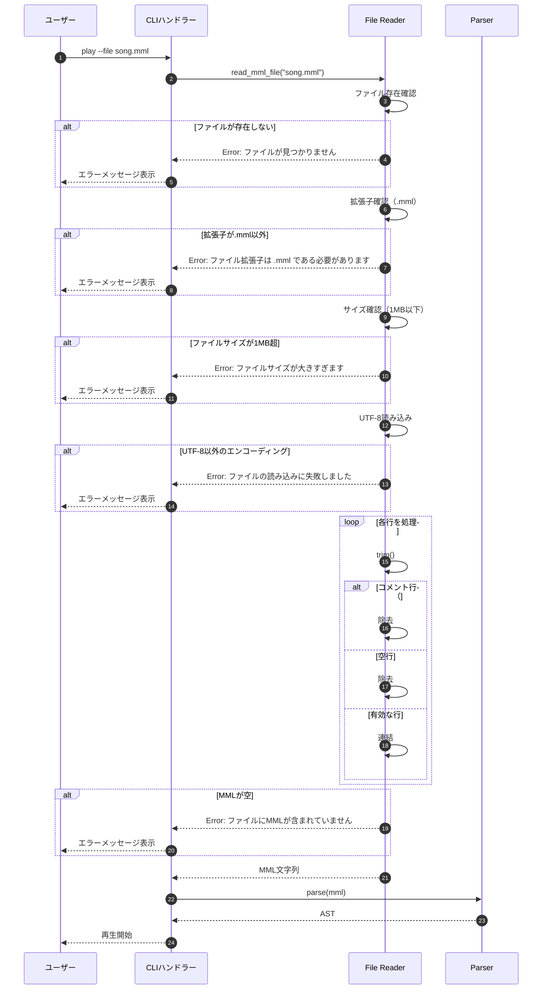
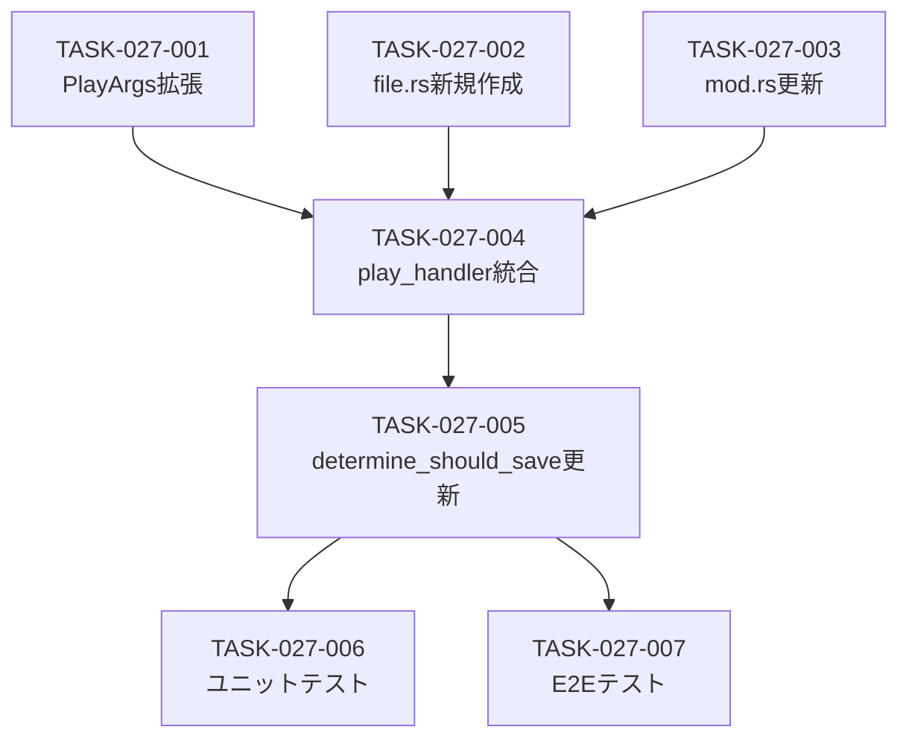

# MMLファイル読み取り 詳細設計書

## メタ情報

| 項目 | 内容 |
|------|------|
| ドキュメントID | DET-FILE-001 |
| 機能ID | F-027 |
| 機能名 | MMLファイル読み取り |
| 関連基本設計書 | [BASIC-CLI-004](../../basic/BASIC-CLI-004_MML-Advanced-Features.md) |
| 関連要件定義書 | REQ-CLI-004_MML-Advanced-Features.md |
| バージョン | 1.0.0 |
| 作成日 | 2026-01-12 |
| 最終更新日 | 2026-01-12 |
| 作成者 | detailed-design-writer |

---

## 1. 概要

### 1.1 機能概要

MMLファイル読み取り機能は、長いMML文字列を外部ファイル（`.mml`拡張子）で管理し、`--file`オプションで読み込む機能です。従来はコマンドライン引数で直接MML文字列を指定する必要がありましたが、ファイルから読み込むことで複雑な楽曲の管理が容易になります。

**主な機能**:
- `.mml`ファイルからMML文字列を読み込み
- `#`で始まる行をコメントとして除去
- 空行を無視
- ファイルサイズ上限（1MB）によるDoS攻撃防止
- UTF-8エンコーディング必須

### 1.2 処理フロー概要



---

## 2. 機能要件

### 2.1 対象機能

| 機能ID | 機能名 | 概要 | 優先度 |
|--------|--------|------|--------|
| F-027 | MMLファイル読み取り | `.mml`ファイルからMMLを読み込み | 必須 |

### 2.2 ビジネスルール

| ルールID | 内容 | 検証方法 |
|---------|------|---------|
| BR-067 | `--file` と `mml` 引数は排他的（両方指定はエラー） | clapのArgGroupで検証 |
| BR-068 | コメント行は `#` で始まる（行頭の空白は許可） | trim()後に`starts_with('#')`で判定 |
| BR-069 | 空行は無視される | trim()後に`is_empty()`で判定 |
| BR-070 | ファイルはUTF-8エンコーディング | `fs::read_to_string()`で検証 |
| BR-071 | ファイルサイズ上限は 1MB（DoS攻撃防止） | `fs::metadata().len()`で検証 |

---

## 3. 詳細仕様

### 3.1 CLIオプション拡張

#### 3.1.1 PlayArgs構造体の拡張

**ファイル**: `src/cli/args.rs`

**変更内容**:

```rust
#[derive(Args, Debug)]
#[command(group(
    clap::ArgGroup::new("input")
        .required(true)
        .args(["mml", "history_id", "file"]),  // file を追加
))]
pub struct PlayArgs {
    pub mml: Option<String>,
    
    #[arg(long)]
    pub history_id: Option<i64>,
    
    /// MMLファイルのパス（.mml拡張子）
    #[arg(long)]
    pub file: Option<String>,
    
    // 既存のフィールド...
    #[arg(short, long, default_value = "sine")]
    pub waveform: Waveform,
    
    #[arg(short, long, default_value_t = 1.0, value_parser = validate_volume)]
    pub volume: f32,
    
    #[arg(long, default_value_t = false)]
    pub loop_play: bool,
    
    #[arg(long, default_value_t = false)]
    pub metronome: bool,
    
    #[arg(long, value_parser = validate_metronome_beat, default_value_t = 4)]
    pub metronome_beat: u8,
    
    #[arg(long, value_parser = validate_volume, default_value_t = 0.3)]
    pub metronome_volume: f32,
    
    #[arg(long)]
    pub note: Option<String>,
}
```

**変更点**:
- `file: Option<String>`フィールドを追加
- `ArgGroup`に`"file"`を追加（`mml`, `history_id`, `file`の3つが排他的）

#### 3.1.2 使用例

```bash
# ファイルから読み込み
sine-mml play --file song.mml

# 既存の方法（変更なし）
sine-mml play "CDEFGAB"
sine-mml play --history-id 1
```

### 3.2 ファイル読み取りモジュール

#### 3.2.1 新規モジュール: `src/mml/file.rs`

**ファイル構成**:

```
src/
├── mml/
│   ├── mod.rs
│   ├── ast.rs
│   ├── parser.rs
│   ├── error.rs
│   └── file.rs  # 新規追加
```

**`src/mml/mod.rs`の変更**:

```rust
mod ast;
pub mod error;
pub mod file;  // 新規追加

pub use ast::*;
pub use error::ParseError;

pub mod parser;
pub use parser::*;
```

#### 3.2.2 read_mml_file関数の実装

**ファイル**: `src/mml/file.rs`

**実装内容**:

```rust
use std::fs;
use std::path::Path;
use anyhow::{Context, Result};

/// MMLファイルを読み込み、コメントと空行を除去してMML文字列を返す
///
/// # 引数
/// * `path` - ファイルパス
///
/// # 戻り値
/// * `Ok(String)` - MML文字列（コメント、空行除去済み）
/// * `Err(anyhow::Error)` - ファイル読み取りエラー
///
/// # エラー
/// - ファイルが存在しない
/// - 拡張子が`.mml`以外
/// - ファイルサイズが1MB超
/// - UTF-8以外のエンコーディング
/// - ファイルにMMLが含まれていない
///
/// # 例
/// ```
/// use sine_mml::mml::file::read_mml_file;
///
/// let mml = read_mml_file("song.mml")?;
/// println!("MML: {}", mml);
/// ```
pub fn read_mml_file(path: &str) -> Result<String> {
    // ファイル存在確認
    let path = Path::new(path);
    if !path.exists() {
        anyhow::bail!("ファイルが見つかりません: {}", path.display());
    }
    
    // 拡張子確認
    if path.extension().and_then(|s| s.to_str()) != Some("mml") {
        anyhow::bail!("ファイル拡張子は .mml である必要があります: {}", path.display());
    }
    
    // ファイルサイズ確認（1MB上限）
    let metadata = fs::metadata(path)?;
    if metadata.len() > 1_000_000 {
        anyhow::bail!("ファイルサイズが大きすぎます（上限: 1MB）: {}", path.display());
    }
    
    // ファイル読み込み
    let content = fs::read_to_string(path)
        .with_context(|| format!("ファイルの読み込みに失敗しました: {}", path.display()))?;
    
    // コメントと空行を除去
    let mml = content
        .lines()
        .map(str::trim)
        .filter(|line| !line.is_empty() && !line.starts_with('#'))
        .collect::<Vec<_>>()
        .join(" ");
    
    if mml.is_empty() {
        anyhow::bail!("ファイルにMMLが含まれていません: {}", path.display());
    }
    
    Ok(mml)
}

#[cfg(test)]
mod tests {
    use super::*;
    use std::fs::File;
    use std::io::Write;
    use tempfile::tempdir;

    #[test]
    fn test_read_mml_file_success() {
        let dir = tempdir().unwrap();
        let file_path = dir.path().join("test.mml");
        let mut file = File::create(&file_path).unwrap();
        writeln!(file, "# Comment").unwrap();
        writeln!(file, "CDEFGAB").unwrap();
        writeln!(file, "").unwrap();
        writeln!(file, "# Another comment").unwrap();
        writeln!(file, ">C").unwrap();

        let result = read_mml_file(file_path.to_str().unwrap());
        assert!(result.is_ok());
        let mml = result.unwrap();
        assert_eq!(mml, "CDEFGAB >C");
    }

    #[test]
    fn test_read_mml_file_not_found() {
        let result = read_mml_file("nonexistent.mml");
        assert!(result.is_err());
        assert!(result.unwrap_err().to_string().contains("ファイルが見つかりません"));
    }

    #[test]
    fn test_read_mml_file_invalid_extension() {
        let dir = tempdir().unwrap();
        let file_path = dir.path().join("test.txt");
        let mut file = File::create(&file_path).unwrap();
        writeln!(file, "CDEFGAB").unwrap();

        let result = read_mml_file(file_path.to_str().unwrap());
        assert!(result.is_err());
        assert!(result.unwrap_err().to_string().contains("ファイル拡張子は .mml である必要があります"));
    }

    #[test]
    fn test_read_mml_file_too_large() {
        let dir = tempdir().unwrap();
        let file_path = dir.path().join("large.mml");
        let mut file = File::create(&file_path).unwrap();
        // 1MB超のファイルを作成
        for _ in 0..100_001 {
            writeln!(file, "CDEFGAB").unwrap();
        }

        let result = read_mml_file(file_path.to_str().unwrap());
        assert!(result.is_err());
        assert!(result.unwrap_err().to_string().contains("ファイルサイズが大きすぎます"));
    }

    #[test]
    fn test_read_mml_file_empty() {
        let dir = tempdir().unwrap();
        let file_path = dir.path().join("empty.mml");
        let mut file = File::create(&file_path).unwrap();
        writeln!(file, "# Only comments").unwrap();
        writeln!(file, "").unwrap();

        let result = read_mml_file(file_path.to_str().unwrap());
        assert!(result.is_err());
        assert!(result.unwrap_err().to_string().contains("ファイルにMMLが含まれていません"));
    }
}
```

**実装のポイント**:
- **ファイル存在確認**: `Path::exists()`で確認
- **拡張子確認**: `.mml`のみ許可
- **サイズ確認**: 1MB上限（DoS攻撃防止）
- **UTF-8読み込み**: `fs::read_to_string()`で自動検証
- **コメント除去**: `starts_with('#')`で判定
- **空行除去**: `is_empty()`で判定
- **行連結**: スペース区切りで連結

### 3.3 CLIハンドラーの統合

#### 3.3.1 play_handler関数の変更

**ファイル**: `src/cli/handlers.rs`

**変更内容**:

```rust
pub fn play_handler(args: PlayArgs) -> Result<()> {
    // 1. 引数の検証とMML取得
    let should_save = determine_should_save(&args);
    let mml_string = match (&args.mml, args.history_id, &args.file) {
        (Some(mml), None, None) => mml.clone(),
        (None, Some(id), None) => {
            let db = db::Database::init()?;
            let entry = db
                .get_by_id(id)
                .with_context(|| format!("[CLI-E002] 履歴ID {id} が見つかりません"))?;
            entry.mml
        }
        (None, None, Some(file_path)) => {
            // ファイルから読み込み
            mml::file::read_mml_file(file_path)?
        }
        (None, None, None) => {
            bail!("[CLI-E001] play コマンドでは、MML文字列、--history-id、または --file のいずれか一方を指定してください");
        }
        _ => {
            unreachable!("clap should prevent this")
        }
    };

    // メモのバリデーション
    if let Some(ref note) = args.note {
        validate_note(note).map_err(|e| anyhow::anyhow!("[CLI-E010] {e}"))?;
    }

    // 2. MML解析
    let ast = mml::parse(&mml_string).map_err(|e| anyhow::anyhow!("MML parse error: {e:?}"))?;

    // 3. 音声合成（既存のコード）
    // ...
}
```

**変更点**:
- `match`式に`(None, None, Some(file_path))`ケースを追加
- `mml::file::read_mml_file()`を呼び出し

#### 3.3.2 determine_should_save関数の変更

**ファイル**: `src/cli/handlers.rs`

**変更内容**:

```rust
fn determine_should_save(args: &PlayArgs) -> bool {
    // mmlまたはfileから入力された場合のみ保存
    matches!((&args.mml, &args.file, args.history_id), (Some(_), None, None) | (None, Some(_), None))
}
```

**変更点**:
- `--file`オプションで読み込んだ場合も履歴に保存

---

## 4. 処理フロー

### 4.1 ファイル読み取りフロー



### 4.2 MMLファイル例

```mml
# イントロ
T120 L8 O5
[CDEF]2 GAB >C

# Aメロ
O4 L4
CDEFGAB >C

# Bメロ
O5 L8
[CD:EF]2 GAB

# アウトロ
O4 L2
C R
```

**処理後のMML文字列**:
```
T120 L8 O5 [CDEF]2 GAB >C O4 L4 CDEFGAB >C O5 L8 [CD:EF]2 GAB O4 L2 C R
```

---

## 5. エラーハンドリング

### 5.1 エラーケース一覧

| エラーケース | エラー型 | 検出タイミング | メッセージ例 |
|-------------|---------|--------------|-------------|
| ファイルが存在しない | `anyhow::Error` | `Path::exists()`で確認 | `ファイルが見つかりません: song.mml` |
| 拡張子が`.mml`以外 | `anyhow::Error` | `path.extension()`で確認 | `ファイル拡張子は .mml である必要があります: song.txt` |
| ファイルサイズが1MB超 | `anyhow::Error` | `fs::metadata().len()`で確認 | `ファイルサイズが大きすぎます（上限: 1MB）: huge_song.mml` |
| UTF-8以外のエンコーディング | `anyhow::Error` | `fs::read_to_string()`で検出 | `ファイルの読み込みに失敗しました: invalid_encoding.mml` |
| ファイルにMMLが含まれていない | `anyhow::Error` | コメント・空行除去後に確認 | `ファイルにMMLが含まれていません: empty.mml` |
| `--file` と `mml` の両方指定 | `clap::Error` | clapのArgGroupで検出 | `error: the argument 'mml' cannot be used with '--file <FILE>'` |

### 5.2 エラーメッセージの設計

#### 5.2.1 エラーメッセージの構成

全てのエラーメッセージは以下の構成を持ちます：

1. **エラー概要**: 何が問題か
2. **ファイルパス**: 問題のファイル
3. **ヒント**: 修正方法（該当する場合）

#### 5.2.2 エラーメッセージ例

**ファイルが存在しない場合**:
```
Error: ファイルが見つかりません: song.mml
```

**拡張子が不正な場合**:
```
Error: ファイル拡張子は .mml である必要があります: song.txt
```

**ファイルサイズが大きすぎる場合**:
```
Error: ファイルサイズが大きすぎます（上限: 1MB）: huge_song.mml
```

**UTF-8以外のエンコーディングの場合**:
```
Error: ファイルの読み込みに失敗しました: invalid_encoding.mml

Caused by:
    stream did not contain valid UTF-8
```

**ファイルにMMLが含まれていない場合**:
```
Error: ファイルにMMLが含まれていません: empty.mml
```

---

## 6. テストケース

### 6.1 正常系テストケース

| テストID | 入力 | 期待される結果 | 説明 |
|---------|------|--------------|------|
| TC-027-001 | `--file song.mml` | ファイルから読み込み成功 | 基本的なファイル読み込み |
| TC-027-002 | コメント行（`#`始まり） | コメント行が除去される | コメント除去機能 |
| TC-027-003 | 空行 | 空行が除去される | 空行除去機能 |
| TC-027-004 | 複数行のMML | スペース区切りで連結される | 行連結機能 |
| TC-027-005 | 行頭に空白があるコメント | コメント行が除去される | trim()後の判定 |
| TC-027-006 | UTF-8エンコーディング | 正常に読み込まれる | UTF-8対応 |

### 6.2 異常系テストケース

| テストID | 入力 | 期待されるエラー | エラーメッセージ |
|---------|------|----------------|----------------|
| TC-027-101 | 存在しないファイル | `anyhow::Error` | `ファイルが見つかりません: nonexistent.mml` |
| TC-027-102 | 拡張子が`.txt` | `anyhow::Error` | `ファイル拡張子は .mml である必要があります: song.txt` |
| TC-027-103 | ファイルサイズが1MB超 | `anyhow::Error` | `ファイルサイズが大きすぎます（上限: 1MB）: huge_song.mml` |
| TC-027-104 | UTF-8以外のエンコーディング | `anyhow::Error` | `ファイルの読み込みに失敗しました: invalid_encoding.mml` |
| TC-027-105 | コメントと空行のみ | `anyhow::Error` | `ファイルにMMLが含まれていません: empty.mml` |
| TC-027-106 | `--file` と `mml` 引数の両方指定 | `clap::Error` | `error: the argument 'mml' cannot be used with '--file <FILE>'` |

### 6.3 エッジケーステストケース

| テストID | 入力 | 期待される結果 | 説明 |
|---------|------|--------------|------|
| TC-027-201 | 1行のみのMML | 正常に読み込まれる | 最小ケース |
| TC-027-202 | 1MB丁度のファイル | 正常に読み込まれる | 境界値 |
| TC-027-203 | 空白のみの行 | 除去される | trim()後の判定 |
| TC-027-204 | `#`のみの行 | 除去される | コメント判定 |
| TC-027-205 | 行末に空白があるMML | trim()される | 空白除去 |

### 6.4 統合テストケース

| テストID | 入力 | 期待される動作 | 説明 |
|---------|------|--------------|------|
| TC-027-301 | `--file song.mml` | 正常に音声再生 | ファイル読み込み→解析→再生 |
| TC-027-302 | `--file song.mml --note "My song"` | 履歴にメモ付きで保存 | ファイル読み込み→履歴保存 |
| TC-027-303 | `--file song.mml --metronome` | メトロノーム付きで再生 | ファイル読み込み→メトロノーム |
| TC-027-304 | `--file song.mml --loop-play` | ループ再生 | ファイル読み込み→ループ再生 |

### 6.5 テスト実装例

```rust
// tests/unit/mml_file_test.rs

use sine_mml::mml::file::read_mml_file;
use std::fs::File;
use std::io::Write;
use tempfile::tempdir;

#[test]
fn test_read_mml_file_with_comments() {
    let dir = tempdir().unwrap();
    let file_path = dir.path().join("test.mml");
    let mut file = File::create(&file_path).unwrap();
    writeln!(file, "# イントロ").unwrap();
    writeln!(file, "T120 L8 O5").unwrap();
    writeln!(file, "").unwrap();
    writeln!(file, "# Aメロ").unwrap();
    writeln!(file, "CDEFGAB").unwrap();

    let result = read_mml_file(file_path.to_str().unwrap());
    assert!(result.is_ok());
    let mml = result.unwrap();
    assert_eq!(mml, "T120 L8 O5 CDEFGAB");
}

#[test]
fn test_read_mml_file_not_found() {
    let result = read_mml_file("nonexistent.mml");
    assert!(result.is_err());
    assert!(result.unwrap_err().to_string().contains("ファイルが見つかりません"));
}

#[test]
fn test_read_mml_file_invalid_extension() {
    let dir = tempdir().unwrap();
    let file_path = dir.path().join("test.txt");
    let mut file = File::create(&file_path).unwrap();
    writeln!(file, "CDEFGAB").unwrap();

    let result = read_mml_file(file_path.to_str().unwrap());
    assert!(result.is_err());
    assert!(result.unwrap_err().to_string().contains("ファイル拡張子は .mml である必要があります"));
}
```

---

## 7. 非機能要件

### 7.1 性能要件

| ID | 要件 | 目標値 | 測定方法 |
|----|------|--------|---------|
| NFR-P-011 | ファイル読み取り速度 | 100ms以内（1MB） | ベンチマークテスト |
| NFR-P-012 | メモリ使用量 | ファイルサイズの2倍以内 | メモリプロファイラ |

### 7.2 可用性要件

| ID | 要件 | 詳細 |
|----|------|------|
| NFR-A-007 | ファイル読み取りエラーのハンドリング | 詳細なエラーメッセージを表示 |
| NFR-A-008 | 後方互換性 | 既存の`mml`引数、`--history-id`オプションは変更なし |

### 7.3 セキュリティ要件

| ID | 要件 | 詳細 |
|----|------|------|
| NFR-S-009 | ファイルサイズ制限 | 1MB以下（DoS攻撃防止） |
| NFR-S-010 | ファイルパストラバーサル対策 | 絶対パスまたは相対パスのみ許可 |
| NFR-S-011 | エンコーディング制限 | UTF-8のみ対応 |

### 7.4 ユーザビリティ要件

| ID | 要件 | 詳細 |
|----|------|------|
| NFR-U-011 | ファイル読み取りエラーメッセージ | ファイルパス、エラー原因を明示 |
| NFR-U-012 | コメント機能 | `#`で始まる行をコメントとして除去 |
| NFR-U-013 | 空行の無視 | 空行を無視して読みやすさを向上 |

### 7.5 保守性要件

| ID | 要件 | 詳細 |
|----|------|------|
| NFR-M-011 | ファイル読み取りのテスト | 正常系、異常系を網羅 |
| NFR-M-012 | コードの可読性 | 関数は50行以内、コメント充実 |
| NFR-M-013 | エラーメッセージの一貫性 | 全てのエラーにファイルパスを含む |

---

## 8. 実装タスク分割

### 8.1 タスク一覧

| タスクID | タスク名 | 対象ファイル | 見積もり行数 | 優先度 |
|---------|---------|------------|------------|--------|
| TASK-027-001 | PlayArgs拡張 | `src/cli/args.rs` | 10行 | 高 |
| TASK-027-002 | file.rs新規作成 | `src/mml/file.rs` | 80行 | 高 |
| TASK-027-003 | mod.rs更新 | `src/mml/mod.rs` | 5行 | 高 |
| TASK-027-004 | play_handler統合 | `src/cli/handlers.rs` | 20行 | 高 |
| TASK-027-005 | determine_should_save更新 | `src/cli/handlers.rs` | 5行 | 高 |
| TASK-027-006 | ユニットテスト実装 | `tests/unit/mml_file_test.rs` | 100行 | 高 |
| TASK-027-007 | E2Eテスト実装 | `tests/cli_integration.rs` | 50行 | 中 |

**合計見積もり**: 270行（200行以下のルールを満たすため、2つのPRに分割）

### 8.2 実装順序

#### Phase 1: 基礎実装（TASK-027-001〜005）
- PlayArgs拡張、file.rs新規作成、ハンドラー統合
- 見積もり: 120行
- 所要時間: 1日

#### Phase 2: テスト実装（TASK-027-006〜007）
- ユニットテスト、E2Eテスト
- 見積もり: 150行
- 所要時間: 1日

### 8.3 依存関係



---

## 9. 関連ドキュメント

| ドキュメント | パス | 説明 |
|-------------|------|------|
| バックエンド設計書 | [バックエンド設計書.md](./バックエンド設計書.md) | ファイル読み取りのバックエンド設計 |
| 基本設計書 | [BASIC-CLI-004](../../basic/BASIC-CLI-004_MML-Advanced-Features.md) | MML高度な機能拡張の基本設計 |
| 要件定義書 | REQ-CLI-004 | MML高度な機能拡張の要件定義 |
| 既存CLIハンドラー | `src/cli/handlers.rs` | 既存のCLIハンドラー |
| 既存CLI引数定義 | `src/cli/args.rs` | 既存のCLI引数定義 |

---

## 変更履歴

| 日付 | バージョン | 変更内容 | 担当者 |
|:---|:---|:---|:---|
| 2026-01-12 | 1.0.0 | 初版作成 | detailed-design-writer |
