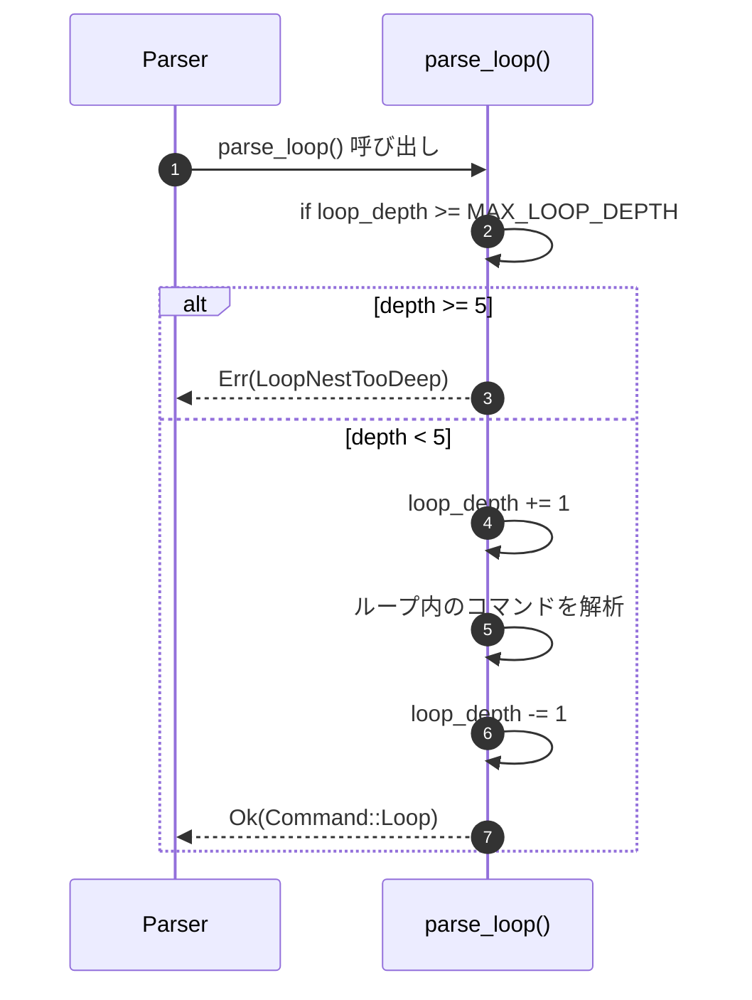
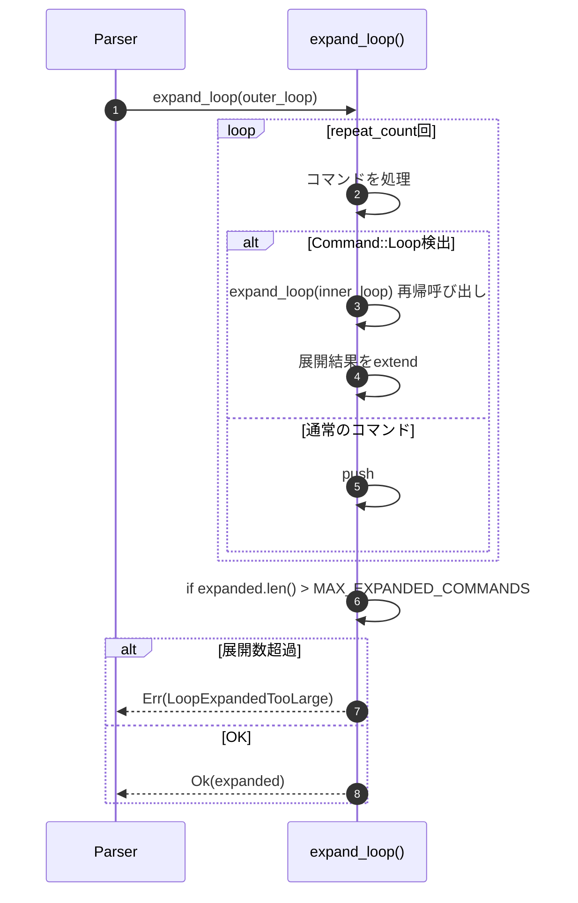

# MMLループネスト対応 バックエンド設計書

## メタ情報

| 項目 | 内容 |
|------|------|
| ドキュメントID | DET-LOOP-003-BE |
| 機能ID | F-029 |
| 機能名 | ループネスト対応 |
| 関連詳細設計書 | [詳細設計書.md](./詳細設計書.md) |
| バージョン | 1.0.0 |
| ステータス | ドラフト |
| 作成日 | 2026-01-12 |
| 最終更新日 | 2026-01-12 |
| 作成者 | detailed-design-writer |

---

## 1. 変更対象モジュール

### 1.1 変更ファイル一覧

| ファイル | 変更種別 | 変更内容 |
|---------|---------|---------|
| `src/mml/parser.rs` | 修正 | `Parser`構造体に`loop_depth`フィールド追加、`parse_loop()`修正、`expand_loop()`修正 |
| `src/mml/error.rs` | 修正 | `LoopNestTooDeep`, `LoopExpandedTooLarge`エラー型追加 |
| `src/mml/ast.rs` | 変更なし | `Command::Loop`バリアントは既存のまま維持 |

---

## 2. データ構造

### 2.1 Parser構造体の拡張

#### 2.1.1 変更前（BASIC-CLI-003）

```rust
pub struct Parser {
    tokens: Vec<TokenWithPos>,
    current: usize,
}
```

#### 2.1.2 変更後（F-029）

```rust
pub struct Parser {
    tokens: Vec<TokenWithPos>,
    current: usize,
    loop_depth: usize,  // 新規追加: 現在のループネスト深度
}

const MAX_LOOP_DEPTH: usize = 5;
const MAX_EXPANDED_COMMANDS: usize = 10_000;
```

**変更点**:
- `loop_depth` フィールドを追加（初期値: 0）
- `MAX_LOOP_DEPTH` 定数を追加（最大ネスト深度: 5）
- `MAX_EXPANDED_COMMANDS` 定数を追加（最大展開コマンド数: 10,000）

### 2.2 Command::Loop（変更なし）

既存の`Command::Loop`バリアントは変更しません。

```rust
#[derive(Debug, Clone, PartialEq)]
pub enum Command {
    // 既存のバリアント
    Note(Note),
    Rest(Rest),
    Octave(Octave),
    OctaveUp,
    OctaveDown,
    Tempo(Tempo),
    DefaultLength(DefaultLength),
    Volume(Volume),
    
    // 既存のLoopバリアント（変更なし）
    Loop {
        commands: Vec<Command>,
        escape_index: Option<usize>,
        repeat_count: usize,
    },
}
```

---

## 3. 関数仕様

### 3.1 Parser::new()の修正

#### 3.1.1 変更前

```rust
#[must_use]
pub fn new(tokens: Vec<TokenWithPos>) -> Self {
    Self { tokens, current: 0 }
}
```

#### 3.1.2 変更後

```rust
#[must_use]
pub fn new(tokens: Vec<TokenWithPos>) -> Self {
    Self { 
        tokens, 
        current: 0,
        loop_depth: 0,  // 初期値: 0
    }
}
```

### 3.2 Parser::parse_loop()の修正

#### 3.2.1 変更前（BASIC-CLI-003）

```rust
fn parse_loop(&mut self) -> Result<Command, ParseError> {
    let start_pos = self.peek().position;
    self.advance(); // Consume '['
    
    let mut commands = Vec::new();
    let mut escape_index = None;
    let mut escape_count = 0;
    
    while !self.check(Token::LoopEnd) {
        if self.is_at_end() {
            return Err(ParseError::UnmatchedLoopStart {
                position: start_pos,
            });
        }
        
        if self.check(Token::LoopEscape) {
            escape_count += 1;
            if escape_count > 1 {
                return Err(ParseError::MultipleEscapePoints {
                    position: self.peek().position,
                });
            }
            self.advance();
            escape_index = Some(commands.len());
            continue;
        }
        
        // ネストしたループの検出（エラー）
        if self.check(Token::LoopStart) {
            return Err(ParseError::NestedLoop {
                position: self.peek().position,
            });
        }
        
        let command = self.parse_command()?;
        commands.push(command);
    }
    
    self.advance(); // Consume ']'
    
    // ループ回数の解析
    let repeat_count = if self.check_number() {
        let token_with_pos = self.advance();
        if let Token::Number(n) = token_with_pos.token {
            if n == 0 || n > 99 {
                return Err(ParseError::InvalidLoopCount {
                    value: n,
                    range: (1, 99),
                    position: token_with_pos.position,
                });
            }
            n as usize
        } else {
            unreachable!()
        }
    } else {
        1
    };
    
    Ok(Command::Loop {
        commands,
        escape_index,
        repeat_count,
    })
}
```

#### 3.2.2 変更後（F-029）

```rust
fn parse_loop(&mut self) -> Result<Command, ParseError> {
    // ネスト深度チェック（新規追加）
    if self.loop_depth >= MAX_LOOP_DEPTH {
        return Err(ParseError::LoopNestTooDeep {
            max_depth: MAX_LOOP_DEPTH,
            position: self.peek().position,
        });
    }
    
    let start_pos = self.peek().position;
    self.advance(); // Consume '['
    self.loop_depth += 1;  // ネスト深度を増やす
    
    let mut commands = Vec::new();
    let mut escape_index = None;
    let mut escape_count = 0;
    
    while !self.check(Token::LoopEnd) {
        if self.is_at_end() {
            return Err(ParseError::UnmatchedLoopStart {
                position: start_pos,
            });
        }
        
        if self.check(Token::LoopEscape) {
            escape_count += 1;
            if escape_count > 1 {
                return Err(ParseError::MultipleEscapePoints {
                    position: self.peek().position,
                });
            }
            self.advance();
            escape_index = Some(commands.len());
            continue;
        }
        
        // ネストしたループの検出（削除）
        // if self.check(Token::LoopStart) {
        //     return Err(ParseError::NestedLoop {
        //         position: self.peek().position,
        //     });
        // }
        
        // 再帰的にコマンドを解析（ネストしたループも含む）
        let command = self.parse_command()?;
        commands.push(command);
    }
    
    self.advance(); // Consume ']'
    self.loop_depth -= 1;  // ネスト深度を戻す
    
    // ループ回数の解析（既存のまま）
    let repeat_count = if self.check_number() {
        let token_with_pos = self.advance();
        if let Token::Number(n) = token_with_pos.token {
            if n == 0 || n > 99 {
                return Err(ParseError::InvalidLoopCount {
                    value: n,
                    range: (1, 99),
                    position: token_with_pos.position,
                });
            }
            n as usize
        } else {
            unreachable!()
        }
    } else {
        1
    };
    
    Ok(Command::Loop {
        commands,
        escape_index,
        repeat_count,
    })
}
```

**変更点**:
1. **ネスト深度チェック追加**: `if self.loop_depth >= MAX_LOOP_DEPTH` でチェック
2. **ネスト深度カウント**: `self.loop_depth += 1` と `self.loop_depth -= 1` を追加
3. **ネストループエラー削除**: `if self.check(Token::LoopStart)` のエラーチェックを削除

### 3.3 expand_loop()の修正

#### 3.3.1 変更前（BASIC-CLI-003）

```rust
#[must_use]
pub fn expand_loop(
    commands: &[Command],
    escape_index: Option<usize>,
    repeat_count: usize,
) -> Vec<Command> {
    let mut expanded = Vec::with_capacity(commands.len() * repeat_count);

    for i in 0..repeat_count {
        let is_last_iteration = i == repeat_count - 1;

        let end_index = if let (true, Some(idx)) = (is_last_iteration, escape_index) {
            idx
        } else {
            commands.len()
        };

        for cmd in &commands[..end_index] {
            expanded.push(cmd.clone());
        }
    }

    expanded
}
```

#### 3.3.2 変更後（F-029）

```rust
/// ループコマンドを展開してフラットなコマンド列に変換（再帰対応）
///
/// # 引数
/// - `commands`: ループ内のコマンド列
/// - `escape_index`: 脱出ポイントのインデックス（Noneの場合は脱出なし）
/// - `repeat_count`: 繰り返し回数
///
/// # 戻り値
/// - `Ok(Vec<Command>)`: 展開されたコマンド列
/// - `Err(ParseError)`: 展開数超過
///
/// # エラー
/// - `LoopExpandedTooLarge`: 展開後のコマンド数が10,000を超えた場合
pub fn expand_loop(
    commands: &[Command],
    escape_index: Option<usize>,
    repeat_count: usize,
) -> Result<Vec<Command>, ParseError> {
    let mut expanded = Vec::with_capacity(commands.len() * repeat_count);

    for i in 0..repeat_count {
        let is_last_iteration = i == repeat_count - 1;

        let end_index = if let (true, Some(idx)) = (is_last_iteration, escape_index) {
            idx
        } else {
            commands.len()
        };

        for cmd in &commands[..end_index] {
            // ネストしたループも再帰的に展開（新規追加）
            if let Command::Loop { 
                commands: inner_cmds, 
                escape_index: inner_escape, 
                repeat_count: inner_count 
            } = cmd {
                let inner_expanded = expand_loop(inner_cmds, *inner_escape, *inner_count)?;
                expanded.extend(inner_expanded);
            } else {
                expanded.push(cmd.clone());
            }
        }
    }

    // 総展開数チェック（新規追加）
    if expanded.len() > MAX_EXPANDED_COMMANDS {
        return Err(ParseError::LoopExpandedTooLarge {
            max_commands: MAX_EXPANDED_COMMANDS,
            actual: expanded.len(),
        });
    }

    Ok(expanded)
}
```

**変更点**:
1. **戻り値の変更**: `Vec<Command>` → `Result<Vec<Command>, ParseError>`
2. **再帰的展開**: `if let Command::Loop` でネストしたループを検出し、再帰呼び出し
3. **総展開数チェック**: `if expanded.len() > MAX_EXPANDED_COMMANDS` でチェック

### 3.4 Parser::parse()の修正

#### 3.4.1 変更前

```rust
pub fn parse(&mut self) -> Result<Mml, ParseError> {
    let mut commands = Vec::new();

    while !self.is_at_end() {
        let command = self.parse_command()?;

        if let Command::Loop {
            commands: loop_commands,
            escape_index,
            repeat_count,
        } = command
        {
            let expanded = expand_loop(&loop_commands, escape_index, repeat_count);
            commands.extend(expanded);
        } else {
            commands.push(command);
        }
    }

    Ok(Mml { commands })
}
```

#### 3.4.2 変更後

```rust
pub fn parse(&mut self) -> Result<Mml, ParseError> {
    let mut commands = Vec::new();

    while !self.is_at_end() {
        let command = self.parse_command()?;

        if let Command::Loop {
            commands: loop_commands,
            escape_index,
            repeat_count,
        } = command
        {
            // expand_loop()がResult型を返すようになったため、?演算子を使用
            let expanded = expand_loop(&loop_commands, escape_index, repeat_count)?;
            commands.extend(expanded);
        } else {
            commands.push(command);
        }
    }

    Ok(Mml { commands })
}
```

**変更点**:
- `expand_loop()`の呼び出しに`?`演算子を追加（エラーハンドリング）

---

## 4. エラー型の追加

### 4.1 ParseError列挙型の拡張

#### 4.1.1 変更前（BASIC-CLI-003）

```rust
#[derive(Debug, Clone, PartialEq)]
pub enum ParseError {
    UnexpectedToken {
        expected: String,
        found: Token,
        position: usize,
    },
    InvalidNumber {
        value: u16,
        range: (u16, u16),
        position: usize,
    },
    UnexpectedCharacter {
        character: char,
        position: usize,
    },
    UnexpectedEof {
        expected: String,
        position: usize,
    },
    EmptyInput,
    UnmatchedLoopStart {
        position: usize,
    },
    UnmatchedLoopEnd {
        position: usize,
    },
    InvalidLoopCount {
        value: u16,
        range: (u16, u16),
        position: usize,
    },
    NestedLoop {
        position: usize,
    },
    LoopEscapeOutsideLoop {
        position: usize,
    },
    MultipleEscapePoints {
        position: usize,
    },
}
```

#### 4.1.2 変更後（F-029）

```rust
#[derive(Debug, Clone, PartialEq)]
pub enum ParseError {
    UnexpectedToken {
        expected: String,
        found: Token,
        position: usize,
    },
    InvalidNumber {
        value: u16,
        range: (u16, u16),
        position: usize,
    },
    UnexpectedCharacter {
        character: char,
        position: usize,
    },
    UnexpectedEof {
        expected: String,
        position: usize,
    },
    EmptyInput,
    UnmatchedLoopStart {
        position: usize,
    },
    UnmatchedLoopEnd {
        position: usize,
    },
    InvalidLoopCount {
        value: u16,
        range: (u16, u16),
        position: usize,
    },
    // NestedLoop {  // 削除
    //     position: usize,
    // },
    LoopEscapeOutsideLoop {
        position: usize,
    },
    MultipleEscapePoints {
        position: usize,
    },
    
    // 新規追加
    /// ループのネストが深すぎる（最大5階層）
    LoopNestTooDeep {
        max_depth: usize,
        position: usize,
    },
    
    /// ループ展開後のコマンド数が多すぎる（最大10,000）
    LoopExpandedTooLarge {
        max_commands: usize,
        actual: usize,
    },
}
```

**変更点**:
1. **削除**: `NestedLoop` エラー型を削除（ネスト対応のため不要）
2. **追加**: `LoopNestTooDeep` エラー型を追加
3. **追加**: `LoopExpandedTooLarge` エラー型を追加

### 4.2 エラーメッセージの実装

#### 4.2.1 Display実装の追加

```rust
impl std::fmt::Display for ParseError {
    fn fmt(&self, f: &mut std::fmt::Formatter<'_>) -> std::fmt::Result {
        match self {
            // 既存のエラーメッセージ
            // ...
            
            // NestedLoopのメッセージを削除
            // Self::NestedLoop { position } => {
            //     write!(
            //         f,
            //         "Nested loops are not supported at position {position}\n\
            //          Hint: Flatten your loops or use multiple separate loops"
            //     )
            // }
            
            // 新規追加
            Self::LoopNestTooDeep { max_depth, position } => {
                write!(
                    f,
                    "ループのネストが深すぎます（最大{max_depth}階層）: 位置 {position}\n\
                     Hint: ループのネストを{max_depth}階層以内に抑えてください。\n\
                     Example:\n\
                       Bad:  [ [ [ [ [ [ C ]2 ]2 ]2 ]2 ]2 ]2  (6階層)\n\
                       Good: [ [ [ [ [ C ]2 ]2 ]2 ]2 ]2      (5階層)"
                )
            }
            Self::LoopExpandedTooLarge { max_commands, actual } => {
                write!(
                    f,
                    "ループ展開後のコマンド数が多すぎます（最大{max_commands}、実際: {actual}）\n\
                     Hint: ループ回数を減らすか、ループ内のコマンド数を減らしてください。\n\
                     Example:\n\
                       Bad:  [ [ [ C ]99 ]99 ]99  (970,299コマンド)\n\
                       Good: [ [ [ C ]10 ]10 ]10  (1,000コマンド)"
                )
            }
        }
    }
}
```

---

## 5. 処理フロー

### 5.1 ネスト深度チェックフロー



### 5.2 再帰的展開フロー



---

## 6. コード例

### 6.1 ネスト深度チェックの実装例

```rust
// src/mml/parser.rs

const MAX_LOOP_DEPTH: usize = 5;

impl Parser {
    fn parse_loop(&mut self) -> Result<Command, ParseError> {
        // ネスト深度チェック
        if self.loop_depth >= MAX_LOOP_DEPTH {
            return Err(ParseError::LoopNestTooDeep {
                max_depth: MAX_LOOP_DEPTH,
                position: self.peek().position,
            });
        }
        
        self.advance(); // Consume '['
        self.loop_depth += 1;
        
        // ... ループ内のコマンドを解析 ...
        
        self.advance(); // Consume ']'
        self.loop_depth -= 1;
        
        Ok(Command::Loop {
            commands,
            escape_index,
            repeat_count,
        })
    }
}
```

### 6.2 再帰的展開の実装例

```rust
// src/mml/parser.rs

const MAX_EXPANDED_COMMANDS: usize = 10_000;

pub fn expand_loop(
    commands: &[Command],
    escape_index: Option<usize>,
    repeat_count: usize,
) -> Result<Vec<Command>, ParseError> {
    let mut expanded = Vec::new();
    
    for i in 0..repeat_count {
        let is_last = i == repeat_count - 1;
        let end_index = if is_last && escape_index.is_some() {
            escape_index.unwrap()
        } else {
            commands.len()
        };
        
        for cmd in &commands[..end_index] {
            // ネストしたループも再帰的に展開
            if let Command::Loop { 
                commands: inner_cmds, 
                escape_index: inner_escape, 
                repeat_count: inner_count 
            } = cmd {
                let inner_expanded = expand_loop(inner_cmds, *inner_escape, *inner_count)?;
                expanded.extend(inner_expanded);
            } else {
                expanded.push(cmd.clone());
            }
        }
    }
    
    // 総展開数チェック
    if expanded.len() > MAX_EXPANDED_COMMANDS {
        return Err(ParseError::LoopExpandedTooLarge {
            max_commands: MAX_EXPANDED_COMMANDS,
            actual: expanded.len(),
        });
    }
    
    Ok(expanded)
}
```

### 6.3 エラー型の実装例

```rust
// src/mml/error.rs

#[derive(Debug, Clone, PartialEq)]
pub enum ParseError {
    // 既存のエラー
    // ...
    
    // 新規追加
    LoopNestTooDeep {
        max_depth: usize,
        position: usize,
    },
    
    LoopExpandedTooLarge {
        max_commands: usize,
        actual: usize,
    },
}

impl std::fmt::Display for ParseError {
    fn fmt(&self, f: &mut std::fmt::Formatter<'_>) -> std::fmt::Result {
        match self {
            // 既存のエラーメッセージ
            // ...
            
            Self::LoopNestTooDeep { max_depth, position } => {
                write!(
                    f,
                    "ループのネストが深すぎます（最大{max_depth}階層）: 位置 {position}"
                )
            }
            Self::LoopExpandedTooLarge { max_commands, actual } => {
                write!(
                    f,
                    "ループ展開後のコマンド数が多すぎます（最大{max_commands}、実際: {actual}）"
                )
            }
        }
    }
}
```

---

## 7. テスト実装例

### 7.1 ユニットテスト

```rust
// tests/unit/mml_parser_loop_nest_test.rs

use sine_mml::mml::{parse, Command, Pitch, Note};

#[test]
fn test_loop_nest_2_levels() {
    let input = "[ CDE [ FGAB ]2 ]3";
    let mml = parse(input).unwrap();
    
    // 展開後は33個のコマンド（CDE FGABFGAB × 3回）
    assert_eq!(mml.commands.len(), 33);
    
    // 最初の3つがCDE
    assert!(matches!(mml.commands[0], Command::Note(Note { pitch: Pitch::C, .. })));
    assert!(matches!(mml.commands[1], Command::Note(Note { pitch: Pitch::D, .. })));
    assert!(matches!(mml.commands[2], Command::Note(Note { pitch: Pitch::E, .. })));
    
    // 次の8つがFGABFGAB
    assert!(matches!(mml.commands[3], Command::Note(Note { pitch: Pitch::F, .. })));
    assert!(matches!(mml.commands[4], Command::Note(Note { pitch: Pitch::G, .. })));
    assert!(matches!(mml.commands[5], Command::Note(Note { pitch: Pitch::A, .. })));
    assert!(matches!(mml.commands[6], Command::Note(Note { pitch: Pitch::B, .. })));
    assert!(matches!(mml.commands[7], Command::Note(Note { pitch: Pitch::F, .. })));
    assert!(matches!(mml.commands[8], Command::Note(Note { pitch: Pitch::G, .. })));
    assert!(matches!(mml.commands[9], Command::Note(Note { pitch: Pitch::A, .. })));
    assert!(matches!(mml.commands[10], Command::Note(Note { pitch: Pitch::B, .. })));
}

#[test]
fn test_loop_nest_too_deep() {
    let input = "[ [ [ [ [ [ C ]2 ]2 ]2 ]2 ]2 ]2";
    let result = parse(input);
    
    assert!(result.is_err());
    let err = result.unwrap_err();
    assert!(matches!(err, ParseError::LoopNestTooDeep { max_depth: 5, .. }));
}

#[test]
fn test_loop_expanded_too_large() {
    let input = "[ [ [ C ]99 ]99 ]99";
    let result = parse(input);
    
    assert!(result.is_err());
    let err = result.unwrap_err();
    assert!(matches!(err, ParseError::LoopExpandedTooLarge { max_commands: 10_000, .. }));
}

#[test]
fn test_loop_nest_with_escape_point() {
    let input = "[ [ CD:EF ]2 GAB ]2";
    let mml = parse(input).unwrap();
    
    // 展開後は14個のコマンド（CDEFCD GAB × 2回）
    assert_eq!(mml.commands.len(), 14);
}
```

---

## 8. 性能要件

### 8.1 時間計算量

| 処理 | 時間計算量 | 説明 |
|------|-----------|------|
| `parse_loop()` | O(n) | nはループ内のコマンド数 |
| `expand_loop()` | O(n × m) | nはループ内のコマンド数、mは繰り返し回数 |

### 8.2 空間計算量

| 処理 | 空間計算量 | 説明 |
|------|-----------|------|
| `parse_loop()` | O(d) | dはネスト深度（最大5） |
| `expand_loop()` | O(n × m) | 展開後のコマンド数（最大10,000） |

---

## 9. セキュリティ考慮事項

### 9.1 DoS攻撃対策

| 対策 | 実装 |
|------|------|
| ネスト深度制限 | `MAX_LOOP_DEPTH = 5` |
| 総展開数制限 | `MAX_EXPANDED_COMMANDS = 10_000` |
| スタックオーバーフロー防止 | 再帰深度を5に制限 |

### 9.2 リソース消費制限

| リソース | 上限 | 理由 |
|---------|------|------|
| メモリ | 展開後のコマンド数 × コマンドサイズ | 最大10,000コマンド |
| CPU | O(n × m) | 展開処理の時間計算量 |

---

## 変更履歴

| 日付 | バージョン | 変更内容 | 担当者 |
|:---|:---|:---|:---|
| 2026-01-12 | 1.0.0 | 初版作成 | detailed-design-writer |
