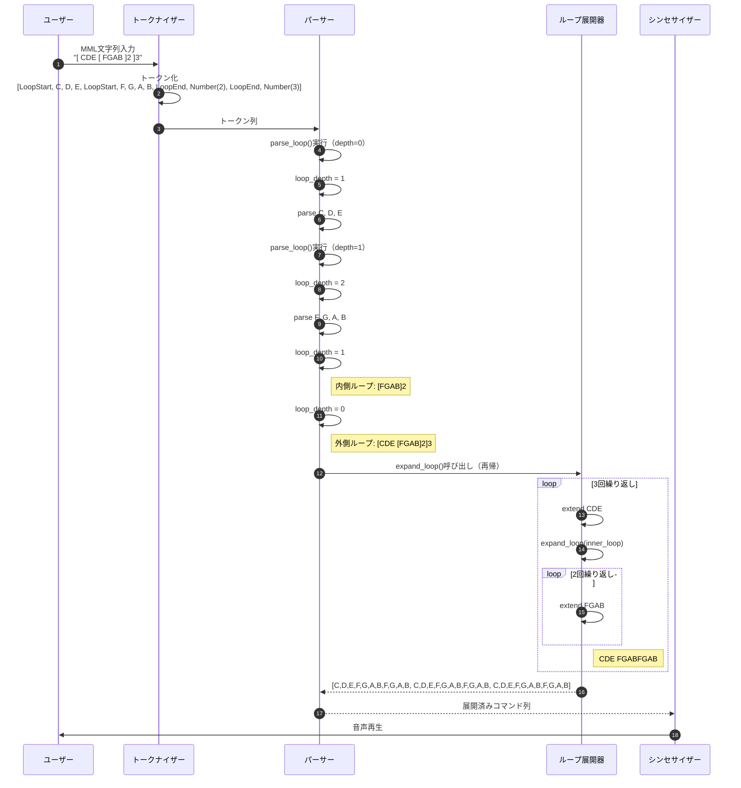
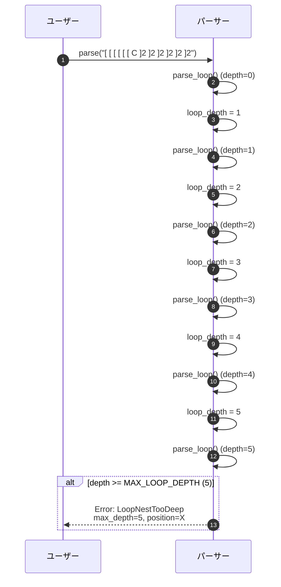
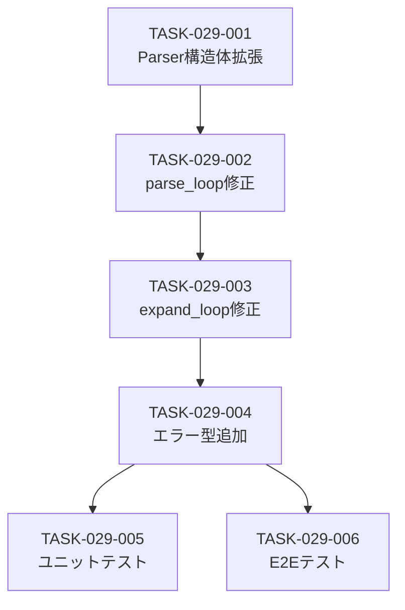

# MMLループネスト対応 詳細設計書

## メタ情報

| 項目 | 内容 |
|------|------|
| ドキュメントID | DET-LOOP-003 |
| 機能ID | F-029 |
| 機能名 | ループネスト対応 |
| 関連基本設計書 | [BASIC-CLI-004](../../basic/BASIC-CLI-004_MML-Advanced-Features.md) |
| 関連要件定義書 | REQ-CLI-004 |
| バージョン | 1.0.0 |
| ステータス | ドラフト |
| 作成日 | 2026-01-12 |
| 最終更新日 | 2026-01-12 |
| 作成者 | detailed-design-writer |

---

## 1. 概要

### 1.1 機能概要

MMLループネスト対応機能は、既存のループ構文（BASIC-CLI-003で実装済み）を拡張し、ループの入れ子（ネスト）を最大5階層まで許可する機能です。これにより、複雑な繰り返しパターンを簡潔に記述できるようになります。

**主な機能**:
- 2階層ネスト: `[ CDE [ FGAB ]2 ]3` → `CDE FGABFGAB CDE FGABFGAB CDE FGABFGAB`
- 3階層ネスト: `[ [ [ C ]2 D ]2 E ]2` → `CC D CC D E CC D CC D E`
- 最大5階層まで対応（6階層以上はエラー）
- ネスト内でも脱出ポイント（`:`）使用可能
- 総展開コマンド数の上限チェック（10,000コマンド）

### 1.2 BASIC-CLI-003からの変更点

| 項目 | BASIC-CLI-003（既存） | F-029（本機能） |
|------|---------------------|----------------|
| ネスト対応 | ❌ 非対応（`NestedLoop`エラー） | ✅ 最大5階層まで対応 |
| `expand_loop()` | 非再帰（フラット展開のみ） | 再帰的展開 |
| エラー型 | `NestedLoop` | `LoopNestTooDeep`, `LoopExpandedTooLarge` |
| `Parser` 構造体 | `loop_depth` フィールドなし | `loop_depth: usize` フィールド追加 |

### 1.3 処理フロー概要



---

## 2. 機能要件

### 2.1 対象機能

| 機能ID | 機能名 | 概要 | 優先度 |
|--------|--------|------|--------|
| F-029 | ループネスト対応 | ループ構文のネスト（最大5階層） | 必須 |

### 2.2 ビジネスルール

| ルールID | 内容 | 検証方法 |
|---------|------|---------|
| BR-079 | ループのネストは最大5階層まで | パーサーでネスト深度カウント |
| BR-080 | 6階層以上のネストはエラー | `LoopNestTooDeep`エラーを返す |
| BR-081 | ネストしたループ内でも脱出ポイント（`:`）が使用可能 | 各階層で独立して脱出ポイントを処理 |
| BR-082 | ループ回数は各階層で1-99の範囲内 | 既存の`InvalidLoopCount`エラーで検証 |
| BR-083 | ネストしたループの総展開数は10,000コマンド以下 | `expand_loop()`で総コマンド数をチェック |

---

## 3. 詳細仕様

### 3.1 ループネスト構文例

#### 3.1.1 2階層ネスト

**入力**:
```mml
[ CDE [ FGAB ]2 ]3
```

**展開結果**:
```
CDE FGABFGAB CDE FGABFGAB CDE FGABFGAB
```

**説明**:
1. 内側のループ `[FGAB]2` が先に展開される → `FGABFGAB`
2. 外側のループ `[CDE FGABFGAB]3` が展開される → 上記の結果

#### 3.1.2 3階層ネスト

**入力**:
```mml
[ [ [ C ]2 D ]2 E ]2
```

**展開結果**:
```
CC D CC D E CC D CC D E
```

**説明**:
1. 最内層 `[C]2` → `CC`
2. 中間層 `[CC D]2` → `CC D CC D`
3. 最外層 `[CC D CC D E]2` → `CC D CC D E CC D CC D E`

#### 3.1.3 脱出ポイント付きネスト

**入力**:
```mml
[ [ CD:EF ]2 GAB ]2
```

**展開結果**:
```
CDEFCD GAB CDEFCD GAB
```

**説明**:
1. 内側のループ `[CD:EF]2` → 1回目: `CDEF`, 2回目: `CD`（脱出）
2. 外側のループ `[CDEFCD GAB]2` → 2回繰り返し

### 3.2 ネスト深度チェック

#### 3.2.1 深度カウント方式

```rust
pub struct Parser {
    tokens: Vec<TokenWithPos>,
    current: usize,
    loop_depth: usize,  // 現在のループネスト深度
}

const MAX_LOOP_DEPTH: usize = 5;
```

#### 3.2.2 深度チェックフロー



### 3.3 ループ展開処理

#### 3.3.1 再帰的展開アルゴリズム

```rust
pub fn expand_loop(
    commands: &[Command],
    escape_index: Option<usize>,
    repeat_count: usize,
) -> Result<Vec<Command>, ParseError> {
    let mut expanded = Vec::with_capacity(commands.len() * repeat_count);
    
    for i in 0..repeat_count {
        let is_last_iteration = i == repeat_count - 1;
        
        let end_index = if let (true, Some(idx)) = (is_last_iteration, escape_index) {
            idx
        } else {
            commands.len()
        };
        
        for cmd in &commands[..end_index] {
            // ネストしたループも再帰的に展開
            if let Command::Loop { 
                commands: inner_cmds, 
                escape_index: inner_escape, 
                repeat_count: inner_count 
            } = cmd {
                let inner_expanded = expand_loop(inner_cmds, *inner_escape, *inner_count)?;
                expanded.extend(inner_expanded);
            } else {
                expanded.push(cmd.clone());
            }
        }
    }
    
    // 総展開数チェック
    if expanded.len() > MAX_EXPANDED_COMMANDS {
        return Err(ParseError::LoopExpandedTooLarge {
            max_commands: MAX_EXPANDED_COMMANDS,
            actual: expanded.len(),
        });
    }
    
    Ok(expanded)
}
```

#### 3.3.2 展開例（2階層ネスト）

**入力**: `[ CDE [ FGAB ]2 ]3`

**展開ステップ**:

1. **外側ループ開始** (`repeat_count=3`)
   - 1回目:
     - `C`, `D`, `E` を追加
     - 内側ループ `[FGAB]2` を検出 → 再帰呼び出し
       - `F`, `G`, `A`, `B` を2回追加 → `FGABFGAB`
   - 2回目: 同様に `CDE FGABFGAB`
   - 3回目: 同様に `CDE FGABFGAB`

2. **最終結果**: `CDE FGABFGAB CDE FGABFGAB CDE FGABFGAB`

---

## 4. エラーハンドリング

### 4.1 エラーケース一覧

| エラーケース | エラー型 | 検出タイミング | メッセージ例 |
|-------------|---------|--------------|-------------|
| ループネストが6階層以上 | `LoopNestTooDeep` | `parse_loop()`でネスト深度チェック時 | `ループのネストが深すぎます（最大5階層）: 位置 12` |
| ループ展開後のコマンド数が10,000超 | `LoopExpandedTooLarge` | `expand_loop()`で総コマンド数チェック時 | `ループ展開後のコマンド数が多すぎます（最大10000、実際: 970299）` |

### 4.2 エラーメッセージ設計

#### 4.2.1 LoopNestTooDeep

```rust
#[error("ループのネストが深すぎます（最大{max_depth}階層）: 位置 {position}")]
LoopNestTooDeep {
    max_depth: usize,
    position: usize,
}
```

**メッセージ例**:
```
Error: ループのネストが深すぎます（最大5階層）: 位置 12

Hint: ループのネストを5階層以内に抑えてください。
Example:
  Bad:  [ [ [ [ [ [ C ]2 ]2 ]2 ]2 ]2 ]2  (6階層)
  Good: [ [ [ [ [ C ]2 ]2 ]2 ]2 ]2      (5階層)
```

#### 4.2.2 LoopExpandedTooLarge

```rust
#[error("ループ展開後のコマンド数が多すぎます（最大{max_commands}、実際: {actual}）")]
LoopExpandedTooLarge {
    max_commands: usize,
    actual: usize,
}
```

**メッセージ例**:
```
Error: ループ展開後のコマンド数が多すぎます（最大10000、実際: 970299）

Hint: ループ回数を減らすか、ループ内のコマンド数を減らしてください。
Example:
  Bad:  [ [ [ C ]99 ]99 ]99  (970,299コマンド)
  Good: [ [ [ C ]10 ]10 ]10  (1,000コマンド)
```

---

## 5. テストケース

### 5.1 正常系テストケース

| テストID | 入力 | 期待される展開結果 | 説明 |
|---------|------|------------------|------|
| TC-029-001 | `[ CDE [ FGAB ]2 ]3` | `CDE FGABFGAB` × 3回 | 2階層ネスト |
| TC-029-002 | `[ [ [ C ]2 D ]2 E ]2` | `CC D CC D E CC D CC D E` | 3階層ネスト |
| TC-029-003 | `[ [ [ [ C ]2 D ]2 E ]2 F ]2` | `CC D CC D E CC D CC D E F` × 2回 | 4階層ネスト |
| TC-029-004 | `[ [ [ [ [ C ]2 D ]2 E ]2 F ]2 G ]2` | `CC D CC D E CC D CC D E F CC D CC D E CC D CC D E F G` × 2回 | 5階層ネスト（最大） |
| TC-029-005 | `[ [ CD:EF ]2 GAB ]2` | `CDEFCD GAB CDEFCD GAB` | ネスト内の脱出ポイント |

### 5.2 異常系テストケース

| テストID | 入力 | 期待されるエラー | エラーメッセージ |
|---------|------|----------------|----------------|
| TC-029-101 | `[ [ [ [ [ [ C ]2 ]2 ]2 ]2 ]2 ]2` | `LoopNestTooDeep` | `ループのネストが深すぎます（最大5階層）: 位置 X` |
| TC-029-102 | `[ [ [ C ]99 ]99 ]99` | `LoopExpandedTooLarge` | `ループ展開後のコマンド数が多すぎます（最大10000、実際: 970299）` |

### 5.3 エッジケーステストケース

| テストID | 入力 | 期待される展開結果 | 説明 |
|---------|------|------------------|------|
| TC-029-201 | `[ [ [ [ [ C ]2 ]2 ]2 ]2 ]2` | `C` × 32回 | 5階層ネスト（上限値） |
| TC-029-202 | `[ [ C ]1 ]1` | `C` | 最小ネスト（各階層1回） |
| TC-029-203 | `[ [ [ C ]2 D ]2 E ]1` | `CC D CC D E` | 最外層が1回 |

### 5.4 統合テストケース

| テストID | 入力 | 期待される動作 | 説明 |
|---------|------|--------------|------|
| TC-029-301 | `T120 L4 [ CDE [ FGAB ]2 ]3` | 正常に音声再生 | テンポ・音長指定付き |
| TC-029-302 | `O5 [ [ C D ]2 E ]2 O4` | 正常に音声再生 | オクターブ変更を含む |
| TC-029-303 | `V10 [ [ C ]2 ]2 V5` | 正常に音声再生 | 音量変更を含む |

---

## 6. 非機能要件

### 6.1 性能要件

| ID | 要件 | 目標値 | 測定方法 |
|----|------|--------|---------|
| NFR-P-014 | ループネスト展開速度 | 50ms以内（5階層、1000コマンド） | ベンチマークテスト |
| NFR-P-015 | ループ解析の時間計算量 | O(n)（nはループ内のコマンド数） | 理論的解析 |
| NFR-P-016 | メモリ使用量 | ループ展開後のコマンド数に比例 | メモリプロファイラ |

### 6.2 可用性要件

| ID | 要件 | 詳細 |
|----|------|------|
| NFR-A-009 | エラーハンドリング | 不正なネストでクラッシュしない |
| NFR-A-010 | 後方互換性 | 既存のループ構文（BASIC-CLI-003）が正常に動作 |
| NFR-A-011 | エラーメッセージの明確性 | 位置情報とヒントを含む |

### 6.3 セキュリティ要件

| ID | 要件 | 詳細 |
|----|------|------|
| NFR-S-012 | ネスト深度の制限 | 最大5階層に制限（DoS攻撃防止） |
| NFR-S-013 | 総展開数の制限 | 10,000コマンド以下（DoS攻撃防止） |
| NFR-S-014 | スタックオーバーフロー防止 | 再帰深度を制限 |

### 6.4 保守性要件

| ID | 要件 | 詳細 |
|----|------|------|
| NFR-M-014 | テストカバレッジ | ループネスト関連コードは100%カバー |
| NFR-M-015 | コードの可読性 | 関数は50行以内、コメント充実 |
| NFR-M-016 | エラーメッセージの一貫性 | 全てのエラーに位置情報とヒント |

---

## 7. 実装タスク分割

### 7.1 タスク一覧

| タスクID | タスク名 | 対象ファイル | 見積もり行数 | 優先度 |
|---------|---------|------------|------------|--------|
| TASK-029-001 | Parser構造体拡張 | `src/mml/parser.rs` | 10行 | 高 |
| TASK-029-002 | parse_loop()修正 | `src/mml/parser.rs` | 50行 | 高 |
| TASK-029-003 | expand_loop()修正 | `src/mml/parser.rs` | 60行 | 高 |
| TASK-029-004 | エラー型追加 | `src/mml/error.rs` | 40行 | 高 |
| TASK-029-005 | ユニットテスト実装 | `tests/unit/mml_parser_loop_nest_test.rs` | 150行 | 高 |
| TASK-029-006 | E2Eテスト実装 | `tests/cli_integration.rs` | 40行 | 中 |

**合計見積もり**: 350行（200行以下のルールを満たすため、複数のPRに分割）

### 7.2 実装順序

#### Phase 1: 基礎実装（TASK-029-001〜002）
- Parser構造体拡張、parse_loop()修正
- 見積もり: 60行
- 所要時間: 1日

#### Phase 2: 展開処理実装（TASK-029-003〜004）
- expand_loop()修正、エラー型追加
- 見積もり: 100行
- 所要時間: 1日

#### Phase 3: テスト実装（TASK-029-005〜006）
- ユニットテスト、E2Eテスト
- 見積もり: 190行
- 所要時間: 1日

### 7.3 依存関係



---

## 8. 関連ドキュメント

| ドキュメント | パス | 説明 |
|-------------|------|------|
| 基本設計書 | [BASIC-CLI-004](../../basic/BASIC-CLI-004_MML-Advanced-Features.md) | MML高度な機能拡張の基本設計 |
| 要件定義書 | REQ-CLI-004 | MML高度な機能拡張の要件定義 |
| 既存ループ設計書 | [BASIC-CLI-003](../../basic/BASIC-CLI-003_MML-Syntax-Extension.md) | 既存ループ構文の基本設計 |
| 既存ループ詳細設計書 | [詳細設計書.md](../mml-syntax-extension/詳細設計書.md) | 既存ループ構文の詳細設計 |
| バックエンド設計書 | [バックエンド設計書.md](./バックエンド設計書.md) | 本機能のバックエンド設計 |

---

## 変更履歴

| 日付 | バージョン | 変更内容 | 担当者 |
|:---|:---|:---|:---|
| 2026-01-12 | 1.0.0 | 初版作成 | detailed-design-writer |
