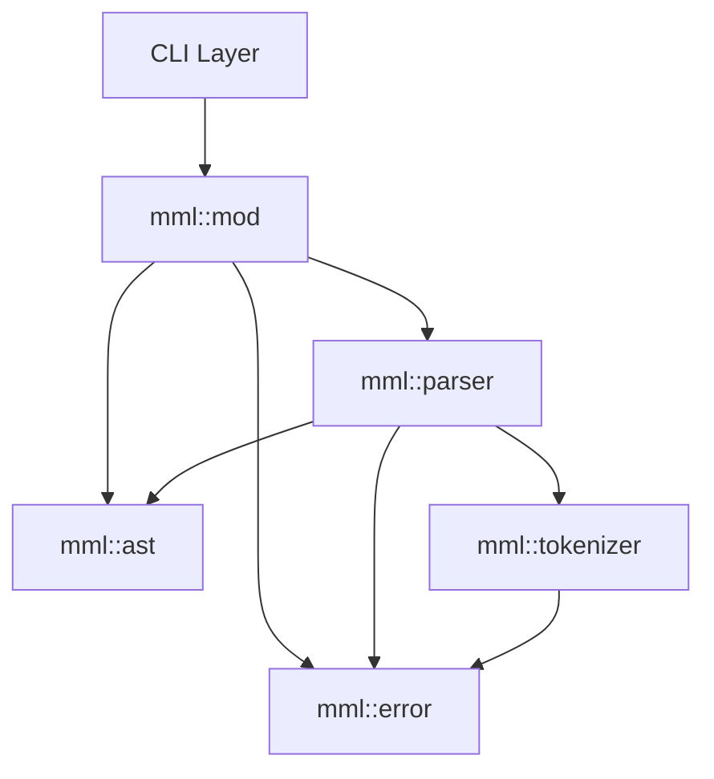
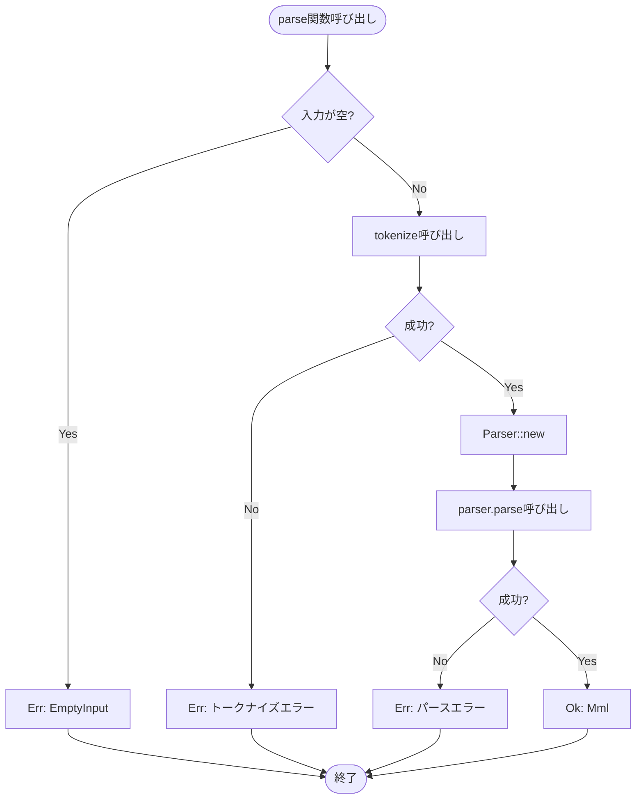
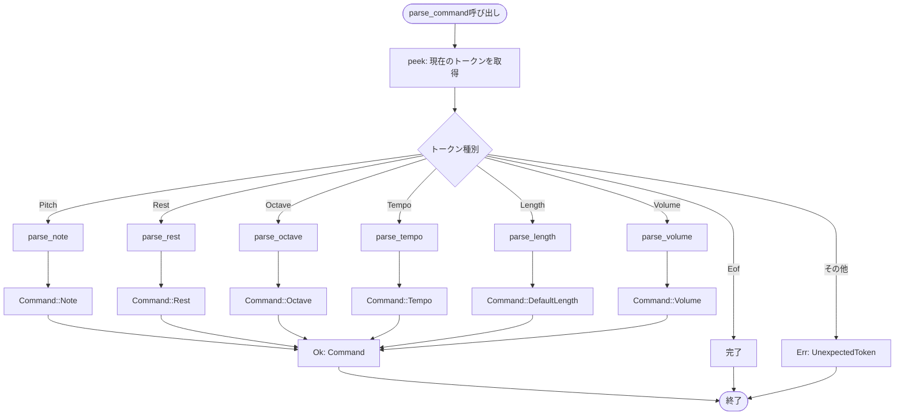
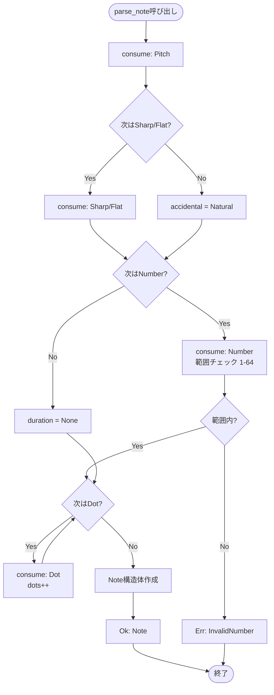
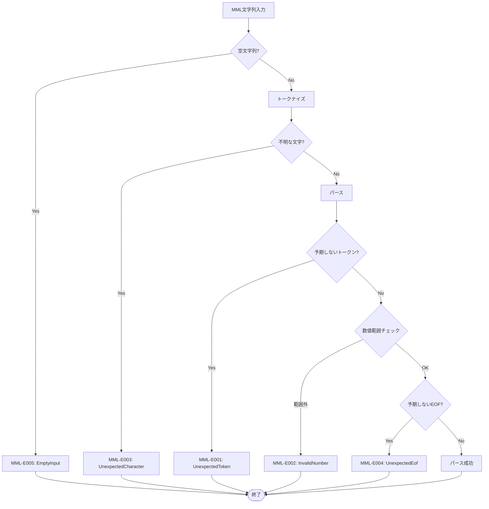

# MMLパーサー バックエンド設計書

## ドキュメント情報

| 項目 | 内容 |
|------|------|
| ドキュメントID | DET-MML-001-BE |
| バージョン | 1.0.0 |
| ステータス | レビュー待ち |
| 作成日 | 2026-01-10 |
| 最終更新日 | 2026-01-10 |
| 関連詳細設計書 | DET-MML-001 |

## 1. モジュール構成

### 1.1 ファイル構成

- `src/mml/`
  - `mod.rs` - モジュール公開API定義
  - `ast.rs` - AST構造体定義
  - `parser.rs` - パーサー実装
  - `tokenizer.rs` - トークナイザー実装
  - `error.rs` - エラー型定義

### 1.2 モジュール依存関係



## 2. 公開API仕様

### 2.1 parse関数

パーサーの主要エントリポイント。

```rust
/// MML文字列を解析してASTを生成する
///
/// # Arguments
/// * `input` - MML文字列
///
/// # Returns
/// * `Ok(Mml)` - パース成功時、AST構造体
/// * `Err(ParseError)` - パース失敗時、エラー情報
///
/// # Examples
/// ```
/// use sine_mml::mml::parse;
///
/// let mml_string = "O4 C D E F G";
/// match parse(mml_string) {
///     Ok(ast) => println!("パース成功: {:?}", ast),
///     Err(e) => eprintln!("パースエラー: {}", e),
/// }
/// ```
pub fn parse(input: &str) -> Result<Mml, ParseError>
```

**処理フロー**

```mermaid
sequenceDiagram
    autonumber
    participant C as Caller
    participant P as parse()
    participant T as tokenize()
    participant PA as Parser::new()
    participant PAR as Parser::parse()

    C->>P: parse(input)
    P->>P: 入力検証（空文字チェック）
    alt 空文字
        P-->>C: Err(ParseError::EmptyInput)
    end
    P->>T: tokenize(input)
    T-->>P: Ok(Vec<TokenWithPos>)
    P->>PA: Parser::new(tokens)
    PA-->>P: Parser instance
    P->>PAR: parser.parse()
    PAR-->>P: Ok(Mml)
    P-->>C: Ok(Mml)
```

**エラーパターン**

| エラーケース | 返却値 | HTTPステータス相当 |
|-------------|--------|------------------|
| 空の入力 | `Err(ParseError::EmptyInput)` | 400 Bad Request |
| 不明な文字 | `Err(ParseError::UnexpectedCharacter{...})` | 400 Bad Request |
| トークン不正 | `Err(ParseError::UnexpectedToken{...})` | 400 Bad Request |
| 数値範囲外 | `Err(ParseError::InvalidNumber{...})` | 400 Bad Request |
| EOF不正 | `Err(ParseError::UnexpectedEof{...})` | 400 Bad Request |

### 2.2 tokenize関数

MML文字列をトークン列に変換する内部関数（モジュール内のみ公開）。

```rust
/// MML文字列をトークン列に変換する
///
/// # Arguments
/// * `input` - MML文字列
///
/// # Returns
/// * `Ok(Vec<TokenWithPos>)` - トークン列（位置情報付き）
/// * `Err(ParseError)` - トークナイズ失敗時
pub(crate) fn tokenize(input: &str) -> Result<Vec<TokenWithPos>, ParseError>
```

**アルゴリズム概要**

1. 入力文字列を先読み可能なイテレータに変換
2. 文字を1つずつ読み取り、トークンに変換
3. 空白文字・改行は無視（スキップ）
4. 大文字小文字を区別しない（すべて大文字に正規化）
5. 不明な文字が出現した場合は即座にエラー
6. 末尾に `Token::Eof` を追加

### 2.3 Parserトレイト

再帰下降パーサーの内部実装。

```rust
pub(crate) struct Parser {
    tokens: Vec<TokenWithPos>,
    current: usize,
    default_octave: u8,
    default_length: u8,
    default_volume: u8,
}

impl Parser {
    /// パーサーの新規作成
    pub fn new(tokens: Vec<TokenWithPos>) -> Self {
        Self {
            tokens,
            current: 0,
            default_octave: 4,
            default_length: 4,
            default_volume: 8,
        }
    }

    /// ASTを生成
    pub fn parse(&mut self) -> Result<Mml, ParseError> {
        let mut commands = Vec::new();
        
        while !self.is_at_end() {
            commands.push(self.parse_command()?);
        }
        
        Ok(Mml { commands })
    }

    /// 個別コマンドをパース
    fn parse_command(&mut self) -> Result<Command, ParseError> { /* ... */ }
    
    /// 音符をパース
    fn parse_note(&mut self) -> Result<Note, ParseError> { /* ... */ }
    
    /// 休符をパース
    fn parse_rest(&mut self) -> Result<Rest, ParseError> { /* ... */ }
    
    /// オクターブコマンドをパース
    fn parse_octave(&mut self) -> Result<Octave, ParseError> { /* ... */ }
    
    /// テンポコマンドをパース
    fn parse_tempo(&mut self) -> Result<Tempo, ParseError> { /* ... */ }
    
    /// 音長コマンドをパース
    fn parse_length(&mut self) -> Result<DefaultLength, ParseError> { /* ... */ }
    
    /// 音量コマンドをパース
    fn parse_volume(&mut self) -> Result<Volume, ParseError> { /* ... */ }

    // ユーティリティメソッド
    fn peek(&self) -> &Token { /* ... */ }
    fn advance(&mut self) -> &Token { /* ... */ }
    fn consume(&mut self, expected: Token) -> Result<(), ParseError> { /* ... */ }
    fn is_at_end(&self) -> bool { /* ... */ }
    fn current_position(&self) -> usize { /* ... */ }
}
```

## 3. データ型定義

### 3.1 AST型 (ast.rs)

```rust
// 完全なAST構造
#[derive(Debug, Clone, PartialEq)]
pub struct Mml {
    pub commands: Vec<Command>,
}

#[derive(Debug, Clone, PartialEq)]
pub enum Command {
    Note(Note),
    Rest(Rest),
    Octave(Octave),
    Tempo(Tempo),
    DefaultLength(DefaultLength),
    Volume(Volume),
}

#[derive(Debug, Clone, PartialEq)]
pub struct Note {
    pub pitch: Pitch,
    pub accidental: Accidental,
    pub duration: Option<u8>,
    pub dots: u8,
}

#[derive(Debug, Clone, Copy, PartialEq)]
pub enum Pitch {
    C = 0,
    D = 2,
    E = 4,
    F = 5,
    G = 7,
    A = 9,
    B = 11,
}

#[derive(Debug, Clone, Copy, PartialEq)]
pub enum Accidental {
    Natural = 0,
    Sharp = 1,
    Flat = -1,
}

#[derive(Debug, Clone, PartialEq)]
pub struct Rest {
    pub duration: Option<u8>,
    pub dots: u8,
}

#[derive(Debug, Clone, PartialEq)]
pub struct Octave {
    pub value: u8, // 1-8
}

#[derive(Debug, Clone, PartialEq)]
pub struct Tempo {
    pub value: u16, // 30-300
}

#[derive(Debug, Clone, PartialEq)]
pub struct DefaultLength {
    pub value: u8, // 1-64
}

#[derive(Debug, Clone, PartialEq)]
pub struct Volume {
    pub value: u8, // 0-15
}

// ヘルパーメソッド
impl Pitch {
    /// 音高から文字列表現を取得
    pub fn as_str(&self) -> &'static str {
        match self {
            Pitch::C => "C",
            Pitch::D => "D",
            Pitch::E => "E",
            Pitch::F => "F",
            Pitch::G => "G",
            Pitch::A => "A",
            Pitch::B => "B",
        }
    }
    
    /// 文字から音高を取得
    pub fn from_char(c: char) -> Option<Self> {
        match c.to_ascii_uppercase() {
            'C' => Some(Pitch::C),
            'D' => Some(Pitch::D),
            'E' => Some(Pitch::E),
            'F' => Some(Pitch::F),
            'G' => Some(Pitch::G),
            'A' => Some(Pitch::A),
            'B' => Some(Pitch::B),
            _ => None,
        }
    }
}

impl Note {
    /// MIDI音階番号を計算（オクターブ情報が必要）
    /// octave: 1-8, 中央のC (C4) = 60
    /// 計算式: (octave + 1) * 12 + base_note + accidental_offset
    /// これにより C4 = (4+1)*12 + 0 = 60 となる
    pub fn to_midi_note(&self, octave: u8) -> u8 {
        let base_note = self.pitch as i16;
        let accidental_offset = self.accidental as i16;
        let midi_note = (octave as i16 + 1) * 12 + base_note + accidental_offset;
        midi_note as u8
    }
    
    /// 音長を秒数に変換
    /// bpm: テンポ, default_length: デフォルト音長
    pub fn duration_in_seconds(&self, bpm: u16, default_length: u8) -> f32 {
        let length = self.duration.unwrap_or(default_length) as f32;
        let base_duration = 240.0 / (bpm as f32 * length);
        
        // 付点の処理（1つ付点につき1.5倍）
        let dot_multiplier = match self.dots {
            0 => 1.0,
            1 => 1.5,
            2 => 1.75,
            3 => 1.875,
            _ => 1.0 + (1.0 - (0.5_f32).powi(self.dots as i32)),
        };
        
        base_duration * dot_multiplier
    }
}

impl Rest {
    /// 休符の長さを秒数に変換
    pub fn duration_in_seconds(&self, bpm: u16, default_length: u8) -> f32 {
        let length = self.duration.unwrap_or(default_length) as f32;
        let base_duration = 240.0 / (bpm as f32 * length);
        
        let dot_multiplier = match self.dots {
            0 => 1.0,
            1 => 1.5,
            2 => 1.75,
            3 => 1.875,
            _ => 1.0 + (1.0 - (0.5_f32).powi(self.dots as i32)),
        };
        
        base_duration * dot_multiplier
    }
}
```

### 3.2 トークン型 (tokenizer.rs)

```rust
#[derive(Debug, Clone, PartialEq)]
pub enum Token {
    // 音符系
    Pitch(Pitch),
    Sharp,
    Flat,
    Dot,
    Number(u16),
    
    // コマンド系
    Octave,
    Tempo,
    Length,
    Volume,
    Rest,
    
    // 制御
    Eof,
}

#[derive(Debug, Clone, PartialEq)]
pub struct TokenWithPos {
    pub token: Token,
    pub position: usize,
}

impl TokenWithPos {
    pub fn new(token: Token, position: usize) -> Self {
        Self { token, position }
    }
}
```

### 3.3 エラー型 (error.rs)

```rust
use std::fmt;

#[derive(Debug, Clone, PartialEq)]
pub enum ParseError {
    UnexpectedToken {
        expected: String,
        found: Token,
        position: usize,
    },
    InvalidNumber {
        value: u16,
        range: (u16, u16),
        position: usize,
    },
    UnexpectedCharacter {
        character: char,
        position: usize,
    },
    UnexpectedEof {
        expected: String,
        position: usize,
    },
    EmptyInput,
}

impl fmt::Display for ParseError {
    fn fmt(&self, f: &mut fmt::Formatter<'_>) -> fmt::Result {
        match self {
            ParseError::UnexpectedToken { expected, found, position } => {
                write!(
                    f,
                    "[MML-E001] 位置 {}: 期待されたトークン '{}' ですが、'{:?}' が見つかりました",
                    position, expected, found
                )
            }
            ParseError::InvalidNumber { value, range, position } => {
                write!(
                    f,
                    "[MML-E002] 位置 {}: 数値 {} は範囲 {}-{} を超えています",
                    position, value, range.0, range.1
                )
            }
            ParseError::UnexpectedCharacter { character, position } => {
                write!(
                    f,
                    "[MML-E003] 位置 {}: 不明な文字 '{}' が見つかりました",
                    position, character
                )
            }
            ParseError::UnexpectedEof { expected, position } => {
                write!(
                    f,
                    "[MML-E004] 位置 {}: '{}' が期待されましたが、入力が終了しました",
                    position, expected
                )
            }
            ParseError::EmptyInput => {
                write!(f, "[MML-E005] 空のMML文字列が入力されました")
            }
        }
    }
}

impl std::error::Error for ParseError {}
```

## 4. 処理フロー詳細

### 4.1 parse関数の処理フロー



### 4.2 parse_command関数の処理フロー



### 4.3 parse_note関数の処理フロー



## 5. 処理詳細

### 5.1 トークナイザー処理詳細

**実装方針**

- `input.chars().peekable()` を使用して先読み可能なイテレータを作成
- 各文字を読み取りながら、対応するトークンに変換
- 数値は連続する数字を結合して `u16` に変換
- 空白文字（` `, `\t`, `\n`, `\r`）は無視
- 大文字小文字を区別しない（`to_ascii_uppercase()` で正規化）

**数値パース処理**

```rust
fn parse_number(chars: &mut Peekable<Chars>, start_position: usize) -> Result<(u16, usize), ParseError> {
    let mut num_str = String::new();
    let mut consumed = 0;
    
    while let Some(&c) = chars.peek() {
        if c.is_ascii_digit() {
            num_str.push(c);
            chars.next();
            consumed += 1;
        } else {
            break;
        }
    }
    
    num_str.parse::<u16>()
        .map(|n| (n, consumed))
        .map_err(|_| ParseError::InvalidNumber {
            value: 0,
            range: (0, u16::MAX),
            position: start_position,
        })
}
```

### 5.2 パーサー状態管理

パーサーは以下の状態を保持します。

| 状態変数 | 型 | 初期値 | 説明 |
|---------|-----|-------|------|
| `current` | `usize` | 0 | 現在のトークン位置 |
| `default_octave` | `u8` | 4 | 現在のデフォルトオクターブ |
| `default_length` | `u8` | 4 | 現在のデフォルト音長 |
| `default_volume` | `u8` | 8 | 現在のデフォルト音量 |

**状態更新のタイミング**

- `parse_octave`: `default_octave` を更新
- `parse_length`: `default_length` を更新
- `parse_volume`: `default_volume` を更新

**状態の使用**

- `parse_note`: `duration` が `None` の場合、`default_length` を使用
- `parse_rest`: `duration` が `None` の場合、`default_length` を使用

### 5.3 範囲検証処理

数値の範囲検証は各パース関数内で実施します。

```rust
fn consume_number_in_range(&mut self, min: u16, max: u16) -> Result<u8, ParseError> {
    let token_with_pos = self.advance();
    
    match &token_with_pos.token {
        Token::Number(value) => {
            if *value < min || *value > max {
                Err(ParseError::InvalidNumber {
                    value: *value,
                    range: (min, max),
                    position: token_with_pos.position,
                })
            } else {
                Ok(*value as u8)
            }
        }
        _ => Err(ParseError::UnexpectedToken {
            expected: format!("数値（{}-{}）", min, max),
            found: token_with_pos.token.clone(),
            position: token_with_pos.position,
        }),
    }
}
```

| コマンド | 範囲 | 検証メソッド |
|---------|------|------------|
| Octave | 1-8 | `consume_number_in_range(1, 8)` |
| Tempo | 30-300 | `consume_number_in_range(30, 300)` |
| Length | 1-64 | `consume_number_in_range(1, 64)` |
| Volume | 0-15 | `consume_number_in_range(0, 15)` |
| Note duration | 1-64 | `consume_number_in_range(1, 64)` |
| Rest duration | 1-64 | `consume_number_in_range(1, 64)` |

## 6. エラーハンドリング詳細

### 6.1 エラー検出ポイント



### 6.2 エラーメッセージ例

| エラーコード | 入力例 | エラーメッセージ |
|------------|-------|-----------------|
| MML-E001 | "C O" | `[MML-E001] 位置 2: 期待されたトークン '数値（1-8）' ですが、'Eof' が見つかりました` |
| MML-E002 | "O9" | `[MML-E002] 位置 1: 数値 9 は範囲 1-8 を超えています` |
| MML-E003 | "CX" | `[MML-E003] 位置 1: 不明な文字 'X' が見つかりました` |
| MML-E004 | "T" | `[MML-E004] 位置 1: '数値（30-300）' が期待されましたが、入力が終了しました` |
| MML-E005 | "" | `[MML-E005] 空のMML文字列が入力されました` |

## 7. パフォーマンス最適化

### 7.1 最適化戦略

| 最適化項目 | 方針 |
|----------|------|
| メモリアロケーション | `Vec::with_capacity()` を使用して事前割り当て |
| 文字列処理 | `chars().peekable()` でゼロコピーイテレーション |
| エラーハンドリング | 最初のエラーで即座に停止（フェイルファスト） |
| 状態管理 | スタックメモリのみ使用（ヒープ割り当て最小化） |
| トークンコピー | `Clone` trait を適切に実装し、必要時のみコピー |

### 7.2 計算量

| 処理 | 時間計算量 | 空間計算量 |
|------|----------|----------|
| トークナイズ | O(n) | O(n) |
| パース | O(n) | O(n) |
| 全体 | O(n) | O(n) |

※ n: 入力MML文字列の長さ

## 8. テストデータ例

### 8.1 正常系テストケース

```rust
#[cfg(test)]
mod tests {
    use super::*;

    #[test]
    fn test_simple_note() {
        let result = parse("C");
        assert!(result.is_ok());
        let ast = result.unwrap();
        assert_eq!(ast.commands.len(), 1);
        match &ast.commands[0] {
            Command::Note(note) => {
                assert_eq!(note.pitch, Pitch::C);
                assert_eq!(note.accidental, Accidental::Natural);
                assert_eq!(note.duration, None);
                assert_eq!(note.dots, 0);
            }
            _ => panic!("Expected Note"),
        }
    }

    #[test]
    fn test_note_with_sharp() {
        let result = parse("C#4");
        assert!(result.is_ok());
        let ast = result.unwrap();
        match &ast.commands[0] {
            Command::Note(note) => {
                assert_eq!(note.pitch, Pitch::C);
                assert_eq!(note.accidental, Accidental::Sharp);
                assert_eq!(note.duration, Some(4));
                assert_eq!(note.dots, 0);
            }
            _ => panic!("Expected Note"),
        }
    }

    #[test]
    fn test_dotted_note() {
        let result = parse("C4.");
        assert!(result.is_ok());
        let ast = result.unwrap();
        match &ast.commands[0] {
            Command::Note(note) => {
                assert_eq!(note.pitch, Pitch::C);
                assert_eq!(note.duration, Some(4));
                assert_eq!(note.dots, 1);
            }
            _ => panic!("Expected Note"),
        }
    }

    #[test]
    fn test_octave_command() {
        let result = parse("O5");
        assert!(result.is_ok());
        let ast = result.unwrap();
        match &ast.commands[0] {
            Command::Octave(octave) => {
                assert_eq!(octave.value, 5);
            }
            _ => panic!("Expected Octave"),
        }
    }

    #[test]
    fn test_tempo_command() {
        let result = parse("T120");
        assert!(result.is_ok());
        let ast = result.unwrap();
        match &ast.commands[0] {
            Command::Tempo(tempo) => {
                assert_eq!(tempo.value, 120);
            }
            _ => panic!("Expected Tempo"),
        }
    }

    #[test]
    fn test_complex_mml() {
        let result = parse("O4 L4 C D E F G A B");
        assert!(result.is_ok());
        let ast = result.unwrap();
        assert_eq!(ast.commands.len(), 9); // O4 + L4 + 7 notes
    }
}
```

### 8.2 異常系テストケース

```rust
#[cfg(test)]
mod error_tests {
    use super::*;

    #[test]
    fn test_empty_input() {
        let result = parse("");
        assert!(matches!(result, Err(ParseError::EmptyInput)));
    }

    #[test]
    fn test_invalid_octave() {
        let result = parse("O9");
        assert!(matches!(result, Err(ParseError::InvalidNumber { value: 9, .. })));
    }

    #[test]
    fn test_invalid_tempo() {
        let result = parse("T400");
        assert!(matches!(result, Err(ParseError::InvalidNumber { value: 400, .. })));
    }

    #[test]
    fn test_unexpected_character() {
        let result = parse("CX");
        assert!(matches!(result, Err(ParseError::UnexpectedCharacter { character: 'X', .. })));
    }

    #[test]
    fn test_unexpected_eof() {
        let result = parse("O");
        assert!(matches!(result, Err(ParseError::UnexpectedEof { .. })));
    }
}
```

---

## 変更履歴

| 日付 | バージョン | 変更内容 | 担当者 |
|:---|:---|:---|:---|
| 2026-01-10 | 1.0.0 | 初版作成 | Antigravity |
