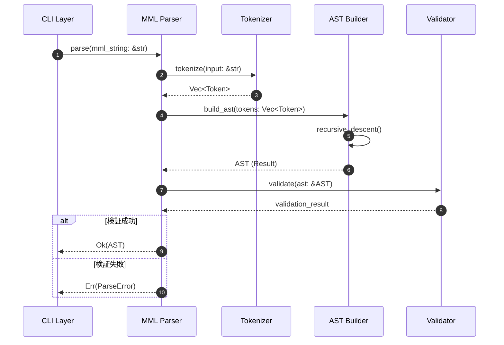
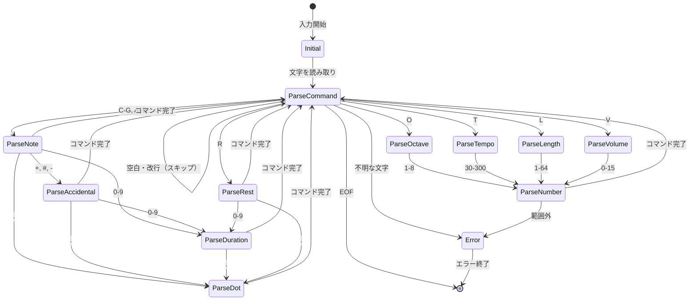

# MMLパーサー 詳細設計書

## メタ情報

| 項目 | 内容 |
|------|------|
| ドキュメントID | DET-MML-001 |
| バージョン | 1.0.0 |
| ステータス | レビュー待ち |
| 作成日 | 2026-01-10 |
| 最終更新日 | 2026-01-10 |
| 親機能 | MMLパーサー |
| 含まれる機能ID | F-001, F-011 |
| 関連基本設計書 | BASIC-CLI-001 |
| 関連要件定義書 | - |

## 1. 概要

MMLパーサーは、Music Macro Language (MML) 文字列を解析し、抽象構文木 (AST) に変換するコンポーネントです。NuttX MML仕様に準拠し、音符、休符、オクターブ、テンポ、音量などのコマンドを解析します。

### 1.1 処理フロー概要



### 1.2 設計方針

| 方針 | 内容 |
|------|------|
| パーサー方式 | 再帰下降パーサー (Recursive Descent Parser) |
| トークン化 | 文字列をイテレートしてトークン列に変換 |
| エラー処理 | 位置情報を含む詳細なエラーメッセージ |
| 状態管理 | パーサー内部で現在のオクターブ、デフォルト長、テンポを管理 |
| 拡張性 | 将来的な和音対応を見据えた構造設計 |

## 2. 機能要件

### 2.1 対象機能

| 機能ID | 機能名 | 概要 | 優先度 |
|--------|--------|------|--------|
| F-001 | MMLパース | MML文字列を解析し音符データ配列に変換 | 必須 |
| F-011 | エラー通知 | パースエラー等の内容と箇所をCLIに表示 | 必須 |

### 2.2 対応MMLコマンド

| コマンド | 形式 | 説明 | 例 |
|---------|------|------|-----|
| 音符 | C, D, E, F, G, A, B | 音符を発音 | C, D, E |
| シャープ | +, # | 半音上げる | C+, C# |
| フラット | - | 半音下げる | D- |
| オクターブ | O[1-8] | オクターブを設定 | O4 |
| 音長 | L[1-64] | デフォルトの音長を設定 | L4 |
| テンポ | T[30-300] | テンポ（BPM）を設定 | T120 |
| 音量 | V[0-15] | 音量を設定 | V8 |
| 休符 | R | 休符を挿入 | R |
| 付点 | . | 音長を1.5倍にする | C4. |
| 音長指定 | [1-64] | 個別の音符に音長を指定 | C4, D8 |

### 2.3 MML文法仕様（NuttX準拠）

```
<mml>       ::= <command>*
<command>   ::= <note> | <rest> | <octave> | <tempo> | <length> | <volume>
<note>      ::= <pitch> <accidental>? <duration>? <dot>?
<pitch>     ::= 'C' | 'D' | 'E' | 'F' | 'G' | 'A' | 'B'
<accidental>::= '+' | '#' | '-'
<duration>  ::= [1-9] [0-9]*
<dot>       ::= '.'
<rest>      ::= 'R' <duration>? <dot>?
<octave>    ::= 'O' [1-8]
<tempo>     ::= 'T' [3][0-9] | [1-2][0-9][0-9] | '300'
<length>    ::= 'L' [1-9] [0-9]?
<volume>    ::= 'V' [0-9] | '1' [0-5]
```

### 2.4 ビジネスルール

| ルールID | 内容 |
|---------|------|
| BR-001 | オクターブは1〜8の範囲内である必要がある。範囲外の場合はエラー |
| BR-002 | テンポは30〜300の範囲内である必要がある。範囲外の場合はエラー |
| BR-003 | 音長は1〜64の範囲内である必要がある。範囲外の場合はエラー |
| BR-004 | 音量は0〜15の範囲内である必要がある。範囲外の場合はエラー |
| BR-005 | 空白文字、改行は無視する |
| BR-006 | 小文字と大文字は区別しない（c = C） |
| BR-007 | 不明な文字が含まれている場合はエラー |
| BR-008 | 数値パース失敗時は詳細な位置情報を含むエラーを返す |

## 3. データ構造設計

### 3.1 AST構造

```rust
// AST全体
pub struct Mml {
    pub commands: Vec<Command>,
}

// 個別コマンド
pub enum Command {
    Note(Note),
    Rest(Rest),
    Octave(Octave),
    Tempo(Tempo),
    DefaultLength(DefaultLength),
    Volume(Volume),
}

// 音符
pub struct Note {
    pub pitch: Pitch,           // 音高
    pub accidental: Accidental, // シャープ/フラット
    pub duration: Option<u8>,   // 音長（None = デフォルト長）
    pub dots: u8,               // 付点の数
}

// 音高
pub enum Pitch {
    C,
    D,
    E,
    F,
    G,
    A,
    B,
}

// 変化記号
pub enum Accidental {
    Natural,  // ナチュラル（変化なし）
    Sharp,    // シャープ（+, #）
    Flat,     // フラット（-）
}

// 休符
pub struct Rest {
    pub duration: Option<u8>,   // 音長（None = デフォルト長）
    pub dots: u8,               // 付点の数
}

// オクターブ
pub struct Octave {
    pub value: u8,  // 1-8
}

// テンポ
pub struct Tempo {
    pub value: u16, // 30-300 BPM
}

// デフォルト音長
pub struct DefaultLength {
    pub value: u8,  // 1-64
}

// 音量
pub struct Volume {
    pub value: u8,  // 0-15
}
```

### 3.2 トークン構造

```rust
#[derive(Debug, Clone, PartialEq)]
pub enum Token {
    // 音符系
    Pitch(Pitch),           // C, D, E, F, G, A, B
    Sharp,                  // + or #
    Flat,                   // -
    Dot,                    // .
    Number(u16),            // 数値
    
    // コマンド系
    Octave,                 // O
    Tempo,                  // T
    Length,                 // L
    Volume,                 // V
    Rest,                   // R
    
    // 制御
    Eof,                    // 終端
}

#[derive(Debug, Clone, PartialEq)]
pub struct TokenWithPos {
    pub token: Token,
    pub position: usize,    // 元の文字列内の位置
}
```

### 3.3 エラー構造

```rust
#[derive(Debug, Clone, PartialEq)]
pub enum ParseError {
    UnexpectedToken {
        expected: String,
        found: Token,
        position: usize,
    },
    InvalidNumber {
        value: u16,
        range: (u16, u16),
        position: usize,
    },
    UnexpectedCharacter {
        character: char,
        position: usize,
    },
    UnexpectedEof {
        expected: String,
        position: usize,
    },
    EmptyInput,
}

impl std::fmt::Display for ParseError {
    fn fmt(&self, f: &mut std::fmt::Formatter<'_>) -> std::fmt::Result {
        match self {
            ParseError::UnexpectedToken { expected, found, position } => {
                write!(f, "[MML-E001] 位置 {}: 期待されたトークン '{}' ですが、'{:?}' が見つかりました", position, expected, found)
            }
            ParseError::InvalidNumber { value, range, position } => {
                write!(f, "[MML-E002] 位置 {}: 数値 {} は範囲 {}-{} を超えています", position, value, range.0, range.1)
            }
            ParseError::UnexpectedCharacter { character, position } => {
                write!(f, "[MML-E003] 位置 {}: 不明な文字 '{}' が見つかりました", position, character)
            }
            ParseError::UnexpectedEof { expected, position } => {
                write!(f, "[MML-E004] 位置 {}: '{}' が期待されましたが、入力が終了しました", position, expected)
            }
            ParseError::EmptyInput => {
                write!(f, "[MML-E005] 空のMML文字列が入力されました")
            }
        }
    }
}
```

## 4. パーサー状態機械

### 4.1 状態遷移図



### 4.2 パーサー状態

| 状態 | 説明 | 遷移条件 |
|------|------|---------|
| Initial | パース開始状態 | 常に ParseCommand へ |
| ParseCommand | 次のコマンドを判定 | トークンの種類により分岐 |
| ParseNote | 音符をパース中 | 変化記号、音長、付点を処理 |
| ParseAccidental | 変化記号をパース中 | 音長または次のコマンドへ |
| ParseDuration | 音長をパース中 | 付点または次のコマンドへ |
| ParseDot | 付点をパース中 | 次のコマンドへ |
| ParseRest | 休符をパース中 | 音長、付点を処理 |
| ParseOctave | オクターブコマンド処理 | 数値検証後、次のコマンドへ |
| ParseTempo | テンポコマンド処理 | 数値検証後、次のコマンドへ |
| ParseLength | 音長コマンド処理 | 数値検証後、次のコマンドへ |
| ParseVolume | 音量コマンド処理 | 数値検証後、次のコマンドへ |
| ParseNumber | 数値をパース中 | 範囲検証を実施 |
| Error | エラー状態 | パース終了 |

## 5. アルゴリズム設計

### 5.1 トークナイザーアルゴリズム

```
関数 tokenize(input: &str) -> Result<Vec<TokenWithPos>, ParseError>:
    tokens = []
    position = 0
    chars = input.chars().peekable()
    
    while chars.peek() != None:
        c = chars.peek().unwrap()
        
        if c.is_whitespace():
            chars.next()
            position++
            continue
        
        match c.to_uppercase():
            'C', 'D', 'E', 'F', 'G', 'A', 'B':
                tokens.push(TokenWithPos { token: Pitch(parse_pitch(c)), position })
                chars.next()
                position++
            
            '+', '#':
                tokens.push(TokenWithPos { token: Sharp, position })
                chars.next()
                position++
            
            '-':
                tokens.push(TokenWithPos { token: Flat, position })
                chars.next()
                position++
            
            '.':
                tokens.push(TokenWithPos { token: Dot, position })
                chars.next()
                position++
            
            'O':
                tokens.push(TokenWithPos { token: Octave, position })
                chars.next()
                position++
            
            'T':
                tokens.push(TokenWithPos { token: Tempo, position })
                chars.next()
                position++
            
            'L':
                tokens.push(TokenWithPos { token: Length, position })
                chars.next()
                position++
            
            'V':
                tokens.push(TokenWithPos { token: Volume, position })
                chars.next()
                position++
            
            'R':
                tokens.push(TokenWithPos { token: Rest, position })
                chars.next()
                position++
            
            '0'-'9':
                (number, consumed) = parse_number(chars, position)
                tokens.push(TokenWithPos { token: Number(number), position })
                position += consumed
            
            default:
                return Err(ParseError::UnexpectedCharacter { character: c, position })
    
    tokens.push(TokenWithPos { token: Eof, position })
    return Ok(tokens)
```

### 5.2 再帰下降パーサーアルゴリズム

```
構造体 Parser:
    tokens: Vec<TokenWithPos>
    current: usize
    default_octave: u8 = 4
    default_length: u8 = 4
    default_volume: u8 = 8

関数 parse() -> Result<Mml, ParseError>:
    commands = []
    
    while !is_at_end():
        command = parse_command()?
        commands.push(command)
    
    return Ok(Mml { commands })

関数 parse_command() -> Result<Command, ParseError>:
    token = peek()
    
    match token:
        Pitch(_):
            return Ok(Command::Note(parse_note()?))
        
        Rest:
            return Ok(Command::Rest(parse_rest()?))
        
        Octave:
            return Ok(Command::Octave(parse_octave()?))
        
        Tempo:
            return Ok(Command::Tempo(parse_tempo()?))
        
        Length:
            return Ok(Command::DefaultLength(parse_length()?))
        
        Volume:
            return Ok(Command::Volume(parse_volume()?))
        
        Eof:
            return Err(ParseError::UnexpectedEof)
        
        _:
            return Err(ParseError::UnexpectedToken)

関数 parse_note() -> Result<Note, ParseError>:
    pitch = consume_pitch()?
    
    accidental = if peek() in [Sharp, Flat]:
        consume_accidental()?
    else:
        Accidental::Natural
    
    duration = if peek() == Number(_):
        Some(consume_number_in_range(1, 64)?)
    else:
        None
    
    dots = 0
    while peek() == Dot:
        consume(Dot)
        dots++
    
    return Ok(Note { pitch, accidental, duration, dots })

関数 parse_rest() -> Result<Rest, ParseError>:
    consume(Rest)
    
    duration = if peek() == Number(_):
        Some(consume_number_in_range(1, 64)?)
    else:
        None
    
    dots = 0
    while peek() == Dot:
        consume(Dot)
        dots++
    
    return Ok(Rest { duration, dots })

関数 parse_octave() -> Result<Octave, ParseError>:
    consume(Octave)
    value = consume_number_in_range(1, 8)?
    default_octave = value
    return Ok(Octave { value })

関数 parse_tempo() -> Result<Tempo, ParseError>:
    consume(Tempo)
    value = consume_number_in_range(30, 300)?
    return Ok(Tempo { value })

関数 parse_length() -> Result<DefaultLength, ParseError>:
    consume(Length)
    value = consume_number_in_range(1, 64)?
    default_length = value
    return Ok(DefaultLength { value })

関数 parse_volume() -> Result<Volume, ParseError>:
    consume(Volume)
    value = consume_number_in_range(0, 15)?
    default_volume = value
    return Ok(Volume { value })

関数 consume_number_in_range(min: u16, max: u16) -> Result<u8, ParseError>:
    token = consume(Number)?
    if token.value < min or token.value > max:
        return Err(ParseError::InvalidNumber { value: token.value, range: (min, max), position })
    return Ok(token.value as u8)
```

## 6. 設計書一覧

| 設計書 | パス | 説明 |
|--------|------|------|
| バックエンド設計書 | [./バックエンド設計書.md](./バックエンド設計書.md) | パーサーAPI仕様 |

## 7. エラーコード一覧

| コード | 説明 | 対処方法 |
|--------|------|---------|
| MML-E001 | 予期しないトークン | MML文法を確認し、正しいコマンドを使用してください |
| MML-E002 | 数値が範囲外 | 指定した数値が許容範囲内か確認してください |
| MML-E003 | 不明な文字 | MML仕様に含まれる文字のみを使用してください |
| MML-E004 | 予期しないEOF | コマンドが途中で終了していないか確認してください |
| MML-E005 | 空の入力 | MML文字列を入力してください |

## 8. テスト戦略

### 8.1 ユニットテスト項目

| テストケース | 入力 | 期待される出力 | エラーコード |
|-------------|------|---------------|-------------|
| 単純な音符 | "C" | Note(C, Natural, None, 0) | - |
| シャープ音符 | "C#" | Note(C, Sharp, None, 0) | - |
| フラット音符 | "D-" | Note(D, Flat, None, 0) | - |
| 音長指定 | "C4" | Note(C, Natural, Some(4), 0) | - |
| 付点音符 | "C4." | Note(C, Natural, Some(4), 1) | - |
| 休符 | "R" | Rest(None, 0) | - |
| 休符（音長） | "R8" | Rest(Some(8), 0) | - |
| オクターブ | "O5" | Octave(5) | - |
| テンポ | "T120" | Tempo(120) | - |
| 音長設定 | "L4" | DefaultLength(4) | - |
| 音量 | "V8" | Volume(8) | - |
| 複合MML | "O4L4C D E F G A B" | [Octave(4), Length(4), Note(C), Note(D), ...] | - |
| オクターブ範囲外 | "O9" | - | MML-E002 |
| テンポ範囲外 | "T400" | - | MML-E002 |
| 不明な文字 | "X" | - | MML-E003 |
| 空の入力 | "" | - | MML-E005 |
| 途中終了 | "O" | - | MML-E004 |

### 8.2 統合テスト項目

| テストケース | 入力MML | 検証項目 |
|-------------|---------|---------|
| 簡単なメロディ | "O4L4 CDEFGAB" | 正しくASTに変換され、エラーがないこと |
| テンポ変更を含む | "T60 C D T120 E F" | テンポ変更が正しく反映されること |
| オクターブ変更 | "O3 C O4 C O5 C" | オクターブ変更が正しく反映されること |
| 複雑なリズム | "C4 D8 E16 F4. G2.." | 音長と付点が正しく解析されること |
| 大文字小文字混在 | "c D e F" | 正しく解析されること（大文字小文字を区別しない） |
| 空白・改行混在 | "C\nD E\n\nF  G" | 空白・改行が正しく無視されること |

### 8.3 エラーケーステスト

| テストケース | 入力 | 期待されるエラー |
|-------------|------|-----------------|
| 不正な音符 | "H" | MML-E003 |
| 不正なコマンド | "Q123" | MML-E003 |
| 数値のみ | "123" | MML-E003 |
| オクターブ不完全 | "O" | MML-E004 |
| テンポ不完全 | "T" | MML-E004 |

## 9. パフォーマンス要件

| 項目 | 要件 |
|------|------|
| パース時間 | 1000文字のMML文字列を10ms以内でパース |
| メモリ使用量 | AST構造はコンパクトに保ち、元の文字列サイズの5倍以内 |
| エラー検出 | 最初のエラーで即座に停止し、位置情報を返す |

## 10. 実装例

### 10.1 入力MML例

```
T120 L4 O4
C D E F G A B >C
<B A G F E D C
R4 C8 D8 E4 F4
```

### 10.2 期待されるAST出力

```rust
Mml {
    commands: [
        Command::Tempo(Tempo { value: 120 }),
        Command::DefaultLength(DefaultLength { value: 4 }),
        Command::Octave(Octave { value: 4 }),
        Command::Note(Note { pitch: C, accidental: Natural, duration: None, dots: 0 }),
        Command::Note(Note { pitch: D, accidental: Natural, duration: None, dots: 0 }),
        Command::Note(Note { pitch: E, accidental: Natural, duration: None, dots: 0 }),
        Command::Note(Note { pitch: F, accidental: Natural, duration: None, dots: 0 }),
        Command::Note(Note { pitch: G, accidental: Natural, duration: None, dots: 0 }),
        Command::Note(Note { pitch: A, accidental: Natural, duration: None, dots: 0 }),
        Command::Note(Note { pitch: B, accidental: Natural, duration: None, dots: 0 }),
        // ... (以下省略)
    ]
}
```

---

## 変更履歴

| 日付 | バージョン | 変更内容 | 担当者 |
|:---|:---|:---|:---|
| 2026-01-10 | 1.0.0 | 初版作成 | Antigravity |
