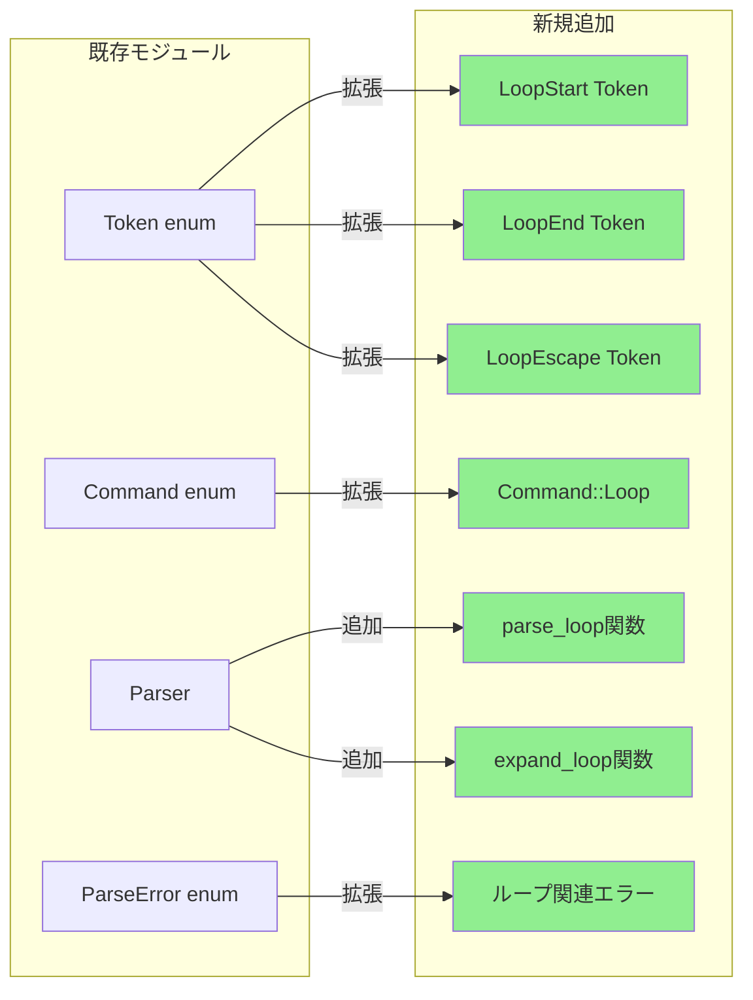
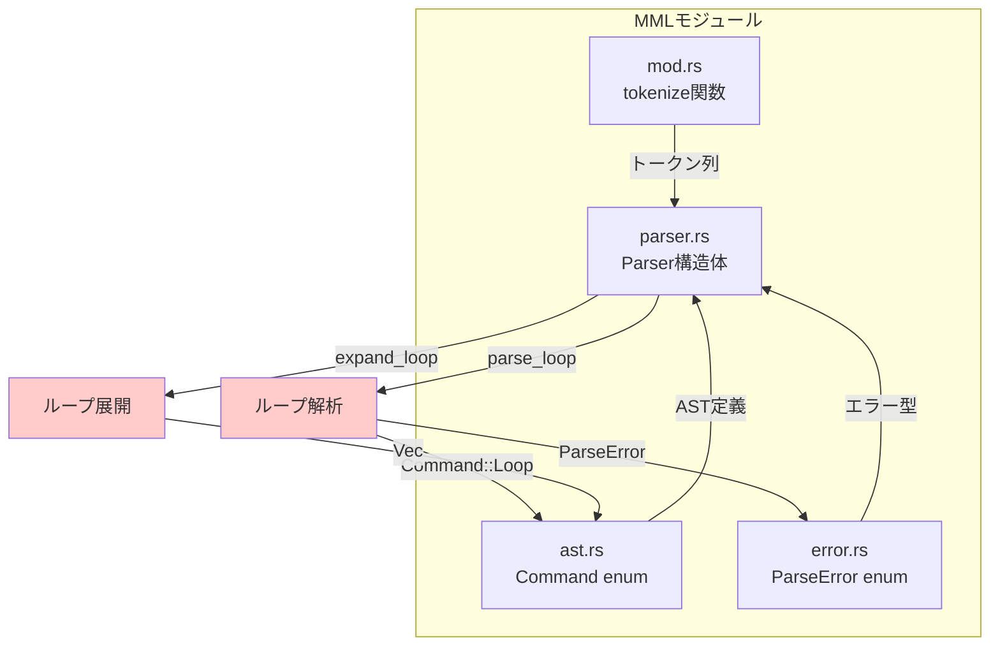
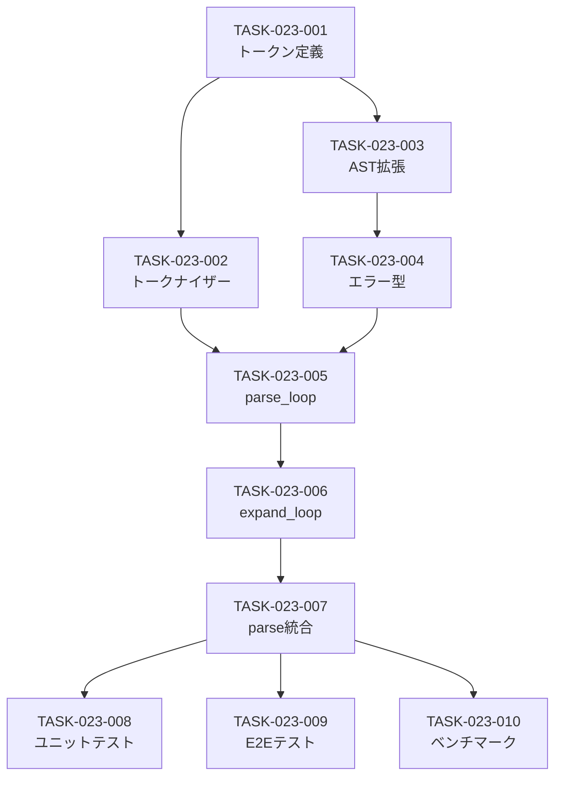

# MMLループ構文 バックエンド設計書

## ドキュメント情報

| 項目 | 内容 |
|------|------|
| 機能ID | F-023 |
| 機能名 | MMLループ構文 |
| 関連基本設計書 | [BASIC-CLI-003](../../basic/BASIC-CLI-003_MML-Syntax-Extension.md) |
| 関連詳細設計書 | [詳細設計書](./詳細設計書.md) |
| バージョン | 1.0.0 |
| 作成日 | 2026-01-11 |
| 最終更新日 | 2026-01-11 |
| 作成者 | detailed-design-writer |

---

## 1. 変更概要

### 1.1 目的

MMLループ構文の実装により、繰り返しパターンを簡潔に記述可能にする。従来は`CDEFCDEFCDEF`のように同じパターンを繰り返し記述する必要があったが、`[CDEF]3`と記述することで同じ結果を得られる。

### 1.2 変更対象モジュール

| モジュール | ファイルパス | 変更内容 | 変更レベル |
|-----------|------------|---------|-----------|
| トークナイザー | `src/mml/mod.rs` | `[`, `]`, `:` トークン追加 | 中 |
| AST定義 | `src/mml/ast.rs` | `Command::Loop`バリアント追加 | 中 |
| パーサー | `src/mml/parser.rs` | ループ解析ロジック追加 | 高 |
| エラー定義 | `src/mml/error.rs` | ループ関連エラー追加 | 中 |

### 1.3 影響範囲



---

## 2. モジュール設計

### 2.1 依存関係図



### 2.2 インターフェース定義

#### 2.2.1 公開インターフェース

| 関数 | シグネチャ | 説明 |
|------|----------|------|
| `tokenize` | `fn tokenize(input: &str) -> Result<Vec<TokenWithPos>, ParseError>` | MML文字列をトークン列に変換（既存関数の拡張） |
| `parse` | `fn parse(input: &str) -> Result<Mml, ParseError>` | MML文字列をASTに変換（既存関数、ループ展開を統合） |

#### 2.2.2 内部インターフェース

| 関数 | シグネチャ | 説明 |
|------|----------|------|
| `parse_loop` | `fn parse_loop(&mut self) -> Result<Command, ParseError>` | ループ構文を解析 |
| `expand_loop` | `fn expand_loop(commands: &[Command], escape_index: Option<usize>, repeat_count: usize) -> Vec<Command>` | ループを展開 |
| `check` | `fn check(&self, token: Token) -> bool` | 次のトークンが指定されたトークンかチェック |
| `check_number` | `fn check_number(&self) -> bool` | 次のトークンがNumberかチェック |

---

## 3. 実装詳細

### 3.1 トークナイザー拡張

#### 3.1.1 Token enum拡張

**ファイル**: `src/mml/mod.rs`

**変更内容**:

```rust
#[derive(Debug, Clone, PartialEq)]
pub enum Token {
    // 既存のトークン
    Pitch(Pitch),
    Sharp,
    Flat,
    Dot,
    Number(u16),
    Octave,
    OctaveUp,
    OctaveDown,
    Tempo,
    Length,
    Volume,
    Rest,
    Eof,
    
    // 新規追加
    LoopStart,      // [
    LoopEnd,        // ]
    LoopEscape,     // :
}
```

**追加理由**:
- `LoopStart`: ループの開始を示す
- `LoopEnd`: ループの終了を示す
- `LoopEscape`: 脱出ポイント（最終回のみ省略する位置）を示す

#### 3.1.2 tokenize関数の拡張

**ファイル**: `src/mml/mod.rs`

**変更箇所**: `tokenize()`関数のマッチ式に以下を追加

```rust
pub fn tokenize(input: &str) -> Result<Vec<TokenWithPos>, ParseError> {
    let mut tokens = Vec::new();
    let mut chars = input.chars().peekable();
    let mut position = 0;

    while let Some(&c) = chars.peek() {
        if c.is_whitespace() {
            chars.next();
            position += 1;
            continue;
        }

        let token = match c.to_ascii_uppercase() {
            // ... 既存のマッチケース ...
            
            // 新規追加
            '[' => {
                chars.next();
                let tok = TokenWithPos::new(Token::LoopStart, position);
                position += 1;
                tok
            }
            ']' => {
                chars.next();
                let tok = TokenWithPos::new(Token::LoopEnd, position);
                position += 1;
                tok
            }
            ':' => {
                chars.next();
                let tok = TokenWithPos::new(Token::LoopEscape, position);
                position += 1;
                tok
            }
            
            // ... 既存のマッチケース ...
        };
        tokens.push(token);
    }

    tokens.push(TokenWithPos::new(Token::Eof, position));
    Ok(tokens)
}
```

**実装のポイント**:
- `[`, `]`, `:` は記号なので、`to_ascii_uppercase()`の影響を受けない
- 位置情報を正確に記録（エラーメッセージで使用）
- 既存のトークナイザーロジックを変更せず、追加のみ

### 3.2 AST拡張

#### 3.2.1 Command enum拡張

**ファイル**: `src/mml/ast.rs`

**変更内容**:

```rust
#[derive(Debug, Clone, PartialEq)]
pub enum Command {
    // 既存のバリアント
    Note(Note),
    Rest(Rest),
    Octave(Octave),
    OctaveUp,
    OctaveDown,
    Tempo(Tempo),
    DefaultLength(DefaultLength),
    Volume(Volume),
    
    // 新規追加
    /// ループコマンド
    /// 
    /// # フィールド
    /// - `commands`: ループ内のコマンド列
    /// - `escape_index`: 脱出ポイントのインデックス（Noneの場合は脱出なし）
    /// - `repeat_count`: 繰り返し回数（1-99）
    /// 
    /// # 例
    /// ```
    /// // [CDEF]3 の場合
    /// Loop {
    ///     commands: vec![Note(C), Note(D), Note(E), Note(F)],
    ///     escape_index: None,
    ///     repeat_count: 3,
    /// }
    /// 
    /// // [CD:EF]2 の場合
    /// Loop {
    ///     commands: vec![Note(C), Note(D), Note(E), Note(F)],
    ///     escape_index: Some(2),
    ///     repeat_count: 2,
    /// }
    /// ```
    Loop {
        commands: Vec<Command>,
        escape_index: Option<usize>,
        repeat_count: usize,
    },
}
```

**データ構造の詳細**:

| フィールド | 型 | 説明 | 制約 |
|-----------|-----|------|------|
| `commands` | `Vec<Command>` | ループ内のコマンド列 | 空でも可（エッジケース） |
| `escape_index` | `Option<usize>` | 脱出ポイントのインデックス | `Some(i)` の場合、`i < commands.len()` |
| `repeat_count` | `usize` | 繰り返し回数 | 1-99の範囲内 |

**メモリレイアウト**:
- `Vec<Command>`: ヒープに確保、ポインタ・長さ・容量の3ワード
- `Option<usize>`: 1ワード（Noneは0、Someは値+1）
- `repeat_count`: 1ワード
- 合計: 約5ワード（40バイト on 64-bit）

### 3.3 パーサー拡張

#### 3.3.1 parse_command関数の拡張

**ファイル**: `src/mml/parser.rs`

**変更内容**:

```rust
fn parse_command(&mut self) -> Result<Command, ParseError> {
    let token_with_pos = self.peek();
    match &token_with_pos.token {
        // 既存のマッチケース
        Token::Pitch(_) => Ok(Command::Note(self.parse_note()?)),
        Token::Rest => Ok(Command::Rest(self.parse_rest()?)),
        Token::Octave => Ok(Command::Octave(self.parse_octave()?)),
        Token::OctaveUp => {
            self.advance();
            Ok(Command::OctaveUp)
        }
        Token::OctaveDown => {
            self.advance();
            Ok(Command::OctaveDown)
        }
        Token::Tempo => Ok(Command::Tempo(self.parse_tempo()?)),
        Token::Length => Ok(Command::DefaultLength(self.parse_length()?)),
        Token::Volume => Ok(Command::Volume(self.parse_volume()?)),
        
        // 新規追加
        Token::LoopStart => self.parse_loop(),
        
        // エラーケース
        Token::LoopEnd => Err(ParseError::UnmatchedLoopEnd {
            position: token_with_pos.position,
        }),
        Token::LoopEscape => Err(ParseError::LoopEscapeOutsideLoop {
            position: token_with_pos.position,
        }),
        
        Token::Eof => Err(ParseError::UnexpectedEof {
            expected: "command".to_string(),
            position: token_with_pos.position,
        }),
        _ => Err(ParseError::UnexpectedToken {
            expected: "command".to_string(),
            found: token_with_pos.token.clone(),
            position: token_with_pos.position,
        }),
    }
}
```

**実装のポイント**:
- `Token::LoopStart`を検出したら`parse_loop()`を呼び出す
- `Token::LoopEnd`がループ外で現れた場合はエラー
- `Token::LoopEscape`がループ外で現れた場合はエラー

#### 3.3.2 parse_loop関数の実装

**ファイル**: `src/mml/parser.rs`

**新規関数**:

```rust
/// ループ構文を解析
///
/// # 構文
/// - `[<commands>]<count>` - 基本ループ
/// - `[<commands>:<commands>]<count>` - 脱出ポイント付きループ
/// - `[<commands>]` - デフォルトループ（1回）
///
/// # エラー
/// - `UnmatchedLoopStart` - `]`がない
/// - `InvalidLoopCount` - ループ回数が範囲外（1-99以外）
/// - `NestedLoop` - ネストしたループ
/// - `MultipleEscapePoints` - 脱出ポイントが複数
///
/// # アルゴリズム
/// 1. `[`を消費
/// 2. `]`が現れるまでコマンドを解析
///    - `:`が現れたら脱出ポイントとして記録
///    - `[`が現れたらネストエラー
/// 3. `]`を消費
/// 4. 数値があれば解析（範囲チェック）、なければ1
/// 5. `Command::Loop`を生成
fn parse_loop(&mut self) -> Result<Command, ParseError> {
    let start_pos = self.peek().position;
    self.advance(); // Consume '['
    
    let mut commands = Vec::new();
    let mut escape_index = None;
    let mut escape_count = 0;
    
    // ループ内のコマンドを解析
    while !self.check(Token::LoopEnd) {
        if self.is_at_end() {
            return Err(ParseError::UnmatchedLoopStart {
                position: start_pos,
            });
        }
        
        // 脱出ポイントの検出
        if self.check(Token::LoopEscape) {
            escape_count += 1;
            if escape_count > 1 {
                return Err(ParseError::MultipleEscapePoints {
                    position: self.peek().position,
                });
            }
            self.advance(); // Consume ':'
            escape_index = Some(commands.len());
            continue;
        }
        
        // ネストしたループの検出
        if self.check(Token::LoopStart) {
            return Err(ParseError::NestedLoop {
                position: self.peek().position,
            });
        }
        
        // コマンドを解析
        let command = self.parse_command()?;
        commands.push(command);
    }
    
    self.advance(); // Consume ']'
    
    // ループ回数の解析
    let repeat_count = if self.check_number() {
        let token_with_pos = self.advance();
        if let Token::Number(n) = token_with_pos.token {
            if n == 0 || n > 99 {
                return Err(ParseError::InvalidLoopCount {
                    value: n,
                    range: (1, 99),
                    position: token_with_pos.position,
                });
            }
            n as usize
        } else {
            unreachable!()
        }
    } else {
        1 // デフォルトは1回
    };
    
    Ok(Command::Loop {
        commands,
        escape_index,
        repeat_count,
    })
}

/// 次のトークンがNumberかチェック
fn check_number(&self) -> bool {
    matches!(self.peek().token, Token::Number(_))
}

/// 次のトークンが指定されたトークンかチェック
fn check(&self, token: Token) -> bool {
    std::mem::discriminant(&self.peek().token) == std::mem::discriminant(&token)
}
```

**実装のポイント**:
- **ネスト検出**: ループ内で`[`を検出したらエラー
- **脱出ポイント検出**: `:`を検出したら`escape_index`に記録
- **複数脱出ポイント検出**: 2個目の`:`でエラー
- **範囲チェック**: ループ回数は1-99の範囲内
- **デフォルト値**: ループ回数省略時は1回

**時間計算量**: O(n)（nはループ内のコマンド数）

#### 3.3.3 expand_loop関数の実装

**ファイル**: `src/mml/parser.rs`

**新規関数**:

```rust
/// ループコマンドを展開してフラットなコマンド列に変換
///
/// # 引数
/// - `commands`: ループ内のコマンド列
/// - `escape_index`: 脱出ポイントのインデックス（Noneの場合は脱出なし）
/// - `repeat_count`: 繰り返し回数
///
/// # 戻り値
/// 展開されたコマンド列
///
/// # 例
/// ```
/// // [CDEF]3 の場合
/// let commands = vec![C, D, E, F];
/// let expanded = expand_loop(&commands, None, 3);
/// // expanded = [C, D, E, F, C, D, E, F, C, D, E, F]
///
/// // [CD:EF]2 の場合
/// let commands = vec![C, D, E, F];
/// let expanded = expand_loop(&commands, Some(2), 2);
/// // expanded = [C, D, E, F, C, D]
/// ```
///
/// # アルゴリズム
/// 1. 結果用のVecを確保（容量: commands.len() * repeat_count）
/// 2. repeat_count回ループ
///    - 最終回かつescape_indexがある場合: commands[0..escape_index]を追加
///    - それ以外: commands全体を追加
/// 3. 結果を返す
///
/// # 時間計算量
/// O(n * m)（n: コマンド数、m: 繰り返し回数）
///
/// # 空間計算量
/// O(n * m)（展開後のコマンド数）
pub fn expand_loop(
    commands: &[Command],
    escape_index: Option<usize>,
    repeat_count: usize,
) -> Vec<Command> {
    let mut expanded = Vec::with_capacity(commands.len() * repeat_count);
    
    for i in 0..repeat_count {
        let is_last_iteration = i == repeat_count - 1;
        
        // 最終回かつ脱出ポイントがある場合は、脱出ポイントまでのコマンドのみ追加
        let end_index = if is_last_iteration && escape_index.is_some() {
            escape_index.unwrap()
        } else {
            commands.len()
        };
        
        // コマンドを追加
        expanded.extend_from_slice(&commands[..end_index]);
    }
    
    expanded
}
```

**実装のポイント**:
- **容量事前確保**: `Vec::with_capacity()`でメモリ再確保を最小化
- **スライス操作**: `extend_from_slice()`で効率的にコピー
- **脱出ポイント処理**: 最終回のみ`escape_index`までのコマンドを追加

**性能最適化**:
- 事前に容量を確保することで、メモリ再確保のオーバーヘッドを削減
- `extend_from_slice()`はmemcpyで高速

#### 3.3.4 parse関数の統合

**ファイル**: `src/mml/parser.rs`

**変更内容**:

```rust
impl Parser {
    pub fn parse(&mut self) -> Result<Mml, ParseError> {
        let mut commands = Vec::new();

        while !self.is_at_end() {
            let command = self.parse_command()?;
            
            // ループコマンドの場合は展開
            if let Command::Loop { commands: loop_commands, escape_index, repeat_count } = command {
                let expanded = expand_loop(&loop_commands, escape_index, repeat_count);
                commands.extend(expanded);
            } else {
                commands.push(command);
            }
        }

        Ok(Mml { commands })
    }
}
```

**実装のポイント**:
- `Command::Loop`を検出したら即座に展開
- 展開後のコマンド列を結果に追加
- ループ以外のコマンドはそのまま追加

### 3.4 エラーハンドリング実装

#### 3.4.1 ParseError enum拡張

**ファイル**: `src/mml/error.rs`

**変更内容**:

```rust
#[derive(Debug, Clone, PartialEq)]
pub enum ParseError {
    // 既存のエラー
    EmptyInput,
    UnexpectedCharacter { character: char, position: usize },
    UnexpectedToken { expected: String, found: Token, position: usize },
    UnexpectedEof { expected: String, position: usize },
    InvalidNumber { value: u16, range: (u16, u16), position: usize },
    
    // 新規追加
    /// ループの開始括弧`[`に対応する`]`がない
    UnmatchedLoopStart { position: usize },
    
    /// ループの終了括弧`]`に対応する`[`がない
    UnmatchedLoopEnd { position: usize },
    
    /// ループ回数が範囲外（1-99以外）
    InvalidLoopCount { value: u16, range: (u16, u16), position: usize },
    
    /// ネストしたループは非対応
    NestedLoop { position: usize },
    
    /// 脱出ポイント`:`がループ外で使用された
    LoopEscapeOutsideLoop { position: usize },
    
    /// 脱出ポイントが複数存在する
    MultipleEscapePoints { position: usize },
}
```

#### 3.4.2 エラーメッセージ実装

**ファイル**: `src/mml/error.rs`

**変更内容**:

```rust
impl std::fmt::Display for ParseError {
    fn fmt(&self, f: &mut std::fmt::Formatter<'_>) -> std::fmt::Result {
        match self {
            // 既存のエラーメッセージ
            Self::EmptyInput => write!(f, "空のMML文字列が入力されました"),
            Self::UnexpectedCharacter { character, position } => {
                write!(f, "位置 {position}: 不明な文字 '{character}' が見つかりました")
            }
            Self::UnexpectedToken { expected, found, position } => {
                write!(f, "位置 {position}: 期待されたトークン '{expected}' ですが、'{found:?}' が見つかりました")
            }
            Self::UnexpectedEof { expected, position } => {
                write!(f, "位置 {position}: '{expected}' が期待されましたが、入力が終了しました")
            }
            Self::InvalidNumber { value, range, position } => {
                write!(f, "位置 {position}: 数値 {value} は範囲 {}-{} を超えています", range.0, range.1)
            }
            
            // 新規追加
            Self::UnmatchedLoopStart { position } => {
                write!(
                    f,
                    "位置 {position}: ループの開始括弧 '[' に対応する ']' がありません\n\
                     ヒント: ループは '[' で開始し ']' で終了する必要があります"
                )
            }
            Self::UnmatchedLoopEnd { position } => {
                write!(
                    f,
                    "位置 {position}: ループの終了括弧 ']' に対応する '[' がありません\n\
                     ヒント: ループは '[' で開始し ']' で終了する必要があります"
                )
            }
            Self::InvalidLoopCount { value, range, position } => {
                write!(
                    f,
                    "位置 {position}: ループ回数 {value} は範囲外です\n\
                     許可される範囲: {}-{}\n\
                     ヒント: ループ回数は1-99の範囲内で指定してください",
                    range.0, range.1
                )
            }
            Self::NestedLoop { position } => {
                write!(
                    f,
                    "位置 {position}: ネストしたループは非対応です\n\
                     ヒント: ループを平坦化するか、複数の独立したループに分割してください\n\
                     例: [[CDEF]2]3 → [CDEF]2 [CDEF]2 [CDEF]2"
                )
            }
            Self::LoopEscapeOutsideLoop { position } => {
                write!(
                    f,
                    "位置 {position}: 脱出ポイント ':' がループ外で使用されています\n\
                     ヒント: ':' はループ内でのみ使用できます\n\
                     例: [CDEF:GAB]2"
                )
            }
            Self::MultipleEscapePoints { position } => {
                write!(
                    f,
                    "位置 {position}: ループ内に複数の脱出ポイント ':' があります\n\
                     ヒント: 脱出ポイントは1つのみ指定できます\n\
                     例: [CD:EF]2 (正しい) vs [C:D:E]2 (誤り)"
                )
            }
        }
    }
}
```

**エラーメッセージの設計方針**:
1. **位置情報**: エラーが発生した位置を明示
2. **問題の説明**: 何が問題かを明確に説明
3. **ヒント**: 修正方法を提案
4. **例**: 正しい記述例を提示（該当する場合）

---

## 4. テスト実装

### 4.1 ユニットテスト構成

**ファイル**: `tests/unit/mml_parser_loop_test.rs`

**テストカテゴリ**:

| カテゴリ | テスト数 | 説明 |
|---------|---------|------|
| 正常系 | 10件 | 基本ループ、脱出ポイント、エッジケース |
| 異常系 | 10件 | エラー検出、範囲外、不正な構文 |
| 統合テスト | 4件 | 他のMMLコマンドとの組み合わせ |

### 4.2 主要テストケース実装例

#### 4.2.1 基本ループテスト

```rust
#[test]
fn test_basic_loop_3_times() {
    let input = "[CDEF]3";
    let mml = parse(input).unwrap();
    
    // 展開後は12個のコマンド（C,D,E,F × 3回）
    assert_eq!(mml.commands.len(), 12);
    
    // 最初の4つがCDEF
    assert!(matches!(mml.commands[0], Command::Note(Note { pitch: Pitch::C, .. })));
    assert!(matches!(mml.commands[1], Command::Note(Note { pitch: Pitch::D, .. })));
    assert!(matches!(mml.commands[2], Command::Note(Note { pitch: Pitch::E, .. })));
    assert!(matches!(mml.commands[3], Command::Note(Note { pitch: Pitch::F, .. })));
    
    // 2回目も同じ
    assert!(matches!(mml.commands[4], Command::Note(Note { pitch: Pitch::C, .. })));
    assert!(matches!(mml.commands[5], Command::Note(Note { pitch: Pitch::D, .. })));
    assert!(matches!(mml.commands[6], Command::Note(Note { pitch: Pitch::E, .. })));
    assert!(matches!(mml.commands[7], Command::Note(Note { pitch: Pitch::F, .. })));
    
    // 3回目も同じ
    assert!(matches!(mml.commands[8], Command::Note(Note { pitch: Pitch::C, .. })));
    assert!(matches!(mml.commands[9], Command::Note(Note { pitch: Pitch::D, .. })));
    assert!(matches!(mml.commands[10], Command::Note(Note { pitch: Pitch::E, .. })));
    assert!(matches!(mml.commands[11], Command::Note(Note { pitch: Pitch::F, .. })));
}
```

#### 4.2.2 脱出ポイントテスト

```rust
#[test]
fn test_loop_with_escape_point() {
    let input = "[CD:EF]2";
    let mml = parse(input).unwrap();
    
    // 展開後は6個のコマンド（1回目: CDEF、2回目: CD）
    assert_eq!(mml.commands.len(), 6);
    
    // 1回目: CDEF
    assert!(matches!(mml.commands[0], Command::Note(Note { pitch: Pitch::C, .. })));
    assert!(matches!(mml.commands[1], Command::Note(Note { pitch: Pitch::D, .. })));
    assert!(matches!(mml.commands[2], Command::Note(Note { pitch: Pitch::E, .. })));
    assert!(matches!(mml.commands[3], Command::Note(Note { pitch: Pitch::F, .. })));
    
    // 2回目: CD（脱出）
    assert!(matches!(mml.commands[4], Command::Note(Note { pitch: Pitch::C, .. })));
    assert!(matches!(mml.commands[5], Command::Note(Note { pitch: Pitch::D, .. })));
}
```

#### 4.2.3 エラーテスト

```rust
#[test]
fn test_invalid_loop_count_over_99() {
    let input = "[CDEF]100";
    let result = parse(input);
    
    assert!(result.is_err());
    let err = result.unwrap_err();
    assert!(matches!(err, ParseError::InvalidLoopCount { value: 100, range: (1, 99), .. }));
}

#[test]
fn test_nested_loop_error() {
    let input = "[[CDEF]2]3";
    let result = parse(input);
    
    assert!(result.is_err());
    let err = result.unwrap_err();
    assert!(matches!(err, ParseError::NestedLoop { .. }));
}

#[test]
fn test_unmatched_loop_start() {
    let input = "[CDEF";
    let result = parse(input);
    
    assert!(result.is_err());
    let err = result.unwrap_err();
    assert!(matches!(err, ParseError::UnmatchedLoopStart { .. }));
}

#[test]
fn test_multiple_escape_points() {
    let input = "[C:D:E]2";
    let result = parse(input);
    
    assert!(result.is_err());
    let err = result.unwrap_err();
    assert!(matches!(err, ParseError::MultipleEscapePoints { .. }));
}
```

### 4.3 テストカバレッジ目標

| 対象 | カバレッジ目標 | 測定方法 |
|------|--------------|---------|
| `parse_loop()` | 100% | `cargo tarpaulin` |
| `expand_loop()` | 100% | `cargo tarpaulin` |
| `tokenize()` (ループ関連) | 100% | `cargo tarpaulin` |
| エラーハンドリング | 100% | 全エラーケースをテスト |

---

## 5. 性能考慮事項

### 5.1 性能要件

| ID | 要件 | 目標値 | 測定方法 |
|----|------|--------|---------|
| NFR-P-008 | ループ展開のオーバーヘッド | 10ms以内（ループ回数99回） | ベンチマークテスト |
| NFR-P-009 | ループ解析の時間計算量 | O(n)（nはループ内のコマンド数） | 理論的解析 |
| NFR-P-010 | メモリ使用量 | ループ展開後のコマンド数に比例 | メモリプロファイラ |

### 5.2 性能最適化手法

#### 5.2.1 メモリ事前確保

```rust
// expand_loop関数内
let mut expanded = Vec::with_capacity(commands.len() * repeat_count);
```

**効果**:
- メモリ再確保の回数を削減
- ヒープアロケーションのオーバーヘッドを最小化

#### 5.2.2 スライス操作の活用

```rust
// expand_loop関数内
expanded.extend_from_slice(&commands[..end_index]);
```

**効果**:
- `memcpy`による高速なコピー
- イテレータのオーバーヘッドを回避

#### 5.2.3 不要なクローンの回避

```rust
// parse関数内
if let Command::Loop { commands: loop_commands, escape_index, repeat_count } = command {
    let expanded = expand_loop(&loop_commands, escape_index, repeat_count);
    commands.extend(expanded);
}
```

**効果**:
- `Command::Loop`を消費することで、不要なクローンを回避
- 所有権の移動により、メモリ効率を向上

### 5.3 ベンチマーク実装

**ファイル**: `benches/loop_expansion_bench.rs`

```rust
use criterion::{black_box, criterion_group, criterion_main, Criterion};
use sine_mml::mml::parse;

fn benchmark_loop_expansion(c: &mut Criterion) {
    c.bench_function("loop_expansion_99_times", |b| {
        b.iter(|| {
            let input = black_box("[CDEFGAB]99");
            parse(input).unwrap()
        });
    });
    
    c.bench_function("loop_expansion_with_escape", |b| {
        b.iter(|| {
            let input = black_box("[CDEFGAB:>C<C]50");
            parse(input).unwrap()
        });
    });
    
    c.bench_function("multiple_loops", |b| {
        b.iter(|| {
            let input = black_box("[CDEF]10 [GAB]10 [>CDE]10");
            parse(input).unwrap()
        });
    });
}

criterion_group!(benches, benchmark_loop_expansion);
criterion_main!(benches);
```

**実行方法**:
```bash
cargo bench --bench loop_expansion_bench
```

---

## 6. セキュリティ考慮事項

### 6.1 DoS攻撃対策

| 対策 | 実装箇所 | 詳細 |
|------|---------|------|
| ループ回数の制限 | `parse_loop()` | 1-99回に制限 |
| ネストループの禁止 | `parse_loop()` | 指数的なメモリ消費を防止 |
| 入力長の制限 | （既存） | MML文字列の長さ制限 |

### 6.2 メモリ安全性

| 項目 | 対策 | 実装箇所 |
|------|------|---------|
| バッファオーバーフロー | Rustの境界チェック | 全配列アクセス |
| ヌルポインタ参照 | `Option`型の使用 | `escape_index` |
| ダングリングポインタ | 所有権システム | 全データ構造 |

### 6.3 エラーハンドリングの安全性

- **パニックの回避**: 全てのエラーケースで`Result`を返す
- **情報漏洩の防止**: エラーメッセージに機密情報を含めない
- **リソースリーク防止**: エラー時もメモリを適切に解放

---

## 7. 実装タスク分割

### 7.1 タスク一覧

| タスクID | タスク名 | 対象ファイル | 見積もり行数 | 優先度 |
|---------|---------|------------|------------|--------|
| TASK-023-001 | トークン定義追加 | `src/mml/mod.rs` | 30行 | 高 |
| TASK-023-002 | トークナイザー拡張 | `src/mml/mod.rs` | 40行 | 高 |
| TASK-023-003 | AST拡張 | `src/mml/ast.rs` | 20行 | 高 |
| TASK-023-004 | エラー型拡張 | `src/mml/error.rs` | 80行 | 高 |
| TASK-023-005 | parse_loop()実装 | `src/mml/parser.rs` | 100行 | 高 |
| TASK-023-006 | expand_loop()実装 | `src/mml/parser.rs` | 50行 | 高 |
| TASK-023-007 | parse()統合 | `src/mml/parser.rs` | 20行 | 高 |
| TASK-023-008 | ユニットテスト実装 | `tests/unit/mml_parser_loop_test.rs` | 200行 | 高 |
| TASK-023-009 | E2Eテスト実装 | `tests/cli_integration.rs` | 50行 | 中 |
| TASK-023-010 | ベンチマーク実装 | `benches/loop_expansion_bench.rs` | 30行 | 低 |

**合計見積もり**: 620行

### 7.2 実装順序

#### Phase 1: 基礎実装（TASK-023-001〜003）
- トークン定義、トークナイザー、AST拡張
- 見積もり: 90行
- 所要時間: 1日

#### Phase 2: パーサー実装（TASK-023-004〜007）
- エラー型、parse_loop()、expand_loop()、統合
- 見積もり: 250行
- 所要時間: 2日

#### Phase 3: テスト実装（TASK-023-008〜010）
- ユニットテスト、E2Eテスト、ベンチマーク
- 見積もり: 280行
- 所要時間: 2日

### 7.3 依存関係



---

## 8. 関連ドキュメント

| ドキュメント | パス | 説明 |
|-------------|------|------|
| 詳細設計書 | [詳細設計書.md](./詳細設計書.md) | MMLループ構文の詳細設計 |
| 基本設計書 | [BASIC-CLI-003](../../basic/BASIC-CLI-003_MML-Syntax-Extension.md) | MML構文拡張の基本設計 |
| 要件定義書 | REQ-CLI-003 | MML構文拡張の要件定義 |
| 既存パーサー実装 | `src/mml/parser.rs` | 既存のMMLパーサー |
| 既存AST定義 | `src/mml/ast.rs` | 既存のAST定義 |
| 既存エラー定義 | `src/mml/error.rs` | 既存のエラー定義 |

---

## 変更履歴

| 日付 | バージョン | 変更内容 | 担当者 |
|:---|:---|:---|:---|
| 2026-01-11 | 1.0.0 | 初版作成 | detailed-design-writer |
