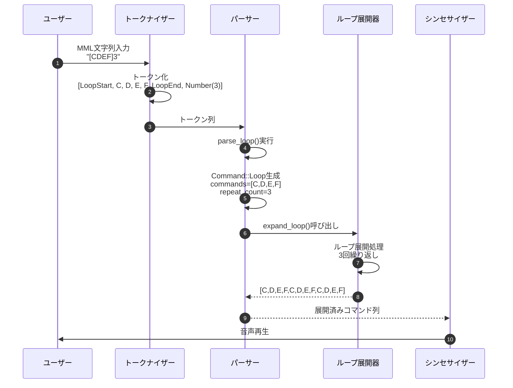
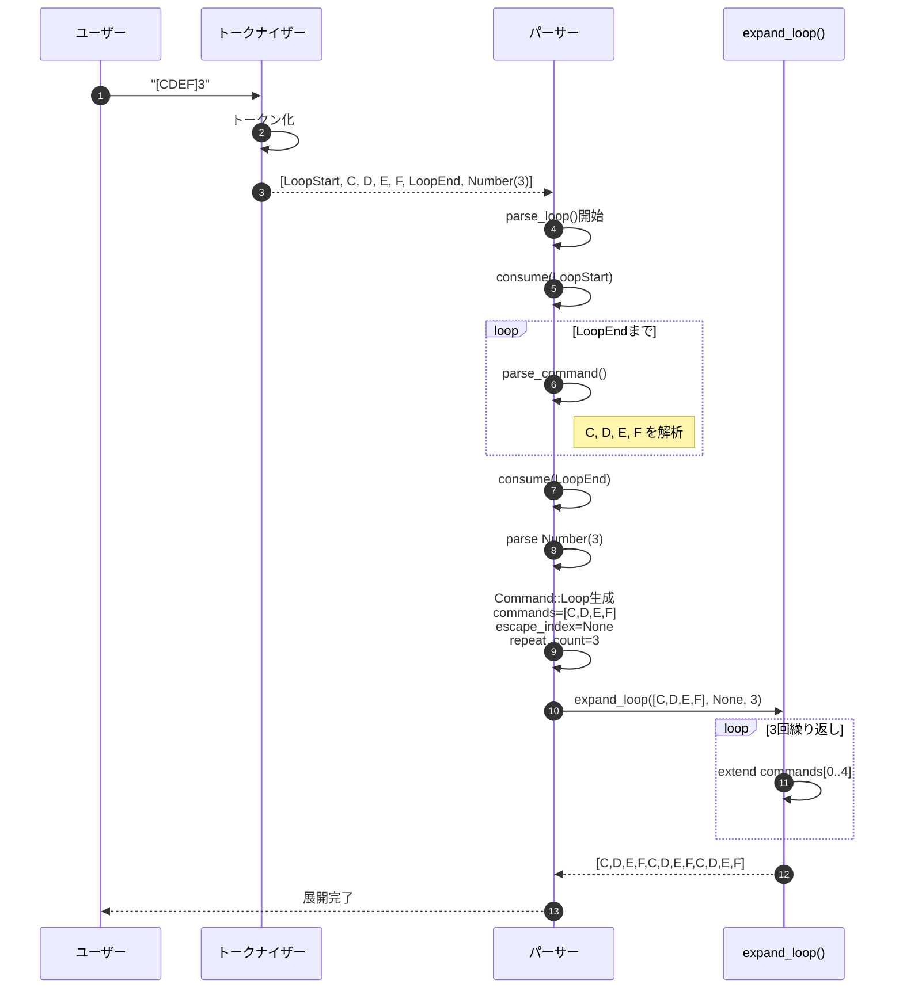
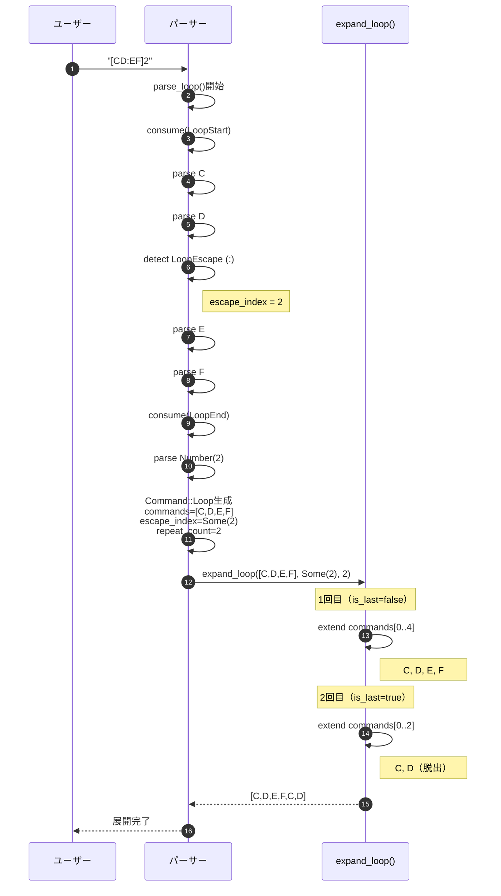
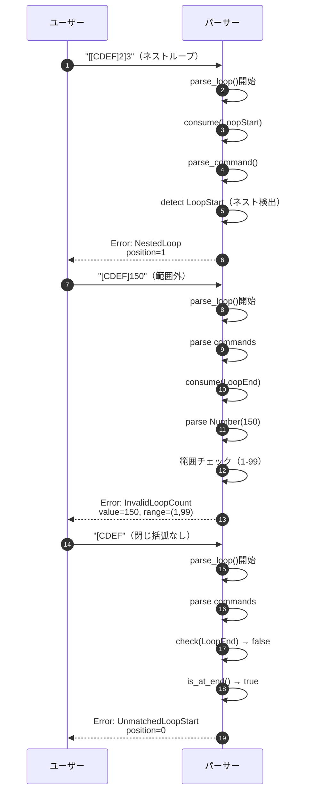
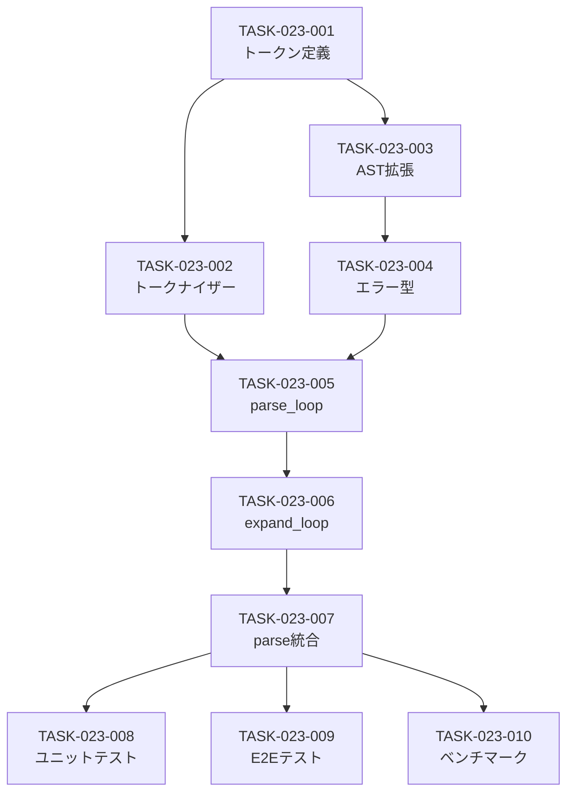

# MMLループ構文 詳細設計書

## メタ情報

| 項目 | 内容 |
|------|------|
| 機能ID | F-023 |
| 機能名 | MMLループ構文 |
| 関連基本設計書 | [BASIC-CLI-003](../../basic/BASIC-CLI-003_MML-Syntax-Extension.md) |
| 関連要件定義書 | REQ-CLI-003 |
| バージョン | 1.0.0 |
| 作成日 | 2026-01-11 |
| 最終更新日 | 2026-01-11 |
| 作成者 | detailed-design-writer |

---

## 1. 概要

### 1.1 機能概要

MMLループ構文は、繰り返しパターンを`[]`で囲むことで簡潔に記述できる機能です。従来は`CDEFCDEFCDEF`のように同じパターンを繰り返し記述する必要がありましたが、`[CDEF]3`と記述することで同じ結果を得られます。

**主な機能**:
- 基本ループ: `[CDEF]3` → `CDEFCDEFCDEF`
- 脱出ポイント付きループ: `[CD:EF]2` → `CDEFCD`（最終回のみ`:` 以降を省略）
- デフォルトループ: `[CDEF]` → `CDEF`（回数省略時は1回）

### 1.2 処理フロー概要



---

## 2. 機能要件

### 2.1 対象機能

| 機能ID | 機能名 | 概要 | 優先度 |
|--------|--------|------|--------|
| F-023 | MMLループ構文 | `[]`で囲んだ範囲を指定回数ループ | 必須 |

### 2.2 ビジネスルール

| ルールID | 内容 | 検証方法 |
|---------|------|---------|
| BR-050 | `[]`の後に数値がない場合は1回のみ実行（無限ループ防止） | パーサーでデフォルト値1を設定 |
| BR-051 | ループ回数は1-99の範囲内（100回以上はエラー） | パーサーで範囲チェック |
| BR-052 | `:`はループ内でのみ有効（ループ外ではエラー） | パーサーでコンテキストチェック |
| BR-053 | ネストしたループ（`[[CDEF]2]3`等）は非対応（エラー） | パーサーでネスト検出 |
| BR-054 | `[`と`]`の対応が取れない場合はエラー | パーサーで括弧マッチング検証 |

---

## 3. 詳細仕様

### 3.1 トークン追加仕様

#### 3.1.1 新規トークン定義

`src/mml/mod.rs`の`Token` enumに以下の3つのトークンを追加します。

```rust
#[derive(Debug, Clone, PartialEq)]
pub enum Token {
    // 既存のトークン
    Pitch(Pitch),
    Sharp,
    Flat,
    Dot,
    Number(u16),
    Octave,
    OctaveUp,
    OctaveDown,
    Tempo,
    Length,
    Volume,
    Rest,
    Eof,
    
    // 新規追加
    LoopStart,      // [
    LoopEnd,        // ]
    LoopEscape,     // :
}
```

#### 3.1.2 トークナイザー拡張

`tokenize()`関数に以下のケースを追加します。

```rust
// src/mml/mod.rs の tokenize() 関数内

match c.to_ascii_uppercase() {
    // ... 既存のマッチケース ...
    
    '[' => {
        chars.next();
        let tok = TokenWithPos::new(Token::LoopStart, position);
        position += 1;
        tok
    }
    ']' => {
        chars.next();
        let tok = TokenWithPos::new(Token::LoopEnd, position);
        position += 1;
        tok
    }
    ':' => {
        chars.next();
        let tok = TokenWithPos::new(Token::LoopEscape, position);
        position += 1;
        tok
    }
    
    // ... 既存のマッチケース ...
}
```

### 3.2 AST拡張仕様

#### 3.2.1 Command enum拡張

`src/mml/ast.rs`の`Command` enumに`Loop`バリアントを追加します。

```rust
#[derive(Debug, Clone, PartialEq)]
pub enum Command {
    // 既存のバリアント
    Note(Note),
    Rest(Rest),
    Octave(Octave),
    OctaveUp,
    OctaveDown,
    Tempo(Tempo),
    DefaultLength(DefaultLength),
    Volume(Volume),
    
    // 新規追加
    /// ループコマンド
    /// 
    /// # フィールド
    /// - `commands`: ループ内のコマンド列
    /// - `escape_index`: 脱出ポイントのインデックス（Noneの場合は脱出なし）
    /// - `repeat_count`: 繰り返し回数（1-99）
    Loop {
        commands: Vec<Command>,
        escape_index: Option<usize>,
        repeat_count: usize,
    },
}
```

#### 3.2.2 データ構造の説明

| フィールド | 型 | 説明 | 例 |
|-----------|-----|------|-----|
| `commands` | `Vec<Command>` | ループ内のコマンド列 | `[Note(C), Note(D), Note(E), Note(F)]` |
| `escape_index` | `Option<usize>` | 脱出ポイントのインデックス。Noneの場合は全コマンドを繰り返す | `Some(2)` → 2番目のコマンドの後で脱出 |
| `repeat_count` | `usize` | 繰り返し回数（1-99） | `3` → 3回繰り返し |

### 3.3 パーサー拡張仕様

#### 3.3.1 parse_command()の拡張

`src/mml/parser.rs`の`parse_command()`関数にループ構文の処理を追加します。

```rust
fn parse_command(&mut self) -> Result<Command, ParseError> {
    let token_with_pos = self.peek();
    match &token_with_pos.token {
        // 既存のマッチケース
        Token::Pitch(_) => Ok(Command::Note(self.parse_note()?)),
        Token::Rest => Ok(Command::Rest(self.parse_rest()?)),
        // ... 他の既存ケース ...
        
        // 新規追加
        Token::LoopStart => self.parse_loop(),
        
        // エラーケース
        Token::LoopEnd => Err(ParseError::UnexpectedToken {
            expected: "command or loop start".to_string(),
            found: token_with_pos.token.clone(),
            position: token_with_pos.position,
        }),
        Token::LoopEscape => Err(ParseError::LoopEscapeOutsideLoop {
            position: token_with_pos.position,
        }),
        
        // ... 既存のエラーケース ...
    }
}
```

#### 3.3.2 parse_loop()関数の実装

新規関数`parse_loop()`を追加します。

```rust
/// ループ構文を解析
///
/// # 構文
/// - `[<commands>]<count>` - 基本ループ
/// - `[<commands>:<commands>]<count>` - 脱出ポイント付きループ
/// - `[<commands>]` - デフォルトループ（1回）
///
/// # エラー
/// - `UnmatchedLoopStart` - `]`がない
/// - `InvalidLoopCount` - ループ回数が範囲外（1-99以外）
/// - `NestedLoop` - ネストしたループ
/// - `MultipleEscapePoints` - 脱出ポイントが複数
fn parse_loop(&mut self) -> Result<Command, ParseError> {
    let start_pos = self.peek().position;
    self.advance(); // Consume '['
    
    let mut commands = Vec::new();
    let mut escape_index = None;
    let mut escape_count = 0;
    
    // ループ内のコマンドを解析
    while !self.check(Token::LoopEnd) {
        if self.is_at_end() {
            return Err(ParseError::UnmatchedLoopStart {
                position: start_pos,
            });
        }
        
        // 脱出ポイントの検出
        if self.check(Token::LoopEscape) {
            escape_count += 1;
            if escape_count > 1 {
                return Err(ParseError::MultipleEscapePoints {
                    position: self.peek().position,
                });
            }
            self.advance(); // Consume ':'
            escape_index = Some(commands.len());
            continue;
        }
        
        // ネストしたループの検出
        if self.check(Token::LoopStart) {
            return Err(ParseError::NestedLoop {
                position: self.peek().position,
            });
        }
        
        // コマンドを解析
        let command = self.parse_command()?;
        commands.push(command);
    }
    
    self.advance(); // Consume ']'
    
    // ループ回数の解析
    let repeat_count = if self.check_number() {
        let token_with_pos = self.advance();
        if let Token::Number(n) = token_with_pos.token {
            if n == 0 || n > 99 {
                return Err(ParseError::InvalidLoopCount {
                    value: n,
                    range: (1, 99),
                    position: token_with_pos.position,
                });
            }
            n as usize
        } else {
            unreachable!()
        }
    } else {
        1 // デフォルトは1回
    };
    
    Ok(Command::Loop {
        commands,
        escape_index,
        repeat_count,
    })
}

/// 次のトークンがNumberかチェック
fn check_number(&self) -> bool {
    matches!(self.peek().token, Token::Number(_))
}

/// 次のトークンが指定されたトークンかチェック
fn check(&self, token: Token) -> bool {
    self.peek().token == token
}
```

#### 3.3.3 エラー型の拡張

`src/mml/error.rs`に新しいエラーバリアントを追加します。

```rust
#[derive(Debug, Clone, PartialEq)]
pub enum ParseError {
    // 既存のエラー
    EmptyInput,
    UnexpectedCharacter { character: char, position: usize },
    UnexpectedToken { expected: String, found: Token, position: usize },
    UnexpectedEof { expected: String, position: usize },
    InvalidNumber { value: u16, range: (u16, u16), position: usize },
    
    // 新規追加
    /// ループの開始括弧`[`に対応する`]`がない
    UnmatchedLoopStart { position: usize },
    
    /// ループの終了括弧`]`に対応する`[`がない
    UnmatchedLoopEnd { position: usize },
    
    /// ループ回数が範囲外（1-99以外）
    InvalidLoopCount { value: u16, range: (u16, u16), position: usize },
    
    /// ネストしたループは非対応
    NestedLoop { position: usize },
    
    /// 脱出ポイント`:`がループ外で使用された
    LoopEscapeOutsideLoop { position: usize },
    
    /// 脱出ポイントが複数存在する
    MultipleEscapePoints { position: usize },
}

impl std::fmt::Display for ParseError {
    fn fmt(&self, f: &mut std::fmt::Formatter<'_>) -> std::fmt::Result {
        match self {
            // 既存のエラーメッセージ
            // ...
            
            // 新規追加
            Self::UnmatchedLoopStart { position } => {
                write!(f, "Unmatched '[' at position {position}\nExpected: ']' to close loop")
            }
            Self::UnmatchedLoopEnd { position } => {
                write!(f, "Unmatched ']' at position {position}\nExpected: '[' to start loop")
            }
            Self::InvalidLoopCount { value, range, position } => {
                write!(
                    f,
                    "Invalid loop count at position {position}\n\
                     Found: {value}\n\
                     Expected: {}-{} (loop count must be 1-99)",
                    range.0, range.1
                )
            }
            Self::NestedLoop { position } => {
                write!(
                    f,
                    "Nested loops are not supported at position {position}\n\
                     Hint: Flatten your loops or use multiple separate loops"
                )
            }
            Self::LoopEscapeOutsideLoop { position } => {
                write!(
                    f,
                    "Loop escape point ':' found outside loop at position {position}\n\
                     Hint: ':' can only be used inside loop brackets []"
                )
            }
            Self::MultipleEscapePoints { position } => {
                write!(
                    f,
                    "Multiple escape points found in loop at position {position}\n\
                     Hint: Only one ':' is allowed per loop"
                )
            }
        }
    }
}
```

### 3.4 ループ展開仕様

#### 3.4.1 expand_loop()関数の実装

ループコマンドをフラットなコマンド列に展開する関数を追加します。

```rust
// src/mml/parser.rs または src/mml/expander.rs

/// ループコマンドを展開してフラットなコマンド列に変換
///
/// # 引数
/// - `commands`: ループ内のコマンド列
/// - `escape_index`: 脱出ポイントのインデックス（Noneの場合は脱出なし）
/// - `repeat_count`: 繰り返し回数
///
/// # 戻り値
/// 展開されたコマンド列
///
/// # 例
/// ```
/// // [CDEF]3 の場合
/// let commands = vec![C, D, E, F];
/// let expanded = expand_loop(&commands, None, 3);
/// // expanded = [C, D, E, F, C, D, E, F, C, D, E, F]
///
/// // [CD:EF]2 の場合
/// let commands = vec![C, D, E, F];
/// let expanded = expand_loop(&commands, Some(2), 2);
/// // expanded = [C, D, E, F, C, D]
/// ```
pub fn expand_loop(
    commands: &[Command],
    escape_index: Option<usize>,
    repeat_count: usize,
) -> Vec<Command> {
    let mut expanded = Vec::with_capacity(commands.len() * repeat_count);
    
    for i in 0..repeat_count {
        let is_last_iteration = i == repeat_count - 1;
        
        // 最終回かつ脱出ポイントがある場合は、脱出ポイントまでのコマンドのみ追加
        let end_index = if is_last_iteration && escape_index.is_some() {
            escape_index.unwrap()
        } else {
            commands.len()
        };
        
        // コマンドを追加
        expanded.extend_from_slice(&commands[..end_index]);
    }
    
    expanded
}
```

#### 3.4.2 展開処理の統合

パーサーの`parse()`関数でループ展開を実行します。

```rust
// src/mml/parser.rs

impl Parser {
    pub fn parse(&mut self) -> Result<Mml, ParseError> {
        let mut commands = Vec::new();

        while !self.is_at_end() {
            let command = self.parse_command()?;
            
            // ループコマンドの場合は展開
            if let Command::Loop { commands: loop_commands, escape_index, repeat_count } = command {
                let expanded = expand_loop(&loop_commands, escape_index, repeat_count);
                commands.extend(expanded);
            } else {
                commands.push(command);
            }
        }

        Ok(Mml { commands })
    }
}
```

---

## 4. 処理フロー

### 4.1 基本ループの処理フロー



### 4.2 脱出ポイント付きループの処理フロー



### 4.3 エラー検出フロー



---

## 5. エラーハンドリング

### 5.1 エラーケース一覧

| エラーケース | エラー型 | 検出タイミング | メッセージ例 |
|-------------|---------|--------------|-------------|
| ループ回数が0 | `InvalidLoopCount` | `parse_loop()`でループ回数解析時 | `Invalid loop count at position 7\nFound: 0\nExpected: 1-99` |
| ループ回数が100以上 | `InvalidLoopCount` | `parse_loop()`でループ回数解析時 | `Invalid loop count at position 7\nFound: 150\nExpected: 1-99` |
| `[`に対応する`]`がない | `UnmatchedLoopStart` | `parse_loop()`でEOF到達時 | `Unmatched '[' at position 0\nExpected: ']' to close loop` |
| `]`に対応する`[`がない | `UnmatchedLoopEnd` | `parse_command()`で`]`検出時 | `Unmatched ']' at position 5\nExpected: '[' to start loop` |
| ネストしたループ | `NestedLoop` | `parse_loop()`内で`[`検出時 | `Nested loops are not supported at position 8\nHint: Flatten your loops` |
| ループ外で`:`使用 | `LoopEscapeOutsideLoop` | `parse_command()`で`:`検出時 | `Loop escape point ':' found outside loop at position 3` |
| 脱出ポイントが複数 | `MultipleEscapePoints` | `parse_loop()`内で2個目の`:`検出時 | `Multiple escape points found in loop at position 5\nHint: Only one ':' is allowed` |

### 5.2 エラーメッセージの設計

#### 5.2.1 エラーメッセージの構成

全てのエラーメッセージは以下の構成を持ちます：

1. **エラー概要**: 何が問題か
2. **位置情報**: `position X`
3. **詳細情報**: `Found: X`, `Expected: Y`
4. **ヒント**: `Hint: ...`（該当する場合）

#### 5.2.2 エラーメッセージ例

**ループ回数が範囲外の場合**:
```
Error: Invalid loop count at position 7
Found: 150
Expected: 1-99 (loop count must be 1-99)
```

**ネストしたループの場合**:
```
Error: Nested loops are not supported at position 8
Hint: Flatten your loops or use multiple separate loops

Example:
  Bad:  [[CDEF]2]3
  Good: [CDEF]2 [CDEF]2 [CDEF]2
```

**脱出ポイントがループ外の場合**:
```
Error: Loop escape point ':' found outside loop at position 3
Hint: ':' can only be used inside loop brackets []

Example:
  Bad:  CDEF:GAB
  Good: [CDEF:GAB]2
```

---

## 6. テストケース

### 6.1 正常系テストケース

| テストID | 入力 | 期待される展開結果 | 説明 |
|---------|------|------------------|------|
| TC-023-001 | `[CDEF]3` | `CDEFCDEFCDEF` | 基本ループ（3回） |
| TC-023-002 | `[CDEF]1` | `CDEF` | 明示的に1回 |
| TC-023-003 | `[CDEF]` | `CDEF` | デフォルト（1回） |
| TC-023-004 | `[CD:EF]2` | `CDEFCD` | 脱出ポイント付き |
| TC-023-005 | `[CDEFGAB]99` | `CDEFGAB`×99回 | 上限値（99回） |
| TC-023-006 | `[C]10` | `C`×10回 | 単一コマンドのループ |
| TC-023-007 | `[C4 D8 E4.]2` | `C4 D8 E4. C4 D8 E4.` | 音長・付点付き |
| TC-023-008 | `[C# D- E+]2` | `C# D- E+ C# D- E+` | 臨時記号付き |
| TC-023-009 | `[R4 C4]3` | `R4 C4 R4 C4 R4 C4` | 休符を含む |
| TC-023-010 | `[>C <C]2` | `>C <C >C <C` | オクターブ変更を含む |

### 6.2 異常系テストケース

| テストID | 入力 | 期待されるエラー | エラーメッセージ |
|---------|------|----------------|----------------|
| TC-023-101 | `[CDEF]0` | `InvalidLoopCount` | `Invalid loop count at position 7\nFound: 0\nExpected: 1-99` |
| TC-023-102 | `[CDEF]100` | `InvalidLoopCount` | `Invalid loop count at position 7\nFound: 100\nExpected: 1-99` |
| TC-023-103 | `[CDEF]150` | `InvalidLoopCount` | `Invalid loop count at position 7\nFound: 150\nExpected: 1-99` |
| TC-023-104 | `[CDEF` | `UnmatchedLoopStart` | `Unmatched '[' at position 0\nExpected: ']' to close loop` |
| TC-023-105 | `CDEF]` | `UnmatchedLoopEnd` | `Unmatched ']' at position 4\nExpected: '[' to start loop` |
| TC-023-106 | `[[CDEF]2]3` | `NestedLoop` | `Nested loops are not supported at position 1` |
| TC-023-107 | `[[[C]2]3]4` | `NestedLoop` | `Nested loops are not supported at position 1` |
| TC-023-108 | `CDEF:GAB` | `LoopEscapeOutsideLoop` | `Loop escape point ':' found outside loop at position 4` |
| TC-023-109 | `[C:D:E]2` | `MultipleEscapePoints` | `Multiple escape points found in loop at position 4` |
| TC-023-110 | `[CD:EF:GAB]3` | `MultipleEscapePoints` | `Multiple escape points found in loop at position 7` |

### 6.3 エッジケーステストケース

| テストID | 入力 | 期待される展開結果 | 説明 |
|---------|------|------------------|------|
| TC-023-201 | `[]` | （空） | 空のループ（コマンドなし） |
| TC-023-202 | `[:]2` | （空） | 脱出ポイントのみ |
| TC-023-203 | `[:CDEF]2` | `CDEF` | 脱出ポイントが先頭 |
| TC-023-204 | `[CDEF:]2` | `CDEFCDEF` | 脱出ポイントが末尾 |
| TC-023-205 | `[C]99` | `C`×99回 | 最大ループ回数 |
| TC-023-206 | `O4 [CDEF]2 O5` | `O4 CDEFCDEF O5` | ループ前後にコマンド |
| TC-023-207 | `[CDEF]2 [GAB]3` | `CDEFCDEF GABGABGAB` | 複数のループ |

### 6.4 統合テストケース

| テストID | 入力 | 期待される動作 | 説明 |
|---------|------|--------------|------|
| TC-023-301 | `T120 L4 [CDEF]3` | 正常に音声再生 | テンポ・音長指定付き |
| TC-023-302 | `O5 [C D E]2 O4 [F G A]2` | 正常に音声再生 | オクターブ変更を含む複数ループ |
| TC-023-303 | `[C4 R4]8` | 正常に音声再生 | 音符と休符の交互ループ |
| TC-023-304 | `V10 [C]5 V5 [D]5` | 正常に音声再生 | 音量変更を含む |

### 6.5 テスト実装例

```rust
// tests/unit/mml_parser_loop_test.rs

use sine_mml::mml::{parse, Command, Pitch, Note, Accidental};

#[test]
fn test_basic_loop_3_times() {
    let input = "[CDEF]3";
    let mml = parse(input).unwrap();
    
    // 展開後は12個のコマンド（C,D,E,F × 3回）
    assert_eq!(mml.commands.len(), 12);
    
    // 最初の4つがCDEF
    assert!(matches!(mml.commands[0], Command::Note(Note { pitch: Pitch::C, .. })));
    assert!(matches!(mml.commands[1], Command::Note(Note { pitch: Pitch::D, .. })));
    assert!(matches!(mml.commands[2], Command::Note(Note { pitch: Pitch::E, .. })));
    assert!(matches!(mml.commands[3], Command::Note(Note { pitch: Pitch::F, .. })));
    
    // 次の4つもCDEF
    assert!(matches!(mml.commands[4], Command::Note(Note { pitch: Pitch::C, .. })));
    assert!(matches!(mml.commands[5], Command::Note(Note { pitch: Pitch::D, .. })));
    assert!(matches!(mml.commands[6], Command::Note(Note { pitch: Pitch::E, .. })));
    assert!(matches!(mml.commands[7], Command::Note(Note { pitch: Pitch::F, .. })));
    
    // 最後の4つもCDEF
    assert!(matches!(mml.commands[8], Command::Note(Note { pitch: Pitch::C, .. })));
    assert!(matches!(mml.commands[9], Command::Note(Note { pitch: Pitch::D, .. })));
    assert!(matches!(mml.commands[10], Command::Note(Note { pitch: Pitch::E, .. })));
    assert!(matches!(mml.commands[11], Command::Note(Note { pitch: Pitch::F, .. })));
}

#[test]
fn test_loop_with_escape_point() {
    let input = "[CD:EF]2";
    let mml = parse(input).unwrap();
    
    // 展開後は6個のコマンド（1回目: CDEF、2回目: CD）
    assert_eq!(mml.commands.len(), 6);
    
    // 1回目: CDEF
    assert!(matches!(mml.commands[0], Command::Note(Note { pitch: Pitch::C, .. })));
    assert!(matches!(mml.commands[1], Command::Note(Note { pitch: Pitch::D, .. })));
    assert!(matches!(mml.commands[2], Command::Note(Note { pitch: Pitch::E, .. })));
    assert!(matches!(mml.commands[3], Command::Note(Note { pitch: Pitch::F, .. })));
    
    // 2回目: CD（脱出）
    assert!(matches!(mml.commands[4], Command::Note(Note { pitch: Pitch::C, .. })));
    assert!(matches!(mml.commands[5], Command::Note(Note { pitch: Pitch::D, .. })));
}

#[test]
fn test_loop_default_count() {
    let input = "[CDEF]";
    let mml = parse(input).unwrap();
    
    // デフォルトは1回
    assert_eq!(mml.commands.len(), 4);
}

#[test]
fn test_invalid_loop_count_zero() {
    let input = "[CDEF]0";
    let result = parse(input);
    
    assert!(result.is_err());
    let err = result.unwrap_err();
    assert!(matches!(err, ParseError::InvalidLoopCount { value: 0, .. }));
}

#[test]
fn test_invalid_loop_count_over_99() {
    let input = "[CDEF]100";
    let result = parse(input);
    
    assert!(result.is_err());
    let err = result.unwrap_err();
    assert!(matches!(err, ParseError::InvalidLoopCount { value: 100, .. }));
}

#[test]
fn test_nested_loop_error() {
    let input = "[[CDEF]2]3";
    let result = parse(input);
    
    assert!(result.is_err());
    let err = result.unwrap_err();
    assert!(matches!(err, ParseError::NestedLoop { .. }));
}

#[test]
fn test_unmatched_loop_start() {
    let input = "[CDEF";
    let result = parse(input);
    
    assert!(result.is_err());
    let err = result.unwrap_err();
    assert!(matches!(err, ParseError::UnmatchedLoopStart { .. }));
}

#[test]
fn test_loop_escape_outside_loop() {
    let input = "CDEF:GAB";
    let result = parse(input);
    
    assert!(result.is_err());
    let err = result.unwrap_err();
    assert!(matches!(err, ParseError::LoopEscapeOutsideLoop { .. }));
}

#[test]
fn test_multiple_escape_points() {
    let input = "[C:D:E]2";
    let result = parse(input);
    
    assert!(result.is_err());
    let err = result.unwrap_err();
    assert!(matches!(err, ParseError::MultipleEscapePoints { .. }));
}
```

---

## 7. 非機能要件

### 7.1 性能要件

| ID | 要件 | 目標値 | 測定方法 |
|----|------|--------|---------|
| NFR-P-008 | ループ展開のオーバーヘッド | 10ms以内（ループ回数99回） | ベンチマークテスト |
| NFR-P-009 | ループ解析の時間計算量 | O(n)（nはループ内のコマンド数） | 理論的解析 |
| NFR-P-010 | メモリ使用量 | ループ展開後のコマンド数に比例 | メモリプロファイラ |

#### 7.1.1 ベンチマークテスト例

```rust
// benches/loop_expansion_bench.rs

use criterion::{black_box, criterion_group, criterion_main, Criterion};
use sine_mml::mml::parse;

fn benchmark_loop_expansion(c: &mut Criterion) {
    c.bench_function("loop_expansion_99_times", |b| {
        b.iter(|| {
            let input = black_box("[CDEFGAB]99");
            parse(input).unwrap()
        });
    });
    
    c.bench_function("loop_expansion_with_escape", |b| {
        b.iter(|| {
            let input = black_box("[CDEFGAB:>C<C]50");
            parse(input).unwrap()
        });
    });
}

criterion_group!(benches, benchmark_loop_expansion);
criterion_main!(benches);
```

### 7.2 可用性要件

| ID | 要件 | 詳細 |
|----|------|------|
| NFR-A-005 | エラーハンドリング | 不正なループ構文でクラッシュしない |
| NFR-A-006 | 後方互換性 | 既存のMML文字列が正常に動作 |
| NFR-A-007 | エラーメッセージの明確性 | 位置情報とヒントを含む |

### 7.3 セキュリティ要件

| ID | 要件 | 詳細 |
|----|------|------|
| NFR-S-006 | ループ回数の制限 | 1-99回に制限（DoS攻撃防止） |
| NFR-S-007 | ネストループの禁止 | 指数的なメモリ消費を防止 |
| NFR-S-008 | スタックオーバーフロー防止 | 再帰的な処理を避ける |

### 7.4 保守性要件

| ID | 要件 | 詳細 |
|----|------|------|
| NFR-M-009 | テストカバレッジ | ループ関連コードは100%カバー |
| NFR-M-010 | コードの可読性 | 関数は50行以内、コメント充実 |
| NFR-M-011 | エラーメッセージの一貫性 | 全てのエラーに位置情報とヒント |

---

## 8. 実装タスク分割

### 8.1 タスク一覧

| タスクID | タスク名 | 対象ファイル | 見積もり行数 | 優先度 |
|---------|---------|------------|------------|--------|
| TASK-023-001 | トークン定義追加 | `src/mml/mod.rs` | 30行 | 高 |
| TASK-023-002 | トークナイザー拡張 | `src/mml/mod.rs` | 40行 | 高 |
| TASK-023-003 | AST拡張 | `src/mml/ast.rs` | 20行 | 高 |
| TASK-023-004 | エラー型拡張 | `src/mml/error.rs` | 80行 | 高 |
| TASK-023-005 | parse_loop()実装 | `src/mml/parser.rs` | 100行 | 高 |
| TASK-023-006 | expand_loop()実装 | `src/mml/parser.rs` | 50行 | 高 |
| TASK-023-007 | parse()統合 | `src/mml/parser.rs` | 20行 | 高 |
| TASK-023-008 | ユニットテスト実装 | `tests/unit/mml_parser_loop_test.rs` | 200行 | 高 |
| TASK-023-009 | E2Eテスト実装 | `tests/cli_integration.rs` | 50行 | 中 |
| TASK-023-010 | ベンチマーク実装 | `benches/loop_expansion_bench.rs` | 30行 | 低 |

**合計見積もり**: 620行（200行以下のルールを満たすため、複数のPRに分割）

### 8.2 実装順序

#### Phase 1: 基礎実装（TASK-023-001〜003）
- トークン定義、トークナイザー、AST拡張
- 見積もり: 90行
- 所要時間: 1日

#### Phase 2: パーサー実装（TASK-023-004〜007）
- エラー型、parse_loop()、expand_loop()、統合
- 見積もり: 250行
- 所要時間: 2日

#### Phase 3: テスト実装（TASK-023-008〜010）
- ユニットテスト、E2Eテスト、ベンチマーク
- 見積もり: 280行
- 所要時間: 2日

### 8.3 依存関係



---

## 9. 関連ドキュメント

| ドキュメント | パス | 説明 |
|-------------|------|------|
| 基本設計書 | [BASIC-CLI-003](../../basic/BASIC-CLI-003_MML-Syntax-Extension.md) | MML構文拡張の基本設計 |
| 要件定義書 | REQ-CLI-003 | MML構文拡張の要件定義 |
| 既存パーサー実装 | `src/mml/parser.rs` | 既存のMMLパーサー |
| 既存AST定義 | `src/mml/ast.rs` | 既存のAST定義 |

---

## 変更履歴

| 日付 | バージョン | 変更内容 | 担当者 |
|:---|:---|:---|:---|
| 2026-01-11 | 1.0.0 | 初版作成 | detailed-design-writer |
