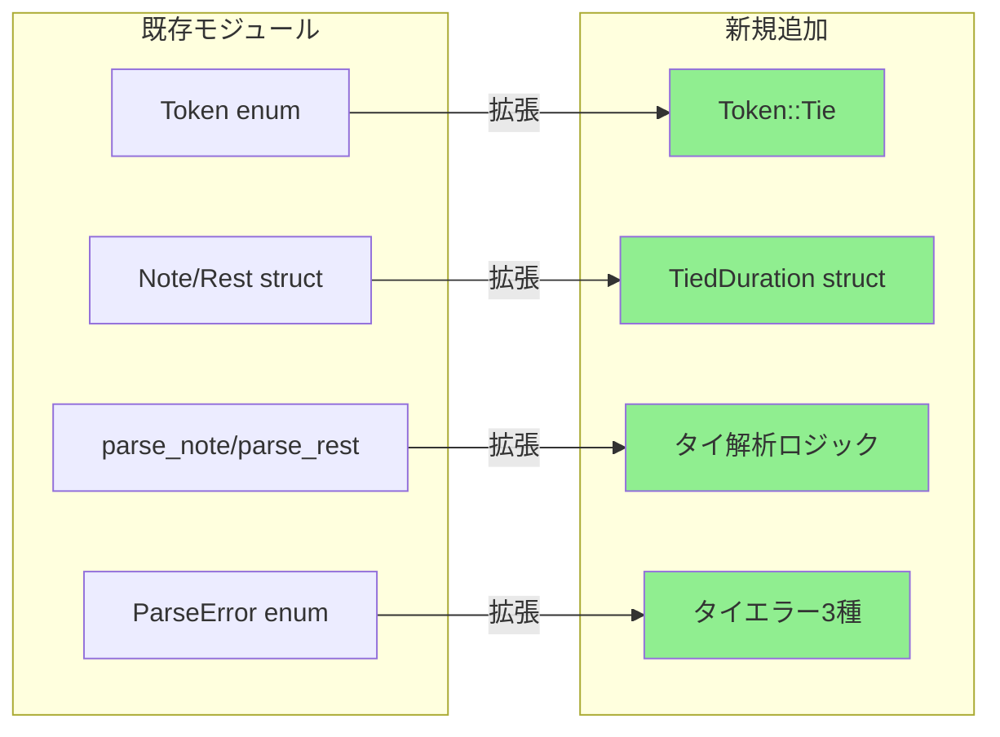
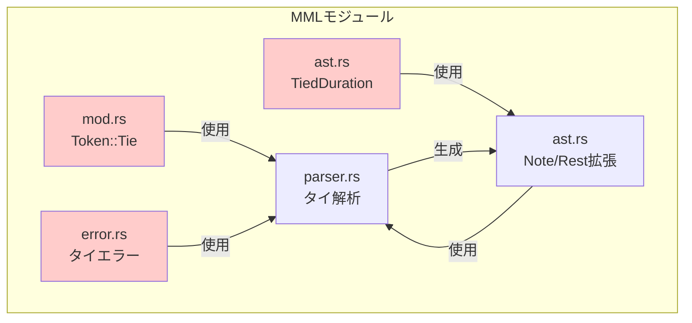
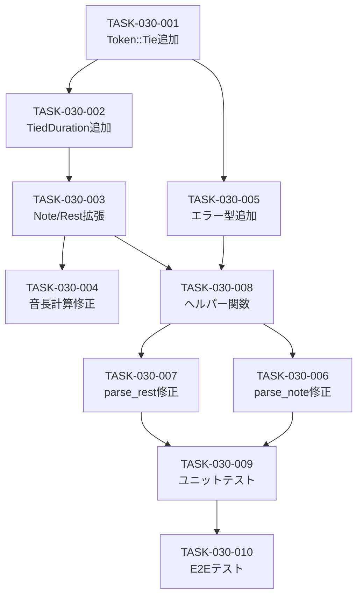

# MMLタイ記号 バックエンド設計書

## ドキュメント情報

| 項目 | 内容 |
|------|------|
| 機能ID | F-030 |
| 機能名 | MMLタイ記号 |
| 関連基本設計書 | [BASIC-CLI-005](../../basic/BASIC-CLI-005_Tie-Notation.md) |
| 関連詳細設計書 | [詳細設計書](./詳細設計書.md) |
| バージョン | 1.0.0 |
| 作成日 | 2026-01-12 |
| 最終更新日 | 2026-01-12 |
| 作成者 | detailed-design-writer |

---

## 1. 変更概要

### 1.1 目的

MMLタイ記号（`&`）の実装により、同一音程の音符を連結し、付点では表現できない複雑な音長を実現する。

### 1.2 変更対象モジュール

| モジュール | ファイルパス | 変更内容 | 変更レベル |
|-----------|------------|---------|-----------|
| トークン定義 | `src/mml/mod.rs` | `Token::Tie`追加 | 低 |
| AST定義 | `src/mml/ast.rs` | `TiedDuration`構造体追加、`Note`/`Rest`拡張 | 中 |
| パーサー | `src/mml/parser.rs` | タイ解析ロジック追加 | 高 |
| エラー定義 | `src/mml/error.rs` | タイ関連エラー3種追加 | 中 |

### 1.3 影響範囲



---

## 2. モジュール設計

### 2.1 依存関係図



### 2.2 インターフェース定義

#### 2.2.1 公開インターフェース

| 関数 | シグネチャ | 説明 |
|------|----------|------|
| `parse` | `fn parse(input: &str) -> Result<Mml, ParseError>` | MML文字列をASTに変換（タイ解析を含む） |

#### 2.2.2 内部インターフェース

| 関数 | シグネチャ | 説明 |
|------|----------|------|
| `parse_note` | `fn parse_note(&mut self) -> Result<Note, ParseError>` | 音符を解析（タイ処理を含む） |
| `parse_rest` | `fn parse_rest(&mut self) -> Result<Rest, ParseError>` | 休符を解析（タイ処理を含む） |
| `check_pitch` | `fn check_pitch(&self) -> bool` | 次のトークンが音符かチェック |
| `check_rest` | `fn check_rest(&self) -> bool` | 次のトークンが休符かチェック |
| `check_tie` | `fn check_tie(&self) -> bool` | 次のトークンがタイ記号かチェック |

---

## 3. 実装詳細

### 3.1 Token enum への追加

**ファイル**: `src/mml/mod.rs`

**変更箇所**: `Token` enum (行15-36付近)

```rust
#[derive(Debug, Clone, PartialEq)]
pub enum Token {
    Pitch(Pitch),
    Sharp,
    Flat,
    Dot,
    Number(u16),
    Octave,
    OctaveUp,
    OctaveDown,
    Tempo,
    Length,
    Volume,
    Rest,
    LoopStart,
    LoopEnd,
    LoopEscape,
    /// タイ記号 `&` - 同一音程の音符を連結
    Tie,  // 新規追加
    Eof,
}
```

**トークナイザーへの追加**:

```rust
pub fn tokenize(input: &str) -> Result<Vec<TokenWithPos>, ParseError> {
    // ... 既存のコード ...
    
    while let Some(&c) = chars.peek() {
        // ... 既存の処理 ...
        
        let token = match c.to_ascii_uppercase() {
            // ... 既存のマッチアーム ...
            
            ':' => {
                chars.next();
                let tok = TokenWithPos::new(Token::LoopEscape, position);
                position += 1;
                tok
            }
            // 新規追加: タイ記号
            '&' => {
                chars.next();
                let tok = TokenWithPos::new(Token::Tie, position);
                position += 1;
                tok
            }
            _ if c.is_ascii_digit() => {
                // ... 数値処理 ...
            }
            _ => {
                return Err(ParseError::UnexpectedCharacter {
                    character: c,
                    position,
                });
            }
        };
        tokens.push(token);
    }
    
    // ...
}
```

### 3.2 AST拡張

**ファイル**: `src/mml/ast.rs`

#### 3.2.1 TiedDuration 構造体追加

**挿入位置**: `Rest` 構造体の後（行94付近）

```rust
/// タイで連結された音符/休符の音長情報
///
/// # フィールド
/// - `duration`: 音長（1-64）、Noneの場合はデフォルト音長を使用
/// - `dots`: 付点の数（0-3）
///
/// # 例
/// ```ignore
/// // C4&8 の場合、&8 の部分
/// TiedDuration { duration: Some(8), dots: 0 }
///
/// // C4&8. の場合、&8. の部分
/// TiedDuration { duration: Some(8), dots: 1 }
///
/// // C4& の場合（音長省略、デフォルト音長使用）
/// TiedDuration { duration: None, dots: 0 }
/// ```
#[derive(Debug, Clone, PartialEq)]
pub struct TiedDuration {
    /// 音長（1-64）、Noneの場合はデフォルト音長を使用
    pub duration: Option<u8>,
    /// 付点の数（0-3）
    pub dots: u8,
}

impl TiedDuration {
    /// タイ音長を秒数に変換
    ///
    /// # Arguments
    /// * `bpm` - テンポ（30-300）
    /// * `default_length` - デフォルト音長（1-64）
    ///
    /// # Returns
    /// 音長（秒）
    #[must_use]
    pub fn duration_in_seconds(&self, bpm: u16, default_length: u8) -> f32 {
        let length = f32::from(self.duration.unwrap_or(default_length));
        if length == 0.0 {
            return 0.0;
        }
        let base_duration = 240.0 / (f32::from(bpm) * length);
        let dot_multiplier = calculate_dot_multiplier(self.dots);
        base_duration * dot_multiplier
    }
}
```

#### 3.2.2 Note 構造体拡張

**変更前**:
```rust
#[derive(Debug, Clone, PartialEq)]
pub struct Note {
    pub pitch: Pitch,
    pub accidental: Accidental,
    pub duration: Option<u8>,
    pub dots: u8,
}
```

**変更後**:
```rust
#[derive(Debug, Clone, PartialEq)]
pub struct Note {
    pub pitch: Pitch,
    pub accidental: Accidental,
    pub duration: Option<u8>,
    pub dots: u8,
    /// タイで連結された音長のリスト
    ///
    /// # 例
    /// - `C4` の場合: `tied_durations: vec![]`
    /// - `C4&8` の場合: `tied_durations: vec![TiedDuration { duration: Some(8), dots: 0 }]`
    /// - `C4&8&16` の場合: `tied_durations: vec![TiedDuration { duration: Some(8), dots: 0 }, TiedDuration { duration: Some(16), dots: 0 }]`
    pub tied_durations: Vec<TiedDuration>,
}
```

#### 3.2.3 Rest 構造体拡張

**変更前**:
```rust
#[derive(Debug, Clone, PartialEq)]
pub struct Rest {
    pub duration: Option<u8>,
    pub dots: u8,
}
```

**変更後**:
```rust
#[derive(Debug, Clone, PartialEq)]
pub struct Rest {
    pub duration: Option<u8>,
    pub dots: u8,
    /// タイで連結された休符の音長リスト
    ///
    /// # 例
    /// - `R4` の場合: `tied_durations: vec![]`
    /// - `R4&8` の場合: `tied_durations: vec![TiedDuration { duration: Some(8), dots: 0 }]`
    pub tied_durations: Vec<TiedDuration>,
}
```

#### 3.2.4 Note::duration_in_seconds 修正

**変更前**:
```rust
#[must_use]
pub fn duration_in_seconds(&self, bpm: u16, default_length: u8) -> f32 {
    let length = f32::from(self.duration.unwrap_or(default_length));
    if length == 0.0 {
        return 0.0;
    }
    let base_duration = 240.0 / (f32::from(bpm) * length);
    let dot_multiplier = calculate_dot_multiplier(self.dots);
    base_duration * dot_multiplier
}
```

**変更後**:
```rust
/// 音符の音長を秒数に変換（タイを含む）
///
/// # Arguments
/// * `bpm` - テンポ（30-300）
/// * `default_length` - デフォルト音長（1-64）
///
/// # Returns
/// 総音長（秒）= 基本音長 + タイで連結された音長の合計
#[must_use]
pub fn duration_in_seconds(&self, bpm: u16, default_length: u8) -> f32 {
    let length = f32::from(self.duration.unwrap_or(default_length));
    if length == 0.0 {
        return 0.0;
    }
    let base_duration = 240.0 / (f32::from(bpm) * length);
    let dot_multiplier = calculate_dot_multiplier(self.dots);
    let base = base_duration * dot_multiplier;
    
    // タイで連結された音長を合算
    let tied: f32 = self.tied_durations
        .iter()
        .map(|td| td.duration_in_seconds(bpm, default_length))
        .sum();
    
    base + tied
}
```

#### 3.2.5 Rest::duration_in_seconds 修正

**変更前**:
```rust
#[must_use]
pub fn duration_in_seconds(&self, bpm: u16, default_length: u8) -> f32 {
    let length = f32::from(self.duration.unwrap_or(default_length));
    if length == 0.0 {
        return 0.0;
    }
    let base_duration = 240.0 / (f32::from(bpm) * length);
    let dot_multiplier = calculate_dot_multiplier(self.dots);
    base_duration * dot_multiplier
}
```

**変更後**:
```rust
/// 休符の音長を秒数に変換（タイを含む）
///
/// # Arguments
/// * `bpm` - テンポ（30-300）
/// * `default_length` - デフォルト音長（1-64）
///
/// # Returns
/// 総休符長（秒）= 基本休符長 + タイで連結された休符長の合計
#[must_use]
pub fn duration_in_seconds(&self, bpm: u16, default_length: u8) -> f32 {
    let length = f32::from(self.duration.unwrap_or(default_length));
    if length == 0.0 {
        return 0.0;
    }
    let base_duration = 240.0 / (f32::from(bpm) * length);
    let dot_multiplier = calculate_dot_multiplier(self.dots);
    let base = base_duration * dot_multiplier;
    
    // タイで連結された休符長を合算
    let tied: f32 = self.tied_durations
        .iter()
        .map(|td| td.duration_in_seconds(bpm, default_length))
        .sum();
    
    base + tied
}
```

### 3.3 パーサー拡張

**ファイル**: `src/mml/parser.rs`

#### 3.3.1 ヘルパー関数追加

**挿入位置**: `check_number` 関数の後（行217付近）

```rust
/// 現在のトークンが音符（Pitch）かチェック
fn check_pitch(&self) -> bool {
    matches!(self.peek().token, Token::Pitch(_))
}

/// 現在のトークンが休符かチェック
fn check_rest(&self) -> bool {
    matches!(self.peek().token, Token::Rest)
}

/// 現在のトークンがタイ記号かチェック
fn check_tie(&self) -> bool {
    matches!(self.peek().token, Token::Tie)
}
```

#### 3.3.2 parse_note 関数の修正

**変更箇所**: `parse_note` 関数（行219-255付近）

タイ処理を追加（詳細は詳細設計書参照）。主要な変更点：

1. `tied_durations` ベクタの初期化
2. `while self.check_tie()` ループでタイ記号を検出
3. タイ後のパターン判定（数値のみ/音符+音長/休符/その他）
4. 音程検証（同一音程のみ許可）
5. エラーハンドリング（`TieDifferentPitch`, `TieNoFollowingNote`, `TieNoteAndRest`）

#### 3.3.3 parse_rest 関数の修正

**変更箇所**: `parse_rest` 関数（行257-275付近）

タイ処理を追加（詳細は詳細設計書参照）。主要な変更点：

1. `tied_durations` ベクタの初期化
2. `while self.check_tie()` ループでタイ記号を検出
3. タイ後のパターン判定（数値のみ/休符+音長/音符/その他）
4. エラーハンドリング（`TieNoFollowingNote`, `TieNoteAndRest`）

#### 3.3.4 parse_command での Token::Tie の処理

**変更箇所**: `parse_command` 関数（行100-134付近）

```rust
fn parse_command(&mut self) -> Result<Command, ParseError> {
    let token_with_pos = self.peek();
    match &token_with_pos.token {
        // ... 既存のマッチアーム ...
        Token::LoopEscape => Err(ParseError::LoopEscapeOutsideLoop {
            position: token_with_pos.position,
        }),
        // 新規追加: トップレベルのタイはエラー
        Token::Tie => Err(ParseError::UnexpectedToken {
            expected: "command".to_string(),
            found: Token::Tie,
            position: token_with_pos.position,
        }),
        Token::Eof => Err(ParseError::UnexpectedEof {
            // ...
        }),
        _ => Err(ParseError::UnexpectedToken {
            // ...
        }),
    }
}
```

#### 3.3.5 インポートの追加

**ファイル先頭**:

```rust
use super::{
    Accidental, Command, DefaultLength, Mml, Note, Octave, ParseError, Rest, Tempo, Token,
    TokenWithPos, Volume, VolumeValue,
    TiedDuration,  // 追加
};
```

### 3.4 エラー定義拡張

**ファイル**: `src/mml/error.rs`

#### 3.4.1 ParseError enum への追加

**挿入位置**: `LoopExpandedTooLarge` の後（行50付近）

```rust
#[derive(Debug, Clone, PartialEq)]
pub enum ParseError {
    // ... 既存のエラー型 ...
    
    /// ループ展開後のコマンド数が多すぎる（最大10,000）
    LoopExpandedTooLarge {
        max_commands: usize,
        actual: usize,
    },
    
    // 新規追加: タイ関連エラー
    
    /// MML-E012: 異なる音程のタイ
    ///
    /// タイは同一音程の音符のみ連結可能。異なる音程（例: C4&D4）はエラー。
    TieDifferentPitch {
        position: usize,
    },
    
    /// MML-E013: タイの後に音符/音長がない
    ///
    /// タイ記号の後には音符、休符、または音長が必要。
    /// 例: `C4&` (末尾で終了), `C4&T120` (タイ後にテンポコマンド)
    TieNoFollowingNote {
        position: usize,
    },
    
    /// MML-E014: 音符と休符のタイ
    ///
    /// 音符と休符をタイで連結することはできない。
    /// 例: `C4&R4`, `R4&C4`
    TieNoteAndRest {
        position: usize,
    },
}
```

#### 3.4.2 Display トレイト実装の追加

**変更箇所**: `impl std::fmt::Display for ParseError` ブロック（行53-150付近）

```rust
impl std::fmt::Display for ParseError {
    fn fmt(&self, f: &mut std::fmt::Formatter<'_>) -> std::fmt::Result {
        match self {
            // ... 既存のマッチアーム ...
            
            Self::LoopExpandedTooLarge {
                max_commands,
                actual,
            } => {
                write!(
                    f,
                    "ループ展開後のコマンド数が多すぎます（最大{max_commands}、実際: {actual}）"
                )
            }
            
            // 新規追加
            Self::TieDifferentPitch { position } => {
                write!(
                    f,
                    "位置 {position}: タイは同一音程の音符のみ連結できます"
                )
            }
            Self::TieNoFollowingNote { position } => {
                write!(
                    f,
                    "位置 {position}: タイの後に音符または音長がありません"
                )
            }
            Self::TieNoteAndRest { position } => {
                write!(
                    f,
                    "位置 {position}: 音符と休符をタイで連結できません"
                )
            }
        }
    }
}
```

---

## 4. データ構造

### 4.1 TiedDuration構造体

```rust
#[derive(Debug, Clone, PartialEq)]
pub struct TiedDuration {
    pub duration: Option<u8>,
    pub dots: u8,
}
```

**メモリレイアウト**:
```
┌─────────────┬─────────┐
│ Option<u8>  │ u8      │
│ (2 bytes)   │ (1 byte)│
└─────────────┴─────────┘
  2 bytes      1 byte
```

**合計サイズ**: 3バイト（パディング含む場合は4バイト）

### 4.2 Note構造体（拡張後）

```rust
#[derive(Debug, Clone, PartialEq)]
pub struct Note {
    pub pitch: Pitch,
    pub accidental: Accidental,
    pub duration: Option<u8>,
    pub dots: u8,
    pub tied_durations: Vec<TiedDuration>,
}
```

**メモリレイアウト**:
```
┌─────────┬─────────────┬─────────────┬─────────┬──────────────────┐
│ Pitch   │ Accidental  │ Option<u8>  │ u8      │ Vec<TiedDuration>│
│ (1 byte)│ (1 byte)    │ (2 bytes)   │ (1 byte)│ (24 bytes)       │
└─────────┴─────────────┴─────────────┴─────────┴──────────────────┘
  1 byte    1 byte        2 bytes       1 byte    24 bytes
```

**合計サイズ**: 29バイト（パディング含む場合は32バイト）

---

## 5. 性能考慮事項

### 5.1 性能要件

| ID | 要件 | 目標値 | 測定方法 |
|----|------|--------|---------|
| NFR-P-014 | タイ解析のオーバーヘッド | 5ms以内（100個のタイ） | ベンチマーク |
| NFR-P-015 | タイ音長計算のオーバーヘッド | 1%以内（合成時間の） | ベンチマーク |

### 5.2 性能最適化手法

#### 5.2.1 定数時間計算

```rust
// タイ音長計算はO(n)（nはタイの数）
let tied: f32 = self.tied_durations
    .iter()
    .map(|td| td.duration_in_seconds(bpm, default_length))
    .sum();
```

**効果**:
- 各タイ音長の計算はO(1)
- 合計: O(n)（nはタイの数）

#### 5.2.2 メモリ効率

```rust
// Vec<TiedDuration>は動的サイズ
// タイがない場合は空のベクタ（24バイト）
pub tied_durations: Vec<TiedDuration>,
```

**効果**:
- タイがない場合でもメモリオーバーヘッドは最小限（24バイト）
- タイがある場合のみ追加メモリを使用

---

## 6. テスト実装

### 6.1 ユニットテスト構成

**ファイル**: `tests/unit/mml_parser_tie_test.rs`

**テストカテゴリ**:

| カテゴリ | テスト数 | 説明 |
|---------|---------|------|
| 正常系 | 9件 | 基本的なタイ、複数連結、付点、空白許容 |
| 異常系 | 6件 | 異なる音程、タイ後に音符がない、音符と休符のタイ |
| エッジケース | 3件 | 超長音、超短音、デフォルト音長使用 |

### 6.2 主要テストケース実装例

#### 6.2.1 基本的なタイ（音長のみ）

```rust
#[test]
fn parse_tie_duration_only() {
    let mml = parse("C4&8").unwrap();
    assert_eq!(mml.commands.len(), 1);
    match &mml.commands[0] {
        Command::Note(n) => {
            assert_eq!(n.pitch, Pitch::C);
            assert_eq!(n.duration, Some(4));
            assert_eq!(n.tied_durations.len(), 1);
            assert_eq!(n.tied_durations[0].duration, Some(8));
            assert_eq!(n.tied_durations[0].dots, 0);
        }
        _ => panic!("Expected Note"),
    }
}
```

#### 6.2.2 異なる音程のタイ（エラー）

```rust
#[test]
fn parse_tie_different_pitch_error() {
    let err = parse("C4&D4").unwrap_err();
    match err {
        ParseError::TieDifferentPitch { position } => {
            // D の位置は 3 (C=0, 4=1, &=2, D=3)
            assert_eq!(position, 3);
        }
        _ => panic!("Expected TieDifferentPitch, got {:?}", err),
    }
}
```

#### 6.2.3 音長計算テスト

```rust
#[test]
fn note_duration_with_tie() {
    let note = Note {
        pitch: Pitch::C,
        accidental: Accidental::Natural,
        duration: Some(4),
        dots: 0,
        tied_durations: vec![
            TiedDuration { duration: Some(8), dots: 0 },
        ],
    };
    let duration = note.duration_in_seconds(120, 4);
    // C4&8 = 0.5 + 0.25 = 0.75秒
    assert!((duration - 0.75).abs() < 0.001);
}
```

### 6.3 テストカバレッジ目標

| 対象 | カバレッジ目標 | 測定方法 |
|------|--------------|---------|
| `parse_note()` | 100% | `cargo tarpaulin` |
| `parse_rest()` | 100% | `cargo tarpaulin` |
| `TiedDuration::duration_in_seconds()` | 100% | `cargo tarpaulin` |
| エラーハンドリング | 100% | 全エラーケースをテスト |

---

## 7. 実装タスク分割

### 7.1 タスク一覧

| タスクID | タスク名 | 対象ファイル | 見積もり行数 | 優先度 |
|---------|---------|------------|------------|--------|
| TASK-030-001 | Token::Tie追加 | `src/mml/mod.rs` | 10行 | 高 |
| TASK-030-002 | TiedDuration構造体追加 | `src/mml/ast.rs` | 30行 | 高 |
| TASK-030-003 | Note/Rest拡張 | `src/mml/ast.rs` | 10行 | 高 |
| TASK-030-004 | 音長計算メソッド修正 | `src/mml/ast.rs` | 20行 | 高 |
| TASK-030-005 | タイエラー追加 | `src/mml/error.rs` | 30行 | 高 |
| TASK-030-006 | parse_note修正 | `src/mml/parser.rs` | 80行 | 高 |
| TASK-030-007 | parse_rest修正 | `src/mml/parser.rs` | 60行 | 高 |
| TASK-030-008 | ヘルパー関数追加 | `src/mml/parser.rs` | 15行 | 中 |
| TASK-030-009 | ユニットテスト実装 | `tests/unit/mml_parser_tie_test.rs` | 200行 | 高 |
| TASK-030-010 | E2Eテスト実装 | `tests/cli_integration.rs` | 50行 | 中 |

**合計見積もり**: 505行

### 7.2 実装順序

#### Phase 1: 基盤実装（TASK-030-001〜005）
- Token::Tie追加、TiedDuration構造体追加、エラー型追加
- 見積もり: 80行
- 所要時間: 1日

#### Phase 2: パーサー実装（TASK-030-006〜008）
- parse_note/parse_rest修正、ヘルパー関数追加
- 見積もり: 155行
- 所要時間: 2日

#### Phase 3: テスト実装（TASK-030-009〜010）
- ユニットテスト、E2Eテスト
- 見積もり: 250行
- 所要時間: 1.5日

### 7.3 依存関係



---

## 8. 関連ドキュメント

| ドキュメント | パス | 説明 |
|-------------|------|------|
| 詳細設計書 | [詳細設計書.md](./詳細設計書.md) | MMLタイ記号機能の詳細設計 |
| 基本設計書 | [BASIC-CLI-005](../../basic/BASIC-CLI-005_Tie-Notation.md) | MMLタイ記号機能の基本設計 |
| 要件定義書 | REQ-CLI-005 | MMLタイ記号機能の要件定義 |
| 既存パーサー実装 | `src/mml/parser.rs` | 既存のMMLパーサー |
| 既存AST定義 | `src/mml/ast.rs` | 既存のAST定義 |

---

## 変更履歴

| 日付 | バージョン | 変更内容 | 担当者 |
|:---|:---|:---|:---|
| 2026-01-12 | 1.0.0 | 初版作成（既存5ファイルを統合） | detailed-design-writer |
