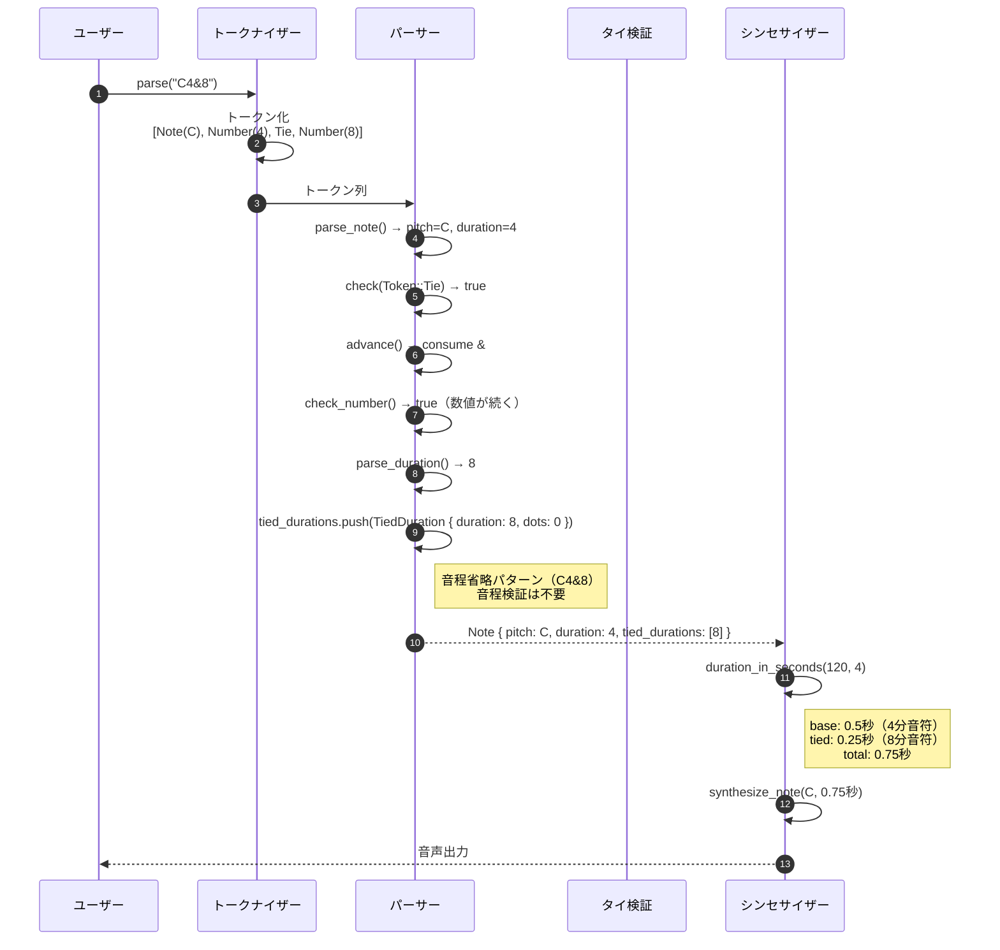
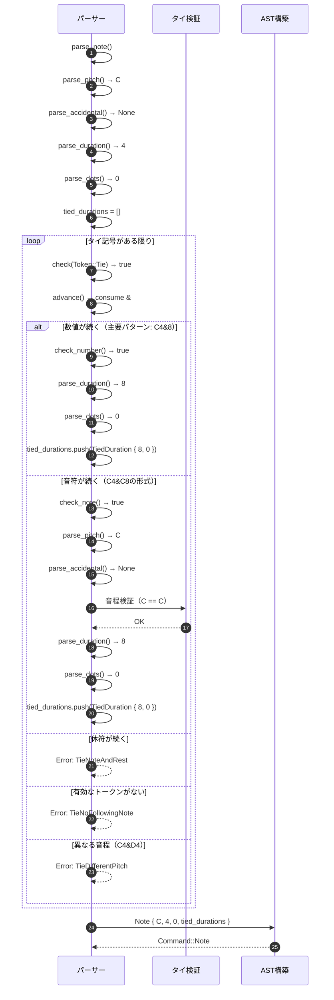
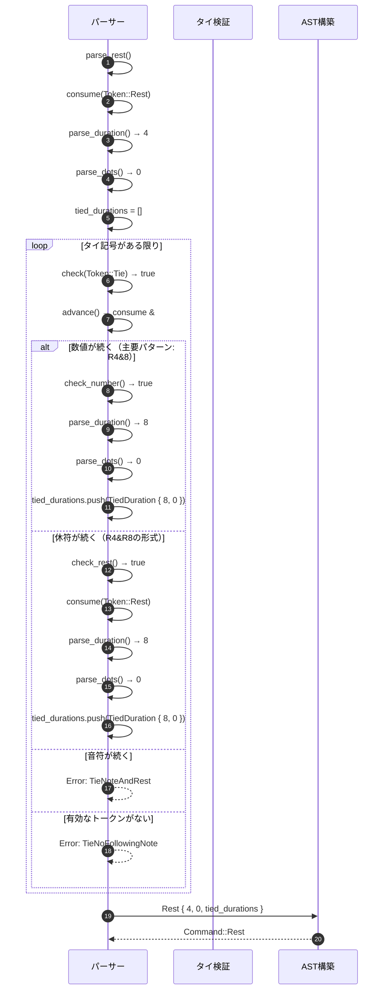
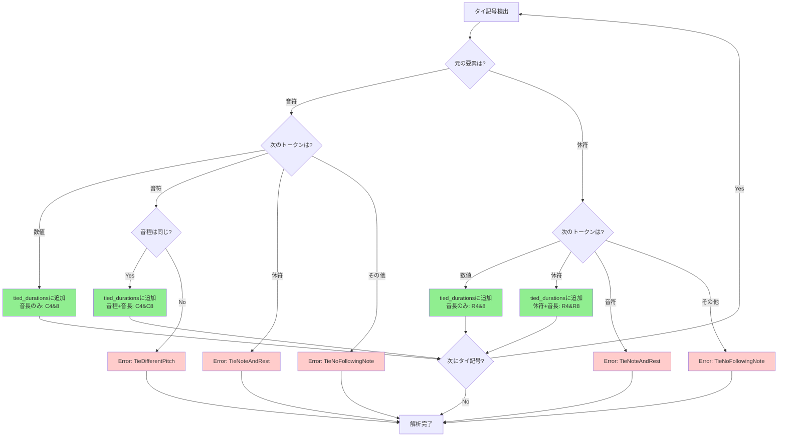

# MMLタイ記号 詳細設計書

## メタ情報

| 項目 | 内容 |
|------|------|
| ドキュメントID | DET-TIE-001 |
| 機能ID | F-030 |
| 機能名 | MMLタイ記号 |
| 関連基本設計書 | [BASIC-CLI-005](../../basic/BASIC-CLI-005_Tie-Notation.md) |
| 関連要件定義書 | REQ-CLI-005 |
| バージョン | 1.0.0 |
| 作成日 | 2026-01-12 |
| 最終更新日 | 2026-01-12 |
| 作成者 | detailed-design-writer |

---

## 1. 概要

### 1.1 機能概要

MMLタイ記号（`&`）機能は、同一音程の音符を連結し、付点では表現できない複雑な音長を実現する機能です。

**主な機能**:
- 基本的なタイ: `C4&8` → 4分音符 + 8分音符 = 3/8拍
- 複数連結: `C4&8&16` → 無制限の連鎖
- 小節をまたぐ長い音: `C1&1` → 全音符2つ分 = 2小節分
- 休符のタイ: `R4&8` → 付点4分休符相当
- タイ後の付点: `C4&8.` → タイ後の音符に付点指定可能
- 空白許容: `C4 & 8` → タイ記号の前後に空白があっても動作

### 1.2 処理フロー概要



---

## 2. 機能要件

### 2.1 対象機能

| 機能ID | 機能名 | 概要 | 優先度 |
|--------|--------|------|--------|
| F-030 | MMLタイ記号 | `&` で同一音程の音符を連結 | 必須 |

### 2.2 ビジネスルール

| ルールID | 内容 | 検証方法 |
|---------|------|---------|
| BR-084 | タイで連結できるのは同一音程の音符のみ | パーサーで音程検証 |
| BR-085 | 異なる音程のタイはエラー（例: `C4&D4` は不可） | パーサーでエラー検出 |
| BR-086 | 休符のタイは許可（`R4&8` = 付点4分休符相当） | パーサーで休符タイ処理 |
| BR-087 | タイ後の音符に付点も指定可能（`C4&8.`） | パーサーで付点解析 |
| BR-088 | タイの連鎖は無制限（`C4&8&16&32` など） | パーサーでループ処理 |
| BR-089 | タイ記号の前後に空白があっても許可（`C4 & 8`） | トークナイザーで空白除去 |

---

## 3. 詳細仕様

### 3.1 対応パターン

#### 3.1.1 音符のタイ

| パターン | 例 | 説明 |
|---------|-----|------|
| 音長のみ（主要） | `C4&8` | タイ後に数値のみ。音程は省略 |
| 音程+音長 | `C4&C8` | タイ後に音程も指定。同一音程のみ許可 |
| 複数連結 | `C4&8&16` | 無制限の連鎖 |
| 付点付き | `C4&8.` | タイ後の音符に付点 |
| 空白許容 | `C4 & 8` | タイ記号の前後に空白 |

#### 3.1.2 休符のタイ

| パターン | 例 | 説明 |
|---------|-----|------|
| 音長のみ（主要） | `R4&8` | タイ後に数値のみ |
| 休符+音長 | `R4&R8` | タイ後に休符トークンも指定 |

### 3.2 音長計算式

#### 3.2.1 基本計算

```
base_duration = 240.0 / (bpm * length)
```

- 4分音符 (length=4) at 120 BPM: `240.0 / (120 * 4) = 0.5秒`
- 8分音符 (length=8) at 120 BPM: `240.0 / (120 * 8) = 0.25秒`

#### 3.2.2 付点の計算

```
dot_multiplier = 1.0 + 0.5 + 0.25 + ... (付点の数分)
               = 1.0 (0付点)
               = 1.5 (1付点)
               = 1.75 (2付点)
               = 1.875 (3付点)
```

#### 3.2.3 タイの計算

```
total_duration = base_duration * dot_multiplier 
               + Σ(tied_duration[i] * tied_dot_multiplier[i])
```

**例: `C4&8` at 120 BPM**
- 基本: 4分音符 = 0.5秒
- タイ: 8分音符 = 0.25秒
- 合計: 0.5 + 0.25 = 0.75秒

**例: `C4&8.` at 120 BPM**
- 基本: 4分音符 = 0.5秒
- タイ: 付点8分音符 = 0.25 * 1.5 = 0.375秒
- 合計: 0.5 + 0.375 = 0.875秒

---

## 4. 処理フロー

### 4.1 タイ解析フロー（音符）



### 4.2 タイ解析フロー（休符）



### 4.3 タイ音長計算フロー

```mermaid
sequenceDiagram
    autonumber
    participant Syn as シンセサイザー
    participant Note as Note構造体
    participant Tied as TiedDuration

    Syn->>Note: duration_in_seconds(120, 4)
    
    Note->>Note: calculate_base_duration(120, 4)
    Note->>Note: base = 60.0 / 120 * 4 / 4 = 0.5秒
    
    loop tied_durations
        Note->>Tied: duration_in_seconds(120, 4)
        Tied->>Tied: length = 8
        Tied->>Tied: base = 60.0 / 120 * 4 / 8 = 0.25秒
        Tied-->>Note: 0.25秒
    end
    
    Note->>Note: total = 0.5 + 0.25 = 0.75秒
    Note-->>Syn: 0.75秒
```

### 4.4 タイエラー検出フロー



---

## 5. エラーハンドリング

### 5.1 エラーケース一覧

| エラーコード | エラー型 | 説明 | 発生条件 | メッセージ例 |
|-------------|---------|------|---------|-------------|
| MML-E012 | `TieDifferentPitch` | 異なる音程のタイ | `C4&D4` | `位置 3: タイは同一音程の音符のみ連結できます` |
| MML-E013 | `TieNoFollowingNote` | タイ後に音符がない | `C4&` | `位置 2: タイの後に音符または音長がありません` |
| MML-E014 | `TieNoteAndRest` | 音符と休符のタイ | `C4&R4`, `R4&C4` | `位置 2: 音符と休符をタイで連結できません` |

### 5.2 エラー発生箇所のまとめ

| エラー | 発生箇所 | 発生条件 |
|--------|---------|---------|
| `TieDifferentPitch` | `parse_note` | 音程指定パターン（`C4&D4`）で音程が異なる |
| `TieNoFollowingNote` | `parse_note`, `parse_rest` | タイ後に数値でも音符/休符でもないトークン |
| `TieNoteAndRest` | `parse_note` | 音符からのタイで休符が続く |
| `TieNoteAndRest` | `parse_rest` | 休符からのタイで音符が続く |

---

## 6. テストケース

### 6.1 正常系テストケース

| テストID | 入力 | 期待される動作 | 説明 |
|---------|------|--------------|------|
| TC-030-001 | `C4&8` | 3/8拍の音が発音される | 基本的なタイ |
| TC-030-002 | `C8&8` | 1/4拍の音が発音される（C4相当） | 同音タイ |
| TC-030-003 | `C4&4` | 1/2拍の音が発音される（C2相当） | 同音長タイ |
| TC-030-004 | `C4.&8` | 7/16拍の音が発音される | タイ前の付点 |
| TC-030-005 | `C4&8.` | 7/16拍の音が発音される | タイ後の付点 |
| TC-030-006 | `C4&8&16` | 7/16拍の音が発音される | 複数連結 |
| TC-030-007 | `R4&8` | 3/8拍の休符が生成される | 休符のタイ |
| TC-030-008 | `C1&1` | 2拍の音が発音される（2小節分） | 小節をまたぐ長い音 |
| TC-030-009 | `C4 & 8` | 3/8拍の音が発音される（空白許容） | 空白許容 |

### 6.2 異常系テストケース

| テストID | 入力 | 期待されるエラー | エラーメッセージ |
|---------|------|----------------|----------------|
| TC-030-010 | `C4&D4` | `TieDifferentPitch` | `位置 3: タイは同一音程の音符のみ連結できます` |
| TC-030-011 | `C4&` | `TieNoFollowingNote` | `位置 2: タイの後に音符または音長がありません` |
| TC-030-012 | `C4&R4` | `TieNoteAndRest` | `位置 2: 音符と休符をタイで連結できません` |
| TC-030-013 | `&C4` | `UnexpectedToken` | トップレベルのタイはエラー |

### 6.3 エッジケーステストケース

| テストID | 入力 | 期待される動作 | 説明 |
|---------|------|--------------|------|
| TC-030-201 | `C1&1&1&1` (4全音符) at 60 BPM | 16秒の音が発音される | 超長音 |
| TC-030-202 | `C64&64` at 300 BPM | 約0.013秒の音が発音される | 超短音 |
| TC-030-203 | `C&` (duration=None) | デフォルト音長を適用 | デフォルト音長使用 |

---

## 7. 設計書一覧

| 設計書 | パス | 説明 |
|--------|------|------|
| バックエンド設計書 | [./バックエンド設計書.md](./バックエンド設計書.md) | 実装詳細、コード差分、モジュール設計 |

---

## 8. 関連ドキュメント

| ドキュメント | パス | 説明 |
|-------------|------|------|
| 基本設計書 | [BASIC-CLI-005](../../basic/BASIC-CLI-005_Tie-Notation.md) | MMLタイ記号機能の基本設計 |
| 要件定義書 | REQ-CLI-005 | MMLタイ記号機能の要件定義 |

---

## 変更履歴

| 日付 | バージョン | 変更内容 | 担当者 |
|:---|:---|:---|:---|
| 2026-01-12 | 1.0.0 | 初版作成（既存5ファイルを統合） | detailed-design-writer |
