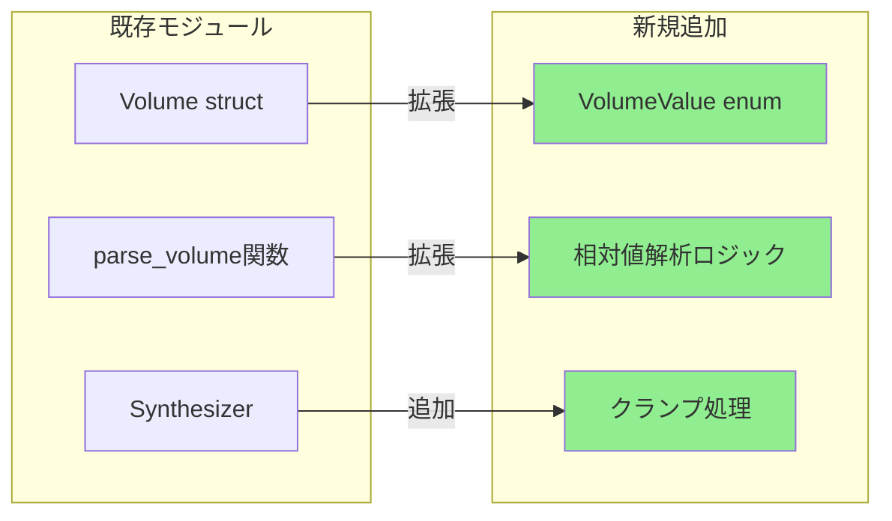
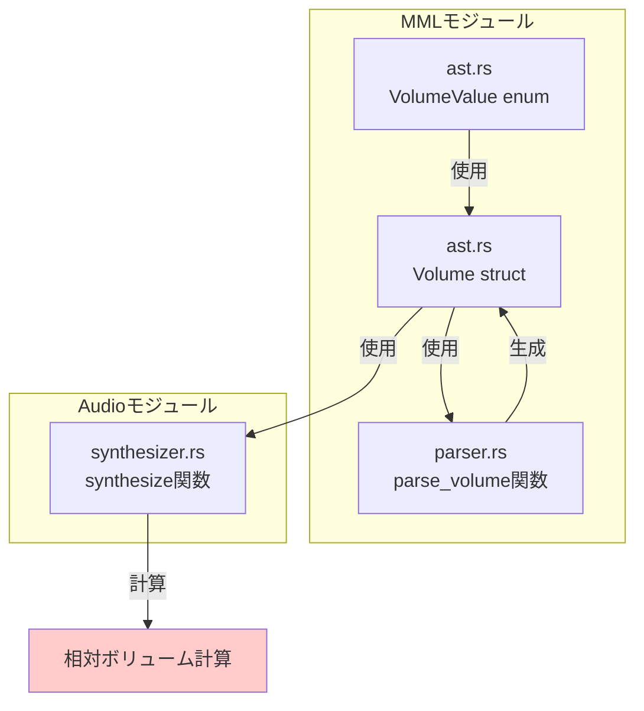
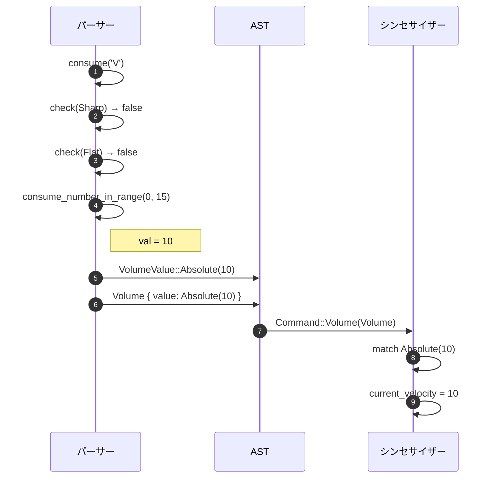
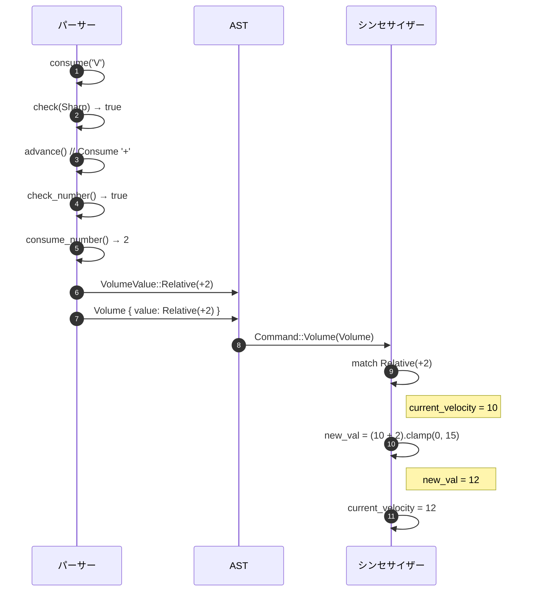
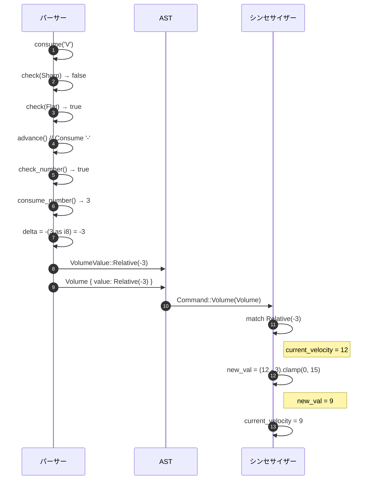
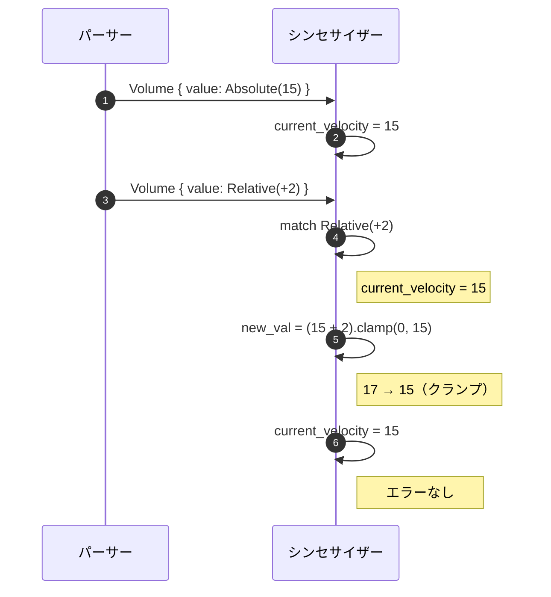
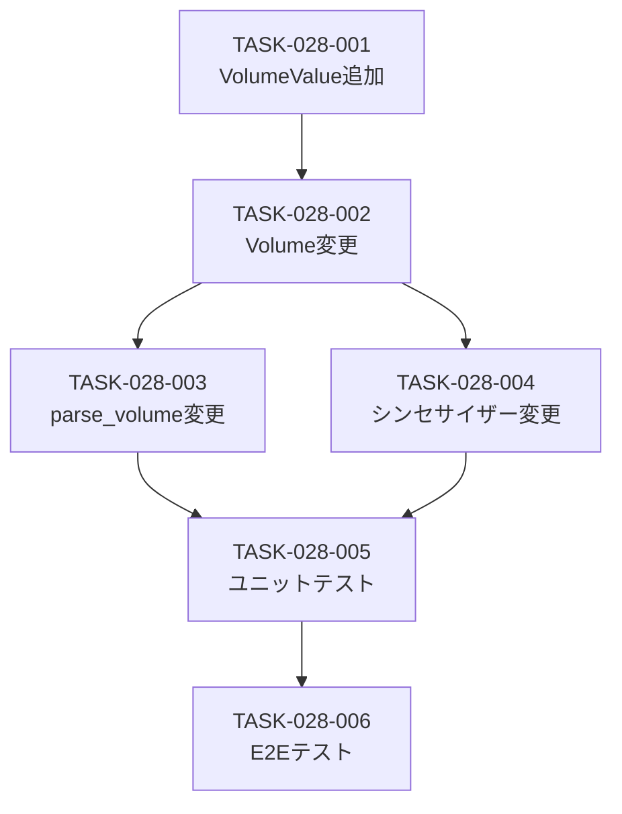

# 相対ボリューム指定 バックエンド設計書

## ドキュメント情報

| 項目 | 内容 |
|------|------|
| 機能ID | F-028 |
| 機能名 | 相対ボリューム指定 |
| 関連基本設計書 | [BASIC-CLI-004](../../basic/BASIC-CLI-004_MML-Advanced-Features.md) |
| 関連詳細設計書 | [詳細設計書](./詳細設計書.md) |
| バージョン | 1.0.0 |
| 作成日 | 2026-01-12 |
| 最終更新日 | 2026-01-12 |
| 作成者 | detailed-design-writer |

---

## 1. 変更概要

### 1.1 目的

相対ボリューム指定の実装により、音量の動的な増減を簡潔に記述可能にする。従来は絶対値（`V10`等）のみでしたが、相対値（`V+2`, `V-3`）を使用することで、現在のボリュームからの増減を記述できる。

### 1.2 変更対象モジュール

| モジュール | ファイルパス | 変更内容 | 変更レベル |
|-----------|------------|---------|-----------|
| AST定義 | `src/mml/ast.rs` | `VolumeValue`列挙型追加、`Volume`構造体変更 | 中 |
| パーサー | `src/mml/parser.rs` | `parse_volume()`関数変更 | 高 |
| シンセサイザー | `src/audio/synthesizer.rs` | 相対ボリューム計算処理追加 | 中 |

### 1.3 影響範囲



---

## 2. モジュール設計

### 2.1 依存関係図



### 2.2 インターフェース定義

#### 2.2.1 公開インターフェース

| 関数 | シグネチャ | 説明 |
|------|----------|------|
| `parse` | `fn parse(input: &str) -> Result<Mml, ParseError>` | MML文字列をASTに変換（既存関数、ボリューム解析を拡張） |

#### 2.2.2 内部インターフェース

| 関数 | シグネチャ | 説明 |
|------|----------|------|
| `parse_volume` | `fn parse_volume(&mut self) -> Result<Volume, ParseError>` | ボリュームコマンドを解析（絶対値/相対値対応） |
| `check` | `fn check(&self, token: Token) -> bool` | 次のトークンが指定されたトークンかチェック |
| `check_number` | `fn check_number(&self) -> bool` | 次のトークンがNumberかチェック |
| `consume_number` | `fn consume_number(&mut self) -> Result<u16, ParseError>` | 数値を消費（範囲チェックなし） |

---

## 3. 実装詳細

### 3.1 AST拡張

#### 3.1.1 VolumeValue列挙型の追加

**ファイル**: `src/mml/ast.rs`

**追加内容**:

```rust
/// ボリューム値の種類
///
/// # バリアント
/// - `Absolute(u8)`: 絶対値（0-15）
/// - `Relative(i8)`: 相対値（-15〜+15）
///
/// # 例
/// ```
/// // V10 の場合
/// VolumeValue::Absolute(10)
///
/// // V+2 の場合
/// VolumeValue::Relative(2)
///
/// // V-3 の場合
/// VolumeValue::Relative(-3)
/// ```
#[derive(Debug, Clone, PartialEq, Eq)]
pub enum VolumeValue {
    /// 絶対値（0-15）
    Absolute(u8),
    /// 相対値（-15〜+15）
    Relative(i8),
}
```

**データ構造の詳細**:

| バリアント | 型 | 説明 | 制約 |
|-----------|-----|------|------|
| `Absolute(u8)` | `u8` | 絶対値（0-15） | 0 ≤ value ≤ 15 |
| `Relative(i8)` | `i8` | 相対値（-15〜+15） | -15 ≤ value ≤ +15 |

**メモリレイアウト**:
- 列挙型のタグ: 1バイト
- 値: 1バイト（u8またはi8）
- 合計: 2バイト（パディング含む）

#### 3.1.2 Volume構造体の変更

**ファイル**: `src/mml/ast.rs`

**変更前**:
```rust
#[derive(Debug, Clone, PartialEq, Eq)]
pub struct Volume {
    pub value: u8,
}
```

**変更後**:
```rust
#[derive(Debug, Clone, PartialEq, Eq)]
pub struct Volume {
    /// 絶対値（0-15）または相対値（-15〜+15）
    pub value: VolumeValue,
}
```

**変更理由**:
- 絶対値と相対値を区別するため
- 型安全性を向上させるため
- シンセサイザー側で適切な処理を選択できるようにするため

### 3.2 パーサー拡張

#### 3.2.1 parse_volume関数の変更

**ファイル**: `src/mml/parser.rs`

**変更前**:
```rust
fn parse_volume(&mut self) -> Result<Volume, ParseError> {
    self.advance(); // Consume Volume
    // Range 0-15 verified, safe to cast to u8
    #[allow(clippy::cast_possible_truncation)]
    let value = self.consume_number_in_range(0, 15)? as u8;
    Ok(Volume { value })
}
```

**変更後**:
```rust
/// ボリュームコマンドを解析（絶対値/相対値対応）
///
/// # 構文
/// - `V<0-15>` - 絶対値指定
/// - `V+<n>` - 相対値指定（増加）
/// - `V-<n>` - 相対値指定（減少）
/// - `V+` - デフォルト増加（+1）
/// - `V-` - デフォルト減少（-1）
///
/// # エラー
/// - `InvalidNumber` - 絶対値が範囲外（0-15以外）
///
/// # 注意
/// - 相対値の範囲チェックはシンセサイザー側で実施（クランプ処理）
/// - `+`と`-`は既存の`Token::Sharp`と`Token::Flat`を流用
///
/// # アルゴリズム
/// 1. `V`を消費
/// 2. 次のトークンをチェック
///    - `Sharp`（+）の場合: 相対値（増加）
///    - `Flat`（-）の場合: 相対値（減少）
///    - それ以外: 絶対値
/// 3. 数値を解析（相対値の場合はデフォルト値1を使用）
/// 4. `VolumeValue`を生成
fn parse_volume(&mut self) -> Result<Volume, ParseError> {
    self.advance(); // Consume 'V'
    
    // 相対指定のチェック
    let value = if self.check(Token::Sharp) {
        // V+ の場合（Sharpトークンを流用）
        self.advance(); // Consume '+'
        let delta = if self.check_number() {
            // オーバーフロー防止: 15を上限としてクランプしてからキャスト
            let raw = self.consume_number()?;
            #[allow(clippy::cast_possible_truncation)]
            let clamped = raw.min(15) as i8;
            clamped
        } else {
            1  // デフォルト増減値
        };
        VolumeValue::Relative(delta)
    } else if self.check(Token::Flat) {
        // V- の場合（Flatトークンを流用）
        self.advance(); // Consume '-'
        let delta = if self.check_number() {
            // オーバーフロー防止: 15を上限としてクランプしてからキャスト
            let raw = self.consume_number()?;
            #[allow(clippy::cast_possible_truncation)]
            let clamped = -(raw.min(15) as i8);
            clamped
        } else {
            -1  // デフォルト増減値
        };
        VolumeValue::Relative(delta)
    } else {
        // 絶対値
        let val = self.consume_number_in_range(0, 15)?;
        #[allow(clippy::cast_possible_truncation)]
        VolumeValue::Absolute(val as u8)
    };
    
    Ok(Volume { value })
}

/// 次のトークンがNumberかチェック
fn check_number(&self) -> bool {
    matches!(self.peek().token, Token::Number(_))
}

/// 次のトークンが指定されたトークンかチェック
fn check(&self, token: Token) -> bool {
    std::mem::discriminant(&self.peek().token) == std::mem::discriminant(&token)
}

/// 数値を消費（範囲チェックなし）
fn consume_number(&mut self) -> Result<u16, ParseError> {
    let token_with_pos = self.peek();
    if let Token::Number(val) = token_with_pos.token {
        self.advance();
        Ok(val)
    } else {
        Err(ParseError::UnexpectedToken {
            expected: "number".to_string(),
            found: token_with_pos.token.clone(),
            position: token_with_pos.position,
        })
    }
}
```

**実装のポイント**:
- **トークン流用**: `+`と`-`は既存の`Token::Sharp`と`Token::Flat`を流用
  - 新規トークン追加不要
  - トークナイザーの変更不要
- **デフォルト値**: `V+`または`V-`のみの場合はデフォルト増減値1を使用
- **範囲チェック**: 絶対値の範囲チェックは既存の`consume_number_in_range()`を使用
- **オーバーフロー防止**: 相対値の数値は`min(15)`でクランプしてからi8にキャスト
  - `V+128`のような大きな値も安全に処理（15にクランプ）
- **最終クランプ**: シンセサイザー側で0-15にクランプ（絶対値への変換時）

**時間計算量**: O(1)（トークン数に依存しない）

### 3.3 シンセサイザー拡張

#### 3.3.1 ボリューム処理の変更

**ファイル**: `src/audio/synthesizer.rs`

**変更箇所**: `synthesize()`関数内のボリューム処理

> **注意**: 現在のシンセサイザーでは `current_velocity` はローカル変数として管理されている（構造体ではない）。本設計もその方式を維持する。

**変更前**:
```rust
// synthesize()関数内
let mut current_velocity = 100;  // ← この値を10に変更

// ... （中略）

Command::Volume(v) => current_velocity = v.value,
```

**変更後**:
```rust
// synthesize()関数内
let mut current_velocity: u8 = 10;  // デフォルト値V10（BR-074準拠）

// ... （中略）

Command::Volume(v) => {
    current_velocity = match v.value {
        VolumeValue::Absolute(val) => val,
        VolumeValue::Relative(delta) => {
            // 現在値に加算/減算し、0-15にクランプ
            #[allow(clippy::cast_possible_wrap)]
            let new_val = (current_velocity as i8 + delta).clamp(0, 15);
            #[allow(clippy::cast_sign_loss)]
            new_val as u8
        }
    };
}
```

**実装のポイント**:
- **初期値変更**: `current_velocity` の初期値を `100` から `10` に変更（デフォルトV10）
- **絶対値**: 直接設定（0-15の範囲）
- **相対値**: 現在値に加算/減算し、0-15にクランプ
- **クランプ処理**: `i8::clamp()`を使用して範囲制限
  - 上限: 15
  - 下限: 0
- **型変換**: `u8` → `i8` → `u8`（安全な変換）

#### 3.3.2 音量計算の変更

**変更箇所**: `generate_note_samples()`関数内のマスターゲイン計算

**変更前**:
```rust
let master_gain = (f32::from(self.volume) / 100.0) * (f32::from(velocity) / 100.0);
```

**変更後**:
```rust
// velocityは0-15の範囲、15で最大音量
let master_gain = (f32::from(self.volume) / 100.0) * (f32::from(velocity) / 15.0);
```

**理由**:
- `velocity`（`current_velocity`から渡される）が0-15の範囲になるため
- `velocity = 15` で最大音量（1.0）となるように調整

**クランプ処理の詳細**:

| 現在値 | 相対値 | 計算結果 | クランプ後 |
|--------|--------|---------|----------|
| 10 | +2 | 12 | 12 |
| 15 | +2 | 17 | 15（上限） |
| 5 | -3 | 2 | 2 |
| 0 | -2 | -2 | 0（下限） |
| 12 | +5 | 17 | 15（上限） |
| 3 | -10 | -7 | 0（下限） |

**時間計算量**: O(1)（定数時間）

---

## 4. 処理フロー

### 4.1 絶対値指定の処理フロー



### 4.2 相対値指定（増加）の処理フロー



### 4.3 相対値指定（減少）の処理フロー



### 4.4 クランプ処理の処理フロー



---

## 5. データ構造

### 5.1 VolumeValue列挙型

```rust
#[derive(Debug, Clone, PartialEq, Eq)]
pub enum VolumeValue {
    Absolute(u8),
    Relative(i8),
}
```

**メモリレイアウト**:
```
┌─────────┬─────────┐
│ Tag (1) │ Value (1)│
└─────────┴─────────┘
  1 byte    1 byte
```

**合計サイズ**: 2バイト（パディング含む）

### 5.2 Volume構造体

```rust
#[derive(Debug, Clone, PartialEq, Eq)]
pub struct Volume {
    pub value: VolumeValue,
}
```

**メモリレイアウト**:
```
┌──────────────────┐
│ VolumeValue (2)  │
└──────────────────┘
     2 bytes
```

**合計サイズ**: 2バイト（既存と同じ）

---

## 6. エラーハンドリング

### 6.1 エラーケース一覧

| エラーケース | エラー型 | 検出タイミング | メッセージ例 |
|-------------|---------|--------------|-------------|
| 絶対値が範囲外（16以上） | `InvalidNumber` | `parse_volume()`で絶対値解析時 | `Invalid number at position 2\nFound: 20\nExpected: 0-15` |
| 絶対値が範囲外（負の値） | `InvalidNumber` | `parse_volume()`で絶対値解析時 | `Invalid number at position 2\nFound: -5\nExpected: 0-15` |

### 6.2 クランプ処理（エラーにしない）

相対値指定で範囲外になった場合は、エラーにせず0-15にクランプします。

**理由**:
- ユーザーの意図を尊重（音量を上げたい/下げたい）
- エラーで中断するよりも、最大/最小値で継続する方が実用的
- 既存のオクターブ変更（`OctaveUp`, `OctaveDown`）と同じ挙動

**クランプ処理の実装**:
```rust
let new_val = (current_velocity as i8 + delta).clamp(0, 15);
```

---

## 7. テスト実装

### 7.1 ユニットテスト構成

**ファイル**: `tests/unit/mml_parser_volume_test.rs`

**テストカテゴリ**:

| カテゴリ | テスト数 | 説明 |
|---------|---------|------|
| 正常系 | 8件 | 絶対値、相対値、デフォルト値、クランプ |
| 異常系 | 2件 | 範囲外の絶対値 |
| エッジケース | 5件 | 最小値、最大値、極端な相対値 |
| 統合テスト | 4件 | 他のMMLコマンドとの組み合わせ |

### 7.2 主要テストケース実装例

#### 7.2.1 絶対値指定テスト

```rust
#[test]
fn test_volume_absolute() {
    let input = "V10 C";
    let mml = parse(input).unwrap();
    
    assert_eq!(mml.commands.len(), 2);
    assert!(matches!(
        mml.commands[0],
        Command::Volume(Volume { value: VolumeValue::Absolute(10) })
    ));
}
```

#### 7.2.2 相対値指定テスト

```rust
#[test]
fn test_volume_relative_increase() {
    let input = "V10 C V+2 D";
    let mml = parse(input).unwrap();
    
    assert!(matches!(
        mml.commands[0],
        Command::Volume(Volume { value: VolumeValue::Absolute(10) })
    ));
    assert!(matches!(
        mml.commands[2],
        Command::Volume(Volume { value: VolumeValue::Relative(2) })
    ));
}

#[test]
fn test_volume_relative_decrease() {
    let input = "V10 C V-3 D";
    let mml = parse(input).unwrap();
    
    assert!(matches!(
        mml.commands[2],
        Command::Volume(Volume { value: VolumeValue::Relative(-3) })
    ));
}
```

#### 7.2.3 デフォルト値テスト

```rust
#[test]
fn test_volume_default_increase() {
    let input = "V10 C V+ D";
    let mml = parse(input).unwrap();
    
    assert!(matches!(
        mml.commands[2],
        Command::Volume(Volume { value: VolumeValue::Relative(1) })
    ));
}

#[test]
fn test_volume_default_decrease() {
    let input = "V10 C V- D";
    let mml = parse(input).unwrap();
    
    assert!(matches!(
        mml.commands[2],
        Command::Volume(Volume { value: VolumeValue::Relative(-1) })
    ));
}
```

#### 7.2.4 シンセサイザーテスト

```rust
// tests/unit/audio_synthesizer_volume_test.rs

use sine_mml::audio::Synthesizer;
use sine_mml::mml::parse;

#[test]
fn test_synthesizer_volume_clamp_upper() {
    let input = "V15 C V+2 D";
    let mml = parse(input).unwrap();
    
    let synthesizer = Synthesizer::new(/* ... */);
    let samples = synthesizer.synthesize(&mml, /* ... */).unwrap();
    
    // クランプされて15になることを確認
    // （実際のボリューム値は音声サンプルから検証）
    assert!(samples.len() > 0);
}

#[test]
fn test_synthesizer_volume_clamp_lower() {
    let input = "V0 C V-2 D";
    let mml = parse(input).unwrap();
    
    let synthesizer = Synthesizer::new(/* ... */);
    let samples = synthesizer.synthesize(&mml, /* ... */).unwrap();
    
    // クランプされて0になることを確認
    assert!(samples.len() > 0);
}
```

### 7.3 テストカバレッジ目標

| 対象 | カバレッジ目標 | 測定方法 |
|------|--------------|---------|
| `parse_volume()` | 100% | `cargo tarpaulin` |
| `VolumeValue` | 100% | `cargo tarpaulin` |
| シンセサイザーのボリューム処理 | 100% | `cargo tarpaulin` |
| エラーハンドリング | 100% | 全エラーケースをテスト |

---

## 8. 性能考慮事項

### 8.1 性能要件

| ID | 要件 | 目標値 | 測定方法 |
|----|------|--------|---------|
| NFR-P-014 | ボリューム計算のオーバーヘッド | 1%以内（合成時間の） | ベンチマークテスト |
| NFR-P-015 | 相対値計算の時間計算量 | O(1) | 理論的解析 |
| NFR-P-016 | メモリ使用量 | 2バイト/Volume（既存と同じ） | メモリプロファイラ |

### 8.2 性能最適化手法

#### 8.2.1 定数時間計算

```rust
// 相対値計算はO(1)
let new_val = (current_velocity as i8 + delta).clamp(0, 15);
```

**効果**:
- 加算/減算は定数時間
- `clamp()`も定数時間
- 合計: O(1)

#### 8.2.2 メモリ効率

```rust
// VolumeValueは2バイト（既存のu8と同じサイズ）
pub enum VolumeValue {
    Absolute(u8),  // 1バイト + タグ1バイト
    Relative(i8),  // 1バイト + タグ1バイト
}
```

**効果**:
- 既存の`u8`と同じメモリサイズ
- メモリオーバーヘッドなし

---

## 9. セキュリティ考慮事項

### 9.1 整数オーバーフロー防止

| 対策 | 実装箇所 | 詳細 |
|------|---------|------|
| `i8::clamp()`使用 | シンセサイザー | 安全に範囲制限 |
| 型変換の明示 | パーサー | `#[allow(clippy::cast_possible_wrap)]`で意図を明示 |

### 9.2 入力値検証

| 項目 | 対策 | 実装箇所 |
|------|------|---------|
| 絶対値の範囲チェック | `consume_number_in_range(0, 15)` | パーサー |
| 相対値のクランプ | `clamp(0, 15)` | シンセサイザー |

---

## 10. 実装タスク分割

### 10.1 タスク一覧

| タスクID | タスク名 | 対象ファイル | 見積もり行数 | 優先度 |
|---------|---------|------------|------------|--------|
| TASK-028-001 | VolumeValue列挙型追加 | `src/mml/ast.rs` | 10行 | 高 |
| TASK-028-002 | Volume構造体変更 | `src/mml/ast.rs` | 5行 | 高 |
| TASK-028-003 | parse_volume()変更 | `src/mml/parser.rs` | 50行 | 高 |
| TASK-028-004 | シンセサイザー変更（初期値・音量計算含む） | `src/audio/synthesizer.rs` | 25行 | 高 |
| TASK-028-005 | ユニットテスト実装 | `tests/unit/mml_parser_volume_test.rs` | 150行 | 高 |
| TASK-028-006 | E2Eテスト実装 | `tests/cli_integration.rs` | 50行 | 中 |

**合計見積もり**: 290行

> **注意**: TASK-028-004には以下の変更が含まれる:
> - `current_velocity` 初期値を100から10に変更
> - `VolumeValue`によるパターンマッチング追加
> - `generate_note_samples()`のマスターゲイン計算変更（velocity/15.0）

### 10.2 実装順序

#### Phase 1: AST拡張（TASK-028-001〜002）
- VolumeValue列挙型追加、Volume構造体変更
- 見積もり: 15行
- 所要時間: 0.5日

#### Phase 2: パーサー・シンセサイザー実装（TASK-028-003〜004）
- parse_volume()変更、シンセサイザー変更
- 見積もり: 70行
- 所要時間: 1日

#### Phase 3: テスト実装（TASK-028-005〜006）
- ユニットテスト、E2Eテスト
- 見積もり: 200行
- 所要時間: 1日

### 10.3 依存関係



---

## 11. 関連ドキュメント

| ドキュメント | パス | 説明 |
|-------------|------|------|
| 詳細設計書 | [詳細設計書.md](./詳細設計書.md) | 相対ボリューム指定の詳細設計 |
| 基本設計書 | [BASIC-CLI-004](../../basic/BASIC-CLI-004_MML-Advanced-Features.md) | MML高度な機能拡張の基本設計 |
| 要件定義書 | REQ-CLI-004 | MML高度な機能拡張の要件定義 |
| 既存パーサー実装 | `src/mml/parser.rs` | 既存のMMLパーサー |
| 既存AST定義 | `src/mml/ast.rs` | 既存のAST定義 |
| 既存シンセサイザー実装 | `src/audio/synthesizer.rs` | 既存のシンセサイザー |

---

## 変更履歴

| 日付 | バージョン | 変更内容 | 担当者 |
|:---|:---|:---|:---|
| 2026-01-12 | 1.0.0 | 初版作成 | detailed-design-writer |
