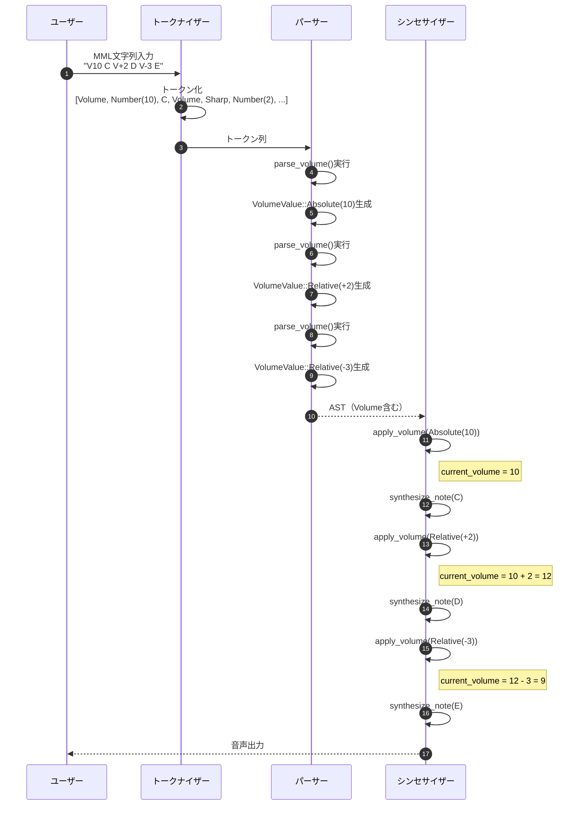
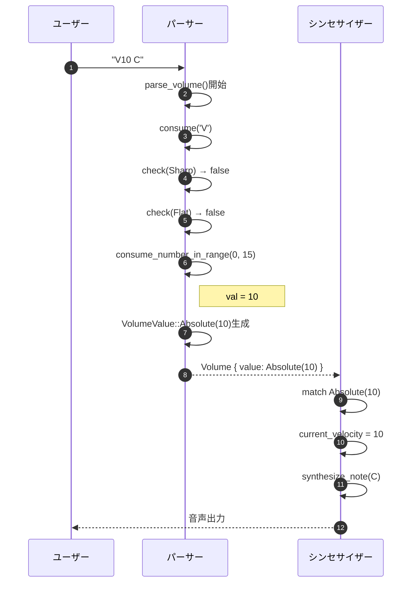
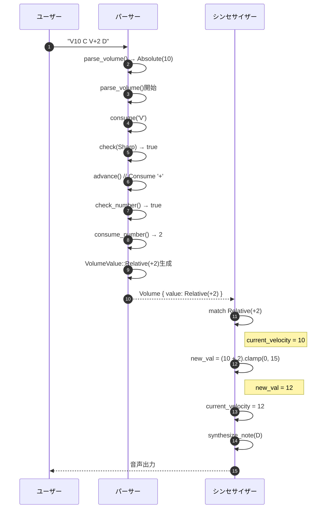
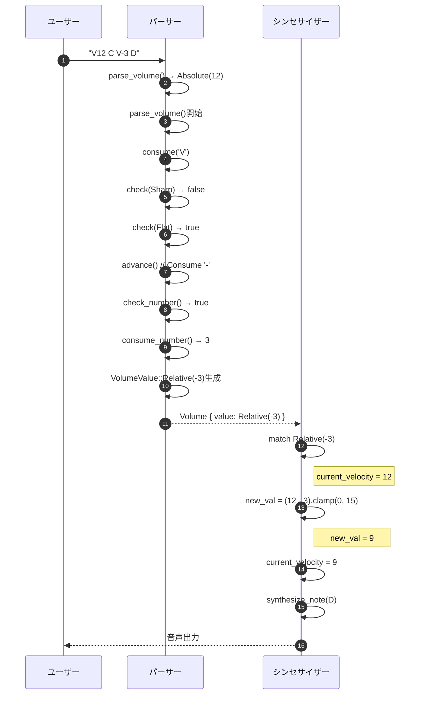
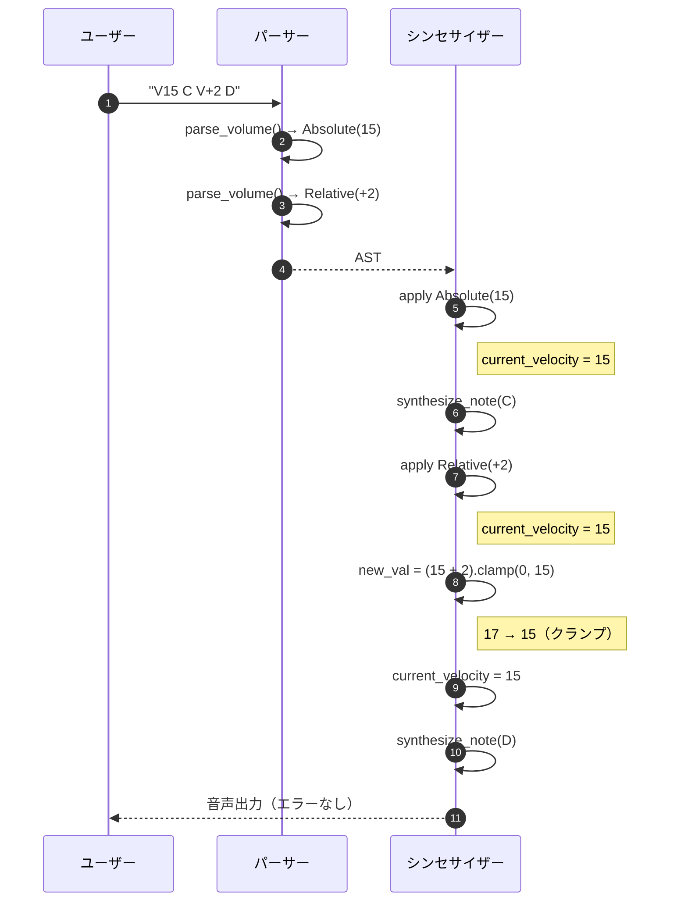
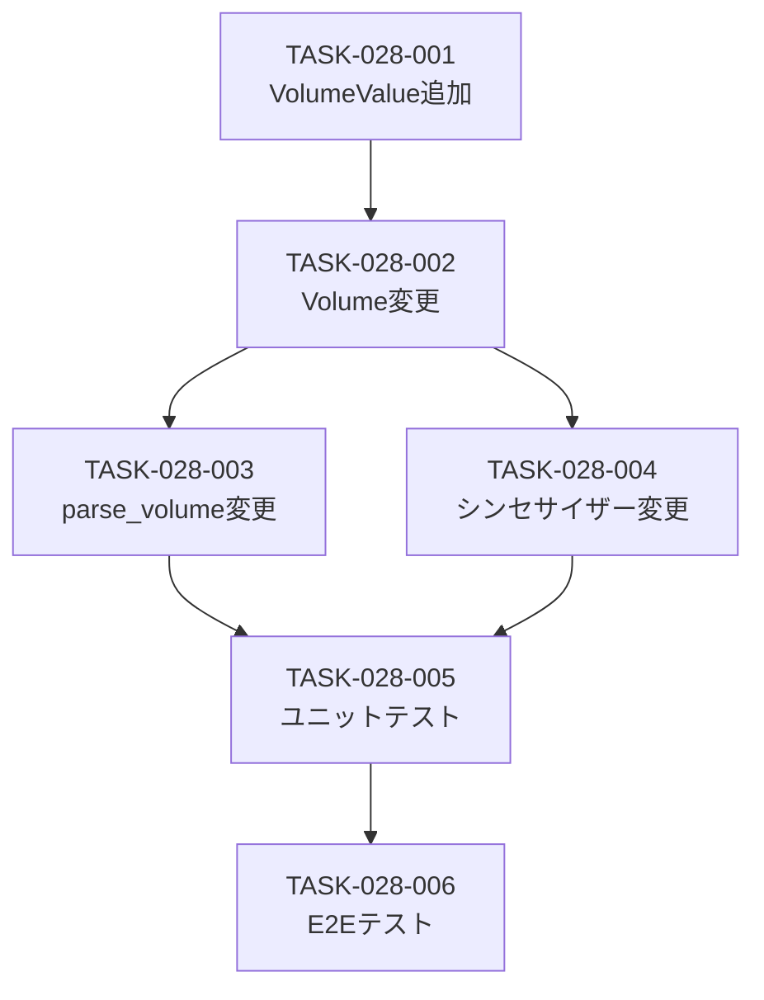

# 相対ボリューム指定 詳細設計書

## メタ情報

| 項目 | 内容 |
|------|------|
| ドキュメントID | DET-VOL-001 |
| 機能ID | F-028 |
| 機能名 | 相対ボリューム指定 |
| 関連基本設計書 | [BASIC-CLI-004](../../basic/BASIC-CLI-004_MML-Advanced-Features.md) |
| 関連要件定義書 | REQ-CLI-004 |
| バージョン | 1.0.0 |
| 作成日 | 2026-01-12 |
| 最終更新日 | 2026-01-12 |
| 作成者 | detailed-design-writer |

---

## 1. 概要

### 1.1 機能概要

相対ボリューム指定機能は、既存のボリューム（V0-V15）に相対指定機能を追加し、音量の動的な増減を可能にする機能です。従来は絶対値（`V10`等）のみでしたが、相対値（`V+2`, `V-3`）を使用することで、現在のボリュームからの増減を簡潔に記述できます。

**主な機能**:
- 絶対値指定: `V10` → ボリュームを10に設定（既存仕様維持）
- 相対値指定（増加）: `V+2` → 現在のボリュームに+2
- 相対値指定（減少）: `V-3` → 現在のボリュームに-3
- デフォルト増減: `V+` → +1、`V-` → -1
- 範囲外の値は0-15にクランプ（エラーにしない）

### 1.2 処理フロー概要



---

## 2. 機能要件

### 2.1 対象機能

| 機能ID | 機能名 | 概要 | 優先度 |
|--------|--------|------|--------|
| F-028 | 相対ボリューム指定 | 既存V0-V15に相対指定（V+n, V-n）を追加 | 必須 |

### 2.2 ビジネスルール

| ルールID | 内容 | 検証方法 |
|---------|------|---------|
| BR-072 | ボリューム範囲は 0-15（既存仕様を維持） | パーサーで範囲チェック |
| BR-073 | デフォルトはV10（既存仕様を維持） | シンセサイザーで初期値設定 |
| BR-074 | 相対指定 `V+n` は現在値に+n | シンセサイザーで加算処理 |
| BR-075 | 相対指定 `V-n` は現在値に-n | シンセサイザーで減算処理 |
| BR-076 | `V+` または `V-` のみの場合はデフォルト増減値1を使用 | パーサーでデフォルト値設定 |
| BR-077 | 範囲外の値は0-15にクランプ（エラーにしない） | シンセサイザーでクランプ処理 |

---

## 3. 詳細仕様

### 3.1 AST拡張仕様

#### 3.1.1 VolumeValue列挙型の追加

`src/mml/ast.rs`に新しい列挙型`VolumeValue`を追加します。

```rust
#[derive(Debug, Clone, PartialEq, Eq)]
pub enum VolumeValue {
    /// 絶対値（0-15）
    Absolute(u8),
    /// 相対値（-15〜+15）
    Relative(i8),
}
```

**データ構造の詳細**:

| バリアント | 型 | 説明 | 制約 |
|-----------|-----|------|------|
| `Absolute(u8)` | `u8` | 絶対値（0-15） | 0 ≤ value ≤ 15 |
| `Relative(i8)` | `i8` | 相対値（-15〜+15） | -15 ≤ value ≤ +15 |

**メモリレイアウト**:
- 列挙型のタグ: 1バイト
- 値: 1バイト（u8またはi8）
- 合計: 2バイト（パディング含む）

#### 3.1.2 Volume構造体の変更

`src/mml/ast.rs`の`Volume`構造体を変更します。

**変更前**:
```rust
#[derive(Debug, Clone, PartialEq, Eq)]
pub struct Volume {
    pub value: u8,
}
```

**変更後**:
```rust
#[derive(Debug, Clone, PartialEq, Eq)]
pub struct Volume {
    /// 絶対値（0-15）または相対値（-15〜+15）
    pub value: VolumeValue,
}
```

### 3.2 パーサー拡張仕様

#### 3.2.1 parse_volume関数の変更

`src/mml/parser.rs`の`parse_volume()`関数を変更します。

**変更前**:
```rust
fn parse_volume(&mut self) -> Result<Volume, ParseError> {
    self.advance(); // Consume Volume
    // Range 0-15 verified, safe to cast to u8
    #[allow(clippy::cast_possible_truncation)]
    let value = self.consume_number_in_range(0, 15)? as u8;
    Ok(Volume { value })
}
```

**変更後**:
```rust
/// ボリュームコマンドを解析（絶対値/相対値対応）
///
/// # 構文
/// - `V<0-15>` - 絶対値指定
/// - `V+<n>` - 相対値指定（増加）
/// - `V-<n>` - 相対値指定（減少）
/// - `V+` - デフォルト増加（+1）
/// - `V-` - デフォルト減少（-1）
///
/// # エラー
/// - `InvalidVolume` - 絶対値が範囲外（0-15以外）
///
/// # 注意
/// - 相対値の範囲チェックはシンセサイザー側で実施（クランプ処理）
fn parse_volume(&mut self) -> Result<Volume, ParseError> {
    self.advance(); // Consume 'V'
    
    // 相対指定のチェック
    let value = if self.check(Token::Sharp) {
        // V+ の場合（Sharpトークンを流用）
        self.advance(); // Consume '+'
        let delta = if self.check_number() {
            // オーバーフロー防止: 15を上限としてクランプしてからキャスト
            let raw = self.consume_number()?;
            raw.min(15) as i8
        } else {
            1  // デフォルト増減値
        };
        VolumeValue::Relative(delta)
    } else if self.check(Token::Flat) {
        // V- の場合（Flatトークンを流用）
        self.advance(); // Consume '-'
        let delta = if self.check_number() {
            // オーバーフロー防止: 15を上限としてクランプしてからキャスト
            let raw = self.consume_number()?;
            -(raw.min(15) as i8)
        } else {
            -1  // デフォルト増減値
        };
        VolumeValue::Relative(delta)
    } else {
        // 絶対値
        let val = self.consume_number_in_range(0, 15)?;
        #[allow(clippy::cast_possible_truncation)]
        VolumeValue::Absolute(val as u8)
    };
    
    Ok(Volume { value })
}

/// 次のトークンがNumberかチェック
fn check_number(&self) -> bool {
    matches!(self.peek().token, Token::Number(_))
}

/// 次のトークンが指定されたトークンかチェック
fn check(&self, token: Token) -> bool {
    std::mem::discriminant(&self.peek().token) == std::mem::discriminant(&token)
}

/// 数値を消費（範囲チェックなし）
fn consume_number(&mut self) -> Result<u16, ParseError> {
    let token_with_pos = self.peek();
    if let Token::Number(val) = token_with_pos.token {
        self.advance();
        Ok(val)
    } else {
        Err(ParseError::UnexpectedToken {
            expected: "number".to_string(),
            found: token_with_pos.token.clone(),
            position: token_with_pos.position,
        })
    }
}
```

**実装のポイント**:
- `+`と`-`は既存の`Token::Sharp`と`Token::Flat`を流用
- `V+`または`V-`のみの場合はデフォルト増減値1を使用
- 絶対値の範囲チェックは既存の`consume_number_in_range()`を使用
- 相対値の数値は`min(15)`でクランプしてからi8にキャスト（オーバーフロー防止）
- 最終的なクランプ処理はシンセサイザー側で実施

### 3.3 シンセサイザー拡張仕様

#### 3.3.1 ボリューム処理の変更

`src/audio/synthesizer.rs`の`synthesize()`関数内で、ボリューム処理を変更します。

> **注意**: 現在のシンセサイザーでは`current_velocity`はローカル変数として管理されている（構造体ではない）。本設計もその方式を維持する。

**変更前**:
```rust
Command::Volume(v) => current_velocity = v.value,
```

**変更後**:
```rust
Command::Volume(v) => {
    current_velocity = match v.value {
        VolumeValue::Absolute(val) => val,
        VolumeValue::Relative(delta) => {
            let new_val = (current_velocity as i8 + delta).clamp(0, 15);
            new_val as u8
        }
    };
}
```

**実装のポイント**:
- 絶対値の場合は直接設定
- 相対値の場合は現在値に加算/減算し、0-15にクランプ
- `i8::clamp()`を使用して範囲制限

---

## 4. 処理フロー

### 4.1 絶対値指定の処理フロー



### 4.2 相対値指定（増加）の処理フロー



### 4.3 相対値指定（減少）の処理フロー



### 4.4 クランプ処理の処理フロー



---

## 5. エラーハンドリング

### 5.1 エラーケース一覧

| エラーケース | エラー型 | 検出タイミング | メッセージ例 |
|-------------|---------|--------------|-------------|
| 絶対値が範囲外（16以上） | `InvalidNumber` | `parse_volume()`で絶対値解析時 | `Invalid number at position 2\nFound: 20\nExpected: 0-15` |
| 絶対値が範囲外（負の値） | `InvalidNumber` | `parse_volume()`で絶対値解析時 | `Invalid number at position 2\nFound: -5\nExpected: 0-15` |

### 5.2 エラーメッセージの設計

#### 5.2.1 エラーメッセージの構成

全てのエラーメッセージは以下の構成を持ちます：

1. **エラー概要**: 何が問題か
2. **位置情報**: `position X`
3. **詳細情報**: `Found: X`, `Expected: Y`

#### 5.2.2 エラーメッセージ例

**絶対値が範囲外の場合**:
```
Error: Invalid number at position 2
Found: 20
Expected: 0-15 (volume must be 0-15)
```

### 5.3 クランプ処理（エラーにしない）

相対値指定で範囲外になった場合は、エラーにせず0-15にクランプします。

| 入力 | 現在値 | 計算結果 | クランプ後 |
|------|--------|---------|----------|
| `V+5` | 12 | 17 | 15 |
| `V-10` | 5 | -5 | 0 |
| `V+` | 15 | 16 | 15 |
| `V-` | 0 | -1 | 0 |

**理由**:
- ユーザーの意図を尊重（音量を上げたい/下げたい）
- エラーで中断するよりも、最大/最小値で継続する方が実用的
- 既存のオクターブ変更（`OctaveUp`, `OctaveDown`）と同じ挙動

---

## 6. テストケース

### 6.1 正常系テストケース

| テストID | 入力 | 期待される動作 | 説明 |
|---------|------|--------------|------|
| TC-028-001 | `V10 C` | ボリューム10で再生 | 絶対値指定（既存仕様維持） |
| TC-028-002 | `V10 C V+2 D` | C: V10, D: V12 | 相対値指定（増加） |
| TC-028-003 | `V10 C V-3 D` | C: V10, D: V7 | 相対値指定（減少） |
| TC-028-004 | `V10 C V+ D` | C: V10, D: V11 | デフォルト増加（+1） |
| TC-028-005 | `V10 C V- D` | C: V10, D: V9 | デフォルト減少（-1） |
| TC-028-006 | `V15 C V+2 D` | C: V15, D: V15 | 上限クランプ（15） |
| TC-028-007 | `V0 C V-2 D` | C: V0, D: V0 | 下限クランプ（0） |
| TC-028-008 | `V5 C V+10 D V-8 E` | C: V5, D: V15, E: V7 | 複数の相対値指定 |

### 6.2 異常系テストケース

| テストID | 入力 | 期待されるエラー | エラーメッセージ |
|---------|------|----------------|----------------|
| TC-028-101 | `V20 C` | `InvalidNumber` | `Invalid number at position 1\nFound: 20\nExpected: 0-15` |
| TC-028-102 | `V-5 C` | `InvalidNumber` | `Invalid number at position 1\nFound: -5\nExpected: 0-15` |

### 6.3 エッジケーステストケース

| テストID | 入力 | 期待される動作 | 説明 |
|---------|------|--------------|------|
| TC-028-201 | `V0 C` | ボリューム0で再生 | 最小値（無音） |
| TC-028-202 | `V15 C` | ボリューム15で再生 | 最大値 |
| TC-028-203 | `V10 C V+5 D V-15 E` | C: V10, D: V15, E: V0 | 極端な相対値 |
| TC-028-204 | `V+ V+ V+ C` | ボリューム13で再生 | 連続した相対値指定 |
| TC-028-205 | `C V10 D` | C: V10（デフォルト）, D: V10 | ボリューム指定前の音符 |

### 6.4 統合テストケース

| テストID | 入力 | 期待される動作 | 説明 |
|---------|------|--------------|------|
| TC-028-301 | `T120 L4 V10 C V+2 D V-3 E` | 正常に音声再生 | テンポ・音長指定付き |
| TC-028-302 | `O5 V10 C V+ D V- E` | 正常に音声再生 | オクターブ変更を含む |
| TC-028-303 | `[V10 C V+ D]3` | 正常に音声再生 | ループ構文と組み合わせ |
| TC-028-304 | `V10 C4 V+2 D8 V-3 E4.` | 正常に音声再生 | 音長・付点付き |

### 6.5 テスト実装例

```rust
// tests/unit/mml_parser_volume_test.rs

use sine_mml::mml::{parse, Command, VolumeValue, Volume};

#[test]
fn test_volume_absolute() {
    let input = "V10 C";
    let mml = parse(input).unwrap();
    
    assert_eq!(mml.commands.len(), 2);
    assert!(matches!(
        mml.commands[0],
        Command::Volume(Volume { value: VolumeValue::Absolute(10) })
    ));
}

#[test]
fn test_volume_relative_increase() {
    let input = "V10 C V+2 D";
    let mml = parse(input).unwrap();
    
    assert!(matches!(
        mml.commands[0],
        Command::Volume(Volume { value: VolumeValue::Absolute(10) })
    ));
    assert!(matches!(
        mml.commands[2],
        Command::Volume(Volume { value: VolumeValue::Relative(2) })
    ));
}

#[test]
fn test_volume_relative_decrease() {
    let input = "V10 C V-3 D";
    let mml = parse(input).unwrap();
    
    assert!(matches!(
        mml.commands[2],
        Command::Volume(Volume { value: VolumeValue::Relative(-3) })
    ));
}

#[test]
fn test_volume_default_increase() {
    let input = "V10 C V+ D";
    let mml = parse(input).unwrap();
    
    assert!(matches!(
        mml.commands[2],
        Command::Volume(Volume { value: VolumeValue::Relative(1) })
    ));
}

#[test]
fn test_volume_default_decrease() {
    let input = "V10 C V- D";
    let mml = parse(input).unwrap();
    
    assert!(matches!(
        mml.commands[2],
        Command::Volume(Volume { value: VolumeValue::Relative(-1) })
    ));
}

#[test]
fn test_volume_clamp_upper() {
    // シンセサイザーのテスト
    let input = "V15 C V+2 D";
    let mml = parse(input).unwrap();
    
    // パース成功を確認
    assert!(mml.commands.len() > 0);
    
    // シンセサイザーでクランプされることを確認
    // （実際のシンセサイザーテストで検証）
}

#[test]
fn test_volume_clamp_lower() {
    // シンセサイザーのテスト
    let input = "V0 C V-2 D";
    let mml = parse(input).unwrap();
    
    // パース成功を確認
    assert!(mml.commands.len() > 0);
    
    // シンセサイザーでクランプされることを確認
    // （実際のシンセサイザーテストで検証）
}

#[test]
fn test_volume_invalid_absolute() {
    let input = "V20 C";
    let result = parse(input);
    
    assert!(result.is_err());
    // エラーメッセージの検証
}
```

---

## 7. 非機能要件

### 7.1 性能要件

| ID | 要件 | 目標値 | 測定方法 |
|----|------|--------|---------|
| NFR-P-014 | ボリューム計算のオーバーヘッド | 1%以内（合成時間の） | ベンチマークテスト |
| NFR-P-015 | 相対値計算の時間計算量 | O(1) | 理論的解析 |
| NFR-P-016 | メモリ使用量 | 2バイト/Volume（既存と同じ） | メモリプロファイラ |

### 7.2 可用性要件

| ID | 要件 | 詳細 |
|----|------|------|
| NFR-A-009 | エラーハンドリング | 不正なボリューム値でクラッシュしない |
| NFR-A-010 | 後方互換性 | 既存のMML文字列が正常に動作 |
| NFR-A-011 | クランプ処理 | 範囲外の値は0-15にクランプ（エラーにしない） |

### 7.3 セキュリティ要件

| ID | 要件 | 詳細 |
|----|------|------|
| NFR-S-012 | 整数オーバーフロー防止 | `i8::clamp()`で安全に範囲制限 |
| NFR-S-013 | 入力値検証 | 絶対値は0-15の範囲内 |

### 7.4 保守性要件

| ID | 要件 | 詳細 |
|----|------|------|
| NFR-M-014 | テストカバレッジ | ボリューム関連コードは100%カバー |
| NFR-M-015 | コードの可読性 | 関数は50行以内、コメント充実 |
| NFR-M-016 | 既存コードへの影響 | 最小限の変更（AST、パーサー、シンセサイザーのみ） |

---

## 8. 実装タスク分割

### 8.1 タスク一覧

| タスクID | タスク名 | 対象ファイル | 見積もり行数 | 優先度 |
|---------|---------|------------|------------|--------|
| TASK-028-001 | VolumeValue列挙型追加 | `src/mml/ast.rs` | 10行 | 高 |
| TASK-028-002 | Volume構造体変更 | `src/mml/ast.rs` | 5行 | 高 |
| TASK-028-003 | parse_volume()変更 | `src/mml/parser.rs` | 50行 | 高 |
| TASK-028-004 | シンセサイザー変更 | `src/audio/synthesizer.rs` | 20行 | 高 |
| TASK-028-005 | ユニットテスト実装 | `tests/unit/mml_parser_volume_test.rs` | 150行 | 高 |
| TASK-028-006 | E2Eテスト実装 | `tests/cli_integration.rs` | 50行 | 中 |

**合計見積もり**: 285行（200行以下のルールを満たすため、複数のPRに分割）

### 8.2 実装順序

#### Phase 1: AST拡張（TASK-028-001〜002）
- VolumeValue列挙型追加、Volume構造体変更
- 見積もり: 15行
- 所要時間: 0.5日

#### Phase 2: パーサー・シンセサイザー実装（TASK-028-003〜004）
- parse_volume()変更、シンセサイザー変更
- 見積もり: 70行
- 所要時間: 1日

#### Phase 3: テスト実装（TASK-028-005〜006）
- ユニットテスト、E2Eテスト
- 見積もり: 200行
- 所要時間: 1日

### 8.3 依存関係



---

## 9. 関連ドキュメント

| ドキュメント | パス | 説明 |
|-------------|------|------|
| バックエンド設計書 | [バックエンド設計書.md](./バックエンド設計書.md) | 相対ボリューム指定のバックエンド設計 |
| 基本設計書 | [BASIC-CLI-004](../../basic/BASIC-CLI-004_MML-Advanced-Features.md) | MML高度な機能拡張の基本設計 |
| 要件定義書 | REQ-CLI-004 | MML高度な機能拡張の要件定義 |
| 既存パーサー実装 | `src/mml/parser.rs` | 既存のMMLパーサー |
| 既存AST定義 | `src/mml/ast.rs` | 既存のAST定義 |
| 既存シンセサイザー実装 | `src/audio/synthesizer.rs` | 既存のシンセサイザー |

---

## 変更履歴

| 日付 | バージョン | 変更内容 | 担当者 |
|:---|:---|:---|:---|
| 2026-01-12 | 1.0.0 | 初版作成 | detailed-design-writer |
