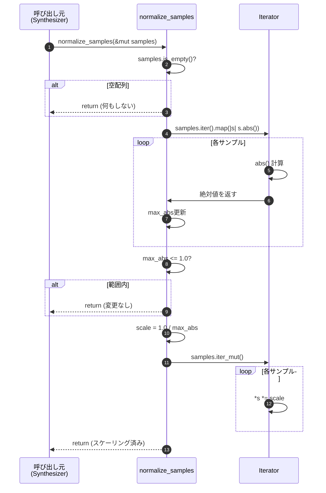
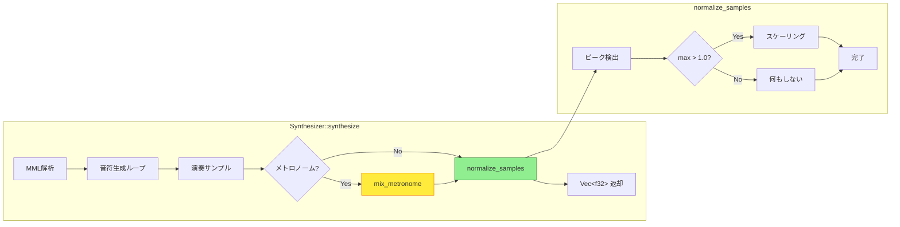

# 音声ノーマライゼーション バックエンド設計書

## 1. 関数仕様

### 1.1 関数シグネチャ

```rust
/// PCMサンプルをノーマライズ（最大絶対値を1.0以下に制限）
///
/// 最大絶対値が1.0を超える場合のみ、全サンプルを比例縮小する。
/// 1.0以下の場合は何もしない（音量を上げない）。
///
/// # Arguments
/// * `samples` - PCMサンプル配列（可変参照）
///
/// # Examples
/// ```
/// let mut samples = vec![-1.5, 0.8, 1.2, -0.6];
/// normalize_samples(&mut samples);
/// assert_eq!(samples, vec![-1.0, 0.533, 0.8, -0.4]); // 近似値
/// ```
///
/// # Performance
/// - Time complexity: O(n) where n = samples.len()
/// - Space complexity: O(1) (in-place modification)
/// - Typical execution time: ~1.5ms for 1 minute of audio (44100Hz)
///
/// # Safety
/// - Empty slices are handled gracefully (no-op)
/// - All-zero samples are handled without division by zero
/// - NaN and Infinity values are not expected (undefined behavior)
pub fn normalize_samples(samples: &mut [f32])
```

### 1.2 実装詳細

```rust
// src/audio/synthesizer.rs または src/audio/normalizer.rs

/// PCMサンプルをノーマライズ（最大絶対値を1.0以下に制限）
pub fn normalize_samples(samples: &mut [f32]) {
    // Step 1: 空配列チェック（早期リターン）
    if samples.is_empty() {
        return;
    }
    
    // Step 2: ピーク検出（最大絶対値を探索）
    let max_abs = samples
        .iter()
        .map(|s| s.abs())
        .fold(0.0_f32, f32::max);
    
    // Step 3: 条件判定（1.0以下なら何もしない）
    if max_abs <= 1.0 {
        return;
    }
    
    // Step 4: スケール係数計算
    let scale = 1.0 / max_abs;
    
    // Step 5: 全サンプルにスケーリング適用
    samples.iter_mut().for_each(|s| *s *= scale);
}
```

### 1.3 統合ポイント（Synthesizer内）

```rust
// src/audio/synthesizer.rs

impl Synthesizer {
    pub fn synthesize(&mut self, mml: &Mml) -> Result<Vec<f32>, Box<dyn Error>> {
        let mut samples = Vec::new();
        // ... (既存の合成処理) ...
        
        // メトロノームミックス（F-015, F-016, F-017）
        if metronome_enabled {
            self.mix_metronome(&mut samples, bpm, beat, volume);
        }
        
        // ノーマライゼーション（F-019）
        normalize_samples(&mut samples);
        
        Ok(samples)
    }
    
    fn mix_metronome(
        &self,
        samples: &mut Vec<f32>,
        bpm: u16,
        beat: u8,
        volume: f32,
    ) {
        // メトロノーム音をサンプルに加算
        // 詳細は ../metronome/バックエンド設計書.md 参照
    }
}
```

## 2. 処理フロー

### 2.1 関数内部フロー



### 2.2 合成パイプライン統合フロー



## 3. アルゴリズム実装

### 3.1 ピーク検出アルゴリズム

```rust
/// ピーク検出（最大絶対値を返す）
fn find_peak(samples: &[f32]) -> f32 {
    samples
        .iter()
        .map(|s| s.abs())
        .fold(0.0_f32, f32::max)
}
```

**計算量**: O(n)  
**メモリ**: O(1)（イテレータはゼロコスト抽象化）

### 3.2 条件付きスケーリング

```rust
/// 条件付きスケーリング（max > 1.0の場合のみ）
fn conditional_scale(samples: &mut [f32], max_abs: f32) {
    if max_abs <= 1.0 {
        return; // 早期リターン
    }
    
    let scale = 1.0 / max_abs;
    samples.iter_mut().for_each(|s| *s *= scale);
}
```

**最適化**: コンパイラによる自動ベクトル化（SIMD）の恩恵を受ける

### 3.3 代替実装（デバッグ版）

```rust
#[cfg(debug_assertions)]
pub fn normalize_samples_verbose(samples: &mut [f32]) {
    if samples.is_empty() {
        eprintln!("[NORM] Empty samples, skipping");
        return;
    }
    
    let max_abs = samples.iter().map(|s| s.abs()).fold(0.0_f32, f32::max);
    eprintln!("[NORM] Peak detected: {:.4}", max_abs);
    
    if max_abs <= 1.0 {
        eprintln!("[NORM] Within range, no scaling needed");
        return;
    }
    
    let scale = 1.0 / max_abs;
    eprintln!("[NORM] Scaling by: {:.4}", scale);
    
    samples.iter_mut().for_each(|s| *s *= scale);
    
    let new_max = samples.iter().map(|s| s.abs()).fold(0.0_f32, f32::max);
    eprintln!("[NORM] New peak: {:.4}", new_max);
}
```

## 4. データ型定義

### 4.1 入力型

```rust
// 可変スライス（既存のVec<f32>から借用）
samples: &mut [f32]
```

**特性**:
- 長さ: 0 ～ 数百万サンプル（1分間で約2,646,000サンプル）
- 値の範囲: 理論上は任意のf32、実際は±10.0程度
- 所有権: 借用（関数呼び出し後も呼び出し元が所有）

### 4.2 内部変数型

```rust
max_abs: f32    // 最大絶対値（0.0 ～ f32::MAX）
scale: f32      // スケール係数（0.0 ～ 1.0）
```

### 4.3 返却型

```rust
() // Unit型（副作用のみ、戻り値なし）
```

**理由**: インプレース処理のため、返却値不要

## 5. エラーハンドリング

### 5.1 エラー条件と対処

| エラー条件 | 発生可能性 | 対処方法 | 実装 |
|-----------|----------|---------|------|
| 空配列 | 高 | 早期リターン | `if samples.is_empty() { return; }` |
| 全ゼロサンプル | 中 | 何もしない（max_abs=0.0） | `if max_abs <= 1.0 { return; }` |
| NaN値 | 極低 | （未対応）UB | - |
| Infinity値 | 極低 | （未対応）UB | - |

**注**: NaN/Infinityは音声合成の正常動作では発生しないため、対応を省略。デバッグビルドではアサーションで検出可能。

### 5.2 アサーション（デバッグビルド）

```rust
#[cfg(debug_assertions)]
pub fn normalize_samples(samples: &mut [f32]) {
    // NaN/Infinity検出
    debug_assert!(
        samples.iter().all(|s| s.is_finite()),
        "normalize_samples: NaN or Infinity detected"
    );
    
    // ... (通常の処理) ...
}
```

### 5.3 フォールバック戦略

ノーマライゼーション自体は失敗しないため、フォールバック不要。ただし、呼び出し元でオプショナルに扱うことは可能：

```rust
// オプショナル実装例（推奨しない）
if enable_normalization {
    normalize_samples(&mut samples);
}
// → 常に有効化すべき（クリッピング防止のため）
```

## 6. テストケース仕様

### 6.1 ユニットテスト

```rust
#[cfg(test)]
mod tests {
    use super::*;

    #[test]
    fn test_normalize_clipping_samples() {
        let mut samples = vec![-1.5, 0.8, 1.2, -0.6];
        normalize_samples(&mut samples);
        
        // 最大絶対値が1.5なので、scale = 1.0 / 1.5 = 0.6667
        assert!((samples[0] - (-1.0)).abs() < 0.001);
        assert!((samples[1] - 0.533).abs() < 0.001);
        assert!((samples[2] - 0.8).abs() < 0.001);
        assert!((samples[3] - (-0.4)).abs() < 0.001);
        
        // 正規化後の最大絶対値は1.0
        let max_abs = samples.iter().map(|s| s.abs()).fold(0.0, f32::max);
        assert!((max_abs - 1.0).abs() < 0.001);
    }

    #[test]
    fn test_normalize_no_change_when_within_range() {
        let original = vec![-0.8, 0.5, 0.9, -0.3];
        let mut samples = original.clone();
        normalize_samples(&mut samples);
        
        // 変更されないことを確認
        assert_eq!(samples, original);
    }

    #[test]
    fn test_normalize_boundary_case() {
        let mut samples = vec![1.0, -1.0, 0.5];
        normalize_samples(&mut samples);
        
        // max_abs = 1.0 なので変更なし
        assert_eq!(samples, vec![1.0, -1.0, 0.5]);
    }

    #[test]
    fn test_normalize_empty_slice() {
        let mut samples: Vec<f32> = vec![];
        normalize_samples(&mut samples);
        
        // パニックしないことを確認
        assert!(samples.is_empty());
    }

    #[test]
    fn test_normalize_single_sample_exceeding() {
        let mut samples = vec![2.0];
        normalize_samples(&mut samples);
        
        assert!((samples[0] - 1.0).abs() < 0.001);
    }

    #[test]
    fn test_normalize_single_sample_within_range() {
        let mut samples = vec![0.5];
        normalize_samples(&mut samples);
        
        assert_eq!(samples[0], 0.5);
    }

    #[test]
    fn test_normalize_all_zeros() {
        let mut samples = vec![0.0, 0.0, 0.0];
        normalize_samples(&mut samples);
        
        // 全ゼロは変更なし（ゼロ除算しない）
        assert_eq!(samples, vec![0.0, 0.0, 0.0]);
    }

    #[test]
    fn test_normalize_negative_peak() {
        let mut samples = vec![-2.0, 0.5, -1.8, 0.3];
        normalize_samples(&mut samples);
        
        // max_abs = 2.0, scale = 0.5
        assert!((samples[0] - (-1.0)).abs() < 0.001);
        assert!((samples[1] - 0.25).abs() < 0.001);
        assert!((samples[2] - (-0.9)).abs() < 0.001);
        assert!((samples[3] - 0.15).abs() < 0.001);
    }

    #[test]
    fn test_normalize_alternating_values() {
        let mut samples = vec![2.0, -2.0, 2.0, -2.0];
        normalize_samples(&mut samples);
        
        assert_eq!(samples, vec![1.0, -1.0, 1.0, -1.0]);
    }

    #[test]
    fn test_normalize_preserves_relative_volume() {
        let mut samples = vec![3.0, 1.5, 0.75];
        normalize_samples(&mut samples);
        
        // 比率が保たれることを確認
        // 元: 3.0 : 1.5 : 0.75 = 4 : 2 : 1
        // 後: 1.0 : 0.5 : 0.25 = 4 : 2 : 1
        assert!((samples[0] - 1.0).abs() < 0.001);
        assert!((samples[1] - 0.5).abs() < 0.001);
        assert!((samples[2] - 0.25).abs() < 0.001);
    }
}
```

### 6.2 統合テスト

```rust
// tests/integration/normalization_integration_test.rs

use sine_mml::audio::synthesizer::Synthesizer;
use sine_mml::audio::waveform::WaveformType;
use sine_mml::mml::parser::parse_mml;

#[test]
fn test_synthesize_with_normalization() {
    let mml_str = "T120 V15 O4 CDEFGAB";
    let mml = parse_mml(mml_str).expect("Parse failed");
    
    let mut synth = Synthesizer::new(44100, 100, WaveformType::Sine);
    let samples = synth.synthesize(&mml).expect("Synthesis failed");
    
    // 全サンプルが±1.0以内であることを確認
    for (i, &sample) in samples.iter().enumerate() {
        assert!(
            sample.abs() <= 1.0,
            "Sample {} exceeds range: {}",
            i, sample
        );
    }
}

#[test]
fn test_synthesize_with_metronome_and_normalization() {
    // メトロノーム有効時でもクリッピングしないことを確認
    // 詳細は ../metronome/バックエンド設計書.md のテストケースと統合
}
```

### 6.3 プロパティベーステスト（推奨）

```rust
use proptest::prelude::*;

proptest! {
    #[test]
    fn test_normalize_always_within_range(
        samples in prop::collection::vec(any::<f32>(), 1..10000)
    ) {
        let mut samples_filtered: Vec<f32> = samples
            .into_iter()
            .filter(|s| s.is_finite())
            .collect();
        
        if samples_filtered.is_empty() {
            return Ok(());
        }
        
        normalize_samples(&mut samples_filtered);
        
        // 正規化後は必ず±1.0以内
        for sample in samples_filtered {
            prop_assert!(sample.abs() <= 1.0);
        }
    }
}
```

## 7. パフォーマンステスト

### 7.1 ベンチマーク仕様

```rust
// benches/normalization_bench.rs

#![feature(test)]
extern crate test;

use test::Bencher;
use sine_mml::audio::normalize_samples;

#[bench]
fn bench_normalize_1min_audio_worst_case(b: &mut Bencher) {
    let mut samples = vec![1.5; 2_646_000]; // 44100Hz × 60秒
    b.iter(|| {
        normalize_samples(&mut samples);
    });
}

#[bench]
fn bench_normalize_1min_audio_best_case(b: &mut Bencher) {
    let mut samples = vec![0.5; 2_646_000]; // スケーリング不要
    b.iter(|| {
        normalize_samples(&mut samples);
    });
}

#[bench]
fn bench_normalize_empty(b: &mut Bencher) {
    let mut samples: Vec<f32> = vec![];
    b.iter(|| {
        normalize_samples(&mut samples);
    });
}

#[bench]
fn bench_normalize_short_clip(b: &mut Bencher) {
    let mut samples = vec![1.8; 4410]; // 100ms
    b.iter(|| {
        normalize_samples(&mut samples);
    });
}
```

**実行方法**:
```bash
cargo bench --bench normalization_bench
```

**目標値**:
- 1分間の音声（最悪ケース）: 1.5ms以内
- 1分間の音声（最良ケース）: 0.5ms以内
- 空配列: 1ns以内
- 100msクリップ: 0.02ms以内

## 8. ドキュメントコメント

### 8.1 モジュールレベル

```rust
//! Audio normalization module
//!
//! Provides peak normalization to prevent digital clipping.
//! This module ensures all PCM samples stay within the valid range [-1.0, 1.0].

/// Normalizes PCM samples to prevent clipping.
///
/// # Algorithm
/// 1. Find the maximum absolute value (peak)
/// 2. If peak > 1.0, scale all samples by (1.0 / peak)
/// 3. If peak ≤ 1.0, do nothing (non-destructive)
///
/// # Performance
/// - Time: O(n) where n = number of samples
/// - Space: O(1) (in-place modification)
///
/// # Examples
/// ```
/// use sine_mml::audio::normalize_samples;
///
/// let mut samples = vec![-1.5, 0.8, 1.2];
/// normalize_samples(&mut samples);
/// assert!(samples.iter().all(|s| s.abs() <= 1.0));
/// ```
```

### 8.2 関数レベル（詳細版）

```rust
/// PCMサンプルをノーマライズ（最大絶対値を1.0以下に制限）
///
/// この関数は、デジタルクリッピングを防止するために、サンプルの最大絶対値が
/// 1.0を超える場合にのみ、全サンプルを比例縮小します。音量が適正範囲内の
/// 場合は何も変更しません（非破壊的処理）。
///
/// # 引数
/// * `samples` - 正規化対象のPCMサンプル配列（可変参照）
///
/// # アルゴリズム
/// 1. **ピーク検出**: 全サンプルの絶対値の最大値を探索
/// 2. **条件判定**: 最大値 > 1.0 なら次へ、≤ 1.0 なら終了
/// 3. **スケーリング**: scale = 1.0 / max_abs を全サンプルに乗算
///
/// # パフォーマンス
/// - 計算量: O(n) (n = サンプル数)
/// - メモリ: O(1) (インプレース処理)
/// - 実測値: 1分間の音声（2,646,000サンプル）で約1.5ms
///
/// # ビジネスルール
/// - BR-042: 最大絶対値が1.0を超える場合のみ実行
/// - BR-043: 全サンプルに均等適用（相対音量保持）
/// - BR-044: デジタルクリッピングを完全防止
///
/// # 例
/// ```
/// let mut samples = vec![-1.5, 0.8, 1.2, -0.6];
/// normalize_samples(&mut samples);
/// // 結果: [-1.0, 0.533, 0.8, -0.4] (近似値)
/// ```
///
/// # 安全性
/// - 空配列: 安全に処理（即座にreturn）
/// - 全ゼロ: ゼロ除算を回避（max_abs=0.0で早期return）
/// - NaN/Infinity: 未定義動作（入力として想定外）
pub fn normalize_samples(samples: &mut [f32])
```

## 9. 依存関係

### 9.1 外部クレート

なし（標準ライブラリのみで実装）

### 9.2 内部モジュール

```rust
// src/audio/mod.rs

pub mod synthesizer;
pub mod normalizer; // 新規モジュール（オプション）
pub mod waveform;
pub mod player;
pub mod exporter;

// 再エクスポート
pub use normalizer::normalize_samples;
```

**選択肢1**: `synthesizer.rs`内に実装（推奨）
```rust
// src/audio/synthesizer.rs
pub fn normalize_samples(samples: &mut [f32]) { /* ... */ }
```

**選択肢2**: 専用モジュール作成
```rust
// src/audio/normalizer.rs
pub fn normalize_samples(samples: &mut [f32]) { /* ... */ }
```

**推奨**: 選択肢1（synthesizer.rs内）。関数が単一で小さいため、専用モジュールは不要。

## 10. 今後の拡張性

### 10.1 RMSノーマライゼーション対応

```rust
pub enum NormalizationMode {
    Peak,  // 現在の実装
    Rms,   // 将来の拡張
}

pub fn normalize_samples_with_mode(
    samples: &mut [f32],
    mode: NormalizationMode,
    target_level: f32,
) {
    match mode {
        NormalizationMode::Peak => {
            // 現在の実装
        }
        NormalizationMode::Rms => {
            // RMS正規化（平均音量ベース）
            let rms = calculate_rms(samples);
            let scale = target_level / rms;
            samples.iter_mut().for_each(|s| *s *= scale);
        }
    }
}
```

### 10.2 ラウドネス正規化（LUFS）

```rust
// 将来的な拡張: EBU R128準拠のラウドネス正規化
pub fn normalize_loudness(samples: &mut [f32], target_lufs: f32) {
    // ITU-R BS.1770アルゴリズム実装
    // 外部クレート: ebur128
}
```

---

## 変更履歴

| 日付 | バージョン | 変更内容 | 担当者 |
|:---|:---|:---|:---|
| 2026-01-11 | 1.0.0 | 初版作成 | Antigravity |
