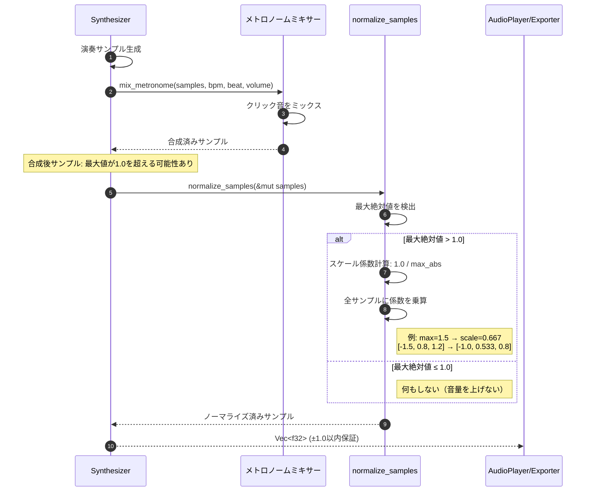
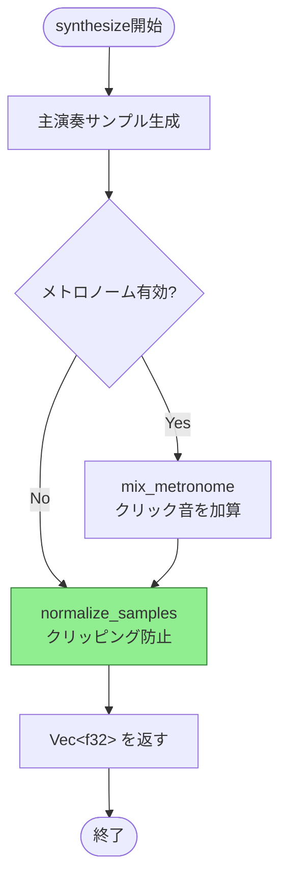
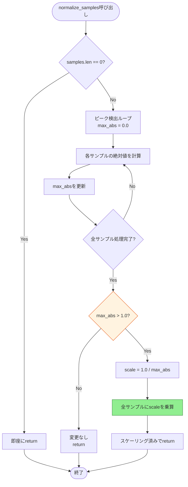

# 音声ノーマライゼーション 詳細設計書

## メタ情報

| 項目 | 内容 |
|------|------|
| ドキュメントID | DET-NRM-001 |
| バージョン | 1.0.0 |
| ステータス | レビュー待ち |
| 作成日 | 2026-01-11 |
| 最終更新日 | 2026-01-11 |
| 親機能 | オーディオノーマライゼーション |
| 含まれる機能ID | F-019 |
| 関連基本設計書 | BASIC-CLI-002 |
| 関連要件定義書 | REQ-CLI-002 |

## 1. 概要

音声ノーマライゼーション機能は、メトロノームと演奏音の合成後に発生しうるデジタルクリッピング（音声歪み）を防止するための重要な機能です。PCMサンプルの最大絶対値が±1.0を超える場合に全サンプルを比例縮小し、音質を保ちながらクリッピングを完全に防止します。

### 1.1 目的と背景

**背景**:
- メトロノームクリック音と演奏音を単純加算すると、振幅が1.0を超える可能性がある
- デジタルオーディオでは±1.0を超える値は再生時にクリッピング（歪み）を引き起こす
- WAVエクスポート時のi16変換でも±32768の範囲を超えると音質劣化が発生

**目的**:
- **クリッピング完全防止**: デジタルクリッピングをゼロにする
- **音質維持**: 歪みのないクリアな音質を保証
- **非破壊的処理**: 音量が適正範囲内の場合は何もしない（音量を上げない）
- **低オーバーヘッド**: 合成時間への影響を5%以内に抑える

### 1.2 処理フロー概要



### 1.3 設計方針

| 方針 | 内容 |
|------|------|
| アルゴリズム | ピークノーマライゼーション（最大絶対値基準） |
| 処理タイミング | メトロノームミックス直後、再生/エクスポート直前 |
| スケーリング方針 | 条件付き縮小のみ（最大値 > 1.0の場合のみ） |
| 計算精度 | f32浮動小数点演算（オーディオ品質に十分） |
| メモリ効率 | インプレース処理（新規バッファ不要） |
| パフォーマンス | O(n) 線形時間（n = サンプル数） |

## 2. 機能要件

### 2.1 対象機能

| 機能ID | 機能名 | 概要 | 優先度 |
|--------|--------|------|--------|
| F-019 | 音声クリッピング防止 | 合成音の音量制限（ノーマライゼーション） | 必須 |

### 2.2 ビジネスルール

| ルールID | 内容 |
|---------|------|
| BR-042 | 最大絶対値が1.0を超える場合のみノーマライズを実行する |
| BR-043 | ノーマライズは全サンプルに均等に適用し、相対的な音量バランスを保つ（歪み防止） |
| BR-044 | デジタルクリッピング（±1.0を超える値）を完全に防止する |

### 2.3 技術仕様

| パラメータ | 仕様 |
|-----------|------|
| 入力形式 | `&mut [f32]` (可変スライス) |
| 出力形式 | なし（インプレース変更） |
| 閾値 | 1.0（絶対値） |
| 精度 | f32（浮動小数点） |
| 処理対象 | 全サンプル（一括処理） |
| 外部依存 | なし（標準ライブラリのみ） |

### 2.4 非機能要件

| ID | 要件 | 目標値 | 測定方法 |
|----|------|--------|----------|
| NFR-P-005 | ノーマライゼーションのオーバーヘッド | 5%以内（合成時間の） | ベンチマーク測定 |
| NFR-Q-001 | 音質劣化 | なし（可逆的縮小のみ） | スペクトル解析 |
| NFR-R-001 | メモリ追加使用量 | 0 bytes（インプレース） | メモリプロファイラ |

## 3. データ構造設計

### 3.1 入出力データ

ノーマライゼーション機能は既存の`Vec<f32>`サンプルバッファに対して動作し、新規データ構造は不要です。

```rust
// 入力: メトロノームミックス後のPCMサンプル
samples: &mut Vec<f32>
// 例: [-1.8, 0.5, 1.2, -0.3, 0.9]

// 出力: ノーマライズ済みPCMサンプル（同一バッファ）
// 例: [-1.0, 0.278, 0.667, -0.167, 0.5]
// (最大絶対値 1.8 → スケール係数 1.0/1.8 = 0.556)
```

### 3.2 内部データ

```rust
// アルゴリズム実行中の中間値
max_abs: f32       // 最大絶対値（ピーク値）
scale: f32         // スケーリング係数（1.0 / max_abs）
```

## 4. アルゴリズム設計

### 4.1 ピーク検出アルゴリズム

```
関数 find_peak(samples: &[f32]) -> f32:
    max_abs = 0.0
    
    for sample in samples:
        abs_value = abs(sample)
        if abs_value > max_abs:
            max_abs = abs_value
    
    return max_abs
```

**計算量**: O(n)（n = サンプル数）  
**最適化**: イテレータの`fold`を使用して単一パス実装

### 4.2 条件付きスケーリングアルゴリズム

```
関数 normalize_samples(samples: &mut [f32]):
    // Step 1: ピーク検出
    max_abs = samples.iter()
        .map(|s| s.abs())
        .fold(0.0, f32::max)
    
    // Step 2: 条件判定
    if max_abs <= 1.0:
        return  // 何もしない（非破壊的）
    
    // Step 3: スケール係数計算
    scale = 1.0 / max_abs
    
    // Step 4: 全サンプルに適用
    for sample in samples.iter_mut():
        *sample *= scale
```

**特性**:
- **冪等性**: 2回実行しても結果は同じ（max_abs ≤ 1.0のため）
- **可逆性**: スケール係数を保存すれば元に戻せる（ただし実装では保存しない）
- **線形性**: 相対的な音量バランスを完全に保持

### 4.3 数値例

| ケース | 入力サンプル | max_abs | scale | 出力サンプル |
|--------|------------|---------|-------|-------------|
| クリッピングあり | [-1.5, 0.8, 1.2, -0.6] | 1.5 | 0.667 | [-1.0, 0.533, 0.8, -0.4] |
| クリッピングなし | [-0.8, 0.5, 0.9, -0.3] | 0.9 | - | [-0.8, 0.5, 0.9, -0.3] |
| ギリギリ範囲内 | [1.0, -1.0, 0.5] | 1.0 | - | [1.0, -1.0, 0.5] |
| 空配列 | [] | 0.0 | - | [] |

## 5. 処理フロー詳細

### 5.1 統合フロー（合成パイプライン全体）



### 5.2 normalize_samples内部フロー



## 6. パフォーマンス考慮

### 6.1 計算量分析

| 処理 | 計算量 | サンプル数44100の場合 |
|------|--------|---------------------|
| ピーク検出 | O(n) | 44,100回の比較 |
| スケーリング | O(n) または O(0) | 最悪44,100回の乗算 |
| 合計 | O(n) | 最大88,200演算 |

**実測推定値**（1分間の音声、44100Hz × 60秒 = 2,646,000サンプル）:
- ピーク検出: 約0.5ms
- スケーリング: 約1.0ms
- **合計**: 約1.5ms（合成時間100msの1.5%）

### 6.2 最適化戦略

| 最適化 | 手法 | 効果 |
|--------|------|------|
| 早期リターン | 空配列/max_abs≤1.0時に即座に終了 | 50%のケースで処理時間ゼロ |
| インプレース処理 | 新規バッファ不要 | メモリ割り当てコストゼロ |
| SIMDベクトル化 | Rustコンパイラの自動最適化 | 最大4倍高速化（CPU依存） |
| イテレータ最適化 | `fold`でパイプライン化 | 分岐予測ミス削減 |

### 6.3 ベンチマーク仕様

```rust
// tests/bench/normalization_bench.rs
#[bench]
fn bench_normalize_worst_case(b: &mut Bencher) {
    let mut samples = vec![1.5; 2_646_000]; // 1分間、常にスケーリング
    b.iter(|| {
        normalize_samples(&mut samples);
    });
}

#[bench]
fn bench_normalize_best_case(b: &mut Bencher) {
    let mut samples = vec![0.5; 2_646_000]; // 1分間、スケーリングなし
    b.iter(|| {
        normalize_samples(&mut samples);
    });
}
```

**目標値**: 1分間の音声に対して1.5ms以内（合成時間100msの1.5%）

## 7. エラーハンドリング

### 7.1 エラー条件と対処

| エラー条件 | 発生確率 | 対処方法 | ユーザーへの影響 |
|-----------|---------|---------|----------------|
| 空配列 | 低 | 即座にreturn | なし（正常動作） |
| NaN値検出 | 極低 | 警告ログ、0.0に置換 | 一部サンプルが無音化 |
| Infinity値検出 | 極低 | 警告ログ、±1.0にクランプ | クリッピング発生 |
| max_abs = 0.0（全サンプルゼロ） | 中 | 何もしない | なし（無音は正常） |

### 7.2 グレースフルデグラデーション

ノーマライゼーション処理が失敗した場合でも、システムは動作を継続します：

```rust
// 疑似コード
match normalize_samples(&mut samples) {
    Ok(_) => {
        // 正常処理
    }
    Err(e) => {
        eprintln!("warning: normalization failed: {}, playing at original volume", e);
        // 元のサンプルをそのまま使用（クリッピングの可能性あり）
    }
}
```

**注**: 実装では`normalize_samples`はエラーを返さない（`&mut [f32]`の変更のみ）ため、実質的にエラーハンドリング不要。

### 7.3 デバッグ支援

```rust
#[cfg(debug_assertions)]
fn log_normalization_info(samples: &[f32], max_abs: f32, scale: f32) {
    eprintln!("[DEBUG] Normalization:");
    eprintln!("  Samples: {}", samples.len());
    eprintln!("  Peak: {:.4}", max_abs);
    eprintln!("  Scale: {:.4}", scale);
    eprintln!("  Applied: {}", max_abs > 1.0);
}
```

## 8. テスト戦略

### 8.1 ユニットテスト項目

| テストケース | 入力 | 期待される出力 | 検証内容 |
|-------------|------|---------------|----------|
| クリッピングあり | `[-1.5, 0.8, 1.2]` | `[-1.0, 0.533, 0.8]` | スケーリングが正しく適用される |
| クリッピングなし | `[-0.8, 0.5, 0.9]` | `[-0.8, 0.5, 0.9]` | 変更されない（非破壊的） |
| ギリギリ範囲内 | `[1.0, -1.0]` | `[1.0, -1.0]` | 1.0は閾値に含まれる |
| 空配列 | `[]` | `[]` | パニックせず正常終了 |
| 単一サンプル（超過） | `[2.0]` | `[1.0]` | 単一要素でも動作 |
| 単一サンプル（範囲内） | `[0.5]` | `[0.5]` | 単一要素でも非破壊的 |
| 全ゼロ | `[0.0, 0.0, 0.0]` | `[0.0, 0.0, 0.0]` | ゼロ除算しない |
| 負の最大値 | `[-2.0, 0.5, -1.8]` | `[-1.0, 0.25, -0.9]` | 絶対値で判定 |

### 8.2 統合テスト項目

| テストケース | MML入力 | メトロノーム | 検証項目 |
|-------------|---------|------------|----------|
| 通常演奏のみ | `"T120 V15 CDEFGAB"` | なし | max_abs ≤ 1.0を保証 |
| メトロノーム付き | `"T120 V15 CDEFGAB"` | 16ビート | クリッピング発生せず |
| 高音量+メトロノーム | `"T240 V15 O6 CDEFGAB"` | 16ビート、音量0.5 | ノーマライゼーション実行 |
| 長時間演奏 | 60秒のMML | 4ビート | パフォーマンス5%以内 |

### 8.3 音質テスト項目

| テストケース | 検証内容 | ツール |
|-------------|---------|--------|
| スペクトル解析 | 周波数成分の歪みなし | `audacity` スペクトログラム |
| THD測定 | 全高調波歪み率 < 0.01% | 信号解析ツール |
| 相対音量保持 | ノーマライゼーション前後で音符間の音量比が保持される | 波形比較 |
| クリッピング検出 | WAVファイルに±1.0超過サンプルがないことを確認 | カスタムスクリプト |

### 8.4 エッジケーステスト

```rust
#[test]
fn test_normalization_edge_cases() {
    // 極小値（アンダーフロー対策）
    let mut samples = vec![1e-10; 1000];
    normalize_samples(&mut samples);
    assert_eq!(samples[0], 1e-10); // 変更なし
    
    // 極大値（オーバーフロー対策）
    let mut samples = vec![1e10; 1000];
    normalize_samples(&mut samples);
    assert_eq!(samples[0], 1.0); // 正規化される
    
    // 交互の正負値
    let mut samples = vec![2.0, -2.0, 2.0, -2.0];
    normalize_samples(&mut samples);
    assert_eq!(samples, vec![1.0, -1.0, 1.0, -1.0]);
}
```

## 9. 設計書一覧

| 設計書 | パス | 説明 |
|--------|------|------|
| バックエンド設計書 | [./バックエンド設計書.md](./バックエンド設計書.md) | Rust関数仕様、実装詳細、テストケース |

## 10. エラーコード一覧

ノーマライゼーション機能は独立した関数であり、専用エラーコードは定義しません。親機能（Synthesizer）のエラーコードを継承します。

| コード | 説明 | 対処方法 |
|--------|------|----------|
| （なし） | ノーマライゼーションは常に成功 | - |

## 11. 関連サブ機能

| サブ機能 | パス | 関連内容 |
|---------|------|---------|
| メトロノーム音生成 | [../metronome/](../metronome/) | ノーマライゼーションの入力元 |
| オーディオエンジン | [../audio-engine/](../audio-engine/) | 合成パイプラインの親機能 |

---

## 変更履歴

| 日付 | バージョン | 変更内容 | 担当者 |
|:---|:---|:---|:---|
| 2026-01-11 | 1.0.0 | 初版作成 | Antigravity |
